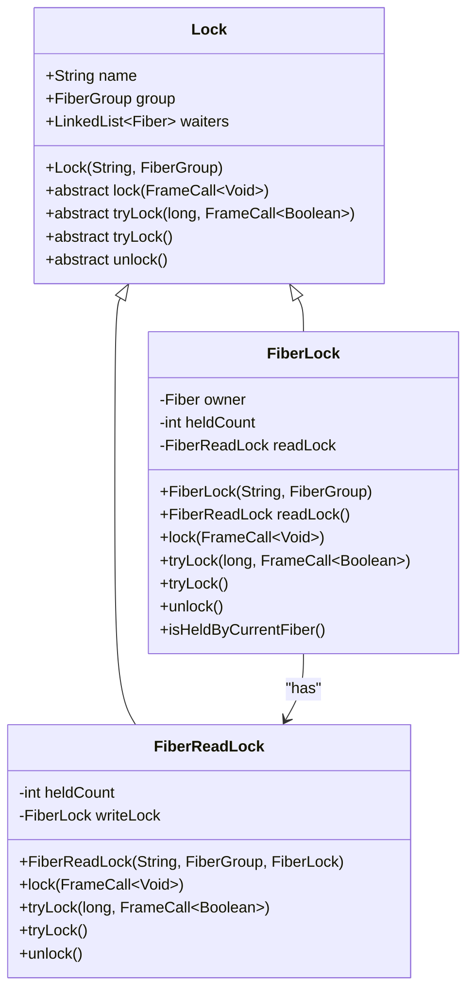
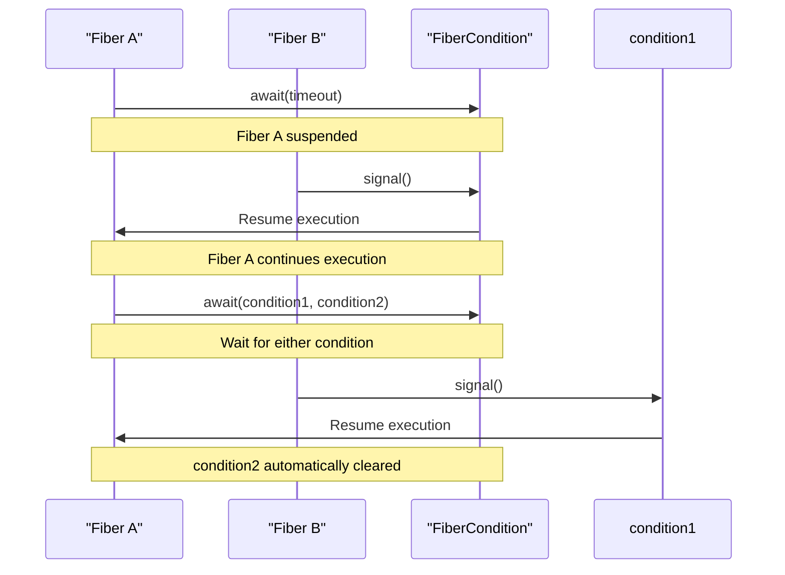
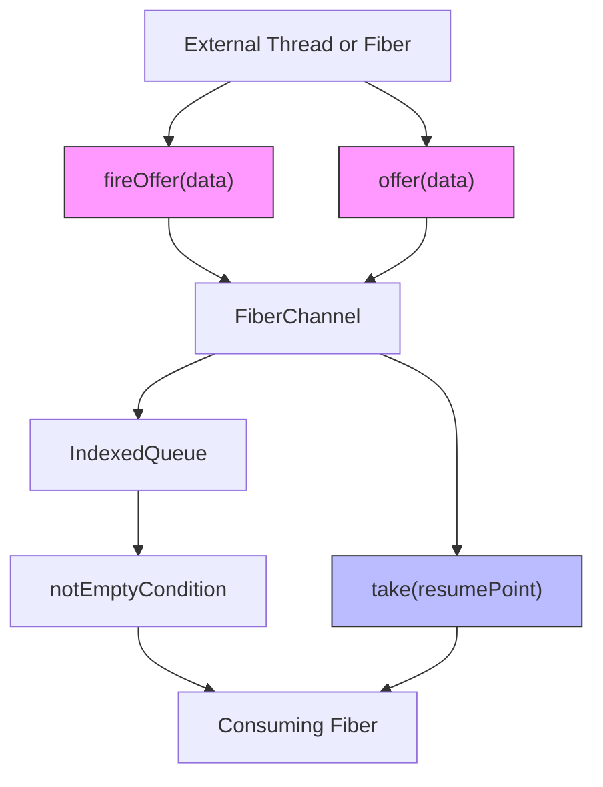

# Fiber Synchronization Primitives

<cite>
**Referenced Files in This Document**   
- [FiberLock.java](file://server/src/main/java/com/github/dtprj/dongting/fiber/FiberLock.java)
- [FiberReadLock.java](file://server/src/main/java/com/github/dtprj/dongting/fiber/FiberReadLock.java)
- [FiberCondition.java](file://server/src/main/java/com/github/dtprj/dongting/fiber/FiberCondition.java)
- [FiberChannel.java](file://server/src/main/java/com/github/dtprj/dongting/fiber/FiberChannel.java)
- [LockTest.java](file://server/src/test/java/com/github/dtprj/dongting/fiber/LockTest.java)
- [ConditionTest.java](file://server/src/test/java/com/github/dtprj/dongting/fiber/ConditionTest.java)
- [ChannelTest.java](file://server/src/test/java/com/github/dtprj/dongting/fiber/ChannelTest.java)
- [WaitSource.java](file://server/src/main/java/com/github/dtprj/dongting/fiber/WaitSource.java)
- [Dispatcher.java](file://server/src/main/java/com/github/dtprj/dongting/fiber/Dispatcher.java)
- [Lock.java](file://server/src/main/java/com/github/dtprj/dongting/fiber/Lock.java)
- [2024_07_16_3000行代码实现fiber.md](file://devlogs/2024_07_16_3000行代码实现fiber.md)
</cite>

## Table of Contents
1. [Introduction](#introduction)
2. [FiberLock and FiberReadLock](#fiberlock-and-fiberreadlock)
3. [FiberCondition](#fibercondition)
4. [FiberChannel](#fiberchannel)
5. [Execution Model and Memory Semantics](#execution-model-and-memory-semantics)
6. [Usage Examples and Best Practices](#usage-examples-and-best-practices)
7. [Concurrency Issues and Performance](#concurrency-issues-and-performance)
8. [Conclusion](#conclusion)

## Introduction

Dongting's fiber synchronization primitives provide a comprehensive concurrency control mechanism designed for the fiber execution model. These primitives enable efficient coordination between fibers within a FiberGroup while maintaining the "concurrent but not parallel" execution model. The synchronization framework includes mutual exclusion locks (FiberLock), read-write locks (FiberReadLock), condition variables (FiberCondition), and thread-safe communication channels (FiberChannel). These components work together to provide a robust foundation for building high-performance concurrent applications without traditional memory barriers.

The fiber execution model in Dongting is designed to minimize the overhead of traditional threading models while providing similar synchronization capabilities. By running fibers cooperatively on a single dispatcher thread, the system avoids the costs associated with context switching and lock contention that plague traditional multi-threaded applications. This document details the implementation and usage of these synchronization primitives, focusing on their unique characteristics within the fiber execution context.

**Section sources**
- [FiberLock.java](file://server/src/main/java/com/github/dtprj/dongting/fiber/FiberLock.java#L1-L116)
- [FiberCondition.java](file://server/src/main/java/com/github/dtprj/dongting/fiber/FiberCondition.java#L1-L99)
- [FiberChannel.java](file://server/src/main/java/com/github/dtprj/dongting/fiber/FiberChannel.java#L1-L197)

## FiberLock and FiberReadLock

FiberLock provides a non-reentrant mutual exclusion lock implementation specifically designed for the fiber execution model. Unlike traditional Java locks, FiberLock operates within the context of a FiberGroup and coordinates access to shared resources without blocking the underlying dispatcher thread. The lock acquisition and release semantics are implemented through the fiber suspension and resumption mechanism, allowing fibers to yield control when waiting for a lock.

The FiberLock class maintains an owner fiber reference and a hold count to track lock ownership. When a fiber attempts to acquire a lock that is already held, it is suspended and added to the wait queue. The lock implementation prevents re-entrant acquisition, ensuring that a fiber cannot acquire the same lock multiple times. This design choice simplifies the implementation and avoids potential deadlocks that could occur with re-entrant locks in the fiber context.

FiberReadLock extends the locking mechanism by providing read-write lock functionality. It allows multiple fibers to acquire read locks simultaneously while ensuring exclusive access for write operations. The read lock implementation is tightly coupled with FiberLock, with the write lock serving as the exclusive access mechanism. When a write lock is held, no read locks can be acquired, and vice versa. This ensures proper synchronization between readers and writers while maintaining the non-reentrant nature of the locking system.

**Diagram sources**
- [FiberLock.java](file://server/src/main/java/com/github/dtprj/dongting/fiber/FiberLock.java#L25-L116)
- [FiberReadLock.java](file://server/src/main/java/com/github/dtprj/dongting/fiber/FiberReadLock.java#L25-L94)
- [Lock.java](file://server/src/main/java/com/github/dtprj/dongting/fiber/Lock.java#L21-L39)

**Section sources**
- [FiberLock.java](file://server/src/main/java/com/github/dtprj/dongting/fiber/FiberLock.java#L25-L116)
- [FiberReadLock.java](file://server/src/main/java/com/github/dtprj/dongting/fiber/FiberReadLock.java#L25-L94)

## FiberCondition

FiberCondition provides condition variable functionality that allows fibers to wait for specific conditions without blocking the dispatcher thread. This primitive enables fibers to suspend their execution until a particular condition is met, facilitating efficient coordination between fibers within the same FiberGroup. The condition variable implementation supports both timed and indefinite waits, as well as signaling mechanisms to wake up waiting fibers.

The FiberCondition class extends WaitSource, which provides the fundamental waiting and signaling infrastructure. When a fiber calls await() on a condition, it is suspended and added to the condition's wait queue. The fiber remains suspended until another fiber calls signal() or signalAll() on the same condition. The signaling operations wake up one or all waiting fibers, respectively, allowing them to resume execution and recheck the condition they were waiting for.

A key feature of FiberCondition is its support for waiting on multiple conditions simultaneously. Fibers can use the await() method with multiple conditions, which returns when any of the specified conditions is signaled. This capability enables complex synchronization patterns where a fiber needs to respond to different events from multiple sources. The implementation ensures that when a fiber is notified due to one condition, the other conditions are automatically cleared from the fiber's wait state.

**Diagram sources**
- [FiberCondition.java](file://server/src/main/java/com/github/dtprj/dongting/fiber/FiberCondition.java#L23-L99)
- [WaitSource.java](file://server/src/main/java/com/github/dtprj/dongting/fiber/WaitSource.java#L23-L78)

**Section sources**
- [FiberCondition.java](file://server/src/main/java/com/github/dtprj/dongting/fiber/FiberCondition.java#L23-L99)

## FiberChannel

FiberChannel implements a thread-safe communication channel between fibers and external threads, enabling producer-consumer patterns within the fiber execution model. The channel is unbounded and designed to block only consumers, allowing producers to continue execution without waiting. This design choice optimizes throughput by minimizing producer blocking while ensuring that consumers can efficiently retrieve data when available.

The FiberChannel class uses an IndexedQueue as its underlying data structure, providing efficient insertion and removal operations. When data is offered to the channel, it is immediately added to the queue, and if the queue was previously empty, the notEmptyCondition is signaled to wake up any waiting consumers. The channel supports both synchronous and asynchronous offer operations, with fireOffer() providing a thread-safe method for external threads to submit data to the channel.

Consumer operations on FiberChannel include take() and takeAll(), which retrieve single items or all available items from the channel, respectively. These operations suspend the calling fiber if the channel is empty, resuming when data becomes available or when a timeout occurs. The implementation supports conditional waiting, allowing consumers to return immediately if the FiberGroup is shutting down, which helps prevent resource leaks during graceful shutdown.

**Diagram sources**
- [FiberChannel.java](file://server/src/main/java/com/github/dtprj/dongting/fiber/FiberChannel.java#L31-L197)

**Section sources**
- [FiberChannel.java](file://server/src/main/java/com/github/dtprj/dongting/fiber/FiberChannel.java#L31-L197)

## Execution Model and Memory Semantics

Dongting's fiber execution model operates on a "concurrent but not parallel" principle, where multiple fibers execute concurrently on a single dispatcher thread without true parallelism. This model eliminates the need for traditional memory barriers and synchronization primitives that are required in multi-threaded environments. The dispatcher thread processes fibers in a cooperative manner, suspending and resuming them based on their execution state and synchronization requirements.

The absence of memory barriers is possible because all fibers within a FiberGroup execute on the same dispatcher thread, ensuring a consistent memory view without the need for explicit synchronization. Operations within a FiberGroup are performed without memory barriers, relying on the single-threaded execution model to maintain consistency. However, certain operations that cross thread boundaries, such as fireOffer() on FiberChannel, are thread-safe and use appropriate synchronization mechanisms to coordinate between the dispatcher thread and external threads.

This execution model provides significant performance benefits by eliminating the overhead of lock contention and context switching. Fibers yield control explicitly through suspension points, allowing the dispatcher to switch to other ready fibers without the costs associated with preemptive scheduling. The model also simplifies reasoning about program state, as there are no race conditions within a FiberGroup due to the absence of parallel execution.

The fiber suspension mechanism is implemented through the FrameCallResult return type, which indicates that a fiber has been suspended and control should be returned to the dispatcher. Methods that may suspend a fiber return FrameCallResult, signaling to the caller that it must immediately return to allow the dispatcher to process other fibers. This convention ensures proper cooperative scheduling and prevents fibers from continuing execution after suspension.

**Section sources**
- [Dispatcher.java](file://server/src/main/java/com/github/dtprj/dongting/fiber/Dispatcher.java#L45-L200)
- [2024_07_16_3000行代码实现fiber.md](file://devlogs/2024_07_16_3000行代码实现fiber.md#L175-L264)

## Usage Examples and Best Practices

The test classes provide concrete examples of proper usage patterns for Dongting's synchronization primitives. These examples demonstrate correct lock ordering, condition signaling, and channel operations that ensure reliable and efficient concurrent execution.

For lock usage, the LockTest class demonstrates various scenarios including exclusive locking, read-write locking, and lock ordering. The tests verify that FiberLock prevents re-entrant acquisition and properly coordinates access between multiple fibers. When using read-write locks, the tests show that multiple readers can acquire the read lock simultaneously, but a writer must have exclusive access. Proper lock ordering is essential to prevent deadlocks, and the implementation ensures that locks are acquired in a consistent order across fibers.

Condition variable usage is demonstrated in the ConditionTest class, which shows various signaling patterns including timed waits, interrupt handling, and signaling multiple waiting fibers. The tests verify that signal() wakes up exactly one waiting fiber, while signalAll() wakes up all waiting fibers. The implementation correctly handles timeout scenarios, ensuring that fibers resume execution when the specified timeout expires. The tests also demonstrate the use of multiple conditions, showing how a fiber can wait for any of several conditions to be signaled.

Channel operations are illustrated in the ChannelTest class, which demonstrates both synchronous and asynchronous communication patterns. The tests show how fireOffer() allows external threads to safely submit data to a channel, while take() and takeAll() enable fibers to consume data efficiently. The implementation ensures that consumers are properly notified when data becomes available, and that the channel state is correctly maintained during concurrent operations.

Best practices for using these primitives include:
- Always ensuring that locks are released in finally blocks to prevent resource leaks
- Using appropriate timeouts on blocking operations to prevent indefinite waits
- Avoiding nested locking patterns that could lead to deadlocks
- Properly handling fiber interruption and cancellation
- Using fireOffer() for thread-safe communication from external threads
- Checking the FiberGroup's shutdown status when performing long-running operations

**Section sources**
- [LockTest.java](file://server/src/test/java/com/github/dtprj/dongting/fiber/LockTest.java#L28-L243)
- [ConditionTest.java](file://server/src/test/java/com/github/dtprj/dongting/fiber/ConditionTest.java#L32-L261)
- [ChannelTest.java](file://server/src/test/java/com/github/dtprj/dongting/fiber/ChannelTest.java#L34-L146)

## Concurrency Issues and Performance

While Dongting's fiber synchronization primitives provide efficient concurrency control, certain issues require careful consideration. Deadlocks can occur when fibers acquire locks in inconsistent orders or when circular dependencies exist between synchronization primitives. The non-reentrant nature of FiberLock helps prevent some deadlock scenarios but requires careful programming to avoid situations where a fiber attempts to acquire a lock it already holds.

Missed signals represent another potential issue, particularly in high-contention scenarios. If a signal is sent before a fiber begins waiting on a condition, the signal may be lost, causing the fiber to wait indefinitely. The implementation mitigates this risk by ensuring that signaling operations are properly coordinated with wait operations, but applications should still use appropriate patterns such as checking conditions in loops to handle potential missed signals.

Performance considerations are critical in high-contention scenarios where multiple fibers frequently access shared resources. The overhead of suspending and resuming fibers, while lower than traditional thread context switching, still represents a cost that should be minimized. Applications should strive to reduce the frequency of synchronization operations and batch operations when possible to improve throughput.

The unbounded nature of FiberChannel can lead to memory pressure if producers consistently outpace consumers. While this design optimizes producer throughput, applications should monitor channel sizes and implement appropriate backpressure mechanisms when necessary. The fireOffer() method with dispatchFailCallback provides a mechanism for handling overflow conditions, allowing applications to implement custom strategies for dealing with full channels.

In high-contention scenarios, the performance of lock acquisition and release operations becomes critical. The implementation minimizes overhead by using efficient data structures and avoiding unnecessary synchronization. However, applications should still design their concurrency patterns to minimize lock contention, using techniques such as lock splitting or reducing the scope of critical sections.

**Section sources**
- [FiberLock.java](file://server/src/main/java/com/github/dtprj/dongting/fiber/FiberLock.java#L25-L116)
- [FiberCondition.java](file://server/src/main/java/com/github/dtprj/dongting/fiber/FiberCondition.java#L23-L99)
- [FiberChannel.java](file://server/src/main/java/com/github/dtprj/dongting/fiber/FiberChannel.java#L31-L197)

## Conclusion

Dongting's fiber synchronization primitives provide a comprehensive and efficient concurrency control mechanism tailored to the fiber execution model. The FiberLock and FiberReadLock classes offer mutual exclusion and read-write locking capabilities without the overhead of traditional threading primitives. FiberCondition enables efficient coordination through condition variables that allow fibers to wait for specific events without blocking the dispatcher thread. FiberChannel implements a thread-safe communication channel that supports producer-consumer patterns between fibers and external threads.

The "concurrent but not parallel" execution model eliminates the need for traditional memory barriers while providing strong consistency guarantees within a FiberGroup. This model enables high-performance concurrent programming by minimizing the costs associated with context switching and lock contention. The synchronization primitives are designed to work seamlessly within this model, providing reliable coordination mechanisms that are both efficient and easy to use.

By following best practices and understanding the potential concurrency issues, developers can leverage these primitives to build high-performance concurrent applications. The comprehensive test suite provides concrete examples of proper usage patterns, demonstrating correct lock ordering, condition signaling, and channel operations. With careful design and implementation, these synchronization primitives enable the development of scalable and efficient concurrent systems within the Dongting framework.