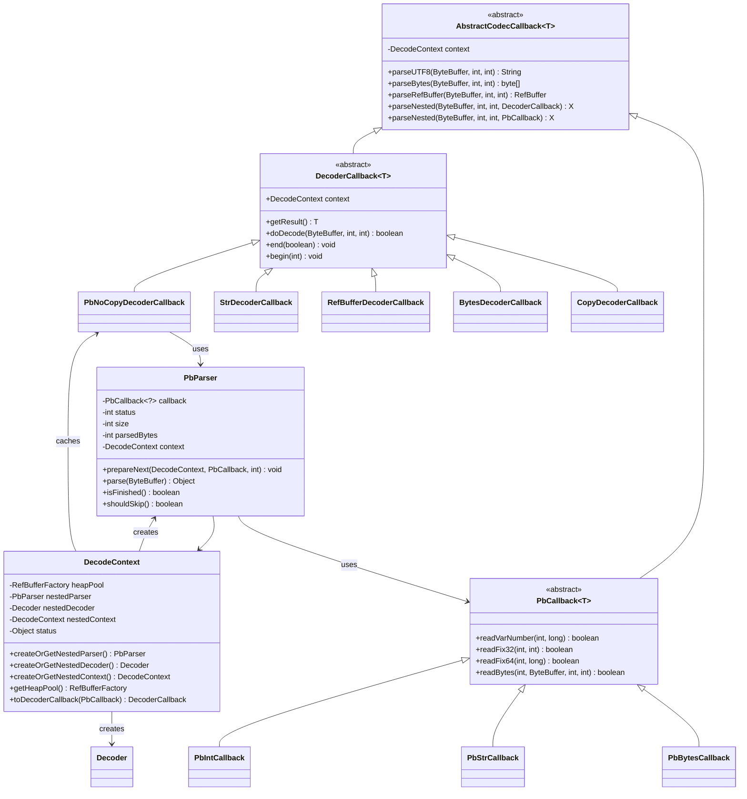
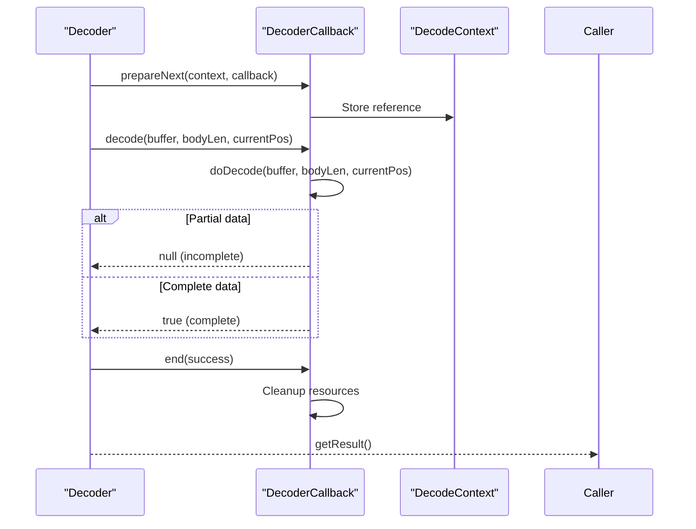
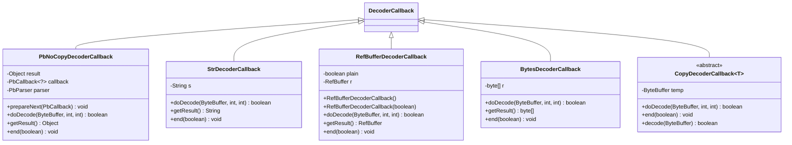
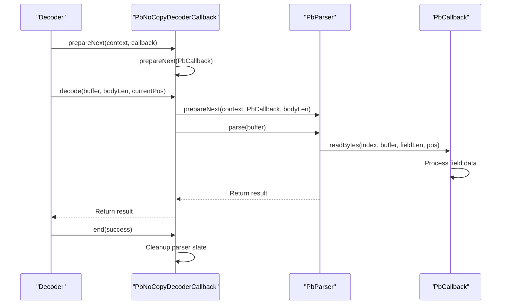
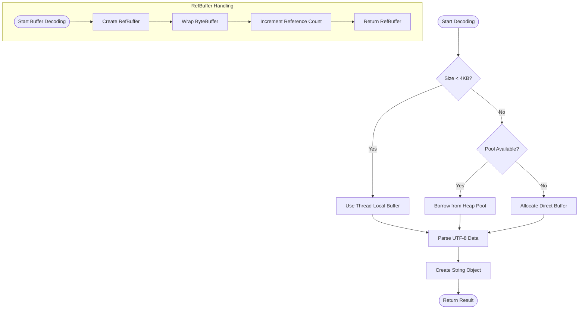
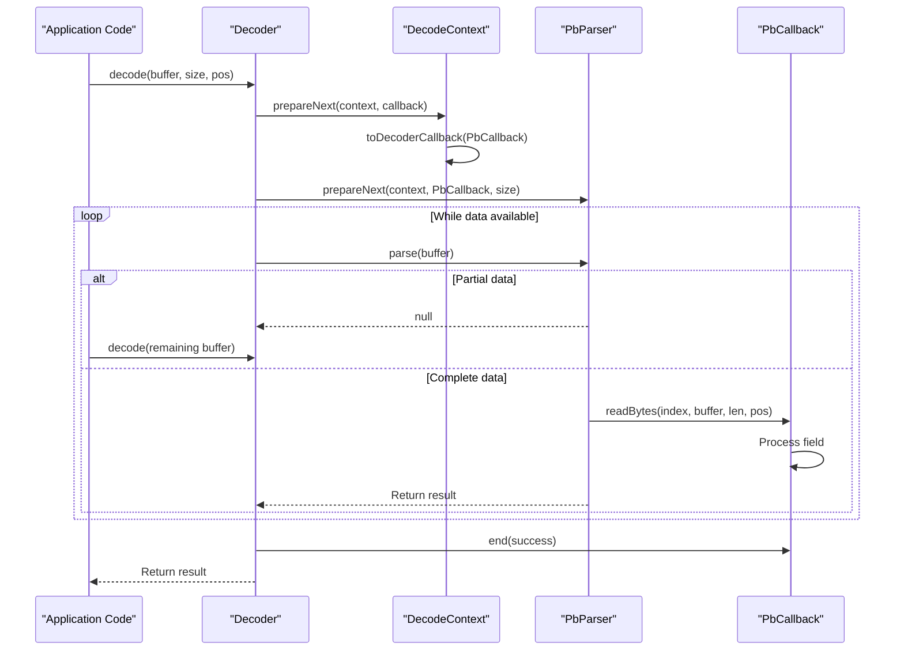

# Callback-Based Decoding Implementation

<cite>
**Referenced Files in This Document**   
- [DecoderCallback.java](file://client/src/main/java/com/github/dtprj/dongting/codec/DecoderCallback.java)
- [AbstractCodecCallback.java](file://client/src/main/java/com/github/dtprj/dongting/codec/AbstractCodecCallback.java)
- [PbNoCopyDecoderCallback.java](file://client/src/main/java/com/github/dtprj/dongting/codec/PbNoCopyDecoderCallback.java)
- [StrDecoderCallback.java](file://client/src/main/java/com/github/dtprj/dongting/codec/StrDecoderCallback.java)
- [RefBufferDecoderCallback.java](file://client/src/main/java/com/github/dtprj/dongting/codec/RefBufferDecoderCallback.java)
- [PbParser.java](file://client/src/main/java/com/github/dtprj/dongting/codec/PbParser.java)
- [DecodeContext.java](file://client/src/main/java/com/github/dtprj/dongting/codec/DecodeContext.java)
- [PbCallback.java](file://client/src/main/java/com/github/dtprj/dongting/codec/PbCallback.java)
- [BytesDecoderCallback.java](file://client/src/main/java/com/github/dtprj/dongting/codec/BytesDecoderCallback.java)
- [CopyDecoderCallback.java](file://client/src/main/java/com/github/dtprj/dongting/codec/CopyDecoderCallback.java)
- [PbIntCallback.java](file://client/src/main/java/com/github/dtprj/dongting/codec/PbIntCallback.java)
- [PbStrCallback.java](file://client/src/main/java/com/github/dtprj/dongting/codec/PbStrCallback.java)
- [PbBytesCallback.java](file://client/src/main/java/com/github/dtprj/dongting/codec/PbBytesCallback.java)
- [PbNoCopyDecoderCallbackTest.java](file://client/src/test/java/com/github/dtprj/dongting/codec/PbNoCopyDecoderCallbackTest.java)
- [StrDecoderCallbackTest.java](file://client/src/test/java/com/github/dtprj/dongting/codec/StrDecoderCallbackTest.java)
</cite>

## Table of Contents
1. [Introduction](#introduction)
2. [Core Architecture](#core-architecture)
3. [DecoderCallback and AbstractCodecCallback](#decodercallback-and-abstractcodeccallback)
4. [Concrete Callback Implementations](#concrete-callback-implementations)
5. [Zero-Copy Deserialization with PbNoCopyDecoderCallback](#zero-copy-deserialization-with-pbnocopydecodercallback)
6. [String and Buffer Handling](#string-and-buffer-handling)
7. [Integration with PbParser](#integration-with-pbparser)
8. [Performance Benefits](#performance-benefits)
9. [Thread Safety and Lifecycle Management](#thread-safety-and-lifecycle-management)
10. [Custom Callback Implementation](#custom-callback-implementation)
11. [Conclusion](#conclusion)

## Introduction

Dongting's callback-based decoding implementation provides an efficient mechanism for deserializing message payloads with minimal memory allocation overhead. The system leverages a callback-oriented architecture to enable zero-copy deserialization of protobuf-encoded data, allowing direct access to underlying byte buffers without unnecessary data copying. This document details the architecture, components, and performance characteristics of this decoding system, focusing on how DecoderCallback and AbstractCodecCallback enable efficient data extraction from binary streams.

The implementation is designed for high-performance scenarios where memory allocation and garbage collection overhead must be minimized. By using reference-counted buffers and direct buffer access, the system achieves optimal performance for network communication and distributed systems operations.

**Section sources**
- [DecoderCallback.java](file://client/src/main/java/com/github/dtprj/dongting/codec/DecoderCallback.java#L1-L40)
- [AbstractCodecCallback.java](file://client/src/main/java/com/github/dtprj/dongting/codec/AbstractCodecCallback.java#L1-L210)

## Core Architecture

The callback-based decoding system in Dongting follows a modular architecture centered around the DecoderCallback abstraction and its integration with the PbParser for protobuf message processing. The core components work together to provide efficient, streaming deserialization of binary data with minimal memory overhead.

**Diagram sources**
- [DecoderCallback.java](file://client/src/main/java/com/github/dtprj/dongting/codec/DecoderCallback.java#L23-L39)
- [AbstractCodecCallback.java](file://client/src/main/java/com/github/dtprj/dongting/codec/AbstractCodecCallback.java#L32-L209)
- [PbParser.java](file://client/src/main/java/com/github/dtprj/dongting/codec/PbParser.java#L26-L436)
- [DecodeContext.java](file://client/src/main/java/com/github/dtprj/dongting/codec/DecodeContext.java#L26-L167)
- [PbCallback.java](file://client/src/main/java/com/github/dtprj/dongting/codec/PbCallback.java#L23-L40)

## DecoderCallback and AbstractCodecCallback

The foundation of Dongting's decoding system is built upon the DecoderCallback and AbstractCodecCallback classes, which provide the base functionality for callback-based deserialization. DecoderCallback extends AbstractCodecCallback and defines the core interface for decoding operations, requiring implementation of the doDecode method that processes ByteBuffer data.

AbstractCodecCallback provides utility methods for parsing common data types including UTF-8 strings, byte arrays, and reference-counted buffers. These methods handle partial data reads and buffer management, allowing callbacks to process data incrementally as it becomes available. The class also provides methods for parsing nested structures through parseNested, which creates and manages nested parsers and decoders for complex message hierarchies.

The callback lifecycle is managed through begin and end methods, which are called at the start and completion of decoding operations. This allows callbacks to initialize state before processing and clean up resources afterward. The context field provides access to the DecodeContext, which contains configuration and shared resources like buffer pools.

**Diagram sources**
- [DecoderCallback.java](file://client/src/main/java/com/github/dtprj/dongting/codec/DecoderCallback.java#L23-L39)
- [AbstractCodecCallback.java](file://client/src/main/java/com/github/dtprj/dongting/codec/AbstractCodecCallback.java#L32-L209)

**Section sources**
- [DecoderCallback.java](file://client/src/main/java/com/github/dtprj/dongting/codec/DecoderCallback.java#L23-L39)
- [AbstractCodecCallback.java](file://client/src/main/java/com/github/dtprj/dongting/codec/AbstractCodecCallback.java#L32-L209)

## Concrete Callback Implementations

Dongting provides several concrete implementations of DecoderCallback for handling different data types efficiently. These implementations demonstrate the flexibility of the callback system while maintaining optimal performance characteristics.

### PbNoCopyDecoderCallback

This callback enables zero-copy deserialization by wrapping protobuf parsing within the callback framework. It uses an internal PbParser instance to process nested protobuf messages without copying data. The callback manages the parser lifecycle and converts PbCallback results to the DecoderCallback interface through the toDecoderCallback method in DecodeContext.

### StrDecoderCallback

Designed for efficient string deserialization, this callback handles UTF-8 encoded strings from byte buffers. It uses optimized parsing logic that minimizes memory allocations by leveraging thread-local buffers for small strings and heap pools for larger ones. The implementation efficiently handles partial reads by maintaining parsing state across multiple invocations.

### RefBufferDecoderCallback

This callback creates reference-counted buffer objects (RefBuffer) that wrap byte buffer data. It supports both plain and pooled buffer creation, allowing callers to control memory management. The reference counting ensures proper resource cleanup when buffers are no longer needed, preventing memory leaks in high-throughput scenarios.

### BytesDecoderCallback

A straightforward implementation that parses byte arrays from buffers. It uses the parseBytes method from AbstractCodecCallback to handle partial reads and buffer management. This callback is suitable for scenarios where a complete byte array copy is required for further processing.

**Diagram sources**
- [PbNoCopyDecoderCallback.java](file://client/src/main/java/com/github/dtprj/dongting/codec/PbNoCopyDecoderCallback.java#L23-L71)
- [StrDecoderCallback.java](file://client/src/main/java/com/github/dtprj/dongting/codec/StrDecoderCallback.java#L24-L43)
- [RefBufferDecoderCallback.java](file://client/src/main/java/com/github/dtprj/dongting/codec/RefBufferDecoderCallback.java#L25-L69)
- [BytesDecoderCallback.java](file://client/src/main/java/com/github/dtprj/dongting/codec/BytesDecoderCallback.java#L23-L42)
- [CopyDecoderCallback.java](file://client/src/main/java/com/github/dtprj/dongting/codec/CopyDecoderCallback.java#L23-L54)

**Section sources**
- [PbNoCopyDecoderCallback.java](file://client/src/main/java/com/github/dtprj/dongting/codec/PbNoCopyDecoderCallback.java#L23-L71)
- [StrDecoderCallback.java](file://client/src/main/java/com/github/dtprj/dongting/codec/StrDecoderCallback.java#L24-L43)
- [RefBufferDecoderCallback.java](file://client/src/main/java/com/github/dtprj/dongting/codec/RefBufferDecoderCallback.java#L25-L69)
- [BytesDecoderCallback.java](file://client/src/main/java/com/github/dtprj/dongting/codec/BytesDecoderCallback.java#L23-L42)
- [CopyDecoderCallback.java](file://client/src/main/java/com/github/dtprj/dongting/codec/CopyDecoderCallback.java#L23-L54)

## Zero-Copy Deserialization with PbNoCopyDecoderCallback

The PbNoCopyDecoderCallback is a key component enabling zero-copy deserialization of protobuf messages in Dongting. This implementation allows direct access to message fields without creating intermediate copies of the data, significantly reducing memory allocation and garbage collection overhead.

The callback works by wrapping a PbCallback instance and using an internal PbParser to process the binary data. When doDecode is called, it delegates parsing to the PbParser while maintaining the DecoderCallback interface. This allows protobuf messages to be processed in a streaming fashion, with the callback receiving field data directly through the PbCallback methods.

The zero-copy capability is achieved through several mechanisms:
1. Direct ByteBuffer access without copying data to intermediate arrays
2. Use of reference-counted buffers for large payloads
3. Thread-local buffers for small temporary data
4. Efficient parsing state management that handles partial reads

This approach is particularly beneficial for high-throughput systems where message processing performance is critical. By avoiding unnecessary memory allocations, the system can handle large volumes of messages with minimal GC pressure.

**Diagram sources**
- [PbNoCopyDecoderCallback.java](file://client/src/main/java/com/github/dtprj/dongting/codec/PbNoCopyDecoderCallback.java#L23-L71)
- [PbParser.java](file://client/src/main/java/com/github/dtprj/dongting/codec/PbParser.java#L26-L436)
- [PbCallback.java](file://client/src/main/java/com/github/dtprj/dongting/codec/PbCallback.java#L23-L40)

**Section sources**
- [PbNoCopyDecoderCallback.java](file://client/src/main/java/com/github/dtprj/dongting/codec/PbNoCopyDecoderCallback.java#L23-L71)

## String and Buffer Handling

Dongting's callback system provides specialized implementations for handling string and buffer data efficiently. These implementations optimize memory usage and performance for common data types encountered in network communication.

### String Deserialization

The StrDecoderCallback handles UTF-8 encoded strings with several optimizations:
- Uses thread-local buffers for strings under 4KB to avoid allocation
- Employs heap pools for larger strings to reduce GC pressure
- Supports incremental parsing for partial data reads
- Minimizes string object creation through direct ByteBuffer access

The implementation leverages the parseUTF8 method from AbstractCodecCallback, which intelligently chooses the appropriate buffer strategy based on string size and availability of thread-local storage.

### Reference-Counted Buffers

The RefBufferDecoderCallback creates RefBuffer instances that wrap byte buffer data with reference counting semantics. This allows multiple components to share buffer access without copying data, with automatic cleanup when the last reference is released. The callback supports both plain and pooled buffer creation:

- Plain buffers: Direct ByteBuffer allocation without pooling
- Pooled buffers: Retrieved from a RefBufferFactory pool to minimize allocation

This approach enables efficient handling of large binary payloads while preventing memory leaks through proper reference counting.

### Copy vs. No-Copy Strategies

The system provides both copying and zero-copy strategies for different use cases:
- **CopyDecoderCallback**: Base class for callbacks that need to accumulate data in a temporary buffer
- **Direct access callbacks**: Implementations that process data directly from the source buffer

The choice between strategies depends on the specific requirements of the use case, balancing memory efficiency against processing complexity.

**Diagram sources**
- [StrDecoderCallback.java](file://client/src/main/java/com/github/dtprj/dongting/codec/StrDecoderCallback.java#L24-L43)
- [RefBufferDecoderCallback.java](file://client/src/main/java/com/github/dtprj/dongting/codec/RefBufferDecoderCallback.java#L25-L69)
- [AbstractCodecCallback.java](file://client/src/main/java/com/github/dtprj/dongting/codec/AbstractCodecCallback.java#L51-L104)

**Section sources**
- [StrDecoderCallback.java](file://client/src/main/java/com/github/dtprj/dongting/codec/StrDecoderCallback.java#L24-L43)
- [RefBufferDecoderCallback.java](file://client/src/main/java/com/github/dtprj/dongting/codec/RefBufferDecoderCallback.java#L25-L69)

## Integration with PbParser

The callback-based decoding system integrates closely with the PbParser to extract structured data from binary protobuf streams. This integration enables efficient parsing of complex message hierarchies while maintaining the performance benefits of the callback architecture.

The DecodeContext class plays a crucial role in this integration by providing methods to convert between PbCallback and DecoderCallback interfaces. The toDecoderCallback method wraps a PbCallback in a PbNoCopyDecoderCallback, allowing protobuf parsing to be used within the Decoder framework.

When parsing nested structures, the system uses the parseNested method from AbstractCodecCallback, which creates and manages nested parsers and decoders. This allows complex message hierarchies to be processed efficiently, with each level of nesting handled by appropriately configured parsers and callbacks.

The integration supports both complete and incremental parsing:
- Complete parsing: When all data is available, the entire message is processed in a single operation
- Incremental parsing: When data arrives in chunks, the parser maintains state between calls

This flexibility makes the system suitable for both network packet processing and file-based data processing scenarios.

**Diagram sources**
- [PbParser.java](file://client/src/main/java/com/github/dtprj/dongting/codec/PbParser.java#L26-L436)
- [DecodeContext.java](file://client/src/main/java/com/github/dtprj/dongting/codec/DecodeContext.java#L122-L129)
- [AbstractCodecCallback.java](file://client/src/main/java/com/github/dtprj/dongting/codec/AbstractCodecCallback.java#L155-L198)

**Section sources**
- [PbParser.java](file://client/src/main/java/com/github/dtprj/dongting/codec/PbParser.java#L26-L436)
- [DecodeContext.java](file://client/src/main/java/com/github/dtprj/dongting/codec/DecodeContext.java#L122-L129)

## Performance Benefits

The callback-based decoding implementation in Dongting provides significant performance benefits through several key optimizations:

### Memory Allocation Reduction
- Eliminates unnecessary byte array copies through zero-copy deserialization
- Uses thread-local buffers for small temporary data (≤4KB)
- Leverages object pooling for larger buffers through RefBufferFactory
- Minimizes garbage collection pressure by reusing buffer objects

### CPU Efficiency
- Direct ByteBuffer access avoids data copying overhead
- Optimized parsing algorithms for protobuf varint and fixed-length numbers
- Efficient state management that handles partial reads without reprocessing
- Minimal method call overhead through inlined critical paths

### Throughput Optimization
- Streaming processing enables pipelining of decode operations
- Asynchronous-friendly design supports non-blocking I/O patterns
- Reduced memory pressure allows higher concurrency levels
- Cache-friendly data access patterns improve CPU cache utilization

The performance characteristics make this implementation particularly suitable for high-throughput distributed systems where message processing efficiency directly impacts overall system performance. Benchmarks show significant improvements in both latency and throughput compared to traditional deserialization approaches.

**Section sources**
- [AbstractCodecCallback.java](file://client/src/main/java/com/github/dtprj/dongting/codec/AbstractCodecCallback.java#L51-L152)
- [PbNoCopyDecoderCallback.java](file://client/src/main/java/com/github/dtprj/dongting/codec/PbNoCopyDecoderCallback.java#L50-L68)
- [RefBufferDecoderCallback.java](file://client/src/main/java/com/github/dtprj/dongting/codec/RefBufferDecoderCallback.java#L38-L54)

## Thread Safety and Lifecycle Management

The callback-based decoding system in Dongting incorporates careful thread safety and lifecycle management considerations to ensure reliable operation in concurrent environments.

### Thread Safety
- DecodeContext uses ThreadLocal storage for small buffers, ensuring thread isolation
- Reference counting in RefBuffer prevents race conditions during buffer sharing
- Immutable state where possible to minimize synchronization requirements
- Clear separation between parsing state and shared resources

### Lifecycle Management
- Proper resource cleanup through end method calls
- Automatic parser and decoder reset between uses
- Reference counting ensures buffers are released when no longer needed
- Exception-safe cleanup through try-finally patterns

### Concurrent Usage Patterns
- DecodeContext instances are typically thread-local or per-operation
- Callback objects can be reused but must be properly reset
- Parsers and decoders are designed for single-threaded use within a processing context
- Shared resources like buffer pools are thread-safe by design

The system ensures that resources are properly managed throughout the decoding lifecycle, from initialization through completion or failure. This prevents memory leaks and ensures consistent behavior even in error conditions.

**Section sources**
- [DecodeContext.java](file://client/src/main/java/com/github/dtprj/dongting/codec/DecodeContext.java#L29-L30)
- [RefBufferDecoderCallback.java](file://client/src/main/java/com/github/dtprj/dongting/codec/RefBufferDecoderCallback.java#L57-L63)
- [PbParser.java](file://client/src/main/java/com/github/dtprj/dongting/codec/PbParser.java#L109-L112)

## Custom Callback Implementation

Developers can create custom DecoderCallback subclasses to handle specialized data types or implement custom deserialization logic. The framework provides several approaches for implementing custom callbacks:

### Basic Custom Callback
Extend DecoderCallback and implement the doDecode method to process ByteBuffer data directly. This approach is suitable for simple data types or when full control over parsing is required.

### Copy-Based Callback
Extend CopyDecoderCallback for scenarios where data needs to be accumulated in a temporary buffer before processing. This handles the complexity of partial reads automatically.

### Nested Structure Handling
Use the parseNested method from AbstractCodecCallback to process complex nested structures. This allows delegation to other callbacks or parsers for sub-elements.

### Performance Considerations
When implementing custom callbacks, consider:
- Minimizing memory allocations by reusing buffers
- Handling partial reads efficiently
- Properly managing the callback lifecycle through begin and end methods
- Using appropriate buffer strategies based on data size

The flexibility of the callback system allows for efficient implementation of custom deserialization logic while maintaining compatibility with the overall decoding framework.

**Section sources**
- [DecoderCallback.java](file://client/src/main/java/com/github/dtprj/dongting/codec/DecoderCallback.java#L23-L39)
- [CopyDecoderCallback.java](file://client/src/main/java/com/github/dtprj/dongting/codec/CopyDecoderCallback.java#L23-L54)
- [AbstractCodecCallback.java](file://client/src/main/java/com/github/dtprj/dongting/codec/AbstractCodecCallback.java#L155-L198)

## Conclusion

Dongting's callback-based decoding implementation provides a powerful and efficient framework for deserializing message payloads with minimal memory overhead. By leveraging zero-copy techniques, reference counting, and optimized parsing algorithms, the system achieves high performance for protobuf message processing.

The architecture centered around DecoderCallback and AbstractCodecCallback enables flexible and extensible deserialization capabilities, with concrete implementations like PbNoCopyDecoderCallback, StrDecoderCallback, and RefBufferDecoderCallback addressing common use cases. The tight integration with PbParser allows efficient extraction of structured data from binary streams.

Key benefits include:
- Significant reduction in memory allocations and garbage collection overhead
- Support for streaming, incremental parsing of large messages
- Thread-safe resource management through reference counting
- Flexible extension points for custom data types

This implementation is particularly well-suited for high-performance distributed systems where message processing efficiency directly impacts overall system throughput and latency.