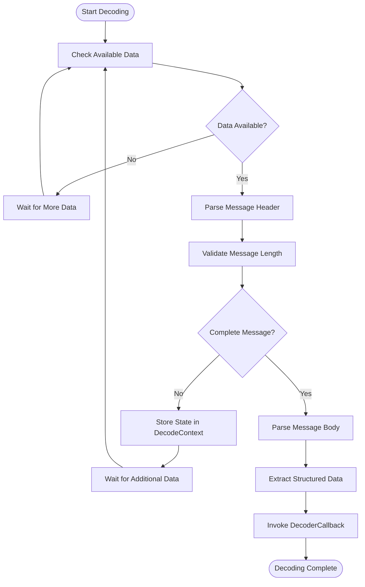
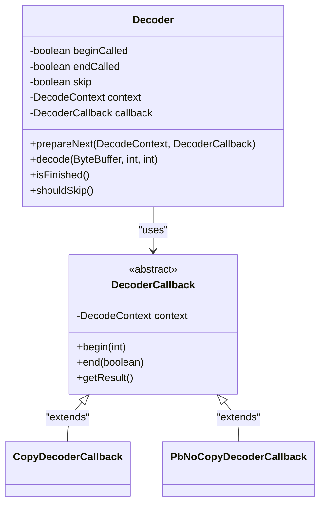
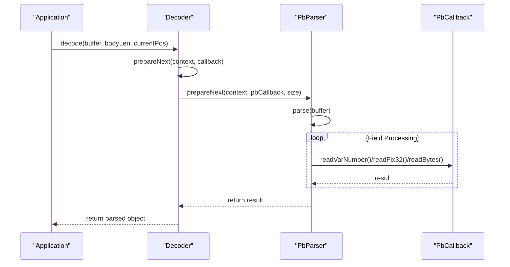
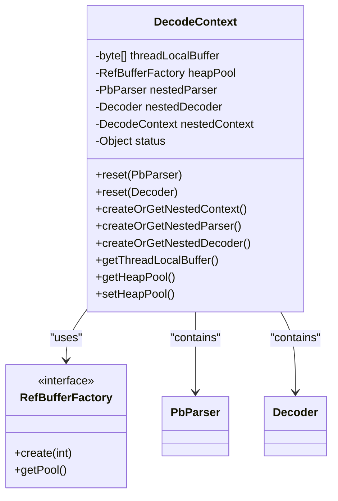
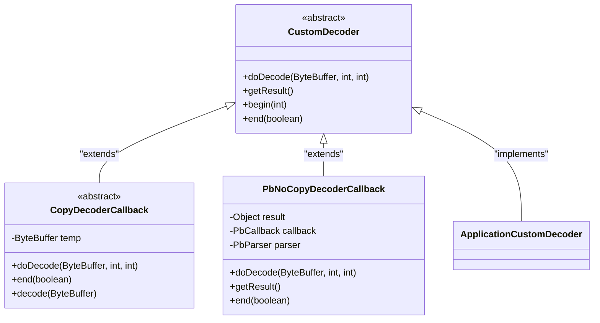
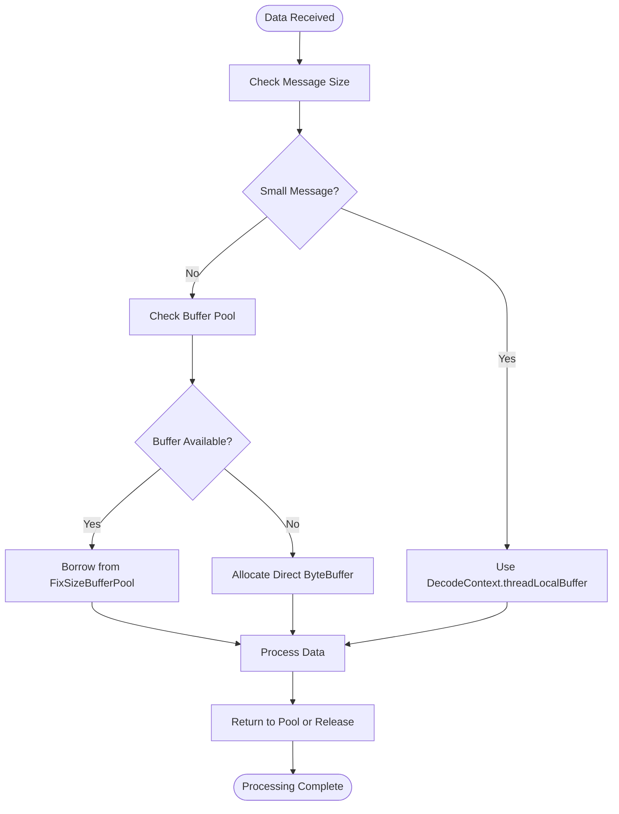
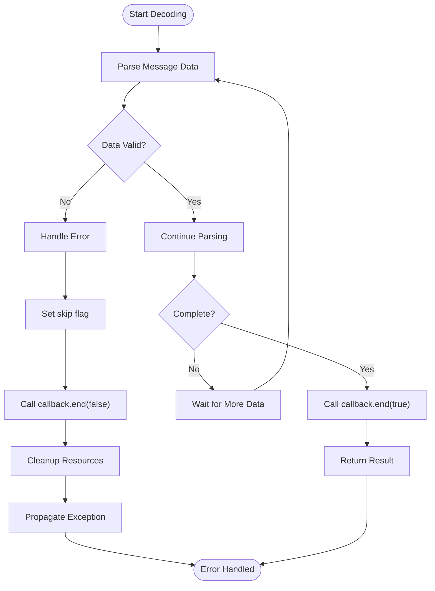
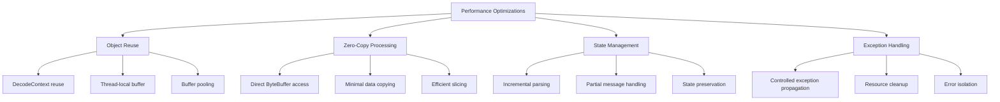

# Core Decoding Mechanics

<cite>
**Referenced Files in This Document**   
- [DecodeContext.java](file://client/src/main/java/com/github/dtprj/dongting/codec/DecodeContext.java)
- [Decoder.java](file://client/src/main/java/com/github/dtprj/dongting/codec/Decoder.java)
- [PbParser.java](file://client/src/main/java/com/github/dtprj/dongting/codec/PbParser.java)
- [DecoderCallback.java](file://client/src/main/java/com/github/dtprj/dongting/codec/DecoderCallback.java)
- [PbCallback.java](file://client/src/main/java/com/github/dtprj/dongting/codec/PbCallback.java)
- [AbstractCodecCallback.java](file://client/src/main/java/com/github/dtprj/dongting/codec/AbstractCodecCallback.java)
- [PbNoCopyDecoderCallback.java](file://client/src/main/java/com/github/dtprj/dongting/codec/PbNoCopyDecoderCallback.java)
- [CopyDecoderCallback.java](file://client/src/main/java/com/github/dtprj/dongting/codec/CopyDecoderCallback.java)
- [CodecException.java](file://client/src/main/java/com/github/dtprj/dongting/codec/CodecException.java)
- [PbException.java](file://client/src/main/java/com/github/dtprj/dongting/codec/PbException.java)
- [RefBuffer.java](file://client/src/main/java/com/github/dtprj/dongting/buf/RefBuffer.java)
- [FixSizeBufferPool.java](file://client/src/main/java/com/github/dtprj/dongting/buf/FixSizeBufferPool.java)
</cite>

## Table of Contents
1. [Introduction](#introduction)
2. [Two-Phase Decoding Process](#two-phase-decoding-process)
3. [Decoder Interface Contract](#decoder-interface-contract)
4. [PbParser Integration](#pbparser-integration)
5. [State Management in DecodeContext](#state-management-in-decodecontext)
6. [Custom Decoder Implementation](#custom-decoder-implementation)
7. [Buffer Management and Zero-Copy Techniques](#buffer-management-and-zero-copy-techniques)
8. [Error Handling Mechanisms](#error-handling-mechanisms)
9. [Performance Considerations](#performance-considerations)
10. [Conclusion](#conclusion)

## Introduction
The Dongting framework implements a sophisticated message decoding system designed for high-performance network applications. This document details the core decoding mechanics that enable efficient handling of variable-length messages, particularly in high-throughput scenarios. The system is built around a two-phase decoding process that leverages the DecodeContext to manage state across incremental parsing operations. The architecture supports both protobuf-based and custom protocol formats through a flexible interface contract, while incorporating zero-copy techniques and sophisticated buffer management strategies to minimize memory allocation overhead.

**Section sources**
- [DecodeContext.java](file://client/src/main/java/com/github/dtprj/dongting/codec/DecodeContext.java#L1-L168)
- [Decoder.java](file://client/src/main/java/com/github/dtprj/dongting/codec/Decoder.java#L1-L121)

## Two-Phase Decoding Process
The Dongting decoding system employs a two-phase approach to efficiently handle variable-length messages, particularly when dealing with incomplete data from network streams. This process is orchestrated through the DecodeContext, which maintains state between parsing operations and enables incremental message processing.

In the first phase, the decoder performs initial message validation and length determination. When a partial message arrives, the DecodeContext stores intermediate state, including the current parsing position and accumulated bytes. This allows the system to resume parsing when additional data becomes available without reprocessing previously received bytes.

The second phase involves complete message reconstruction and semantic validation. Once sufficient data has been accumulated, the decoder transitions to full message processing, invoking appropriate callbacks to extract structured data from the binary payload. The DecodeContext manages this transition seamlessly, ensuring that callbacks are only invoked when complete message data is available.

**Diagram sources**
- [DecodeContext.java](file://client/src/main/java/com/github/dtprj/dongting/codec/DecodeContext.java#L1-L168)
- [Decoder.java](file://client/src/main/java/com/github/dtprj/dongting/codec/Decoder.java#L1-L121)

**Section sources**
- [DecodeContext.java](file://client/src/main/java/com/github/dtprj/dongting/codec/DecodeContext.java#L1-L168)
- [Decoder.java](file://client/src/main/java/com/github/dtprj/dongting/codec/Decoder.java#L1-L121)

## Decoder Interface Contract
The Decoder interface serves as the foundation for the Dongting decoding system, defining a contract that enables consistent message parsing across different protocol types. The interface implementation works in conjunction with DecoderCallback to provide a flexible mechanism for handling various message formats.

The Decoder class maintains several key state variables: beginCalled, endCalled, and skip, which track the parsing lifecycle and error conditions. The prepareNext method initializes the decoder with a DecodeContext and specific DecoderCallback, resetting internal state and establishing the parsing environment. This method ensures that each decoding operation starts with a clean state while preserving the performance benefits of object reuse.

The decode method implements the core parsing logic, handling both complete and partial messages. It manages ByteBuffer positions and limits to ensure proper data isolation, and incorporates exception handling to maintain system stability in the face of malformed messages. The method returns the parsed result through the callback's getResult method, enabling type-safe data extraction.

**Diagram sources**
- [Decoder.java](file://client/src/main/java/com/github/dtprj/dongting/codec/Decoder.java#L1-L121)
- [DecoderCallback.java](file://client/src/main/java/com/github/dtprj/dongting/codec/DecoderCallback.java#L1-L40)

**Section sources**
- [Decoder.java](file://client/src/main/java/com/github/dtprj/dongting/codec/Decoder.java#L1-L121)
- [DecoderCallback.java](file://client/src/main/java/com/github/dtprj/dongting/codec/DecoderCallback.java#L1-L40)

## PbParser Integration
The PbParser class provides specialized support for protobuf-based message formats, integrating seamlessly with the core decoding system to handle protocol buffer messages with minimal overhead. This integration enables efficient parsing of protobuf messages while maintaining compatibility with the general decoding framework.

PbParser operates through a state machine with distinct phases: STATUS_INIT, STATUS_PARSE_TAG, STATUS_PARSE_FILED_LEN, STATUS_PARSE_FILED_BODY, and various end states. This state machine efficiently processes protobuf's length-delimited format, handling variable-length integers, fixed-length values, and nested messages. The parser leverages the DecodeContext to manage intermediate state and coordinate with PbCallback implementations for field-level processing.

The integration between PbParser and the decoding system is facilitated through the PbNoCopyDecoderCallback, which acts as an adapter between the Decoder interface and PbParser functionality. This adapter enables protobuf messages to be processed within the standard decoding pipeline without requiring protocol-specific changes to the core infrastructure.

**Diagram sources**
- [PbParser.java](file://client/src/main/java/com/github/dtprj/dongting/codec/PbParser.java#L1-L437)
- [PbNoCopyDecoderCallback.java](file://client/src/main/java/com/github/dtprj/dongting/codec/PbNoCopyDecoderCallback.java#L1-L72)

**Section sources**
- [PbParser.java](file://client/src/main/java/com/github/dtprj/dongting/codec/PbParser.java#L1-L437)
- [PbNoCopyDecoderCallback.java](file://client/src/main/java/com/github/dtprj/dongting/codec/PbNoCopyDecoderCallback.java#L1-L72)

## State Management in DecodeContext
The DecodeContext class plays a crucial role in managing state during the incremental parsing of incomplete messages. It serves as a container for various resources and intermediate states, enabling the decoding system to handle partial messages and resume parsing when additional data arrives.

DecodeContext maintains several key components for state management: thread-local buffers for temporary storage, object pooling for performance optimization, and nested parsing contexts for handling complex message structures. The threadLocalBuffer provides a 4KB buffer that can be used for temporary data storage without allocation overhead, while the heapPool enables efficient memory management through object reuse.

The context also supports nested parsing operations through nestedParser, nestedDecoder, and nestedContext fields. These components allow the system to handle hierarchical message structures, such as protobuf messages containing nested sub-messages, by creating isolated parsing environments for each level of nesting. This hierarchical state management ensures that parsing operations at different levels do not interfere with each other.

**Diagram sources**
- [DecodeContext.java](file://client/src/main/java/com/github/dtprj/dongting/codec/DecodeContext.java#L1-L168)
- [RefBuffer.java](file://client/src/main/java/com/github/dtprj/dongting/buf/RefBuffer.java#L35-L183)

**Section sources**
- [DecodeContext.java](file://client/src/main/java/com/github/dtprj/dongting/codec/DecodeContext.java#L1-L168)
- [RefBuffer.java](file://client/src/main/java/com/github/dtprj/dongting/buf/RefBuffer.java#L35-L183)

## Custom Decoder Implementation
Implementing custom decoders for application-specific protocols in Dongting follows a well-defined pattern that leverages the existing decoding infrastructure while allowing for protocol-specific logic. Developers can create custom decoders by extending either CopyDecoderCallback or implementing DecoderCallback directly, depending on their performance requirements and memory management needs.

For protocols requiring data copying, CopyDecoderCallback provides a convenient base class that handles buffer management automatically. The abstract decode method is called with a complete ByteBuffer when the entire message is available, simplifying the implementation of parsing logic. The base class manages temporary buffer allocation and release through the heapPool, ensuring proper resource cleanup.

For zero-copy scenarios, developers can implement DecoderCallback directly or extend PbNoCopyDecoderCallback for protobuf-based custom formats. This approach allows direct access to the incoming ByteBuffer without copying, maximizing performance at the cost of more complex state management. The doDecode method must handle partial messages and maintain parsing state across multiple invocations.

**Diagram sources**
- [CopyDecoderCallback.java](file://client/src/main/java/com/github/dtprj/dongting/codec/CopyDecoderCallback.java#L1-L55)
- [PbNoCopyDecoderCallback.java](file://client/src/main/java/com/github/dtprj/dongting/codec/PbNoCopyDecoderCallback.java#L1-L72)

**Section sources**
- [CopyDecoderCallback.java](file://client/src/main/java/com/github/dtprj/dongting/codec/CopyDecoderCallback.java#L1-L55)
- [PbNoCopyDecoderCallback.java](file://client/src/main/java/com/github/dtprj/dongting/codec/PbNoCopyDecoderCallback.java#L1-L72)

## Buffer Management and Zero-Copy Techniques
The Dongting decoding system incorporates sophisticated buffer management strategies and zero-copy techniques to enhance performance during high-throughput scenarios. These optimizations minimize memory allocation overhead and reduce data copying, resulting in improved throughput and reduced garbage collection pressure.

The system leverages object pooling through the RefBuffer and FixSizeBufferPool classes to recycle ByteBuffer instances. RefBuffer wraps ByteBuffers with reference counting, allowing efficient sharing and automatic cleanup when buffers are no longer needed. The FixSizeBufferPool maintains pools of fixed-size buffers, reducing allocation overhead for commonly used buffer sizes.

Zero-copy techniques are implemented through direct ByteBuffer access in the decoding pipeline. When possible, the system avoids copying data by operating directly on the received ByteBuffer, using position and limit to isolate message boundaries. The DecodeContext's threadLocalBuffer provides a small, reusable buffer for temporary operations, eliminating allocation for small data manipulations.

**Diagram sources**
- [RefBuffer.java](file://client/src/main/java/com/github/dtprj/dongting/buf/RefBuffer.java#L35-L183)
- [FixSizeBufferPool.java](file://client/src/main/java/com/github/dtprj/dongting/buf/FixSizeBufferPool.java#L39-L77)

**Section sources**
- [RefBuffer.java](file://client/src/main/java/com/github/dtprj/dongting/buf/RefBuffer.java#L35-L183)
- [FixSizeBufferPool.java](file://client/src/main/java/com/github/dtprj/dongting/buf/FixSizeBufferPool.java#L39-L77)

## Error Handling Mechanisms
The Dongting decoding system implements comprehensive error handling mechanisms to manage malformed messages and protocol violations while maintaining system stability. These mechanisms are designed to gracefully handle exceptional conditions without compromising the integrity of the overall system.

The system uses a hierarchy of exceptions, with CodecException as the base class and PbException for protobuf-specific errors. These exceptions are thrown when protocol violations are detected, such as invalid field lengths, incorrect message formats, or parsing state inconsistencies. The decoding components catch these exceptions and ensure proper cleanup of resources before propagating the error.

Error handling is integrated into the decoding lifecycle through the end method of DecoderCallback, which is called with a success flag indicating whether parsing completed successfully. This allows callback implementations to perform cleanup operations and release any acquired resources, regardless of whether parsing succeeded or failed. The skip flag in the Decoder class ensures that subsequent data is not misinterpreted as part of a failed message.

**Diagram sources**
- [CodecException.java](file://client/src/main/java/com/github/dtprj/dongting/codec/CodecException.java#L1-L35)
- [PbException.java](file://client/src/main/java/com/github/dtprj/dongting/codec/PbException.java#L1-L28)

**Section sources**
- [CodecException.java](file://client/src/main/java/com/github/dtprj/dongting/codec/CodecException.java#L1-L35)
- [PbException.java](file://client/src/main/java/com/github/dtprj/dongting/codec/PbException.java#L1-L28)

## Performance Considerations
The Dongting decoding system is optimized for high-performance scenarios through several key design principles and implementation techniques. These optimizations focus on minimizing memory allocation, reducing data copying, and maximizing throughput in high-concurrency environments.

Object reuse is a fundamental principle, with DecodeContext instances often reused across multiple decoding operations. The thread-local buffer (4KB) provides a small, reusable workspace for temporary operations, eliminating allocation overhead for common parsing tasks. For larger temporary storage needs, the system leverages the heapPool to borrow and return ByteBuffer instances, reducing garbage collection pressure.

The two-phase decoding process enables efficient handling of partial messages without requiring data buffering at the application level. By maintaining parsing state in the DecodeContext, the system can resume parsing when additional data arrives, avoiding the need to accumulate complete messages before processing begins. This approach reduces memory footprint and improves latency.

**Diagram sources**
- [DecodeContext.java](file://client/src/main/java/com/github/dtprj/dongting/codec/DecodeContext.java#L1-L168)
- [Decoder.java](file://client/src/main/java/com/github/dtprj/dongting/codec/Decoder.java#L1-L121)

**Section sources**
- [DecodeContext.java](file://client/src/main/java/com/github/dtprj/dongting/codec/DecodeContext.java#L1-L168)
- [Decoder.java](file://client/src/main/java/com/github/dtprj/dongting/codec/Decoder.java#L1-L121)

## Conclusion
The Dongting core decoding mechanics provide a robust and efficient framework for handling network messages in high-performance applications. The two-phase decoding process, centered around the DecodeContext, enables efficient handling of variable-length messages and incremental parsing of incomplete data. The Decoder interface contract provides a flexible foundation for supporting various protocol formats, while the PbParser integration offers optimized handling of protobuf-based messages.

The system's state management capabilities, combined with sophisticated buffer management and zero-copy techniques, deliver high throughput with minimal memory overhead. Custom decoder implementations can leverage these features to handle application-specific protocols efficiently. Comprehensive error handling mechanisms ensure system stability in the face of malformed messages and protocol violations.

Overall, the Dongting decoding system represents a carefully balanced design that prioritizes performance, reliability, and flexibility, making it well-suited for demanding network applications requiring efficient message processing at scale.