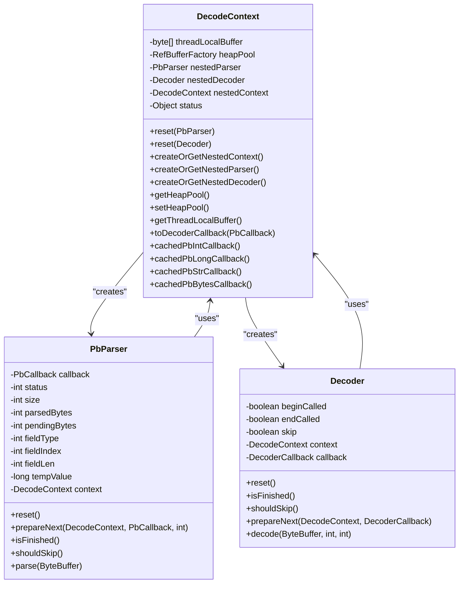
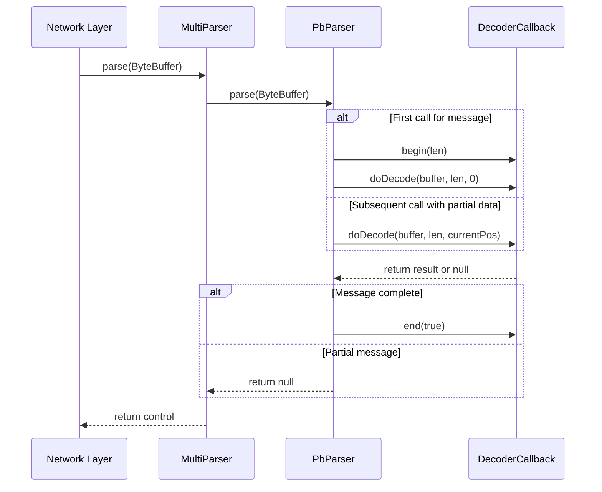
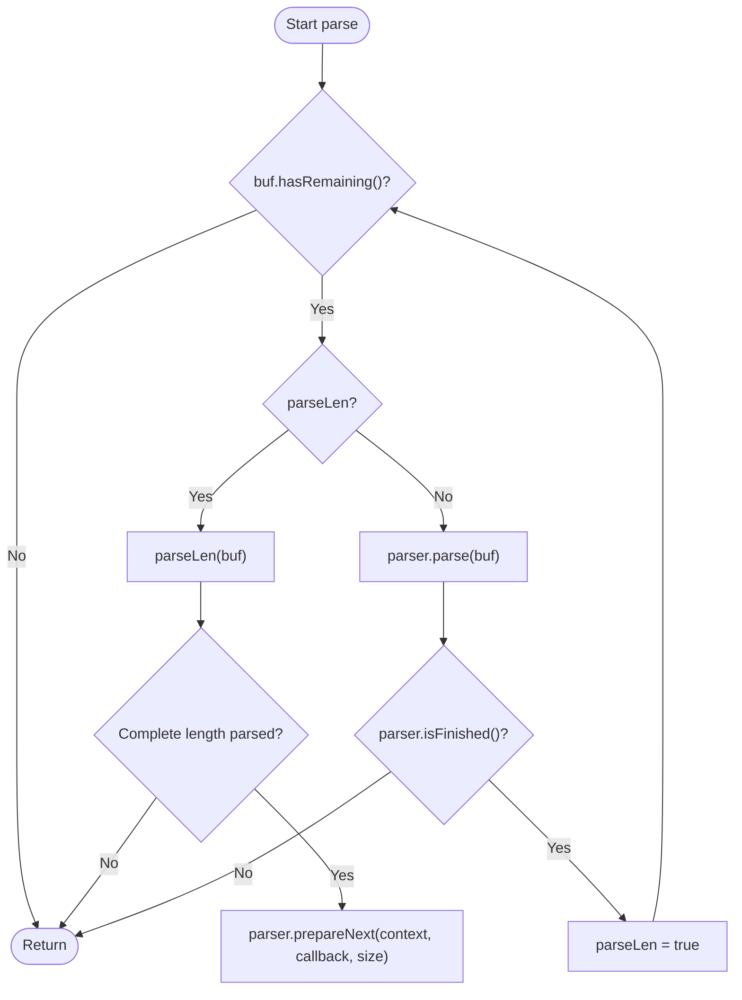
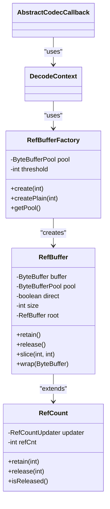
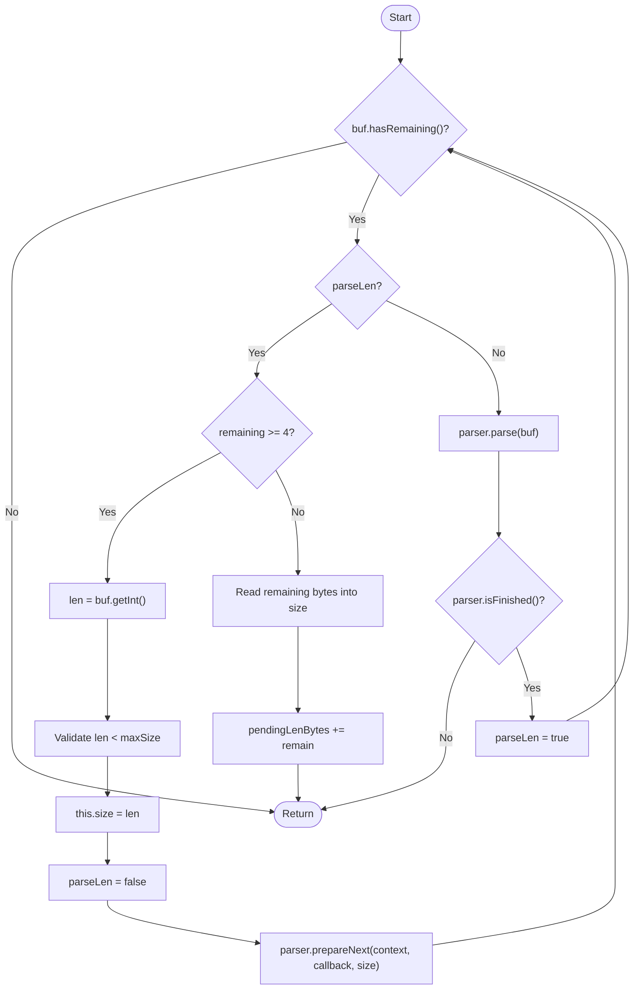

# Decoding Context Management

<cite>
**Referenced Files in This Document**   
- [DecodeContext.java](file://client/src/main/java/com/github/dtprj/dongting/codec/DecodeContext.java)
- [Decoder.java](file://client/src/main/java/com/github/dtprj/dongting/codec/Decoder.java)
- [PbParser.java](file://client/src/main/java/com/github/dtprj/dongting/codec/PbParser.java)
- [MultiParser.java](file://client/src/main/java/com/github/dtprj/dongting/net/MultiParser.java)
- [RefBuffer.java](file://client/src/main/java/com/github/dtprj/dongting/buf/RefBuffer.java)
- [RefBufferFactory.java](file://client/src/main/java/com/github/dtprj/dongting/buf/RefBufferFactory.java)
- [DtChannelImpl.java](file://client/src/main/java/com/github/dtprj/dongting/net/DtChannelImpl.java)
- [AbstractCodecCallback.java](file://client/src/main/java/com/github/dtprj/dongting/codec/AbstractCodecCallback.java)
</cite>

## Table of Contents
1. [Introduction](#introduction)
2. [DecodeContext State Management](#decodecontext-state-management)
3. [Two-Phase Decoding Lifecycle](#two-phase-decoding-lifecycle)
4. [MultiParser Integration](#multiparser-integration)
5. [Buffer Management and Zero-Copy Semantics](#buffer-management-and-zero-copy-semantics)
6. [Error Recovery and Resource Cleanup](#error-recovery-and-resource-cleanup)
7. [Protocol Framing and Variable-Length Messages](#protocol-framing-and-variable-length-messages)
8. [Conclusion](#conclusion)

## Introduction

The Dongting DecodeContext system provides a robust mechanism for managing state during incremental message parsing in network applications. This documentation details how the DecodeContext class maintains position, length, and state information across multiple network reads, enabling efficient handling of partial message reception. The system supports two-phase decoding through lifecycle methods (begin, decode, end) and integrates with MultiParser to handle multiple concurrent decoding operations on the same channel. The design emphasizes performance through reference counting and zero-copy semantics when transferring data between network buffers and application objects.

**Section sources**
- [DecodeContext.java](file://client/src/main/java/com/github/dtprj/dongting/codec/DecodeContext.java#L1-L168)

## DecodeContext State Management

The DecodeContext class serves as a state container for incremental message parsing operations. It maintains critical state information across multiple network read operations, allowing the system to handle partial message reception gracefully. The context tracks parsing position, message length, and intermediate state through several key mechanisms:

- **Thread-local buffer caching**: A 4KB thread-local byte array is maintained to optimize small string and byte array parsing operations, reducing allocation overhead
- **Nested context management**: Supports hierarchical parsing through nested DecodeContext instances that can be created on-demand
- **Object pooling**: Reuses callback objects (PbNoCopyDecoderCallback, PbIntCallback, etc.) to minimize garbage collection pressure
- **State propagation**: The context object is shared between parsers, decoders, and callbacks to maintain consistent state throughout the decoding process

The DecodeContext is designed to be lightweight and reusable, with reset methods that prepare the context for new parsing operations while preserving performance-critical cached objects.



**Diagram sources**
- [DecodeContext.java](file://client/src/main/java/com/github/dtprj/dongting/codec/DecodeContext.java#L1-L168)
- [PbParser.java](file://client/src/main/java/com/github/dtprj/dongting/codec/PbParser.java#L1-L437)
- [Decoder.java](file://client/src/main/java/com/github/dtprj/dongting/codec/Decoder.java#L1-L121)

**Section sources**
- [DecodeContext.java](file://client/src/main/java/com/github/dtprj/dongting/codec/DecodeContext.java#L1-L168)
- [PbParser.java](file://client/src/main/java/com/github/dtprj/dongting/codec/PbParser.java#L1-L437)
- [Decoder.java](file://client/src/main/java/com/github/dtprj/dongting/codec/Decoder.java#L1-L121)

## Two-Phase Decoding Lifecycle

The DecodeContext system implements a two-phase decoding process through the begin, decode, and end lifecycle methods. This pattern ensures proper initialization and cleanup of resources while supporting incremental parsing of messages that may span multiple network packets.

### Lifecycle Phases

**Begin Phase**: 
- Triggered when currentPos equals 0 and beginCalled is false
- Initializes the decoding operation by calling callback.begin(bodyLen)
- Sets beginCalled flag to true to prevent reinitialization
- Establishes the expected message length for validation

**Decode Phase**:
- Processes available data in the ByteBuffer
- Handles both complete and partial message segments
- Manages position tracking through currentPos parameter
- Delegates actual decoding logic to the configured callback

**End Phase**:
- Automatically invoked when the complete message is processed
- Calls callback.end(success) to signal completion
- Resets internal state for potential reuse
- Performs cleanup of temporary resources

The lifecycle is designed to handle interruptions gracefully. If a connection is interrupted mid-decoding, the end method is called with success=false, allowing proper cleanup of partially processed messages.



**Diagram sources**
- [Decoder.java](file://client/src/main/java/com/github/dtprj/dongting/codec/Decoder.java#L74-L118)
- [PbParser.java](file://client/src/main/java/com/github/dtprj/dongting/codec/PbParser.java#L103-L155)
- [AbstractCodecCallback.java](file://client/src/main/java/com/github/dtprj/dongting/codec/AbstractCodecCallback.java#L40-L44)

**Section sources**
- [Decoder.java](file://client/src/main/java/com/github/dtprj/dongting/codec/Decoder.java#L54-L107)
- [PbParser.java](file://client/src/main/java/com/github/dtprj/dongting/codec/PbParser.java#L95-L155)

## MultiParser Integration

The MultiParser class enables concurrent decoding operations on the same network channel by managing multiple message parsing sequences. It works in conjunction with DecodeContext to handle protocol framing and message demultiplexing.

### Key Integration Points

- **Length-based framing**: MultiParser first parses a 4-byte big-endian length prefix before processing the message body
- **State management**: Maintains parseLen flag to track whether currently parsing length or message body
- **Incremental processing**: Can handle length fields that span multiple network packets through pendingLenBytes counter
- **Size validation**: Enforces maximum message size constraints to prevent resource exhaustion attacks

The MultiParser uses the DecodeContext to maintain state between parsing operations, allowing it to resume parsing from where it left off when only partial data is available. This integration enables the system to handle multiple concurrent messages on the same connection without blocking.



**Diagram sources**
- [MultiParser.java](file://client/src/main/java/com/github/dtprj/dongting/net/MultiParser.java#L45-L59)
- [DecodeContext.java](file://client/src/main/java/com/github/dtprj/dongting/codec/DecodeContext.java#L57-L73)

**Section sources**
- [MultiParser.java](file://client/src/main/java/com/github/dtprj/dongting/net/MultiParser.java#L1-L97)
- [DecodeContext.java](file://client/src/main/java/com/github/dtprj/dongting/codec/DecodeContext.java#L57-L73)

## Buffer Management and Zero-Copy Semantics

The DecodeContext system implements sophisticated buffer management strategies to optimize performance and minimize memory allocations. The core mechanism is based on the RefBuffer class, which provides reference counting and zero-copy semantics for ByteBuffer objects.

### Reference Counting Model

The RefBuffer class extends RefCount to implement automatic reference counting:
- **retain()**: Increments reference count when buffer is shared
- **release()**: Decrements reference count and returns buffer to pool when count reaches zero
- **Root tracking**: Sliced buffers track their root buffer to ensure proper cleanup

### Zero-Copy Transfers

The system employs zero-copy semantics in several scenarios:
- **Direct buffer handling**: When possible, data is processed directly from network buffers without copying
- **Buffer slicing**: Uses ByteBuffer.slice() to create views of existing buffers
- **Thread-local caching**: Reuses thread-local buffers for small string operations

### Buffer Pool Integration

The DecodeContext integrates with RefBufferFactory to manage buffer allocation:
- Small buffers (< threshold) are allocated directly from pool
- Large buffers are borrowed from pool with reference counting
- HeapPool is configured in DecodeContext for nested operations



**Diagram sources**
- [RefBuffer.java](file://client/src/main/java/com/github/dtprj/dongting/buf/RefBuffer.java#L28-L130)
- [RefBufferFactory.java](file://client/src/main/java/com/github/dtprj/dongting/buf/RefBufferFactory.java#L1-L42)
- [DecodeContext.java](file://client/src/main/java/com/github/dtprj/dongting/codec/DecodeContext.java#L33-L34)

**Section sources**
- [RefBuffer.java](file://client/src/main/java/com/github/dtprj/dongting/buf/RefBuffer.java#L1-L183)
- [RefBufferFactory.java](file://client/src/main/java/com/github/dtprj/dongting/buf/RefBufferFactory.java#L1-L42)

## Error Recovery and Resource Cleanup

The DecodeContext system implements comprehensive error recovery mechanisms to handle malformed input and ensure proper resource cleanup when connections are interrupted.

### Error Handling Strategies

- **Exception wrapping**: Protocol-level exceptions are wrapped in PbException for consistent error handling
- **State validation**: Input validation checks message size against configured maximums
- **Malformed input detection**: Detects invalid varint encodings and field lengths
- **Graceful degradation**: Skips malformed messages when possible rather than terminating connections

### Resource Cleanup Protocols

- **Automatic cleanup**: The end method is called in finally blocks to ensure cleanup even during exceptions
- **Reference counting**: All RefBuffer instances are properly released to prevent memory leaks
- **Context reset**: DecodeContext.reset() methods clean up nested parsers and decoders
- **Connection closure**: Channel.close() triggers decodeContext.reset() to clean up all resources

The system uses try-finally patterns extensively to ensure that end methods are called even when exceptions occur during parsing, preventing resource leaks and state corruption.

```mermaid
flowchart TD
Start([decode()]) --> CheckEnd{"endCalled?"}
CheckEnd --> |Yes| ThrowException["throw CodecException"]
CheckEnd --> |No| CheckBegin{"currentPos == 0 && !beginCalled?"}
CheckBegin --> |Yes| CallBegin["callback.begin(bodyLen)"]
CallBegin --> SetBegin["beginCalled = true"]
SetBegin --> ProcessData
CheckBegin --> |No| ProcessData
ProcessData --> TryBlock["try {"]
TryBlock --> CheckSkip{"skip?"}
CheckSkip --> |Yes| SkipData["buffer.position(endPos)"]
CheckSkip --> |No| CheckLimit{"oldLimit >= endPos?"}
CheckLimit --> |Yes| SetLimit["buffer.limit(endPos)"]
SetLimit --> DoDecode["callback.doDecode()"]
DoDecode --> ResetLimit["buffer.limit(oldLimit)"]
ResetLimit --> SetPosition["buffer.position(endPos)"]
SetPosition --> GetResult["callback.getResult()"]
CheckLimit --> |No| DoDecodeNoLimit["callback.doDecode()"]
DoDecodeNoLimit --> ResetLimitNoPos["buffer.limit(oldLimit)"]
ResetLimitNoPos --> SetLimitPosition["buffer.position(oldLimit)"]
GetResult --> FinallyBlock["} finally {"]
ResetLimitNoPos --> FinallyBlock
SkipData --> FinallyBlock
FinallyBlock --> CheckComplete{"oldLimit >= endPos?"}
CheckComplete --> |Yes| CallEnd["callEndAndReset(!skip)"]
CheckComplete --> |No| End([Return])
CallEnd --> End
TryBlock --> ExceptionBlock["} catch (RuntimeException | Error e) {"]
ExceptionBlock --> SetSkip["skip = true"]
SetSkip --> CallEndFail["callEndAndReset(false)"]
CallEndFail --> Rethrow["throw e"]
Rethrow --> End
```

**Diagram sources**
- [Decoder.java](file://client/src/main/java/com/github/dtprj/dongting/codec/Decoder.java#L74-L118)
- [PbParser.java](file://client/src/main/java/com/github/dtprj/dongting/codec/PbParser.java#L109-L113)
- [DtChannelImpl.java](file://client/src/main/java/com/github/dtprj/dongting/net/DtChannelImpl.java#L461-L471)

**Section sources**
- [Decoder.java](file://client/src/main/java/com/github/dtprj/dongting/codec/Decoder.java#L74-L118)
- [PbParser.java](file://client/src/main/java/com/github/dtprj/dongting/codec/PbParser.java#L103-L113)
- [DtChannelImpl.java](file://client/src/main/java/com/github/dtprj/dongting/net/DtChannelImpl.java#L461-L471)

## Protocol Framing and Variable-Length Messages

The DecodeContext system is designed to handle variable-length message formats and protocol framing efficiently. The MultiParser class implements a length-prefixed framing protocol that supports incremental parsing of messages that may span multiple network packets.

### Length-Prefixed Framing

The system uses a 4-byte big-endian length prefix followed by the message body:
- Length field is big-endian (network byte order)
- Message body uses little-endian encoding for internal fields
- Maximum message size is configurable to prevent denial-of-service attacks

### Partial Length Handling

When a length prefix spans multiple packets:
- pendingLenBytes tracks how many bytes of the length field have been received
- size accumulates the partial length value
- Parsing resumes when all 4 bytes are available

### Variable-Length Field Support

The PbParser handles variable-length fields using:
- Varint encoding for integer values
- Length-delimited encoding for strings and byte arrays
- Field indexing to identify message structure
- Type information to determine parsing strategy

This design allows the system to handle complex, nested message structures while maintaining high performance through incremental parsing.



**Diagram sources**
- [MultiParser.java](file://client/src/main/java/com/github/dtprj/dongting/net/MultiParser.java#L62-L90)
- [PbParser.java](file://client/src/main/java/com/github/dtprj/dongting/codec/PbParser.java#L189-L253)

**Section sources**
- [MultiParser.java](file://client/src/main/java/com/github/dtprj/dongting/net/MultiParser.java#L62-L90)
- [PbParser.java](file://client/src/main/java/com/github/dtprj/dongting/codec/PbParser.java#L189-L253)

## Conclusion

The Dongting DecodeContext system provides a comprehensive solution for managing state during incremental message parsing. By maintaining position, length, and state information across multiple network reads, it enables efficient handling of partial message reception. The two-phase decoding lifecycle (begin, decode, end) ensures proper initialization and cleanup of resources, while integration with MultiParser supports multiple concurrent decoding operations on the same channel. The system's buffer management strategies, including reference counting and zero-copy semantics, optimize performance and minimize memory allocations. Comprehensive error recovery mechanisms handle malformed input and ensure proper resource cleanup when connections are interrupted. This design enables the Dongting framework to efficiently process variable-length message formats and protocol framing in high-performance network applications.