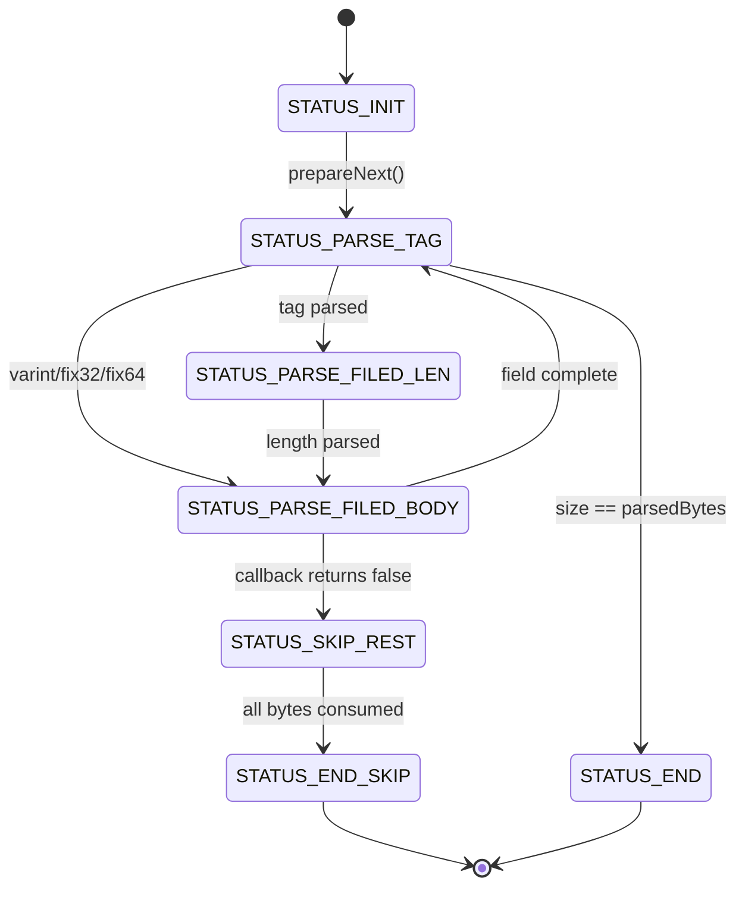
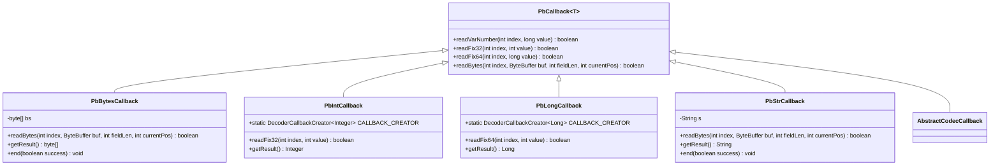
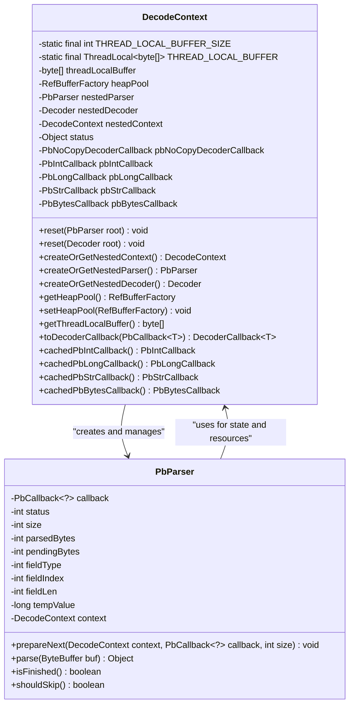
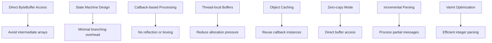
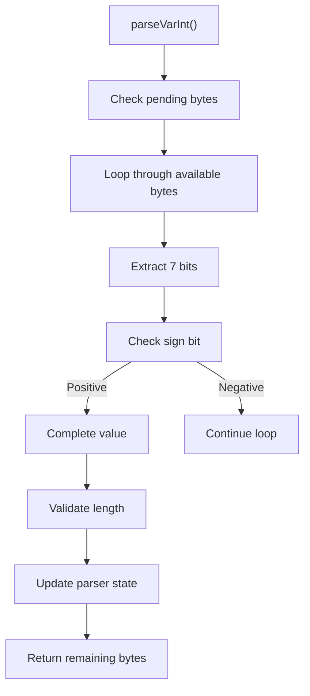
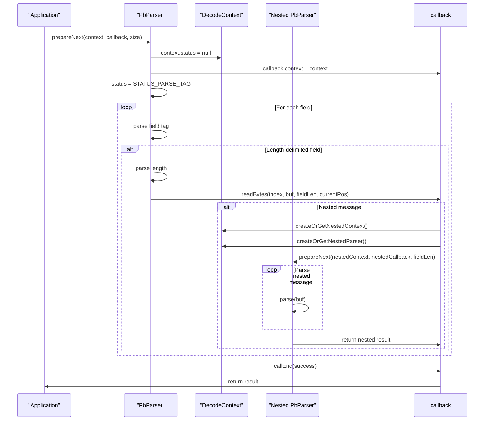
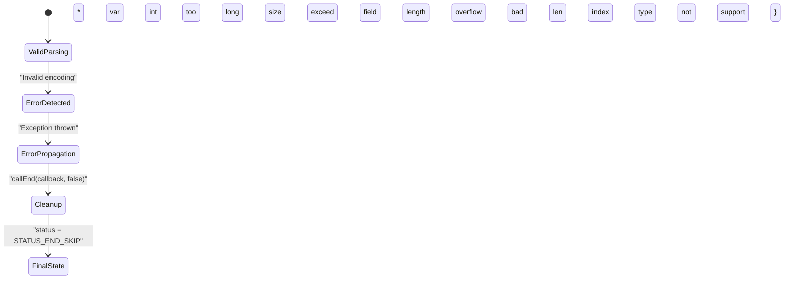

# Protobuf Parsing Implementation

<cite>
**Referenced Files in This Document**   
- [PbParser.java](file://client/src/main/java/com/github/dtprj/dongting/codec/PbParser.java)
- [DecodeContext.java](file://client/src/main/java/com/github/dtprj/dongting/codec/DecodeContext.java)
- [PbCallback.java](file://client/src/main/java/com/github/dtprj/dongting/codec/PbCallback.java)
- [PbBytesCallback.java](file://client/src/main/java/com/github/dtprj/dongting/codec/PbBytesCallback.java)
- [PbIntCallback.java](file://client/src/main/java/com/github/dtprj/dongting/codec/PbIntCallback.java)
- [PbLongCallback.java](file://client/src/main/java/com/github/dtprj/dongting/codec/PbLongCallback.java)
- [PbStrCallback.java](file://client/src/main/java/com/github/dtprj/dongting/codec/PbStrCallback.java)
- [PbNoCopyDecoderCallback.java](file://client/src/main/java/com/github/dtprj/dongting/codec/PbNoCopyDecoderCallback.java)
- [AbstractCodecCallback.java](file://client/src/main/java/com/github/dtprj/dongting/codec/AbstractCodecCallback.java)
- [PbUtil.java](file://client/src/main/java/com/github/dtprj/dongting/codec/PbUtil.java)
- [Decoder.java](file://client/src/main/java/com/github/dtprj/dongting/codec/Decoder.java)
- [PbParserTest.java](file://client/src/test/java/com/github/dtprj/dongting/codec/PbParserTest.java)
- [PbParserExTest.java](file://client/src/test/java/com/github/dtprj/dongting/codec/PbParserExTest.java)
- [dt_pb_test.proto](file://client/src/test/proto/dt_pb_test.proto)
</cite>

## Table of Contents
1. [Introduction](#introduction)
2. [Streaming Parser Design](#streaming-parser-design)
3. [Callback-Based Architecture](#callback-based-architecture)
4. [DecodeContext Integration](#decodecontext-integration)
5. [Performance Optimizations](#performance-optimizations)
6. [Nested Message Parsing](#nested-message-parsing)
7. [Error Handling](#error-handling)
8. [Conclusion](#conclusion)

## Introduction

The Dongting PbParser implementation provides an efficient protobuf message parsing system designed for high-performance applications with minimal overhead. The parser processes protobuf wire format incrementally, enabling streaming parsing without requiring complete messages to be available before processing begins. This design is particularly beneficial for network applications where data arrives in chunks and low-latency processing is critical.

The core architecture revolves around a state machine-based parser that handles the protobuf wire format specification, including variable-length integers, fixed-length values, and length-delimited fields. The implementation leverages direct ByteBuffer access to avoid unnecessary data copying and intermediate object creation, significantly reducing memory pressure and garbage collection overhead.

**Section sources**
- [PbParser.java](file://client/src/main/java/com/github/dtprj/dongting/codec/PbParser.java#L1-L437)
- [PbUtil.java](file://client/src/main/java/com/github/dtprj/dongting/codec/PbUtil.java#L1-L408)

## Streaming Parser Design

The PbParser implements a streaming design that processes protobuf messages incrementally as data becomes available. This approach allows the parser to handle messages of arbitrary size without requiring the entire message to be buffered in memory.



**Diagram sources**
- [PbParser.java](file://client/src/main/java/com/github/dtprj/dongting/codec/PbParser.java#L28-L34)

The parser operates through a state machine with the following states:
- **STATUS_INIT**: Initial state before parsing begins
- **STATUS_PARSE_TAG**: Parsing field tag (field number and wire type)
- **STATUS_PARSE_FILED_LEN**: Parsing length for length-delimited fields
- **STATUS_PARSE_FILED_BODY**: Parsing the actual field value
- **STATUS_SKIP_REST**: Skipping remaining data when a callback indicates uninterested
- **STATUS_END**: Successfully completed parsing
- **STATUS_END_SKIP**: Completed parsing with skipped data

The parser can be fed data incrementally through the `parse(ByteBuffer buf)` method, which processes available bytes and returns `null` if more data is needed. When parsing is complete, the method returns the result object from the callback's `getResult()` method.

**Section sources**
- [PbParser.java](file://client/src/main/java/com/github/dtprj/dongting/codec/PbParser.java#L103-L156)
- [PbParserTest.java](file://client/src/test/java/com/github/dtprj/dongting/codec/PbParserTest.java#L461-L473)

## Callback-Based Architecture

The PbParser employs a callback-based architecture using specialized callback interfaces to handle different field types efficiently. This design allows for type-specific processing without boxing/unboxing overhead and enables early termination when certain fields are not of interest.



**Diagram sources**
- [PbCallback.java](file://client/src/main/java/com/github/dtprj/dongting/codec/PbCallback.java#L23-L41)
- [PbBytesCallback.java](file://client/src/main/java/com/github/dtprj/dongting/codec/PbBytesCallback.java#L23-L45)
- [PbIntCallback.java](file://client/src/main/java/com/github/dtprj/dongting/codec/PbIntCallback.java#L21-L40)
- [PbLongCallback.java](file://client/src/main/java/com/github/dtprj/dongting/codec/PbLongCallback.java#L21-L40)
- [PbStrCallback.java](file://client/src/main/java/com/github/dtprj/dongting/codec/PbStrCallback.java#L23-L45)

The callback interfaces provide methods for handling different protobuf wire types:
- **PbBytesCallback**: Handles bytes and string fields (TYPE_LENGTH_DELIMITED)
- **PbIntCallback**: Handles 32-bit integer fields (TYPE_VAR_INT and TYPE_FIX32)
- **PbLongCallback**: Handles 64-bit integer fields (TYPE_VAR_INT and TYPE_FIX64)
- **PbStrCallback**: Specifically optimized for string fields

Each callback returns a boolean indicating whether parsing should continue (`true`) or skip the remaining message (`false`). This allows for efficient filtering when only specific fields are needed.

**Section sources**
- [PbCallback.java](file://client/src/main/java/com/github/dtprj/dongting/codec/PbCallback.java#L25-L39)
- [AbstractCodecCallback.java](file://client/src/main/java/com/github/dtprj/dongting/codec/AbstractCodecCallback.java#L32-L210)

## DecodeContext Integration

The DecodeContext serves as a central coordination point between the parser and its components, managing state and providing access to shared resources. It integrates the PbParser with the core decoding system and supports both copy and no-copy decoding modes.



**Diagram sources**
- [DecodeContext.java](file://client/src/main/java/com/github/dtprj/dongting/codec/DecodeContext.java#L26-L168)
- [PbParser.java](file://client/src/main/java/com/github/dtprj/dongting/codec/PbParser.java#L26-L437)

The DecodeContext provides several key services:
- **Thread-local buffering**: A 4KB thread-local buffer for temporary storage during parsing
- **Object pooling**: Access to ByteBuffer pools through RefBufferFactory to minimize allocation
- **Nested parsing**: Methods to create and retrieve nested parsers, decoders, and contexts
- **Callback caching**: Reusable instances of common callbacks to avoid allocation
- **Status sharing**: An Object field for temporary state storage during parsing

The context supports both copy and no-copy decoding modes through its integration with the buffer pool system. In no-copy mode, RefBuffer instances are created directly from pooled ByteBuffers, avoiding data copying.

**Section sources**
- [DecodeContext.java](file://client/src/main/java/com/github/dtprj/dongting/codec/DecodeContext.java#L26-L168)
- [PbNoCopyDecoderCallback.java](file://client/src/main/java/com/github/dtprj/dongting/codec/PbNoCopyDecoderCallback.java#L23-L72)

## Performance Optimizations

The PbParser implementation incorporates several performance optimizations to minimize overhead and maximize throughput:



**Diagram sources**
- [PbParser.java](file://client/src/main/java/com/github/dtprj/dongting/codec/PbParser.java#L189-L254)
- [DecodeContext.java](file://client/src/main/java/com/github/dtprj/dongting/codec/DecodeContext.java#L29-L30)

Key performance optimizations include:

**Direct ByteBuffer Access**: The parser operates directly on ByteBuffer instances without copying data to intermediate arrays. This reduces memory usage and eliminates copy overhead.

**Efficient Varint Parsing**: The parser uses an optimized algorithm for variable-length integers that minimizes branching and maximizes throughput:



**Object Reuse**: The DecodeContext caches frequently used callback instances (PbIntCallback, PbLongCallback, etc.) to avoid object allocation during parsing.

**Thread-local Storage**: A 4KB thread-local buffer is used for temporary storage during string and byte array parsing, reducing heap allocation.

**Zero-copy Mode**: For byte array fields, the parser can create RefBuffer instances directly from pooled buffers, avoiding data copying.

**Section sources**
- [PbParser.java](file://client/src/main/java/com/github/dtprj/dongting/codec/PbParser.java#L189-L254)
- [AbstractCodecCallback.java](file://client/src/main/java/com/github/dtprj/dongting/codec/AbstractCodecCallback.java#L51-L105)
- [DecodeContext.java](file://client/src/main/java/com/github/dtprj/dongting/codec/DecodeContext.java#L29-L30)

## Nested Message Parsing

The parser supports efficient parsing of complex nested messages through its integration with the DecodeContext and nested parsing capabilities.



**Diagram sources**
- [PbParser.java](file://client/src/main/java/com/github/dtprj/dongting/codec/PbParser.java#L353-L380)
- [AbstractCodecCallback.java](file://client/src/main/java/com/github/dtprj/dongting/codec/AbstractCodecCallback.java#L155-L176)

For nested messages, the implementation follows this pattern:

1. The outer parser encounters a length-delimited field containing a nested message
2. The callback invokes `createOrGetNestedContext()` and `createOrGetNestedParser()` on the DecodeContext
3. The nested parser is prepared with the field length and appropriate callback
4. The nested parser processes the field data incrementally
5. Validation ensures the nested parser consumes exactly the expected number of bytes

The parser also handles optional and repeated fields efficiently:

- **Optional fields**: Fields that don't appear in the message are simply not processed
- **Repeated fields**: Multiple instances of the same field number are processed sequentially, with the callback handling accumulation

The test cases demonstrate parsing of complex nested structures with proper validation of field ordering and completeness.

**Section sources**
- [PbParserTest.java](file://client/src/test/java/com/github/dtprj/dongting/codec/PbParserTest.java#L36-L200)
- [dt_pb_test.proto](file://client/src/test/proto/dt_pb_test.proto#L38-L51)

## Error Handling

The parser implements comprehensive error handling for invalid protobuf encodings and mismatched schemas:



**Diagram sources**
- [PbParser.java](file://client/src/main/java/com/github/dtprj/dongting/codec/PbParser.java#L208-L214)
- [PbParserExTest.java](file://client/src/test/java/com/github/dtprj/dongting/codec/PbParserExTest.java#L63-L232)

The parser detects and handles the following error conditions:

**Varint Length Errors**: Variable-length integers that exceed the maximum allowed length (5 bytes for 32-bit, 10 bytes for 64-bit values):

```java
// Maximum 5 bytes for 32bit number in proto buffer
final int MAX_BYTES = 5;
if (pendingBytes + i > MAX_BYTES) {
    throw new PbException("var int too long: " + (pendingBytes + i + 1));
}
```

**Size Validation**: Ensures parsed data does not exceed the declared message size:

```java
if (parsedBytes > size) {
    throw new PbException("size exceed " + size);
}
```

**Field Length Overflow**: Prevents field length values that would cause buffer overruns:

```java
if (parsedBytes + value > size) {
    throw new PbException("field length overflow. len=" + value + ",index=" + fieldIndex);
}
```

**Invalid Field Parameters**: Validates field indices and lengths:

```java
if (value < 0) {
    throw new PbException("bad field len: " + fieldLen);
}
if (value == 0) {
    throw new PbException("bad index:" + value + ", last field index is" + fieldIndex);
}
```

When an error occurs, the parser ensures proper cleanup by calling `callEnd(callback, false)` to notify the callback of failure, then transitions to the `STATUS_END_SKIP` state. This guarantees that resources are properly released and the parser is left in a consistent state.

**Section sources**
- [PbParser.java](file://client/src/main/java/com/github/dtprj/dongting/codec/PbParser.java#L208-L214)
- [PbParserExTest.java](file://client/src/test/java/com/github/dtprj/dongting/codec/PbParserExTest.java#L63-L232)

## Conclusion

The Dongting PbParser implementation provides an efficient, streaming protobuf parsing solution with minimal overhead. Its state machine-based design processes messages incrementally, making it ideal for network applications where data arrives in chunks. The callback-based architecture allows for type-specific processing without boxing overhead and enables early termination when certain fields are not of interest.

Key strengths of the implementation include:
- **Streaming capability**: Processes messages incrementally without requiring complete messages
- **Performance optimizations**: Direct ByteBuffer access, object reuse, and thread-local storage minimize overhead
- **Flexible integration**: Seamlessly integrates with the DecodeContext for nested parsing and resource management
- **Robust error handling**: Comprehensive validation of protobuf encodings with proper cleanup
- **Memory efficiency**: Supports both copy and no-copy modes to balance performance and memory usage

The parser's design enables high-throughput processing of protobuf messages while maintaining low latency and minimal garbage collection pressure, making it well-suited for high-performance distributed systems.