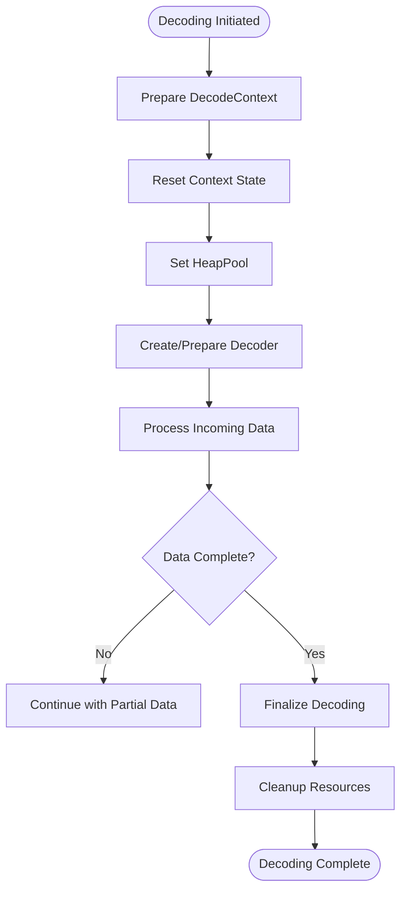
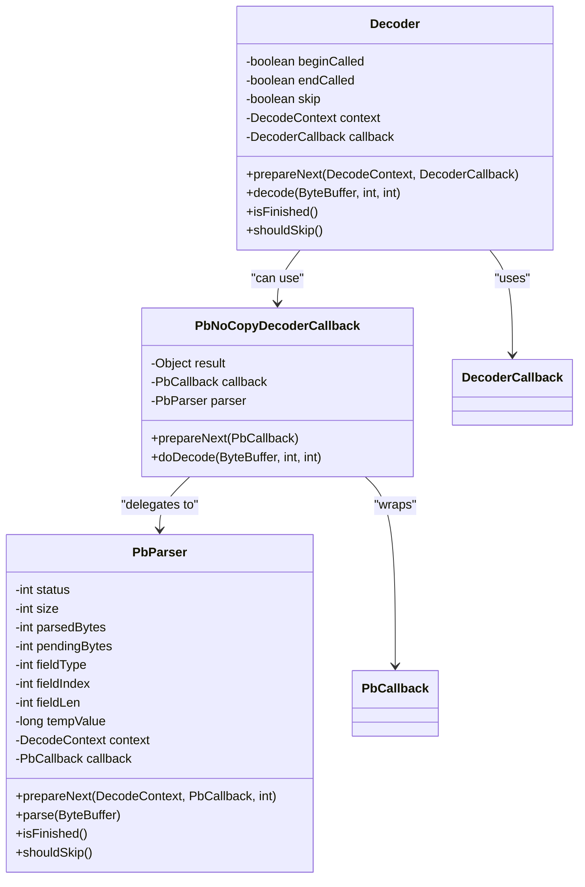
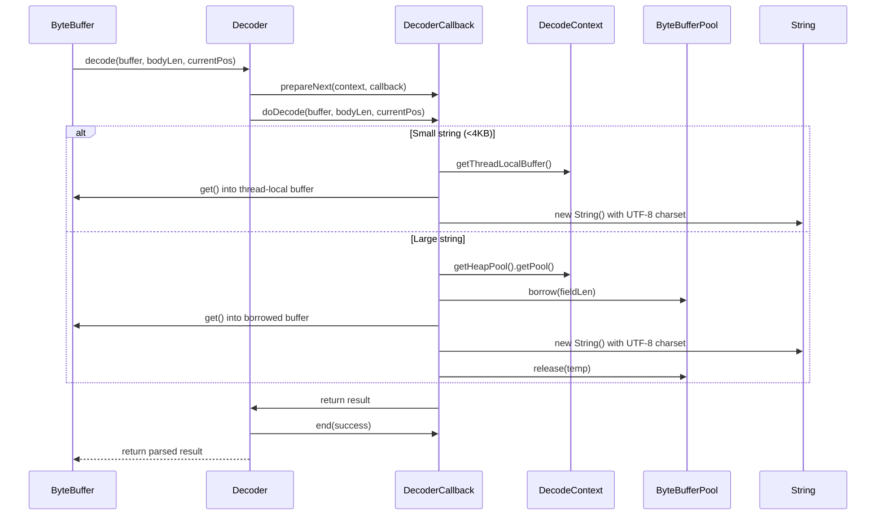
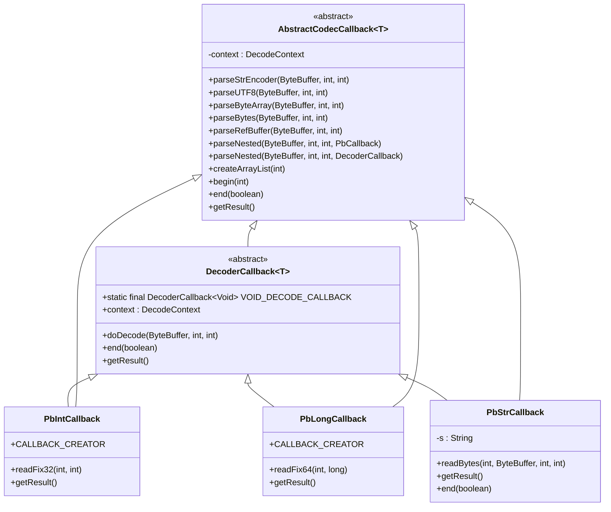
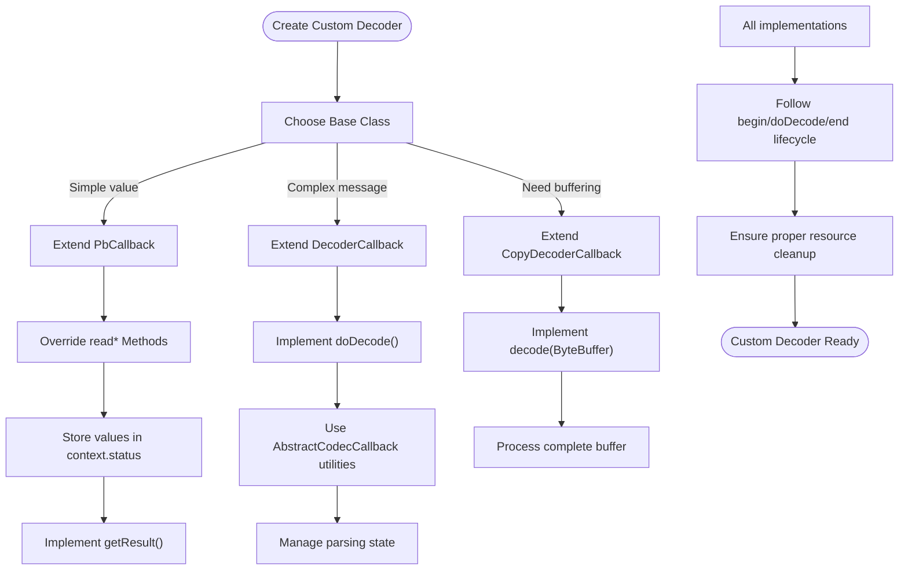
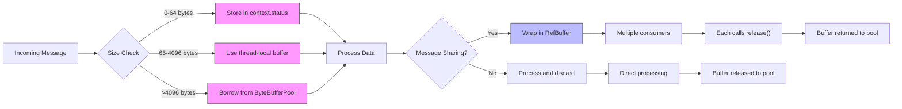
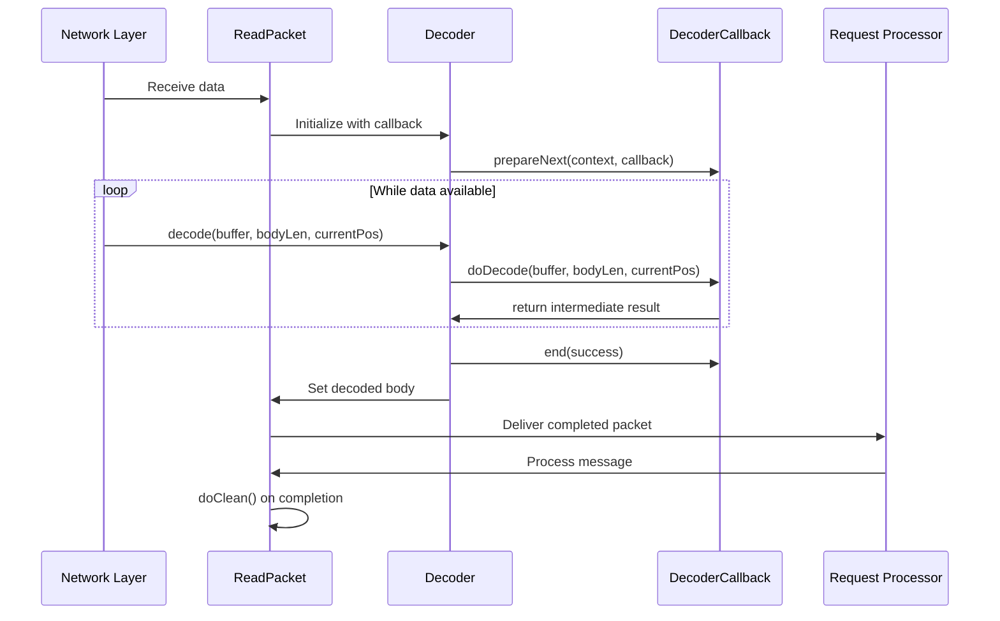

# Message Decoding Process

<cite>
**Referenced Files in This Document**   
- [DecodeContext.java](file://client/src/main/java/com/github/dtprj/dongting/codec/DecodeContext.java)
- [Decoder.java](file://client/src/main/java/com/github/dtprj/dongting/codec/Decoder.java)
- [PbParser.java](file://client/src/main/java/com/github/dtprj/dongting/codec/PbParser.java)
- [DecoderCallback.java](file://client/src/main/java/com/github/dtprj/dongting/codec/DecoderCallback.java)
- [AbstractCodecCallback.java](file://client/src/main/java/com/github/dtprj/dongting/codec/AbstractCodecCallback.java)
- [PbNoCopyDecoderCallback.java](file://client/src/main/java/com/github/dtprj/dongting/codec/PbNoCopyDecoderCallback.java)
- [PbCallback.java](file://client/src/main/java/com/github/dtprj/dongting/codec/PbCallback.java)
- [ReadPacket.java](file://client/src/main/java/com/github/dtprj/dongting/net/ReadPacket.java)
- [RefBufferDecoderCallback.java](file://client/src/main/java/com/github/dtprj/dongting/codec/RefBufferDecoderCallback.java)
- [BytesDecoderCallback.java](file://client/src/main/java/com/github/dtprj/dongting/codec/BytesDecoderCallback.java)
- [StrDecoderCallback.java](file://client/src/main/java/com/github/dtprj/dongting/codec/StrDecoderCallback.java)
- [CopyDecoderCallback.java](file://client/src/main/java/com/github/dtprj/dongting/codec/CopyDecoderCallback.java)
</cite>

## Table of Contents
1. [Two-Phase Decoding Mechanism](#two-phase-decoding-mechanism)
2. [Decoder Interface and PbParser Integration](#decoder-interface-and-pbparser-integration)
3. [Callback-Based Decoding Mechanism](#callback-based-decoding-mechanism)
4. [DecoderCallback and AbstractCodecCallback](#decodercallback-and-abstractcodeccallback)
5. [Custom Decoder Implementation](#custom-decoder-implementation)
6. [Buffer Management and Memory Efficiency](#buffer-management-and-memory-efficiency)
7. [Network Layer Integration](#network-layer-integration)

## Two-Phase Decoding Mechanism

The Dongting message decoding process employs a two-phase decoding mechanism centered around the `DecodeContext` class to efficiently handle variable-length messages. This approach separates the decoding lifecycle into initialization and execution phases, enabling optimal resource utilization and thread safety.

The `DecodeContext` class serves as a state container that manages decoding operations through thread-local buffers and object pooling. It maintains a 4KB thread-local buffer (`THREAD_LOCAL_BUFFER_SIZE`) to minimize heap allocations for small messages, while larger messages utilize heap pools configured through `RefBufferFactory`. The context supports nested decoding operations through its `createOrGetNestedContext()`, `createOrGetNestedParser()`, and `createOrGetNestedDecoder()` methods, allowing hierarchical message processing.

During the first phase, the decoding context is prepared by resetting its state and associating it with the appropriate decoder or parser. The `reset()` method ensures proper cleanup of nested contexts, parsers, and decoders, preventing resource leaks. In the second phase, the actual decoding occurs incrementally as data becomes available, with the context maintaining intermediate state between buffer reads.

**Diagram sources**
- [DecodeContext.java](file://client/src/main/java/com/github/dtprj/dongting/codec/DecodeContext.java#L26-L167)

**Section sources**
- [DecodeContext.java](file://client/src/main/java/com/github/dtprj/dongting/codec/DecodeContext.java#L26-L167)

## Decoder Interface and PbParser Integration

The `Decoder` interface works in conjunction with `PbParser` to provide a comprehensive protobuf-based message parsing system. The `Decoder` class acts as a wrapper that manages the decoding lifecycle, while `PbParser` handles the low-level protobuf wire format parsing.

The `Decoder` maintains state through boolean flags (`beginCalled`, `endCalled`, `skip`) that track the decoding progress. It delegates the actual parsing work to a `DecoderCallback` implementation, which contains the application-specific logic for processing decoded fields. The `decode()` method implements a position-aware parsing algorithm that handles both complete and partial message reads, making it suitable for network protocols where messages may arrive in fragments.

`PbParser` implements a state machine-based approach to protobuf parsing with distinct states for different parsing phases: `STATUS_INIT`, `STATUS_PARSE_TAG`, `STATUS_PARSE_FILED_LEN`, `STATUS_PARSE_FILED_BODY`, and others. This state machine efficiently handles variable-length encoding by parsing varints incrementally across multiple buffer reads. The parser supports all protobuf wire types including varint, fixed32, fixed64, and length-delimited fields.

The integration between `Decoder` and `PbParser` occurs through the `PbNoCopyDecoderCallback`, which bridges the two systems by wrapping a `PbCallback` and using a `PbParser` instance to parse the protobuf stream. This allows protobuf messages to be processed through the same callback-based interface as other message types.

**Diagram sources**
- [Decoder.java](file://client/src/main/java/com/github/dtprj/dongting/codec/Decoder.java#L23-L121)
- [PbParser.java](file://client/src/main/java/com/github/dtprj/dongting/codec/PbParser.java#L26-L437)
- [PbNoCopyDecoderCallback.java](file://client/src/main/java/com/github/dtprj/dongting/codec/PbNoCopyDecoderCallback.java#L23-L72)

**Section sources**
- [Decoder.java](file://client/src/main/java/com/github/dtprj/dongting/codec/Decoder.java#L23-L121)
- [PbParser.java](file://client/src/main/java/com/github/dtprj/dongting/codec/PbParser.java#L26-L437)

## Callback-Based Decoding Mechanism

The callback-based decoding mechanism in Dongting enables zero-copy deserialization for performance-critical paths by eliminating unnecessary memory allocations and data copying. This approach uses the `DecoderCallback` abstract class as the foundation for application-specific message processing logic.

The zero-copy principle is achieved through direct ByteBuffer manipulation in the `doDecode()` method, where callbacks can process data as it arrives without creating intermediate objects. The `AbstractCodecCallback` base class provides utility methods like `parseUTF8()`, `parseBytes()`, and `parseRefBuffer()` that implement efficient parsing strategies using thread-local buffers and object pooling.

For small strings (under 4KB), the system uses a thread-local byte array to avoid heap allocations. For larger strings, it borrows buffers from the configured `ByteBufferPool` and releases them after use. The `parseRefBuffer()` method creates `RefBuffer` instances that reference pooled byte buffers, allowing the parsed data to be efficiently shared across components without copying.

The callback lifecycle is managed through `begin()`, `doDecode()`, and `end()` methods, with the `context` field in `AbstractCodecCallback` providing access to the `DecodeContext` for resource management. This design ensures that all allocated resources are properly cleaned up, even in error conditions, through try-finally blocks in the calling code.

**Diagram sources**
- [DecoderCallback.java](file://client/src/main/java/com/github/dtprj/dongting/codec/DecoderCallback.java#L23-L40)
- [AbstractCodecCallback.java](file://client/src/main/java/com/github/dtprj/dongting/codec/AbstractCodecCallback.java#L32-L210)
- [DecodeContext.java](file://client/src/main/java/com/github/dtprj/dongting/codec/DecodeContext.java#L26-L167)

**Section sources**
- [DecoderCallback.java](file://client/src/main/java/com/github/dtprj/dongting/codec/DecoderCallback.java#L23-L40)
- [AbstractCodecCallback.java](file://client/src/main/java/com/github/dtprj/dongting/codec/AbstractCodecCallback.java#L32-L210)

## DecoderCallback and AbstractCodecCallback

The `DecoderCallback` and `AbstractCodecCallback` classes form the foundation of Dongting's efficient message processing architecture, enabling high-performance decoding with minimal memory allocations. These classes work together to provide a flexible yet efficient framework for handling various message types.

`DecoderCallback<T>` extends `AbstractCodecCallback<T>` and defines the core contract for message decoding with its abstract `doDecode()` method. The base implementation includes a `VOID_DECODE_CALLBACK` singleton that serves as a no-op callback for cases where message content doesn't need to be processed. This callback-based approach allows the system to skip parsing of unwanted messages by setting the `skip` flag, improving performance when dealing with filtered or irrelevant messages.

`AbstractCodecCallback` provides a rich set of utility methods for common parsing operations, including `parseUTF8()` for string decoding, `parseBytes()` for byte array extraction, and `parseRefBuffer()` for pooled buffer creation. These methods implement sophisticated memory management strategies, such as using thread-local buffers for small allocations and object pooling for larger ones. The class also supports nested message parsing through `parseNested()` methods that can handle both `PbCallback` and `DecoderCallback` types.

The state management pattern uses the `context.status` field as a general-purpose storage for intermediate parsing results, reducing the need for instance variables in callback implementations. This approach minimizes object allocation and improves cache locality. The `getResult()` method extracts the final result from this state, while `end()` performs cleanup operations to prepare the callback for reuse.

**Diagram sources**
- [DecoderCallback.java](file://client/src/main/java/com/github/dtprj/dongting/codec/DecoderCallback.java#L23-L40)
- [AbstractCodecCallback.java](file://client/src/main/java/com/github/dtprj/dongting/codec/AbstractCodecCallback.java#L32-L210)
- [PbIntCallback.java](file://client/src/main/java/com/github/dtprj/dongting/codec/PbIntCallback.java#L21-L40)
- [PbLongCallback.java](file://client/src/main/java/com/github/dtprj/dongting/codec/PbLongCallback.java#L21-L40)
- [PbStrCallback.java](file://client/src/main/java/com/github/dtprj/dongting/codec/PbStrCallback.java#L23-L45)

**Section sources**
- [DecoderCallback.java](file://client/src/main/java/com/github/dtprj/dongting/codec/DecoderCallback.java#L23-L40)
- [AbstractCodecCallback.java](file://client/src/main/java/com/github/dtprj/dongting/codec/AbstractCodecCallback.java#L32-L210)

## Custom Decoder Implementation

Implementing custom decoders in Dongting involves extending the appropriate callback class based on the message type and performance requirements. The framework provides several specialized callback implementations that serve as templates for different use cases.

For simple value types, developers can use the provided `PbIntCallback`, `PbLongCallback`, and `PbStrCallback` classes, or create similar implementations for custom types. These callbacks follow a pattern where field values are stored in the `context.status` field during parsing and retrieved through the `getResult()` method. The `CALLBACK_CREATOR` pattern, as seen in `PbIntCallback`, provides a convenient way to create and cache callback instances through the `DecodeContext`.

For more complex message types, developers can extend `DecoderCallback` directly and implement the `doDecode()` method to handle the specific message format. The `CopyDecoderCallback` abstract class provides a convenient base for cases where the entire message needs to be buffered before processing, automatically managing the temporary buffer allocation and release.

When implementing custom decoders for protobuf messages, developers typically extend `PbCallback` and override the appropriate `read*` methods (`readVarNumber`, `readFix32`, `readFix64`, `readBytes`). The callback receives field index and value parameters, allowing it to route data to the appropriate fields in the target object.

**Diagram sources**
- [PbIntCallback.java](file://client/src/main/java/com/github/dtprj/dongting/codec/PbIntCallback.java#L21-L40)
- [PbLongCallback.java](file://client/src/main/java/com/github/dtprj/dongting/codec/PbLongCallback.java#L21-L40)
- [PbStrCallback.java](file://client/src/main/java/com/github/dtprj/dongting/codec/PbStrCallback.java#L23-L45)
- [CopyDecoderCallback.java](file://client/src/main/java/com/github/dtprj/dongting/codec/CopyDecoderCallback.java#L23-L55)
- [BytesDecoderCallback.java](file://client/src/main/java/com/github/dtprj/dongting/codec/BytesDecoderCallback.java#L23-L43)
- [StrDecoderCallback.java](file://client/src/main/java/com/github/dtprj/dongting/codec/StrDecoderCallback.java#L24-L44)
- [RefBufferDecoderCallback.java](file://client/src/main/java/com/github/dtprj/dongting/codec/RefBufferDecoderCallback.java#L25-L70)

**Section sources**
- [PbIntCallback.java](file://client/src/main/java/com/github/dtprj/dongting/codec/PbIntCallback.java#L21-L40)
- [PbLongCallback.java](file://client/src/main/java/com/github/dtprj/dongting/codec/PbLongCallback.java#L21-L40)
- [PbStrCallback.java](file://client/src/main/java/com/github/dtprj/dongting/codec/PbStrCallback.java#L23-L45)

## Buffer Management and Memory Efficiency

Dongting's message decoding process incorporates sophisticated buffer management strategies to maximize memory efficiency and minimize garbage collection pressure. The system employs a multi-tiered approach that combines thread-local storage, object pooling, and zero-copy techniques to handle messages of varying sizes.

The `DecodeContext` class maintains a 4KB thread-local buffer (`THREAD_LOCAL_BUFFER_SIZE`) that is reused across decoding operations within the same thread. This eliminates heap allocations for small messages and reduces contention on shared memory pools. For strings under 64 bytes, the system stores parsing state directly in `context.status`, avoiding object creation entirely.

For larger allocations, the framework integrates with `RefBufferFactory` and `ByteBufferPool` to provide object pooling capabilities. The `parseUTF8()` and `parseBytes()` methods in `AbstractCodecCallback` automatically route allocations to the appropriate pool based on size. This ensures that large temporary buffers are recycled rather than discarded, significantly reducing memory pressure in high-throughput scenarios.

The `RefBufferDecoderCallback` and `RefBuffer` classes implement a reference-counted buffer system that allows multiple components to share message data without copying. When a message is decoded into a `RefBuffer`, the reference count is incremented, and each consumer releases its reference when done. This enables efficient message broadcasting and pipelining without unnecessary data duplication.

**Diagram sources**
- [DecodeContext.java](file://client/src/main/java/com/github/dtprj/dongting/codec/DecodeContext.java#L26-L167)
- [AbstractCodecCallback.java](file://client/src/main/java/com/github/dtprj/dongting/codec/AbstractCodecCallback.java#L32-L210)
- [RefBufferDecoderCallback.java](file://client/src/main/java/com/github/dtprj/dongting/codec/RefBufferDecoderCallback.java#L25-L70)
- [buf/ package](file://client/src/main/java/com/github/dtprj/dongting/buf/)

**Section sources**
- [DecodeContext.java](file://client/src/main/java/com/github/dtprj/dongting/codec/DecodeContext.java#L26-L167)
- [AbstractCodecCallback.java](file://client/src/main/java/com/github/dtprj/dongting/codec/AbstractCodecCallback.java#L32-L210)
- [RefBufferDecoderCallback.java](file://client/src/main/java/com/github/dtprj/dongting/codec/RefBufferDecoderCallback.java#L25-L70)

## Network Layer Integration

The message decoding process integrates seamlessly with Dongting's network layer through the `ReadPacket` system, which serves as the container for incoming messages. This integration enables efficient handling of various message formats while maintaining proper resource management throughout the message lifecycle.

The `ReadPacket<T>` class extends `Packet` and holds the decoded message body in its `body` field. When a message is fully decoded, the resulting object is assigned to this field and made available to the appropriate processor. The `doClean()` method ensures proper cleanup of resources by calling `clean()` on the body if it implements `DtCleanable`, which is particularly important for `RefBuffer` instances that require explicit release.

The decoding process is typically initiated by network I/O workers when data arrives on a channel. The `NioClient` and `NioServer` components use `DecoderCallbackCreator` instances to obtain the appropriate decoder for each message type, allowing for dynamic selection of decoding strategies based on the message header or command type.

This integration supports both synchronous and asynchronous processing patterns. For performance-critical paths, the zero-copy decoding approach allows messages to be processed directly from the network buffer without intermediate copying. For complex messages requiring buffering, the system automatically manages temporary buffer allocation and release through the pooling mechanisms described earlier.

**Diagram sources**
- [ReadPacket.java](file://client/src/main/java/com/github/dtprj/dongting/net/ReadPacket.java#L23-L45)
- [Decoder.java](file://client/src/main/java/com/github/dtprj/dongting/codec/Decoder.java#L23-L121)
- [DecoderCallback.java](file://client/src/main/java/com/github/dtprj/dongting/codec/DecoderCallback.java#L23-L40)

**Section sources**
- [ReadPacket.java](file://client/src/main/java/com/github/dtprj/dongting/net/ReadPacket.java#L23-L45)
- [Decoder.java](file://client/src/main/java/com/github/dtprj/dongting/codec/Decoder.java#L23-L121)