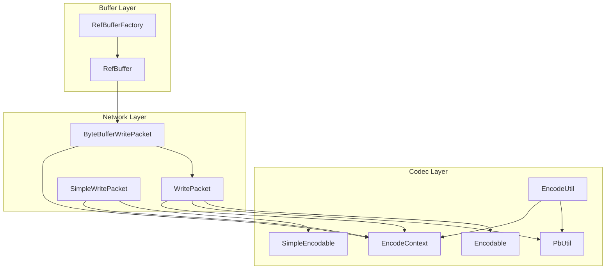
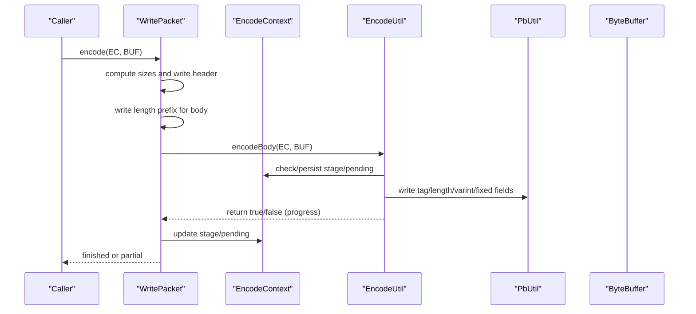
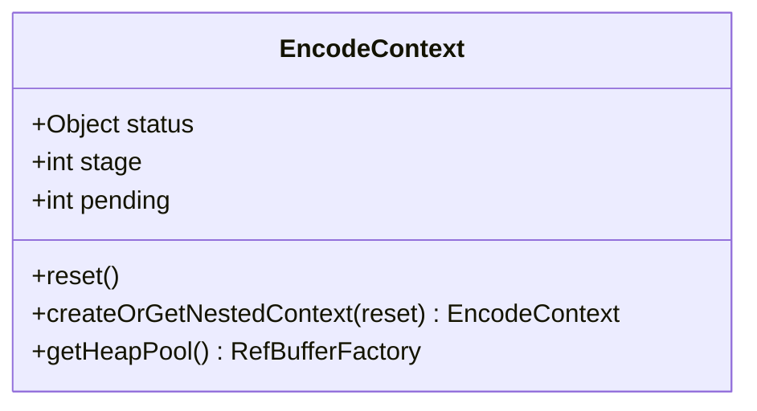
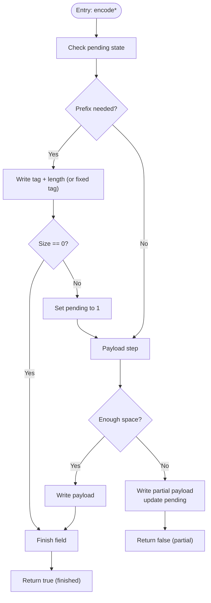
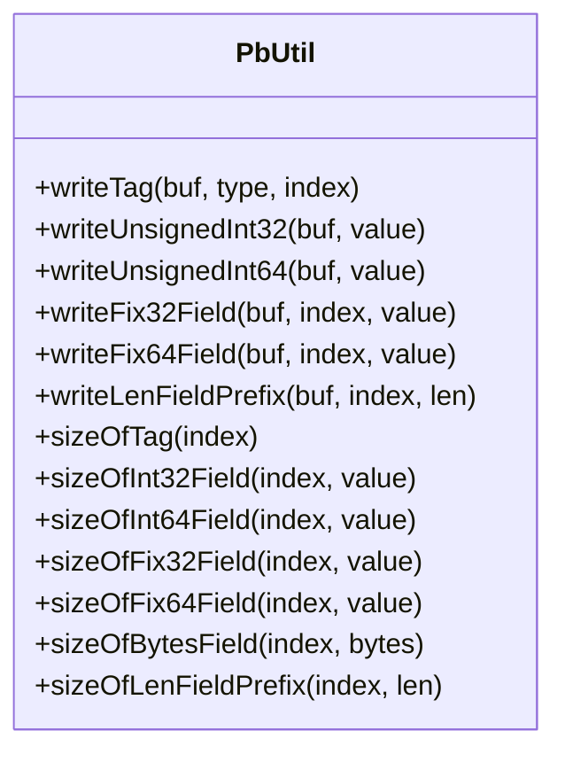
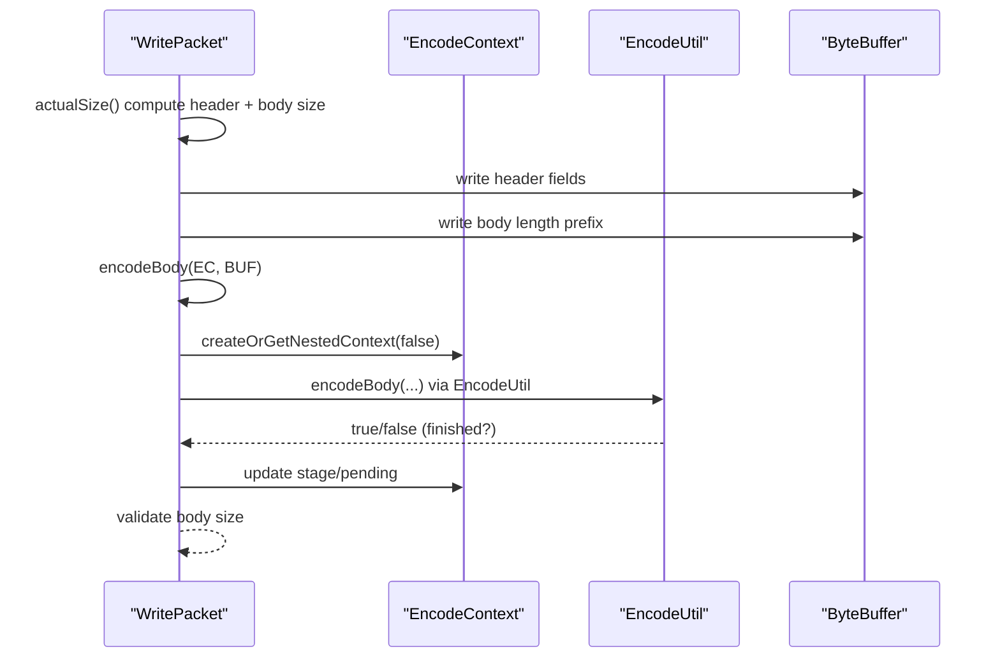
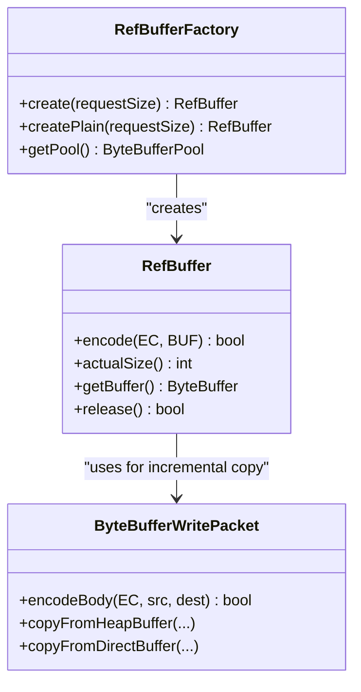
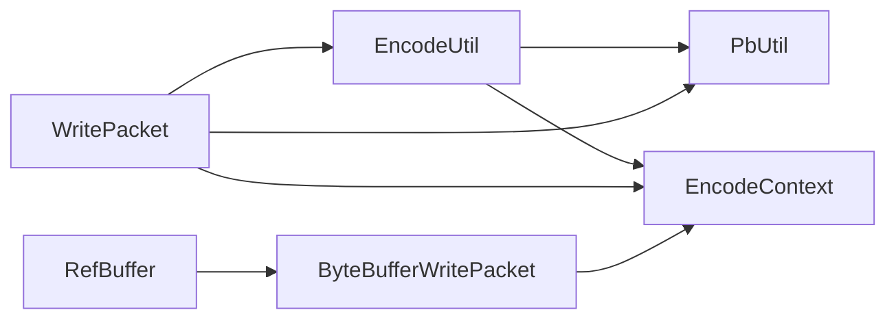

# Core Encoding Mechanics

<cite>
**Referenced Files in This Document**
- [EncodeContext.java](file://client/src/main/java/com/github/dtprj/dongting/codec/EncodeContext.java)
- [EncodeUtil.java](file://client/src/main/java/com/github/dtprj/dongting/codec/EncodeUtil.java)
- [PbUtil.java](file://client/src/main/java/com/github/dtprj/dongting/codec/PbUtil.java)
- [Encodable.java](file://client/src/main/java/com/github/dtprj/dongting/codec/Encodable.java)
- [SimpleEncodable.java](file://client/src/main/java/com/github/dtprj/dongting/codec/SimpleEncodable.java)
- [WritePacket.java](file://client/src/main/java/com/github/dtprj/dongting/net/WritePacket.java)
- [ByteBufferWritePacket.java](file://client/src/main/java/com/github/dtprj/dongting/net/ByteBufferWritePacket.java)
- [SimpleWritePacket.java](file://client/src/main/java/com/github/dtprj/dongting/net/SimpleWritePacket.java)
- [RefBuffer.java](file://client/src/main/java/com/github/dtprj/dongting/buf/RefBuffer.java)
- [RefBufferFactory.java](file://client/src/main/java/com/github/dtprj/dongting/buf/RefBufferFactory.java)
- [EncodeUtilTest.java](file://client/src/test/java/com/github/dtprj/dongting/codec/EncodeUtilTest.java)
</cite>

## Table of Contents
1. [Introduction](#introduction)
2. [Project Structure](#project-structure)
3. [Core Components](#core-components)
4. [Architecture Overview](#architecture-overview)
5. [Detailed Component Analysis](#detailed-component-analysis)
6. [Dependency Analysis](#dependency-analysis)
7. [Performance Considerations](#performance-considerations)
8. [Troubleshooting Guide](#troubleshooting-guide)
9. [Conclusion](#conclusion)
10. [Appendices](#appendices)

## Introduction
This document explains Dongting’s core encoding mechanics with a focus on the two-phase encoding process powered by EncodeContext. It details how EncodeContext coordinates variable-length message encoding, manages buffer allocation and progress tracking, and integrates with the network layer’s packet system. It also covers the internal algorithms of EncodeUtil for integers, longs, strings, and byte arrays, the handling of length-prefixed fields, and strategies to prevent buffer overflows during incremental encoding.

## Project Structure
The encoding system spans codec utilities, packet encoders, and buffer management:

- Codec layer: EncodeContext, EncodeUtil, PbUtil, Encodable/SimpleEncodable
- Network layer: WritePacket, ByteBufferWritePacket, SimpleWritePacket
- Buffer layer: RefBuffer, RefBufferFactory

**Diagram sources**
- [EncodeContext.java](file://client/src/main/java/com/github/dtprj/dongting/codec/EncodeContext.java#L1-L66)
- [EncodeUtil.java](file://client/src/main/java/com/github/dtprj/dongting/codec/EncodeUtil.java#L1-L528)
- [PbUtil.java](file://client/src/main/java/com/github/dtprj/dongting/codec/PbUtil.java#L1-L408)
- [Encodable.java](file://client/src/main/java/com/github/dtprj/dongting/codec/Encodable.java#L1-L31)
- [SimpleEncodable.java](file://client/src/main/java/com/github/dtprj/dongting/codec/SimpleEncodable.java#L1-L28)
- [WritePacket.java](file://client/src/main/java/com/github/dtprj/dongting/net/WritePacket.java#L1-L182)
- [ByteBufferWritePacket.java](file://client/src/main/java/com/github/dtprj/dongting/net/ByteBufferWritePacket.java#L1-L90)
- [SimpleWritePacket.java](file://client/src/main/java/com/github/dtprj/dongting/net/SimpleWritePacket.java#L1-L53)
- [RefBuffer.java](file://client/src/main/java/com/github/dtprj/dongting/buf/RefBuffer.java#L1-L184)
- [RefBufferFactory.java](file://client/src/main/java/com/github/dtprj/dongting/buf/RefBufferFactory.java#L1-L42)

**Section sources**
- [EncodeContext.java](file://client/src/main/java/com/github/dtprj/dongting/codec/EncodeContext.java#L1-L66)
- [EncodeUtil.java](file://client/src/main/java/com/github/dtprj/dongting/codec/EncodeUtil.java#L1-L528)
- [PbUtil.java](file://client/src/main/java/com/github/dtprj/dongting/codec/PbUtil.java#L1-L408)
- [WritePacket.java](file://client/src/main/java/com/github/dtprj/dongting/net/WritePacket.java#L1-L182)
- [ByteBufferWritePacket.java](file://client/src/main/java/com/github/dtprj/dongting/net/ByteBufferWritePacket.java#L1-L90)
- [SimpleWritePacket.java](file://client/src/main/java/com/github/dtprj/dongting/net/SimpleWritePacket.java#L1-L53)
- [RefBuffer.java](file://client/src/main/java/com/github/dtprj/dongting/buf/RefBuffer.java#L1-L184)
- [RefBufferFactory.java](file://client/src/main/java/com/github/dtprj/dongting/buf/RefBufferFactory.java#L1-L42)

## Core Components
- EncodeContext: Tracks encoding progress with stage and pending counters, and provides nested contexts for sub-encoders. It holds a heap pool reference for buffer reuse.
- EncodeUtil: Implements two-phase encoding for variable-length fields and primitive arrays, with careful remaining-space checks and incremental progress tracking.
- PbUtil: Provides low-level protobuf-compatible encoding helpers for tags, varints, fixed-size fields, and length-delimited fields.
- Encodable/SimpleEncodable: Contract for encodable bodies; WritePacket implements Encodable to encode full packets.
- ByteBufferWritePacket/SimpleWritePacket: Concrete encoders for raw buffers and simple encodables.
- RefBuffer/RefBufferFactory: Buffer abstraction with pooling and reference counting, used by encoders for efficient memory management.

**Section sources**
- [EncodeContext.java](file://client/src/main/java/com/github/dtprj/dongting/codec/EncodeContext.java#L1-L66)
- [EncodeUtil.java](file://client/src/main/java/com/github/dtprj/dongting/codec/EncodeUtil.java#L1-L528)
- [PbUtil.java](file://client/src/main/java/com/github/dtprj/dongting/codec/PbUtil.java#L1-L408)
- [Encodable.java](file://client/src/main/java/com/github/dtprj/dongting/codec/Encodable.java#L1-L31)
- [SimpleEncodable.java](file://client/src/main/java/com/github/dtprj/dongting/codec/SimpleEncodable.java#L1-L28)
- [WritePacket.java](file://client/src/main/java/com/github/dtprj/dongting/net/WritePacket.java#L1-L182)
- [ByteBufferWritePacket.java](file://client/src/main/java/com/github/dtprj/dongting/net/ByteBufferWritePacket.java#L1-L90)
- [SimpleWritePacket.java](file://client/src/main/java/com/github/dtprj/dongting/net/SimpleWritePacket.java#L1-L53)
- [RefBuffer.java](file://client/src/main/java/com/github/dtprj/dongting/buf/RefBuffer.java#L1-L184)
- [RefBufferFactory.java](file://client/src/main/java/com/github/dtprj/dongting/buf/RefBufferFactory.java#L1-L42)

## Architecture Overview
Dongting’s encoding pipeline follows a layered approach:
- Packet-level encoding: WritePacket computes sizes, writes headers, and delegates body encoding to sub-encoders.
- Body-level encoding: EncodeUtil performs two-phase encoding for variable-length fields and arrays, using EncodeContext to track progress.
- Low-level encoding: PbUtil writes tags, varints, fixed-size fields, and length-delimited prefixes.
- Buffer management: RefBuffer and ByteBufferWritePacket handle direct/heap buffers and incremental copying with EncodeContext.status.

**Diagram sources**
- [WritePacket.java](file://client/src/main/java/com/github/dtprj/dongting/net/WritePacket.java#L112-L164)
- [EncodeUtil.java](file://client/src/main/java/com/github/dtprj/dongting/codec/EncodeUtil.java#L155-L183)
- [PbUtil.java](file://client/src/main/java/com/github/dtprj/dongting/codec/PbUtil.java#L64-L116)
- [EncodeContext.java](file://client/src/main/java/com/github/dtprj/dongting/codec/EncodeContext.java#L40-L66)

## Detailed Component Analysis

### EncodeContext: Two-Phase Encoding Coordinator
EncodeContext encapsulates:
- Stage: Current phase of the encoder (begin/end constants and user-defined indices).
- Pending: Tracks partial progress for multi-step encodings (e.g., arrays, strings, buffers).
- Nested contexts: createOrGetNestedContext enables sub-encoders to operate independently while sharing the parent’s heap pool.
- Reset: Clears state and nested context usage.

Two-phase encoding pattern:
- Phase 0: Emit field prefix (tag + length for length-delimited fields).
- Phase 1+: Emit payload until completion or buffer exhaustion.

**Diagram sources**
- [EncodeContext.java](file://client/src/main/java/com/github/dtprj/dongting/codec/EncodeContext.java#L24-L66)

**Section sources**
- [EncodeContext.java](file://client/src/main/java/com/github/dtprj/dongting/codec/EncodeContext.java#L40-L66)

### EncodeUtil: Variable-Length Encoding Algorithms
Key algorithms and behaviors:
- Length-prefixed fields: writeObjPrefix ensures tag+length is emitted first; subsequent phases append payload.
- Arrays and lists: encodeInt32s/encodeInt64s/encodeFix32s/encodeFix64s iterate over elements, writing tags and values; pending tracks current element index.
- Strings: encodeAscii writes length-delimited ASCII bytes; encodeUTF8 converts to UTF-8 and reuses EncodeContext.status to cache the byte array.
- Byte arrays: encode(byte[], ...) supports modes to skip null/empty entries; pending tracks offset within the array.
- Encodable bodies: encode(Encodable, ...) delegates to sub(EncodeContext, p1, p2) to switch phases and resume on partial writes.
- Remaining-space checks: Each method checks dest.remaining() against required sizes and returns false to indicate partial progress.

**Diagram sources**
- [EncodeUtil.java](file://client/src/main/java/com/github/dtprj/dongting/codec/EncodeUtil.java#L155-L183)
- [EncodeUtil.java](file://client/src/main/java/com/github/dtprj/dongting/codec/EncodeUtil.java#L202-L236)
- [EncodeUtil.java](file://client/src/main/java/com/github/dtprj/dongting/codec/EncodeUtil.java#L333-L366)
- [EncodeUtil.java](file://client/src/main/java/com/github/dtprj/dongting/codec/EncodeUtil.java#L368-L418)
- [EncodeUtil.java](file://client/src/main/java/com/github/dtprj/dongting/codec/EncodeUtil.java#L420-L470)
- [EncodeUtil.java](file://client/src/main/java/com/github/dtprj/dongting/codec/EncodeUtil.java#L472-L525)

**Section sources**
- [EncodeUtil.java](file://client/src/main/java/com/github/dtprj/dongting/codec/EncodeUtil.java#L155-L183)
- [EncodeUtil.java](file://client/src/main/java/com/github/dtprj/dongting/codec/EncodeUtil.java#L202-L236)
- [EncodeUtil.java](file://client/src/main/java/com/github/dtprj/dongting/codec/EncodeUtil.java#L333-L366)
- [EncodeUtil.java](file://client/src/main/java/com/github/dtprj/dongting/codec/EncodeUtil.java#L368-L418)
- [EncodeUtil.java](file://client/src/main/java/com/github/dtprj/dongting/codec/EncodeUtil.java#L420-L470)
- [EncodeUtil.java](file://client/src/main/java/com/github/dtprj/dongting/codec/EncodeUtil.java#L472-L525)

### PbUtil: Protobuf-Compatible Encoding Helpers
Highlights:
- Tag writing: writeTag encodes index and type into a compact form.
- Varints: writeUnsignedInt32/writeUnsignedInt64 implement LEB128-like encoding with continuation bits.
- Fixed-size fields: writeFix32Field/writeFix64Field write big-endian values with reversed bytes.
- Length-delimited fields: writeLenFieldPrefix writes tag+length, followed by raw bytes.
- Size calculations: sizeOf* methods pre-compute required lengths for efficient buffer sizing.

**Diagram sources**
- [PbUtil.java](file://client/src/main/java/com/github/dtprj/dongting/codec/PbUtil.java#L64-L116)
- [PbUtil.java](file://client/src/main/java/com/github/dtprj/dongting/codec/PbUtil.java#L117-L143)
- [PbUtil.java](file://client/src/main/java/com/github/dtprj/dongting/codec/PbUtil.java#L145-L166)
- [PbUtil.java](file://client/src/main/java/com/github/dtprj/dongting/codec/PbUtil.java#L189-L201)
- [PbUtil.java](file://client/src/main/java/com/github/dtprj/dongting/codec/PbUtil.java#L249-L286)
- [PbUtil.java](file://client/src/main/java/com/github/dtprj/dongting/codec/PbUtil.java#L305-L347)
- [PbUtil.java](file://client/src/main/java/com/github/dtprj/dongting/codec/PbUtil.java#L356-L382)
- [PbUtil.java](file://client/src/main/java/com/github/dtprj/dongting/codec/PbUtil.java#L384-L394)

**Section sources**
- [PbUtil.java](file://client/src/main/java/com/github/dtprj/dongting/codec/PbUtil.java#L64-L116)
- [PbUtil.java](file://client/src/main/java/com/github/dtprj/dongting/codec/PbUtil.java#L145-L166)
- [PbUtil.java](file://client/src/main/java/com/github/dtprj/dongting/codec/PbUtil.java#L189-L201)
- [PbUtil.java](file://client/src/main/java/com/github/dtprj/dongting/codec/PbUtil.java#L249-L286)
- [PbUtil.java](file://client/src/main/java/com/github/dtprj/dongting/codec/PbUtil.java#L305-L347)
- [PbUtil.java](file://client/src/main/java/com/github/dtprj/dongting/codec/PbUtil.java#L356-L382)
- [PbUtil.java](file://client/src/main/java/com/github/dtprj/dongting/codec/PbUtil.java#L384-L394)

### Packet Encoding Integration: WritePacket
WritePacket implements Encodable and orchestrates packet-level encoding:
- Computes total packet size and header/body sizes.
- Writes fixed header fields and length-delimited body prefix.
- Delegates body encoding to encodeBody; uses nested EncodeContext to continue partial writes.
- Validates body size against actual encoded bytes.

**Diagram sources**
- [WritePacket.java](file://client/src/main/java/com/github/dtprj/dongting/net/WritePacket.java#L112-L164)
- [EncodeUtil.java](file://client/src/main/java/com/github/dtprj/dongting/codec/EncodeUtil.java#L155-L183)

**Section sources**
- [WritePacket.java](file://client/src/main/java/com/github/dtprj/dongting/net/WritePacket.java#L112-L164)

### Buffer Management and Memory Safety
- RefBuffer: Encodable buffer wrapper with pooling and reference counting. It delegates to ByteBufferWritePacket for incremental copying, using EncodeContext.status to persist source position.
- ByteBufferWritePacket: Copies from direct/heap buffers to destination, updating context.status with remaining slices or offsets. Prevents buffer overflows by writing only remaining capacity.
- SimpleWritePacket: Directly encodes a SimpleEncodable body if the destination has sufficient capacity.

**Diagram sources**
- [RefBuffer.java](file://client/src/main/java/com/github/dtprj/dongting/buf/RefBuffer.java#L149-L178)
- [ByteBufferWritePacket.java](file://client/src/main/java/com/github/dtprj/dongting/net/ByteBufferWritePacket.java#L60-L88)
- [RefBufferFactory.java](file://client/src/main/java/com/github/dtprj/dongting/buf/RefBufferFactory.java#L21-L42)

**Section sources**
- [RefBuffer.java](file://client/src/main/java/com/github/dtprj/dongting/buf/RefBuffer.java#L149-L178)
- [ByteBufferWritePacket.java](file://client/src/main/java/com/github/dtprj/dongting/net/ByteBufferWritePacket.java#L60-L88)
- [RefBufferFactory.java](file://client/src/main/java/com/github/dtprj/dongting/buf/RefBufferFactory.java#L21-L42)

### Handling Edge Cases
- Empty strings and zero values: EncodeUtil skips emitting zero-sized fields for certain modes; EncodeUtilTest verifies these behaviors.
- Null objects: Modes MODE_CUT_0BYTE and MODE_ENCODE_EMPTY_NOT_ENCODE_NULL control whether nulls are encoded.
- Partial writes: Methods return false when dest.remaining() is insufficient; caller retries later with the same EncodeContext to resume.
- Large arrays/lists: Pending indices and offsets ensure resumable iteration across multiple calls.

**Section sources**
- [EncodeUtil.java](file://client/src/main/java/com/github/dtprj/dongting/codec/EncodeUtil.java#L155-L183)
- [EncodeUtil.java](file://client/src/main/java/com/github/dtprj/dongting/codec/EncodeUtil.java#L202-L236)
- [EncodeUtilTest.java](file://client/src/test/java/com/github/dtprj/dongting/codec/EncodeUtilTest.java#L60-L118)
- [EncodeUtilTest.java](file://client/src/test/java/com/github/dtprj/dongting/codec/EncodeUtilTest.java#L134-L167)

## Dependency Analysis
EncodeUtil depends on PbUtil for tag and varint encoding, and on EncodeContext for stateful progress tracking. WritePacket composes EncodeUtil and PbUtil to build full packets. Buffer abstractions (RefBuffer, ByteBufferWritePacket) integrate with EncodeContext to manage incremental copying safely.

**Diagram sources**
- [EncodeUtil.java](file://client/src/main/java/com/github/dtprj/dongting/codec/EncodeUtil.java#L1-L528)
- [PbUtil.java](file://client/src/main/java/com/github/dtprj/dongting/codec/PbUtil.java#L1-L408)
- [WritePacket.java](file://client/src/main/java/com/github/dtprj/dongting/net/WritePacket.java#L1-L182)
- [ByteBufferWritePacket.java](file://client/src/main/java/com/github/dtprj/dongting/net/ByteBufferWritePacket.java#L1-L90)
- [RefBuffer.java](file://client/src/main/java/com/github/dtprj/dongting/buf/RefBuffer.java#L1-L184)

**Section sources**
- [EncodeUtil.java](file://client/src/main/java/com/github/dtprj/dongting/codec/EncodeUtil.java#L1-L528)
- [PbUtil.java](file://client/src/main/java/com/github/dtprj/dongting/codec/PbUtil.java#L1-L408)
- [WritePacket.java](file://client/src/main/java/com/github/dtprj/dongting/net/WritePacket.java#L1-L182)
- [ByteBufferWritePacket.java](file://client/src/main/java/com/github/dtprj/dongting/net/ByteBufferWritePacket.java#L1-L90)
- [RefBuffer.java](file://client/src/main/java/com/github/dtprj/dongting/buf/RefBuffer.java#L1-L184)

## Performance Considerations
- Two-phase encoding minimizes repeated computations: prefixes are emitted once, payloads are streamed.
- Remaining-space checks avoid unnecessary writes and reduce fragmentation.
- Varint encoding compresses small integers efficiently; fixed-size fields bypass varint overhead for known sizes.
- Buffer pooling reduces allocations; RefBuffer leverages pools and reference counting to minimize GC pressure.
- Incremental copying avoids copying entire buffers when only part can be written.

[No sources needed since this section provides general guidance]

## Troubleshooting Guide
Common issues and remedies:
- Partial encoding returns false: Ensure the destination buffer has sufficient remaining capacity or expand it before retrying. The same EncodeContext resumes from pending.
- Unexpected CodecException: Verify stage/pending transitions and ensure sub-contexts are created via sub(EncodeContext, p1, p2) or createOrGetNestedContext.
- Body size mismatch: WritePacket validates that actual encoded body size equals declared body size; mismatches indicate incorrect pending updates or premature finishing.

**Section sources**
- [EncodeUtil.java](file://client/src/main/java/com/github/dtprj/dongting/codec/EncodeUtil.java#L144-L154)
- [WritePacket.java](file://client/src/main/java/com/github/dtprj/dongting/net/WritePacket.java#L136-L151)

## Conclusion
Dongting’s encoding system combines EncodeContext-driven two-phase encoding with PbUtil’s protobuf-compatible primitives and robust buffer management. EncodeUtil’s careful handling of variable-length fields, arrays, and strings, combined with WritePacket’s packet orchestration, delivers efficient, safe, and extensible encoding for network packets. The design prevents buffer overflows, supports incremental encoding, and integrates seamlessly with the network layer.

[No sources needed since this section summarizes without analyzing specific files]

## Appendices

### Example Workflows

- Encoding a length-delimited string:
  - Use EncodeUtil.encodeAscii or encodeUTF8 with EncodeContext; the method writes the length prefix and then copies bytes in chunks, updating pending until finished.

- Encoding integer arrays:
  - Use encodeInt32s/encodeInt64s/encodeFix32s/encodeFix64s; the methods iterate elements, writing tags and values, and rely on pending to resume across calls.

- Encoding a packet body:
  - WritePacket.encode delegates to encodeBody; if bodySize > 0, it writes the body length prefix and then calls EncodeUtil.encode* or a SimpleEncodable to stream the body.

**Section sources**
- [EncodeUtil.java](file://client/src/main/java/com/github/dtprj/dongting/codec/EncodeUtil.java#L333-L366)
- [EncodeUtil.java](file://client/src/main/java/com/github/dtprj/dongting/codec/EncodeUtil.java#L368-L418)
- [EncodeUtil.java](file://client/src/main/java/com/github/dtprj/dongting/codec/EncodeUtil.java#L420-L470)
- [EncodeUtil.java](file://client/src/main/java/com/github/dtprj/dongting/codec/EncodeUtil.java#L472-L525)
- [WritePacket.java](file://client/src/main/java/com/github/dtprj/dongting/net/WritePacket.java#L112-L164)