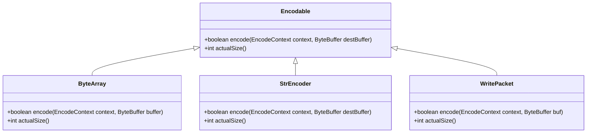
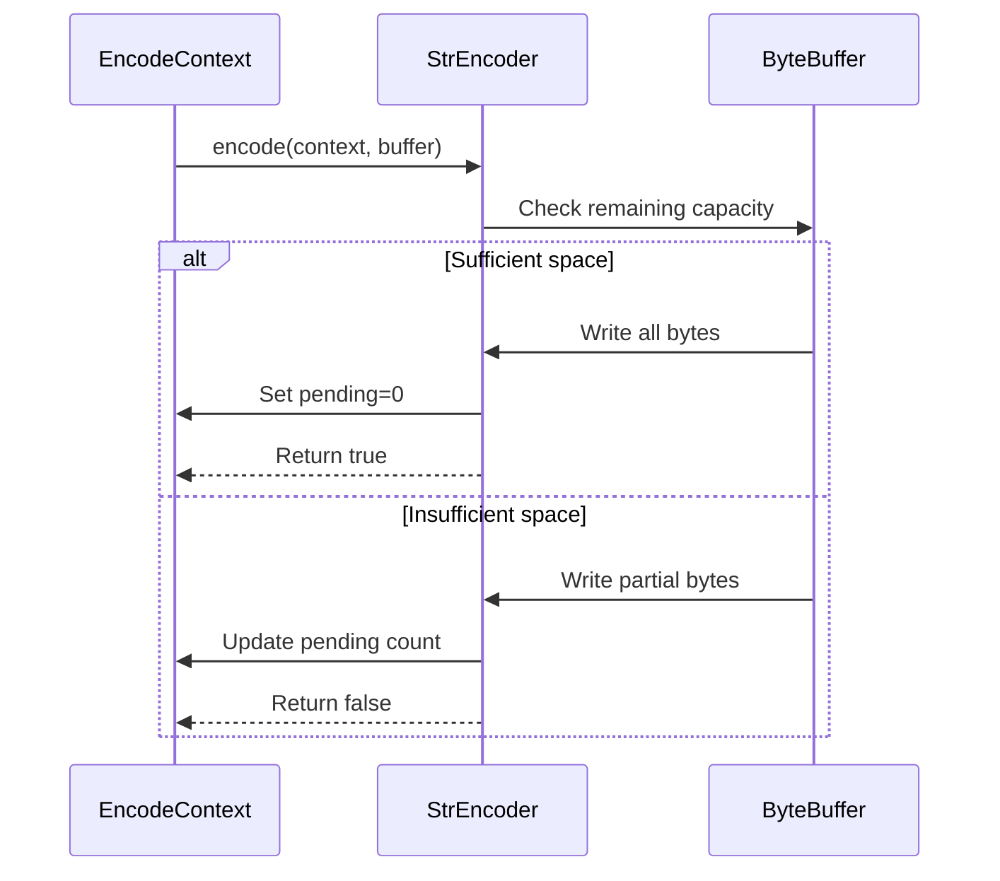
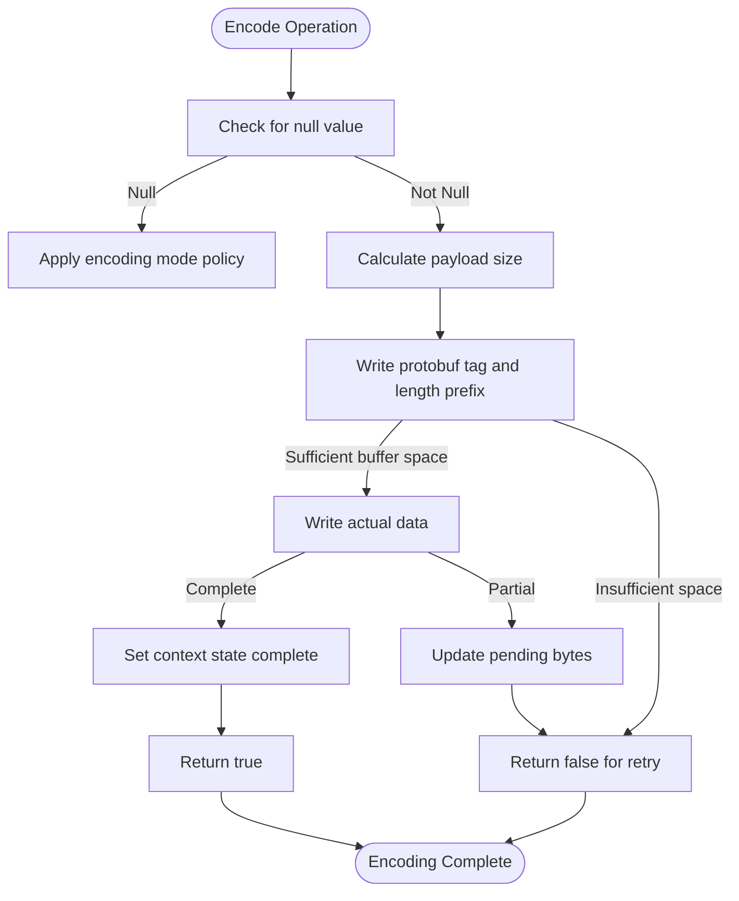
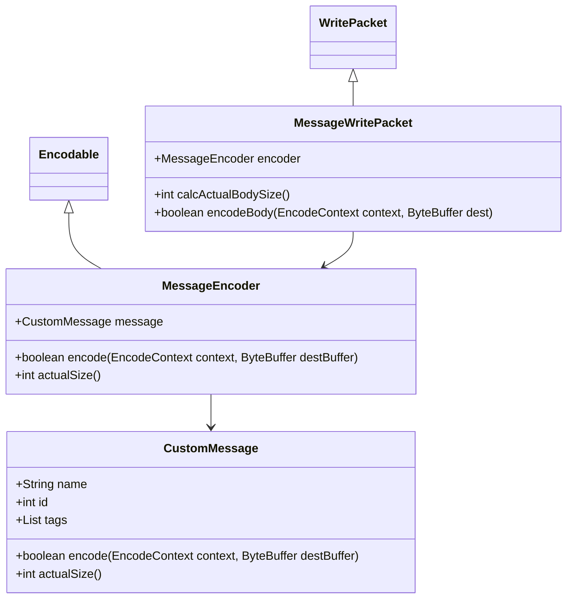
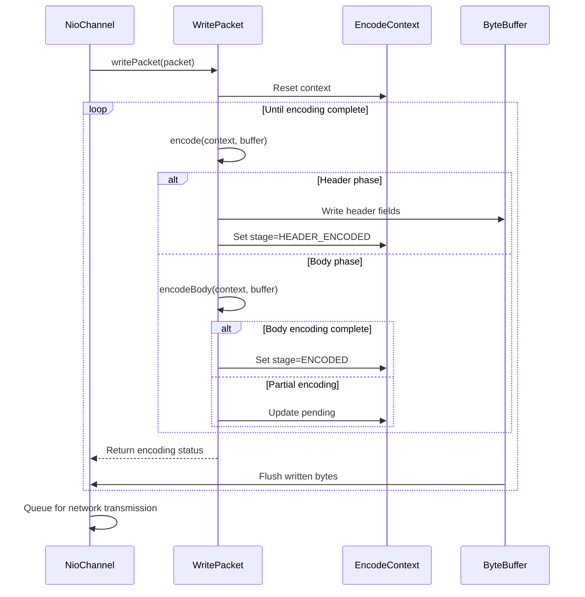
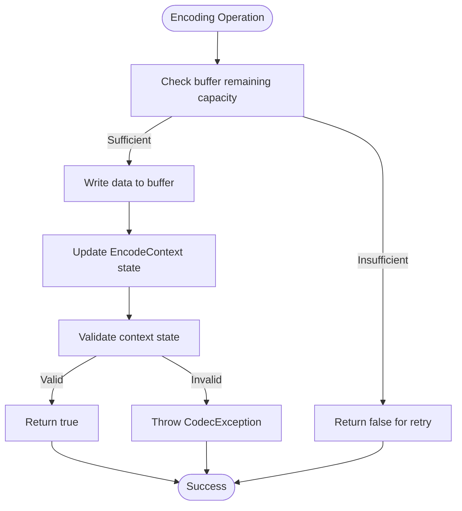

# Encoding Implementations

<cite>
**Referenced Files in This Document**   
- [Encodable.java](file://client/src/main/java/com/github/dtprj/dongting/codec/Encodable.java)
- [EncodeUtil.java](file://client/src/main/java/com/github/dtprj/dongting/codec/EncodeUtil.java)
- [StrEncoder.java](file://client/src/main/java/com/github/dtprj/dongting/codec/StrEncoder.java)
- [SimpleEncodable.java](file://client/src/main/java/com/github/dtprj/dongting/codec/SimpleEncodable.java)
- [EncodeContext.java](file://client/src/main/java/com/github/dtprj/dongting/codec/EncodeContext.java)
- [WritePacket.java](file://client/src/main/java/com/github/dtprj/dongting/net/WritePacket.java)
- [PbUtil.java](file://client/src/main/java/com/github/dtprj/dongting/codec/PbUtil.java)
- [ByteArray.java](file://client/src/main/java/com/github/dtprj/dongting/common/ByteArray.java)
- [StrEncoderTest.java](file://client/src/test/java/com/github/dtprj/dongting/codec/StrEncoderTest.java)
- [CodecException.java](file://client/src/main/java/com/github/dtprj/dongting/codec/CodecException.java)
</cite>

## Table of Contents
1. [Introduction](#introduction)
2. [Encodable Interface Contract](#encodable-interface-contract)
3. [StrEncoder Implementation](#strencoder-implementation)
4. [Encoding Utilities in EncodeUtil](#encoding-utilities-in-encodeutil)
5. [Custom Encoder Implementation](#custom-encoder-implementation)
6. [Integration with Network Layer](#integration-with-network-layer)
7. [Error Handling in Encoding](#error-handling-in-encoding)
8. [Best Practices and Performance Considerations](#best-practices-and-performance-considerations)
9. [Conclusion](#conclusion)

## Introduction
The Dongting encoding system provides a flexible and efficient mechanism for serializing message types across the network. This document details the core encoding implementations, focusing on the `Encodable` interface contract, concrete implementations like `StrEncoder`, and the integration with network layer components. The system is designed to support both simple and complex message types while maintaining high performance through zero-copy operations and efficient buffer management.

## Encodable Interface Contract
The `Encodable` interface serves as the foundation for all custom message type encoding in the Dongting system. It defines a contract that enables any message type to participate in the encoding process by implementing two essential methods: `encode()` and `actualSize()`.

The interface requires implementing classes to provide their serialized size through `actualSize()`, which returns the total number of bytes needed to represent the object when encoded. This method is crucial for buffer allocation and size calculations before the actual encoding process begins.

The `encode()` method performs the actual serialization, writing data to a destination `ByteBuffer`. It takes an `EncodeContext` and destination buffer as parameters and returns a boolean indicating whether the encoding operation completed successfully. The method signature `boolean encode(EncodeContext context, ByteBuffer destBuffer)` supports partial encoding, allowing large messages to be encoded incrementally when insufficient buffer space is available.



**Diagram sources**
- [Encodable.java](file://client/src/main/java/com/github/dtprj/dongting/codec/Encodable.java#L23-L30)
- [ByteArray.java](file://client/src/main/java/com/github/dtprj/dongting/common/ByteArray.java#L28-L169)
- [StrEncoder.java](file://client/src/main/java/com/github/dtprj/dongting/codec/StrEncoder.java#L26-L47)
- [WritePacket.java](file://client/src/main/java/com/github/dtprj/dongting/net/WritePacket.java#L30-L163)

**Section sources**
- [Encodable.java](file://client/src/main/java/com/github/dtprj/dongting/codec/Encodable.java#L23-L30)

## StrEncoder Implementation
The `StrEncoder` class provides a concrete implementation for encoding string-based payloads in the Dongting system. It extends `ByteArray` and implements the `Encodable` interface, demonstrating how application-specific message types can be integrated into the encoding framework.

`StrEncoder` is designed to efficiently handle UTF-8 encoded strings by pre-computing the byte representation during construction. When a `StrEncoder` instance is created with a string, it immediately converts the string to bytes using UTF-8 encoding and stores this byte array. This approach eliminates the need for repeated string-to-byte conversions during encoding operations, improving performance for frequently encoded strings.

The implementation handles incremental encoding through the `EncodeContext` mechanism. When the destination buffer has insufficient space to accommodate the entire string, the encoder writes as many bytes as possible and updates the context's pending state to track the number of bytes written. Subsequent calls to encode will resume from where the previous operation left off, ensuring complete serialization even with small buffer allocations.



**Diagram sources**
- [StrEncoder.java](file://client/src/main/java/com/github/dtprj/dongting/codec/StrEncoder.java#L26-L47)
- [EncodeContext.java](file://client/src/main/java/com/github/dtprj/dongting/codec/EncodeContext.java#L23-L65)

**Section sources**
- [StrEncoder.java](file://client/src/main/java/com/github/dtprj/dongting/codec/StrEncoder.java#L26-L47)
- [StrEncoderTest.java](file://client/src/test/java/com/github/dtprj/dongting/codec/StrEncoderTest.java#L28-L88)

## Encoding Utilities in EncodeUtil
The `EncodeUtil` class provides a comprehensive set of utility methods that simplify the encoding process for various data types and collections. It serves as a bridge between the low-level protobuf encoding operations in `PbUtil` and the higher-level message encoding requirements of the system.

The utility class implements different encoding modes through constants like `MODE_CUT_0BYTE`, `MODE_ENCODE_EMPTY_NOT_ENCODE_NULL`, and `MODE_ENCODE_ALL`, which control how null and empty values are handled during serialization. This flexibility allows developers to optimize message size by omitting null fields or including empty objects as needed.

`EncodeUtil` offers specialized methods for primitive types (int32, int64, fix32, fix64), strings (ASCII and UTF-8), byte arrays, and collections. Each method follows a consistent pattern: first calculating the required size, then performing incremental encoding that respects buffer boundaries. The methods use `EncodeContext` to maintain state between partial encoding operations, ensuring that large payloads can be serialized across multiple buffer writes.



**Diagram sources**
- [EncodeUtil.java](file://client/src/main/java/com/github/dtprj/dongting/codec/EncodeUtil.java#L27-L527)
- [PbUtil.java](file://client/src/main/java/com/github/dtprj/dongting/codec/PbUtil.java#L30-L407)

**Section sources**
- [EncodeUtil.java](file://client/src/main/java/com/github/dtprj/dongting/codec/EncodeUtil.java#L27-L527)

## Custom Encoder Implementation
Implementing custom encoders in the Dongting system involves creating classes that implement the `Encodable` interface and integrating them with the existing encoding infrastructure. The process follows a consistent pattern demonstrated by existing implementations like `StrEncoder` and `ByteArray`.

To create a custom encoder, developers should first determine whether their message type extends from existing base classes like `ByteArray` or needs to implement `Encodable` directly. For simple data types, extending `ByteArray` provides immediate access to efficient byte array handling and encoding capabilities. For more complex message structures, direct implementation of `Encodable` offers greater flexibility.

The `actualSize()` method should calculate the total serialized size of the message, including all fields and their protobuf overhead. This calculation must be accurate to ensure proper buffer allocation. The `encode()` method should implement incremental encoding by checking the destination buffer's remaining capacity and writing as much data as possible in each call, updating the `EncodeContext.pending` field to track progress.



**Diagram sources**
- [SimpleEncodable.java](file://client/src/main/java/com/github/dtprj/dongting/codec/SimpleEncodable.java#L23-L27)
- [Encodable.java](file://client/src/main/java/com/github/dtprj/dongting/codec/Encodable.java#L23-L30)
- [WritePacket.java](file://client/src/main/java/com/github/dtprj/dongting/net/WritePacket.java#L30-L181)

**Section sources**
- [SimpleEncodable.java](file://client/src/main/java/com/github/dtprj/dongting/codec/SimpleEncodable.java#L23-L27)
- [Encodable.java](file://client/src/main/java/com/github/dtprj/dongting/codec/Encodable.java#L23-L30)

## Integration with Network Layer
The encoding system integrates seamlessly with the network layer through the `WritePacket` hierarchy, which connects message encoding to packet transmission. The `WritePacket` class implements the `Encodable` interface and serves as the bridge between application-level messages and network transmission.

The integration follows a two-phase encoding process: first encoding the packet header, then encoding the message body. The `WritePacket.encode()` method manages this process through the `EncodeContext.stage` field, which tracks the current encoding phase. When encoding begins, the method first writes the fixed header fields (packet type, command, sequence number, etc.) and then proceeds to encode the message body through the `encodeBody()` method.

Different `WritePacket` implementations handle various message types through specialized subclasses. `SimpleWritePacket` handles messages that implement `SimpleEncodable`, while `EncodableBodyWritePacket` handles messages that implement the more sophisticated `Encodable` interface with incremental encoding support. This hierarchy allows the network layer to efficiently transmit both simple and complex message types using the appropriate encoding strategy.



**Diagram sources**
- [WritePacket.java](file://client/src/main/java/com/github/dtprj/dongting/net/WritePacket.java#L30-L181)
- [EncodableBodyWritePacket.java](file://client/src/main/java/com/github/dtprj/dongting/net/EncodableBodyWritePacket.java#L26-L56)
- [SimpleWritePacket.java](file://client/src/main/java/com/github/dtprj/dongting/net/SimpleWritePacket.java#L26-L52)

**Section sources**
- [WritePacket.java](file://client/src/main/java/com/github/dtprj/dongting/net/WritePacket.java#L30-L181)

## Error Handling in Encoding
The encoding system implements robust error handling through a combination of state validation, exception handling, and defensive programming practices. Errors during encoding are primarily detected through buffer capacity checks and context state validation.

The `EncodeContext` plays a crucial role in error detection by tracking the encoding state through its `stage`, `pending`, and `status` fields. When an encoding operation cannot complete due to insufficient buffer space, it returns `false` rather than throwing an exception, allowing the operation to be retried with a larger buffer. This approach supports the incremental encoding pattern required for efficient network transmission.

Critical errors, such as invalid state transitions or buffer boundary violations, are handled by throwing `CodecException`. This exception is thrown when the encoding context is in an illegal state, such as when the `pending` counter exceeds the expected payload size or when the encoding stage transitions incorrectly. The exception includes diagnostic information from the `EncodeContext` to aid in debugging.



**Diagram sources**
- [CodecException.java](file://client/src/main/java/com/github/dtprj/dongting/codec/CodecException.java#L23-L34)
- [EncodeContext.java](file://client/src/main/java/com/github/dtprj/dongting/codec/EncodeContext.java#L23-L65)
- [WritePacket.java](file://client/src/main/java/com/github/dtprj/dongting/net/WritePacket.java#L30-L181)

**Section sources**
- [CodecException.java](file://client/src/main/java/com/github/dtprj/dongting/codec/CodecException.java#L23-L34)

## Best Practices and Performance Considerations
Implementing efficient encoders in the Dongting system requires adherence to several best practices that optimize performance and resource utilization. These practices focus on minimizing memory allocations, reducing CPU overhead, and ensuring thread safety in concurrent environments.

Pre-compute message sizes whenever possible by implementing accurate `actualSize()` methods. This allows the system to allocate appropriately sized buffers upfront, reducing the need for buffer resizing and reallocation. For messages with variable-sized components, cache the calculated size after the first computation to avoid repeated calculations.

Minimize object creation during encoding by reusing buffers and avoiding unnecessary wrapper objects. The `EncodeContext` provides a `status` field that can be used to store temporary state between encoding operations, eliminating the need for additional instance variables. For string encoding, consider using ASCII instead of UTF-8 when character sets permit, as ASCII encoding is more efficient.

Implement incremental encoding properly by respecting the `EncodeContext.pending` field and updating it correctly after each partial write operation. This ensures that large messages can be encoded across multiple buffer writes without data loss or corruption. Always validate buffer boundaries before writing to prevent `BufferOverflowException`.

```mermaid
flowchart TD
A[Best Practices] --> B[Pre-compute sizes]
A --> C[Minimize allocations]
A --> D[Reuse buffers]
A --> E[Use ASCII when possible]
A --> F[Implement incremental encoding]
A --> G[Validate buffer boundaries]
A --> H[Handle null values properly]
A --> I[Cache computed values]
B --> J[Accurate actualSize() implementation]
C --> K[Avoid wrapper objects]
D --> L[Use EncodeContext.status field]
E --> M[Faster than UTF-8]
F --> N[Respect pending field]
G --> O[Prevent BufferOverflowException]
H --> P[Follow encoding mode policies]
I --> Q[Cache size calculations]
```

**Diagram sources**
- [EncodeUtil.java](file://client/src/main/java/com/github/dtprj/dongting/codec/EncodeUtil.java#L27-L527)
- [EncodeContext.java](file://client/src/main/java/com/github/dtprj/dongting/codec/EncodeContext.java#L23-L65)
- [PbUtil.java](file://client/src/main/java/com/github/dtprj/dongting/codec/PbUtil.java#L30-L407)

**Section sources**
- [EncodeUtil.java](file://client/src/main/java/com/github/dtprj/dongting/codec/EncodeUtil.java#L27-L527)

## Conclusion
The Dongting encoding system provides a robust and efficient framework for serializing message types across the network. By implementing the `Encodable` interface contract, custom message types can participate in the encoding process while benefiting from the system's performance optimizations and error handling capabilities. The `StrEncoder` implementation demonstrates how string-based payloads can be efficiently encoded with support for incremental processing. Integration with the network layer through `WritePacket` ensures seamless transmission of encoded messages, while the comprehensive utilities in `EncodeUtil` simplify common encoding tasks. By following best practices for efficient encoder implementation, developers can create high-performance message types that integrate seamlessly with the Dongting ecosystem.