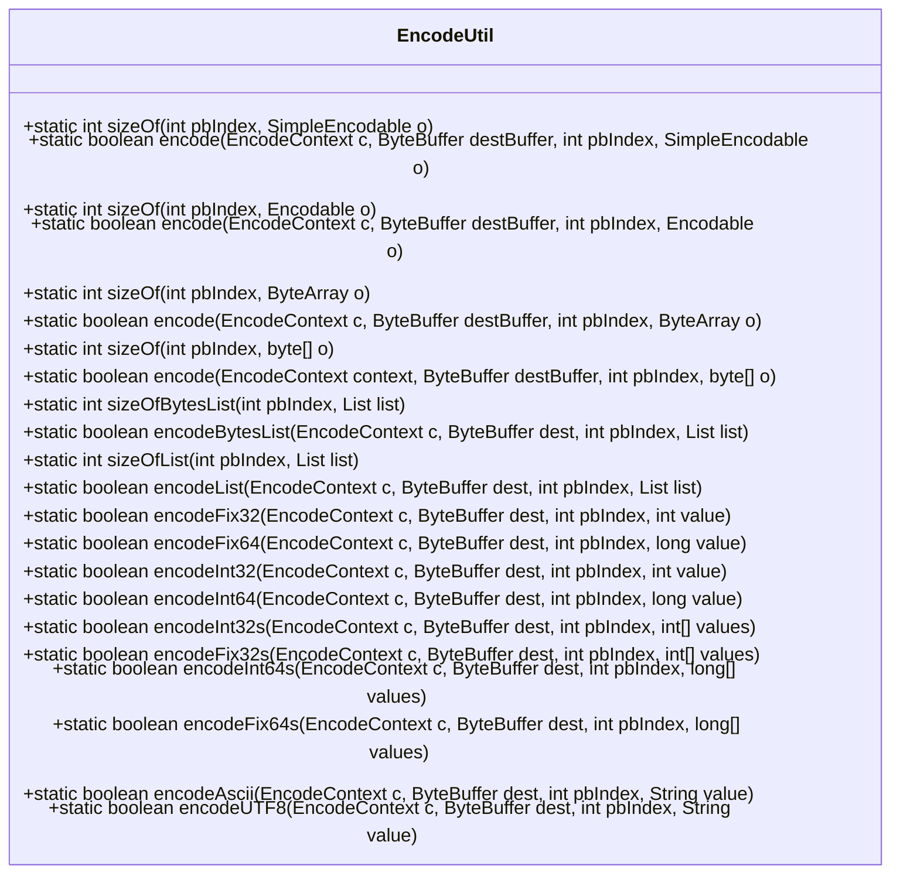
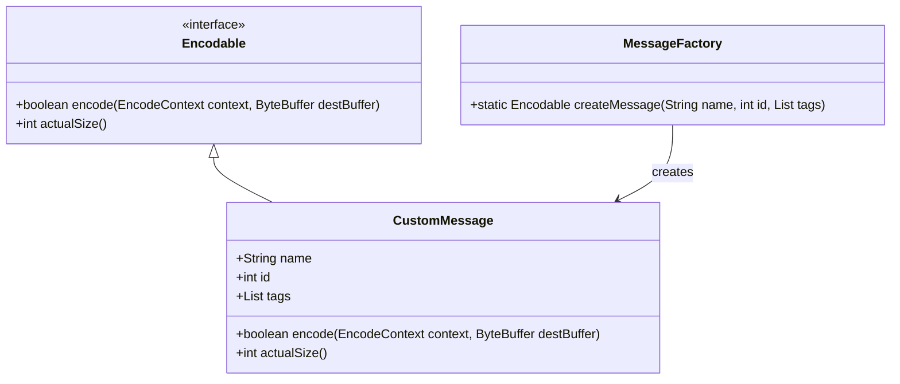
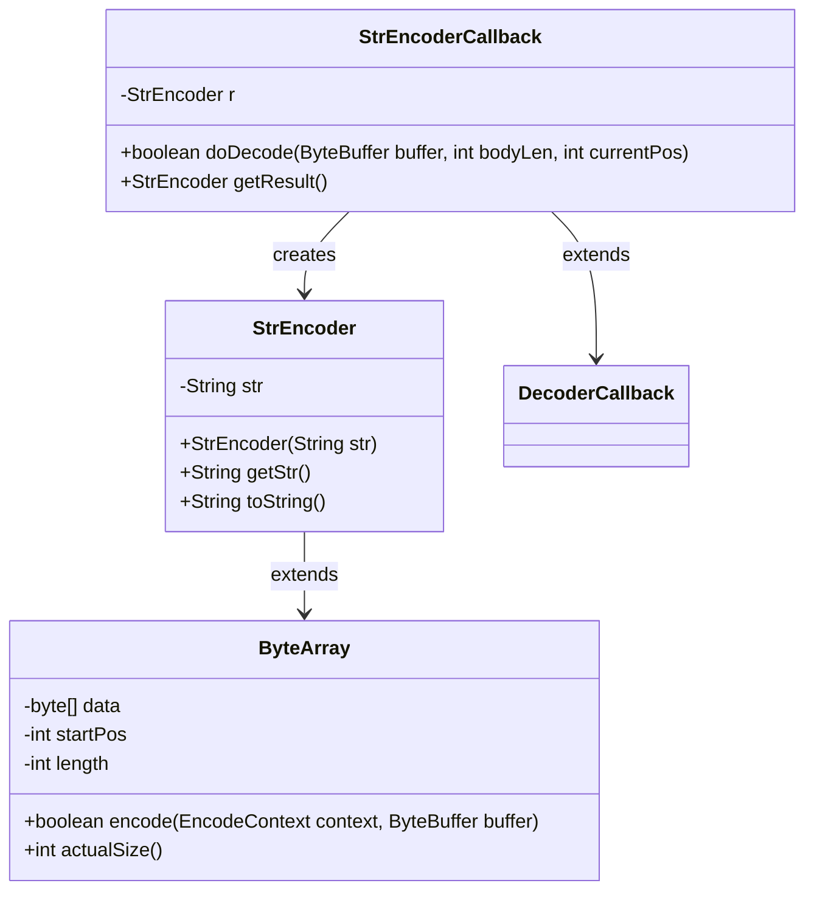
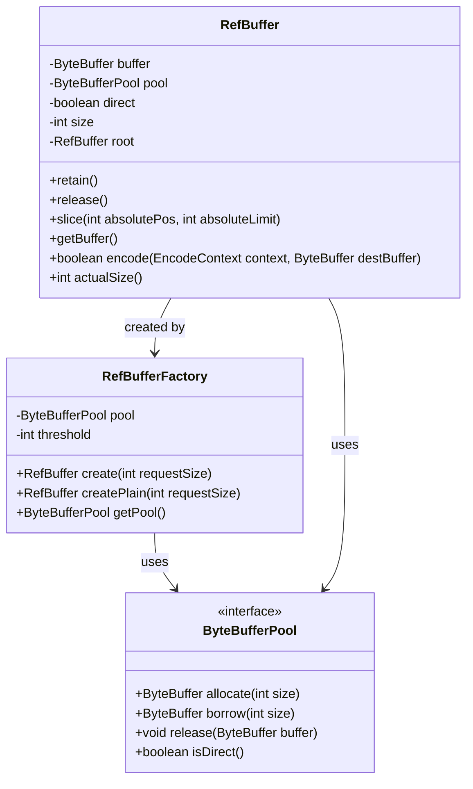
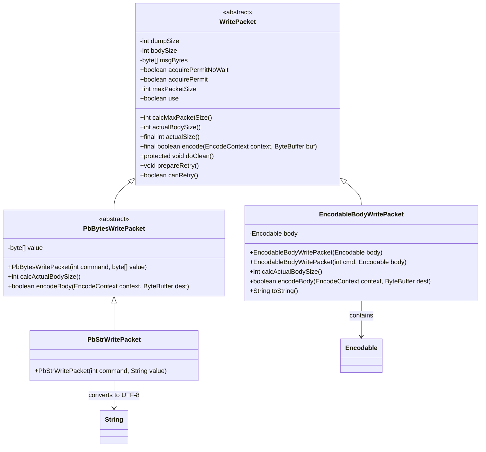

# Message Encoding Process

<cite>
**Referenced Files in This Document**   
- [EncodeContext.java](file://client/src/main/java/com/github/dtprj/dongting/codec/EncodeContext.java)
- [EncodeUtil.java](file://client/src/main/java/com/github/dtprj/dongting/codec/EncodeUtil.java)
- [Encodable.java](file://client/src/main/java/com/github/dtprj/dongting/codec/Encodable.java)
- [StrEncoder.java](file://client/src/main/java/com/github/dtprj/dongting/codec/StrEncoder.java)
- [SimpleEncodable.java](file://client/src/main/java/com/github/dtprj/dongting/codec/SimpleEncodable.java)
- [WritePacket.java](file://client/src/main/java/com/github/dtprj/dongting/net/WritePacket.java)
- [PbStrWritePacket.java](file://client/src/main/java/com/github/dtprj/dongting/net/PbStrWritePacket.java)
- [EncodableBodyWritePacket.java](file://client/src/main/java/com/github/dtprj/dongting/net/EncodableBodyWritePacket.java)
- [PbUtil.java](file://client/src/main/java/com/github/dtprj/dongting/codec/PbUtil.java)
- [CodecException.java](file://client/src/main/java/com/github/dtprj/dongting/codec/CodecException.java)
- [ByteArray.java](file://client/src/main/java/com/github/dtprj/dongting/common/ByteArray.java)
- [RefBuffer.java](file://client/src/main/java/com/github/dtprj/dongting/buf/RefBuffer.java)
- [RefBufferFactory.java](file://client/src/main/java/com/github/dtprj/dongting/buf/RefBufferFactory.java)
</cite>

## Table of Contents
1. [Introduction](#introduction)
2. [Two-Phase Encoding Mechanism](#two-phase-encoding-mechanism)
3. [Encoder Interface and Implementations](#encoder-interface-and-implementations)
4. [EncodeUtil Utility Class](#encodeutil-utility-class)
5. [Encodable Interface and Custom Message Types](#encodable-interface-and-custom-message-types)
6. [StrEncoder Implementation](#strencoder-implementation)
7. [Buffer Management and Memory Efficiency](#buffer-management-and-memory-efficiency)
8. [Integration with Network Layer](#integration-with-network-layer)
9. [Conclusion](#conclusion)

## Introduction
The Dongting message encoding process is designed to efficiently handle variable-length messages through a sophisticated two-phase encoding mechanism. This system leverages the EncodeContext class to manage encoding state and progress, enabling efficient serialization of complex data structures. The encoding framework supports various data types through specialized encoder implementations and provides utility methods for common encoding operations. The system is tightly integrated with the network layer's WritePacket system, ensuring seamless message transmission. This documentation provides a comprehensive analysis of the encoding architecture, including core components, implementation patterns, and integration points.

## Two-Phase Encoding Mechanism
The Dongting encoding system employs a two-phase encoding mechanism using the EncodeContext class to handle variable-length messages efficiently. This approach allows for incremental encoding of messages that may not fit entirely in available buffer space, ensuring memory efficiency and preventing buffer overflow issues.

The EncodeContext class maintains the encoding state through three key fields: `stage`, `pending`, and `status`. The `stage` field tracks the current phase of encoding, with `STAGE_BEGIN` (0) indicating the start and `STAGE_END` (Integer.MAX_VALUE) marking completion. The `pending` field stores intermediate state information such as bytes written or array offsets, while the `status` field holds temporary objects needed during encoding.

The two-phase process works as follows: in the first phase, the system calculates the required buffer space and writes the message header, including length prefixes. In the second phase, the actual message body is encoded incrementally. If insufficient buffer space is available, the encoding process can be suspended and resumed later, with the EncodeContext preserving the exact state. This is particularly useful for large messages or when dealing with constrained buffer environments.

The mechanism supports nested encoding through the `createOrGetNestedContext` method, which allows for hierarchical message structures. When encoding complex objects containing multiple fields, each field can use its own nested context, preventing state interference between different encoding operations.

**Section sources**
- [EncodeContext.java](file://client/src/main/java/com/github/dtprj/dongting/codec/EncodeContext.java#L23-L65)

## Encoder Interface and Implementations
The Dongting encoding system is built around the Encodable interface, which defines the contract for all encodable message types. This interface specifies two core methods: `encode(EncodeContext context, ByteBuffer destBuffer)` and `actualSize()`. The encode method returns a boolean indicating whether the encoding operation is complete, enabling the two-phase encoding mechanism. The actualSize method provides the total byte count required for the complete message, allowing for proper buffer allocation.

The system also includes the SimpleEncodable interface, which offers a simpler encoding contract without the need for context management. This interface is suitable for fixed-size messages or scenarios where incremental encoding is not required. The distinction between Encodable and SimpleEncodable allows developers to choose the appropriate abstraction based on their message complexity and performance requirements.

Multiple implementations of these interfaces handle different data types and use cases. The RefBuffer class implements Encodable for efficient byte buffer management, while ByteArray provides encoding capabilities for byte arrays with additional utility methods. These implementations demonstrate the flexibility of the encoding framework, supporting both direct and heap-based buffers, as well as sliced buffer operations.

The encoding system supports various data types through specialized methods in the EncodeUtil class, including integers, longs, strings, and byte arrays. Each data type has optimized encoding methods that handle variable-length encoding according to protobuf standards, ensuring compatibility and efficiency.

**Section sources**
- [Encodable.java](file://client/src/main/java/com/github/dtprj/dongting/codec/Encodable.java#L23-L30)
- [SimpleEncodable.java](file://client/src/main/java/com/github/dtprj/dongting/codec/SimpleEncodable.java#L23-L27)
- [RefBuffer.java](file://client/src/main/java/com/github/dtprj/dongting/buf/RefBuffer.java#L28-L183)
- [ByteArray.java](file://client/src/main/java/com/github/dtprj/dongting/common/ByteArray.java#L28-L195)

## EncodeUtil Utility Class
The EncodeUtil class provides optimized encoding methods for common data types, serving as the primary utility for message serialization in the Dongting system. This class implements a comprehensive set of encoding methods for integers, longs, strings, byte arrays, and collections, following protobuf encoding standards.

The utility methods are organized into several categories based on data type and encoding requirements. For integer values, the class provides methods like `encodeInt32`, `encodeInt64`, `encodeFix32`, and `encodeFix64`, each optimized for specific use cases. Variable-length integers use varint encoding to minimize space for smaller values, while fixed-length encodings ensure consistent byte counts for alignment-sensitive operations.

String encoding is handled through `encodeAscii` and `encodeUTF8` methods, with UTF-8 encoding supporting the full Unicode character set. The implementation efficiently manages string-to-byte conversion, caching intermediate results when necessary to avoid repeated encoding operations. For byte arrays and collections, the class provides methods that handle null and empty values according to configurable modes, ensuring consistent behavior across different message types.

A key feature of EncodeUtil is its support for incremental encoding through the EncodeContext parameter. Each encoding method checks available buffer space and updates the context state accordingly, allowing encoding to resume from the exact point of interruption. This enables efficient handling of large messages that may not fit in available buffer space.

The class also includes size calculation methods like `sizeOf` and `sizeOfList`, which determine the required buffer space before encoding begins. These methods are crucial for proper buffer allocation and help prevent buffer overflow issues.

**Diagram sources**
- [EncodeUtil.java](file://client/src/main/java/com/github/dtprj/dongting/codec/EncodeUtil.java#L27-L527)

**Section sources**
- [EncodeUtil.java](file://client/src/main/java/com/github/dtprj/dongting/codec/EncodeUtil.java#L27-L527)

## Encodable Interface and Custom Message Types
The Encodable interface serves as the foundation for custom message types in the Dongting system, enabling developers to implement application-specific encoding logic. This interface requires implementing classes to provide both `encode` and `actualSize` methods, allowing for efficient two-phase encoding of complex message structures.

To implement a custom encoder, developers must create a class that implements the Encodable interface and provides the necessary encoding logic. The `actualSize` method should return the total byte count required for the complete message, which is used for buffer allocation and size validation. The `encode` method contains the core serialization logic, writing data to the destination ByteBuffer while respecting the current buffer capacity.

When implementing custom encoders, developers should follow several best practices to ensure efficiency and correctness. First, the encoding process should be incremental, checking available buffer space and updating the EncodeContext state appropriately. Second, null and empty values should be handled consistently, typically by returning true immediately for empty messages. Third, complex objects should use nested contexts through `createOrGetNestedContext` to prevent state interference between different encoding operations.

The system provides several examples of custom encoders, such as the StrEncoder class for string-based payloads and various message types in the raft and dtkv packages. These implementations demonstrate how to handle different data structures while maintaining compatibility with the overall encoding framework.

For messages with hierarchical structures, developers can compose multiple Encodable objects, encoding each field in sequence. The EncodeUtil class provides utility methods for encoding collections of Encodable objects, simplifying the implementation of complex message types.

**Diagram sources**
- [Encodable.java](file://client/src/main/java/com/github/dtprj/dongting/codec/Encodable.java#L23-L30)
- [StrEncoder.java](file://client/src/main/java/com/github/dtprj/dongting/codec/StrEncoder.java#L26-L67)

**Section sources**
- [Encodable.java](file://client/src/main/java/com/github/dtprj/dongting/codec/Encodable.java#L23-L30)
- [StrEncoder.java](file://client/src/main/java/com/github/dtprj/dongting/codec/StrEncoder.java#L26-L67)

## StrEncoder Implementation
The StrEncoder class provides specialized encoding capabilities for string-based payloads, implementing the ByteArray class to leverage existing byte array encoding infrastructure. This implementation efficiently handles UTF-8 encoded strings, converting them to byte arrays during construction and providing optimized encoding methods.

The StrEncoder constructor takes a String parameter and immediately converts it to a UTF-8 byte array using `StandardCharsets.UTF_8`. This pre-conversion approach ensures that the encoding process is efficient, as the string-to-byte conversion only occurs once rather than during each encoding operation. The resulting byte array is stored in the parent ByteArray class, which handles the actual encoding to ByteBuffer.

The implementation includes a callback class (StrEncoder.Callback) for decoding operations, demonstrating the symmetry between encoding and decoding processes. This callback handles the parsing of byte arrays back into strings, using UTF-8 decoding to reconstruct the original string value. The callback pattern allows for incremental decoding of large strings, similar to the two-phase encoding mechanism.

StrEncoder overrides the toString method to return the original string value, providing convenient access to the decoded content without requiring explicit conversion. This makes the class suitable for use in logging and debugging scenarios where human-readable output is needed.

The implementation demonstrates several key design principles: immutability (the string content cannot be modified after construction), efficiency (pre-conversion of string to bytes), and compatibility (adherence to the Encodable interface contract). These principles ensure that StrEncoder instances can be safely shared across threads and efficiently serialized.

**Diagram sources**
- [StrEncoder.java](file://client/src/main/java/com/github/dtprj/dongting/codec/StrEncoder.java#L26-L67)

**Section sources**
- [StrEncoder.java](file://client/src/main/java/com/github/dtprj/dongting/codec/StrEncoder.java#L26-L67)

## Buffer Management and Memory Efficiency
The Dongting encoding system incorporates sophisticated buffer management strategies to optimize memory usage and prevent resource leaks. The RefBuffer class serves as the primary mechanism for buffer management, implementing reference counting to track buffer usage and ensure proper cleanup.

RefBuffer instances are created through the RefBufferFactory, which manages a pool of reusable buffers. The factory uses a threshold-based strategy to determine whether to allocate new buffers or borrow from a pool, balancing memory usage and allocation overhead. Small buffers are typically allocated directly, while larger buffers are borrowed from a shared pool to reduce memory fragmentation.

The reference counting mechanism allows multiple components to share the same buffer without copying data. Each RefBuffer maintains a reference count, incrementing it when retained and decrementing it when released. When the count reaches zero, the buffer is returned to the pool or deallocated, ensuring that memory is reclaimed promptly.

For direct buffers (off-heap memory), the system uses specialized cleanup logic in the doClean method, which releases the underlying native memory. This prevents memory leaks in long-running applications and ensures that off-heap memory is properly managed.

The encoding process itself is designed to be memory-efficient by minimizing data copying. When encoding RefBuffer instances, the system attempts to write directly from the source buffer to the destination, avoiding intermediate copies. For direct buffers, a temporary heap buffer is used as an intermediary to comply with NIO restrictions, but this is managed efficiently through the EncodeContext status field.

**Diagram sources**
- [RefBuffer.java](file://client/src/main/java/com/github/dtprj/dongting/buf/RefBuffer.java#L28-L183)
- [RefBufferFactory.java](file://client/src/main/java/com/github/dtprj/dongting/buf/RefBufferFactory.java#L21-L41)
- [ByteBufferPool.java](file://client/src/main/java/com/github/dtprj/dongting/buf/ByteBufferPool.java)

**Section sources**
- [RefBuffer.java](file://client/src/main/java/com/github/dtprj/dongting/buf/RefBuffer.java#L28-L183)
- [RefBufferFactory.java](file://client/src/main/java/com/github/dtprj/dongting/buf/RefBufferFactory.java#L21-L41)

## Integration with Network Layer
The Dongting encoding process is tightly integrated with the network layer's WritePacket system, enabling seamless message transmission over network connections. The WritePacket abstract class serves as the bridge between the encoding framework and network I/O operations, implementing the Encodable interface to participate in the encoding process.

WritePacket defines two abstract methods: `calcActualBodySize` for determining the message body size and `encodeBody` for performing the actual encoding. The concrete implementation of `encode` in WritePacket handles the complete message serialization, including header encoding and body encoding. The method uses the EncodeContext to manage encoding state, ensuring that large messages can be encoded incrementally if necessary.

The encoding process follows a specific sequence: first, the message header is encoded, including length, packet type, command, sequence number, and other metadata. Then, if the message has a body, the `encodeBody` method is called with a nested encoding context. This separation allows for efficient header processing and ensures that body encoding can be suspended and resumed independently.

Several specialized WritePacket implementations demonstrate different encoding patterns. The EncodableBodyWritePacket wraps an Encodable object as the message body, delegating encoding to the contained object. The PbStrWritePacket converts a string to UTF-8 bytes and wraps them in a PbBytesWritePacket, showing how higher-level abstractions build upon the core encoding framework.

The integration with the network layer also includes flow control mechanisms, where the encoding process can be paused if network buffers are full. The EncodeContext preserves the exact state of encoding, allowing it to resume when buffer space becomes available. This ensures reliable message transmission even under high load conditions.

**Diagram sources**
- [WritePacket.java](file://client/src/main/java/com/github/dtprj/dongting/net/WritePacket.java#L30-L181)
- [EncodableBodyWritePacket.java](file://client/src/main/java/com/github/dtprj/dongting/net/EncodableBodyWritePacket.java#L26-L56)
- [PbStrWritePacket.java](file://client/src/main/java/com/github/dtprj/dongting/net/PbStrWritePacket.java#L23-L28)
- [PbBytesWritePacket.java](file://client/src/main/java/com/github/dtprj/dongting/net/PbBytesWritePacket.java)

**Section sources**
- [WritePacket.java](file://client/src/main/java/com/github/dtprj/dongting/net/WritePacket.java#L30-L181)
- [EncodableBodyWritePacket.java](file://client/src/main/java/com/github/dtprj/dongting/net/EncodableBodyWritePacket.java#L26-L56)
- [PbStrWritePacket.java](file://client/src/main/java/com/github/dtprj/dongting/net/PbStrWritePacket.java#L23-L28)

## Conclusion
The Dongting message encoding process represents a sophisticated and efficient system for handling variable-length messages in a networked environment. The two-phase encoding mechanism, centered around the EncodeContext class, enables incremental encoding of messages that may not fit entirely in available buffer space, ensuring memory efficiency and preventing buffer overflow issues. The Encodable interface provides a flexible foundation for custom message types, while the EncodeUtil utility class offers optimized methods for common data types.

The integration with the network layer's WritePacket system demonstrates a well-designed architecture that separates concerns while maintaining tight coupling where necessary. Buffer management strategies, particularly through the RefBuffer and RefBufferFactory classes, ensure efficient memory usage and prevent resource leaks. The system's design emphasizes performance, reliability, and extensibility, making it suitable for high-throughput, low-latency applications.

Key strengths of the encoding system include its support for incremental processing, efficient buffer management, and adherence to protobuf encoding standards. The architecture allows for easy extension with custom message types while maintaining compatibility with the overall framework. Future enhancements could include additional encoder implementations for specialized data types and improved error handling for edge cases.