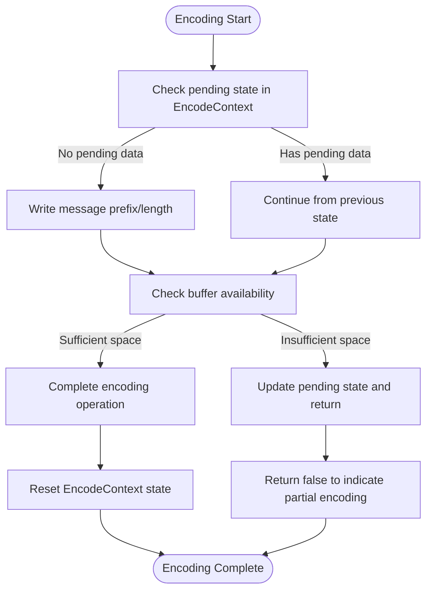
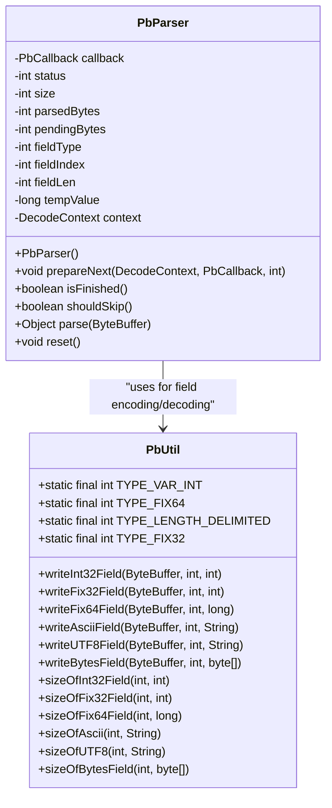
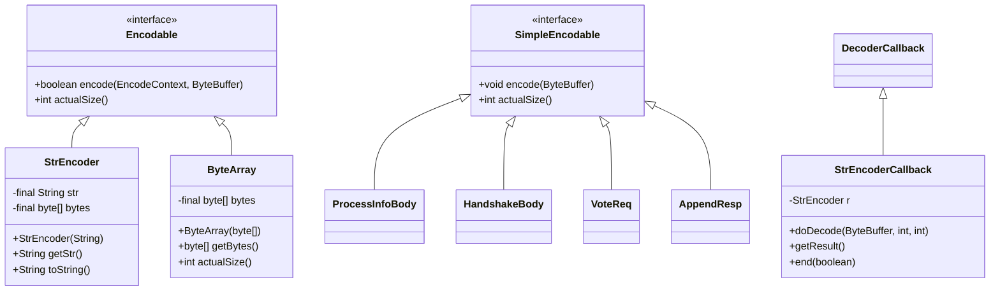
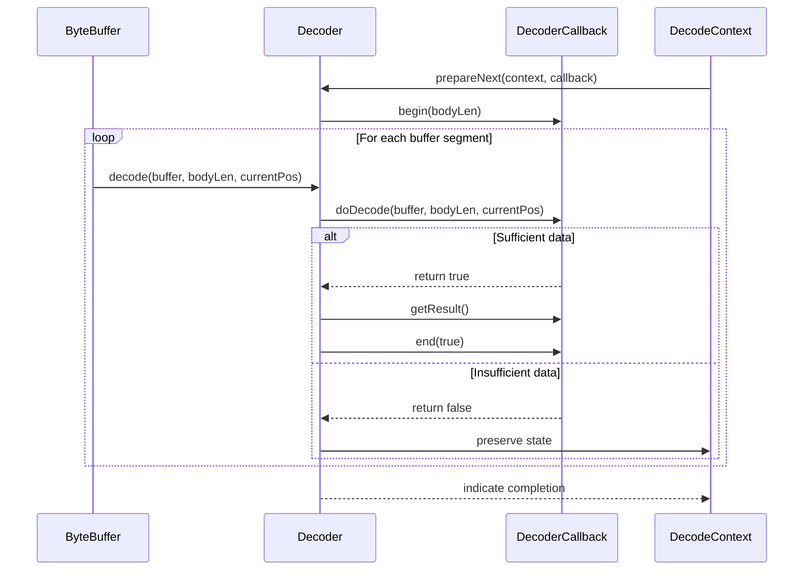
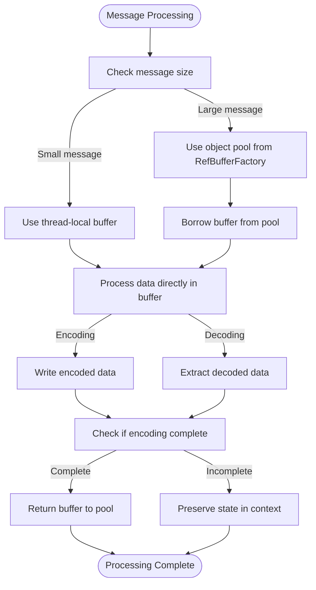
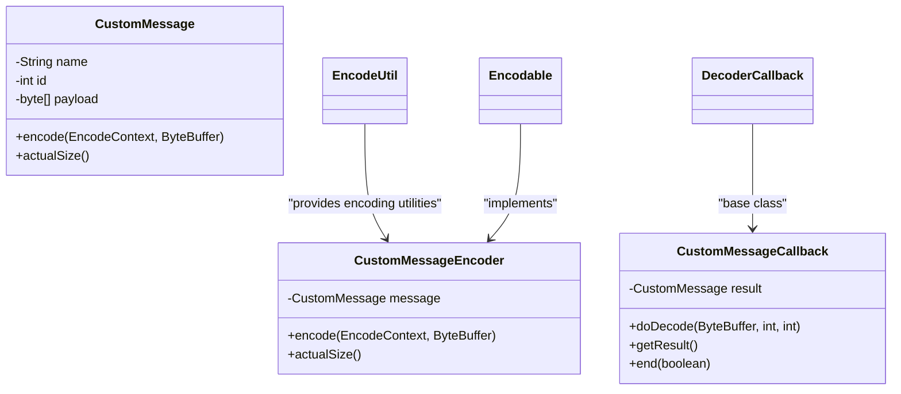

# Message Encoding and Decoding

<cite>
**Referenced Files in This Document**   
- [EncodeContext.java](file://client/src/main/java/com/github/dtprj/dongting/codec/EncodeContext.java)
- [DecodeContext.java](file://client/src/main/java/com/github/dtprj/dongting/codec/DecodeContext.java)
- [Encodable.java](file://client/src/main/java/com/github/dtprj/dongting/codec/Encodable.java)
- [PbParser.java](file://client/src/main/java/com/github/dtprj/dongting/codec/PbParser.java)
- [PbUtil.java](file://client/src/main/java/com/github/dtprj/dongting/codec/PbUtil.java)
- [StrEncoder.java](file://client/src/main/java/com/github/dtprj/dongting/codec/StrEncoder.java)
- [DecoderCallback.java](file://client/src/main/java/com/github/dtprj/dongting/codec/DecoderCallback.java)
- [PbNoCopyDecoderCallback.java](file://client/src/main/java/com/github/dtprj/dongting/codec/PbNoCopyDecoderCallback.java)
- [AbstractCodecCallback.java](file://client/src/main/java/com/github/dtprj/dongting/codec/AbstractCodecCallback.java)
- [EncodeUtil.java](file://client/src/main/java/com/github/dtprj/dongting/codec/EncodeUtil.java)
- [Decoder.java](file://client/src/main/java/com/github/dtprj/dongting/codec/Decoder.java)
- [PbCallback.java](file://client/src/main/java/com/github/dtprj/dongting/codec/PbCallback.java)
- [RefBufferDecoderCallback.java](file://client/src/main/java/com/github/dtprj/dongting/codec/RefBufferDecoderCallback.java)
- [BytesDecoderCallback.java](file://client/src/main/java/com/github/dtprj/dongting/codec/BytesDecoderCallback.java)
- [SimpleEncodable.java](file://client/src/main/java/com/github/dtprj/dongting/codec/SimpleEncodable.java)
</cite>

## Table of Contents
1. [Introduction](#introduction)
2. [Two-Phase Encoding/Decoding Process](#two-phase-encodingdecoding-process)
3. [Protobuf-Based Serialization System](#protobuf-based-serialization-system)
4. [Encodable Interface and Custom Message Types](#encodable-interface-and-custom-message-types)
5. [Callback-Based Decoding Mechanism](#callback-based-decoding-mechanism)
6. [Buffer Management and Memory Efficiency](#buffer-management-and-memory-efficiency)
7. [Implementation Examples](#implementation-examples)
8. [Conclusion](#conclusion)

## Introduction
The Dongting codec framework provides a high-performance message encoding and decoding system designed for efficient handling of variable-length messages in distributed systems. This document details the core components and mechanisms that enable compact message representation, zero-copy deserialization, and memory-efficient processing. The framework leverages protobuf-based serialization with specialized utilities for optimal performance in network communication scenarios.

## Two-Phase Encoding/Decoding Process
The Dongting codec framework implements a two-phase encoding and decoding process using `EncodeContext` and `DecodeContext` classes to efficiently handle variable-length messages. This approach enables incremental processing of messages that may not fit entirely in available buffer space.

**Diagram sources**
- [EncodeContext.java](file://client/src/main/java/com/github/dtprj/dongting/codec/EncodeContext.java#L23-L65)
- [DecodeContext.java](file://client/src/main/java/com/github/dtprj/dongting/codec/DecodeContext.java#L26-L167)

**Section sources**
- [EncodeContext.java](file://client/src/main/java/com/github/dtprj/dongting/codec/EncodeContext.java#L23-L65)
- [DecodeContext.java](file://client/src/main/java/com/github/dtprj/dongting/codec/DecodeContext.java#L26-L167)

The `EncodeContext` class maintains state information including the current encoding stage, pending bytes, and nested context for complex message structures. During encoding, if the destination buffer lacks sufficient space, the context preserves the current state, allowing the encoding process to resume when more buffer space becomes available. Similarly, `DecodeContext` manages the decoding state, enabling incremental parsing of incoming message streams.

## Protobuf-Based Serialization System
The framework utilizes a protobuf-based serialization system implemented through `PbParser` and `PbUtil` utilities to achieve compact message representation. This system follows the Protocol Buffers encoding specification to minimize message size while maintaining efficient parsing performance.

**Diagram sources**
- [PbUtil.java](file://client/src/main/java/com/github/dtprj/dongting/codec/PbUtil.java#L30-L408)
- [PbParser.java](file://client/src/main/java/com/github/dtprj/dongting/codec/PbParser.java#L26-L437)

**Section sources**
- [PbUtil.java](file://client/src/main/java/com/github/dtprj/dongting/codec/PbUtil.java#L30-L408)
- [PbParser.java](file://client/src/main/java/com/github/dtprj/dongting/codec/PbParser.java#L26-L437)

The `PbUtil` class provides static methods for encoding various data types (integers, strings, bytes) according to protobuf wire format, including variable-length integers, fixed-length values, and length-delimited fields. The `PbParser` class implements a state machine for parsing protobuf-encoded messages, supporting incremental parsing across multiple buffer reads. This design enables efficient handling of large messages that exceed buffer capacity.

## Encodable Interface and Custom Message Types
The `Encodable` interface serves as the foundation for custom message types in the Dongting codec framework, allowing applications to define their own message formats while integrating seamlessly with the encoding/decoding pipeline.

**Diagram sources**
- [Encodable.java](file://client/src/main/java/com/github/dtprj/dongting/codec/Encodable.java#L23-L30)
- [SimpleEncodable.java](file://client/src/main/java/com/github/dtprj/dongting/codec/SimpleEncodable.java#L23-L27)
- [StrEncoder.java](file://client/src/main/java/com/github/dtprj/dongting/codec/StrEncoder.java#L26-L67)

**Section sources**
- [Encodable.java](file://client/src/main/java/com/github/dtprj/dongting/codec/Encodable.java#L23-L30)
- [SimpleEncodable.java](file://client/src/main/java/com/github/dtprj/dongting/codec/SimpleEncodable.java#L23-L27)
- [StrEncoder.java](file://client/src/main/java/com/github/dtprj/dongting/codec/StrEncoder.java#L26-L67)

The `Encodable` interface requires implementation of two methods: `encode()` for writing message data to a buffer and `actualSize()` for determining the message size. The `StrEncoder` class demonstrates a concrete implementation for string-based payloads, converting strings to UTF-8 encoded bytes and providing efficient encoding capabilities. The framework also includes `SimpleEncodable` for messages that can be encoded in a single operation without state preservation.

## Callback-Based Decoding Mechanism
The Dongting codec framework employs a callback-based decoding mechanism that enables zero-copy deserialization for performance-critical paths. This approach minimizes memory allocations and data copying during message processing.

**Diagram sources**
- [Decoder.java](file://client/src/main/java/com/github/dtprj/dongting/codec/Decoder.java#L23-L121)
- [DecoderCallback.java](file://client/src/main/java/com/github/dtprj/dongting/codec/DecoderCallback.java#L23-L40)
- [DecodeContext.java](file://client/src/main/java/com/github/dtprj/dongting/codec/DecodeContext.java#L26-L167)

**Section sources**
- [Decoder.java](file://client/src/main/java/com/github/dtprj/dongting/codec/Decoder.java#L23-L121)
- [DecoderCallback.java](file://client/src/main/java/com/github/dtprj/dongting/codec/DecoderCallback.java#L23-L40)

The `Decoder` class works in conjunction with `DecoderCallback` implementations to process incoming message data. When data arrives, the decoder invokes the callback's `doDecode()` method, passing the buffer and current parsing position. The callback can process available data and return `true` if complete or `false` if more data is needed. This mechanism enables zero-copy operations where possible, as callbacks can directly reference buffer data without creating intermediate copies.

## Buffer Management and Memory Efficiency
The codec framework incorporates sophisticated buffer management strategies to optimize memory efficiency in the encoding and decoding pipeline. These strategies minimize garbage collection pressure and reduce memory allocation overhead.

**Diagram sources**
- [DecodeContext.java](file://client/src/main/java/com/github/dtprj/dongting/codec/DecodeContext.java#L29-L34)
- [AbstractCodecCallback.java](file://client/src/main/java/com/github/dtprj/dongting/codec/AbstractCodecCallback.java#L46-L153)
- [RefBufferDecoderCallback.java](file://client/src/main/java/com/github/dtprj/dongting/codec/RefBufferDecoderCallback.java#L28-L68)

**Section sources**
- [DecodeContext.java](file://client/src/main/java/com/github/dtprj/dongting/codec/DecodeContext.java#L29-L34)
- [AbstractCodecCallback.java](file://client/src/main/java/com/github/dtprj/dongting/codec/AbstractCodecCallback.java#L46-L153)

The framework uses thread-local buffers for small messages (up to 4KB) to avoid allocation overhead, while larger messages utilize object pools managed by `RefBufferFactory`. The `DecodeContext` maintains a thread-local byte array for temporary storage during UTF-8 string decoding, reducing heap allocations. For zero-copy scenarios, `RefBufferDecoderCallback` creates reference-counted buffers that can be shared across components without copying data.

## Implementation Examples
The Dongting codec framework provides several utility classes and patterns for implementing custom encoders and decoders for application-specific message types.

### Custom Encoder Implementation
When implementing custom encoders, applications should implement the `Encodable` interface and leverage the `EncodeUtil` helper class for common encoding operations:

**Diagram sources**
- [EncodeUtil.java](file://client/src/main/java/com/github/dtprj/dongting/codec/EncodeUtil.java#L27-L528)
- [BytesDecoderCallback.java](file://client/src/main/java/com/github/dtprj/dongting/codec/BytesDecoderCallback.java#L23-L43)
- [RefBufferDecoderCallback.java](file://client/src/main/java/com/github/dtprj/dongting/codec/RefBufferDecoderCallback.java#L25-L70)

**Section sources**
- [EncodeUtil.java](file://client/src/main/java/com/github/dtprj/dongting/codec/EncodeUtil.java#L27-L528)
- [BytesDecoderCallback.java](file://client/src/main/java/com/github/dtprj/dongting/codec/BytesDecoderCallback.java#L23-L43)

The `PbNoCopyDecoderCallback` demonstrates a zero-copy decoding pattern where the parser directly processes data from the network buffer without intermediate copying. Similarly, `BytesDecoderCallback` and `RefBufferDecoderCallback` provide reusable implementations for byte array and reference-counted buffer decoding.

## Conclusion
The Dongting codec framework provides a comprehensive solution for efficient message encoding and decoding in high-performance distributed systems. By implementing a two-phase processing model with `EncodeContext` and `DecodeContext`, the framework handles variable-length messages effectively. The protobuf-based serialization system with `PbParser` and `PbUtil` ensures compact message representation, while the callback-based decoding mechanism enables zero-copy deserialization for optimal performance. The `Encodable` interface allows for flexible custom message type implementations, and sophisticated buffer management strategies minimize memory overhead. Together, these components create a robust foundation for efficient network communication in performance-critical applications.