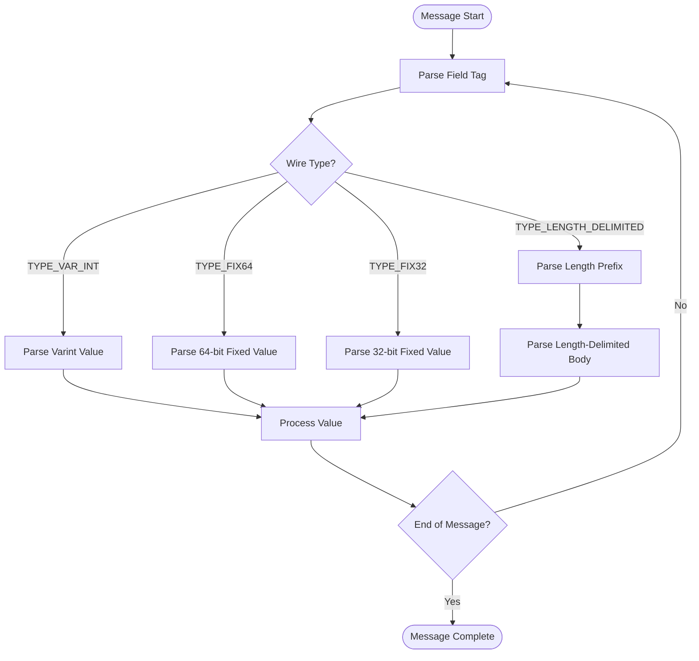

# Protobuf-Based Serialization

<cite>
**Referenced Files in This Document**   
- [PbParser.java](file://client/src/main/java/com/github/dtprj/dongting/codec/PbParser.java)
- [PbUtil.java](file://client/src/main/java/com/github/dtprj/dongting/codec/PbUtil.java)
- [PbCallback.java](file://client/src/main/java/com/github/dtprj/dongting/codec/PbCallback.java)
- [PbIntCallback.java](file://client/src/main/java/com/github/dtprj/dongting/codec/PbIntCallback.java)
- [PbLongCallback.java](file://client/src/main/java/com/github/dtprj/dongting/codec/PbLongCallback.java)
- [PbStrCallback.java](file://client/src/main/java/com/github/dtprj/dongting/codec/PbStrCallback.java)
- [PbBytesCallback.java](file://client/src/main/java/com/github/dtprj/dongting/codec/PbBytesCallback.java)
- [PbNoCopyDecoderCallback.java](file://client/src/main/java/com/github/dtprj/dongting/codec/PbNoCopyDecoderCallback.java)
- [EncodeUtil.java](file://client/src/main/java/com/github/dtprj/dongting/codec/EncodeUtil.java)
- [DecodeContext.java](file://client/src/main/java/com/github/dtprj/dongting/codec/DecodeContext.java)
- [AbstractCodecCallback.java](file://client/src/main/java/com/github/dtprj/dongting/codec/AbstractCodecCallback.java)
- [DecoderCallback.java](file://client/src/main/java/com/github/dtprj/dongting/codec/DecoderCallback.java)
- [dt_pb_test.proto](file://client/src/test/proto/dt_pb_test.proto)
- [PbParserTest.java](file://client/src/test/java/com/github/dtprj/dongting/codec/PbParserTest.java)
- [PbUtilTest.java](file://client/src/test/java/com/github/dtprj/dongting/codec/PbUtilTest.java)
</cite>

## Table of Contents
1. [Introduction](#introduction)
2. [Core Components](#core-components)
3. [Wire Format and Encoding Rules](#wire-format-and-encoding-rules)
4. [PbCallback Implementations](#pbcallback-implementations)
5. [Serialization and Deserialization Process](#serialization-and-deserialization-process)
6. [Integration with Codec Framework](#integration-with-codec-framework)
7. [Performance Considerations](#performance-considerations)
8. [Example Usage](#example-usage)
9. [Conclusion](#conclusion)

## Introduction
Dongting's protobuf-based serialization system provides an efficient mechanism for encoding and decoding messages using Protocol Buffers. The system is designed to handle compact representation of data with high performance, making it suitable for network transmission in distributed systems. This document explains the core components of the serialization system, including PbParser and PbUtil, which provide efficient protobuf message handling. It also covers the various PbCallback implementations that enable type-specific parsing, the wire format and encoding rules used for protobuf messages, and how the serialization system integrates with the core codec framework to support both copy and no-copy decoding scenarios.

**Section sources**
- [PbParser.java](file://client/src/main/java/com/github/dtprj/dongting/codec/PbParser.java#L1-L437)
- [PbUtil.java](file://client/src/main/java/com/github/dtprj/dongting/codec/PbUtil.java#L1-L408)

## Core Components

The Dongting protobuf serialization system is built around two core components: PbParser and PbUtil. PbParser is responsible for parsing protobuf messages from byte buffers, while PbUtil provides utility methods for encoding and calculating the size of protobuf fields.

PbParser implements a state machine that processes protobuf messages incrementally, allowing for efficient parsing of large messages without requiring the entire message to be loaded into memory at once. The parser supports both complete and partial parsing, making it suitable for streaming scenarios where data may arrive in chunks.

PbUtil contains static methods for encoding various data types (integers, strings, bytes) into protobuf format and for calculating the size of encoded fields. These methods are optimized for performance and memory efficiency, using varint encoding for integers and proper handling of string encodings.


**Diagram sources**
- [PbParser.java](file://client/src/main/java/com/github/dtprj/dongting/codec/PbParser.java#L1-L437)
- [PbUtil.java](file://client/src/main/java/com/github/dtprj/dongting/codec/PbUtil.java#L1-L408)

**Section sources**
- [PbParser.java](file://client/src/main/java/com/github/dtprj/dongting/codec/PbParser.java#L1-L437)
- [PbUtil.java](file://client/src/main/java/com/github/dtprj/dongting/codec/PbUtil.java#L1-L408)

## Wire Format and Encoding Rules

The Dongting protobuf implementation follows the standard Protocol Buffers wire format with specific optimizations for compact representation and efficient parsing. The wire format consists of a sequence of key-value pairs, where each key is a combination of a field number and wire type, and each value is the encoded data.

The system supports the following wire types:
- TYPE_VAR_INT (0): Variable-length integers (varint)
- TYPE_FIX64 (1): 64-bit fixed-length values
- TYPE_LENGTH_DELIMITED (2): Length-delimited data (strings, bytes, embedded messages)
- TYPE_FIX32 (5): 32-bit fixed-length values

Varint encoding is used for integer values, where smaller values take fewer bytes. Negative numbers are encoded using 10 bytes (the maximum for 64-bit varints) to maintain consistent performance characteristics. Fixed-length types (FIX32 and FIX64) are used for values that require consistent encoding size, such as timestamps or identifiers.

The tag format combines the field number and wire type in a single varint, with the field number shifted left by 3 bits and the wire type in the lowest 3 bits. Field numbers are limited to 29 bits to ensure compatibility with the varint encoding scheme.



**Diagram sources**
- [PbParser.java](file://client/src/main/java/com/github/dtprj/dongting/codec/PbParser.java#L1-L437)
- [PbUtil.java](file://client/src/main/java/com/github/dtprj/dongting/codec/PbUtil.java#L1-L408)

**Section sources**
- [PbParser.java](file://client/src/main/java/com/github/dtprj/dongting/codec/PbParser.java#L1-L437)
- [PbUtil.java](file://client/src/main/java/com/github/dtprj/dongting/codec/PbUtil.java#L1-L408)

## PbCallback Implementations

The Dongting protobuf system uses a callback-based approach for parsing messages, with various PbCallback implementations providing type-specific parsing capabilities. The base PbCallback class defines methods for handling different field types, and specific implementations override these methods to extract and process values of particular types.

The system includes the following PbCallback implementations:
- PbIntCallback: For parsing 32-bit integer values
- PbLongCallback: For parsing 64-bit integer values
- PbStrCallback: For parsing string values
- PbBytesCallback: For parsing byte array values

Each callback implementation follows a similar pattern: it overrides the appropriate read method (e.g., readFix32 for integers, readBytes for strings and bytes) to extract the value from the buffer and store it in the context. The getResult method then returns the parsed value, with appropriate handling for null and default values.

The callbacks are designed to be reusable and thread-safe, with the DecodeContext maintaining per-thread instances to avoid allocation overhead. This design enables efficient parsing with minimal object creation.


**Diagram sources**
- [PbCallback.java](file://client/src/main/java/com/github/dtprj/dongting/codec/PbCallback.java#L1-L41)
- [PbIntCallback.java](file://client/src/main/java/com/github/dtprj/dongting/codec/PbIntCallback.java#L1-L40)
- [PbLongCallback.java](file://client/src/main/java/com/github/dtprj/dongting/codec/PbLongCallback.java#L1-L40)
- [PbStrCallback.java](file://client/src/main/java/com/github/dtprj/dongting/codec/PbStrCallback.java#L1-L45)
- [PbBytesCallback.java](file://client/src/main/java/com/github/dtprj/dongting/codec/PbBytesCallback.java#L1-L45)

**Section sources**
- [PbCallback.java](file://client/src/main/java/com/github/dtprj/dongting/codec/PbCallback.java#L1-L41)
- [PbIntCallback.java](file://client/src/main/java/com/github/dtprj/dongting/codec/PbIntCallback.java#L1-L40)
- [PbLongCallback.java](file://client/src/main/java/com/github/dtprj/dongting/codec/PbLongCallback.java#L1-L40)
- [PbStrCallback.java](file://client/src/main/java/com/github/dtprj/dongting/codec/PbStrCallback.java#L1-L45)
- [PbBytesCallback.java](file://client/src/main/java/com/github/dtprj/dongting/codec/PbBytesCallback.java#L1-L45)

## Serialization and Deserialization Process

The serialization and deserialization process in Dongting's protobuf system follows a structured approach that ensures efficient handling of messages. Serialization is performed using the PbUtil class, which provides methods for writing different data types to a ByteBuffer. Deserialization is handled by the PbParser in conjunction with appropriate PbCallback implementations.

During serialization, the system first calculates the size of the message using size calculation methods in PbUtil, then writes the fields in sequence. The encoding process handles different data types appropriately: integers are encoded as varints, strings are encoded as UTF-8 with length prefixes, and byte arrays are written with length delimiters.

Deserialization follows a streaming approach where the PbParser processes the input buffer incrementally. The parser maintains state between calls, allowing it to handle partial data and resume parsing when more data becomes available. This is particularly useful for network scenarios where messages may be fragmented across multiple packets.

The process involves the following steps:
1. Prepare the parser with a callback and expected message size
2. Feed data to the parser incrementally
3. The parser invokes callback methods for each field as it is parsed
4. The callback extracts and processes the field values
5. The parser signals completion when the entire message has been processed


**Diagram sources**
- [PbParser.java](file://client/src/main/java/com/github/dtprj/dongting/codec/PbParser.java#L1-L437)
- [PbUtil.java](file://client/src/main/java/com/github/dtprj/dongting/codec/PbUtil.java#L1-L408)
- [PbCallback.java](file://client/src/main/java/com/github/dtprj/dongting/codec/PbCallback.java#L1-L41)

**Section sources**
- [PbParser.java](file://client/src/main/java/com/github/dtprj/dongting/codec/PbParser.java#L1-L437)
- [PbUtil.java](file://client/src/main/java/com/github/dtprj/dongting/codec/PbUtil.java#L1-L408)
- [PbCallback.java](file://client/src/main/java/com/github/dtprj/dongting/codec/PbCallback.java#L1-L41)

## Integration with Codec Framework

The protobuf serialization system integrates seamlessly with Dongting's core codec framework through the use of the PbNoCopyDecoderCallback and DecodeContext classes. This integration enables both copy and no-copy decoding scenarios, providing flexibility for different performance requirements.

The PbNoCopyDecoderCallback acts as an adapter between the protobuf parsing system and the general codec framework. It wraps a PbCallback and implements the DecoderCallback interface, allowing protobuf messages to be processed within the broader decoding pipeline. This design enables the reuse of protobuf parsing logic across different parts of the system.

The DecodeContext class plays a crucial role in the integration, providing thread-local storage for parser instances and managing the lifecycle of decoding operations. It maintains caches of commonly used callback instances (such as PbIntCallback and PbStrCallback) to minimize object allocation and improve performance.

For no-copy decoding scenarios, the system uses direct ByteBuffer operations and reference counting to avoid unnecessary data copying. When processing large messages or high-throughput scenarios, this approach significantly reduces memory pressure and garbage collection overhead.


**Diagram sources**
- [PbNoCopyDecoderCallback.java](file://client/src/main/java/com/github/dtprj/dongting/codec/PbNoCopyDecoderCallback.java#L1-L72)
- [DecodeContext.java](file://client/src/main/java/com/github/dtprj/dongting/codec/DecodeContext.java#L1-L168)
- [PbParser.java](file://client/src/main/java/com/github/dtprj/dongting/codec/PbParser.java#L1-L437)
- [DecoderCallback.java](file://client/src/main/java/com/github/dtprj/dongting/codec/DecoderCallback.java#L1-L40)

**Section sources**
- [PbNoCopyDecoderCallback.java](file://client/src/main/java/com/github/dtprj/dongting/codec/PbNoCopyDecoderCallback.java#L1-L72)
- [DecodeContext.java](file://client/src/main/java/com/github/dtprj/dongting/codec/DecodeContext.java#L1-L168)

## Performance Considerations

The Dongting protobuf serialization system is designed with performance and memory efficiency as primary goals. Several optimizations contribute to its high performance characteristics:

1. **Object Reuse**: The system minimizes object allocation by reusing parser and callback instances through the DecodeContext. Thread-local storage is used for temporary buffers, reducing garbage collection pressure.

2. **Incremental Parsing**: The PbParser supports incremental parsing, allowing it to process data as it arrives without requiring the complete message to be buffered. This reduces memory usage and enables early processing of message content.

3. **Efficient Encoding**: The use of varint encoding for integers ensures that smaller values take fewer bytes, reducing network bandwidth usage. Fixed-length types are used judiciously to balance encoding efficiency with parsing performance.

4. **Direct Buffer Operations**: The system uses direct ByteBuffer operations whenever possible, avoiding unnecessary data copying between Java arrays and native memory.

5. **Size Pre-calculation**: Before serialization, the system calculates the exact size of the message, allowing for optimal buffer allocation and reducing the need for buffer resizing.

6. **No-copy Decoding**: For scenarios where data doesn't need to be copied, the system supports no-copy decoding through the PbNoCopyDecoderCallback, which processes data directly from the input buffer.

These optimizations make the serialization system suitable for high-throughput, low-latency scenarios common in distributed systems.

**Section sources**
- [PbParser.java](file://client/src/main/java/com/github/dtprj/dongting/codec/PbParser.java#L1-L437)
- [PbUtil.java](file://client/src/main/java/com/github/dtprj/dongting/codec/PbUtil.java#L1-L408)
- [DecodeContext.java](file://client/src/main/java/com/github/dtprj/dongting/codec/DecodeContext.java#L1-L168)

## Example Usage

The following example demonstrates how to define and serialize protobuf messages for network transmission using Dongting's serialization system:

```java
// Define a message structure
public class ExampleMessage {
    private int status;
    private long timestamp;
    private String message;
    private byte[] data;
    
    // Serialization method
    public void encode(ByteBuffer buffer) {
        PbUtil.writeFix32Field(buffer, 1, status);
        PbUtil.writeFix64Field(buffer, 2, timestamp);
        PbUtil.writeUTF8Field(buffer, 3, message);
        PbUtil.writeBytesField(buffer, 4, data);
    }
    
    // Deserialization using callback
    public static class DecoderCallback extends PbCallback<ExampleMessage> {
        private final ExampleMessage message = new ExampleMessage();
        
        @Override
        public boolean readFix32(int index, int value) {
            if (index == 1) message.status = value;
            return true;
        }
        
        @Override
        public boolean readFix64(int index, long value) {
            if (index == 2) message.timestamp = value;
            return true;
        }
        
        @Override
        public boolean readBytes(int index, ByteBuffer buf, int fieldLen, int currentPos) {
            if (index == 3) {
                message.message = parseUTF8(buf, fieldLen, currentPos);
            } else if (index == 4) {
                message.data = parseBytes(buf, fieldLen, currentPos);
            }
            return true;
        }
        
        @Override
        protected ExampleMessage getResult() {
            return message;
        }
    }
}
```

This example shows the typical pattern for using the serialization system: defining a message structure, implementing encoding using PbUtil methods, and creating a callback for deserialization that processes each field as it is encountered.

**Section sources**
- [PbParserTest.java](file://client/src/test/java/com/github/dtprj/dongting/codec/PbParserTest.java#L1-L614)
- [PbUtilTest.java](file://client/src/test/java/com/github/dtprj/dongting/codec/PbUtilTest.java#L1-L505)
- [dt_pb_test.proto](file://client/src/test/proto/dt_pb_test.proto#L1-L51)

## Conclusion

Dongting's protobuf-based serialization system provides an efficient and flexible mechanism for handling message encoding and decoding in distributed systems. The system's design emphasizes performance, memory efficiency, and ease of integration with the broader codec framework.

Key strengths of the system include:
- Efficient parsing through the PbParser state machine
- Compact representation using standard protobuf wire format
- Type-specific parsing through specialized PbCallback implementations
- Support for both copy and no-copy decoding scenarios
- Seamless integration with the core codec framework
- Optimizations for high-throughput, low-latency scenarios

The system's modular design allows for easy extension and customization while maintaining high performance characteristics. By following protobuf best practices and incorporating additional optimizations, Dongting provides a robust foundation for network communication in distributed applications.