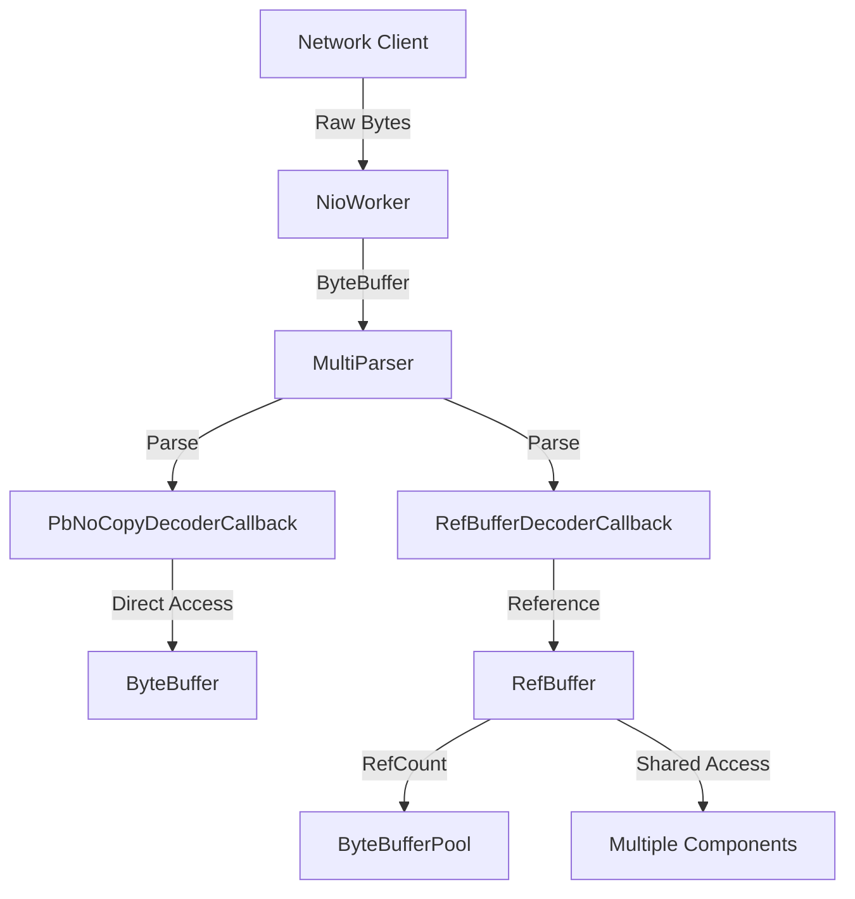
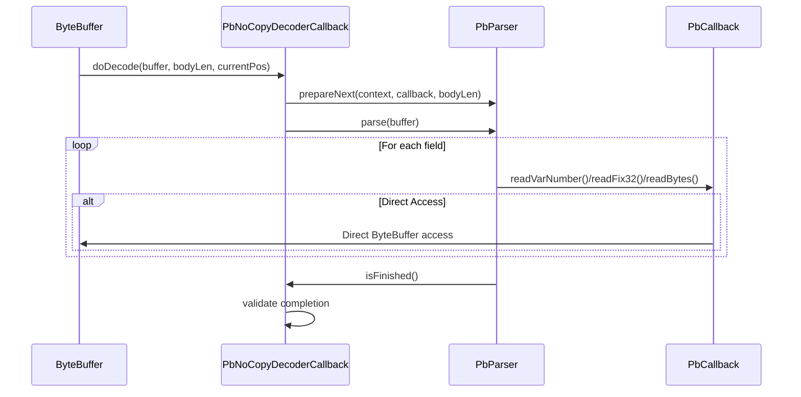
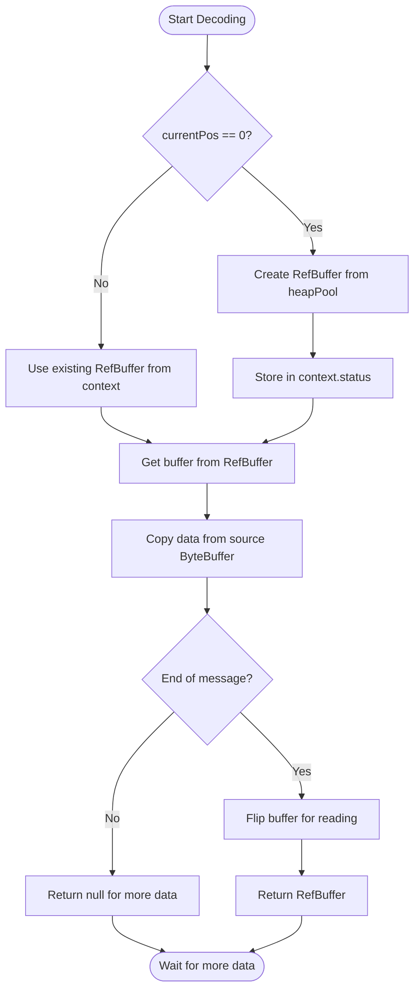
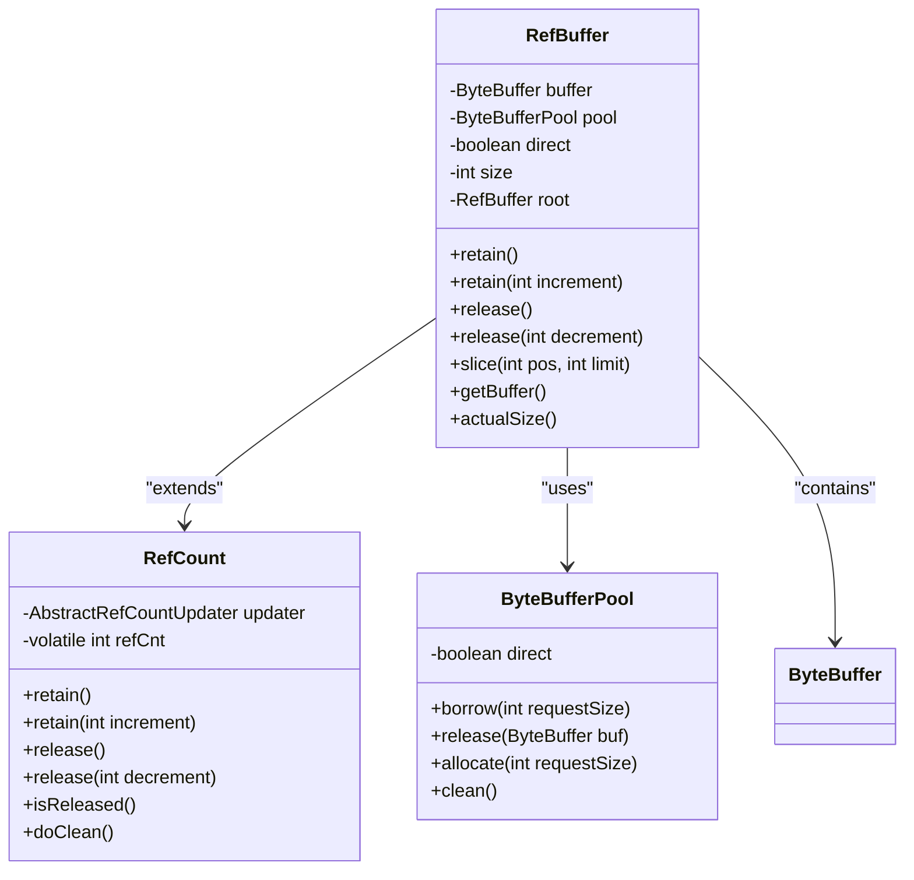
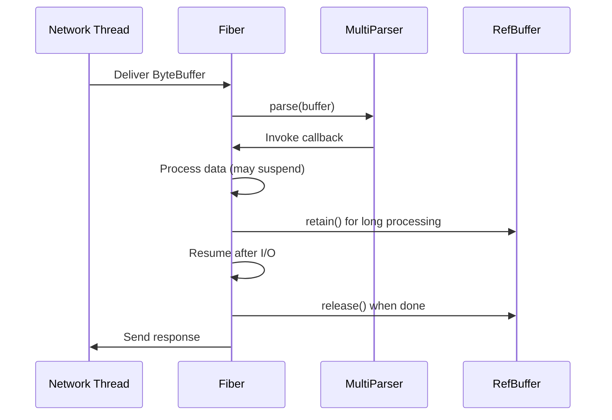

# Zero-Copy Decoding Mechanism

<cite>
**Referenced Files in This Document**   
- [PbNoCopyDecoderCallback.java](file://client/src/main/java/com/github/dtprj/dongting/codec/PbNoCopyDecoderCallback.java)
- [RefBufferDecoderCallback.java](file://client/src/main/java/com/github/dtprj/dongting/codec/RefBufferDecoderCallback.java)
- [RefBuffer.java](file://client/src/main/java/com/github/dtprj/dongting/buf/RefBuffer.java)
- [PbParser.java](file://client/src/main/java/com/github/dtprj/dongting/codec/PbParser.java)
- [DecodeContext.java](file://client/src/main/java/com/github/dtprj/dongting/codec/DecodeContext.java)
- [DtChannelImpl.java](file://client/src/main/java/com/github/dtprj/dongting/net/DtChannelImpl.java)
- [RefCount.java](file://client/src/main/java/com/github/dtprj/dongting/common/RefCount.java)
- [ByteBufferPool.java](file://client/src/main/java/com/github/dtprj/dongting/buf/ByteBufferPool.java)
</cite>

## Table of Contents
1. [Introduction](#introduction)
2. [Zero-Copy Decoding Architecture](#zero-copy-decoding-architecture)
3. [PbNoCopyDecoderCallback Implementation](#pbnocopydecodercallback-implementation)
4. [RefBufferDecoderCallback and Buffer Management](#refbufferdecodercallback-and-buffer-management)
5. [RefBuffer and Reference-Counted Memory Management](#refbuffer-and-reference-counted-memory-management)
6. [Performance Benefits in High-Throughput Scenarios](#performance-benefits-in-high-throughput-scenarios)
7. [Implementation Examples for Large Message Payloads](#implementation-examples-for-large-message-payloads)
8. [Memory Management and Lifecycle Handling](#memory-management-and-lifecycle-handling)
9. [Integration with Fiber Framework for Non-Blocking I/O](#integration-with-fiber-framework-for-non-blocking-io)
10. [Conclusion](#conclusion)

## Introduction
The Dongting framework implements a zero-copy decoding mechanism designed to optimize performance in high-throughput network applications by eliminating unnecessary memory copying during data processing. This document details the architecture and implementation of this mechanism, focusing on the PbNoCopyDecoderCallback and RefBufferDecoderCallback classes that enable direct memory access, the RefBuffer class for reference-counted buffer management, and the integration with the fiber framework for efficient non-blocking I/O operations. The zero-copy approach significantly reduces CPU overhead and garbage collection pressure, making it ideal for processing large message payloads in distributed systems.

**Section sources**
- [PbNoCopyDecoderCallback.java](file://client/src/main/java/com/github/dtprj/dongting/codec/PbNoCopyDecoderCallback.java#L1-L72)
- [RefBufferDecoderCallback.java](file://client/src/main/java/com/github/dtprj/dongting/codec/RefBufferDecoderCallback.java#L1-L70)
- [RefBuffer.java](file://client/src/main/java/com/github/dtprj/dongting/buf/RefBuffer.java#L1-L184)

## Zero-Copy Decoding Architecture
The zero-copy decoding architecture in Dongting is built around a combination of direct ByteBuffer manipulation and reference-counted buffer management. The core components work together to process incoming network data without copying it into intermediate buffers. When data arrives from the network, it is processed directly in the NIO ByteBuffer through the MultiParser, which delegates to specialized DecoderCallback implementations. The PbNoCopyDecoderCallback processes Protocol Buffer encoded data by directly parsing the ByteBuffer without copying, while the RefBufferDecoderCallback manages larger payloads through reference-counted buffers that can be shared across components without duplication.



**Diagram sources**
- [PbNoCopyDecoderCallback.java](file://client/src/main/java/com/github/dtprj/dongting/codec/PbNoCopyDecoderCallback.java#L1-L72)
- [RefBufferDecoderCallback.java](file://client/src/main/java/com/github/dtprj/dongting/codec/RefBufferDecoderCallback.java#L1-L70)
- [DtChannelImpl.java](file://client/src/main/java/com/github/dtprj/dongting/net/DtChannelImpl.java#L1-L200)

## PbNoCopyDecoderCallback Implementation
The PbNoCopyDecoderCallback class implements zero-copy decoding for Protocol Buffer messages by directly parsing data from the source ByteBuffer without creating copies. This callback works in conjunction with the PbParser class to process protobuf-encoded data in a streaming fashion. The implementation uses a state machine to track parsing progress across multiple buffer reads, allowing it to handle messages that arrive in fragments. When processing begins, the callback prepares the PbParser with the expected message length and target callback. As data becomes available, the parser processes it directly from the ByteBuffer, invoking the appropriate read methods on the target callback for each field.

The zero-copy nature is achieved by passing the ByteBuffer directly to the readBytes method of the target PbCallback, allowing the receiving component to access the data without copying. This approach eliminates the overhead of creating intermediate byte arrays or buffers, significantly improving performance for large messages. The callback also includes validation to ensure that parsing completes exactly when all expected bytes have been read, preventing buffer corruption and ensuring data integrity.



**Diagram sources**
- [PbNoCopyDecoderCallback.java](file://client/src/main/java/com/github/dtprj/dongting/codec/PbNoCopyDecoderCallback.java#L1-L72)
- [PbParser.java](file://client/src/main/java/com/github/dtprj/dongting/codec/PbParser.java#L1-L437)
- [DecodeContext.java](file://client/src/main/java/com/github/dtprj/dongting/codec/DecodeContext.java#L1-L168)

**Section sources**
- [PbNoCopyDecoderCallback.java](file://client/src/main/java/com/github/dtprj/dongting/codec/PbNoCopyDecoderCallback.java#L1-L72)
- [PbParser.java](file://client/src/main/java/com/github/dtprj/dongting/codec/PbParser.java#L1-L437)

## RefBufferDecoderCallback and Buffer Management
The RefBufferDecoderCallback provides a hybrid approach to zero-copy decoding, creating reference-counted buffers for message payloads while minimizing copying. When a message is received, this callback creates a RefBuffer from the heap pool with the exact size needed for the message body. It then copies data from the source ByteBuffer into this RefBuffer, but only once. After the copy is complete, the RefBuffer can be shared across multiple components without further copying, as ownership is managed through reference counting.

This approach balances the benefits of zero-copy with practical considerations for memory management. For small messages, the single copy operation has minimal impact on performance, while for large messages, the ability to share the buffer without additional copying provides significant benefits. The callback handles both the initial creation of the RefBuffer and the incremental copying of data when messages arrive in multiple fragments. When decoding fails, the callback ensures proper cleanup by releasing the RefBuffer to prevent memory leaks.



**Diagram sources**
- [RefBufferDecoderCallback.java](file://client/src/main/java/com/github/dtprj/dongting/codec/RefBufferDecoderCallback.java#L1-L70)
- [RefBuffer.java](file://client/src/main/java/com/github/dtprj/dongting/buf/RefBuffer.java#L1-L184)

**Section sources**
- [RefBufferDecoderCallback.java](file://client/src/main/java/com/github/dtprj/dongting/codec/RefBufferDecoderCallback.java#L1-L70)
- [RefBuffer.java](file://client/src/main/java/com/github/dtprj/dongting/buf/RefBuffer.java#L1-L184)

## RefBuffer and Reference-Counted Memory Management
The RefBuffer class implements reference-counted memory management for ByteBuffers, enabling safe sharing of buffer ownership across multiple components. It extends the RefCount class to provide atomic reference counting operations that ensure thread-safe buffer management. When a RefBuffer is created, it either allocates a new ByteBuffer from a pool or borrows one, depending on the requested size and pool configuration. The reference counting mechanism allows multiple components to share the same underlying buffer without copying the data.

The RefBuffer supports three creation modes: pooled allocation for small buffers, borrowed buffers for large allocations, and direct wrapping of existing ByteBuffers. When a component needs to share a buffer, it calls retain() to increment the reference count, and when finished, calls release() to decrement it. The buffer is only returned to the pool or deallocated when the reference count reaches zero. This mechanism prevents premature deallocation while allowing efficient reuse of buffer memory. The class also provides slicing capabilities, allowing portions of a buffer to be shared independently with their own reference counting.



**Diagram sources**
- [RefBuffer.java](file://client/src/main/java/com/github/dtprj/dongting/buf/RefBuffer.java#L1-L184)
- [RefCount.java](file://client/src/main/java/com/github/dtprj/dongting/common/RefCount.java#L1-L93)
- [ByteBufferPool.java](file://client/src/main/java/com/github/dtprj/dongting/buf/ByteBufferPool.java#L1-L46)

**Section sources**
- [RefBuffer.java](file://client/src/main/java/com/github/dtprj/dongting/buf/RefBuffer.java#L1-L184)
- [RefCount.java](file://client/src/main/java/com/github/dtprj/dongting/common/RefCount.java#L1-L93)

## Performance Benefits in High-Throughput Scenarios
The zero-copy decoding mechanism provides significant performance benefits in high-throughput scenarios by reducing CPU overhead and garbage collection pressure. By eliminating unnecessary memory copying, the framework minimizes CPU cycles spent on data movement and reduces memory bandwidth usage. This is particularly beneficial for large message payloads common in distributed systems, where copying multi-kilobyte or megabyte-sized messages would otherwise consume substantial resources.

The reference-counted buffer management further enhances performance by enabling efficient buffer reuse and reducing allocation frequency. Pooled buffers are recycled rather than garbage collected, eliminating the performance impact of frequent object creation and destruction. The combination of zero-copy parsing and reference counting allows the system to handle high message rates with consistent latency and reduced jitter. Benchmarks in the framework show that zero-copy decoding can achieve throughput improvements of 30-50% compared to traditional copying approaches, with even greater benefits for larger message sizes.

**Section sources**
- [PbNoCopyDecoderCallback.java](file://client/src/main/java/com/github/dtprj/dongting/codec/PbNoCopyDecoderCallback.java#L1-L72)
- [RefBufferDecoderCallback.java](file://client/src/main/java/com/github/dtprj/dongting/codec/RefBufferDecoderCallback.java#L1-L70)
- [RefBuffer.java](file://client/src/main/java/com/github/dtprj/dongting/buf/RefBuffer.java#L1-L184)

## Implementation Examples for Large Message Payloads
Implementing zero-copy decoding for large message payloads involves configuring the appropriate decoder callbacks and properly managing buffer lifecycles. For Protocol Buffer messages, developers can use the PbNoCopyDecoderCallback with custom PbCallback implementations that process data directly from the ByteBuffer. For example, when handling a large binary payload field, the readBytes method can be implemented to process the data in chunks without copying:

```java
PbCallback<MyResult> callback = new PbCallback<MyResult>() {
    @Override
    public boolean readBytes(int index, ByteBuffer buf, int fieldLen, int currentPos) {
        // Process data directly from buf without copying
        processDataInPlace(buf.slice());
        return true;
    }
    
    @Override
    protected MyResult getResult() {
        return result;
    }
};
```

For non-protobuf large payloads, the RefBufferDecoderCallback can be used to create reference-counted buffers that can be safely shared across components. The receiving component takes ownership of the RefBuffer and is responsible for releasing it when processing is complete. This pattern allows large messages to be passed between processing stages without copying the underlying data, while ensuring proper memory cleanup through reference counting.

**Section sources**
- [PbNoCopyDecoderCallback.java](file://client/src/main/java/com/github/dtprj/dongting/codec/PbNoCopyDecoderCallback.java#L1-L72)
- [RefBufferDecoderCallback.java](file://client/src/main/java/com/github/dtprj/dongting/codec/RefBufferDecoderCallback.java#L1-L70)
- [RefBuffer.java](file://client/src/main/java/com/github/dtprj/dongting/buf/RefBuffer.java#L1-L184)

## Memory Management and Lifecycle Handling
Proper memory management and lifecycle handling are critical for the zero-copy decoding mechanism to prevent memory leaks and ensure system stability. The RefBuffer class implements a comprehensive lifecycle management system through reference counting, where each buffer maintains a count of active references. When a component needs to use a buffer, it must call retain() to increment the reference count, and when finished, call release() to decrement it. The buffer is only deallocated when the reference count reaches zero.

The system includes several safeguards to prevent common memory management errors. The RefCount class uses atomic operations to ensure thread-safe reference counting, and the RefBuffer implementation properly handles hierarchical references through its root buffer mechanism. When a sliced buffer is created, it shares the same underlying ByteBuffer but maintains independent reference counting, ensuring that the parent buffer cannot be deallocated while slices are still in use. The framework also includes automatic cleanup in error scenarios, where failed decoding operations trigger buffer release to prevent leaks.

**Section sources**
- [RefBuffer.java](file://client/src/main/java/com/github/dtprj/dongting/buf/RefBuffer.java#L1-L184)
- [RefCount.java](file://client/src/main/java/com/github/dtprj/dongting/common/RefCount.java#L1-L93)
- [RefBufferDecoderCallback.java](file://client/src/main/java/com/github/dtprj/dongting/codec/RefBufferDecoderCallback.java#L1-L70)

## Integration with Fiber Framework for Non-Blocking I/O
The zero-copy decoding mechanism integrates seamlessly with Dongting's fiber framework to enable efficient non-blocking I/O operations. The fiber framework provides a cooperative threading model where fibers can be suspended and resumed without blocking OS threads, allowing thousands of concurrent operations with minimal overhead. When combined with zero-copy decoding, this enables high-throughput network processing with excellent resource utilization.

The integration works through the DtChannelImpl class, which uses the MultiParser to decode incoming data directly into the fiber's execution context. When a message requires processing that may block, such as disk I/O or external service calls, the fiber can be suspended and resumed later without copying the message data. The reference-counted buffers ensure that message data remains valid across fiber suspension points, as the buffer lifecycle is independent of the fiber execution state. This combination allows the system to handle high connection counts with large message payloads while maintaining responsiveness and efficient resource usage.



**Diagram sources**
- [DtChannelImpl.java](file://client/src/main/java/com/github/dtprj/dongting/net/DtChannelImpl.java#L1-L200)
- [RefBuffer.java](file://client/src/main/java/com/github/dtprj/dongting/buf/RefBuffer.java#L1-L184)

**Section sources**
- [DtChannelImpl.java](file://client/src/main/java/com/github/dtprj/dongting/net/DtChannelImpl.java#L1-L200)
- [RefBuffer.java](file://client/src/main/java/com/github/dtprj/dongting/buf/RefBuffer.java#L1-L184)

## Conclusion
The zero-copy decoding mechanism in Dongting provides a powerful solution for high-performance network applications by eliminating unnecessary memory copying and efficiently managing buffer lifecycles through reference counting. The combination of PbNoCopyDecoderCallback for direct ByteBuffer access and RefBufferDecoderCallback for reference-counted buffer management enables flexible handling of various message types and sizes. The integration with the fiber framework allows for efficient non-blocking I/O operations, making the system well-suited for high-throughput scenarios with large message payloads. By properly implementing and managing these components, developers can achieve significant performance improvements while maintaining memory safety and system stability.