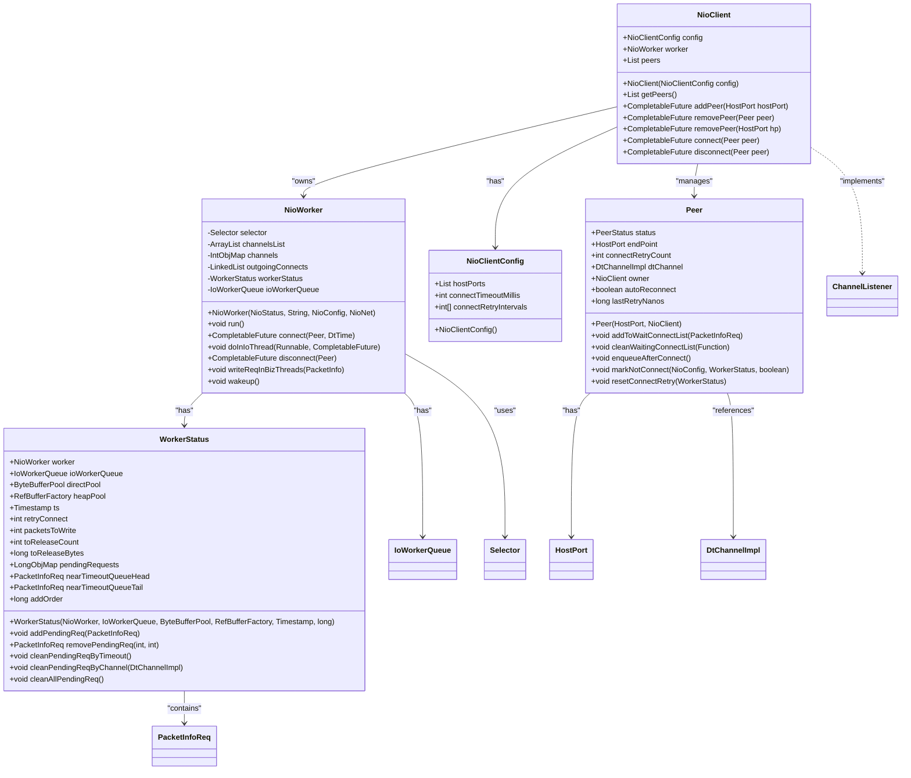
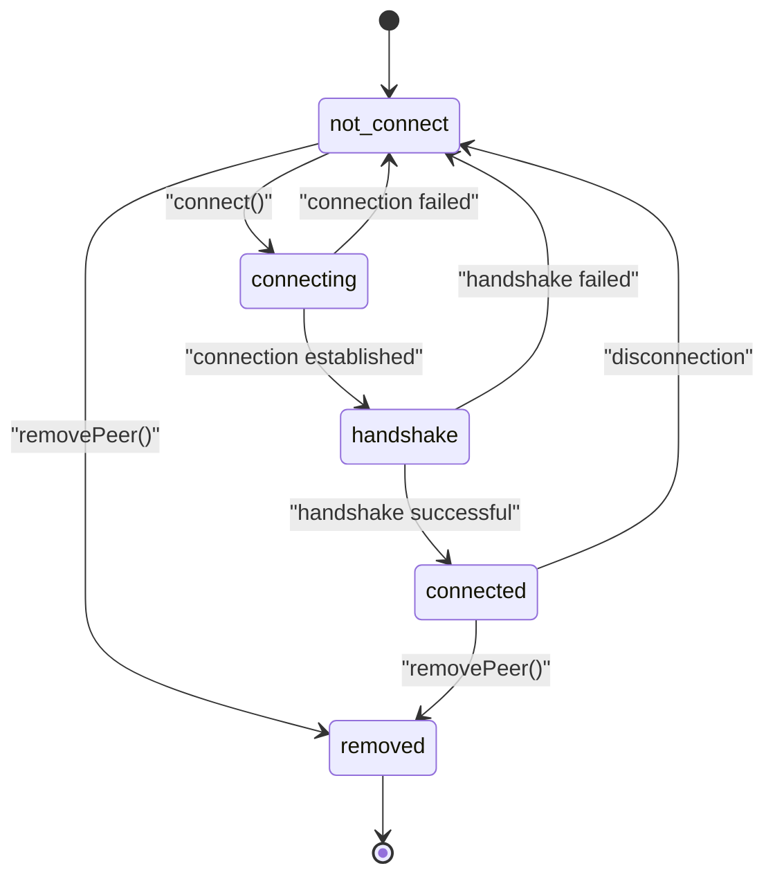
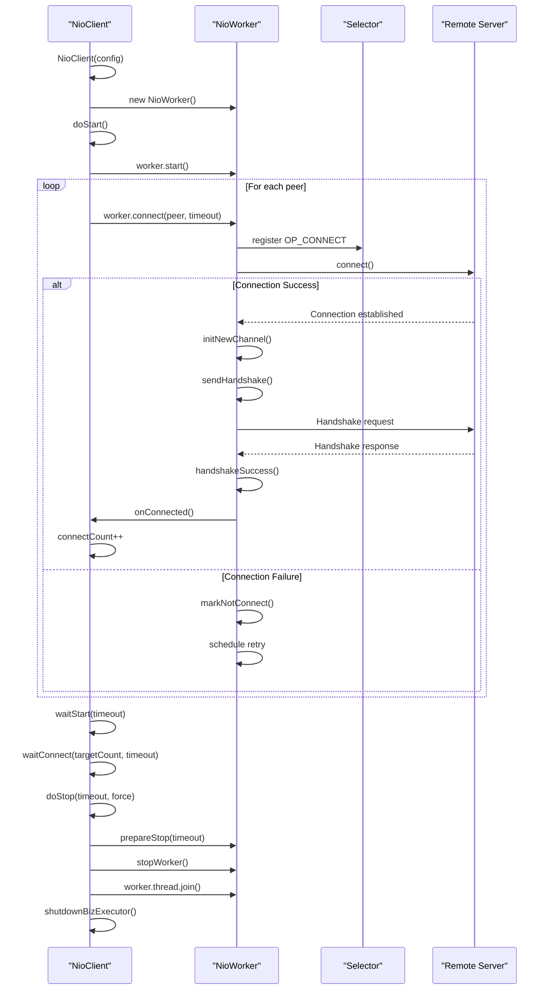
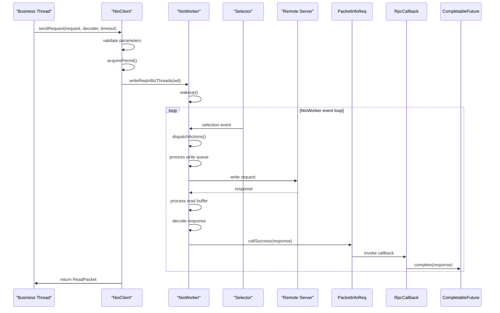
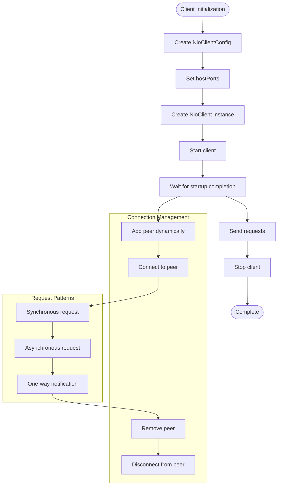
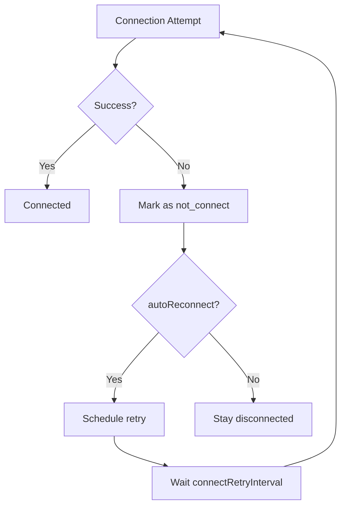

# NIO Client Implementation

<cite>
**Referenced Files in This Document**   
- [NioClient.java](file://client/src/main/java/com/github/dtprj/dongting/net/NioClient.java)
- [NioClientConfig.java](file://client/src/main/java/com/github/dtprj/dongting/net/NioClientConfig.java)
- [NioWorker.java](file://client/src/main/java/com/github/dtprj/dongting/net/NioWorker.java)
- [Peer.java](file://client/src/main/java/com/github/dtprj/dongting/net/Peer.java)
- [PeerStatus.java](file://client/src/main/java/com/github/dtprj/dongting/net/PeerStatus.java)
- [WorkerStatus.java](file://client/src/main/java/com/github/dtprj/dongting/net/WorkerStatus.java)
- [RpcCallback.java](file://client/src/main/java/com/github/dtprj/dongting/net/RpcCallback.java)
- [PacketInfoReq.java](file://client/src/main/java/com/github/dtprj/dongting/net/PacketInfoReq.java)
- [HandshakeBody.java](file://client/src/main/java/com/github/dtprj/dongting/net/HandshakeBody.java)
- [NioNet.java](file://client/src/main/java/com/github/dtprj/dongting/net/NioNet.java)
</cite>

## Table of Contents
1. [Introduction](#introduction)
2. [Client Architecture](#client-architecture)
3. [Connection Management](#connection-management)
4. [Connection Lifecycle](#connection-lifecycle)
5. [Request-Response Pattern](#request-response-pattern)
6. [Configuration Options](#configuration-options)
7. [Usage Examples](#usage-examples)
8. [Common Issues and Considerations](#common-issues-and-considerations)

## Introduction
The Dongting NIO client implementation provides a high-performance, non-blocking I/O networking solution for distributed systems. This documentation details the architecture and functionality of the NioClient class, which manages connections to multiple servers through a dedicated NioWorker thread for efficient I/O operations. The client supports dynamic peer management, connection lifecycle management, and a flexible request-response pattern with both synchronous and asynchronous invocation options. The implementation is designed for reliability with comprehensive timeout handling, reconnection mechanisms, and thread safety considerations.

## Client Architecture

The Dongting NIO client architecture is built around a single-threaded event loop model using Java NIO for non-blocking I/O operations. The core components work together to provide efficient network communication with minimal resource consumption.



**Diagram sources**
- [NioClient.java](file://client/src/main/java/com/github/dtprj/dongting/net/NioClient.java#L41-L363)
- [NioWorker.java](file://client/src/main/java/com/github/dtprj/dongting/net/NioWorker.java#L55-L809)
- [NioClientConfig.java](file://client/src/main/java/com/github/dtprj/dongting/net/NioClientConfig.java#L23-L43)
- [Peer.java](file://client/src/main/java/com/github/dtprj/dongting/net/Peer.java#L29-L132)
- [WorkerStatus.java](file://client/src/main/java/com/github/dtprj/dongting/net/WorkerStatus.java#L33-L284)

**Section sources**
- [NioClient.java](file://client/src/main/java/com/github/dtprj/dongting/net/NioClient.java#L41-L363)
- [NioWorker.java](file://client/src/main/java/com/github/dtprj/dongting/net/NioWorker.java#L55-L809)

## Connection Management

The Dongting NIO client implements a sophisticated peer management system for maintaining connections to multiple servers. The client maintains a collection of Peer objects, each representing a connection to a specific server endpoint. The peer management system supports dynamic addition and removal of peers through the addPeer and removePeer methods, allowing for flexible topology changes in distributed systems.

The Peer class tracks the connection state through its status field, which can be one of five states: not_connect, connecting, handshake, connected, or removed. This state machine ensures proper connection lifecycle management and prevents invalid operations. When a peer is added via addPeer, the client checks for duplicates and initiates a connection attempt through the NioWorker. The method returns a CompletableFuture that completes when the peer is either found (if already exists) or added to the peers list.



The removePeer method provides two overloads: one that accepts a Peer object and another that accepts a HostPort. Both methods operate asynchronously, returning a CompletableFuture that completes when the peer has been successfully removed. When a peer is removed, the client closes the associated DtChannel, removes the peer from the internal list, and marks its status as removed to prevent further operations. The implementation is idempotent, meaning calling removePeer multiple times on the same peer has no additional effect after the first successful removal.

**Section sources**
- [NioClient.java](file://client/src/main/java/com/github/dtprj/dongting/net/NioClient.java#L216-L274)
- [Peer.java](file://client/src/main/java/com/github/dtprj/dongting/net/Peer.java#L29-L132)
- [PeerStatus.java](file://client/src/main/java/com/github/dtprj/dongting/net/PeerStatus.java#L21-L23)

## Connection Lifecycle

The connection lifecycle in the Dongting NIO client follows a well-defined sequence from initialization to graceful shutdown. The lifecycle begins with client initialization through the NioClient constructor, which sets up the configuration, generates a unique client identifier, and creates the NioWorker thread that will handle all I/O operations.



**Diagram sources**
- [NioClient.java](file://client/src/main/java/com/github/dtprj/dongting/net/NioClient.java#L77-L85)
- [NioWorker.java](file://client/src/main/java/com/github/dtprj/dongting/net/NioWorker.java#L454-L624)
- [NioClient.java](file://client/src/main/java/com/github/dtprj/dongting/net/NioClient.java#L177-L210)

The connection establishment process begins when the client calls start(), which triggers doStart() to create the business executor thread pool and start the NioWorker thread. The worker then initiates connections to all configured peers using non-blocking connect operations registered with the Selector. For each connection attempt, the worker manages the connection state through the ConnectInfo object, which contains the connection future, peer reference, socket channel, and deadline.

The handshake protocol is a critical part of the connection lifecycle, ensuring protocol compatibility and exchanging configuration parameters between client and server. During handshake, the client sends a HandshakeBody containing version information, process UUID, and current configuration limits. The server responds with its own configuration, allowing the client to adjust its limits based on server hints through the processServerConfigHint method. This dynamic configuration adjustment enables optimal resource utilization across the distributed system.

Reconnection mechanisms are built into the peer management system. When a connection fails, the peer's status is set to not_connect, and if autoReconnect is enabled, the worker schedules a reconnection attempt based on the connectRetryIntervals configuration. The retry intervals provide exponential backoff behavior to prevent overwhelming the network with rapid reconnection attempts. The system tracks retry counts and last retry times to manage the reconnection schedule efficiently.

## Request-Response Pattern

The Dongting NIO client implements a flexible request-response pattern that supports both synchronous and asynchronous invocation methods. The pattern is centered around the sendRequest methods, which allow clients to send requests to servers and receive responses with configurable timeout handling.



**Diagram sources**
- [NioClient.java](file://client/src/main/java/com/github/dtprj/dongting/net/NioClient.java#L132-L174)
- [NioNet.java](file://client/src/main/java/com/github/dtprj/dongting/net/NioNet.java#L92-L124)
- [PacketInfoReq.java](file://client/src/main/java/com/github/dtprj/dongting/net/PacketInfoReq.java#L51-L67)

The request-response pattern begins with the client calling one of the sendRequest overloads. The client can send requests to any peer or use the default routing. The request is packaged in a WritePacket with a command code and optional body data. The client must provide a DecoderCallbackCreator to specify how the response should be decoded.

For synchronous invocation, the client calls sendRequest with a timeout parameter and receives a ReadPacket response directly. The method internally creates a CompletableFuture and blocks until either a response is received or the timeout expires. For asynchronous invocation, the client provides an RpcCallback that will be invoked when the response arrives or an error occurs. This non-blocking approach allows for higher throughput and better resource utilization in high-concurrency scenarios.

Timeout handling is a critical aspect of the request-response pattern. Each request carries a DtTime deadline that is checked at multiple points in the processing pipeline. If a request times out before being sent, it fails immediately with a NetTimeoutException. If a request is sent but no response is received before the deadline, the WorkerStatus component automatically cleans up pending requests by timeout during its periodic cleanup cycle. The nearTimeoutThreshold configuration parameter determines how aggressively the system checks for impending timeouts.

The RpcCallback interface provides a functional programming model for handling responses. The framework includes utility methods like fromFuture and fromUnwrapFuture to easily convert between RpcCallback and CompletableFuture, enabling seamless integration with modern Java concurrency patterns. The callback is invoked on the business executor thread pool, ensuring that response processing does not block the I/O worker thread.

## Configuration Options

The Dongting NIO client provides extensive configuration options through the NioClientConfig class, allowing fine-tuning of client behavior for different deployment scenarios. The configuration options cover connection parameters, worker thread settings, resource limits, and performance tuning.

```mermaid
erDiagram
NioClientConfig {
List<HostPort> hostPorts
int connectTimeoutMillis
int[] connectRetryIntervals
int bizThreads
int maxPacketSize
int maxBodySize
int maxOutRequests
int maxOutBytes
int maxInRequests
int maxInBytes
int selectTimeout
int cleanInterval
long nearTimeoutThreshold
PoolFactory poolFactory
PerfCallback perfCallback
boolean serverHint
}
NioClientConfig ||--o{ HostPort : "contains"
```

**Diagram sources**
- [NioClientConfig.java](file://client/src/main/java/com/github/dtprj/dongting/net/NioClientConfig.java#L23-L43)
- [NioConfig.java](file://client/src/main/java/com/github/dtprj/dongting/net/NioConfig.java)

**Section sources**
- [NioClientConfig.java](file://client/src/main/java/com/github/dtprj/dongting/net/NioClientConfig.java#L23-L43)

Connection timeout is controlled by the connectTimeoutMillis parameter, which defaults to 3,000 milliseconds. This timeout applies to both initial connection attempts and reconnection attempts. The connectRetryIntervals array specifies the delay between reconnection attempts when a connection fails, providing exponential backoff behavior. The default intervals are [100, 1000, 5000, 10000, 20000, 30000, 60000] milliseconds, allowing for rapid initial retries followed by increasingly longer intervals.

Worker thread settings include the bizThreads parameter, which determines the size of the business executor thread pool that processes responses and callbacks. By default, this is set to twice the number of available processors, with a minimum of 4 and maximum of 8 threads. The selectTimeout parameter controls how long the NioWorker's Selector will block waiting for I/O events, with a default value that balances responsiveness and CPU usage.

Packet size limits are critical for preventing resource exhaustion and ensuring system stability. The maxPacketSize parameter limits the total size of any packet (header + body), while maxBodySize limits the payload size. The default values are 2,000 for maxOutRequests (outbound requests) and 100 for maxInRequests (inbound requests), with corresponding byte limits of 32MB. These limits can be adjusted based on application requirements and network conditions.

Advanced configuration options include the nearTimeoutThreshold parameter, which determines how far in advance the system should check for requests that are approaching their timeout deadline. This proactive checking helps ensure timely timeout handling. The serverHint parameter enables the client to adjust its configuration based on hints from the server during the handshake process, promoting optimal resource utilization across the distributed system.

## Usage Examples

The following examples demonstrate practical usage patterns for the Dongting NIO client, covering initialization, connection management, and RPC invocation.



**Diagram sources**
- [NioServerClientTest.java](file://client/src/test/java/com/github/dtprj/dongting/net/NioServerClientTest.java#L42-L76)
- [NioClientTest.java](file://client/src/test/java/com/github/dtprj/dongting/net/NioClientTest.java#L482-L519)

**Section sources**
- [NioServerClientTest.java](file://client/src/test/java/com/github/dtprj/dongting/net/NioServerClientTest.java#L42-L76)
- [NioClientTest.java](file://client/src/test/java/com/github/dtprj/dongting/net/NioClientTest.java#L341-L369)

### Client Initialization and Basic Usage

```java
// Create client configuration
NioClientConfig config = new NioClientConfig();
config.hostPorts = Arrays.asList(
    new HostPort("server1.example.com", 8080),
    new HostPort("server2.example.com", 8080)
);
config.connectTimeoutMillis = 5000;

// Create and start the client
NioClient client = new NioClient(config);
client.start();

// Wait for connections to establish
client.waitStart(new DtTime(10, TimeUnit.SECONDS));

// Send a synchronous request
ByteBufferWritePacket request = new ByteBufferWritePacket(ByteBuffer.wrap("Hello".getBytes()));
request.command = Commands.CMD_ECHO;

ReadPacket<RefBuffer> response = client.sendRequest(
    request, 
    ctx -> new RefBufferDecoderCallback(), 
    new DtTime(5, TimeUnit.SECONDS)
);

// Process response
if (response.getBody() != null) {
    System.out.println("Response: " + response.getBody().getBuffer().toString());
    response.getBody().release();
}

// Graceful shutdown
client.stop(new DtTime(5, TimeUnit.SECONDS), false);
```

### Dynamic Peer Management

```java
// Add a peer dynamically
CompletableFuture<Peer> addFuture = client.addPeer(new HostPort("server3.example.com", 8080));
Peer newPeer = addFuture.get(5, TimeUnit.SECONDS);

// Connect to the new peer
CompletableFuture<Void> connectFuture = client.connect(newPeer);
connectFuture.get(5, TimeUnit.SECONDS);

// Send request to specific peer
ReadPacket<RefBuffer> peerResponse = client.sendRequest(
    newPeer, 
    request, 
    ctx -> new RefBufferDecoderCallback(), 
    new DtTime(5, TimeUnit.SECONDS)
);

// Remove peer when no longer needed
CompletableFuture<Void> removeFuture = client.removePeer(newPeer);
removeFuture.get(5, TimeUnit.SECONDS);
```

### Asynchronous Request Processing

```java
// Send asynchronous request
CompletableFuture<ReadPacket<RefBuffer>> asyncFuture = new CompletableFuture<>();
client.sendRequest(
    request,
    ctx -> new RefBufferDecoderCallback(),
    new DtTime(5, TimeUnit.SECONDS),
    RpcCallback.fromFuture(asyncFuture)
);

// Continue with other work
doOtherWork();

// Get response when ready
ReadPacket<RefBuffer> asyncResponse = asyncFuture.get();
```

## Common Issues and Considerations

When working with the Dongting NIO client, several common issues and considerations should be addressed to ensure reliable and efficient operation.

### Connection Failures

Connection failures can occur due to network issues, server unavailability, or configuration problems. The client handles connection failures through its automatic reconnection mechanism, but applications should implement appropriate error handling:



Applications should monitor connection status and implement circuit breaker patterns when appropriate. The waitStart and waitConnect methods can be used to ensure the client has established the required number of connections before proceeding with operations.

### Timeout Handling

Timeouts can occur at multiple levels: connection timeout, request timeout, and permit acquisition timeout. Proper timeout configuration is essential for system stability:

- **Connection timeout**: Controlled by connectTimeoutMillis, should be set based on network latency and server response time
- **Request timeout**: Specified per-request, should reflect the expected processing time plus network latency
- **Permit timeout**: Occurs when the client's outbound request queue is full, indicating potential backpressure

Applications should implement retry logic with exponential backoff for timeout errors, while being careful to avoid thundering herd problems.

### Thread Safety Considerations

The Dongting NIO client is designed with thread safety in mind:

- The NioWorker thread handles all I/O operations exclusively
- Business threads interact with the client through thread-safe methods that delegate to the worker thread
- The doInIoThread method ensures that operations requiring I/O thread execution are properly scheduled
- Peer management operations are synchronized to prevent race conditions

However, applications should still follow best practices:
- Initialize and start the client in a single thread
- Use the provided callback mechanisms rather than attempting direct access to internal state
- Avoid blocking operations in callback handlers to prevent starving the business executor

**Section sources**
- [NioClient.java](file://client/src/main/java/com/github/dtprj/dongting/net/NioClient.java#L364-L363)
- [NioWorker.java](file://client/src/main/java/com/github/dtprj/dongting/net/NioWorker.java#L626-L638)
- [TimeoutTest.java](file://client/src/test/java/com/github/dtprj/dongting/net/TimeoutTest.java#L113-L181)