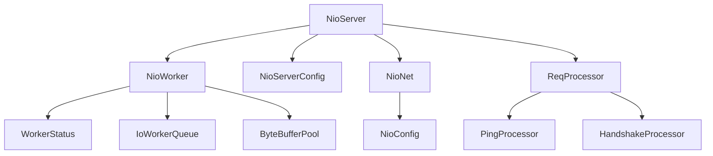
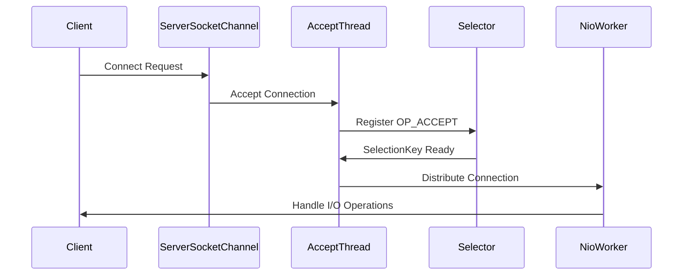
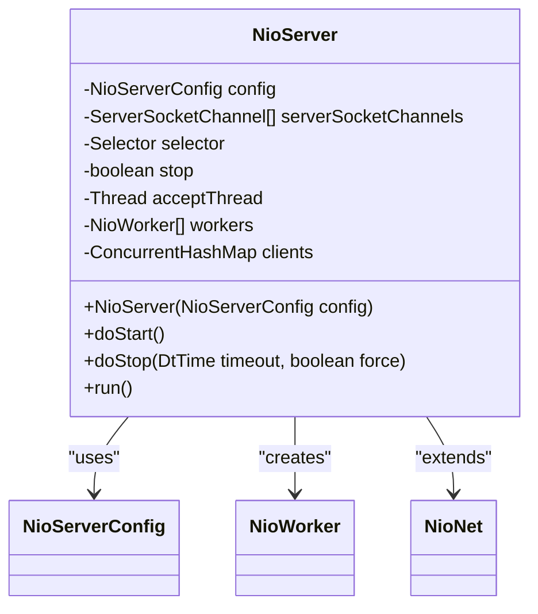
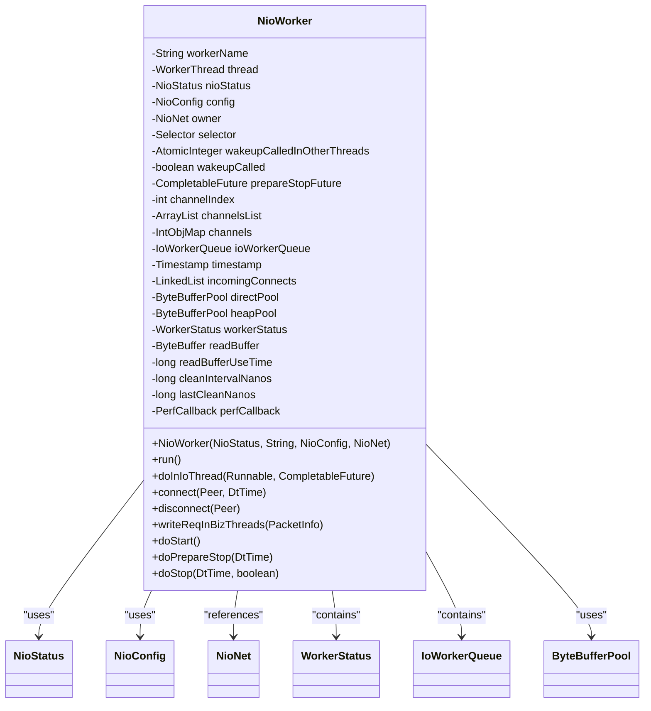
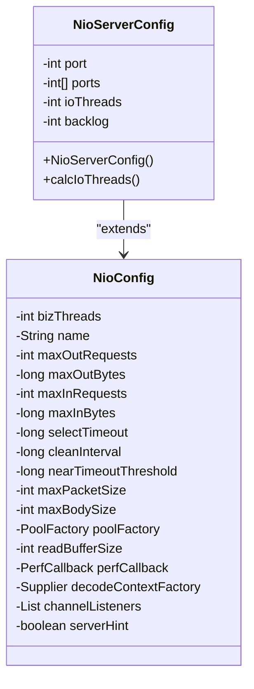
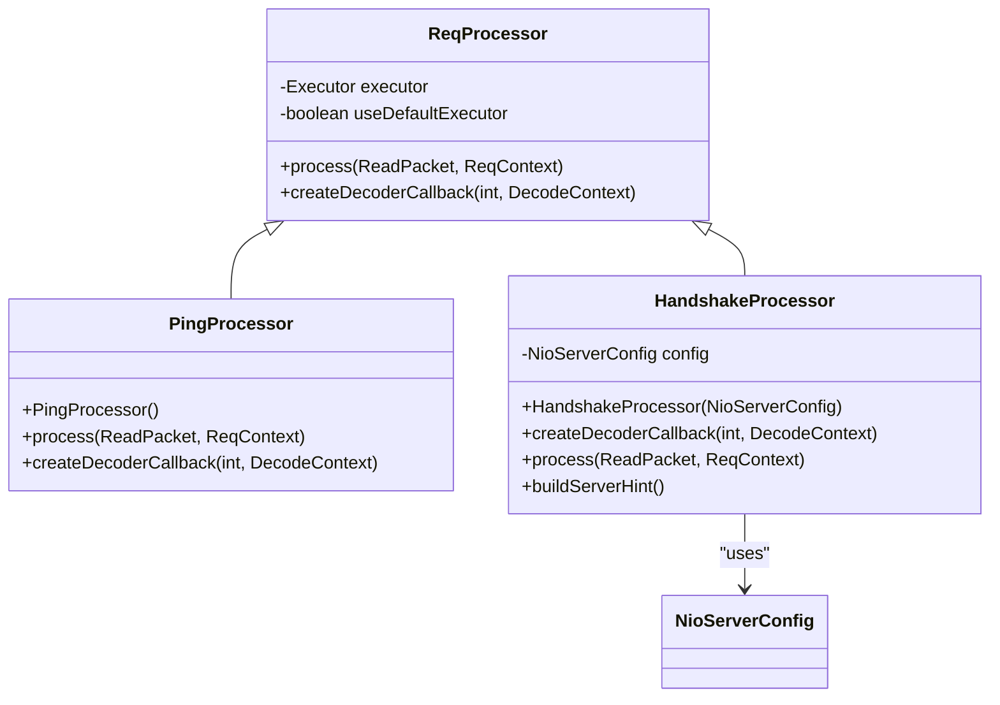
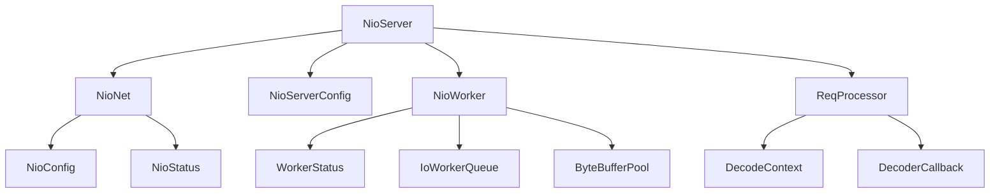

# NIO Server Implementation

<cite>
**Referenced Files in This Document**   
- [NioServer.java](file://client/src/main/java/com/github/dtprj/dongting/net/NioServer.java)
- [NioServerConfig.java](file://client/src/main/java/com/github/dtprj/dongting/net/NioServerConfig.java)
- [NioWorker.java](file://client/src/main/java/com/github/dtprj/dongting/net/NioWorker.java)
- [NioNet.java](file://client/src/main/java/com/github/dtprj/dongting/net/NioNet.java)
- [ReqProcessor.java](file://client/src/main/java/com/github/dtprj/dongting/net/ReqProcessor.java)
- [HandshakeProcessor.java](file://client/src/main/java/com/github/dtprj/dongting/net/HandshakeProcessor.java)
- [DtChannelImpl.java](file://client/src/main/java/com/github/dtprj/dongting/net/DtChannelImpl.java)
- [NioConfig.java](file://client/src/main/java/com/github/dtprj/dongting/net/NioConfig.java)
</cite>

## Table of Contents
1. [Introduction](#introduction)
2. [Project Structure](#project-structure)
3. [Core Components](#core-components)
4. [Architecture Overview](#architecture-overview)
5. [Detailed Component Analysis](#detailed-component-analysis)
6. [Dependency Analysis](#dependency-analysis)
7. [Performance Considerations](#performance-considerations)
8. [Troubleshooting Guide](#troubleshooting-guide)
9. [Conclusion](#conclusion)

## Introduction
The Dongting NIO server implementation provides a high-performance, multi-threaded network server built on Java NIO. This documentation details the architecture, configuration, and operational aspects of the NIO server, focusing on its efficient handling of concurrent connections through a dedicated accept thread and multiple NioWorker threads for I/O operations. The server is designed for high-concurrency scenarios with robust lifecycle management, connection distribution strategies, and built-in request processing pipelines.

## Project Structure
The NIO server implementation is located in the client module of the Dongting project, specifically within the `com.github.dtprj.dongting.net` package. The core components include the NioServer class for server management, NioWorker threads for handling I/O operations, and supporting classes for configuration, connection management, and request processing.

**Diagram sources**
- [NioServer.java](file://client/src/main/java/com/github/dtprj/dongting/net/NioServer.java)
- [NioWorker.java](file://client/src/main/java/com/github/dtprj/dongting/net/NioWorker.java)
- [NioNet.java](file://client/src/main/java/com/github/dtprj/dongting/net/NioNet.java)

**Section sources**
- [NioServer.java](file://client/src/main/java/com/github/dtprj/dongting/net/NioServer.java)
- [NioServerConfig.java](file://client/src/main/java/com/github/dtprj/dongting/net/NioServerConfig.java)

## Core Components
The Dongting NIO server implementation consists of several core components that work together to provide efficient network I/O handling. The NioServer class manages the server lifecycle and coordinates between the accept thread and worker threads. The NioWorker class handles I/O operations for multiple connections, while the NioServerConfig class provides configuration options for server behavior. The request processing pipeline is managed through ReqProcessor implementations, including the built-in PingProcessor for heartbeat operations.

**Section sources**
- [NioServer.java](file://client/src/main/java/com/github/dtprj/dongting/net/NioServer.java)
- [NioWorker.java](file://client/src/main/java/com/github/dtprj/dongting/net/NioWorker.java)
- [NioServerConfig.java](file://client/src/main/java/com/github/dtprj/dongting/net/NioServerConfig.java)

## Architecture Overview
The Dongting NIO server employs a multi-threaded architecture with a dedicated accept thread and multiple NioWorker threads for handling I/O operations. This design separates connection acceptance from connection processing, allowing the server to efficiently handle a large number of concurrent connections.

**Diagram sources**
- [NioServer.java](file://client/src/main/java/com/github/dtprj/dongting/net/NioServer.java)
- [NioWorker.java](file://client/src/main/java/com/github/dtprj/dongting/net/NioWorker.java)

## Detailed Component Analysis

### NioServer Analysis
The NioServer class implements a multi-threaded server architecture with a dedicated accept thread and multiple NioWorker threads. The server uses ServerSocketChannel and Selector for efficient event handling, with the accept thread responsible for accepting incoming connections and distributing them to worker threads.

**Diagram sources**
- [NioServer.java](file://client/src/main/java/com/github/dtprj/dongting/net/NioServer.java)

**Section sources**
- [NioServer.java](file://client/src/main/java/com/github/dtprj/dongting/net/NioServer.java)

### NioWorker Analysis
The NioWorker class represents a worker thread that handles I/O operations for multiple connections. Each NioWorker maintains its own Selector for monitoring multiple SocketChannels, allowing for efficient multiplexing of I/O operations across many connections.

**Diagram sources**
- [NioWorker.java](file://client/src/main/java/com/github/dtprj/dongting/net/NioWorker.java)

**Section sources**
- [NioWorker.java](file://client/src/main/java/com/github/dtprj/dongting/net/NioWorker.java)

### Configuration Analysis
The NioServerConfig class extends NioConfig to provide server-specific configuration options. The configuration includes settings for port binding, IO thread count, backlog, and various performance-related parameters.

**Diagram sources**
- [NioServerConfig.java](file://client/src/main/java/com/github/dtprj/dongting/net/NioServerConfig.java)
- [NioConfig.java](file://client/src/main/java/com/github/dtprj/dongting/net/NioConfig.java)

**Section sources**
- [NioServerConfig.java](file://client/src/main/java/com/github/dtprj/dongting/net/NioServerConfig.java)
- [NioConfig.java](file://client/src/main/java/com/github/dtprj/dongting/net/NioConfig.java)

### Request Processing Analysis
The request processing pipeline in the Dongting NIO server is managed through the ReqProcessor hierarchy. The server includes built-in processors for ping operations and handshake operations, with the ability to register custom processors for application-specific logic.

**Diagram sources**
- [ReqProcessor.java](file://client/src/main/java/com/github/dtprj/dongting/net/ReqProcessor.java)
- [PingProcessor.java](file://client/src/main/java/com/github/dtprj/dongting/net/NioServer.java#L274-L291)
- [HandshakeProcessor.java](file://client/src/main/java/com/github/dtprj/dongting/net/HandshakeProcessor.java)

**Section sources**
- [ReqProcessor.java](file://client/src/main/java/com/github/dtprj/dongting/net/ReqProcessor.java)
- [NioServer.java](file://client/src/main/java/com/github/dtprj/dongting/net/NioServer.java#L274-L291)
- [HandshakeProcessor.java](file://client/src/main/java/com/github/dtprj/dongting/net/HandshakeProcessor.java)

## Dependency Analysis
The Dongting NIO server implementation has a well-defined dependency structure, with clear separation between server management, I/O processing, and configuration components. The core dependencies include the NioNet base class for common networking functionality, NioStatus for tracking server state, and various utility classes for buffer management and performance monitoring.

**Diagram sources**
- [NioServer.java](file://client/src/main/java/com/github/dtprj/dongting/net/NioServer.java)
- [NioNet.java](file://client/src/main/java/com/github/dtprj/dongting/net/NioNet.java)
- [NioWorker.java](file://client/src/main/java/com/github/dtprj/dongting/net/NioWorker.java)

**Section sources**
- [NioServer.java](file://client/src/main/java/com/github/dtprj/dongting/net/NioServer.java)
- [NioNet.java](file://client/src/main/java/com/github/dtprj/dongting/net/NioNet.java)
- [NioWorker.java](file://client/src/main/java/com/github/dtprj/dongting/net/NioWorker.java)

## Performance Considerations
The Dongting NIO server is designed with performance in mind, incorporating several optimizations for high-concurrency scenarios. The multi-threaded architecture with dedicated accept and worker threads minimizes contention and allows for efficient scaling across multiple CPU cores. The server uses object pooling for ByteBuffer allocation, reducing garbage collection overhead. The configuration options for back pressure (maxOutRequests, maxOutBytes, maxInRequests, maxInBytes) help prevent resource exhaustion under heavy load. The worker thread distribution strategy using SocketChannel.hashCode() ensures even distribution of connections across worker threads, preventing hotspots.

**Section sources**
- [NioServer.java](file://client/src/main/java/com/github/dtprj/dongting/net/NioServer.java)
- [NioWorker.java](file://client/src/main/java/com/github/dtprj/dongting/net/NioWorker.java)
- [NioServerConfig.java](file://client/src/main/java/com/github/dtprj/dongting/net/NioServerConfig.java)

## Troubleshooting Guide
Common issues with the Dongting NIO server typically involve configuration errors, resource limitations, or network problems. Port conflicts can occur if the configured port is already in use by another process. Connection backlog issues may arise if the backlog parameter is too small for the expected connection rate. Thread pool sizing should be carefully configured based on the available CPU cores and expected workload. The server's built-in logging and performance callback mechanisms can help diagnose performance bottlenecks and connection issues. When experiencing high latency, check the selectTimeout and cleanInterval configuration parameters, as inappropriate values can impact server responsiveness.

**Section sources**
- [NioServer.java](file://client/src/main/java/com/github/dtprj/dongting/net/NioServer.java)
- [NioWorker.java](file://client/src/main/java/com/github/dtprj/dongting/net/NioWorker.java)
- [NioServerConfig.java](file://client/src/main/java/com/github/dtprj/dongting/net/NioServerConfig.java)

## Conclusion
The Dongting NIO server implementation provides a robust, high-performance foundation for building scalable network applications. Its multi-threaded architecture with dedicated accept and worker threads enables efficient handling of concurrent connections, while comprehensive configuration options allow for fine-tuning to specific use cases. The server's lifecycle management, connection distribution strategy, and request processing pipeline make it suitable for a wide range of applications, from simple services to complex distributed systems. By understanding the architecture and configuration options detailed in this documentation, developers can effectively utilize the Dongting NIO server to build reliable and performant network applications.