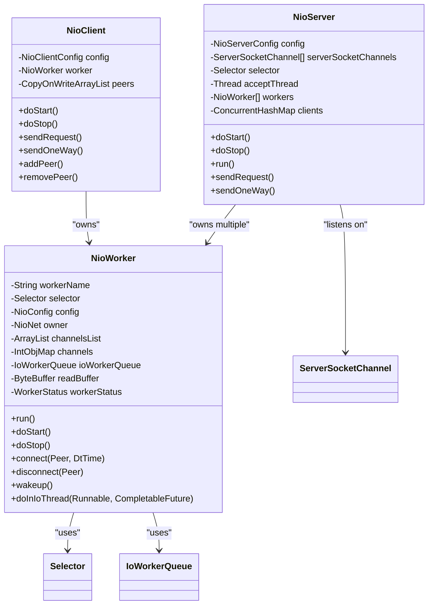
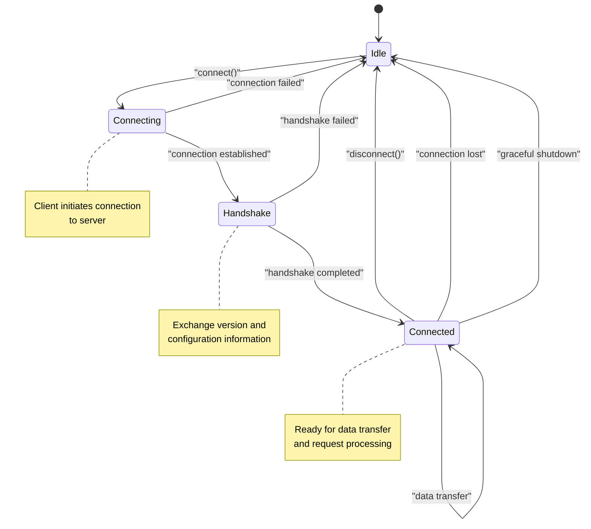
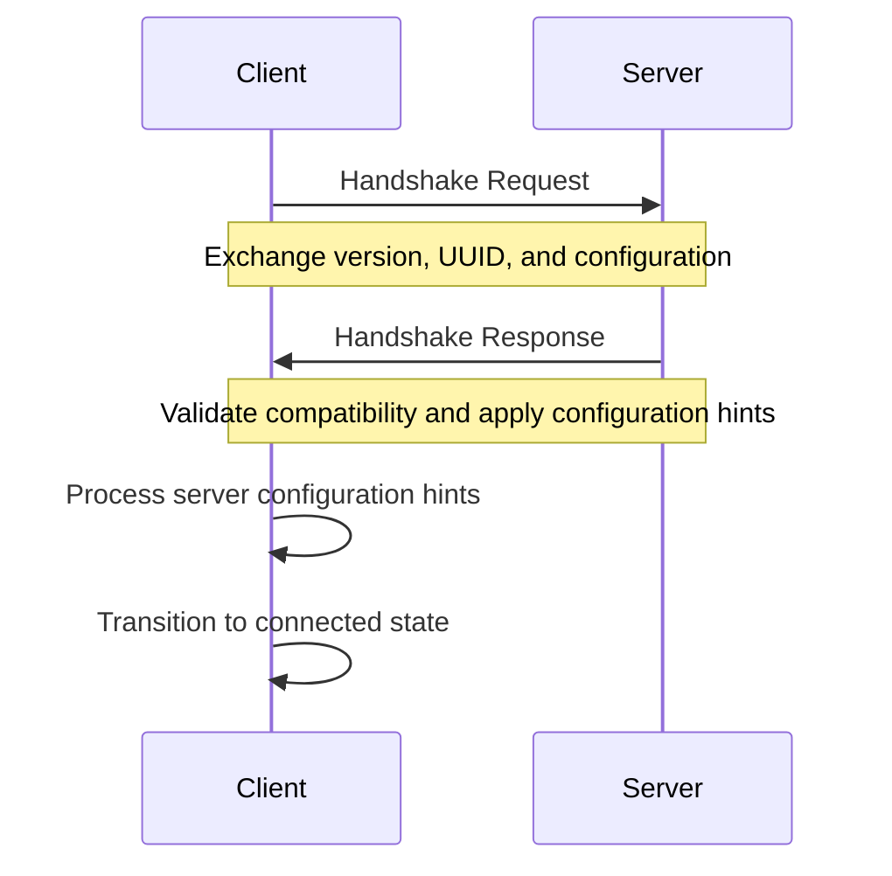
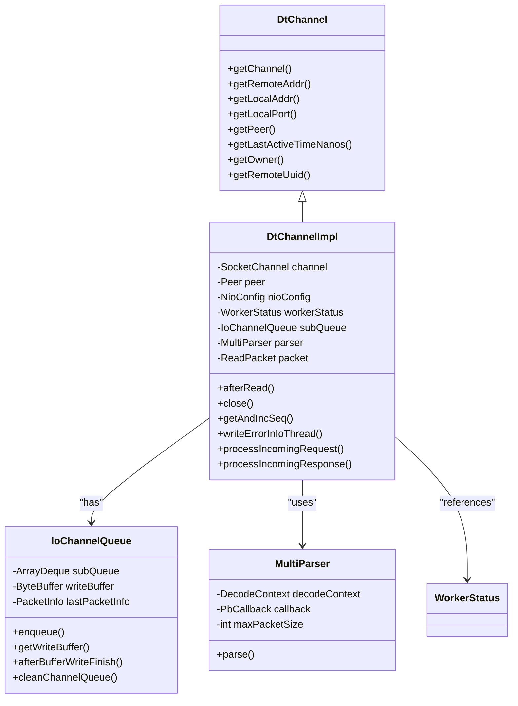
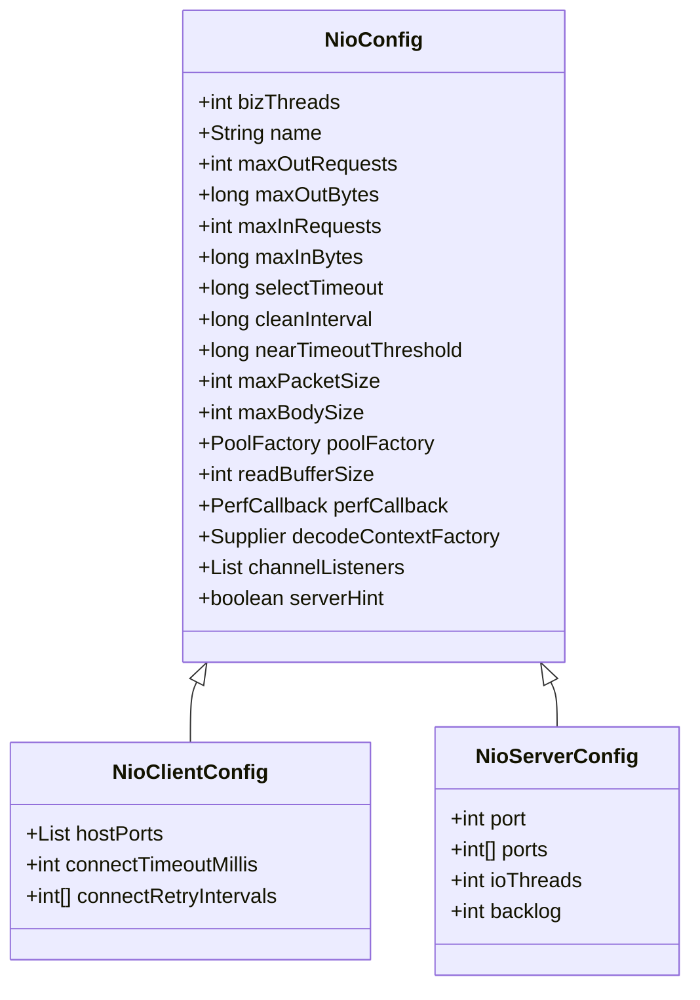
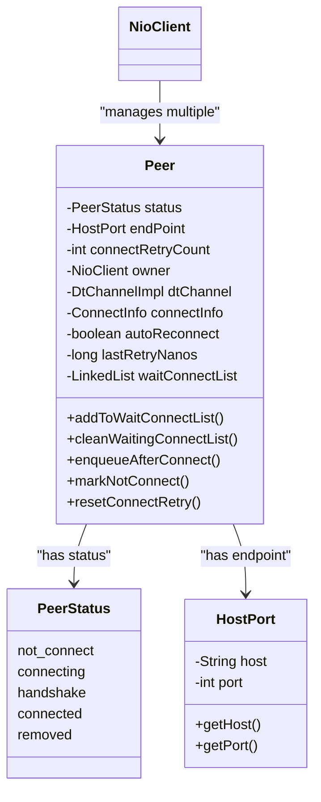
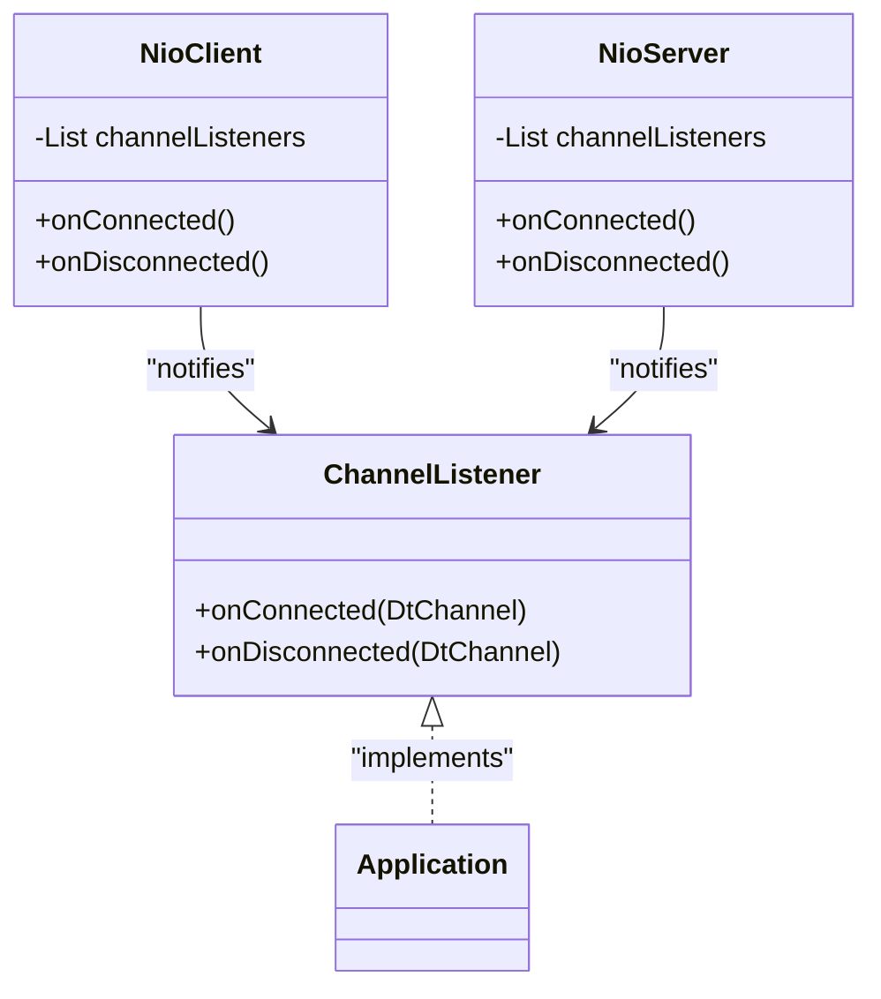
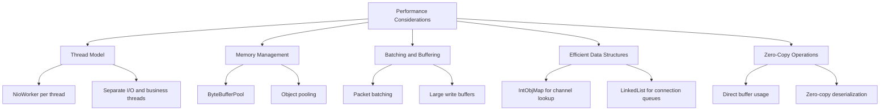
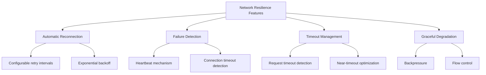

# Network Transport Layer

<cite>
**Referenced Files in This Document**   
- [NioClient.java](file://client/src/main/java/com/github/dtprj/dongting/net/NioClient.java)
- [NioServer.java](file://client/src/main/java/com/github/dtprj/dongting/net/NioServer.java)
- [NioWorker.java](file://client/src/main/java/com/github/dtprj/dongting/net/NioWorker.java)
- [DtChannel.java](file://client/src/main/java/com/github/dtprj/dongting/net/DtChannel.java)
- [DtChannelImpl.java](file://client/src/main/java/com/github/dtprj/dongting/net/DtChannelImpl.java)
- [NioClientConfig.java](file://client/src/main/java/com/github/dtprj/dongting/net/NioClientConfig.java)
- [NioServerConfig.java](file://client/src/main/java/com/github/dtprj/dongting/net/NioServerConfig.java)
- [NioConfig.java](file://client/src/main/java/com/github/dtprj/dongting/net/NioConfig.java)
- [Peer.java](file://client/src/main/java/com/github/dtprj/dongting/net/Peer.java)
- [ChannelListener.java](file://client/src/main/java/com/github/dtprj/dongting/net/ChannelListener.java)
- [IoWorkerQueue.java](file://client/src/main/java/com/github/dtprj/dongting/net/IoWorkerQueue.java)
- [IoChannelQueue.java](file://client/src/main/java/com/github/dtprj/dongting/net/IoChannelQueue.java)
- [WorkerStatus.java](file://client/src/main/java/com/github/dtprj/dongting/net/WorkerStatus.java)
- [HandshakeBody.java](file://client/src/main/java/com/github/dtprj/dongting/net/HandshakeBody.java)
- [NioStatus.java](file://client/src/main/java/com/github/dtprj/dongting/net/NioStatus.java)
</cite>

## Table of Contents
1. [Introduction](#introduction)
2. [Architecture Overview](#architecture-overview)
3. [Event-Driven Architecture](#event-driven-architecture)
4. [Connection Lifecycle Management](#connection-lifecycle-management)
5. [Channel Abstraction](#channel-abstraction)
6. [Configuration Options](#configuration-options)
7. [Peer Management System](#peer-management-system)
8. [Event Listener Pattern](#event-listener-pattern)
9. [Performance Considerations](#performance-considerations)
10. [Network Resilience Features](#network-resilience-features)
11. [Conclusion](#conclusion)

## Introduction

The Dongting NIO-based transport layer provides a high-performance, event-driven networking framework for distributed systems. This documentation details the architecture and implementation of the transport layer, focusing on the NioClient and NioServer implementations that utilize dedicated NioWorker threads for non-blocking I/O operations. The system is designed for high-concurrency scenarios with features for connection lifecycle management, automatic reconnection, and failure detection.

The transport layer implements a sophisticated event-driven architecture that leverages Java NIO for efficient handling of network operations. It provides abstractions for network communication state through the DtChannel interface and supports configurable transport parameters for optimizing performance in various deployment scenarios.

**Section sources**
- [NioClient.java](file://client/src/main/java/com/github/dtprj/dongting/net/NioClient.java#L1-L363)
- [NioServer.java](file://client/src/main/java/com/github/dtprj/dongting/net/NioServer.java#L1-L293)

## Architecture Overview

The Dongting transport layer follows a multi-threaded event-driven architecture with clear separation between I/O operations and business logic processing. The architecture consists of several key components that work together to provide efficient network communication:

```mermaid
graph TD
subgraph "Client"
NioClient[NioClient]
NioWorkerClient[NioWorker]
DtChannelClient[DtChannelImpl]
end
subgraph "Server"
NioServer[NioServer]
NioWorkerServer[NioWorker]
DtChannelServer[DtChannelImpl]
end
NioClient --> NioWorkerClient
NioWorkerClient --> DtChannelClient
NioServer --> NioWorkerServer
NioWorkerServer --> DtChannelServer
NioClient < --> NioServer
NioWorkerClient < --> IoWorkerQueueClient[IoWorkerQueue]
NioWorkerServer < --> IoWorkerQueueServer[IoWorkerQueue]
DtChannelClient < --> IoChannelQueueClient[IoChannelQueue]
DtChannelServer < --> IoChannelQueueServer[IoChannelQueue]
NioClient < --> Peer[Peer]
NioServer < --> Clients[ConcurrentHashMap<UUID, DtChannel>]
```

**Diagram sources**
- [NioClient.java](file://client/src/main/java/com/github/dtprj/dongting/net/NioClient.java#L41-L363)
- [NioServer.java](file://client/src/main/java/com/github/dtprj/dongting/net/NioServer.java#L49-L293)
- [NioWorker.java](file://client/src/main/java/com/github/dtprj/dongting/net/NioWorker.java#L55-L809)
- [DtChannel.java](file://client/src/main/java/com/github/dtprj/dongting/net/DtChannel.java#L25-L49)
- [DtChannelImpl.java](file://client/src/main/java/com/github/dtprj/dongting/net/DtChannelImpl.java#L41-L506)

## Event-Driven Architecture

The Dongting transport layer implements an event-driven architecture using Java NIO's Selector mechanism to efficiently handle multiple concurrent connections. The core of this architecture is the NioWorker class, which represents a dedicated thread responsible for non-blocking I/O operations.



**Diagram sources**
- [NioWorker.java](file://client/src/main/java/com/github/dtprj/dongting/net/NioWorker.java#L55-L809)
- [NioClient.java](file://client/src/main/java/com/github/dtprj/dongting/net/NioClient.java#L41-L363)
- [NioServer.java](file://client/src/main/java/com/github/dtprj/dongting/net/NioServer.java#L49-L293)

The NioWorker class implements the Runnable interface and contains the main event loop that processes I/O events. Each NioWorker maintains its own Selector instance to monitor multiple SocketChannel objects for readiness events (connect, accept, read, write). The event loop follows this pattern:

1. Select ready I/O events using Selector.select()
2. Dispatch actions from the IoWorkerQueue
3. Process each selected key (I/O event)
4. Perform periodic cleanup operations

The architecture separates I/O operations from business logic processing by using dedicated thread pools. The NioWorker handles all network I/O in its dedicated thread, while business logic is executed in a separate business executor thread pool, preventing blocking operations from affecting network performance.

**Section sources**
- [NioWorker.java](file://client/src/main/java/com/github/dtprj/dongting/net/NioWorker.java#L55-L809)
- [NioClient.java](file://client/src/main/java/com/github/dtprj/dongting/net/NioClient.java#L41-L363)
- [NioServer.java](file://client/src/main/java/com/github/dtprj/dongting/net/NioServer.java#L49-L293)

## Connection Lifecycle Management

The Dongting transport layer provides comprehensive connection lifecycle management, handling connection establishment, handshake protocol, and graceful shutdown procedures. The lifecycle is managed through a state machine that tracks the connection status and ensures proper transitions between states.



**Diagram sources**
- [NioWorker.java](file://client/src/main/java/com/github/dtprj/dongting/net/NioWorker.java#L454-L521)
- [NioClient.java](file://client/src/main/java/com/github/dtprj/dongting/net/NioClient.java#L77-L84)
- [NioServer.java](file://client/src/main/java/com/github/dtprj/dongting/net/NioServer.java#L102-L117)

### Connection Establishment

Connection establishment begins when a client initiates a connection to a server. The NioClient uses the connect() method to establish connections to one or more server endpoints specified in the configuration. The process involves:

1. Creating a SocketChannel in non-blocking mode
2. Registering the channel with the Selector for OP_CONNECT events
3. Initiating the connection to the server endpoint
4. Waiting for the connection to be established

The NioWorker manages the connection process through its event loop, which detects when the connection is ready and completes the connection setup. During this phase, the connection status transitions from "not_connect" to "connecting".

### Handshake Protocol

After a connection is established, a handshake protocol is executed to exchange configuration and version information between client and server. The handshake process ensures compatibility and optimizes communication parameters:



**Diagram sources**
- [NioWorker.java](file://client/src/main/java/com/github/dtprj/dongting/net/NioWorker.java#L564-L624)
- [HandshakeBody.java](file://client/src/main/java/com/github/dtprj/dongting/net/HandshakeBody.java#L28-L111)

The handshake protocol serves several purposes:
- Version compatibility checking between client and server
- Exchange of unique identifiers (UUID) for connection tracking
- Configuration negotiation and optimization
- Security verification through magic numbers

The HandshakeBody class contains the data structure for the handshake message, including version information, process identifiers, and configuration parameters. Both client and server validate the handshake response to ensure compatibility before proceeding with normal operations.

### Graceful Shutdown Procedures

The transport layer implements graceful shutdown procedures to ensure clean termination of connections and proper resource cleanup. The shutdown process differs slightly between clients and servers but follows a similar pattern:

For clients:
1. Initiate pre-stop procedures to drain pending requests
2. Stop the worker thread and wait for completion
3. Shutdown the business executor
4. Clean up resources and connection state

For servers:
1. Stop accepting new connections
2. Prepare workers for shutdown and wait for pending operations
3. Stop worker threads and wait for completion
4. Shutdown business executor
5. Clean up resources and connection state

The doStop() methods in both NioClient and NioServer implement these procedures with timeout handling to prevent indefinite blocking during shutdown.

**Section sources**
- [NioClient.java](file://client/src/main/java/com/github/dtprj/dongting/net/NioClient.java#L177-L210)
- [NioServer.java](file://client/src/main/java/com/github/dtprj/dongting/net/NioServer.java#L169-L213)
- [NioWorker.java](file://client/src/main/java/com/github/dtprj/dongting/net/NioWorker.java#L799-L830)

## Channel Abstraction

The DtChannel interface provides a high-level abstraction for network communication state, encapsulating the underlying SocketChannel and providing a consistent API for network operations. This abstraction decouples the application logic from the low-level networking details and enables features like connection pooling and transparent reconnection.



**Diagram sources**
- [DtChannel.java](file://client/src/main/java/com/github/dtprj/dongting/net/DtChannel.java#L25-L49)
- [DtChannelImpl.java](file://client/src/main/java/com/github/dtprj/dongting/net/DtChannelImpl.java#L41-L506)
- [IoChannelQueue.java](file://client/src/main/java/com/github/dtprj/dongting/net/IoChannelQueue.java#L37-L258)
- [MultiParser.java](file://client/src/main/java/com/github/dtprj/dongting/net/MultiParser.java#L1-L100)

The DtChannelImpl class implements the DtChannel interface and provides the concrete implementation of the channel abstraction. It maintains several key pieces of state:

- **Connection State**: Tracks whether the connection is open, closed, or in the process of handshake
- **Sequence Numbers**: Manages sequence numbers for request-response correlation
- **Pending Requests**: Maintains a queue of requests awaiting responses
- **I/O Buffers**: Manages read and write buffers for efficient data transfer
- **Parser State**: Maintains state for parsing incoming data streams

The channel abstraction enables several important features:

1. **Request-Response Correlation**: The sequence number system allows matching responses to their corresponding requests, even when multiple requests are in flight simultaneously.

2. **Flow Control**: The channel tracks pending requests and bytes to implement backpressure and prevent overwhelming the remote endpoint.

3. **Error Handling**: The abstraction provides consistent error handling for network failures, timeouts, and protocol violations.

4. **Resource Management**: The channel manages the lifecycle of underlying resources, ensuring proper cleanup when connections are closed.

The IoChannelQueue class plays a crucial role in the channel implementation, managing the outbound message queue and handling the encoding and transmission of packets. It implements a sophisticated queuing system that batches multiple packets into larger write operations for improved efficiency.

**Section sources**
- [DtChannel.java](file://client/src/main/java/com/github/dtprj/dongting/net/DtChannel.java#L25-L49)
- [DtChannelImpl.java](file://client/src/main/java/com/github/dtprj/dongting/net/DtChannelImpl.java#L41-L506)
- [IoChannelQueue.java](file://client/src/main/java/com/github/dtprj/dongting/net/IoChannelQueue.java#L37-L258)

## Configuration Options

The Dongting transport layer provides extensive configuration options for tuning transport parameters to optimize performance for specific use cases. These options are exposed through the NioConfig class and its subclasses, allowing fine-grained control over buffer sizes, timeout settings, and worker thread management.



**Diagram sources**
- [NioConfig.java](file://client/src/main/java/com/github/dtprj/dongting/net/NioConfig.java#L31-L60)
- [NioClientConfig.java](file://client/src/main/java/com/github/dtprj/dongting/net/NioClientConfig.java#L23-L44)
- [NioServerConfig.java](file://client/src/main/java/com/github/dtprj/dongting/net/NioServerConfig.java#L21-L67)

### Buffer Sizes

The transport layer provides several configuration options for controlling buffer sizes:

- **readBufferSize**: Size of the direct memory buffer used for reading data from the network (default: 128KB)
- **maxPacketSize**: Maximum size of a single packet including headers (default: 5MB)
- **maxBodySize**: Maximum size of the packet body (default: 4MB)

These buffer settings can be tuned based on the expected message sizes and available system memory. Larger buffers can improve throughput for large messages but consume more memory.

### Timeout Settings

The transport layer includes several timeout configurations:

- **connectTimeoutMillis**: Timeout for establishing connections (NioClientConfig, default: 3000ms)
- **selectTimeout**: Timeout for the Selector.select() operation (NioConfig, default: 50ms)
- **nearTimeoutThreshold**: Threshold for detecting requests that are near timeout (NioConfig, default: 850ms)

These timeouts help prevent indefinite blocking and enable timely detection of network issues.

### Worker Thread Management

The threading model is configurable through several parameters:

- **bizThreads**: Number of threads in the business executor pool
- **ioThreads**: Number of NioWorker threads (NioServerConfig)
- **cleanInterval**: Interval for periodic cleanup operations (default: 100ms)

The default values are calculated based on the number of available processors, with client using 4-8 threads and server using 6-16 threads.

### Backpressure Configuration

The transport layer implements backpressure to prevent overwhelming endpoints:

- **maxOutRequests**: Maximum number of outgoing requests per connection
- **maxOutBytes**: Maximum number of bytes in outgoing requests
- **maxInRequests**: Maximum number of incoming requests
- **maxInBytes**: Maximum number of bytes in incoming requests

These limits help maintain system stability under high load by preventing memory exhaustion.

**Section sources**
- [NioConfig.java](file://client/src/main/java/com/github/dtprj/dongting/net/NioConfig.java#L31-L60)
- [NioClientConfig.java](file://client/src/main/java/com/github/dtprj/dongting/net/NioClientConfig.java#L23-L44)
- [NioServerConfig.java](file://client/src/main/java/com/github/dtprj/dongting/net/NioServerConfig.java#L21-L67)

## Peer Management System

The peer management system in Dongting's transport layer handles client-server connections and provides mechanisms for connection tracking, automatic reconnection, and load balancing. The system is centered around the Peer class, which represents a connection endpoint and manages its state throughout the connection lifecycle.



**Diagram sources**
- [Peer.java](file://client/src/main/java/com/github/dtprj/dongting/net/Peer.java#L29-L132)
- [PeerStatus.java](file://client/src/main/java/com/github/dtprj/dongting/net/PeerStatus.java#L21-L24)
- [HostPort.java](file://client/src/main/java/com/github/dtprj/dongting/net/HostPort.java#L24-L66)

The Peer class maintains several important pieces of state:

- **Connection Status**: Tracks the current state of the connection through the PeerStatus enum
- **Retry State**: Manages connection retry attempts and backoff intervals
- **Pending Operations**: Queues operations that need to be performed after connection establishment
- **Connection References**: Maintains references to the active DtChannel and connection information

The peer management system supports several key operations:

1. **Connection Management**: The NioClient maintains a list of peers and can add or remove peers dynamically using addPeer() and removePeer() methods.

2. **Automatic Reconnection**: When a connection is lost, the system automatically attempts to reconnect based on the configured retry intervals.

3. **Request Queuing**: Operations attempted while a connection is being established are queued and processed once the connection is ready.

4. **Load Balancing**: When multiple peers are configured, requests can be distributed across available connections.

The system implements a sophisticated retry mechanism that uses exponential backoff to prevent overwhelming the server during outages. The connectRetryIntervals array in NioClientConfig specifies the delay between retry attempts, allowing customization of the reconnection strategy.

**Section sources**
- [Peer.java](file://client/src/main/java/com/github/dtprj/dongting/net/Peer.java#L29-L132)
- [NioClient.java](file://client/src/main/java/com/github/dtprj/dongting/net/NioClient.java#L49-L72)
- [HostPort.java](file://client/src/main/java/com/github/dtprj/dongting/net/HostPort.java#L24-L66)

## Event Listener Pattern

The Dongting transport layer implements an event listener pattern to notify applications of connection status changes and other significant events. This pattern is implemented through the ChannelListener interface, which provides callback methods for connection lifecycle events.



**Diagram sources**
- [ChannelListener.java](file://client/src/main/java/com/github/dtprj/dongting/net/ChannelListener.java#L21-L27)
- [NioClient.java](file://client/src/main/java/com/github/dtprj/dongting/net/NioClient.java#L41-L363)
- [NioServer.java](file://client/src/main/java/com/github/dtprj/dongting/net/NioServer.java#L49-L293)

The event listener pattern enables applications to react to connection events without polling or busy waiting. Key features include:

1. **Connection Notifications**: Applications receive callbacks when connections are established or terminated, allowing them to update their state accordingly.

2. **Error Handling**: The pattern provides a mechanism for handling connection failures and implementing recovery strategies.

3. **Resource Management**: Applications can use the callbacks to release resources associated with connections or initiate cleanup procedures.

4. **Monitoring and Logging**: The events can be used for monitoring connection health and logging connection activity.

The NioClient and NioServer classes maintain a list of registered listeners and invoke the appropriate callback methods when connection events occur. The listeners are notified on the I/O worker thread, so they should perform minimal work to avoid blocking network operations.

**Section sources**
- [ChannelListener.java](file://client/src/main/java/com/github/dtprj/dongting/net/ChannelListener.java#L21-L27)
- [NioClient.java](file://client/src/main/java/com/github/dtprj/dongting/net/NioClient.java#L87-L107)
- [NioServer.java](file://client/src/main/java/com/github/dtprj/dongting/net/NioServer.java#L154-L159)

## Performance Considerations

The Dongting transport layer is designed for high-concurrency scenarios with several performance optimizations to handle large numbers of concurrent connections efficiently. The architecture incorporates several key performance features:



**Diagram sources**
- [NioWorker.java](file://client/src/main/java/com/github/dtprj/dongting/net/NioWorker.java#L55-L809)
- [ByteBufferPool.java](file://client/src/main/java/com/github/dtprj/dongting/buf/ByteBufferPool.java#L1-L100)
- [IntObjMap.java](file://client/src/main/java/com/github/dtprj/dongting/common/IntObjMap.java#L1-L100)

### Thread Model

The transport layer uses a dedicated thread per NioWorker to handle I/O operations, eliminating the need for synchronization in the critical I/O path. This single-threaded event loop model ensures that all operations on a particular worker are serialized, preventing race conditions and reducing the need for locking.

The separation of I/O and business logic into different thread pools allows the system to handle blocking operations in business logic without affecting network performance. The business executor can be configured with an appropriate number of threads based on the workload characteristics.

### Memory Management

The transport layer implements sophisticated memory management to reduce garbage collection pressure and improve performance:

- **ByteBufferPool**: Object pooling for direct and heap ByteBuffers to reduce allocation overhead
- **TwoLevelPool**: Two-level pooling strategy that combines thread-local and shared pools
- **Reference Counting**: For managing the lifecycle of buffer objects across threads

The pooling system significantly reduces the frequency of garbage collection by reusing buffer objects, which is particularly important in high-throughput scenarios.

### Batching and Buffering

The transport layer employs several batching and buffering techniques to improve efficiency:

- **Packet Batching**: Multiple small packets are combined into larger write operations to reduce system call overhead
- **Large Write Buffers**: Configurable write buffer sizes (up to 256KB) to minimize the number of write operations
- **Read Buffer Reuse**: The same read buffer is reused for multiple read operations to reduce allocation

These techniques reduce the number of system calls and improve network utilization by sending larger data chunks.

### Efficient Data Structures

The implementation uses specialized data structures optimized for the specific use cases:

- **IntObjMap**: Custom map implementation for fast integer-keyed lookups, used for channel indexing
- **MpscLinkedQueue**: Multi-producer single-consumer queue for efficient cross-thread communication
- **ArrayDeque**: For the per-channel packet queue, providing efficient insertion and removal

These data structures are chosen for their performance characteristics in the specific contexts where they are used.

**Section sources**
- [NioWorker.java](file://client/src/main/java/com/github/dtprj/dongting/net/NioWorker.java#L118-L125)
- [ByteBufferPool.java](file://client/src/main/java/com/github/dtprj/dongting/buf/ByteBufferPool.java#L1-L100)
- [IntObjMap.java](file://client/src/main/java/com/github/dtprj/dongting/common/IntObjMap.java#L1-L100)
- [MpscLinkedQueue.java](file://client/src/main/java/com/github/dtprj/dongting/queue/MpscLinkedQueue.java#L1-L100)

## Network Resilience Features

The Dongting transport layer includes several features designed to enhance network resilience and maintain connectivity in the face of network issues and server failures. These features ensure reliable communication even in unstable network conditions.



**Diagram sources**
- [NioWorker.java](file://client/src/main/java/com/github/dtprj/dongting/net/NioWorker.java#L760-L775)
- [Peer.java](file://client/src/main/java/com/github/dtprj/dongting/net/Peer.java#L94-L118)
- [WorkerStatus.java](file://client/src/main/java/com/github/dtprj/dongting/net/WorkerStatus.java#L96-L107)

### Automatic Reconnection

The transport layer implements automatic reconnection to maintain connectivity when network issues occur. When a connection is lost, the system automatically attempts to reconnect using a configurable retry strategy:

- **Retry Intervals**: Configurable array of retry delays that implement exponential backoff
- **Retry Count**: Tracks the number of consecutive failed attempts
- **Backoff Reset**: Reset retry count when a successful connection is established

The automatic reconnection feature ensures that transient network issues do not result in permanent connection loss, improving overall system reliability.

### Failure Detection

The system includes several mechanisms for detecting connection failures:

- **Network-Level Detection**: Uses TCP keep-alive and connection reset detection
- **Application-Level Detection**: Heartbeat messages to verify endpoint responsiveness
- **Timeout-Based Detection**: Monitors for lack of activity within expected timeframes

The failure detection system quickly identifies disconnected or unresponsive endpoints, allowing the system to initiate recovery procedures promptly.

### Timeout Management

Comprehensive timeout management prevents operations from hanging indefinitely:

- **Connection Timeout**: Limits the time spent establishing connections
- **Request Timeout**: Limits the time spent waiting for responses
- **Idle Timeout**: Detects inactive connections that may have been silently dropped

The timeout system includes a "near timeout" optimization that proactively handles requests that are approaching their timeout limit, improving responsiveness.

### Graceful Degradation

The transport layer implements graceful degradation under stress conditions:

- **Backpressure**: Limits the number of pending requests and bytes to prevent memory exhaustion
- **Flow Control**: Adjusts transmission rates based on receiver capacity
- **Resource Prioritization**: Prioritizes critical operations during resource constraints

These features ensure that the system remains stable and responsive even under heavy load or resource constraints.

**Section sources**
- [NioWorker.java](file://client/src/main/java/com/github/dtprj/dongting/net/NioWorker.java#L760-L775)
- [Peer.java](file://client/src/main/java/com/github/dtprj/dongting/net/Peer.java#L94-L118)
- [WorkerStatus.java](file://client/src/main/java/com/github/dtprj/dongting/net/WorkerStatus.java#L96-L107)

## Conclusion

The Dongting NIO-based transport layer provides a robust, high-performance networking framework for distributed systems. Its event-driven architecture, built around NioClient and NioServer implementations with dedicated NioWorker threads, enables efficient handling of non-blocking I/O operations for high-concurrency scenarios.

The transport layer's comprehensive connection lifecycle management, from establishment through handshake to graceful shutdown, ensures reliable communication between endpoints. The DtChannel abstraction effectively encapsulates network communication state, providing a clean interface for application developers while handling the complexities of network operations.

Configuration options for buffer sizes, timeout settings, and worker thread management allow fine-tuning of the transport layer for specific use cases and performance requirements. The peer management system and event listener pattern provide flexible mechanisms for handling client-server connections and responding to connection status changes.

Performance considerations are addressed through efficient thread management, memory pooling, and optimized data structures, making the transport layer suitable for demanding high-throughput applications. Network resilience features like automatic reconnection and failure detection enhance reliability in unstable network conditions.

Overall, the Dongting transport layer represents a sophisticated networking solution that balances performance, reliability, and flexibility, making it well-suited for modern distributed systems.