# Network and RPC Framework

<cite>
**Referenced Files in This Document**   
- [NioClient.java](file://client/src/main/java/com/github/dtprj/dongting/net/NioClient.java)
- [NioServer.java](file://client/src/main/java/com/github/dtprj/dongting/net/NioServer.java)
- [Packet.java](file://client/src/main/java/com/github/dtprj/dongting/net/Packet.java)
- [Commands.java](file://client/src/main/java/com/github/dtprj/dongting/net/Commands.java)
- [CmdCodes.java](file://client/src/main/java/com/github/dtprj/dongting/net/CmdCodes.java)
- [EncodeUtil.java](file://client/src/main/java/com/github/dtprj/dongting/codec/EncodeUtil.java)
- [WritePacket.java](file://client/src/main/java/com/github/dtprj/dongting/net/WritePacket.java)
- [ReadPacket.java](file://client/src/main/java/com/github/dtprj/dongting/net/ReadPacket.java)
- [NioClientConfig.java](file://client/src/main/java/com/github/dtprj/dongting/net/NioClientConfig.java)
- [NioServerConfig.java](file://client/src/main/java/com/github/dtprj/dongting/net/NioServerConfig.java)
- [NioWorker.java](file://client/src/main/java/com/github/dtprj/dongting/net/NioWorker.java)
- [DtChannel.java](file://client/src/main/java/com/github/dtprj/dongting/net/DtChannel.java)
- [ReqProcessor.java](file://client/src/main/java/com/github/dtprj/dongting/net/ReqProcessor.java)
- [HandshakeProcessor.java](file://client/src/main/java/com/github/dtprj/dongting/net/HandshakeProcessor.java)
- [RpcCallback.java](file://client/src/main/java/com/github/dtprj/dongting/net/RpcCallback.java)
</cite>

## Table of Contents
1. [Introduction](#introduction)
2. [Architecture Overview](#architecture-overview)
3. [NIO Transport Layer](#nio-transport-layer)
4. [Packet Structure and Encoding](#packet-structure-and-encoding)
5. [Request/Response Processing Pipeline](#requestresponse-processing-pipeline)
6. [Connection Management](#connection-management)
7. [Codec Framework](#codec-framework)
8. [Configuration Options](#configuration-options)
9. [Error Handling](#error-handling)
10. [Client-Server Interaction Model](#client-server-interaction-model)
11. [Performance Considerations](#performance-considerations)
12. [Security and Network Resilience](#security-and-network-resilience)

## Introduction
The Dongting framework provides a low-level RPC and network communication system built on Java NIO for high-performance distributed applications. This documentation details the core components of the network layer, including the NIO-based transport, packet encoding/decoding mechanisms, command routing, and connection management. The framework supports both client and server implementations with configurable threading models, flow control, and resilience features for building robust distributed systems.

## Architecture Overview

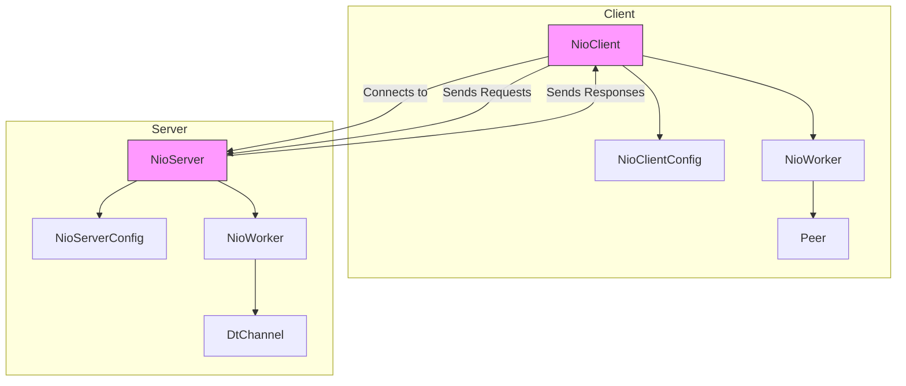

**Diagram sources**
- [NioClient.java](file://client/src/main/java/com/github/dtprj/dongting/net/NioClient.java#L41-L363)
- [NioServer.java](file://client/src/main/java/com/github/dtprj/dongting/net/NioServer.java#L49-L293)

**Section sources**
- [NioClient.java](file://client/src/main/java/com/github/dtprj/dongting/net/NioClient.java#L41-L363)
- [NioServer.java](file://client/src/main/java/com/github/dtprj/dongting/net/NioServer.java#L49-L293)

## NIO Transport Layer

The Dongting framework implements a non-blocking I/O transport layer using Java NIO for efficient network communication. The core components are `NioClient` and `NioServer`, which handle client-server communication through NIO selectors and channels.

The `NioClient` manages outbound connections to one or more server endpoints, while the `NioServer` listens for incoming connections on specified ports. Both components use a worker thread model where each `NioWorker` instance runs in its own thread and manages a selector for handling I/O operations.

Key features of the NIO transport layer include:
- Multi-threaded I/O processing with configurable worker threads
- Non-blocking socket operations using selectors
- Connection pooling and management
- Efficient byte buffer management with object pooling
- Support for multiple concurrent connections

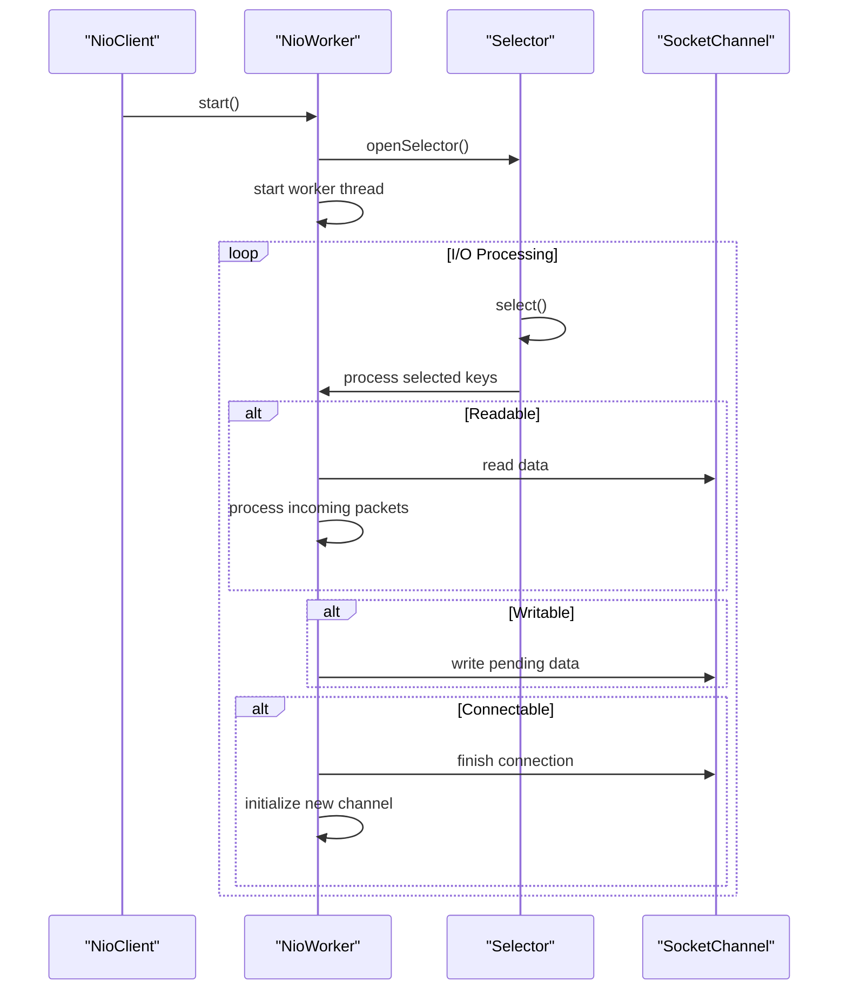

**Diagram sources**
- [NioWorker.java](file://client/src/main/java/com/github/dtprj/dongting/net/NioWorker.java#L55-L809)
- [NioClient.java](file://client/src/main/java/com/github/dtprj/dongting/net/NioClient.java#L41-L363)

**Section sources**
- [NioWorker.java](file://client/src/main/java/com/github/dtprj/dongting/net/NioWorker.java#L55-L809)
- [NioClient.java](file://client/src/main/java/com/github/dtprj/dongting/net/NioClient.java#L41-L363)

## Packet Structure and Encoding

The Dongting framework uses a structured packet format for network communication, with a well-defined header and body structure. The packet format is designed for efficient encoding and decoding using Protocol Buffers (protobuf) wire format.

### Packet Structure
The packet structure consists of a header with metadata fields followed by an optional body:

```mermaid
flowchart TD
A[Total Length (4 bytes)] --> B[Packet Type (1-5 bytes)]
B --> C[Command (1-5 bytes)]
C --> D[Sequence Number (4 bytes)]
D --> E[Response Code (1-5 bytes)]
E --> F[Biz Code (1-5 bytes)]
F --> G[Response Message (length-prefixed)]
G --> H[Timeout (8 bytes)]
H --> I[Extra Data (length-prefixed)]
I --> J[Body (length-prefixed)]
```

The packet header fields are defined in the `Packet` class with the following indices:
- IDX_TYPE = 1: Packet type (request, response, one-way)
- IDX_COMMAND = 2: Command code for routing
- IDX_SEQ = 3: Sequence number for request-response correlation
- IDX_RESP_CODE = 4: Response status code
- IDX_BIZ_CODE = 5: Business-specific error code
- IDX_MSG = 6: Response message
- IDX_TIMEOUT = 7: Request timeout in milliseconds
- IDX_EXTRA = 8: Additional metadata
- IDX_BODY = 15: Main payload body

**Diagram sources**
- [Packet.java](file://client/src/main/java/com/github/dtprj/dongting/net/Packet.java#L28-L36)
- [WritePacket.java](file://client/src/main/java/com/github/dtprj/dongting/net/WritePacket.java#L57-L182)

**Section sources**
- [Packet.java](file://client/src/main/java/com/github/dtprj/dongting/net/Packet.java#L28-L36)
- [WritePacket.java](file://client/src/main/java/com/github/dtprj/dongting/net/WritePacket.java#L57-L182)

## Request/Response Processing Pipeline

The request/response processing pipeline handles the complete lifecycle of RPC calls from encoding to delivery and response handling. The pipeline is implemented through a series of coordinated components that manage packet creation, transmission, processing, and response.

### Command Routing
Commands are routed using the `Commands` interface which defines numeric command codes for different operations:

```java
public interface Commands {
    int CMD_PING = 1;
    int CMD_HANDSHAKE = 2;
    int CMD_HEARTBEAT = 3;
    int RAFT_APPEND_ENTRIES = 4;
    int DTKV_GET = 5;
    int DTKV_PUT = 6;
    // ... additional commands
}
```

Request processors are registered with the NIO components to handle specific commands:

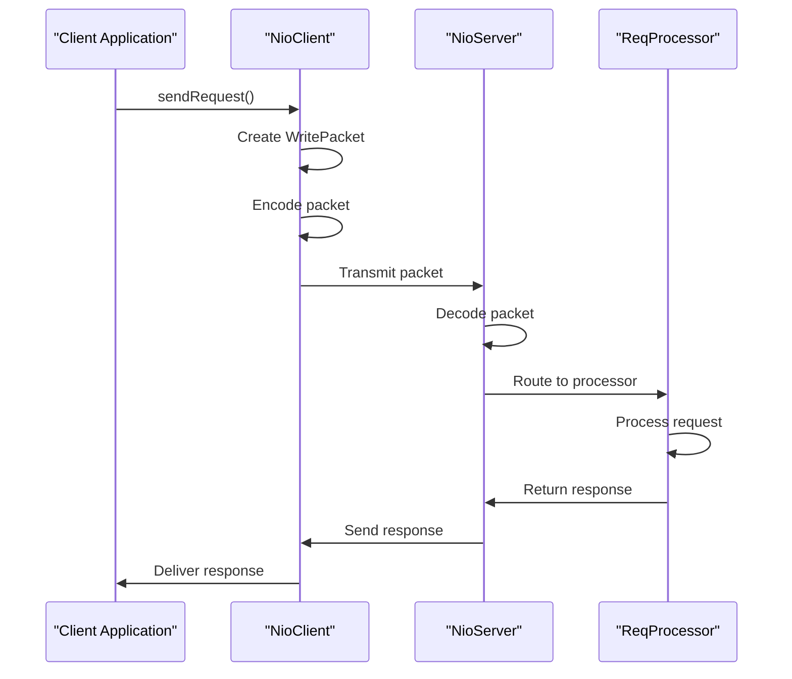

**Diagram sources**
- [Commands.java](file://client/src/main/java/com/github/dtprj/dongting/net/Commands.java#L21-L69)
- [ReqProcessor.java](file://client/src/main/java/com/github/dtprj/dongting/net/ReqProcessor.java#L26-L35)

**Section sources**
- [Commands.java](file://client/src/main/java/com/github/dtprj/dongting/net/Commands.java#L21-L69)
- [ReqProcessor.java](file://client/src/main/java/com/github/dtprj/dongting/net/ReqProcessor.java#L26-L35)

## Connection Management

The Dongting framework implements comprehensive connection management including connection establishment, handshake, keep-alive, and failure detection.

### Connection Handshake
The connection handshake protocol ensures compatibility between client and server instances:

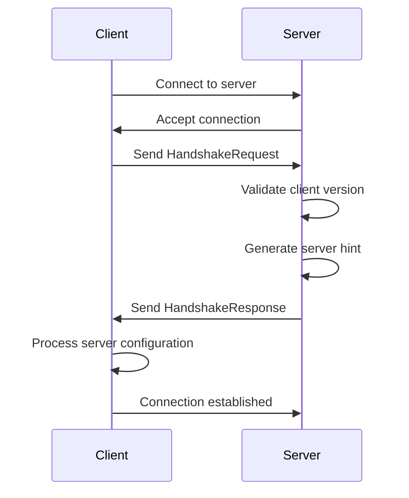

The handshake process includes:
1. Client connects to server endpoint
2. Client sends `HandshakeBody` with client UUID and version information
3. Server validates client compatibility and stores client UUID
4. Server responds with `HandshakeBody` containing server configuration hints
5. Client applies server hints to optimize connection parameters

### Keep-Alive and Failure Detection
The framework implements keep-alive mechanisms through periodic ping operations and timeout detection:

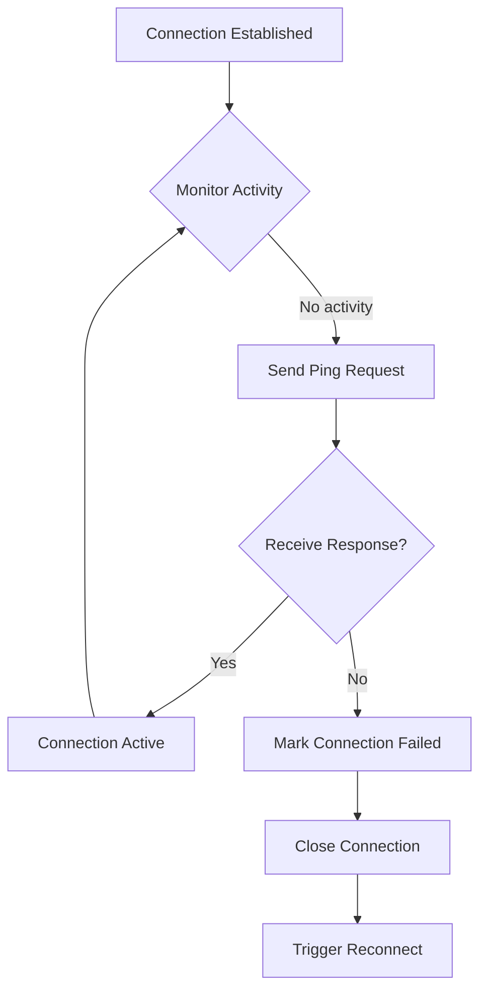

**Diagram sources**
- [HandshakeProcessor.java](file://client/src/main/java/com/github/dtprj/dongting/net/HandshakeProcessor.java#L29-L88)
- [NioWorker.java](file://client/src/main/java/com/github/dtprj/dongting/net/NioWorker.java#L55-L809)

**Section sources**
- [HandshakeProcessor.java](file://client/src/main/java/com/github/dtprj/dongting/net/HandshakeProcessor.java#L29-L88)
- [NioWorker.java](file://client/src/main/java/com/github/dtprj/dongting/net/NioWorker.java#L55-L809)

## Codec Framework

The codec framework provides efficient message serialization using Protocol Buffers wire format with custom encoders for optimal performance.

### Message Serialization
The framework uses a streaming encoding approach that supports both protobuf-compatible encoding and custom encoding strategies:

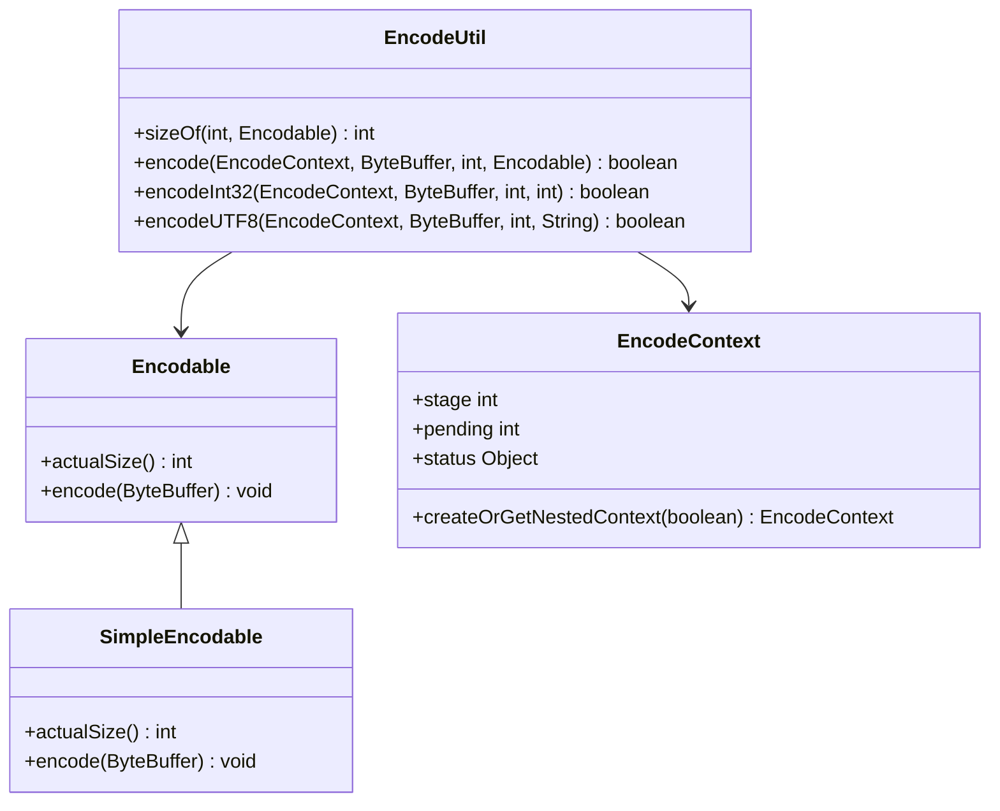

The encoding process uses an incremental approach that can be resumed if insufficient buffer space is available:

```java
public boolean encode(EncodeContext context, ByteBuffer buf) {
    // Handle header encoding
    if (step == STATUS_INIT) {
        // Write packet header fields
        step = STATUS_HEADER_ENCODE_FINISHED;
    }
    
    // Handle body encoding
    if (step == STATUS_HEADER_ENCODE_FINISHED) {
        // Encode body with potential continuation
        finish = encodeBody(context.createOrGetNestedContext(false), buf);
        if (finish) {
            step = STATUS_ENCODE_FINISHED;
        }
    }
    
    context.stage = step;
    return finish;
}
```

**Diagram sources**
- [EncodeUtil.java](file://client/src/main/java/com/github/dtprj/dongting/codec/EncodeUtil.java#L27-L528)
- [WritePacket.java](file://client/src/main/java/com/github/dtprj/dongting/net/WritePacket.java#L30-L182)

**Section sources**
- [EncodeUtil.java](file://client/src/main/java/com/github/dtprj/dongting/codec/EncodeUtil.java#L27-L528)
- [WritePacket.java](file://client/src/main/java/com/github/dtprj/dongting/net/WritePacket.java#L30-L182)

## Configuration Options

The Dongting framework provides extensive configuration options for tuning performance and behavior.

### Client Configuration
The `NioClientConfig` class provides configuration options for client instances:

```mermaid
erDiagram
NioClientConfig {
List<HostPort> hostPorts "Server endpoints"
int connectTimeoutMillis "Connection timeout"
int[] connectRetryIntervals "Retry intervals"
int bizThreads "Business threads"
int maxOutRequests "Max outbound requests"
int maxOutBytes "Max outbound bytes"
int maxInRequests "Max inbound requests"
int maxInBytes "Max inbound bytes"
}
```

### Server Configuration
The `NioServerConfig` class provides configuration options for server instances:

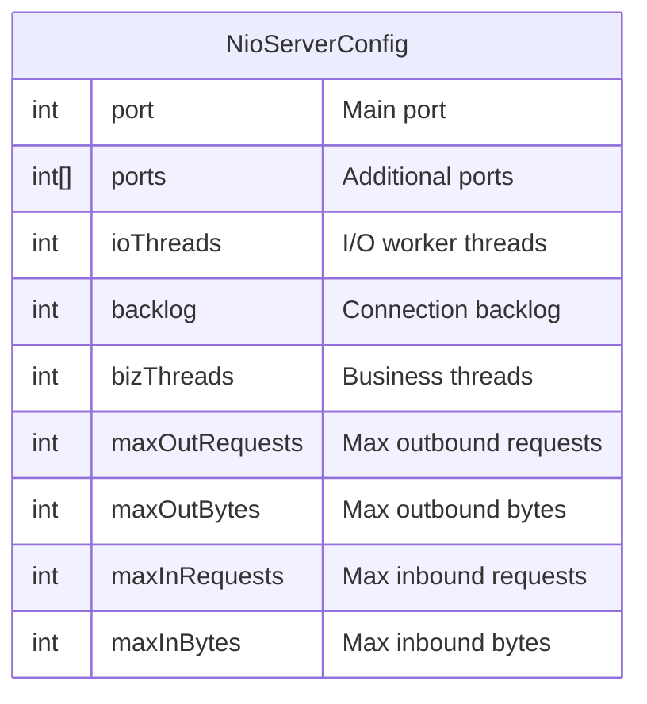

**Diagram sources**
- [NioClientConfig.java](file://client/src/main/java/com/github/dtprj/dongting/net/NioClientConfig.java#L23-L44)
- [NioServerConfig.java](file://client/src/main/java/com/github/dtprj/dongting/net/NioServerConfig.java#L21-L67)

**Section sources**
- [NioClientConfig.java](file://client/src/main/java/com/github/dtprj/dongting/net/NioClientConfig.java#L23-L44)
- [NioServerConfig.java](file://client/src/main/java/com/github/dtprj/dongting/net/NioServerConfig.java#L21-L67)

## Error Handling

The framework implements comprehensive error handling with standardized error codes and exception hierarchies.

### Error Codes
The `CmdCodes` interface defines standard response codes:

```java
public interface CmdCodes {
    int SUCCESS = 0;
    int CLIENT_ERROR = 1;
    int SYS_ERROR = 2;
    int COMMAND_NOT_SUPPORT = 3;
    int NOT_INIT = 4;
    int STOPPING = 5;
    int FLOW_CONTROL = 6;
    int NOT_RAFT_LEADER = 7;
    int RAFT_GROUP_NOT_FOUND = 8;
    int RAFT_GROUP_STOPPED = 9;
    int RAFT_GROUP_NOT_INIT = 10;
}
```

### Exception Types
The framework uses a hierarchy of exception types:
- `NetException`: Base network exception
- `NetTimeoutException`: Timeout-specific exception
- `CodecException`: Encoding/decoding errors
- `FlowControlException`: Flow control violations

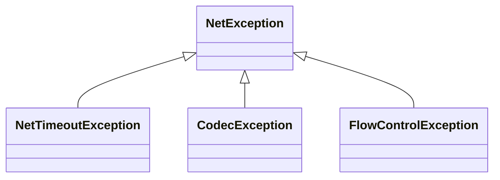

**Diagram sources**
- [CmdCodes.java](file://client/src/main/java/com/github/dtprj/dongting/net/CmdCodes.java#L21-L33)
- [Packet.java](file://client/src/main/java/com/github/dtprj/dongting/net/Packet.java#L26-L75)

**Section sources**
- [CmdCodes.java](file://client/src/main/java/com/github/dtprj/dongting/net/CmdCodes.java#L21-L33)
- [Packet.java](file://client/src/main/java/com/github/dtprj/dongting/net/Packet.java#L26-L75)

## Client-Server Interaction Model

The client-server interaction model defines how clients and servers communicate through the RPC framework.

### Request Patterns
The framework supports multiple request patterns:

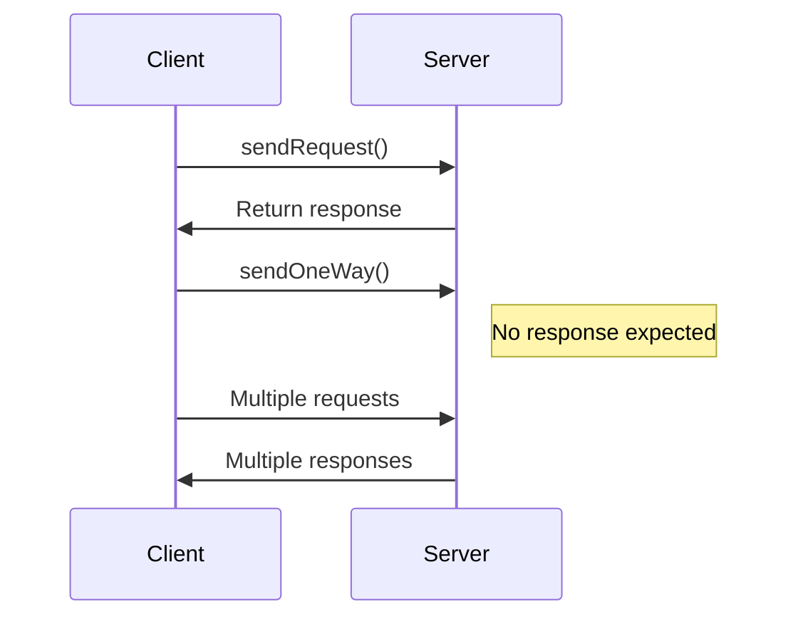

### Retry Strategies
The framework implements automatic retry mechanisms for failed operations:

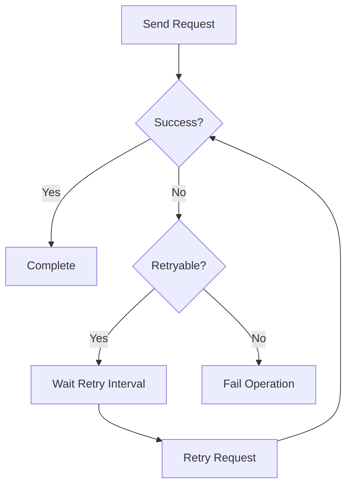

**Diagram sources**
- [NioClient.java](file://client/src/main/java/com/github/dtprj/dongting/net/NioClient.java#L132-L174)
- [NioWorker.java](file://client/src/main/java/com/github/dtprj/dongting/net/NioWorker.java#L55-L809)

**Section sources**
- [NioClient.java](file://client/src/main/java/com/github/dtprj/dongting/net/NioClient.java#L132-L174)
- [NioWorker.java](file://client/src/main/java/com/github/dtprj/dongting/net/NioWorker.java#L55-L809)

## Performance Considerations

The Dongting framework is designed for high-performance network communication with several optimization strategies:

### Buffer Management
Efficient byte buffer management using object pooling:

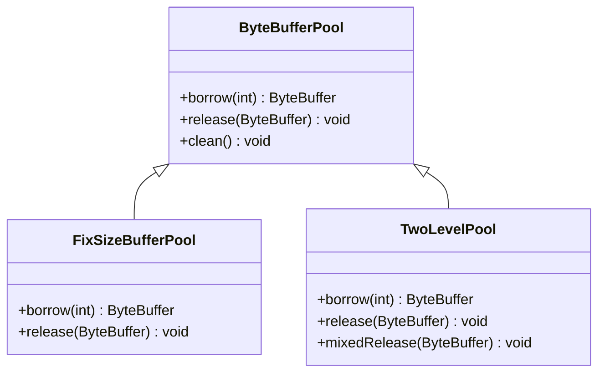

### Threading Model
Optimized threading model with separation of I/O and business processing:

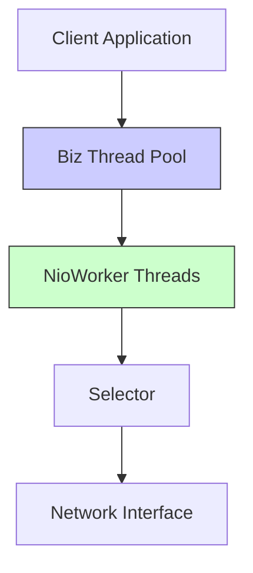

**Diagram sources**
- [ByteBufferPool.java](file://client/src/main/java/com/github/dtprj/dongting/buf/ByteBufferPool.java)
- [NioWorker.java](file://client/src/main/java/com/github/dtprj/dongting/net/NioWorker.java#L55-L809)

**Section sources**
- [NioWorker.java](file://client/src/main/java/com/github/dtprj/dongting/net/NioWorker.java#L55-L809)

## Security and Network Resilience

The framework includes features for network resilience and security:

### Connection Resilience
Automatic reconnection and failover capabilities:

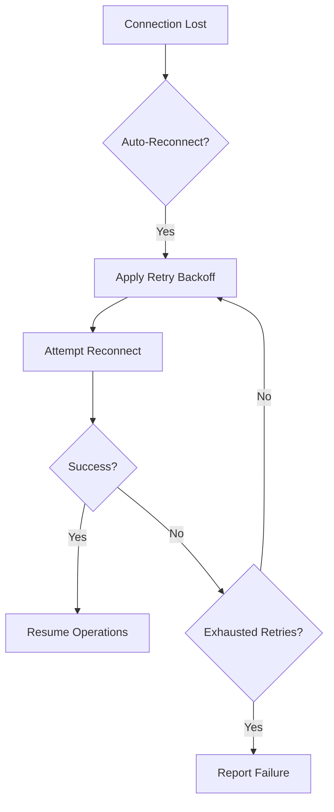

### Flow Control
Built-in flow control to prevent resource exhaustion:

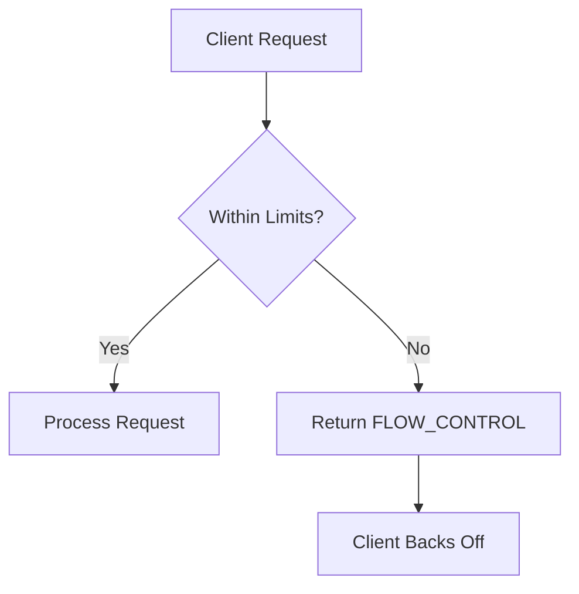

**Diagram sources**
- [NioWorker.java](file://client/src/main/java/com/github/dtprj/dongting/net/NioWorker.java#L55-L809)
- [CmdCodes.java](file://client/src/main/java/com/github/dtprj/dongting/net/CmdCodes.java#L21-L33)

**Section sources**
- [NioWorker.java](file://client/src/main/java/com/github/dtprj/dongting/net/NioWorker.java#L55-L809)
- [CmdCodes.java](file://client/src/main/java/com/github/dtprj/dongting/net/CmdCodes.java#L21-L33)