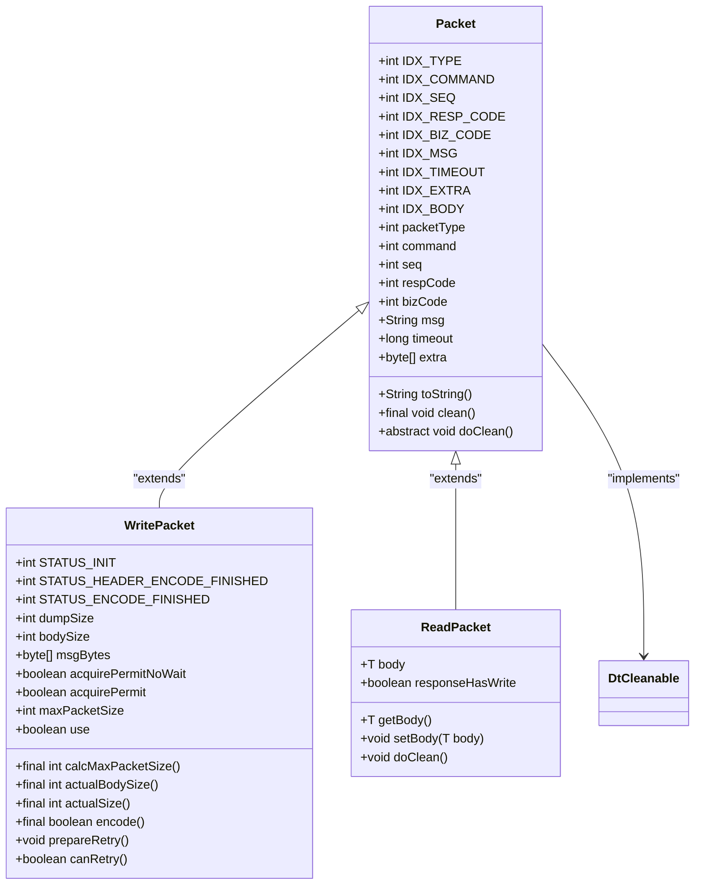
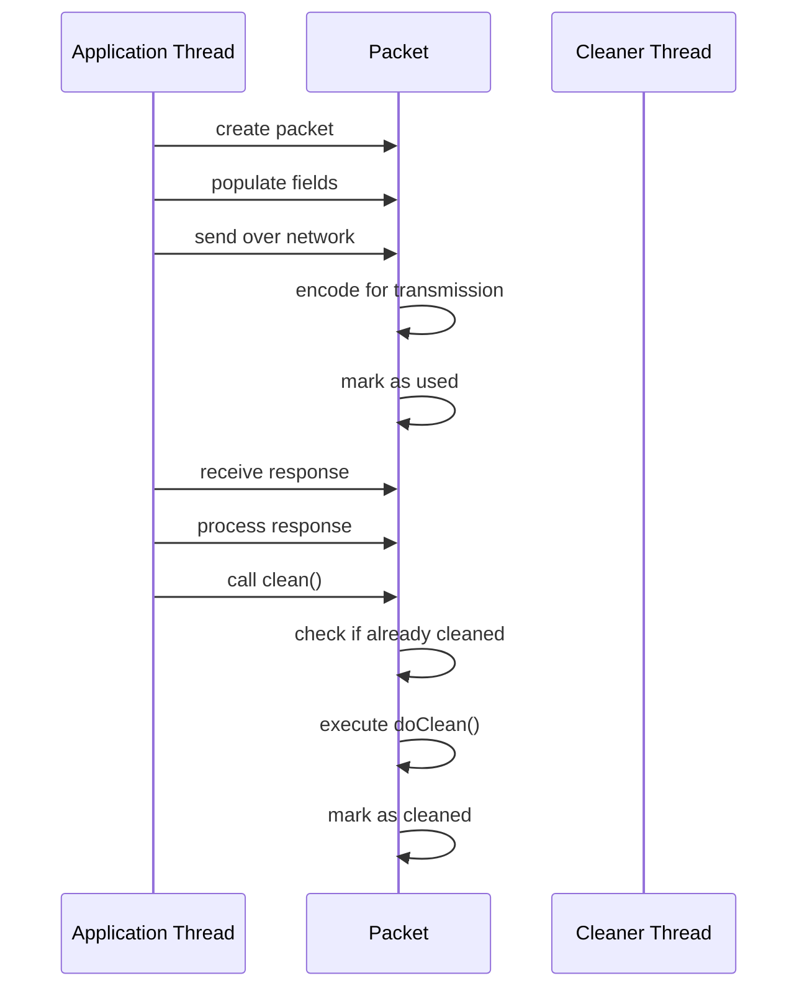
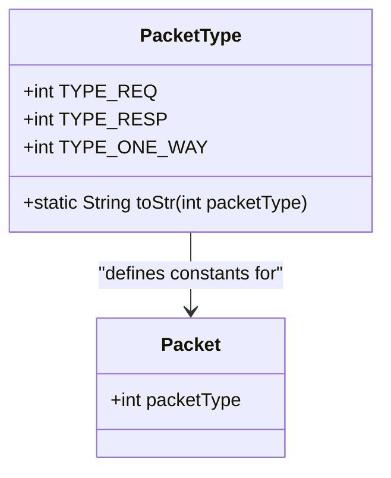
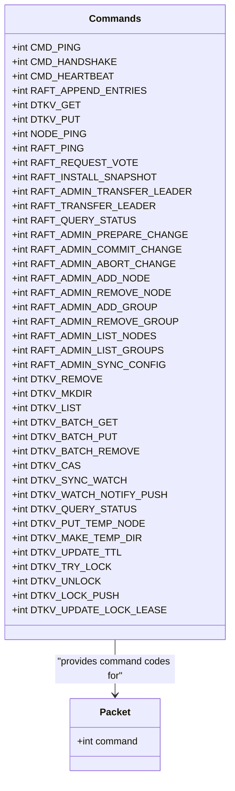
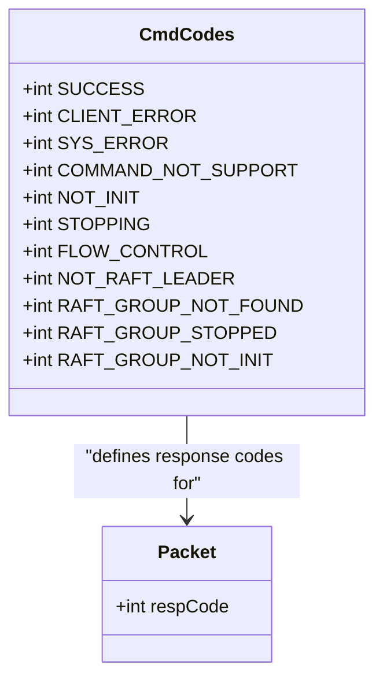
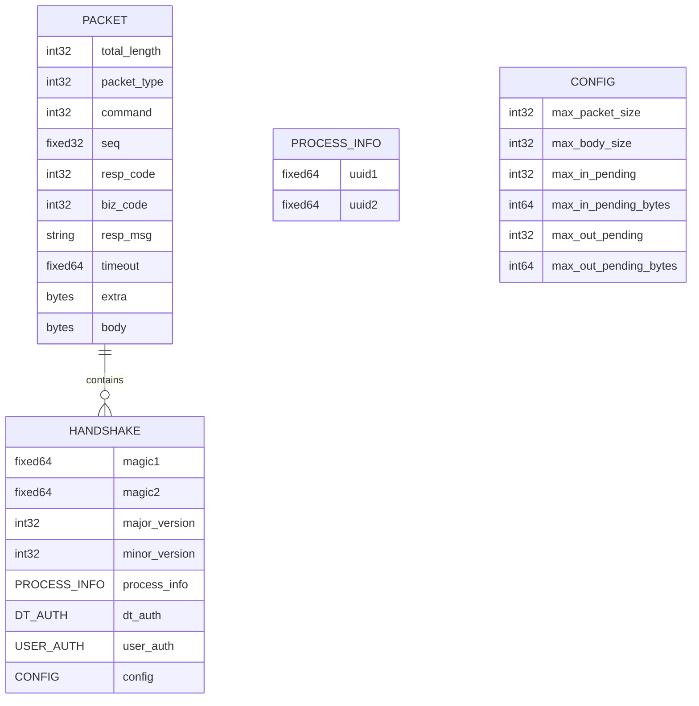
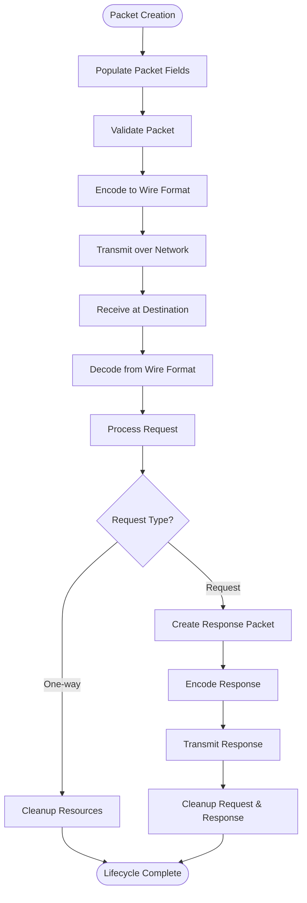

# Core Packet Structure

<cite>
**Referenced Files in This Document**   
- [Packet.java](file://client/src/main/java/com/github/dtprj/dongting/net/Packet.java)
- [PacketType.java](file://client/src/main/java/com/github/dtprj/dongting/net/PacketType.java)
- [Commands.java](file://client/src/main/java/com/github/dtprj/dongting/net/Commands.java)
- [CmdCodes.java](file://client/src/main/java/com/github/dtprj/dongting/net/CmdCodes.java)
- [DtCleanable.java](file://client/src/main/java/com/github/dtprj/dongting/common/DtCleanable.java)
- [WritePacket.java](file://client/src/main/java/com/github/dtprj/dongting/net/WritePacket.java)
- [ReadPacket.java](file://client/src/main/java/com/github/dtprj/dongting/net/ReadPacket.java)
- [dt_packet.proto](file://client/src/test/proto/dt_packet.proto)
- [KvReq.java](file://client/src/main/java/com/github/dtprj/dongting/dtkv/KvReq.java)
- [KvResp.java](file://client/src/main/java/com/github/dtprj/dongting/dtkv/KvResp.java)
</cite>

## Table of Contents
1. [Introduction](#introduction)
2. [Core Packet Class Structure](#core-packet-class-structure)
3. [Packet Lifecycle and Memory Management](#packet-lifecycle-and-memory-management)
4. [Packet Type Classification](#packet-type-classification)
5. [Command Routing System](#command-routing-system)
6. [Response Status Handling](#response-status-handling)
7. [Wire Format Specification](#wire-format-specification)
8. [Versioning and Backward Compatibility](#versioning-and-backward-compatibility)
9. [Packet Lifecycle Flow](#packet-lifecycle-flow)
10. [Conclusion](#conclusion)

## Introduction
The Dongting core packet structure forms the foundation of network communication within the system, providing a standardized format for message exchange between components. This documentation details the Packet class design, packet type classification, command routing mechanism, and wire format specifications that enable reliable and efficient communication across the distributed system. The packet structure supports various communication patterns including request-response, one-way messaging, and specialized RPC patterns for distributed coordination.

## Core Packet Class Structure

The Packet class serves as the abstract base class for all network messages in the Dongting system, defining the core fields that are present in every packet regardless of its specific type or purpose. The class hierarchy begins with the Packet abstract class that implements the DtCleanable interface for lifecycle management.

The Packet class contains essential fields for message identification and routing:
- **seq**: Sequence number for request tracking and ordering
- **command**: Command code that identifies the operation type
- **packetType**: Distinguishes between request, response, and one-way message patterns
- **respCode**: Response status code indicating success or failure
- **bizCode**: Business-specific error code for application-level errors
- **msg**: Human-readable message for debugging and error reporting
- **timeout**: Timeout value in milliseconds for request-response operations
- **extra**: Additional metadata bytes for custom extensions

The class also defines constant index values (IDX_TYPE, IDX_COMMAND, IDX_SEQ, etc.) that correspond to Protocol Buffer field numbers, ensuring consistent serialization and deserialization across the system.

**Diagram sources**
- [Packet.java](file://client/src/main/java/com/github/dtprj/dongting/net/Packet.java)
- [WritePacket.java](file://client/src/main/java/com/github/dtprj/dongting/net/WritePacket.java)
- [ReadPacket.java](file://client/src/main/java/com/github/dtprj/dongting/net/ReadPacket.java)

**Section sources**
- [Packet.java](file://client/src/main/java/com/github/dtprj/dongting/net/Packet.java#L26-L76)

## Packet Lifecycle and Memory Management

The packet lifecycle is managed through the DtCleanable interface, which provides a standardized mechanism for resource cleanup and memory management. This interface ensures that packets and their associated resources are properly cleaned up after use, preventing memory leaks in high-throughput network operations.

The DtCleanable interface defines a single method `clean()` that must be implemented by all classes that manage resources requiring explicit cleanup. The Packet class implements this interface and provides a final `clean()` method that ensures idempotent cleanup - once a packet is cleaned, subsequent calls to clean() are ignored and logged as potential bugs.

The cleanup process follows a two-phase pattern:
1. The public `clean()` method performs safety checks and exception handling
2. The protected `doClean()` method contains the actual cleanup logic specific to each packet type

This design ensures that cleanup operations are both safe and extensible. The WritePacket class, for example, overrides `doClean()` to provide empty implementation since its resources are managed by the encoding process, while ReadPacket implements `doClean()` to recursively clean its body if the body itself implements DtCleanable.

**Diagram sources**
- [Packet.java](file://client/src/main/java/com/github/dtprj/dongting/net/Packet.java#L26-L76)
- [DtCleanable.java](file://client/src/main/java/com/github/dtprj/dongting/common/DtCleanable.java#L21-L24)

**Section sources**
- [Packet.java](file://client/src/main/java/com/github/dtprj/dongting/net/Packet.java#L26-L76)
- [DtCleanable.java](file://client/src/main/java/com/github/dtprj/dongting/common/DtCleanable.java#L21-L24)

## Packet Type Classification

The PacketType interface defines constants for distinguishing between different message patterns in the Dongting system. This classification enables the network layer to handle packets appropriately based on their communication semantics.

The three primary packet types are:
- **TYPE_REQ (1)**: Request packets that expect a response
- **TYPE_RESP (2)**: Response packets sent in reply to requests
- **TYPE_ONE_WAY (3)**: One-way messages that do not require acknowledgment

The interface also provides a utility method `toStr()` that converts packet type codes to human-readable strings for logging and debugging purposes. This method returns "REQ", "RESP", or "ONE_WAY" for valid packet types, and "UNKNOWN" for unrecognized values.

The packet type classification supports different communication patterns required by the system:
- Request-response pattern for synchronous operations
- One-way messaging for fire-and-forget notifications
- Asynchronous callbacks for long-running operations

This classification is critical for the proper functioning of the network layer, as it determines how packets are routed, processed, and acknowledged within the system.

**Diagram sources**
- [PacketType.java](file://client/src/main/java/com/github/dtprj/dongting/net/PacketType.java#L6-L24)

**Section sources**
- [PacketType.java](file://client/src/main/java/com/github/dtprj/dongting/net/PacketType.java#L6-L24)

## Command Routing System

The Commands interface defines a comprehensive set of command codes used for routing messages within the Dongting system. These command codes identify the specific operation to be performed and are used by the network layer to dispatch packets to the appropriate handlers.

The command codes are organized into ranges based on their functional domain:
- **1-15**: Most common commands (optimized for Protocol Buffer varint encoding)
- **16-39**: RPC-related commands
- **40-69**: Raft consensus algorithm commands
- **70-99**: Distributed key-value store (dtKV) commands

Key commands include:
- **CMD_PING (1)**: Heartbeat and connectivity check
- **CMD_HANDSHAKE (2)**: Connection establishment and negotiation
- **CMD_HEARTBEAT (3)**: Periodic health monitoring
- **RAFT_APPEND_ENTRIES (4)**: Raft log replication
- **DTKV_GET (5), DTKV_PUT (6)**: Key-value store operations
- **RAFT_REQUEST_VOTE (42)**: Raft leader election
- **RAFT_INSTALL_SNAPSHOT (43)**: Raft state synchronization
- **DTKV_CAS (76)**: Compare-and-swap atomic operation
- **DTKV_WATCH_NOTIFY_PUSH (78)**: Watch event notification

The command routing system enables efficient message dispatch by using integer codes that can be quickly compared and routed to the appropriate processor. The organization of commands into functional ranges also facilitates protocol evolution and extension.

**Diagram sources**
- [Commands.java](file://client/src/main/java/com/github/dtprj/dongting/net/Commands.java#L21-L70)

**Section sources**
- [Commands.java](file://client/src/main/java/com/github/dtprj/dongting/net/Commands.java#L21-L70)

## Response Status Handling

The CmdCodes interface defines standardized response status codes used throughout the Dongting system to indicate the outcome of operations. These codes provide a consistent mechanism for error reporting and handling across different components and subsystems.

The response codes include:
- **SUCCESS (0)**: Operation completed successfully
- **CLIENT_ERROR (1)**: Client-side error (invalid parameters, etc.)
- **SYS_ERROR (2)**: System-level error (internal failure)
- **COMMAND_NOT_SUPPORT (3)**: Requested command not supported
- **NOT_INIT (4)**: System or component not initialized
- **STOPPING (5)**: System is shutting down
- **FLOW_CONTROL (6)**: Flow control limit exceeded
- **NOT_RAFT_LEADER (7)**: Node is not the Raft leader
- **RAFT_GROUP_NOT_FOUND (8)**: Raft group does not exist
- **RAFT_GROUP_STOPPED (9)**: Raft group is stopped
- **RAFT_GROUP_NOT_INIT (10)**: Raft group not initialized

These response codes enable clients to handle different failure scenarios appropriately. For example, a NOT_RAFT_LEADER response indicates that the client should redirect its request to the current leader, while a FLOW_CONTROL response suggests that the client should reduce its request rate.

The response status system is designed to be extensible, allowing for additional error codes to be added as needed while maintaining backward compatibility with existing clients.

**Diagram sources**
- [CmdCodes.java](file://client/src/main/java/com/github/dtprj/dongting/net/CmdCodes.java#L21-L34)

**Section sources**
- [CmdCodes.java](file://client/src/main/java/com/github/dtprj/dongting/net/CmdCodes.java#L21-L34)

## Wire Format Specification

The wire format for Dongting packets is based on Protocol Buffers, providing an efficient, extensible, and language-neutral serialization format. The packet structure is defined in the dt_packet.proto file and includes both fixed and variable-length fields optimized for network transmission.

The packet wire format consists of:
- **Total length (4 bytes)**: Fixed-size integer indicating the packet length (excluding this field)
- **Protocol Buffer fields**: Key-value pairs with field numbers and encoded values

The core packet structure includes the following fields:
- **packet_type (1)**: int32 indicating the packet type (request, response, one-way)
- **command (2)**: int32 identifying the operation to perform
- **seq (3)**: fixed32 sequence number for request tracking
- **resp_code (4)**: int32 response status code
- **biz_code (5)**: int32 business-specific error code
- **resp_msg (6)**: string error message for debugging
- **timeout (7)**: fixed64 timeout value in milliseconds
- **extra (8)**: bytes for additional metadata
- **body (15)**: bytes containing the payload data

The wire format is designed for efficiency with:
- Varint encoding for integer values (smaller numbers use fewer bytes)
- Field numbers 1-15 encoded in a single byte
- Fixed-size fields (fixed32, fixed64) for predictable parsing
- Optional fields that are omitted when empty

The handshake message, used during connection establishment, includes additional fields for version negotiation and configuration:
- **magic1, magic2**: Fixed64 values for protocol identification
- **major_version, minor_version**: int32 values for version negotiation
- **process_info**: Contains UUIDs for process identification
- **dt_auth, user_auth**: Authentication information
- **config**: Connection configuration parameters

**Diagram sources**
- [dt_packet.proto](file://client/src/test/proto/dt_packet.proto#L16-L62)

**Section sources**
- [dt_packet.proto](file://client/src/test/proto/dt_packet.proto#L16-L62)

## Versioning and Backward Compatibility

The Dongting packet structure incorporates versioning mechanisms to ensure backward compatibility as the system evolves. The versioning system allows newer clients to communicate with older servers and vice versa, facilitating gradual upgrades and maintaining system availability.

Versioning is implemented through:
- **Major and minor version numbers**: Included in the handshake message for protocol negotiation
- **Optional fields**: New fields can be added without breaking existing implementations
- **Field number ranges**: Reserved ranges allow for future expansion
- **Default values**: Unrecognized fields are safely ignored

The handshake process includes version negotiation where clients and servers exchange their supported version ranges. If compatible versions are found, the connection proceeds using the highest mutually supported version. This approach enables:
- Forward compatibility: Newer servers can understand messages from older clients
- Backward compatibility: Older clients can work with newer servers (within version limits)
- Graceful degradation: When versions are incompatible, clear error messages are returned

The versioning system is critical for maintaining system stability during upgrades and ensuring that different components can evolve independently while maintaining interoperability.

**Section sources**
- [dt_packet.proto](file://client/src/test/proto/dt_packet.proto#L33-L34)

## Packet Lifecycle Flow

The packet lifecycle encompasses the complete journey of a packet from creation to transmission and eventual cleanup. This flow ensures reliable message delivery while managing system resources efficiently.

The typical packet lifecycle for a request-response operation:
1. **Creation**: Application creates a WritePacket with appropriate command and parameters
2. **Population**: Packet fields are populated (seq, command, timeout, body, etc.)
3. **Transmission**: Packet is submitted to the network layer for encoding and sending
4. **Encoding**: Packet is serialized to wire format using Protocol Buffers
5. **Sending**: Encoded packet is written to the network channel
6. **Receiving**: Remote endpoint reads and decodes the packet
7. **Processing**: Request is handled by the appropriate processor
8. **Response**: Response packet is created and sent back
9. **Reception**: Original sender receives and processes the response
10. **Cleanup**: Both request and response packets are cleaned up to release resources

For one-way messages, the lifecycle is simpler, ending after transmission without expecting a response. The lifecycle management ensures that resources are properly released regardless of whether the operation succeeds or fails.

**Diagram sources**
- [Packet.java](file://client/src/main/java/com/github/dtprj/dongting/net/Packet.java#L26-L76)
- [WritePacket.java](file://client/src/main/java/com/github/dtprj/dongting/net/WritePacket.java#L30-L182)
- [ReadPacket.java](file://client/src/main/java/com/github/dtprj/dongting/net/ReadPacket.java#L23-L45)

**Section sources**
- [Packet.java](file://client/src/main/java/com/github/dtprj/dongting/net/Packet.java#L26-L76)
- [WritePacket.java](file://client/src/main/java/com/github/dtprj/dongting/net/WritePacket.java#L30-L182)
- [ReadPacket.java](file://client/src/main/java/com/github/dtprj/dongting/net/ReadPacket.java#L23-L45)

## Conclusion
The Dongting core packet structure provides a robust foundation for network communication within the distributed system. Through its well-defined class hierarchy, comprehensive command routing, standardized response codes, and efficient wire format, the packet system enables reliable and scalable message exchange between components. The integration of lifecycle management through the DtCleanable interface ensures proper resource cleanup, while the versioning system maintains backward compatibility during system evolution. This comprehensive packet design supports the various communication patterns required by distributed systems, including request-response, one-way messaging, and specialized coordination protocols, making it a critical component of the Dongting architecture.