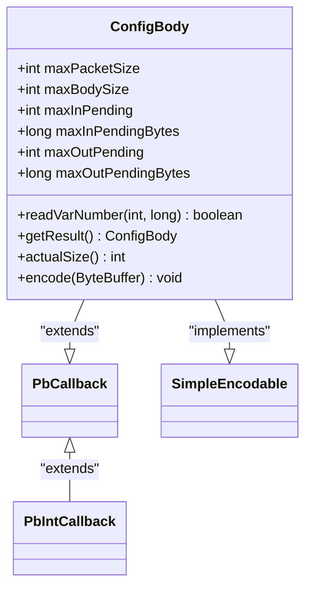
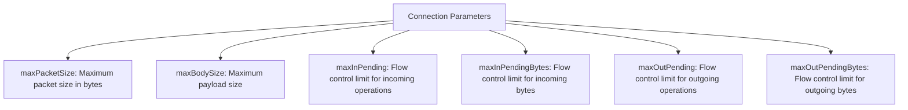
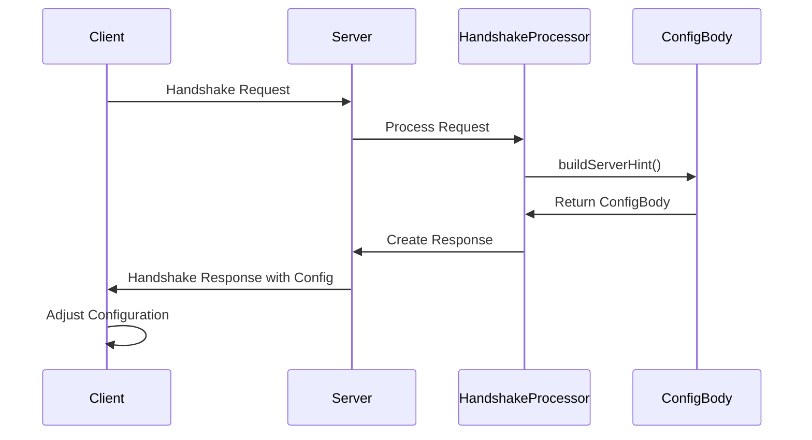
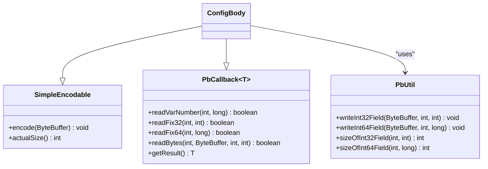
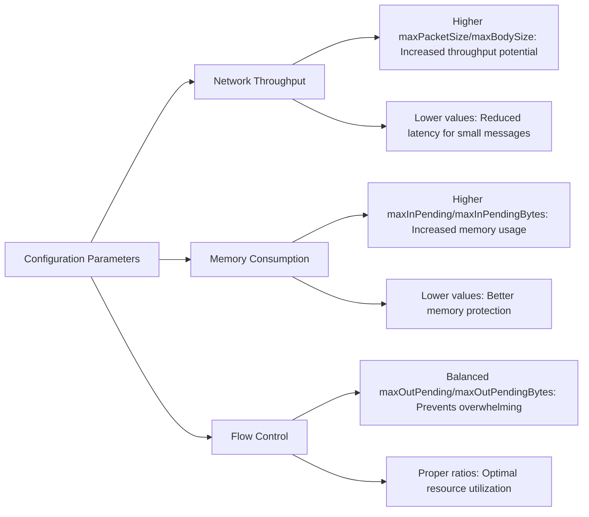
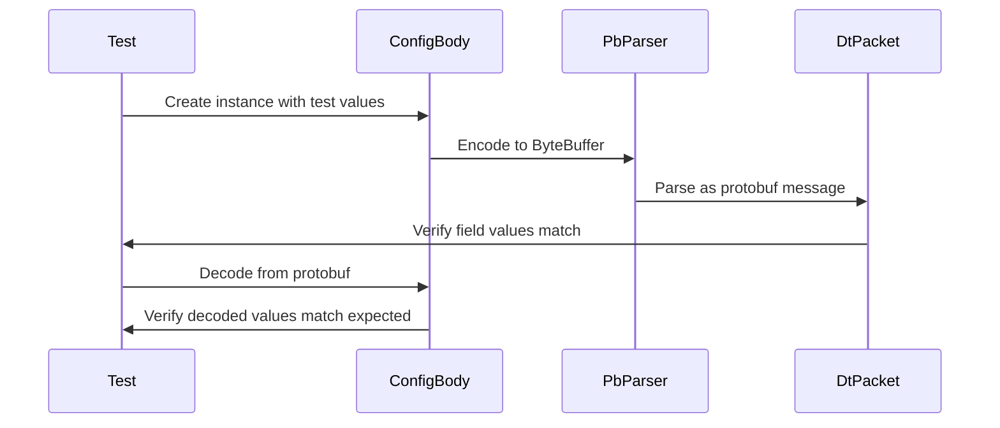
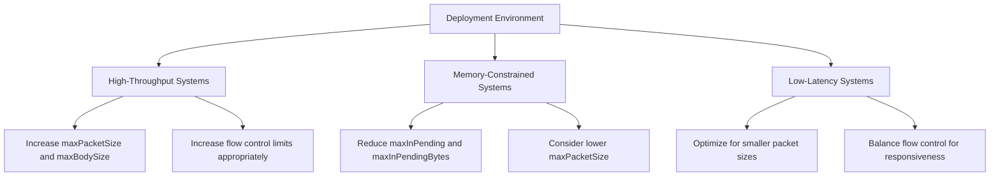

# Connection Configuration Parameters

<cite>
**Referenced Files in This Document**   
- [ConfigBody.java](file://client/src/main/java/com/github/dtprj/dongting/net/ConfigBody.java)
- [ConfigBodyTest.java](file://client/src/test/java/com/github/dtprj/dongting/net/ConfigBodyTest.java)
- [HandshakeBody.java](file://client/src/main/java/com/github/dtprj/dongting/net/HandshakeBody.java)
- [HandshakeProcessor.java](file://client/src/main/java/com/github/dtprj/dongting/net/HandshakeProcessor.java)
- [NioConfig.java](file://client/src/main/java/com/github/dtprj/dongting/net/NioConfig.java)
- [NioServerConfig.java](file://client/src/main/java/com/github/dtprj/dongting/net/NioServerConfig.java)
- [SimpleEncodable.java](file://client/src/main/java/com/github/dtprj/dongting/codec/SimpleEncodable.java)
- [PbIntCallback.java](file://client/src/main/java/com/github/dtprj/dongting/codec/PbIntCallback.java)
- [dt_packet.proto](file://client/src/test/proto/dt_packet.proto)
</cite>

## Table of Contents
1. [Introduction](#introduction)
2. [ConfigBody Class Structure](#configbody-class-structure)
3. [Connection Parameters](#connection-parameters)
4. [Handshake Negotiation Process](#handshake-negotiation-process)
5. [Protobuf Encoding/Decoding Mechanism](#protobuf-encodingdecoding-mechanism)
6. [Performance and Resource Impact](#performance-and-resource-impact)
7. [Configuration Validation and Testing](#configuration-validation-and-testing)
8. [Best Practices for Parameter Tuning](#best-practices-for-parameter-tuning)
9. [Conclusion](#conclusion)

## Introduction
The ConfigBody class plays a critical role in the Dongting networking framework by defining connection parameters during the handshake negotiation process between client and server. This document provides comprehensive documentation of the ConfigBody class, detailing its fields, negotiation process, encoding/decoding mechanisms, and performance implications. The configuration parameters defined in ConfigBody are essential for establishing optimal communication settings that balance network throughput, memory consumption, and system stability.

**Section sources**
- [ConfigBody.java](file://client/src/main/java/com/github/dtprj/dongting/net/ConfigBody.java#L1-L93)

## ConfigBody Class Structure

**Diagram sources**
- [ConfigBody.java](file://client/src/main/java/com/github/dtprj/dongting/net/ConfigBody.java#L27-L93)
- [SimpleEncodable.java](file://client/src/main/java/com/github/dtprj/dongting/codec/SimpleEncodable.java#L23-L27)
- [PbIntCallback.java](file://client/src/main/java/com/github/dtprj/dongting/codec/PbIntCallback.java#L21-L40)

The ConfigBody class serves as a container for connection configuration parameters that are exchanged during the handshake process. It extends PbCallback<ConfigBody> and implements the SimpleEncodable interface, enabling protobuf-based serialization and deserialization. The class contains six key fields that define the communication parameters between client and server, with specific protobuf field indices assigned to each parameter for proper encoding and decoding.

**Section sources**
- [ConfigBody.java](file://client/src/main/java/com/github/dtprj/dongting/net/ConfigBody.java#L27-L93)

## Connection Parameters

**Diagram sources**
- [ConfigBody.java](file://client/src/main/java/com/github/dtprj/dongting/net/ConfigBody.java#L36-L41)
- [dt_packet.proto](file://client/src/test/proto/dt_packet.proto#L54-L61)

The ConfigBody class defines six critical connection parameters that govern the behavior of network communication:

- **maxPacketSize**: Specifies the maximum size of a complete packet in bytes, including both header and body. This parameter prevents oversized packets from overwhelming the system.
- **maxBodySize**: Defines the maximum size of the payload portion of a packet, ensuring that individual message bodies remain within acceptable limits.
- **maxInPending**: Sets the flow control limit for concurrent incoming operations, preventing the server from being overwhelmed by too many pending requests.
- **maxInPendingBytes**: Establishes the flow control limit for the total size of incoming pending data in bytes, providing memory-based flow control.
- **maxOutPending**: Determines the flow control limit for concurrent outgoing operations from the server's perspective.
- **maxOutPendingBytes**: Sets the flow control limit for the total size of outgoing pending data in bytes.

These parameters are negotiated during the handshake process to establish optimal communication settings that match the capabilities and constraints of both client and server.

**Section sources**
- [ConfigBody.java](file://client/src/main/java/com/github/dtprj/dongting/net/ConfigBody.java#L36-L41)
- [dt_packet.proto](file://client/src/test/proto/dt_packet.proto#L54-L61)

## Handshake Negotiation Process

**Diagram sources**
- [HandshakeProcessor.java](file://client/src/main/java/com/github/dtprj/dongting/net/HandshakeProcessor.java#L78-L85)
- [ConfigBody.java](file://client/src/main/java/com/github/dtprj/dongting/net/ConfigBody.java#L36-L41)
- [HandshakeBody.java](file://client/src/main/java/com/github/dtprj/dongting/net/HandshakeBody.java#L40-L43)

The handshake negotiation process begins when a client initiates a connection to the server. The server's HandshakeProcessor creates a ConfigBody instance containing its configuration preferences, particularly when the serverHint flag is enabled in the NioServerConfig. The server populates the ConfigBody with values derived from its configuration, such as setting maxOutPending to one-eighth of maxInRequests and maxOutPendingBytes to one-eighth of maxInBytes. The client receives this configuration and can adjust its own parameters accordingly, creating a negotiated connection setup that respects both parties' capabilities and limitations.

**Section sources**
- [HandshakeProcessor.java](file://client/src/main/java/com/github/dtprj/dongting/net/HandshakeProcessor.java#L78-L85)
- [NioServerConfig.java](file://client/src/main/java/com/github/dtprj/dongting/net/NioServerConfig.java#L38-L43)
- [NioConfig.java](file://client/src/main/java/com/github/dtprj/dongting/net/NioConfig.java#L36-L48)

## Protobuf Encoding/Decoding Mechanism

**Diagram sources**
- [ConfigBody.java](file://client/src/main/java/com/github/dtprj/dongting/net/ConfigBody.java#L27-L93)
- [SimpleEncodable.java](file://client/src/main/java/com/github/dtprj/dongting/codec/SimpleEncodable.java#L23-L27)
- [PbUtil.java](file://client/src/main/java/com/github/dtprj/dongting/codec/PbUtil.java)

The ConfigBody class utilizes a protobuf-based encoding and decoding mechanism through the PbIntCallback and SimpleEncodable interfaces. The encoding process is implemented through the encode(ByteBuffer) method, which writes each field to the buffer using PbUtil helper methods with their corresponding field indices. The actualSize() method calculates the total encoded size by summing the sizes of all fields. During decoding, the readVarNumber method processes variable-length numeric values, dispatching them to the appropriate fields based on the field index. This efficient binary encoding minimizes overhead and ensures compact representation of configuration data.

**Section sources**
- [ConfigBody.java](file://client/src/main/java/com/github/dtprj/dongting/net/ConfigBody.java#L74-L92)
- [SimpleEncodable.java](file://client/src/main/java/com/github/dtprj/dongting/codec/SimpleEncodable.java#L23-L27)
- [PbIntCallback.java](file://client/src/main/java/com/github/dtprj/dongting/codec/PbIntCallback.java#L21-L40)

## Performance and Resource Impact

**Diagram sources**
- [ConfigBody.java](file://client/src/main/java/com/github/dtprj/dongting/net/ConfigBody.java#L36-L41)
- [NioConfig.java](file://client/src/main/java/com/github/dtprj/dongting/net/NioConfig.java#L36-L48)

The configuration parameters in ConfigBody have significant impacts on both network throughput and memory consumption. Larger maxPacketSize and maxBodySize values enable higher throughput by allowing more data to be transmitted in each packet, but may increase latency for smaller messages. The flow control parameters (maxInPending, maxInPendingBytes, maxOutPending, maxOutPendingBytes) directly affect memory usage, with higher values allowing more concurrent operations but consuming more memory. Properly tuned parameters create an effective back-pressure mechanism that prevents either party from being overwhelmed, ensuring stable performance under varying load conditions.

**Section sources**
- [ConfigBody.java](file://client/src/main/java/com/github/dtprj/dongting/net/ConfigBody.java#L36-L41)
- [NioConfig.java](file://client/src/main/java/com/github/dtprj/dongting/net/NioConfig.java#L36-L48)

## Configuration Validation and Testing

**Diagram sources**
- [ConfigBodyTest.java](file://client/src/test/java/com/github/dtprj/dongting/net/ConfigBodyTest.java#L32-L82)
- [ConfigBody.java](file://client/src/main/java/com/github/dtprj/dongting/net/ConfigBody.java#L27-L93)

The ConfigBodyTest class provides comprehensive validation of the encoding and decoding functionality. The test suite verifies both encoding and decoding operations by creating ConfigBody instances with known values, encoding them to ByteBuffer, and then parsing them back using the protobuf parser to ensure all fields are correctly preserved. The tests also validate that the actualSize() method returns the correct encoded size and that the protobuf parsing produces identical values to the original configuration. This rigorous testing ensures the reliability and correctness of the configuration negotiation process.

**Section sources**
- [ConfigBodyTest.java](file://client/src/test/java/com/github/dtprj/dongting/net/ConfigBodyTest.java#L32-L82)
- [ConfigBody.java](file://client/src/main/java/com/github/dtprj/dongting/net/ConfigBody.java#L27-L93)

## Best Practices for Parameter Tuning

**Diagram sources**
- [NioConfig.java](file://client/src/main/java/com/github/dtprj/dongting/net/NioConfig.java#L46-L48)
- [NioServerConfig.java](file://client/src/main/java/com/github/dtprj/dongting/net/NioServerConfig.java#L41-L42)

When tuning ConfigBody parameters for different deployment environments, several best practices should be followed. For high-throughput systems, increase maxPacketSize and maxBodySize to their maximum reasonable values (default 5MB and 4MB respectively) while ensuring flow control limits are set appropriately to prevent memory exhaustion. In memory-constrained environments, reduce maxInPending and maxInPendingBytes to conservative values that match available resources. For low-latency systems, optimize for smaller packet sizes and ensure flow control parameters are balanced to maintain responsiveness. The serverHint mechanism can be leveraged to automatically provide reasonable defaults based on server capacity.

**Section sources**
- [NioConfig.java](file://client/src/main/java/com/github/dtprj/dongting/net/NioConfig.java#L46-L48)
- [NioServerConfig.java](file://client/src/main/java/com/github/dtprj/dongting/net/NioServerConfig.java#L41-L42)

## Conclusion
The ConfigBody class is a fundamental component of the Dongting networking framework, enabling efficient negotiation of connection parameters between clients and servers. By defining critical parameters such as packet sizes and flow control limits, ConfigBody facilitates optimized communication that balances performance, resource usage, and system stability. The protobuf-based encoding mechanism ensures efficient transmission of configuration data, while comprehensive testing validates the reliability of the implementation. Proper tuning of these parameters based on deployment requirements is essential for achieving optimal system performance.