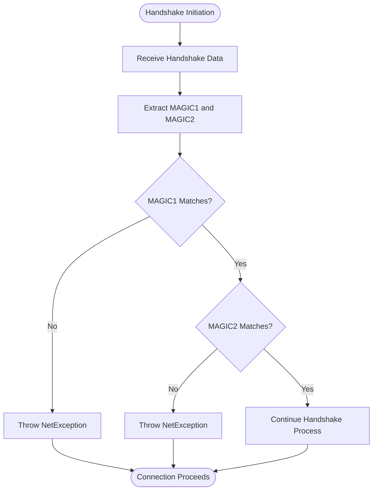
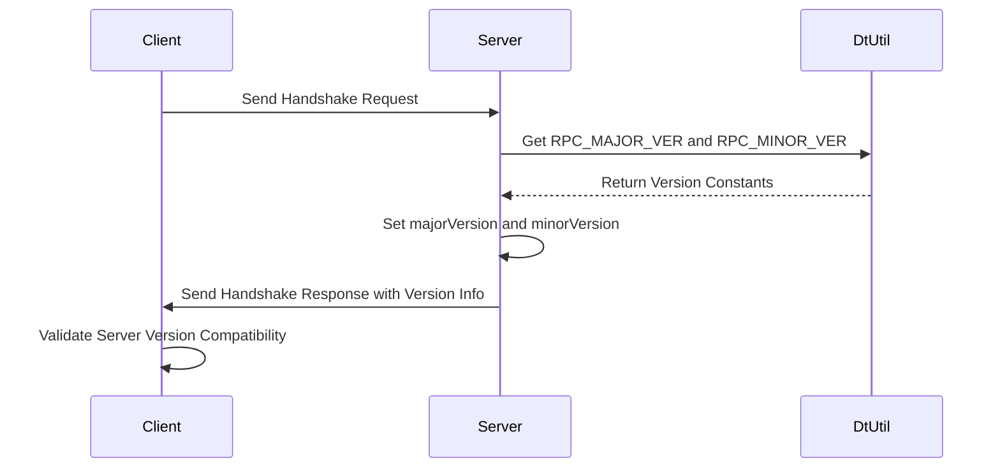
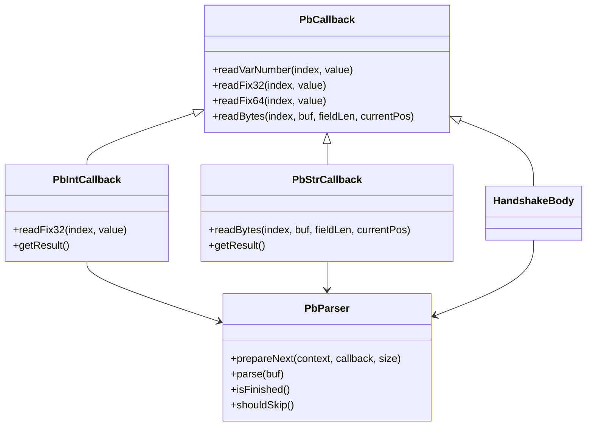
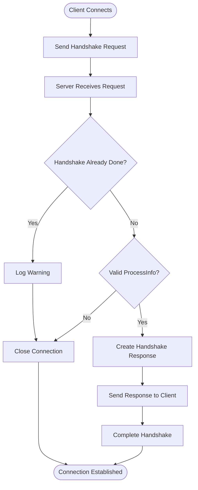
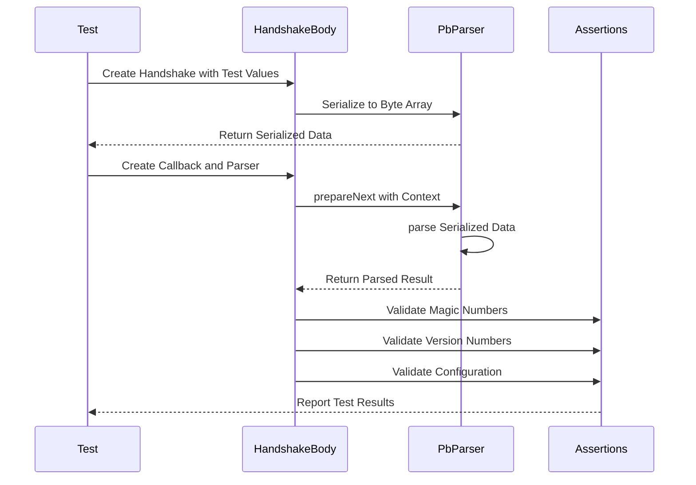

# Handshake Structure and Version Negotiation

<cite>
**Referenced Files in This Document**   
- [HandshakeBody.java](file://client/src/main/java/com/github/dtprj/dongting/net/HandshakeBody.java)
- [HandshakeBodyTest.java](file://client/src/test/java/com/github/dtprj/dongting/net/HandshakeBodyTest.java)
- [HandshakeProcessor.java](file://client/src/main/java/com/github/dtprj/dongting/net/HandshakeProcessor.java)
- [PbIntCallback.java](file://client/src/main/java/com/github/dtprj/dongting/codec/PbIntCallback.java)
- [PbStrCallback.java](file://client/src/main/java/com/github/dtprj/dongting/codec/PbStrCallback.java)
- [PbParser.java](file://client/src/main/java/com/github/dtprj/dongting/codec/PbParser.java)
- [ConfigBody.java](file://client/src/main/java/com/github/dtprj/dongting/net/ConfigBody.java)
- [dt_packet.proto](file://client/src/test/proto/dt_packet.proto)
- [DtUtil.java](file://client/src/main/java/com/github/dtprj/dongting/common/DtUtil.java)
- [NetException.java](file://client/src/main/java/com/github/dtprj/dongting/net/NetException.java)
</cite>

## Table of Contents
1. [Introduction](#introduction)
2. [HandshakeBody Structure](#handshakebody-structure)
3. [Magic Numbers for Protocol Identification](#magic-numbers-for-protocol-identification)
4. [Version Negotiation and Compatibility](#version-negotiation-and-compatibility)
5. [Protobuf-Based Serialization Mechanism](#protobuf-based-serialization-mechanism)
6. [Handshake Initiation and Validation](#handshake-initiation-and-validation)
7. [Testing and Boundary Conditions](#testing-and-boundary-conditions)
8. [Security Implications](#security-implications)

## Introduction
The HandshakeBody structure is a critical component in the Dongting project's connection negotiation process. It serves as the foundation for establishing secure and compatible communication between clients and servers. This document provides a comprehensive analysis of the HandshakeBody structure, focusing on its role in protocol identification, version negotiation, and data serialization. The handshake mechanism ensures that only compatible peers can establish connections, preventing communication failures due to version mismatches or protocol incompatibilities. By examining the implementation details, test cases, and security considerations, this documentation aims to provide a thorough understanding of the handshake process and its importance in maintaining system integrity.

## HandshakeBody Structure
The HandshakeBody structure is implemented as a class that extends PbCallback and implements SimpleEncodable, serving as the container for connection negotiation data. It contains four primary fields: majorVersion, minorVersion, processInfo, and config, each playing a specific role in the handshake process. The structure is designed to be both efficient and extensible, allowing for future enhancements while maintaining backward compatibility. The class utilizes protobuf-based serialization for efficient data encoding and decoding, with specific methods for handling different data types. The structure is organized to support the handshake protocol's requirements, including magic number verification, version negotiation, and configuration exchange. The implementation follows a callback-based approach, where the parsing process invokes specific methods based on the field index and type being processed.

**Section sources**
- [HandshakeBody.java](file://client/src/main/java/com/github/dtprj/dongting/net/HandshakeBody.java#L28-L111)

## Magic Numbers for Protocol Identification
The HandshakeBody structure employs two magic numbers, MAGIC1 and MAGIC2, for protocol identification and version compatibility verification. These constants are defined as 0xAE10_9045_1C22_DA13L and 0x1CD7_D1A3_0A61_935FL respectively, serving as unique identifiers that validate the authenticity of the handshake request. The magic numbers are verified during the parsing process through the readFix64 method, which checks if the received values match the expected constants. If either magic number fails to match, a NetException is thrown with a descriptive error message, immediately terminating the handshake process. This verification mechanism provides a robust defense against malformed or malicious handshake attempts, ensuring that only properly formatted requests from compatible clients can proceed. The use of two distinct magic numbers enhances security by making it more difficult for unauthorized parties to guess the correct values.

**Diagram sources**
- [HandshakeBody.java](file://client/src/main/java/com/github/dtprj/dongting/net/HandshakeBody.java#L30-L31)
- [HandshakeBody.java](file://client/src/main/java/com/github/dtprj/dongting/net/HandshakeBody.java#L50-L65)

## Version Negotiation and Compatibility
The version negotiation mechanism in the HandshakeBody structure utilizes majorVersion and minorVersion fields to ensure backward and forward compatibility during cluster upgrades. These integer fields are defined with indices IDX_MAJOR_VERSION (3) and IDX_MINOR_VERSION (4), allowing for systematic version tracking and compatibility checks. The server-side implementation in HandshakeProcessor sets these values using constants from DtUtil (RPC_MAJOR_VER and RPC_MINOR_VER), ensuring consistent version reporting across the system. The version negotiation process enables the server to determine whether the client's version is compatible with its own, allowing for graceful handling of version mismatches. This mechanism supports both backward compatibility (newer servers accepting older clients) and forward compatibility (older servers rejecting newer clients with incompatible features). The use of separate major and minor version numbers provides fine-grained control over compatibility decisions, allowing for more sophisticated upgrade strategies.

**Diagram sources**
- [HandshakeBody.java](file://client/src/main/java/com/github/dtprj/dongting/net/HandshakeBody.java#L40-L41)
- [HandshakeProcessor.java](file://client/src/main/java/com/github/dtprj/dongting/net/HandshakeProcessor.java#L60-L61)
- [DtUtil.java](file://client/src/main/java/com/github/dtprj/dongting/common/DtUtil.java#L33-L34)

## Protobuf-Based Serialization Mechanism
The HandshakeBody structure employs a protobuf-based serialization mechanism using PbIntCallback and PbStrCallback for encoding and decoding handshake data. This mechanism is implemented through the PbCallback abstract class, which provides methods for handling different protobuf field types including readFix64, readVarNumber, and readBytes. The serialization process is optimized for performance, using fixed-length encoding for magic numbers and variable-length encoding for version numbers. The encode method writes the handshake data to a ByteBuffer in the correct order, while the actualSize method calculates the total size of the serialized data. The PbParser class handles the parsing process, managing the state machine that processes protobuf tags, field lengths, and field bodies. This serialization approach ensures efficient data transmission while maintaining compatibility with the protobuf specification. The use of callback-based parsing allows for streaming processing of handshake data, reducing memory overhead and improving performance.

**Diagram sources**
- [PbCallback.java](file://client/src/main/java/com/github/dtprj/dongting/codec/PbCallback.java#L23-L40)
- [PbIntCallback.java](file://client/src/main/java/com/github/dtprj/dongting/codec/PbIntCallback.java#L21-L39)
- [PbStrCallback.java](file://client/src/main/java/com/github/dtprj/dongting/codec/PbStrCallback.java#L23-L44)
- [PbParser.java](file://client/src/main/java/com/github/dtprj/dongting/codec/PbParser.java#L26-L436)
- [HandshakeBody.java](file://client/src/main/java/com/github/dtprj/dongting/net/HandshakeBody.java#L28-L111)

## Handshake Initiation and Validation
The handshake initiation process begins with the client sending a handshake request to the server, which then validates the request through a series of checks. The server-side validation is implemented in the HandshakeProcessor class, which creates a HandshakeBody callback and uses the PbParser to process the incoming data. The validation logic first checks if a handshake has already been completed for the connection, preventing duplicate handshake attempts. It then verifies the presence and validity of the processInfo field, ensuring that the client has provided valid identification information. If any validation check fails, the connection is closed immediately to prevent potential security issues. Successful validation results in the creation of a response handshake that includes the server's version information and configuration hints. The entire process is designed to be efficient and secure, minimizing the window of vulnerability during connection establishment.

**Diagram sources**
- [HandshakeProcessor.java](file://client/src/main/java/com/github/dtprj/dongting/net/HandshakeProcessor.java#L29-L76)
- [HandshakeBody.java](file://client/src/main/java/com/github/dtprj/dongting/net/HandshakeBody.java#L50-L90)

## Testing and Boundary Conditions
The HandshakeBody implementation includes comprehensive test coverage through the HandshakeBodyTest class, which verifies both encoding and decoding functionality under various conditions. The testDecode method validates that the parser correctly handles properly formatted handshake data, ensuring that magic numbers, version information, and configuration settings are correctly extracted. The testEncode method confirms that the encoding process produces data that matches the expected protobuf format, with proper field indices and values. Boundary condition testing is demonstrated in the NioServerTest class, which includes a test case that verifies the handshake fails when magic numbers are reversed. These tests ensure the robustness of the handshake mechanism by validating both normal operation and error conditions. The testing approach follows best practices by using assertions to verify expected outcomes and by testing edge cases that could potentially compromise system security or stability.

**Diagram sources**
- [HandshakeBodyTest.java](file://client/src/test/java/com/github/dtprj/dongting/net/HandshakeBodyTest.java#L31-L77)
- [NioServerTest.java](file://client/src/test/java/com/github/dtprj/dongting/net/NioServerTest.java#L689-L723)

## Security Implications
The handshake mechanism has significant security implications, particularly regarding magic number verification and version mismatch responses. The magic number verification serves as the first line of defense against unauthorized connection attempts, ensuring that only clients with knowledge of the correct magic values can proceed with the handshake process. This mechanism prevents simple spoofing attacks and ensures protocol integrity. When version mismatches occur, the server's response strategy is critical to maintaining security - rather than providing detailed error information that could aid attackers, the connection is simply closed. The validation of processInfo ensures that each connecting client provides valid identification, preventing anonymous connections. Additionally, the immediate closure of connections with invalid handshake data prevents resource exhaustion attacks. These security measures work together to create a robust defense against various network-based threats while maintaining the usability of the system for legitimate clients.

**Section sources**
- [HandshakeBody.java](file://client/src/main/java/com/github/dtprj/dongting/net/HandshakeBody.java#L54-L62)
- [HandshakeProcessor.java](file://client/src/main/java/com/github/dtprj/dongting/net/HandshakeProcessor.java#L52-L56)
- [NetException.java](file://client/src/main/java/com/github/dtprj/dongting/net/NetException.java#L23-L41)