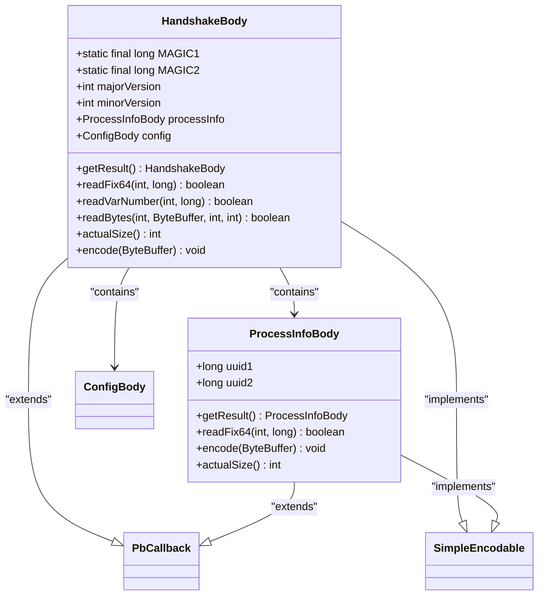
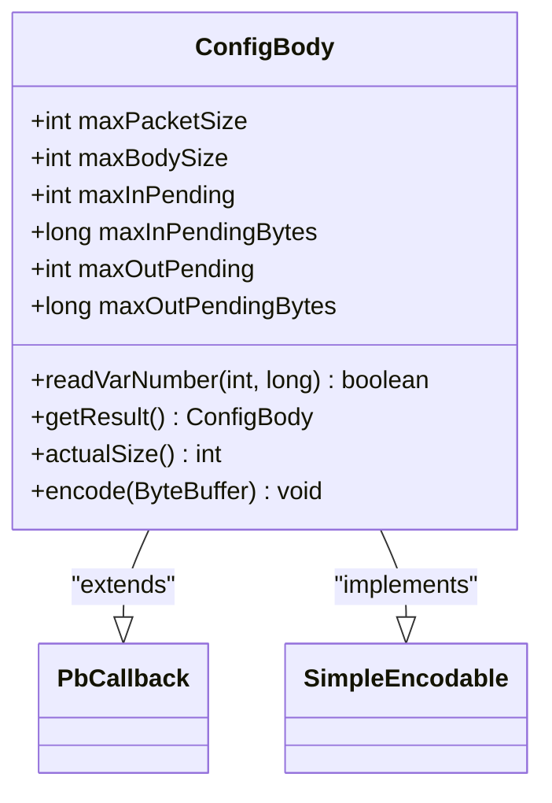
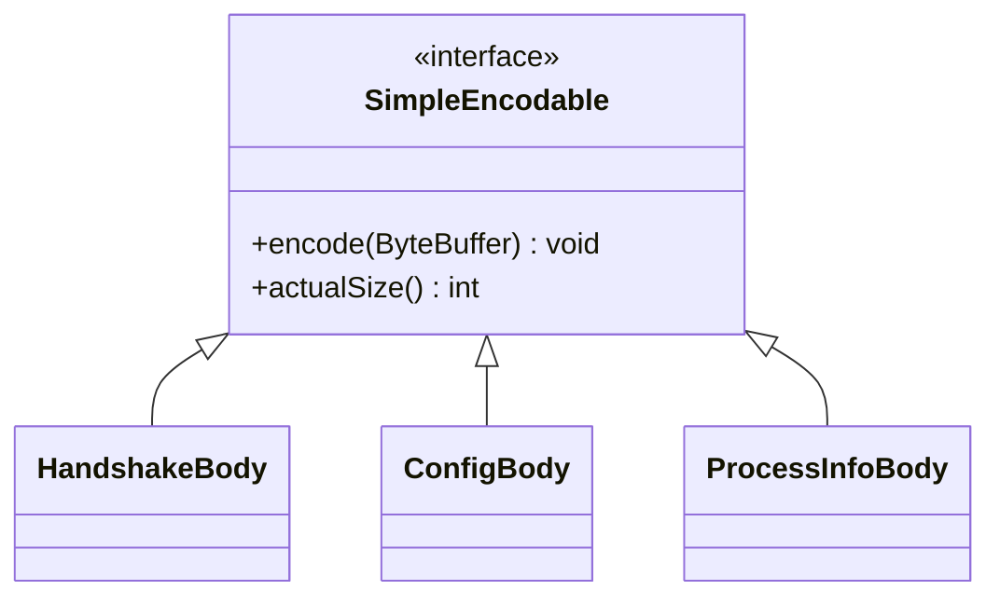
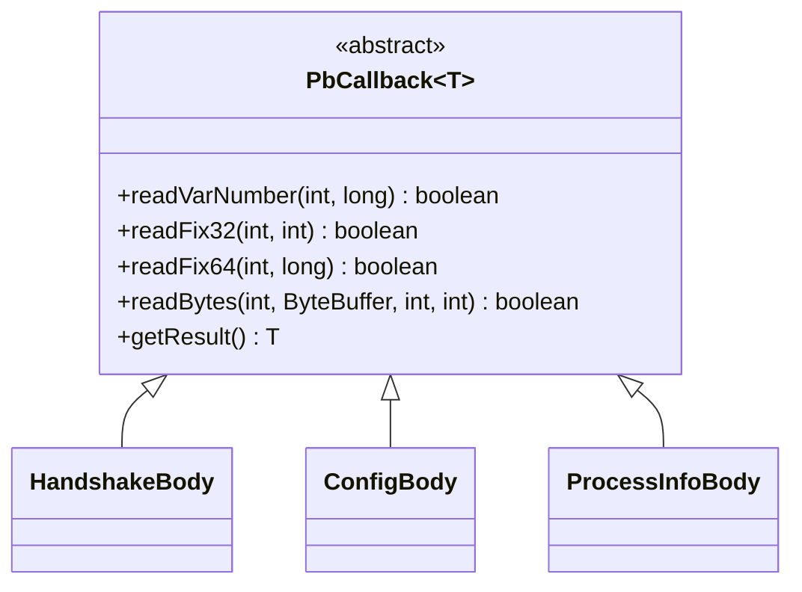
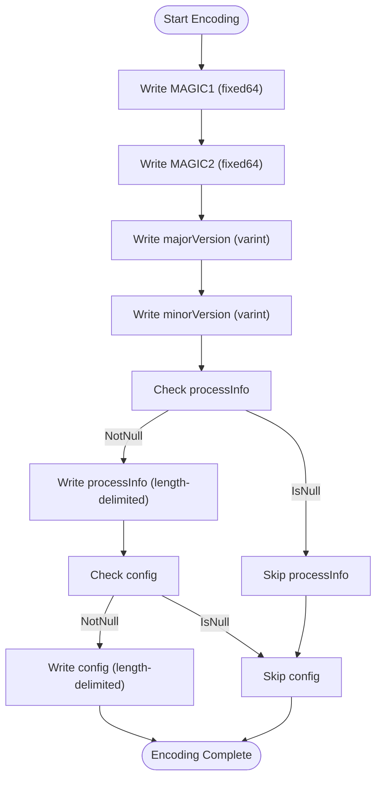
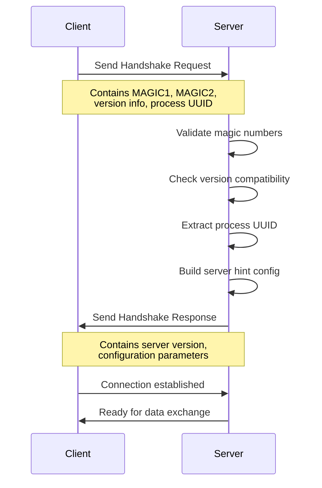
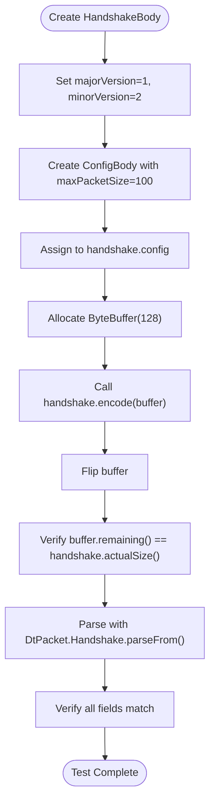
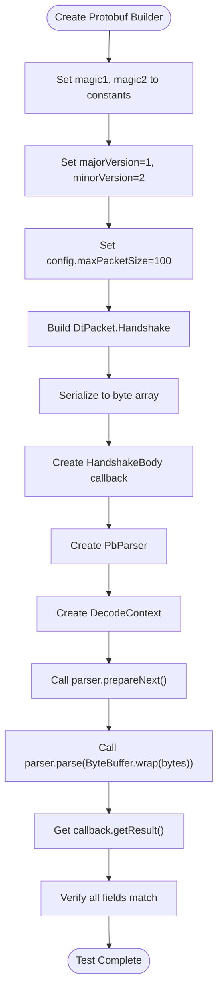
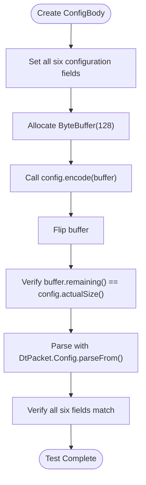

# Handshake and Connection Negotiation

<cite>
**Referenced Files in This Document**   
- [HandshakeBody.java](file://client/src/main/java/com/github/dtprj/dongting/net/HandshakeBody.java)
- [ConfigBody.java](file://client/src/main/java/com/github/dtprj/dongting/net/ConfigBody.java)
- [PbCallback.java](file://client/src/main/java/com/github/dtprj/dongting/codec/PbCallback.java)
- [SimpleEncodable.java](file://client/src/main/java/com/github/dtprj/dongting/codec/SimpleEncodable.java)
- [HandshakeProcessor.java](file://client/src/main/java/com/github/dtprj/dongting/net/HandshakeProcessor.java)
- [HandshakeBodyTest.java](file://client/src/test/java/com/github/dtprj/dongting/net/HandshakeBodyTest.java)
- [ConfigBodyTest.java](file://client/src/test/java/com/github/dtprj/dongting/net/ConfigBodyTest.java)
- [PbUtil.java](file://client/src/main/java/com/github/dtprj/dongting/codec/PbUtil.java)
- [EncodeUtil.java](file://client/src/main/java/com/github/dtprj/dongting/codec/EncodeUtil.java)
- [dt_packet.proto](file://client/src/test/proto/dt_packet.proto)
</cite>

## Table of Contents
1. [Introduction](#introduction)
2. [Handshake Protocol Overview](#handshake-protocol-overview)
3. [HandshakeBody Structure](#handshakebody-structure)
4. [ConfigBody Structure](#configbody-structure)
5. [Protobuf Encoding and Decoding](#protobuf-encoding-and-decoding)
6. [Handshake Lifecycle](#handshake-lifecycle)
7. [Security Considerations](#security-considerations)
8. [Test Cases and Examples](#test-cases-and-examples)
9. [Conclusion](#conclusion)

## Introduction
The handshake and connection negotiation system in the Dongting project establishes a secure and efficient communication channel between client and server components. This document provides a comprehensive analysis of the handshake protocol, focusing on the structure of the HandshakeBody and ConfigBody classes, the protobuf-based encoding/decoding process, and the complete handshake lifecycle. The system ensures version compatibility, configures connection parameters, and validates security through magic number verification.

## Handshake Protocol Overview
The handshake protocol serves as the initial communication phase between client and server, establishing connection parameters and verifying compatibility. The protocol uses protobuf encoding to serialize handshake data, ensuring efficient and standardized data exchange. The handshake process begins with the client sending a HandshakeBody containing magic numbers, version information, and process identification. The server validates these parameters and responds with its own configuration, completing the negotiation.

**Section sources**
- [HandshakeBody.java](file://client/src/main/java/com/github/dtprj/dongting/net/HandshakeBody.java#L28-L111)
- [HandshakeProcessor.java](file://client/src/main/java/com/github/dtprj/dongting/net/HandshakeProcessor.java#L29-L87)

## HandshakeBody Structure
The HandshakeBody class represents the core data structure used in the handshake protocol. It contains essential information for establishing a connection, including magic numbers for security validation, version information for compatibility checking, and nested configuration data.



**Diagram sources**
- [HandshakeBody.java](file://client/src/main/java/com/github/dtprj/dongting/net/HandshakeBody.java#L28-L111)
- [ProcessInfoBody.java](file://client/src/main/java/com/github/dtprj/dongting/net/HandshakeBody.java#L113-L149)

### Magic Numbers
The HandshakeBody contains two magic numbers (MAGIC1 and MAGIC2) that serve as security tokens to validate the authenticity of the connection request. These constants are defined as:
- MAGIC1: 0xAE10_9045_1C22_DA13L
- MAGIC2: 0x1CD7_D1A3_0A61_935FL

During the handshake process, the server verifies that the received magic numbers match these predefined values. If either magic number fails validation, the server throws a NetException with the message "handshake failed, magicX not match", where X is 1 or 2.

### Version Information
The handshake protocol includes version information to ensure compatibility between client and server components. The version fields are:
- majorVersion: Integer representing the major version number
- minorVersion: Integer representing the minor version number

These fields allow the system to maintain backward compatibility while supporting future protocol enhancements. The current protocol version is defined in DtUtil.RPC_MAJOR_VER (1) and DtUtil.RPC_MINOR_VER (0).

### Process Information
The ProcessInfoBody class contains UUID information that uniquely identifies the connecting process. It consists of two 64-bit values (uuid1 and uuid2) that together form a 128-bit UUID. This information allows the server to track and manage connections from different clients.

**Section sources**
- [HandshakeBody.java](file://client/src/main/java/com/github/dtprj/dongting/net/HandshakeBody.java#L30-L43)
- [HandshakeBody.java](file://client/src/main/java/com/github/dtprj/dongting/net/HandshakeBody.java#L50-L65)

## ConfigBody Structure
The ConfigBody class defines the connection parameters negotiated during the handshake process. It contains fields for configuring packet sizes, flow control limits, and other connection-specific settings.



**Diagram sources**
- [ConfigBody.java](file://client/src/main/java/com/github/dtprj/dongting/net/ConfigBody.java#L27-L92)

### Connection Parameters
The ConfigBody class contains the following configuration fields:

| Field | Type | Description |
|-------|------|-------------|
| maxPacketSize | int | Maximum size of a complete packet in bytes |
| maxBodySize | int | Maximum size of the packet body in bytes |
| maxInPending | int | Maximum number of pending incoming requests |
| maxInPendingBytes | long | Maximum number of pending incoming bytes |
| maxOutPending | int | Maximum number of pending outgoing requests |
| maxOutPendingBytes | long | Maximum number of pending outgoing bytes |

These parameters enable flow control and resource management, preventing any single connection from overwhelming the server's resources.

### Flow Control Configuration
The flow control fields (maxInPending, maxInPendingBytes, maxOutPending, maxOutPendingBytes) implement a backpressure mechanism to manage connection load. The server uses these values to limit the number of concurrent operations and the amount of data in transit. In the HandshakeProcessor, the server hint configuration sets the outgoing limits to one-eighth of the incoming limits (using right bit shift by 3), providing a conservative flow control strategy.

**Section sources**
- [ConfigBody.java](file://client/src/main/java/com/github/dtprj/dongting/net/ConfigBody.java#L36-L41)
- [HandshakeProcessor.java](file://client/src/main/java/com/github/dtprj/dongting/net/HandshakeProcessor.java#L78-L84)

## Protobuf Encoding and Decoding
The handshake protocol uses a custom protobuf implementation for efficient data serialization and deserialization. The encoding/decoding process is facilitated by the PbCallback and SimpleEncodable interfaces, along with utility classes like PbUtil and EncodeUtil.

### Encoding Interface
The SimpleEncodable interface defines the contract for objects that can be serialized to a ByteBuffer:



**Diagram sources**
- [SimpleEncodable.java](file://client/src/main/java/com/github/dtprj/dongting/codec/SimpleEncodable.java#L23-L27)
- [HandshakeBody.java](file://client/src/main/java/com/github/dtprj/dongting/net/HandshakeBody.java#L28-L111)
- [ConfigBody.java](file://client/src/main/java/com/github/dtprj/dongting/net/ConfigBody.java#L27-L92)

### Callback Mechanism
The PbCallback abstract class provides a streaming API for protobuf parsing, allowing incremental processing of data as it arrives:



**Diagram sources**
- [PbCallback.java](file://client/src/main/java/com/github/dtprj/dongting/codec/PbCallback.java#L23-L40)
- [HandshakeBody.java](file://client/src/main/java/com/github/dtprj/dongting/net/HandshakeBody.java#L28-L111)

### Encoding Process
The encoding process follows the protobuf wire format specification, using variable-length encoding for integers and length-delimited encoding for nested objects. The PbUtil class provides static methods for writing protobuf fields:



**Diagram sources**
- [PbUtil.java](file://client/src/main/java/com/github/dtprj/dongting/codec/PbUtil.java#L73-L145)
- [HandshakeBody.java](file://client/src/main/java/com/github/dtprj/dongting/net/HandshakeBody.java#L103-L109)

**Section sources**
- [PbUtil.java](file://client/src/main/java/com/github/dtprj/dongting/codec/PbUtil.java#L30-L408)
- [EncodeUtil.java](file://client/src/main/java/com/github/dtprj/dongting/codec/EncodeUtil.java#L27-L527)

## Handshake Lifecycle
The handshake lifecycle describes the complete process from client initiation to server validation and response. This sequence ensures proper connection establishment and parameter negotiation.



**Diagram sources**
- [HandshakeProcessor.java](file://client/src/main/java/com/github/dtprj/dongting/net/HandshakeProcessor.java#L38-L75)
- [DtChannelImpl.java](file://client/src/main/java/com/github/dtprj/dongting/net/DtChannelImpl.java#L134-L154)

### Client Initiation
The client initiates the handshake by creating a HandshakeBody instance and populating it with the required fields:
1. Set MAGIC1 and MAGIC2 to their predefined values
2. Set majorVersion and minorVersion to current protocol versions
3. Create ProcessInfoBody with a generated UUID
4. Optionally include ConfigBody with client preferences
5. Serialize the HandshakeBody using protobuf encoding

### Server Validation
The server validates the handshake request through the HandshakeProcessor:
1. Verify that MAGIC1 and MAGIC2 match expected values
2. Check that the version is compatible with the server
3. Validate that processInfo contains a valid UUID
4. Extract the remote UUID for connection tracking
5. Generate a response with server configuration

If any validation step fails, the server closes the connection to prevent unauthorized access.

**Section sources**
- [HandshakeProcessor.java](file://client/src/main/java/com/github/dtprj/dongting/net/HandshakeProcessor.java#L44-L57)
- [HandshakeBody.java](file://client/src/main/java/com/github/dtprj/dongting/net/HandshakeBody.java#L50-L63)

## Security Considerations
The handshake protocol incorporates several security measures to protect against unauthorized access and ensure connection integrity.

### Magic Number Verification
The magic numbers (MAGIC1 and MAGIC2) serve as a simple but effective authentication mechanism. By requiring specific 64-bit values, the protocol prevents random or malformed packets from initiating a connection. The verification occurs in the readFix64 method of HandshakeBody:

```java
@Override
public boolean readFix64(int index, long value) {
    switch (index) {
        case IDX_MAGIC1:
            if (value != MAGIC1) {
                throw new NetException("handshake failed, magic1 not match");
            }
            break;
        case IDX_MAGIC2:
            if (value != MAGIC2) {
                throw new NetException("handshake failed, magic2 not match");
            }
            break;
    }
    return true;
}
```

This immediate validation ensures that any packet with incorrect magic numbers is rejected before further processing.

### Version Compatibility
The version fields (majorVersion and minorVersion) enable the system to maintain backward compatibility while supporting protocol evolution. The server can reject connections from clients with incompatible versions, preventing potential security vulnerabilities from outdated clients.

### UUID-Based Identification
The use of UUIDs for process identification allows the server to uniquely track each connecting client. This prevents session hijacking and enables proper connection management.

**Section sources**
- [HandshakeBody.java](file://client/src/main/java/com/github/dtprj/dongting/net/HandshakeBody.java#L50-L63)
- [HandshakeProcessor.java](file://client/src/main/java/com/github/dtprj/dongting/net/HandshakeProcessor.java#L51-L57)

## Test Cases and Examples
The test cases demonstrate the proper encoding and decoding workflow for the handshake protocol, validating both successful and failure scenarios.

### Handshake Encoding Test
The HandshakeBodyTest.testEncode method verifies the encoding process:



**Diagram sources**
- [HandshakeBodyTest.java](file://client/src/test/java/com/github/dtprj/dongting/net/HandshakeBodyTest.java#L58-L75)

### Handshake Decoding Test
The HandshakeBodyTest.testDecode method verifies the decoding process:



**Diagram sources**
- [HandshakeBodyTest.java](file://client/src/test/java/com/github/dtprj/dongting/net/HandshakeBodyTest.java#L32-L54)

### Configuration Test
The ConfigBodyTest class provides comprehensive testing for the configuration parameters:



These tests ensure that all configuration parameters are properly encoded and decoded, maintaining data integrity throughout the handshake process.

**Section sources**
- [HandshakeBodyTest.java](file://client/src/test/java/com/github/dtprj/dongting/net/HandshakeBodyTest.java#L31-L77)
- [ConfigBodyTest.java](file://client/src/test/java/com/github/dtprj/dongting/net/ConfigBodyTest.java#L31-L82)

## Conclusion
The handshake and connection negotiation system in the Dongting project provides a robust mechanism for establishing secure and efficient communication channels. By using protobuf encoding with custom magic numbers, version validation, and comprehensive configuration parameters, the system ensures compatibility, security, and optimal performance. The implementation demonstrates careful attention to detail in both the protocol design and its execution, with thorough testing validating all aspects of the handshake process. This foundation enables reliable distributed communication across the Dongting ecosystem.