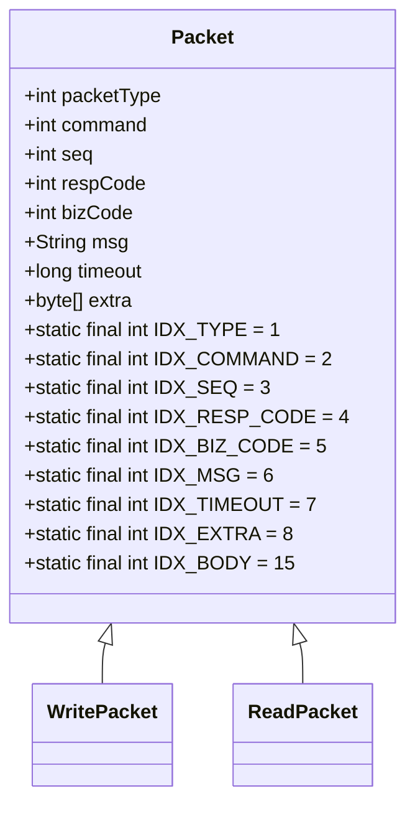
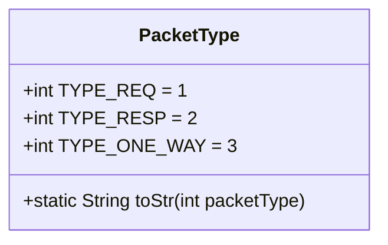
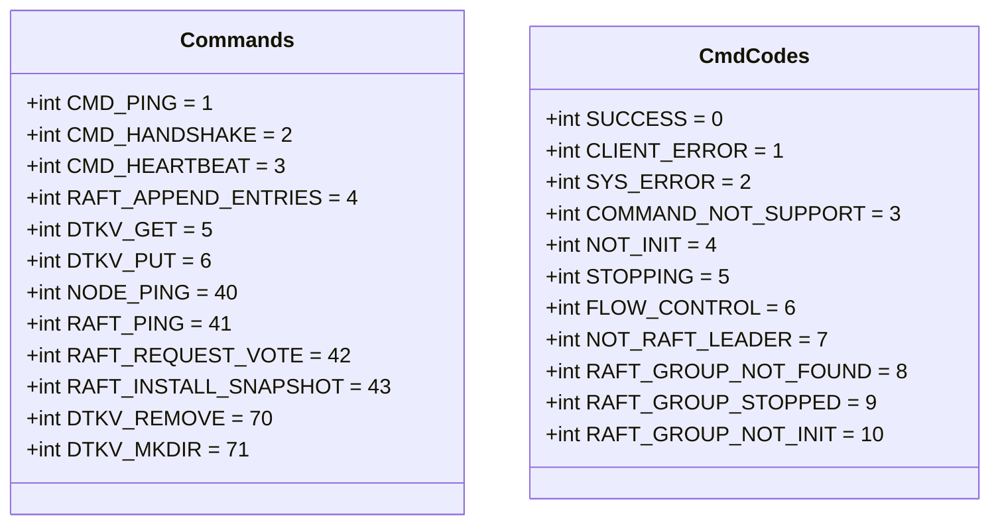
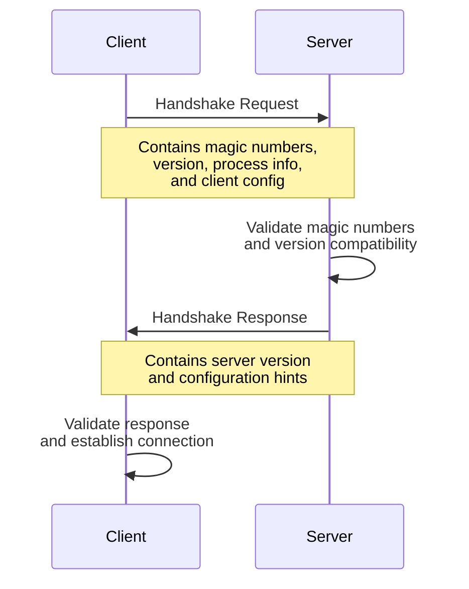
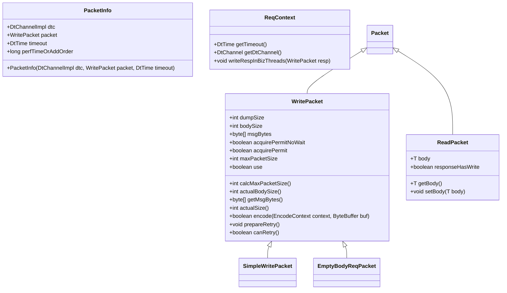
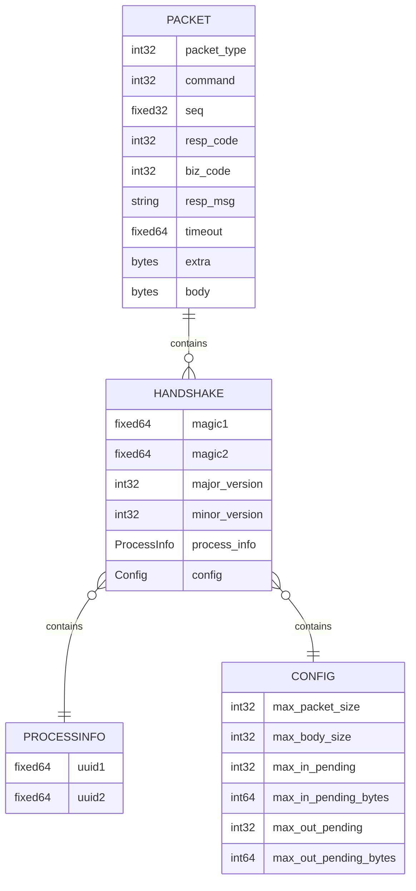

# Packet Structure and Protocol

<cite>
**Referenced Files in This Document**   
- [Packet.java](file://client/src/main/java/com/github/dtprj/dongting/net/Packet.java)
- [PacketType.java](file://client/src/main/java/com/github/dtprj/dongting/net/PacketType.java)
- [Commands.java](file://client/src/main/java/com/github/dtprj/dongting/net/Commands.java)
- [CmdCodes.java](file://client/src/main/java/com/github/dtprj/dongting/net/CmdCodes.java)
- [HandshakeBody.java](file://client/src/main/java/com/github/dtprj/dongting/net/HandshakeBody.java)
- [ConfigBody.java](file://client/src/main/java/com/github/dtprj/dongting/net/ConfigBody.java)
- [PacketInfo.java](file://client/src/main/java/com/github/dtprj/dongting/net/PacketInfo.java)
- [WritePacket.java](file://client/src/main/java/com/github/dtprj/dongting/net/WritePacket.java)
- [ReadPacket.java](file://client/src/main/java/com/github/dtprj/dongting/net/ReadPacket.java)
- [HandshakeProcessor.java](file://client/src/main/java/com/github/dtprj/dongting/net/HandshakeProcessor.java)
- [dt_packet.proto](file://client/src/test/proto/dt_packet.proto)
- [DtChannelImpl.java](file://client/src/main/java/com/github/dtprj/dongting/net/DtChannelImpl.java)
- [ReqContext.java](file://client/src/main/java/com/github/dtprj/dongting/net/ReqContext.java)
- [SimpleWritePacket.java](file://client/src/main/java/com/github/dtprj/dongting/net/SimpleWritePacket.java)
- [EmptyBodyReqPacket.java](file://client/src/main/java/com/github/dtprj/dongting/net/EmptyBodyReqPacket.java)
- [DtUtil.java](file://client/src/main/java/com/github/dtprj/dongting/common/DtUtil.java)
</cite>

## Table of Contents
1. [Introduction](#introduction)
2. [Packet Structure](#packet-structure)
3. [Packet Type Enumeration](#packet-type-enumeration)
4. [Command System](#command-system)
5. [Handshake Protocol](#handshake-protocol)
6. [Packet Lifecycle and Metadata](#packet-lifecycle-and-metadata)
7. [Wire Format and Encoding](#wire-format-and-encoding)
8. [Versioning and Compatibility](#versioning-and-compatibility)

## Introduction
This document provides comprehensive documentation for Dongting's network packet structure and communication protocol. The system implements a binary protocol based on Protocol Buffers for efficient network communication between distributed components. The packet structure supports request-response patterns, one-way messaging, and connection negotiation through a handshake mechanism. The design emphasizes performance, backward compatibility, and extensibility for distributed systems communication.

## Packet Structure

The Packet class serves as the base abstraction for all network messages in the Dongting system. It defines the core fields that are present in every packet transmitted across the network. The abstract Packet class extends DtCleanable, indicating that packet instances require explicit resource cleanup to prevent memory leaks.

Key fields in the Packet structure include:
- **packetType**: Indicates the packet category (request, response, or one-way) using PacketType constants
- **command**: Specifies the operation to be performed using Commands interface constants
- **seq**: Sequence number for request-response correlation and ordering
- **respCode**: Response status code from CmdCodes enumeration
- **bizCode**: Business-specific error or status code
- **msg**: Human-readable message for debugging or error reporting
- **timeout**: Timeout value in milliseconds for request operations
- **extra**: Arbitrary binary data for protocol extensions

The Packet class also defines constant index values (IDX_TYPE, IDX_COMMAND, IDX_SEQ, etc.) that correspond to Protocol Buffer field numbers in the wire format, ensuring consistent serialization and deserialization.



**Diagram sources**
- [Packet.java](file://client/src/main/java/com/github/dtprj/dongting/net/Packet.java#L28-L37)

**Section sources**
- [Packet.java](file://client/src/main/java/com/github/dtprj/dongting/net/Packet.java#L38-L46)

## Packet Type Enumeration

The PacketType interface defines constants for distinguishing between different packet patterns in the communication protocol. This enumeration enables the system to handle different message semantics appropriately, such as expecting a response or processing one-way notifications.

The three packet types are:
- **TYPE_REQ (1)**: Request packet that expects a response from the recipient
- **TYPE_RESP (2)**: Response packet sent in reply to a request
- **TYPE_ONE_WAY (3)**: One-way message that does not require a response

The interface also provides a utility method `toStr(int packetType)` that converts packet type constants to human-readable string representations ("REQ", "RESP", "ONE_WAY", or "UNKNOWN" for invalid values). This facilitates logging and debugging of packet flows.



**Diagram sources**
- [PacketType.java](file://client/src/main/java/com/github/dtprj/dongting/net/PacketType.java#L7-L9)

**Section sources**
- [PacketType.java](file://client/src/main/java/com/github/dtprj/dongting/net/PacketType.java#L6-L24)

## Command System

### Commands Interface
The Commands interface defines a comprehensive set of command codes for various operations across the Dongting system. These constants are used in the packet's command field to identify the specific operation being requested or responded to. The command codes are organized into ranges to optimize Protocol Buffer encoding:

- **1-15**: Most common commands (encoded in 1 byte in Protocol Buffers)
- **16-39**: RPC-related commands
- **40-69**: Raft consensus algorithm commands
- **70-99**: DT-KV (distributed key-value store) commands

Key commands include:
- CMD_PING (1): Heartbeat and connectivity check
- CMD_HANDSHAKE (2): Connection establishment
- CMD_HEARTBEAT (3): Periodic liveness signal
- RAFT_APPEND_ENTRIES (4): Raft consensus log replication
- DTKV_GET (5), DTKV_PUT (6): Key-value store operations
- Various administrative commands for cluster management

### Response Status Codes
The CmdCodes interface defines standardized response codes for indicating the outcome of command processing. These codes provide a consistent way to communicate success or failure conditions across the distributed system:

- **SUCCESS (0)**: Operation completed successfully
- **CLIENT_ERROR (1)**: Client-side error
- **SYS_ERROR (2)**: System-level error
- **COMMAND_NOT_SUPPORT (3)**: Requested command not supported
- **NOT_INIT (4)**: System not initialized
- **STOPPING (5)**: System is shutting down
- **FLOW_CONTROL (6)**: Flow control triggered
- **NOT_RAFT_LEADER (7)**: Node is not the Raft leader
- **RAFT_GROUP_NOT_FOUND (8)**: Raft group does not exist
- **RAFT_GROUP_STOPPED (9)**: Raft group is stopped
- **RAFT_GROUP_NOT_INIT (10)**: Raft group not initialized



**Diagram sources**
- [Commands.java](file://client/src/main/java/com/github/dtprj/dongting/net/Commands.java#L23-L69)
- [CmdCodes.java](file://client/src/main/java/com/github/dtprj/dongting/net/CmdCodes.java#L22-L33)

**Section sources**
- [Commands.java](file://client/src/main/java/com/github/dtprj/dongting/net/Commands.java#L21-L70)
- [CmdCodes.java](file://client/src/main/java/com/github/dtprj/dongting/net/CmdCodes.java#L21-L34)

## Handshake Protocol

The handshake protocol establishes connections between Dongting nodes and negotiates communication parameters. It uses a structured exchange with magic numbers for protocol identification, version information for compatibility checking, and configuration parameters for performance tuning.

### Handshake Structure
The handshake process uses the HandshakeBody class which contains:
- **MAGIC1 and MAGIC2**: 64-bit magic numbers (0xAE10_9045_1C22_DA13L and 0x1CD7_D1A3_0A61_935FL) that identify the Dongting protocol
- **majorVersion and minorVersion**: Protocol version numbers for compatibility checking
- **processInfo**: Process identification information including UUID1 and UUID2
- **config**: Configuration parameters for flow control and resource limits

### Connection Negotiation
The handshake occurs at the beginning of a connection, with the client sending a request and the server responding. The server validates the magic numbers and version compatibility before accepting the connection. The process ensures that both endpoints are running compatible versions of the protocol.

### Parameter Tuning
The ConfigBody class carries configuration parameters that optimize communication based on the capabilities of both endpoints:
- **maxPacketSize**: Maximum size of a single packet
- **maxBodySize**: Maximum size of the packet body
- **maxInPending**: Maximum number of pending incoming requests
- **maxInPendingBytes**: Maximum bytes of pending incoming requests
- **maxOutPending**: Maximum number of pending outgoing requests
- **maxOutPendingBytes**: Maximum bytes of pending outgoing requests

The handshake processor (HandshakeProcessor) handles the server-side processing of handshake requests, validating the incoming handshake and generating an appropriate response with server configuration hints.



**Diagram sources**
- [HandshakeBody.java](file://client/src/main/java/com/github/dtprj/dongting/net/HandshakeBody.java#L30-L31)
- [ConfigBody.java](file://client/src/main/java/com/github/dtprj/dongting/net/ConfigBody.java#L36-L41)
- [HandshakeProcessor.java](file://client/src/main/java/com/github/dtprj/dongting/net/HandshakeProcessor.java#L29-L88)

**Section sources**
- [HandshakeBody.java](file://client/src/main/java/com/github/dtprj/dongting/net/HandshakeBody.java#L28-L151)
- [ConfigBody.java](file://client/src/main/java/com/github/dtprj/dongting/net/ConfigBody.java#L27-L93)
- [HandshakeProcessor.java](file://client/src/main/java/com/github/dtprj/dongting/net/HandshakeProcessor.java#L29-L88)

## Packet Lifecycle and Metadata

### Packet Inheritance Hierarchy
The packet system uses an inheritance hierarchy to differentiate between outgoing and incoming packets:
- **WritePacket**: Base class for packets being sent (extending Packet and Encodable)
- **ReadPacket**: Class for packets being received (extending Packet)

WritePacket adds encoding capabilities and state management for the transmission process, while ReadPacket includes fields for processing received messages.

### PacketInfo for Request Tracking
The PacketInfo class plays a crucial role in tracking request metadata throughout the packet lifecycle. It maintains:
- **dtc**: Reference to the DtChannelImpl associated with the packet
- **packet**: The WritePacket being transmitted
- **timeout**: Deadline for the operation
- **perfTimeOrAddOrder**: Performance tracking or ordering information

PacketInfo instances are used by the I/O system to manage pending requests, handle timeouts, and correlate responses with their corresponding requests.

### Request Context
The ReqContext interface provides a mechanism for processing requests and sending responses. It includes methods for:
- Getting the operation timeout
- Accessing the associated DtChannel
- Writing responses from business threads

The ReqContextImpl class implements this interface, providing the concrete functionality needed during request processing.



**Diagram sources**
- [WritePacket.java](file://client/src/main/java/com/github/dtprj/dongting/net/WritePacket.java#L30-L182)
- [ReadPacket.java](file://client/src/main/java/com/github/dtprj/dongting/net/ReadPacket.java#L23-L45)
- [PacketInfo.java](file://client/src/main/java/com/github/dtprj/dongting/net/PacketInfo.java#L23-L37)
- [ReqContext.java](file://client/src/main/java/com/github/dtprj/dongting/net/ReqContext.java#L23-L32)

**Section sources**
- [WritePacket.java](file://client/src/main/java/com/github/dtprj/dongting/net/WritePacket.java#L30-L182)
- [ReadPacket.java](file://client/src/main/java/com/github/dtprj/dongting/net/ReadPacket.java#L23-L45)
- [PacketInfo.java](file://client/src/main/java/com/github/dtprj/dongting/net/PacketInfo.java#L23-L37)
- [ReqContext.java](file://client/src/main/java/com/github/dtprj/dongting/net/ReqContext.java#L23-L32)

## Wire Format and Encoding

### Protocol Buffer Schema
The wire format is defined by the Protocol Buffer schema in dt_packet.proto, which specifies the structure of packets on the wire:

```protobuf
message Packet {
  int32 packet_type = 1;
  int32 command = 2;
  fixed32 seq = 3;
  int32 resp_code = 4;
  int32 biz_code = 5;
  string resp_msg = 6;
  fixed64 timeout = 7;
  bytes extra = 8;
  bytes body = 15;
}
```

The schema uses efficient field types:
- **fixed32/fixed64**: Fixed-size integers for consistent encoding
- **int32**: Variable-length integers optimized for small values
- **string/bytes**: UTF-8 encoded strings and arbitrary binary data

### Encoding Process
The WritePacket class implements a two-phase encoding process:
1. **Header encoding**: Write the packet length and all header fields (packet_type, command, seq, etc.)
2. **Body encoding**: Write the packet body using the encodeBody method

The encoding is stateful, with status tracking (STATUS_INIT, STATUS_HEADER_ENCODE_FINISHED, STATUS_ENCODE_FINISHED) to support partial encoding when buffer space is limited.

### Length-Prefixed Framing
Packets are transmitted using length-prefixed framing, where the first 4 bytes contain the length of the remaining packet data (not including the length field itself). This enables the receiver to determine how many bytes to read for each complete packet.

### Field Size Optimization
The system optimizes field sizes based on usage patterns:
- Sequence numbers use fixed32 (4 bytes) for consistent size
- Command codes use int32 with values 1-15 encoded in 1 byte
- Timeout values use fixed64 (8 bytes) for consistent encoding
- Response codes and business codes use int32



**Diagram sources**
- [dt_packet.proto](file://client/src/test/proto/dt_packet.proto#L18-L28)
- [HandshakeBody.java](file://client/src/main/java/com/github/dtprj/dongting/net/HandshakeBody.java#L30-L38)
- [ConfigBody.java](file://client/src/main/java/com/github/dtprj/dongting/net/ConfigBody.java#L29-L35)

**Section sources**
- [dt_packet.proto](file://client/src/test/proto/dt_packet.proto#L16-L62)
- [WritePacket.java](file://client/src/main/java/com/github/dtprj/dongting/net/WritePacket.java#L113-L164)

## Versioning and Compatibility

### Protocol Versioning
The Dongting protocol implements a versioning system to ensure backward compatibility between different versions of the software. The version information is exchanged during the handshake process:

- **RPC_MAJOR_VER**: Major version number (currently 1)
- **RPC_MINOR_VER**: Minor version number (currently 0)

These constants are defined in DtUtil.java and are used to validate compatibility during connection establishment. The system follows semantic versioning principles where:
- Major version increments indicate backward-incompatible changes
- Minor version increments indicate backward-compatible additions

### Backward Compatibility
The design incorporates several features to maintain backward compatibility:
- **Reserved field numbers**: The Protocol Buffer schema leaves field numbers 9-14 available for future use
- **Graceful degradation**: Systems can negotiate capabilities during handshake
- **Extensible fields**: The 'extra' field in Packet allows for protocol extensions without schema changes
- **Version negotiation**: The handshake process allows endpoints to agree on the highest mutually supported version

### Future Extensibility
The architecture supports future extensions through:
- **Modular command ranges**: Commands are organized by functionality, allowing new command types to be added
- **Configurable parameters**: The ConfigBody allows endpoints to advertise their capabilities
- **Flexible body structure**: The 'body' field can contain any serialized data structure
- **Magic numbers**: Protocol identification enables detection of incompatible implementations

The versioning system ensures that as the protocol evolves, older clients can continue to operate with newer servers (within major version compatibility), and vice versa, enabling gradual upgrades in distributed environments.

**Section sources**
- [DtUtil.java](file://client/src/main/java/com/github/dtprj/dongting/common/DtUtil.java#L33-L34)
- [HandshakeBody.java](file://client/src/main/java/com/github/dtprj/dongting/net/HandshakeBody.java#L40-L42)
- [dt_packet.proto](file://client/src/test/proto/dt_packet.proto#L16-L17)