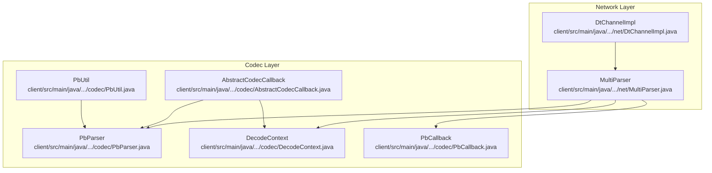
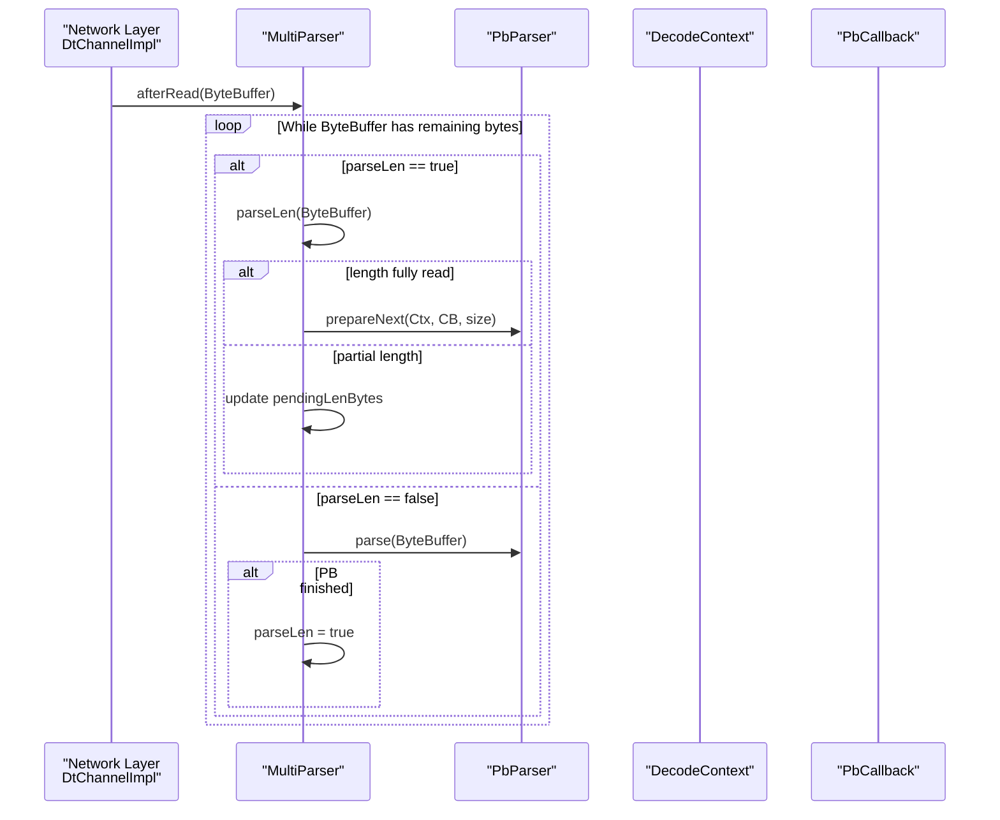
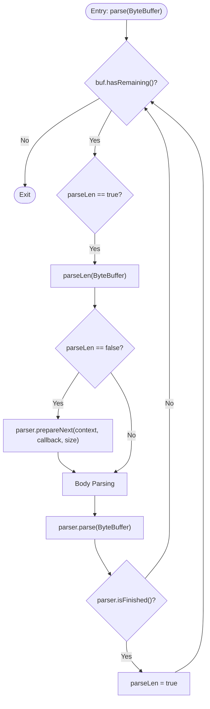
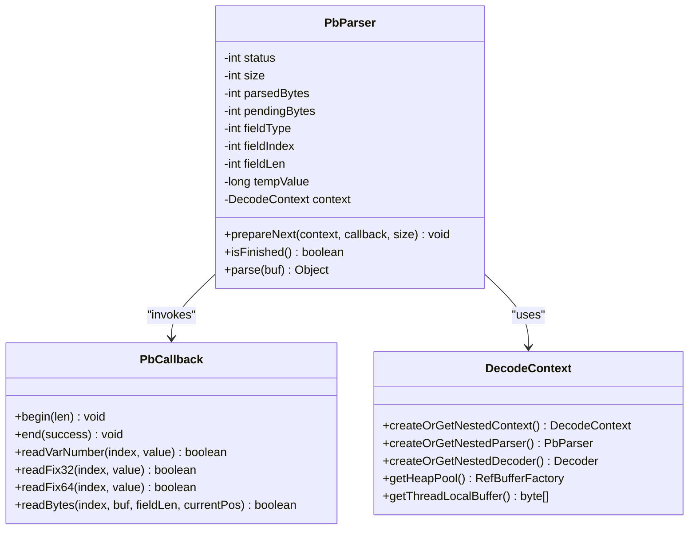
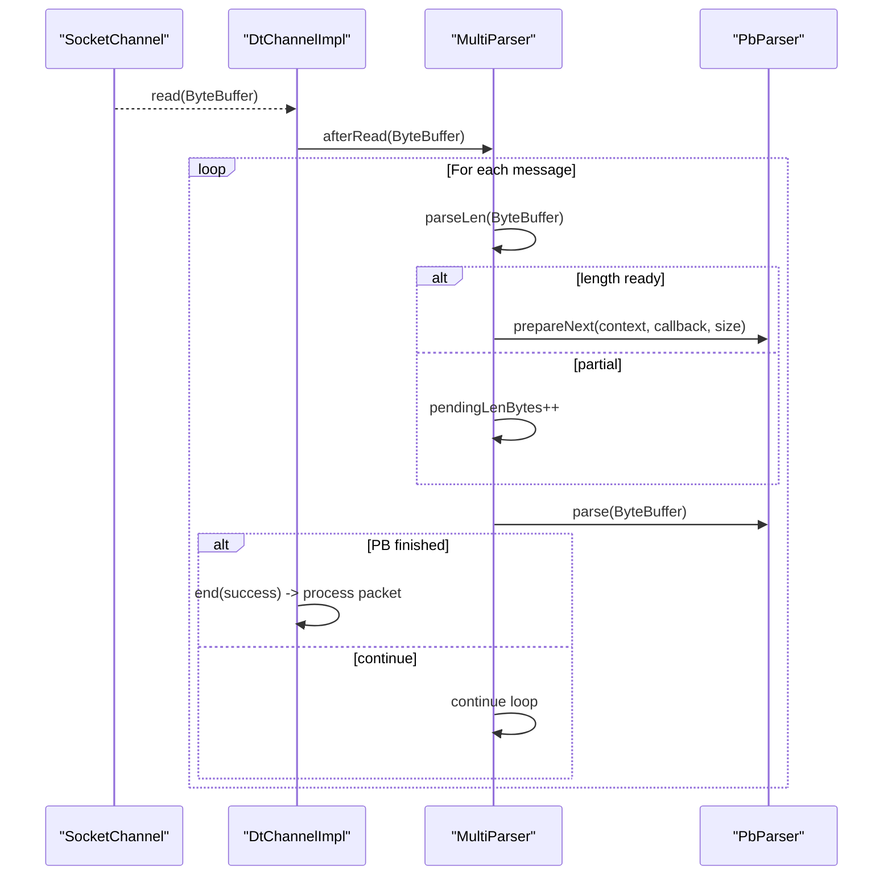
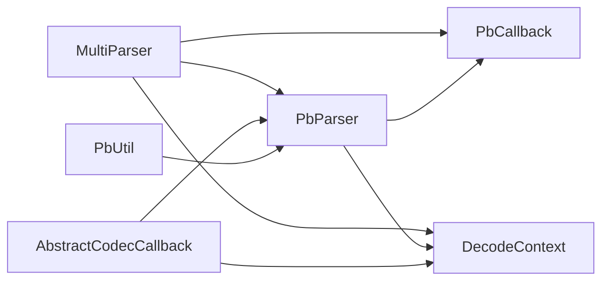

# Multi-Message Parser

<cite>
**Referenced Files in This Document**
- [MultiParser.java](file://client/src/main/java/com/github/dtprj/dongting/net/MultiParser.java)
- [PbParser.java](file://client/src/main/java/com/github/dtprj/dongting/codec/PbParser.java)
- [DecodeContext.java](file://client/src/main/java/com/github/dtprj/dongting/codec/DecodeContext.java)
- [PbCallback.java](file://client/src/main/java/com/github/dtprj/dongting/codec/PbCallback.java)
- [AbstractCodecCallback.java](file://client/src/main/java/com/github/dtprj/dongting/codec/AbstractCodecCallback.java)
- [PbUtil.java](file://client/src/main/java/com/github/dtprj/dongting/codec/PbUtil.java)
- [DtChannelImpl.java](file://client/src/main/java/com/github/dtprj/dongting/net/DtChannelImpl.java)
- [MultiParserTest.java](file://client/src/test/java/com/github/dtprj/dongting/net/MultiParserTest.java)
</cite>

## Table of Contents
1. [Introduction](#introduction)
2. [Project Structure](#project-structure)
3. [Core Components](#core-components)
4. [Architecture Overview](#architecture-overview)
5. [Detailed Component Analysis](#detailed-component-analysis)
6. [Dependency Analysis](#dependency-analysis)
7. [Performance Considerations](#performance-considerations)
8. [Troubleshooting Guide](#troubleshooting-guide)
9. [Conclusion](#conclusion)
10. [Appendices](#appendices)

## Introduction
This document explains Dongting’s MultiParser implementation, which efficiently parses multiple protocol buffer messages from a single connection stream. It works by first reading a 4-byte length prefix (big-endian) from the raw byte stream, then delegating the remaining protobuf content to a PbParser instance. The design supports streaming, partial reads, and high throughput by avoiding buffering entire messages.

Key capabilities:
- Parses multiple messages sequentially from a single ByteBuffer slice.
- Handles partial length header reads using a pending counter.
- Integrates with DecodeContext and PbCallback for message-specific processing.
- Enforces a configurable maximum message size to prevent memory exhaustion.
- Enables efficient boundary detection without full-buffering, suitable for high-throughput scenarios.

## Project Structure
The MultiParser lives in the network layer and collaborates with codec utilities and parsers:
- Network layer: MultiParser, channel integration
- Codec layer: PbParser, DecodeContext, PbCallback, PbUtil
- Tests: MultiParserTest validates behavior and edge cases

**Diagram sources**
- [MultiParser.java](file://client/src/main/java/com/github/dtprj/dongting/net/MultiParser.java#L1-L97)
- [PbParser.java](file://client/src/main/java/com/github/dtprj/dongting/codec/PbParser.java#L1-L437)
- [DecodeContext.java](file://client/src/main/java/com/github/dtprj/dongting/codec/DecodeContext.java#L1-L168)
- [PbCallback.java](file://client/src/main/java/com/github/dtprj/dongting/codec/PbCallback.java#L1-L41)
- [AbstractCodecCallback.java](file://client/src/main/java/com/github/dtprj/dongting/codec/AbstractCodecCallback.java#L1-L210)
- [PbUtil.java](file://client/src/main/java/com/github/dtprj/dongting/codec/PbUtil.java#L1-L200)
- [DtChannelImpl.java](file://client/src/main/java/com/github/dtprj/dongting/net/DtChannelImpl.java#L1-L200)

**Section sources**
- [MultiParser.java](file://client/src/main/java/com/github/dtprj/dongting/net/MultiParser.java#L1-L97)
- [PbParser.java](file://client/src/main/java/com/github/dtprj/dongting/codec/PbParser.java#L1-L437)
- [DecodeContext.java](file://client/src/main/java/com/github/dtprj/dongting/codec/DecodeContext.java#L1-L168)
- [PbCallback.java](file://client/src/main/java/com/github/dtprj/dongting/codec/PbCallback.java#L1-L41)
- [AbstractCodecCallback.java](file://client/src/main/java/com/github/dtprj/dongting/codec/AbstractCodecCallback.java#L1-L210)
- [PbUtil.java](file://client/src/main/java/com/github/dtprj/dongting/codec/PbUtil.java#L1-L200)
- [DtChannelImpl.java](file://client/src/main/java/com/github/dtprj/dongting/net/DtChannelImpl.java#L1-L200)

## Core Components
- MultiParser: orchestrates length-prefix parsing and delegates to PbParser for protobuf content. Manages state via parseLen flag and pendingLenBytes.
- PbParser: incremental protobuf decoder with state machine, varint parsing, and field body handling.
- DecodeContext: reusable context for nested decoders/parsers, caching and pooling.
- PbCallback: callback interface for message-specific processing hooks.
- AbstractCodecCallback: shared helpers for UTF-8 parsing, nested decoding, and buffer management.
- PbUtil: protobuf encoding utilities used in tests and examples.

**Section sources**
- [MultiParser.java](file://client/src/main/java/com/github/dtprj/dongting/net/MultiParser.java#L28-L97)
- [PbParser.java](file://client/src/main/java/com/github/dtprj/dongting/codec/PbParser.java#L26-L120)
- [DecodeContext.java](file://client/src/main/java/com/github/dtprj/dongting/codec/DecodeContext.java#L26-L120)
- [PbCallback.java](file://client/src/main/java/com/github/dtprj/dongting/codec/PbCallback.java#L1-L41)
- [AbstractCodecCallback.java](file://client/src/main/java/com/github/dtprj/dongting/codec/AbstractCodecCallback.java#L32-L120)
- [PbUtil.java](file://client/src/main/java/com/github/dtprj/dongting/codec/PbUtil.java#L30-L120)

## Architecture Overview
MultiParser sits between the network layer and PbParser. The network layer feeds ByteBuffer slices to MultiParser. MultiParser alternates between:
1) Length-prefix parsing (4 bytes, big-endian) with support for partial reads.
2) Protobuf content parsing via PbParser configured by DecodeContext and PbCallback.

**Diagram sources**
- [MultiParser.java](file://client/src/main/java/com/github/dtprj/dongting/net/MultiParser.java#L45-L91)
- [PbParser.java](file://client/src/main/java/com/github/dtprj/dongting/codec/PbParser.java#L76-L120)
- [DtChannelImpl.java](file://client/src/main/java/com/github/dtprj/dongting/net/DtChannelImpl.java#L106-L111)

## Detailed Component Analysis

### MultiParser: Streaming Length-Prefix and Body Parsing
Responsibilities:
- Maintain parseLen flag to alternate between length and body parsing.
- Track pendingLenBytes for partial length reads.
- Validate message size against maxSize.
- Configure PbParser via prepareNext for each message.

Internal state:
- parseLen: true when expecting length prefix; false when parsing protobuf body.
- pendingLenBytes: number of remaining length bytes to read (0..3).
- size: decoded message length (from 4-byte big-endian prefix).

parse(ByteBuffer) loop:
- Continues while ByteBuffer has remaining bytes.
- If parseLen is true, calls parseLen to read 4 bytes (big-endian) or partial bytes.
- On completion of length read, calls parser.prepareNext(context, callback, size).
- Otherwise, delegates to parser.parse(ByteBuffer) and checks parser.isFinished() to reset for next message.

parseLen(ByteBuffer):
- If pendingLenBytes is 0 and 4 bytes available, reads 32-bit integer directly.
- Otherwise, accumulates bytes into size using big-endian order until 4 bytes are collected.
- Validates size against maxSize and throws on overflow.
- Sets parseLen=false upon completion.

prepareNext() integration:
- Called by MultiParser after length is fully read.
- PbParser.prepareNext(configures size, resets state, wires DecodeContext and PbCallback.

Edge cases handled:
- Partial reads of length prefix.
- Oversized messages rejected early with PbException.
- Loop exits promptly when more data is needed for length.

**Diagram sources**
- [MultiParser.java](file://client/src/main/java/com/github/dtprj/dongting/net/MultiParser.java#L45-L91)
- [PbParser.java](file://client/src/main/java/com/github/dtprj/dongting/codec/PbParser.java#L76-L120)

**Section sources**
- [MultiParser.java](file://client/src/main/java/com/github/dtprj/dongting/net/MultiParser.java#L28-L97)
- [MultiParserTest.java](file://client/src/test/java/com/github/dtprj/dongting/net/MultiParserTest.java#L67-L164)

### PbParser: Incremental Protobuf Decoder
Responsibilities:
- Implements a state machine to parse protobuf messages incrementally.
- Supports varint, fixed-size integers, and length-delimited fields.
- Tracks parsedBytes and pendingBytes to handle partial reads.
- Invokes PbCallback hooks for each field type.

Key behaviors:
- prepareNext(context, callback, size): initializes state, wires context and callback, resets counters.
- parse(ByteBuffer): loops through states, parsing tags, lengths, and field bodies.
- isFinished(): indicates completion or skipping.
- callBegin/callEnd: lifecycle hooks invoked by PbCallback.

**Diagram sources**
- [PbParser.java](file://client/src/main/java/com/github/dtprj/dongting/codec/PbParser.java#L26-L120)
- [PbCallback.java](file://client/src/main/java/com/github/dtprj/dongting/codec/PbCallback.java#L1-L41)
- [DecodeContext.java](file://client/src/main/java/com/github/dtprj/dongting/codec/DecodeContext.java#L26-L120)

**Section sources**
- [PbParser.java](file://client/src/main/java/com/github/dtprj/dongting/codec/PbParser.java#L26-L120)
- [PbParser.java](file://client/src/main/java/com/github/dtprj/dongting/codec/PbParser.java#L115-L180)
- [PbParser.java](file://client/src/main/java/com/github/dtprj/dongting/codec/PbParser.java#L189-L277)
- [PbParser.java](file://client/src/main/java/com/github/dtprj/dongting/codec/PbParser.java#L333-L436)

### DecodeContext and PbCallback Integration
- DecodeContext: provides pooled buffers, nested parser/decoder creation, and caching of frequently used callbacks. It also exposes a thread-local buffer for small payloads.
- PbCallback: defines the contract for message-specific processing. The network layer typically extends PbCallback to implement begin/end and field handlers.
- AbstractCodecCallback: offers shared helpers for UTF-8 parsing, nested decoding, and buffer management. It coordinates nested parsing via PbParser.prepareNext and verifies completion boundaries.

Integration points:
- MultiParser constructs PbParser and passes DecodeContext and PbCallback to PbParser.prepareNext.
- In higher-level channels, PbCallback is extended to populate message structures and route to processors.

**Section sources**
- [DecodeContext.java](file://client/src/main/java/com/github/dtprj/dongting/codec/DecodeContext.java#L26-L120)
- [PbCallback.java](file://client/src/main/java/com/github/dtprj/dongting/codec/PbCallback.java#L1-L41)
- [AbstractCodecCallback.java](file://client/src/main/java/com/github/dtprj/dongting/codec/AbstractCodecCallback.java#L120-L176)
- [AbstractCodecCallback.java](file://client/src/main/java/com/github/dtprj/dongting/codec/AbstractCodecCallback.java#L156-L176)

### Network Integration: DtChannelImpl
- Creates MultiParser with a PbCallback (itself) and a max packet size from configuration.
- Calls parser.parse(buf) in afterRead to process incoming ByteBuffer slices.
- Implements PbCallback hooks to construct ReadPacket, select processors, and route requests/responses.

**Diagram sources**
- [DtChannelImpl.java](file://client/src/main/java/com/github/dtprj/dongting/net/DtChannelImpl.java#L96-L111)
- [MultiParser.java](file://client/src/main/java/com/github/dtprj/dongting/net/MultiParser.java#L45-L91)
- [PbParser.java](file://client/src/main/java/com/github/dtprj/dongting/codec/PbParser.java#L76-L120)

**Section sources**
- [DtChannelImpl.java](file://client/src/main/java/com/github/dtprj/dongting/net/DtChannelImpl.java#L96-L111)
- [DtChannelImpl.java](file://client/src/main/java/com/github/dtprj/dongting/net/DtChannelImpl.java#L118-L155)
- [DtChannelImpl.java](file://client/src/main/java/com/github/dtprj/dongting/net/DtChannelImpl.java#L200-L260)

## Dependency Analysis
- MultiParser depends on PbParser, DecodeContext, and PbCallback.
- PbParser depends on PbCallback and DecodeContext for lifecycle and nested parsing.
- AbstractCodecCallback depends on DecodeContext for pooled buffers and nested parser/decoder creation.
- PbUtil provides encoding helpers used in tests and examples.

**Diagram sources**
- [MultiParser.java](file://client/src/main/java/com/github/dtprj/dongting/net/MultiParser.java#L18-L43)
- [PbParser.java](file://client/src/main/java/com/github/dtprj/dongting/codec/PbParser.java#L26-L120)
- [DecodeContext.java](file://client/src/main/java/com/github/dtprj/dongting/codec/DecodeContext.java#L26-L120)
- [PbCallback.java](file://client/src/main/java/com/github/dtprj/dongting/codec/PbCallback.java#L1-L41)
- [AbstractCodecCallback.java](file://client/src/main/java/com/github/dtprj/dongting/codec/AbstractCodecCallback.java#L156-L176)
- [PbUtil.java](file://client/src/main/java/com/github/dtprj/dongting/codec/PbUtil.java#L167-L200)

**Section sources**
- [MultiParser.java](file://client/src/main/java/com/github/dtprj/dongting/net/MultiParser.java#L18-L43)
- [PbParser.java](file://client/src/main/java/com/github/dtprj/dongting/codec/PbParser.java#L76-L120)
- [AbstractCodecCallback.java](file://client/src/main/java/com/github/dtprj/dongting/codec/AbstractCodecCallback.java#L156-L176)

## Performance Considerations
- Streaming parsing: MultiParser avoids buffering entire messages by alternating between length and body parsing, reducing memory footprint.
- Partial reads: Both length prefix and protobuf fields support partial reads, enabling efficient handling of small chunks.
- Max size enforcement: Early rejection of oversized messages prevents excessive allocations and protects resource limits.
- Nested parsing: AbstractCodecCallback coordinates nested parsing with PbParser.prepareNext, minimizing overhead.
- Thread-local buffers: DecodeContext provides a thread-local buffer for small payloads, reducing GC pressure.

[No sources needed since this section provides general guidance]

## Troubleshooting Guide
Common issues and resolutions:
- Oversized messages: MultiParser.validate size against maxSize and throws PbException when exceeded. Adjust configuration to increase maxPacketSize if legitimate large messages are expected.
- Partial length reads: Ensure the ByteBuffer passed to parse(ByteBuffer) contains sufficient bytes for the 4-byte big-endian length prefix. MultiParser tracks pendingLenBytes internally.
- Parser finished unexpectedly: PbParser throws when attempting to reuse a finished parser. Always call prepareNext before parsing a new message.
- Nested parsing mismatches: Verify that nested parsing completes exactly when the fieldLen is consumed. AbstractCodecCallback.parseNested enforces completion boundaries.

**Section sources**
- [MultiParser.java](file://client/src/main/java/com/github/dtprj/dongting/net/MultiParser.java#L62-L91)
- [PbParser.java](file://client/src/main/java/com/github/dtprj/dongting/codec/PbParser.java#L103-L113)
- [AbstractCodecCallback.java](file://client/src/main/java/com/github/dtprj/dongting/codec/AbstractCodecCallback.java#L156-L176)
- [MultiParserTest.java](file://client/src/test/java/com/github/dtprj/dongting/net/MultiParserTest.java#L93-L164)

## Conclusion
MultiParser enables efficient, streaming parsing of multiple protobuf messages from a single connection by separating concerns between length-prefix parsing and protobuf content parsing. Its state machine and partial-read support minimize memory usage and maximize throughput. Combined with PbParser, DecodeContext, and PbCallback, it provides a robust foundation for high-performance network protocols.

[No sources needed since this section summarizes without analyzing specific files]

## Appendices

### Example: Configuring MultiParser with Custom Callbacks
- Create a PbCallback subclass to implement begin/end and field handlers.
- Instantiate MultiParser with DecodeContext, your PbCallback, and a max size.
- Feed ByteBuffer slices from the network layer to MultiParser.parse(ByteBuffer).

Validation and edge cases:
- Oversized messages: MultiParser throws PbException when size exceeds maxSize.
- Byte-by-byte parsing: Tests demonstrate parsing by consuming one byte at a time, verifying correctness across partial reads.

**Section sources**
- [MultiParserTest.java](file://client/src/test/java/com/github/dtprj/dongting/net/MultiParserTest.java#L67-L164)
- [MultiParser.java](file://client/src/main/java/com/github/dtprj/dongting/net/MultiParser.java#L38-L43)
- [PbCallback.java](file://client/src/main/java/com/github/dtprj/dongting/codec/PbCallback.java#L1-L41)