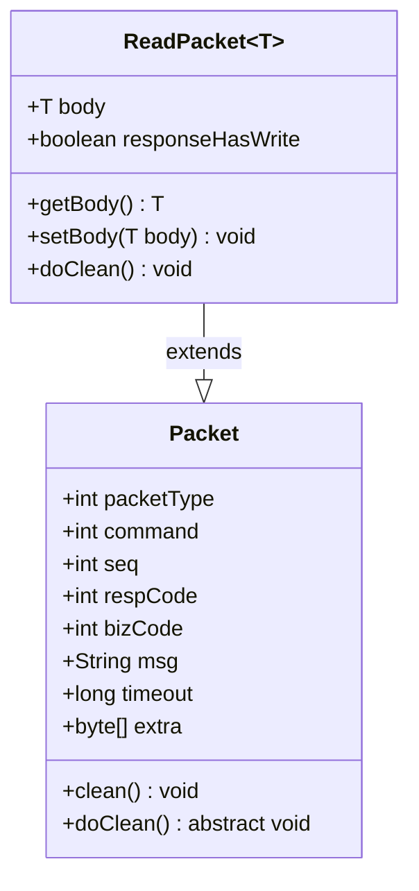
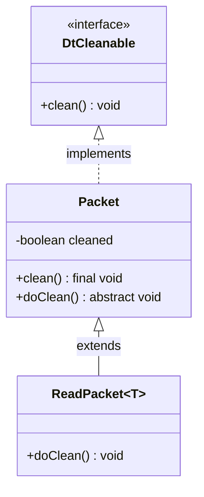
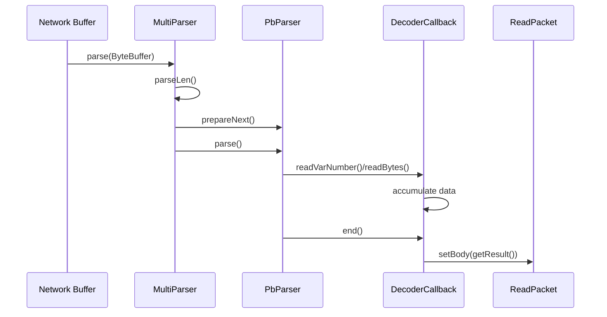
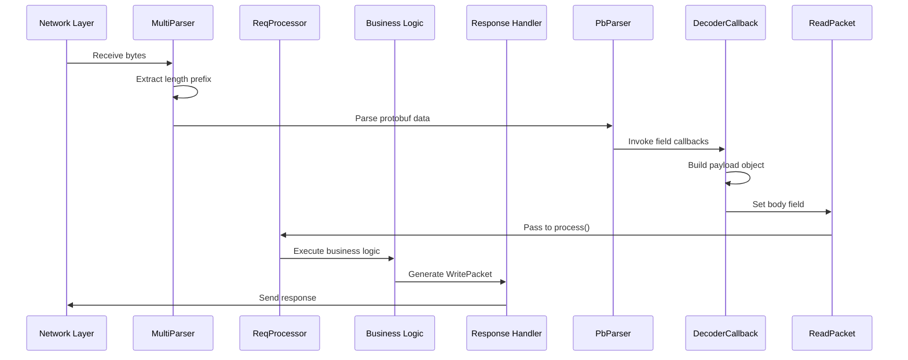
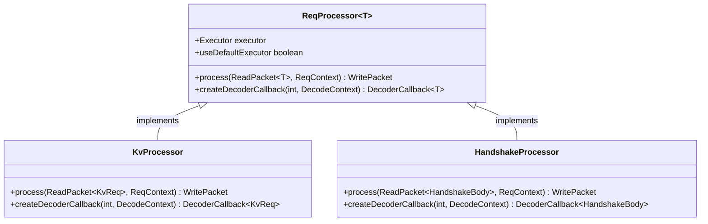
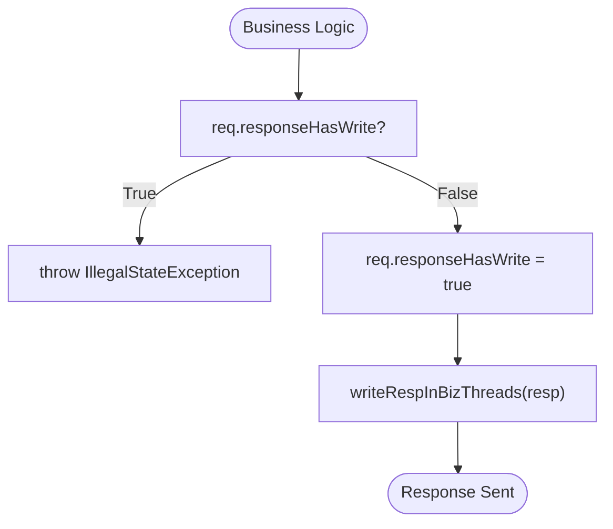
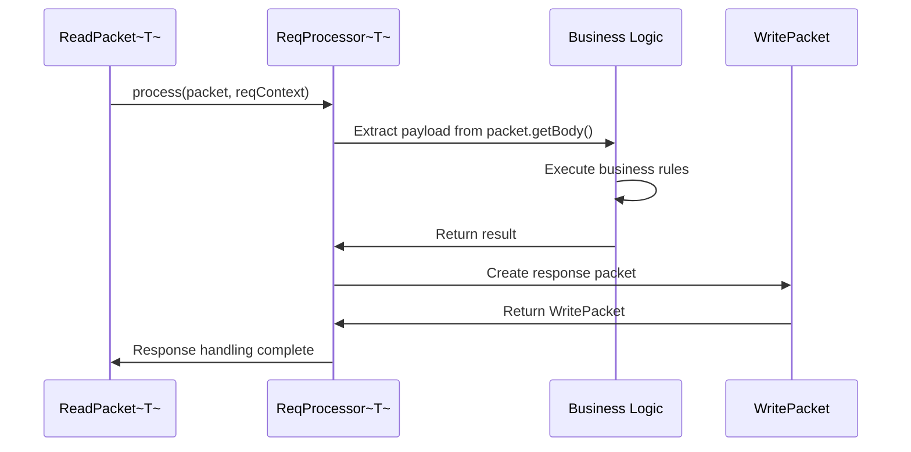

# Packet Decoding and Read Packets

<cite>
**Referenced Files in This Document**   
- [ReadPacket.java](file://client/src/main/java/com/github/dtprj/dongting/net/ReadPacket.java)
- [Packet.java](file://client/src/main/java/com/github/dtprj/dongting/net/Packet.java)
- [MultiParser.java](file://client/src/main/java/com/github/dtprj/dongting/net/MultiParser.java)
- [ReqProcessor.java](file://client/src/main/java/com/github/dtprj/dongting/net/ReqProcessor.java)
- [DtCleanable.java](file://client/src/main/java/com/github/dtprj/dongting/common/DtCleanable.java)
- [DecoderCallback.java](file://client/src/main/java/com/github/dtprj/dongting/codec/DecoderCallback.java)
- [PbCallback.java](file://client/src/main/java/com/github/dtprj/dongting/codec/PbCallback.java)
- [KvReq.java](file://client/src/main/java/com/github/dtprj/dongting/dtkv/KvReq.java)
- [KvResp.java](file://client/src/main/java/com/github/dtprj/dongting/dtkv/KvResp.java)
- [ReqContext.java](file://client/src/main/java/com/github/dtprj/dongting/net/ReqContext.java)
- [WritePacket.java](file://client/src/main/java/com/github/dtprj/dongting/net/WritePacket.java)
- [ReqContextImpl.java](file://client/src/main/java/com/github/dtprj/dongting/net/ReqContextImpl.java)
</cite>

## Table of Contents
1. [Introduction](#introduction)
2. [ReadPacket Class Structure](#readpacket-class-structure)
3. [Resource Management and Cleanup](#resource-management-and-cleanup)
4. [Packet Decoding Pipeline](#packet-decoding-pipeline)
5. [Request Processing Lifecycle](#request-processing-lifecycle)
6. [Type-Safe Message Handling](#type-safe-message-handling)
7. [Response Prevention Mechanism](#response-prevention-mechanism)
8. [Integration with Business Logic](#integration-with-business-logic)
9. [Conclusion](#conclusion)

## Introduction
The Dongting packet decoding system provides a robust framework for handling network communication with efficient message parsing and type-safe payload delivery. At the core of this system is the ReadPacket class, which extends the base Packet class to carry decoded message payloads in a type-safe manner. This document details the architecture and implementation of the packet decoding system, focusing on the ReadPacket implementation, its lifecycle from network reception to business logic processing, and the mechanisms that ensure proper resource management and prevent multiple responses to the same request.

## ReadPacket Class Structure

The ReadPacket class serves as a container for decoded message payloads received from the network. It extends the abstract Packet class and introduces type-safe payload handling through its generic type parameter T.



**Diagram sources**
- [ReadPacket.java](file://client/src/main/java/com/github/dtprj/dongting/net/ReadPacket.java#L23-L45)
- [Packet.java](file://client/src/main/java/com/github/dtprj/dongting/net/Packet.java#L26-L76)

The ReadPacket class contains two primary fields:
- **body**: A generic field of type T that holds the decoded message payload
- **responseHasWrite**: A boolean flag that prevents multiple responses to the same request

The class provides standard getter and setter methods for the body field, enabling type-safe access to the decoded payload without requiring casting operations.

**Section sources**
- [ReadPacket.java](file://client/src/main/java/com/github/dtprj/dongting/net/ReadPacket.java#L23-L45)

## Resource Management and Cleanup

The Dongting system implements a comprehensive resource management strategy through the DtCleanable interface and the cleanup lifecycle defined in the Packet hierarchy.



**Diagram sources**
- [DtCleanable.java](file://client/src/main/java/com/github/dtprj/dongting/common/DtCleanable.java#L21-L24)
- [Packet.java](file://client/src/main/java/com/github/dtprj/dongting/net/Packet.java#L26-L76)
- [ReadPacket.java](file://client/src/main/java/com/github/dtprj/dongting/net/ReadPacket.java#L23-L45)

The cleanup process follows a specific pattern:
1. The final clean() method in the Packet class ensures idempotency by checking the cleaned flag
2. If not already cleaned, it calls the protected doClean() method
3. The cleaned flag is set to true in the finally block to prevent double-cleanup

The ReadPacket implementation of doClean() specifically handles resource cleanup for payloads that implement DtCleanable:

```mermaid
flowchart TD
Start([doClean()]) --> CheckBody["body != null?"]
CheckBody --> |Yes| CheckInstance["body instanceof DtCleanable?"]
CheckBody --> |No| End([Return])
CheckInstance --> |Yes| CleanBody["((DtCleanable)body).clean()"]
CheckInstance --> |No| End
CleanBody --> End
```

**Diagram sources**
- [ReadPacket.java](file://client/src/main/java/com/github/dtprj/dongting/net/ReadPacket.java#L38-L43)

This design ensures that resources associated with message payloads are properly released when the packet is cleaned, preventing memory leaks and resource exhaustion.

**Section sources**
- [ReadPacket.java](file://client/src/main/java/com/github/dtprj/dongting/net/ReadPacket.java#L38-L43)
- [Packet.java](file://client/src/main/java/com/github/dtprj/dongting/net/Packet.java#L59-L75)
- [DtCleanable.java](file://client/src/main/java/com/github/dtprj/dongting/common/DtCleanable.java#L21-L24)

## Packet Decoding Pipeline

The packet decoding system processes incoming network data through a multi-stage pipeline that transforms raw bytes into structured ReadPacket instances with decoded payloads.



**Diagram sources**
- [MultiParser.java](file://client/src/main/java/com/github/dtprj/dongting/net/MultiParser.java#L28-L97)
- [PbParser.java](file://client/src/main/java/com/github/dtprj/dongting/codec/PbParser.java)
- [DecoderCallback.java](file://client/src/main/java/com/github/dtprj/dongting/codec/DecoderCallback.java#L23-L40)

The decoding pipeline consists of the following components:
- **MultiParser**: Manages the parsing of multiple messages from a single buffer, handling length prefix extraction
- **PbParser**: Implements the protobuf-style parsing logic for individual messages
- **DecoderCallback**: Receives parsed field data and constructs the appropriate payload object
- **ReadPacket**: Receives the final decoded payload through its body field

The MultiParser class first extracts the message length from the buffer (using big-endian format), then delegates the actual protobuf parsing to the PbParser instance. The PbParser invokes appropriate methods on the DecoderCallback as it encounters different field types, allowing the callback to accumulate the necessary data to construct the final payload object.

**Section sources**
- [MultiParser.java](file://client/src/main/java/com/github/dtprj/dongting/net/MultiParser.java#L28-L97)
- [DecoderCallback.java](file://client/src/main/java/com/github/dtprj/dongting/codec/DecoderCallback.java#L23-L40)
- [PbCallback.java](file://client/src/main/java/com/github/dtprj/dongting/codec/PbCallback.java#L23-L41)

## Request Processing Lifecycle

The complete lifecycle of a ReadPacket spans from network reception through decoding to final processing by business logic components.



**Diagram sources**
- [MultiParser.java](file://client/src/main/java/com/github/dtprj/dongting/net/MultiParser.java#L28-L97)
- [ReqProcessor.java](file://client/src/main/java/com/github/dtprj/dongting/net/ReqProcessor.java#L26-L35)
- [ReadPacket.java](file://client/src/main/java/com/github/dtprj/dongting/net/ReadPacket.java#L23-L45)

The lifecycle begins when network data arrives and is processed by the MultiParser, which extracts the message length and initiates protobuf parsing. As fields are parsed, the DecoderCallback accumulates data until the entire message is processed, at which point it returns the constructed payload object. This payload is assigned to the ReadPacket's body field, completing the decoding phase.

The fully decoded ReadPacket is then passed to the appropriate ReqProcessor for business logic processing. The processor's implementation of the process() method handles the specific business requirements and generates an appropriate response.

**Section sources**
- [MultiParser.java](file://client/src/main/java/com/github/dtprj/dongting/net/MultiParser.java#L28-L97)
- [ReqProcessor.java](file://client/src/main/java/com/github/dtprj/dongting/net/ReqProcessor.java#L26-L35)
- [ReadPacket.java](file://client/src/main/java/com/github/dtprj/dongting/net/ReadPacket.java#L23-L45)

## Type-Safe Message Handling

The generic type parameter T in ReadPacket enables type-safe message handling across different command types, eliminating the need for runtime casting and reducing the potential for ClassCastException errors.



**Diagram sources**
- [ReqProcessor.java](file://client/src/main/java/com/github/dtprj/dongting/net/ReqProcessor.java#L26-L35)
- [KvReq.java](file://client/src/main/java/com/github/dtprj/dongting/dtkv/KvReq.java#L33-L267)
- [HandshakeProcessor.java](file://client/src/main/java/com/github/dtprj/dongting/net/HandshakeProcessor.java)

Each command type has its own ReqProcessor implementation with a specific type parameter. For example:
- KvProcessor uses ReadPacket<KvReq> for key-value store operations
- HandshakeProcessor uses ReadPacket<HandshakeBody> for connection establishment
- Other processors handle their respective command types with appropriate payload classes

This approach ensures that the business logic receives the correctly typed payload object, enabling direct access to its fields and methods without casting. The compiler can verify type safety at compile time, catching potential errors before runtime.

**Section sources**
- [ReqProcessor.java](file://client/src/main/java/com/github/dtprj/dongting/net/ReqProcessor.java#L26-L35)
- [KvReq.java](file://client/src/main/java/com/github/dtprj/dongting/dtkv/KvReq.java#L33-L267)

## Response Prevention Mechanism

The responseHasWrite flag in ReadPacket plays a critical role in preventing multiple responses to the same request, ensuring protocol integrity and preventing resource leaks.



**Diagram sources**
- [ReadPacket.java](file://client/src/main/java/com/github/dtprj/dongting/net/ReadPacket.java#L25)
- [ReqContextImpl.java](file://client/src/main/java/com/github/dtprj/dongting/net/ReqContextImpl.java#L71-L76)

The mechanism works as follows:
1. When business logic attempts to send a response via writeRespInBizThreads()
2. The method first checks the responseHasWrite flag on the original request
3. If the flag is already true, an IllegalStateException is thrown
4. If the flag is false, it is set to true before proceeding with response transmission

This check occurs in the ReqContextImpl class, which serves as the bridge between the business logic thread and the I/O thread. The implementation acknowledges that this check is not thread-safe but serves as an important safeguard against accidental multiple responses.

The flag is not exposed through public getter methods, preventing external code from manipulating it and ensuring that response tracking remains an internal concern of the networking framework.

**Section sources**
- [ReadPacket.java](file://client/src/main/java/com/github/dtprj/dongting/net/ReadPacket.java#L25)
- [ReqContextImpl.java](file://client/src/main/java/com/github/dtprj/dongting/net/ReqContextImpl.java#L71-L76)

## Integration with Business Logic

The integration between ReadPacket and business logic occurs through the ReqProcessor abstraction, which defines the contract for handling decoded requests.



**Diagram sources**
- [ReadPacket.java](file://client/src/main/java/com/github/dtprj/dongting/net/ReadPacket.java#L23-L45)
- [ReqProcessor.java](file://client/src/main/java/com/github/dtprj/dongting/net/ReqProcessor.java#L26-L35)
- [WritePacket.java](file://client/src/main/java/com/github/dtprj/dongting/net/WritePacket.java#L30-L182)

Business logic components access the decoded payload through the getBody() method of ReadPacket. Since the generic type T is specified at the processor level, the payload is already of the expected type, requiring no casting operations.

For example, in a KvProcessor handling key-value operations:
- The processor receives ReadPacket<KvReq> as input
- It calls getBody() to obtain the KvReq payload
- The returned object is directly usable as a KvReq instance
- Business logic can access KvReq fields and methods without casting

The processor then creates an appropriate WritePacket response, which may contain a response payload such as KvResp. The response packet inherits key fields (seq, command) from the request to maintain the request-response correlation.

**Section sources**
- [ReqProcessor.java](file://client/src/main/java/com/github/dtprj/dongting/net/ReqProcessor.java#L31)
- [ReadPacket.java](file://client/src/main/java/com/github/dtprj/dongting/net/ReadPacket.java#L30-L36)
- [WritePacket.java](file://client/src/main/java/com/github/dtprj/dongting/net/WritePacket.java#L30-L182)

## Conclusion
The Dongting packet decoding system provides a robust foundation for network communication with its well-designed ReadPacket implementation. By leveraging generics for type-safe payload handling, implementing proper resource management through the DtCleanable interface, and preventing multiple responses with the responseHasWrite flag, the system ensures reliable and efficient message processing. The integration between the decoding pipeline, ReadPacket, and ReqProcessor creates a cohesive architecture that simplifies business logic development while maintaining protocol integrity and resource safety.