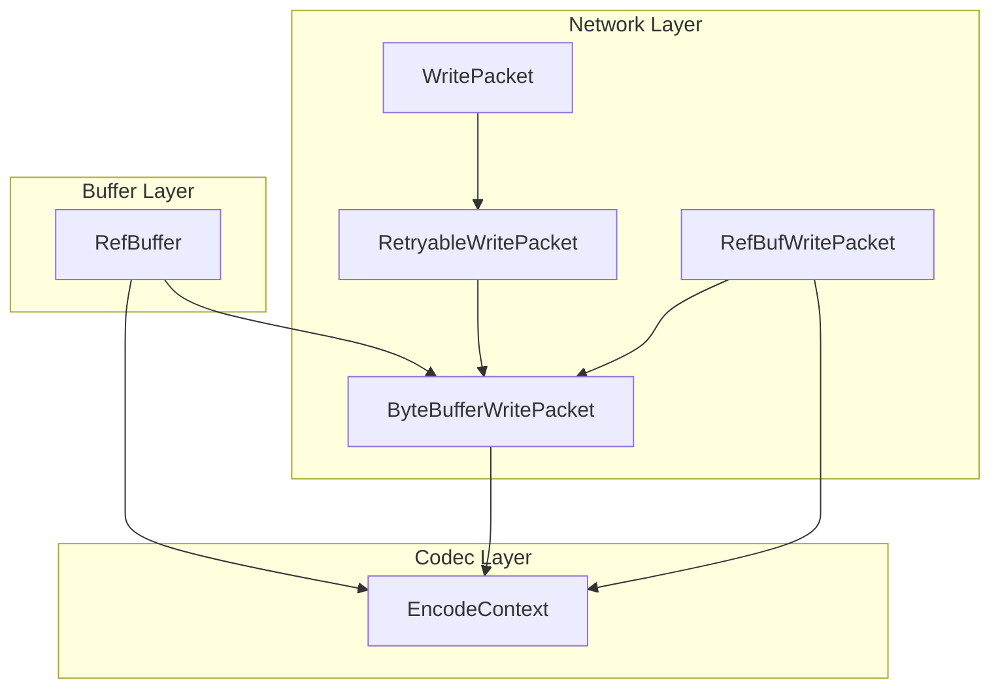
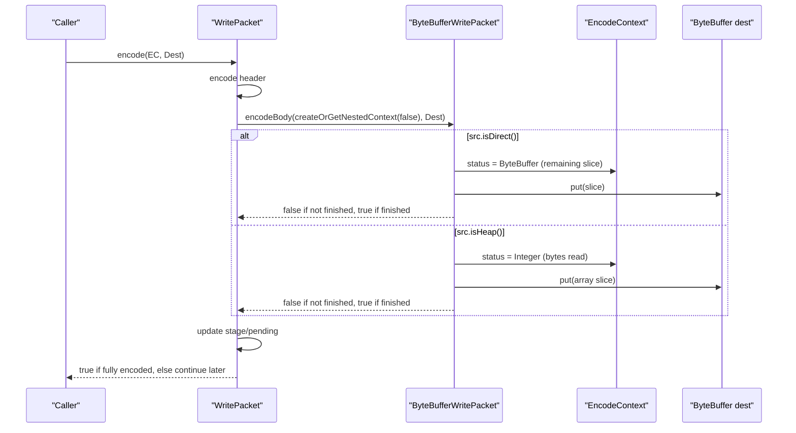
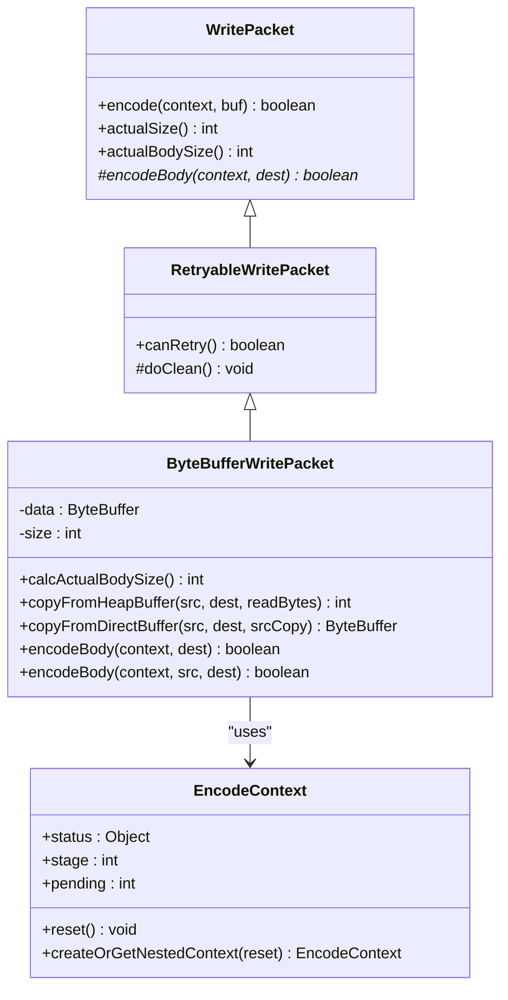
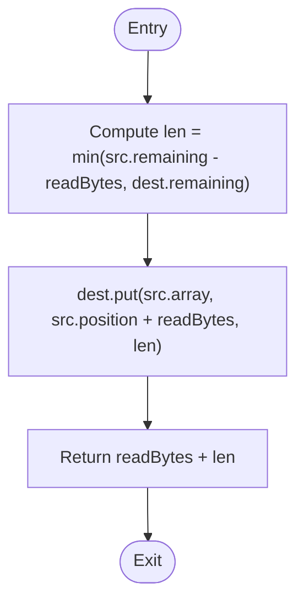
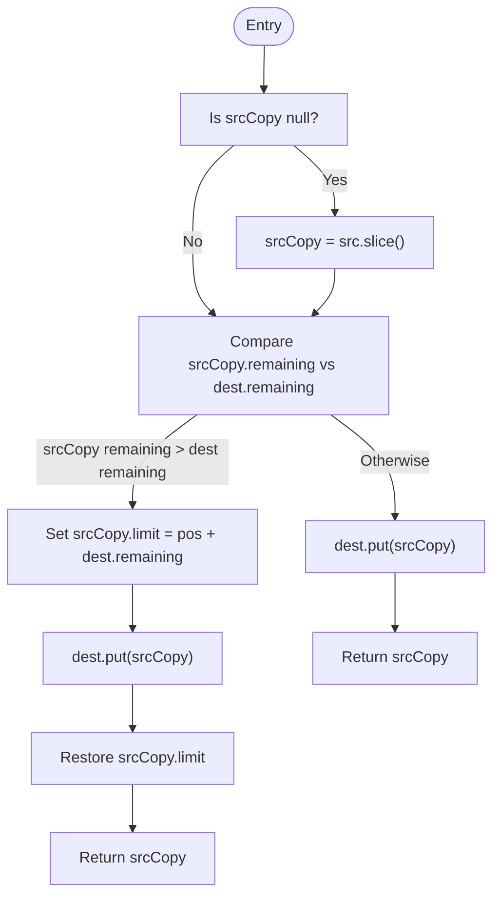
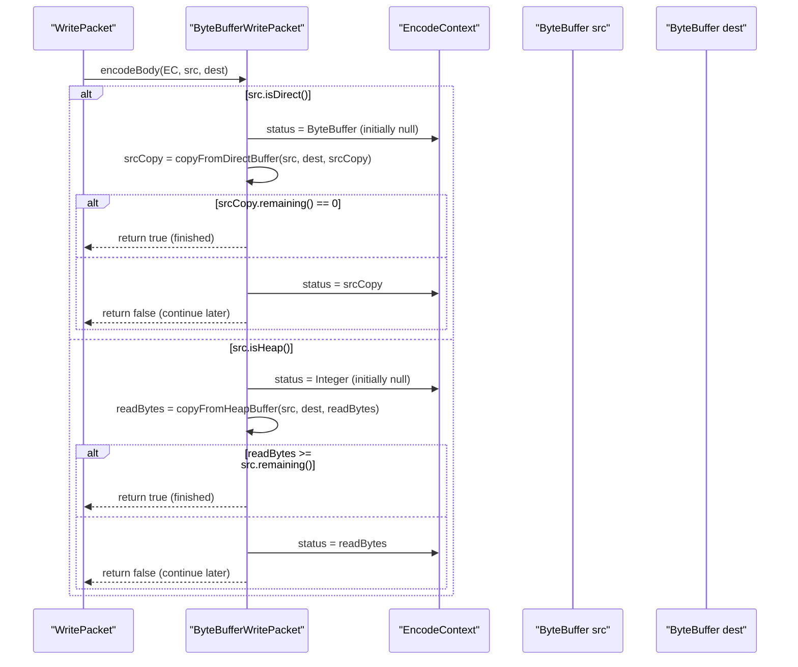
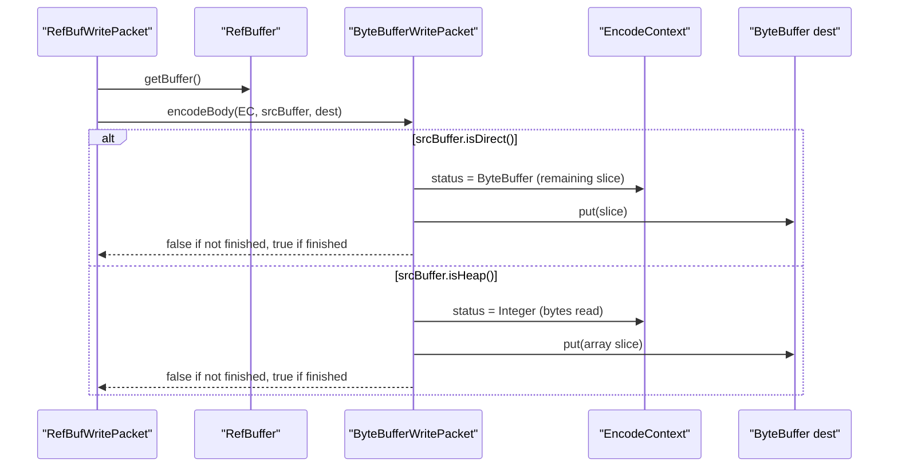
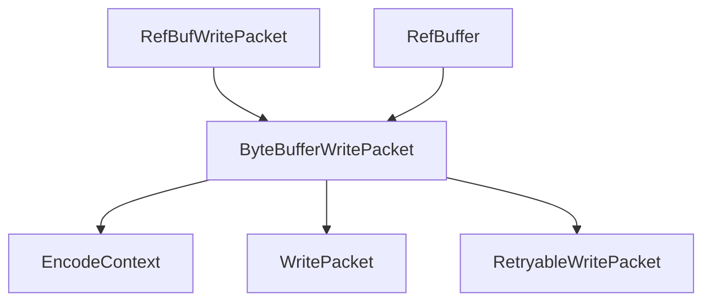

# ByteBufferWritePacket for Direct Buffer Handling

<cite>
**Referenced Files in This Document**
- [ByteBufferWritePacket.java](file://client/src/main/java/com/github/dtprj/dongting/net/ByteBufferWritePacket.java)
- [WritePacket.java](file://client/src/main/java/com/github/dtprj/dongting/net/WritePacket.java)
- [RetryableWritePacket.java](file://client/src/main/java/com/github/dtprj/dongting/net/RetryableWritePacket.java)
- [EncodeContext.java](file://client/src/main/java/com/github/dtprj/dongting/codec/EncodeContext.java)
- [RefBufWritePacket.java](file://client/src/main/java/com/github/dtprj/dongting/net/RefBufWritePacket.java)
- [RefBuffer.java](file://client/src/main/java/com/github/dtprj/dongting/buf/RefBuffer.java)
- [PacketPbTest.java](file://client/src/test/java/com/github/dtprj/dongting/net/PacketPbTest.java)
</cite>

## Table of Contents
1. [Introduction](#introduction)
2. [Project Structure](#project-structure)
3. [Core Components](#core-components)
4. [Architecture Overview](#architecture-overview)
5. [Detailed Component Analysis](#detailed-component-analysis)
6. [Dependency Analysis](#dependency-analysis)
7. [Performance Considerations](#performance-considerations)
8. [Troubleshooting Guide](#troubleshooting-guide)
9. [Conclusion](#conclusion)
10. [Appendices](#appendices)

## Introduction
This document explains the ByteBufferWritePacket class, which provides efficient, zero-copy–friendly encoding for both heap and direct ByteBuffers. It documents:
- How the class supports zero-copy transfer when possible by selecting appropriate copying strategies for heap vs. direct buffers
- The static utility methods for heap and direct buffer copying
- The encodeBody method that uses EncodeContext.status to maintain encoding state across partial writes
- How this enables seamless continuation of partial encoding operations
- Performance characteristics and memory efficiency benefits
- Practical use cases for large binary payloads and memory-mapped file data

## Project Structure
ByteBufferWritePacket is part of the network layer and integrates with the encoding pipeline. It cooperates with:
- WritePacket and RetryableWritePacket for packet lifecycle and retry semantics
- EncodeContext for maintaining encoding state across partial writes
- RefBufWritePacket and RefBuffer for alternative zero-copy encoders that also leverage ByteBufferWritePacket’s strategies

**Diagram sources**
- [WritePacket.java](file://client/src/main/java/com/github/dtprj/dongting/net/WritePacket.java#L112-L164)
- [RetryableWritePacket.java](file://client/src/main/java/com/github/dtprj/dongting/net/RetryableWritePacket.java#L21-L36)
- [ByteBufferWritePacket.java](file://client/src/main/java/com/github/dtprj/dongting/net/ByteBufferWritePacket.java#L25-L89)
- [RefBufWritePacket.java](file://client/src/main/java/com/github/dtprj/dongting/net/RefBufWritePacket.java#L26-L54)
- [EncodeContext.java](file://client/src/main/java/com/github/dtprj/dongting/codec/EncodeContext.java#L23-L66)
- [RefBuffer.java](file://client/src/main/java/com/github/dtprj/dongting/buf/RefBuffer.java#L148-L178)

**Section sources**
- [ByteBufferWritePacket.java](file://client/src/main/java/com/github/dtprj/dongting/net/ByteBufferWritePacket.java#L25-L89)
- [WritePacket.java](file://client/src/main/java/com/github/dtprj/dongting/net/WritePacket.java#L112-L164)
- [RetryableWritePacket.java](file://client/src/main/java/com/github/dtprj/dongting/net/RetryableWritePacket.java#L21-L36)
- [EncodeContext.java](file://client/src/main/java/com/github/dtprj/dongting/codec/EncodeContext.java#L23-L66)
- [RefBufWritePacket.java](file://client/src/main/java/com/github/dtprj/dongting/net/RefBufWritePacket.java#L26-L54)
- [RefBuffer.java](file://client/src/main/java/com/github/dtprj/dongting/buf/RefBuffer.java#L148-L178)

## Core Components
- ByteBufferWritePacket: A retryable write packet that encodes a ByteBuffer body using zero-copy–friendly strategies depending on whether the buffer is heap or direct.
- Static helpers:
  - copyFromHeapBuffer: Efficiently copies from a heap ByteBuffer using array-based put operations.
  - copyFromDirectBuffer: Efficiently copies from a direct ByteBuffer using slice-based copying to avoid extra array copies.
- encodeBody: The core encoding routine that:
  - Uses EncodeContext.status to track progress
  - For direct buffers: stores the remaining slice in status and continues until fully drained
  - For heap buffers: stores the number of bytes read in status and continues until fully consumed

These components integrate with the broader encoding pipeline to support partial writes and retries.

**Section sources**
- [ByteBufferWritePacket.java](file://client/src/main/java/com/github/dtprj/dongting/net/ByteBufferWritePacket.java#L25-L89)
- [EncodeContext.java](file://client/src/main/java/com/github/dtprj/dongting/codec/EncodeContext.java#L23-L66)

## Architecture Overview
The encoding flow for ByteBufferWritePacket is orchestrated by WritePacket.encode, which:
- Encodes the packet header into the destination buffer
- Delegates body encoding to ByteBufferWritePacket.encodeBody
- Uses EncodeContext to track stage, status, and pending bytes encoded
- Supports partial completion and continuation across multiple passes

**Diagram sources**
- [WritePacket.java](file://client/src/main/java/com/github/dtprj/dongting/net/WritePacket.java#L112-L164)
- [ByteBufferWritePacket.java](file://client/src/main/java/com/github/dtprj/dongting/net/ByteBufferWritePacket.java#L60-L89)
- [EncodeContext.java](file://client/src/main/java/com/github/dtprj/dongting/codec/EncodeContext.java#L23-L66)

## Detailed Component Analysis

### ByteBufferWritePacket
- Responsibilities:
  - Wrap a ByteBuffer body and compute its size
  - Provide static helpers for heap and direct buffer copying
  - Implement encodeBody to support partial writes using EncodeContext.status
- Key behaviors:
  - Heap buffers: copyFromHeapBuffer advances a byte count stored in status
  - Direct buffers: copyFromDirectBuffer advances a ByteBuffer slice stored in status
  - Both strategies minimize copies and enable zero-copy when the underlying buffer is direct

**Diagram sources**
- [WritePacket.java](file://client/src/main/java/com/github/dtprj/dongting/net/WritePacket.java#L58-L164)
- [RetryableWritePacket.java](file://client/src/main/java/com/github/dtprj/dongting/net/RetryableWritePacket.java#L21-L36)
- [ByteBufferWritePacket.java](file://client/src/main/java/com/github/dtprj/dongting/net/ByteBufferWritePacket.java#L25-L89)
- [EncodeContext.java](file://client/src/main/java/com/github/dtprj/dongting/codec/EncodeContext.java#L23-L66)

**Section sources**
- [ByteBufferWritePacket.java](file://client/src/main/java/com/github/dtprj/dongting/net/ByteBufferWritePacket.java#L25-L89)

### Static Copy Utilities

#### copyFromHeapBuffer
- Purpose: Efficiently copy from a heap ByteBuffer to the destination using array-based put operations.
- Strategy: Computes the maximum number of bytes to copy based on remaining unread bytes and destination capacity, then performs a single put operation from the underlying array.

**Diagram sources**
- [ByteBufferWritePacket.java](file://client/src/main/java/com/github/dtprj/dongting/net/ByteBufferWritePacket.java#L39-L43)

**Section sources**
- [ByteBufferWritePacket.java](file://client/src/main/java/com/github/dtprj/dongting/net/ByteBufferWritePacket.java#L39-L43)

#### copyFromDirectBuffer
- Purpose: Efficiently copy from a direct ByteBuffer to the destination using slice-based copying.
- Strategy:
  - Lazily creates a slice from the source if not present
  - Compares remaining bytes in the slice with destination capacity
  - Puts the slice into the destination and updates limits as needed
  - Returns the updated slice so the caller can resume from where it left off

**Diagram sources**
- [ByteBufferWritePacket.java](file://client/src/main/java/com/github/dtprj/dongting/net/ByteBufferWritePacket.java#L45-L58)

**Section sources**
- [ByteBufferWritePacket.java](file://client/src/main/java/com/github/dtprj/dongting/net/ByteBufferWritePacket.java#L45-L58)

### encodeBody and Partial Encoding
- For direct buffers:
  - Stores the remaining slice in EncodeContext.status
  - Continues copying until the slice is fully drained
- For heap buffers:
  - Stores the number of bytes read in EncodeContext.status
  - Continues copying until the source buffer is fully consumed
- The WritePacket.encode method manages stages and pending bytes, delegating body encoding to ByteBufferWritePacket and resuming from the last status.

**Diagram sources**
- [ByteBufferWritePacket.java](file://client/src/main/java/com/github/dtprj/dongting/net/ByteBufferWritePacket.java#L60-L89)
- [WritePacket.java](file://client/src/main/java/com/github/dtprj/dongting/net/WritePacket.java#L112-L164)
- [EncodeContext.java](file://client/src/main/java/com/github/dtprj/dongting/codec/EncodeContext.java#L23-L66)

**Section sources**
- [ByteBufferWritePacket.java](file://client/src/main/java/com/github/dtprj/dongting/net/ByteBufferWritePacket.java#L60-L89)
- [WritePacket.java](file://client/src/main/java/com/github/dtprj/dongting/net/WritePacket.java#L112-L164)
- [EncodeContext.java](file://client/src/main/java/com/github/dtprj/dongting/codec/EncodeContext.java#L23-L66)

### Integration with RefBufWritePacket and RefBuffer
- RefBufWritePacket delegates body encoding to ByteBufferWritePacket.encodeBody, enabling the same zero-copy–friendly strategies for RefBuffer-backed payloads.
- RefBuffer implements Encodable and reuses the same strategies internally, aligning with ByteBufferWritePacket’s approach.

**Diagram sources**
- [RefBufWritePacket.java](file://client/src/main/java/com/github/dtprj/dongting/net/RefBufWritePacket.java#L26-L54)
- [RefBuffer.java](file://client/src/main/java/com/github/dtprj/dongting/buf/RefBuffer.java#L148-L178)
- [ByteBufferWritePacket.java](file://client/src/main/java/com/github/dtprj/dongting/net/ByteBufferWritePacket.java#L60-L89)

**Section sources**
- [RefBufWritePacket.java](file://client/src/main/java/com/github/dtprj/dongting/net/RefBufWritePacket.java#L26-L54)
- [RefBuffer.java](file://client/src/main/java/com/github/dtprj/dongting/buf/RefBuffer.java#L148-L178)

## Dependency Analysis
- ByteBufferWritePacket depends on:
  - EncodeContext for stateful partial encoding
  - WritePacket and RetryableWritePacket for lifecycle and retry semantics
- RefBufWritePacket and RefBuffer depend on ByteBufferWritePacket’s strategies for efficient encoding of direct buffers.

**Diagram sources**
- [ByteBufferWritePacket.java](file://client/src/main/java/com/github/dtprj/dongting/net/ByteBufferWritePacket.java#L25-L89)
- [WritePacket.java](file://client/src/main/java/com/github/dtprj/dongting/net/WritePacket.java#L112-L164)
- [RetryableWritePacket.java](file://client/src/main/java/com/github/dtprj/dongting/net/RetryableWritePacket.java#L21-L36)
- [RefBufWritePacket.java](file://client/src/main/java/com/github/dtprj/dongting/net/RefBufWritePacket.java#L26-L54)
- [RefBuffer.java](file://client/src/main/java/com/github/dtprj/dongting/buf/RefBuffer.java#L148-L178)

**Section sources**
- [ByteBufferWritePacket.java](file://client/src/main/java/com/github/dtprj/dongting/net/ByteBufferWritePacket.java#L25-L89)
- [WritePacket.java](file://client/src/main/java/com/github/dtprj/dongting/net/WritePacket.java#L112-L164)
- [RetryableWritePacket.java](file://client/src/main/java/com/github/dtprj/dongting/net/RetryableWritePacket.java#L21-L36)
- [RefBufWritePacket.java](file://client/src/main/java/com/github/dtprj/dongting/net/RefBufWritePacket.java#L26-L54)
- [RefBuffer.java](file://client/src/main/java/com/github/dtprj/dongting/buf/RefBuffer.java#L148-L178)

## Performance Considerations
- Direct buffer handling:
  - Uses slice-based copying to avoid array copies and reduce GC pressure
  - Maintains a ByteBuffer slice in EncodeContext.status to resume exactly where it left off
- Heap buffer handling:
  - Uses array-based put operations for minimal overhead
  - Tracks read bytes in EncodeContext.status to resume partial reads
- Memory efficiency:
  - Zero-copy transfer is achieved when the ByteBuffer is direct and the underlying data is not copied unnecessarily
  - For heap buffers, only the minimal amount of data is copied per pass
- Throughput:
  - Partial encoding allows the encoder to make progress even when the destination buffer is smaller than the payload
  - Retryable semantics enable robustness without re-encoding the entire payload

[No sources needed since this section provides general guidance]

## Troubleshooting Guide
- Symptom: Partial encoding never completes
  - Cause: Destination buffer remains too small or status not updated
  - Action: Ensure the destination buffer has sufficient capacity and that the encoder returns false to indicate continuation
- Symptom: Unexpected body size mismatch
  - Cause: Pending bytes accumulation incorrect
  - Action: Verify that WritePacket.encode updates context.pending and checks body size correctness
- Symptom: Direct buffer leaks or premature release
  - Cause: Improper handling of the remaining slice in status
  - Action: Ensure the remaining slice is stored and resumed until fully drained; do not release the underlying buffer prematurely

**Section sources**
- [WritePacket.java](file://client/src/main/java/com/github/dtprj/dongting/net/WritePacket.java#L136-L164)
- [ByteBufferWritePacket.java](file://client/src/main/java/com/github/dtprj/dongting/net/ByteBufferWritePacket.java#L60-L89)

## Conclusion
ByteBufferWritePacket provides a robust, efficient mechanism for encoding ByteBuffer bodies with zero-copy–friendly strategies. Its design leverages EncodeContext.status to support partial writes seamlessly, enabling reliable and high-performance transmission of large binary payloads and memory-mapped data. Integration with RefBufWritePacket and RefBuffer ensures consistent behavior across different buffer types.

[No sources needed since this section summarizes without analyzing specific files]

## Appendices

### Example Use Cases
- Large binary payloads:
  - Wrap a large ByteBuffer (heap or direct) and send it via ByteBufferWritePacket
  - The encoder will resume from the last status until fully transmitted
- Memory-mapped file data:
  - Use a direct MappedByteBuffer and send it through ByteBufferWritePacket
  - The slice-based strategy avoids unnecessary array copies and minimizes GC pressure

**Section sources**
- [PacketPbTest.java](file://client/src/test/java/com/github/dtprj/dongting/net/PacketPbTest.java#L55-L86)
- [ByteBufferWritePacket.java](file://client/src/main/java/com/github/dtprj/dongting/net/ByteBufferWritePacket.java#L25-L89)