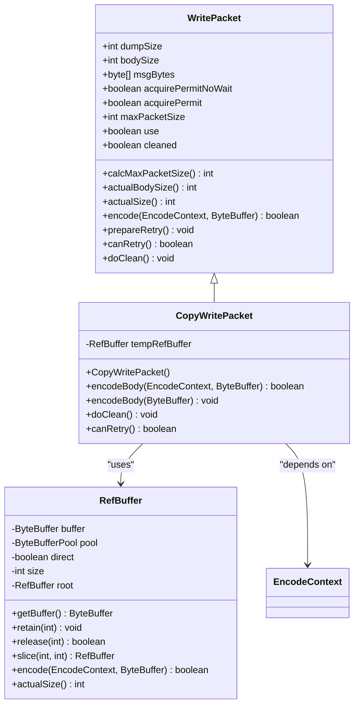
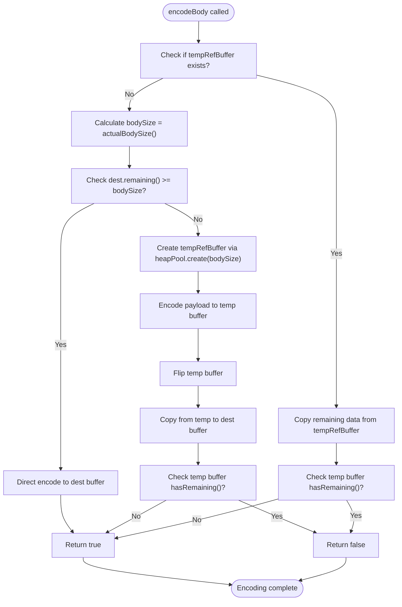
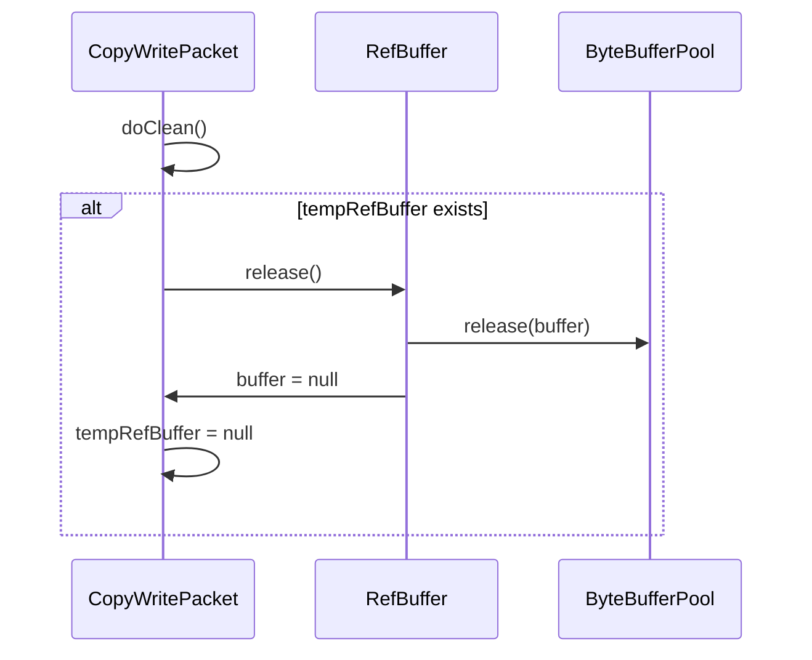
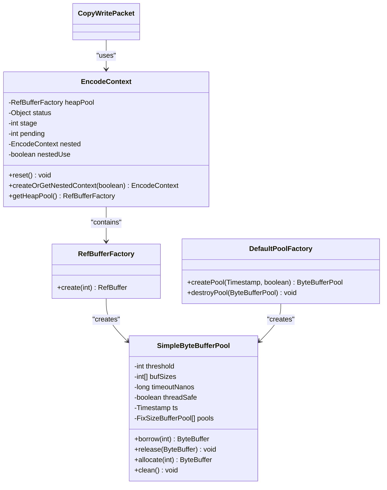

# CopyWritePacket for Heap Buffer Operations

<cite>
**Referenced Files in This Document**   
- [CopyWritePacket.java](file://client/src/main/java/com/github/dtprj/dongting/net/CopyWritePacket.java)
- [WritePacket.java](file://client/src/main/java/com/github/dtprj/dongting/net/WritePacket.java)
- [RefBuffer.java](file://client/src/main/java/com/github/dtprj/dongting/buf/RefBuffer.java)
- [EncodeContext.java](file://client/src/main/java/com/github/dtprj/dongting/codec/EncodeContext.java)
- [SimpleByteBufferPool.java](file://client/src/main/java/com/github/dtprj/dongting/buf/SimpleByteBufferPool.java)
- [DefaultPoolFactory.java](file://client/src/main/java/com/github/dtprj/dongting/buf/DefaultPoolFactory.java)
</cite>

## Table of Contents
1. [Introduction](#introduction)
2. [Core Architecture](#core-architecture)
3. [Two-Phase Encoding Process](#two-phase-encoding-process)
4. [Resource Management](#resource-management)
5. [Retry Mechanism](#retry-mechanism)
6. [Heap Buffer Pool Integration](#heap-buffer-pool-integration)
7. [Usage Patterns and Examples](#usage-patterns-and-examples)
8. [Performance Considerations](#performance-considerations)

## Introduction
The CopyWritePacket abstract class provides an efficient mechanism for handling heap buffer operations in network communication scenarios. It addresses the challenge of writing payload data to ByteBuffer destinations when capacity constraints may prevent complete writes in a single operation. The class implements a sophisticated two-phase encoding strategy that optimizes performance by avoiding partial writes and ensuring data integrity during network transmission.

This documentation details the implementation of CopyWritePacket, focusing on its conditional copying strategy, resource management, and integration with the heap buffer pool system. The class is designed to handle variable-sized payloads efficiently, making it suitable for applications that require reliable message transmission with optimal memory utilization.

## Core Architecture
The CopyWritePacket class extends WritePacket and implements a conditional copying strategy based on available buffer capacity. The architecture centers around the temporary RefBuffer field that stores payload data when the destination ByteBuffer lacks sufficient space.



**Diagram sources**
- [CopyWritePacket.java](file://client/src/main/java/com/github/dtprj/dongting/net/CopyWritePacket.java#L26-L70)
- [WritePacket.java](file://client/src/main/java/com/github/dtprj/dongting/net/WritePacket.java#L30-L181)
- [RefBuffer.java](file://client/src/main/java/com/github/dtprj/dongting/buf/RefBuffer.java#L28-L183)

**Section sources**
- [CopyWritePacket.java](file://client/src/main/java/com/github/dtprj/dongting/net/CopyWritePacket.java#L26-L70)

## Two-Phase Encoding Process
The CopyWritePacket implements a two-phase encoding process that optimizes data transfer based on available buffer capacity. This approach prevents partial writes and ensures data integrity during network transmission.



**Diagram sources**
- [CopyWritePacket.java](file://client/src/main/java/com/github/dtprj/dongting/net/CopyWritePacket.java#L34-L53)

**Section sources**
- [CopyWritePacket.java](file://client/src/main/java/com/github/dtprj/dongting/net/CopyWritePacket.java#L34-L53)

## Resource Management
The CopyWritePacket implements proper resource management through the doClean() method, which releases the temporary RefBuffer when it's no longer needed. This prevents memory leaks and ensures efficient resource utilization.



**Diagram sources**
- [CopyWritePacket.java](file://client/src/main/java/com/github/dtprj/dongting/net/CopyWritePacket.java#L59-L63)
- [RefBuffer.java](file://client/src/main/java/com/github/dtprj/dongting/buf/RefBuffer.java#L133-L142)

**Section sources**
- [CopyWritePacket.java](file://client/src/main/java/com/github/dtprj/dongting/net/CopyWritePacket.java#L59-L63)

## Retry Mechanism
The CopyWritePacket implements a retry capability through the canRetry() method, allowing failed write operations to be retried when buffer space becomes available. This enhances reliability in network communication scenarios where buffer availability may be transient.

```mermaid
flowchart TD
A[Write Operation] --> B{Buffer Full?}
B --> |Yes| C[Store in tempRefBuffer]
C --> D[Return false (incomplete)]
B --> |No| E[Write directly]
E --> F[Return true (complete)]
G[Retry Request] --> H{Has tempRefBuffer?}
H --> |Yes| I[Continue from tempRefBuffer]
I --> J[Write remaining data]
J --> K{Complete?}
K --> |Yes| L[Return true]
K --> |No| M[Return false]
H --> |No| N[No retry needed]
N --> O[Return true]
```

**Diagram sources**
- [CopyWritePacket.java](file://client/src/main/java/com/github/dtprj/dongting/net/CopyWritePacket.java#L67-L69)
- [WritePacket.java](file://client/src/main/java/com/github/dtprj/dongting/net/WritePacket.java#L177-L179)

**Section sources**
- [CopyWritePacket.java](file://client/src/main/java/com/github/dtprj/dongting/net/CopyWritePacket.java#L67-L69)

## Heap Buffer Pool Integration
The CopyWritePacket integrates with the heap buffer pool system through the EncodeContext, which provides access to the RefBufferFactory for temporary buffer allocation. This integration enables efficient memory management and reduces garbage collection pressure.



**Diagram sources**
- [CopyWritePacket.java](file://client/src/main/java/com/github/dtprj/dongting/net/CopyWritePacket.java#L41)
- [EncodeContext.java](file://client/src/main/java/com/github/dtprj/dongting/codec/EncodeContext.java#L24-L64)
- [SimpleByteBufferPool.java](file://client/src/main/java/com/github/dtprj/dongting/buf/SimpleByteBufferPool.java#L32-L200)
- [DefaultPoolFactory.java](file://client/src/main/java/com/github/dtprj/dongting/buf/DefaultPoolFactory.java#L37-L61)

**Section sources**
- [CopyWritePacket.java](file://client/src/main/java/com/github/dtprj/dongting/net/CopyWritePacket.java#L41)
- [EncodeContext.java](file://client/src/main/java/com/github/dtprj/dongting/codec/EncodeContext.java#L24-L64)

## Usage Patterns and Examples
The CopyWritePacket is typically used in scenarios where heap-based message construction requires copying for network transmission. Common use cases include protocol buffer encoding, large data transfers, and scenarios with variable message sizes.

```mermaid
flowchart TD
A[Application creates message] --> B[Subclass implements encodeBody(ByteBuffer)]
B --> C[CopyWritePacket checks dest buffer capacity]
C --> D{Sufficient capacity?}
D --> |Yes| E[Direct encoding to dest buffer]
D --> |No| F[Allocate temp RefBuffer from heap pool]
F --> G[Encode to temp buffer]
G --> H[Copy from temp to dest buffer]
H --> I{Complete transfer?}
I --> |No| J[Store state, return false]
I --> |Yes| K[Return true, clean temp buffer]
J --> L[Retry when more buffer space available]
L --> M[Continue from temp buffer]
M --> I
```

**Diagram sources**
- [CopyWritePacket.java](file://client/src/main/java/com/github/dtprj/dongting/net/CopyWritePacket.java#L34-L53)
- [PbBytesWritePacket.java](file://client/src/main/java/com/github/dtprj/dongting/net/PbBytesWritePacket.java#L26-L44)

**Section sources**
- [CopyWritePacket.java](file://client/src/main/java/com/github/dtprj/dongting/net/CopyWritePacket.java#L56)
- [PbBytesWritePacket.java](file://client/src/main/java/com/github/dtprj/dongting/net/PbBytesWritePacket.java#L35-L42)

## Performance Considerations
When dealing with large payloads, several performance considerations should be taken into account:

1. **Memory Allocation Overhead**: Creating temporary RefBuffers for large payloads incurs allocation and deallocation costs.
2. **Copy Operations**: The two-phase process involves copying data from the temporary buffer to the destination buffer, which adds CPU overhead.
3. **Buffer Pool Utilization**: Efficient use of the heap buffer pool can reduce garbage collection pressure and improve overall performance.
4. **Retry Frequency**: High retry rates may indicate suboptimal buffer sizing or network congestion.

The CopyWritePacket is optimized for scenarios where the destination buffer typically has sufficient capacity, making the direct encoding path the common case. For applications with predictable message sizes, ensuring adequate buffer capacity can eliminate the need for temporary buffer allocation and copying.

**Section sources**
- [CopyWritePacket.java](file://client/src/main/java/com/github/dtprj/dongting/net/CopyWritePacket.java#L37-L47)
- [SimpleByteBufferPool.java](file://client/src/main/java/com/github/dtprj/dongting/buf/SimpleByteBufferPool.java#L127-L181)