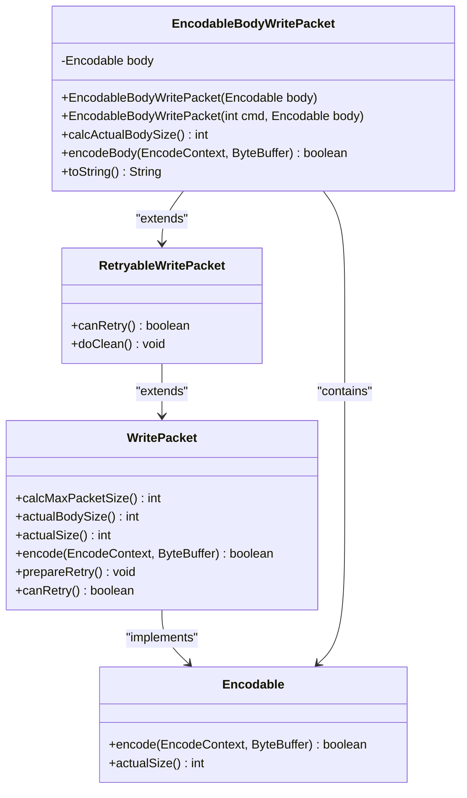
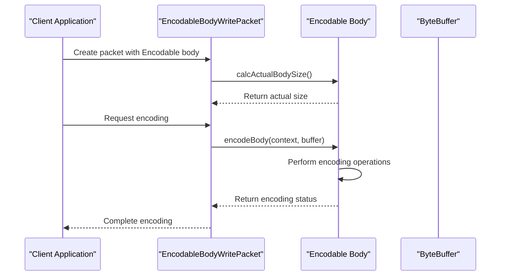
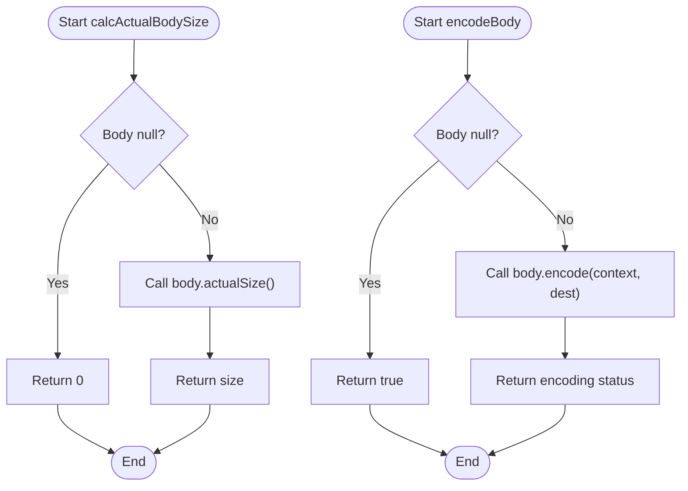
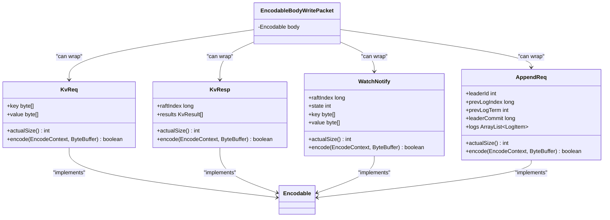
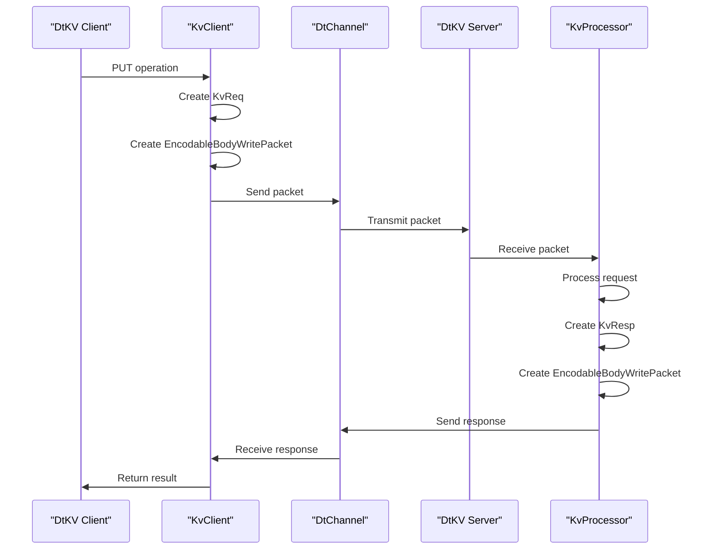

# EncodableBodyWritePacket for Generic Encodable Payloads

<cite>
**Referenced Files in This Document**   
- [EncodableBodyWritePacket.java](file://client/src/main/java/com/github/dtprj/dongting/net/EncodableBodyWritePacket.java)
- [RetryableWritePacket.java](file://client/src/main/java/com/github/dtprj/dongting/net/RetryableWritePacket.java)
- [WritePacket.java](file://client/src/main/java/com/github/dtprj/dongting/net/WritePacket.java)
- [Encodable.java](file://client/src/main/java/com/github/dtprj/dongting/codec/Encodable.java)
- [KvReq.java](file://client/src/main/java/com/github/dtprj/dongting/dtkv/KvReq.java)
- [KvResp.java](file://client/src/main/java/com/github/dtprj/dongting/dtkv/KvResp.java)
- [WatchNotify.java](file://client/src/main/java/com/github/dtprj/dongting/dtkv/WatchNotify.java)
- [AppendReq.java](file://server/src/main/java/com/github/dtprj/dongting/raft/rpc/AppendReq.java)
- [KvProcessor.java](file://server/src/main/java/com/github/dtprj/dongting/dtkv/server/KvProcessor.java)
- [DistributedLockImpl.java](file://client/src/main/java/com/github/dtprj/dongting/dtkv/DistributedLockImpl.java)
</cite>

## Table of Contents
1. [Introduction](#introduction)
2. [Core Architecture](#core-architecture)
3. [Composition and Delegation Pattern](#composition-and-delegation-pattern)
4. [Size Calculation and Encoding](#size-calculation-and-encoding)
5. [Polymorphic Packet Construction](#polymorphic-packet-construction)
6. [Retry Capability](#retry-capability)
7. [Debugging Support](#debugging-support)
8. [Usage Examples](#usage-examples)
9. [Performance Implications](#performance-implications)
10. [Conclusion](#conclusion)

## Introduction
The EncodableBodyWritePacket class provides a flexible mechanism for wrapping any Encodable object as a packet payload in the Dongting networking framework. This design enables a uniform interface for transmitting diverse message types across the network while maintaining type safety and encoding efficiency. The class serves as a fundamental building block for both the RAFT consensus protocol and DtKV distributed key-value operations, allowing different message types to be transmitted through a consistent packet interface.

**Section sources**
- [EncodableBodyWritePacket.java](file://client/src/main/java/com/github/dtprj/dongting/net/EncodableBodyWritePacket.java#L1-L56)

## Core Architecture
The EncodableBodyWritePacket class is designed as a generic wrapper that encapsulates any object implementing the Encodable interface. This architecture follows a composition pattern where the packet delegates encoding responsibilities to its contained body object. The class hierarchy shows that EncodableBodyWritePacket extends RetryableWritePacket, which in turn extends the abstract WritePacket class that implements both Packet and Encodable interfaces.

**Diagram sources**
- [EncodableBodyWritePacket.java](file://client/src/main/java/com/github/dtprj/dongting/net/EncodableBodyWritePacket.java#L26-L56)
- [RetryableWritePacket.java](file://client/src/main/java/com/github/dtprj/dongting/net/RetryableWritePacket.java#L21-L35)
- [WritePacket.java](file://client/src/main/java/com/github/dtprj/dongting/net/WritePacket.java#L30-L181)
- [Encodable.java](file://client/src/main/java/com/github/dtprj/dongting/codec/Encodable.java#L23-L30)

## Composition and Delegation Pattern
The EncodableBodyWritePacket employs a composition pattern by containing a generic Encodable body object as its core component. This design follows the delegation principle where the packet does not implement encoding logic itself but delegates this responsibility to the contained body object. The body field is declared as final, ensuring immutability after construction and thread safety in concurrent environments.

The delegation pattern enables the packet to handle any message type that implements the Encodable interface without requiring specialized packet classes for each message type. This approach promotes code reuse and reduces the complexity of the networking layer by providing a uniform way to handle diverse message payloads.

**Diagram sources**
- [EncodableBodyWritePacket.java](file://client/src/main/java/com/github/dtprj/dongting/net/EncodableBodyWritePacket.java#L28-L37)
- [WritePacket.java](file://client/src/main/java/com/github/dtprj/dongting/net/WritePacket.java#L58-L60)

## Size Calculation and Encoding
The EncodableBodyWritePacket implements two critical methods for packet processing: calcActualBodySize() and encodeBody(). The calcActualBodySize() method determines the actual size of the packet body by either returning the body's actualSize() or zero if the body is null. This method is called during the packet size calculation phase to determine the total packet size before encoding.

The encodeBody() method directly delegates to the contained body's encode() method, passing through the EncodeContext and destination ByteBuffer. This direct delegation ensures that the encoding logic remains encapsulated within the message object itself, following the single responsibility principle. The method handles the null body case by returning true, indicating successful encoding of an empty body.

**Diagram sources**
- [EncodableBodyWritePacket.java](file://client/src/main/java/com/github/dtprj/dongting/net/EncodableBodyWritePacket.java#L39-L50)
- [WritePacket.java](file://client/src/main/java/com/github/dtprj/dongting/net/WritePacket.java#L73-L80)

## Polymorphic Packet Construction
The EncodableBodyWritePacket enables polymorphic packet construction by providing a uniform interface for transmitting different message types. This polymorphism is achieved through the Encodable interface, which serves as a common contract for all message types. The packet can wrap various message types such as KvReq, KvResp, WatchNotify, and AppendReq, allowing them to be transmitted through the same networking infrastructure.

This design supports the RAFT protocol's requirement for different message types (AppendEntries, RequestVote, InstallSnapshot) while maintaining a consistent packet interface. Similarly, for DtKV operations, it enables the transmission of various request and response types (PUT, REMOVE, CAS, WATCH) through a uniform mechanism.

**Diagram sources**
- [EncodableBodyWritePacket.java](file://client/src/main/java/com/github/dtprj/dongting/net/EncodableBodyWritePacket.java#L26-L56)
- [KvReq.java](file://client/src/main/java/com/github/dtprj/dongting/dtkv/KvReq.java#L33-L266)
- [KvResp.java](file://client/src/main/java/com/github/dtprj/dongting/dtkv/KvResp.java#L32-L121)
- [WatchNotify.java](file://client/src/main/java/com/github/dtprj/dongting/dtkv/WatchNotify.java#L30-L127)
- [AppendReq.java](file://server/src/main/java/com/github/dtprj/dongting/raft/rpc/AppendReq.java#L44-L163)

## Retry Capability
The EncodableBodyWritePacket inherits retry capability from its parent class RetryableWritePacket. This capability is essential for distributed systems where network failures may require message retransmission. The canRetry() method in RetryableWritePacket returns true, indicating that the packet can be retried in case of transmission failure.

The retry mechanism is particularly important for RAFT protocol operations and DtKV transactions, where message delivery must be guaranteed for consistency. When a packet needs to be retried, the prepareRetry() method resets the packet state, allowing it to be re-encoded and transmitted again. This design ensures that packets can survive transient network failures without requiring the application to reconstruct the message.

**Section sources**
- [RetryableWritePacket.java](file://client/src/main/java/com/github/dtprj/dongting/net/RetryableWritePacket.java#L21-L35)
- [WritePacket.java](file://client/src/main/java/com/github/dtprj/dongting/net/WritePacket.java#L172-L179)

## Debugging Support
The EncodableBodyWritePacket provides built-in debugging support through its toString() implementation. The method returns a string representation that includes the packet type and the string representation of the contained body. This debugging information is invaluable for troubleshooting network issues, monitoring message flow, and analyzing system behavior during development and production.

The toString() method follows Java conventions by providing a meaningful string representation that can be used in logging frameworks, debugging tools, and monitoring systems. By including the body's toString() output, it enables developers to quickly inspect the content of transmitted messages without requiring additional debugging infrastructure.

**Section sources**
- [EncodableBodyWritePacket.java](file://client/src/main/java/com/github/dtprj/dongting/net/EncodableBodyWritePacket.java#L52-L55)

## Usage Examples
The EncodableBodyWritePacket is extensively used in both RAFT protocol operations and DtKV distributed key-value operations. In the RAFT protocol, it wraps AppendReq messages for log replication, VoteReq messages for leader election, and InstallSnapshotReq messages for state synchronization. For DtKV operations, it handles various request types including PUT, REMOVE, CAS, and WATCH operations.

In the DtKV implementation, the KvProcessor creates response packets using EncodableBodyWritePacket when processing successful operations. Similarly, the DistributedLockImpl uses this packet type for lock operations such as tryLock, unlock, and lease renewal. The WatchManager uses it to send watch notifications to clients when watched keys change.

**Diagram sources**
- [KvProcessor.java](file://server/src/main/java/com/github/dtprj/dongting/dtkv/server/KvProcessor.java#L213-L247)
- [DistributedLockImpl.java](file://client/src/main/java/com/github/dtprj/dongting/dtkv/DistributedLockImpl.java#L410-L600)
- [KvClient.java](file://client/src/main/java/com/github/dtprj/dongting/dtkv/KvClient.java#L134-L171)

## Performance Implications
The delegation pattern used by EncodableBodyWritePacket has several performance implications compared to specialized packet types. The primary advantage is reduced code duplication and maintenance overhead, as each message type implements its own encoding logic rather than having packet-specific encoding code.

However, this approach introduces a small performance overhead due to the additional method call indirection. The delegation requires two method calls (encodeBody() on the packet and encode() on the body) instead of a single direct encoding method. Additionally, the object composition creates an extra layer of indirection that may impact cache locality.

Despite these minor overheads, the benefits of the delegation pattern outweigh the costs in most scenarios. The design enables better code organization, easier extension with new message types, and improved testability. The performance impact is typically negligible compared to the network I/O costs in distributed systems.

**Section sources**
- [EncodableBodyWritePacket.java](file://client/src/main/java/com/github/dtprj/dongting/net/EncodableBodyWritePacket.java#L26-L56)
- [WritePacket.java](file://client/src/main/java/com/github/dtprj/dongting/net/WritePacket.java#L113-L163)

## Conclusion
The EncodableBodyWritePacket class provides a flexible and extensible mechanism for wrapping Encodable objects as packet payloads in the Dongting framework. By employing a composition and delegation pattern, it enables polymorphic packet construction where diverse message types can be transmitted through a uniform interface. The class supports critical features such as retry capability for fault tolerance and provides debugging support through its toString() implementation.

This design is particularly effective for distributed systems like RAFT and DtKV, where multiple message types must be transmitted reliably over the network. The delegation pattern promotes code reuse and maintainability while incurring minimal performance overhead. The EncodableBodyWritePacket serves as a fundamental building block that enables the framework to handle complex distributed protocols with a clean and consistent API.

**Section sources**
- [EncodableBodyWritePacket.java](file://client/src/main/java/com/github/dtprj/dongting/net/EncodableBodyWritePacket.java#L1-L56)
- [RetryableWritePacket.java](file://client/src/main/java/com/github/dtprj/dongting/net/RetryableWritePacket.java#L1-L35)
- [WritePacket.java](file://client/src/main/java/com/github/dtprj/dongting/net/WritePacket.java#L1-L181)