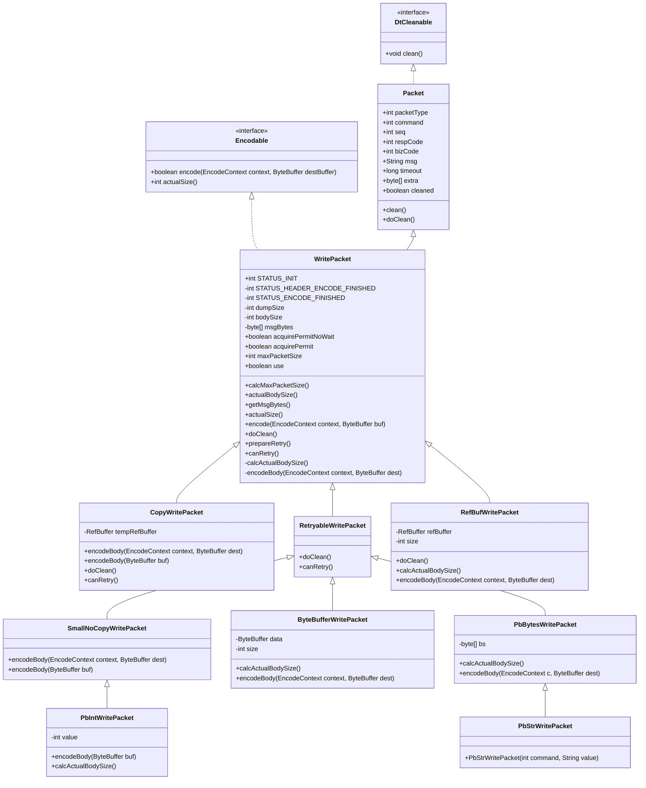
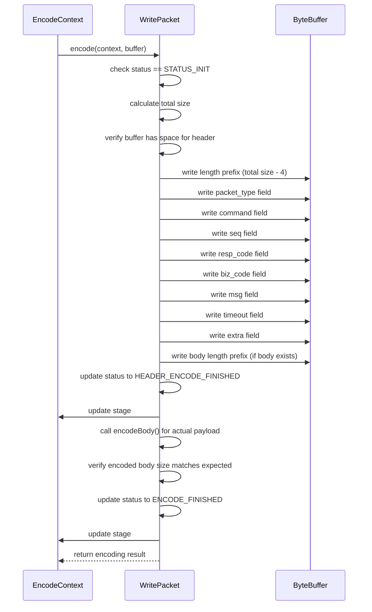
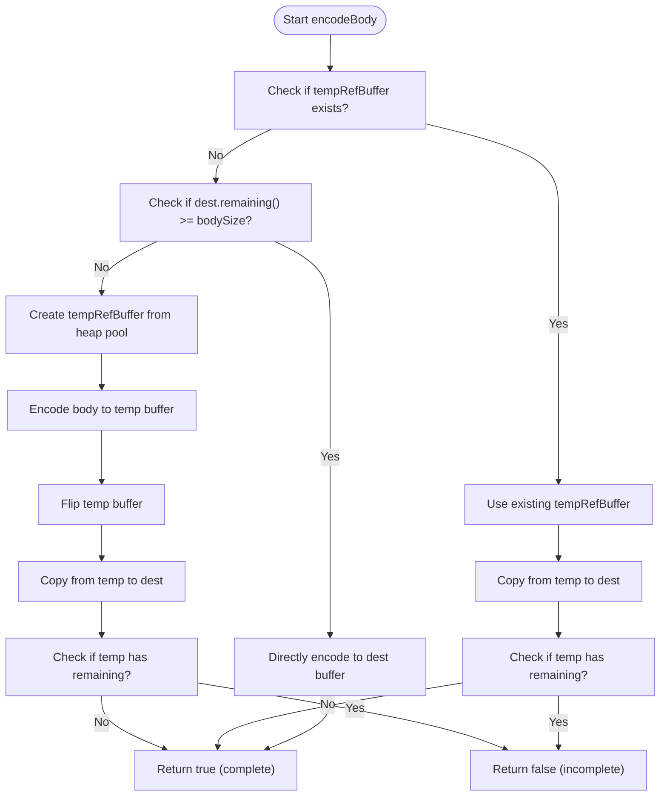
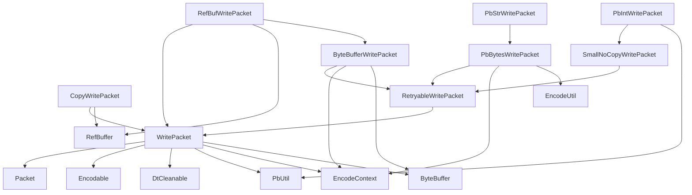

# Packet Encoding and Write Packets

<cite>
**Referenced Files in This Document**   
- [WritePacket.java](file://client/src/main/java/com/github/dtprj/dongting/net/WritePacket.java)
- [Packet.java](file://client/src/main/java/com/github/dtprj/dongting/net/Packet.java)
- [Encodable.java](file://client/src/main/java/com/github/dtprj/dongting/codec/Encodable.java)
- [DtCleanable.java](file://client/src/main/java/com/github/dtprj/dongting/common/DtCleanable.java)
- [CopyWritePacket.java](file://client/src/main/java/com/github/dtprj/dongting/net/CopyWritePacket.java)
- [RetryableWritePacket.java](file://client/src/main/java/com/github/dtprj/dongting/net/RetryableWritePacket.java)
- [SmallNoCopyWritePacket.java](file://client/src/main/java/com/github/dtprj/dongting/net/SmallNoCopyWritePacket.java)
- [ByteBufferWritePacket.java](file://client/src/main/java/com/github/dtprj/dongting/net/ByteBufferWritePacket.java)
- [RefBufWritePacket.java](file://client/src/main/java/com/github/dtprj/dongting/net/RefBufWritePacket.java)
- [PbIntWritePacket.java](file://client/src/main/java/com/github/dtprj/dongting/net/PbIntWritePacket.java)
- [PbStrWritePacket.java](file://client/src/main/java/com/github/dtprj/dongting/net/PbStrWritePacket.java)
- [PbBytesWritePacket.java](file://client/src/main/java/com/github/dtprj/dongting/net/PbBytesWritePacket.java)
</cite>

## Table of Contents
1. [Introduction](#introduction)
2. [Core Components](#core-components)
3. [Architecture Overview](#architecture-overview)
4. [Detailed Component Analysis](#detailed-component-analysis)
5. [Dependency Analysis](#dependency-analysis)
6. [Performance Considerations](#performance-considerations)
7. [Troubleshooting Guide](#troubleshooting-guide)
8. [Conclusion](#conclusion)

## Introduction
The Dongting packet encoding system provides a flexible and efficient framework for network communication through a hierarchy of WritePacket classes. This system enables various encoding strategies while maintaining consistent packet structure and lifecycle management. The design supports different buffer types, retry mechanisms, and specialized encoding for common data types, making it suitable for high-performance network applications.

## Core Components

The packet encoding system is built around the WritePacket hierarchy, which implements the Encodable interface for serialization and DtCleanable for resource management. The system manages packet state through a well-defined lifecycle and provides specialized implementations for different use cases, including heap buffer copying, direct buffer handling, reference-counted buffers, and protobuf-encoded payloads.

**Section sources**
- [WritePacket.java](file://client/src/main/java/com/github/dtprj/dongting/net/WritePacket.java)
- [Packet.java](file://client/src/main/java/com/github/dtprj/dongting/net/Packet.java)
- [Encodable.java](file://client/src/main/java/com/github/dtprj/dongting/codec/Encodable.java)

## Architecture Overview

**Diagram sources**
- [WritePacket.java](file://client/src/main/java/com/github/dtprj/dongting/net/WritePacket.java)
- [Packet.java](file://client/src/main/java/com/github/dtprj/dongting/net/Packet.java)
- [Encodable.java](file://client/src/main/java/com/github/dtprj/dongting/codec/Encodable.java)
- [DtCleanable.java](file://client/src/main/java/com/github/dtprj/dongting/common/DtCleanable.java)

## Detailed Component Analysis

### WritePacket Base Class Analysis
The WritePacket class serves as the foundation for all packet encoding operations in the Dongting system. It implements both Encodable and DtCleanable interfaces, providing a complete lifecycle for packet creation, encoding, and resource cleanup. The class manages packet state through three distinct stages: STATUS_INIT, STATUS_HEADER_ENCODE_FINISHED, and STATUS_ENCODE_FINISHED, ensuring proper encoding sequence.

The encoding process is divided into two phases: header encoding and body encoding. The header contains metadata such as packet type, command, sequence number, and other control fields, while the body contains the payload data. The system calculates the total packet size upfront, including both header and body, to ensure sufficient buffer space is available.

Key methods in the WritePacket class include:
- calcActualBodySize(): Abstract method that must be implemented by subclasses to determine the actual size of the packet body
- encodeBody(): Abstract method that performs the actual body encoding to the destination buffer
- actualSize(): Calculates the total packet size including header and body
- encode(): Orchestrates the two-phase encoding process, first writing the header and then the body
- doClean(): Hook method for resource cleanup, called during packet cleanup
- prepareRetry(): Resets packet state for retry operations
- canRetry(): Indicates whether the packet supports retry operations

The class also implements a caching mechanism for maxPacketSize to avoid repeated size calculations, improving performance for packets that are encoded multiple times.

**Section sources**
- [WritePacket.java](file://client/src/main/java/com/github/dtprj/dongting/net/WritePacket.java)

### Packet Encoding Lifecycle
The packet encoding lifecycle follows a structured process to ensure reliable and efficient serialization. The process begins with size calculation, proceeds through header encoding, and concludes with body encoding. This two-phase approach allows for partial encoding support, which is essential for handling large messages that may not fit in a single buffer.

The encoding sequence diagram illustrates this process:

**Diagram sources**
- [WritePacket.java](file://client/src/main/java/com/github/dtprj/dongting/net/WritePacket.java)

### WritePacket Specializations
The Dongting system provides several specialized WritePacket implementations to handle different encoding scenarios and buffer types. These specializations inherit from the base WritePacket class and extend its functionality for specific use cases.

#### CopyWritePacket
The CopyWritePacket class provides a mechanism for copying data from various sources to the destination buffer. It uses a temporary RefBuffer when the destination buffer doesn't have sufficient space for the entire body. This approach allows for efficient encoding even when buffer space is limited.

**Diagram sources**
- [CopyWritePacket.java](file://client/src/main/java/com/github/dtprj/dongting/net/CopyWritePacket.java)

#### RetryableWritePacket
The RetryableWritePacket class is designed for operations that may need to be retried. Unlike regular packets, it disables automatic cleanup in doClean() to prevent issues with non-idempotent cleanup operations. This allows the packet to be reused across multiple attempts, with cleanup responsibility delegated to the RPC callback.

**Section sources**
- [RetryableWritePacket.java](file://client/src/main/java/com/github/dtprj/dongting/net/RetryableWritePacket.java)

#### SmallNoCopyWritePacket
The SmallNoCopyWritePacket class is optimized for small messages that can be encoded in a single operation. It extends RetryableWritePacket and provides a simple encodeBody implementation that requires the destination buffer to have sufficient space for the entire body.

**Section sources**
- [SmallNoCopyWritePacket.java](file://client/src/main/java/com/github/dtprj/dongting/net/SmallNoCopyWritePacket.java)

#### ByteBufferWritePacket
The ByteBufferWritePacket class handles direct encoding from ByteBuffer instances, supporting both heap and direct buffers. It includes utility methods for efficient copying from different buffer types and manages partial encoding through the EncodeContext status field.

**Section sources**
- [ByteBufferWritePacket.java](file://client/src/main/java/com/github/dtprj/dongting/net/ByteBufferWritePacket.java)

#### RefBufWritePacket
The RefBufWritePacket class manages reference-counted buffers (RefBuffer), ensuring proper resource management through automatic release in the doClean method. It delegates the actual encoding to ByteBufferWritePacket's static methods.

**Section sources**
- [RefBufWritePacket.java](file://client/src/main/java/com/github/dtprj/dongting/net/RefBufWritePacket.java)

#### Protobuf-Specific Packets
The system includes specialized packets for common protobuf-encoded data types:

- PbIntWritePacket: Encodes integer values using protobuf fixed32 format
- PbStrWritePacket: Encodes string values by converting to UTF-8 bytes
- PbBytesWritePacket: Encodes byte arrays with protobuf length-prefixing

These classes provide optimized encoding for frequently used data types, reducing boilerplate code and improving performance.

**Section sources**
- [PbIntWritePacket.java](file://client/src/main/java/com/github/dtprj/dongting/net/PbIntWritePacket.java)
- [PbStrWritePacket.java](file://client/src/main/java/com/github/dtprj/dongting/net/PbStrWritePacket.java)
- [PbBytesWritePacket.java](file://client/src/main/java/com/github/dtprj/dongting/net/PbBytesWritePacket.java)

## Dependency Analysis

**Diagram sources**
- [WritePacket.java](file://client/src/main/java/com/github/dtprj/dongting/net/WritePacket.java)
- [CopyWritePacket.java](file://client/src/main/java/com/github/dtprj/dongting/net/CopyWritePacket.java)
- [RetryableWritePacket.java](file://client/src/main/java/com/github/dtprj/dongting/net/RetryableWritePacket.java)
- [SmallNoCopyWritePacket.java](file://client/src/main/java/com/github/dtprj/dongting/net/SmallNoCopyWritePacket.java)
- [ByteBufferWritePacket.java](file://client/src/main/java/com/github/dtprj/dongting/net/ByteBufferWritePacket.java)
- [RefBufWritePacket.java](file://client/src/main/java/com/github/dtprj/dongting/net/RefBufWritePacket.java)
- [PbIntWritePacket.java](file://client/src/main/java/com/github/dtprj/dongting/net/PbIntWritePacket.java)
- [PbStrWritePacket.java](file://client/src/main/java/com/github/dtprj/dongting/net/PbStrWritePacket.java)
- [PbBytesWritePacket.java](file://client/src/main/java/com/github/dtprj/dongting/net/PbBytesWritePacket.java)

## Performance Considerations
The packet encoding system incorporates several performance optimizations:

1. **Size Caching**: The maxPacketSize field caches the calculated maximum packet size to avoid repeated calculations during encoding.

2. **Two-Phase Encoding**: The separation of header and body encoding allows for partial encoding support, enabling efficient handling of large messages that span multiple buffers.

3. **Buffer Management**: Specialized packet types like CopyWritePacket and ByteBufferWritePacket optimize buffer usage based on the source data type and available space.

4. **Minimal Object Creation**: The system minimizes temporary object creation by reusing buffers and context objects where possible.

5. **Direct Buffer Support**: ByteBufferWritePacket efficiently handles direct buffers without unnecessary copying.

6. **Reference Counting**: RefBufWritePacket integrates with the reference counting system to ensure timely resource cleanup without premature release.

## Troubleshooting Guide
Common issues and their solutions:

1. **Incomplete Encoding**: If encode() returns false, check that the destination buffer has sufficient remaining space. For large messages, ensure the encoding process can be resumed with the same context.

2. **Body Size Mismatch**: The system validates that the encoded body size matches the expected size. Ensure calcActualBodySize() returns the correct value and that encodeBody() writes exactly that many bytes.

3. **Resource Leaks**: For packets using RefBuffer or other managed resources, ensure doClean() properly releases all resources. Use RefBufWritePacket for automatic reference counting.

4. **Retry Issues**: For retryable packets, remember that doClean() is disabled by default. Perform cleanup operations in the RPC callback instead.

5. **Thread Safety**: WritePacket instances are not thread-safe. Do not share packet instances across multiple encoding operations concurrently.

**Section sources**
- [WritePacket.java](file://client/src/main/java/com/github/dtprj/dongting/net/WritePacket.java)
- [CopyWritePacket.java](file://client/src/main/java/com/github/dtprj/dongting/net/CopyWritePacket.java)
- [RetryableWritePacket.java](file://client/src/main/java/com/github/dtprj/dongting/net/RetryableWritePacket.java)

## Conclusion
The Dongting packet encoding system provides a robust and flexible framework for network communication. The WritePacket hierarchy offers a comprehensive set of tools for handling various encoding scenarios, from simple integer values to complex buffer types. The system's design emphasizes performance, resource management, and reliability, making it suitable for high-throughput network applications. By understanding the base WritePacket class and its specializations, developers can effectively utilize the system for their specific use cases while leveraging its built-in optimizations and safety features.