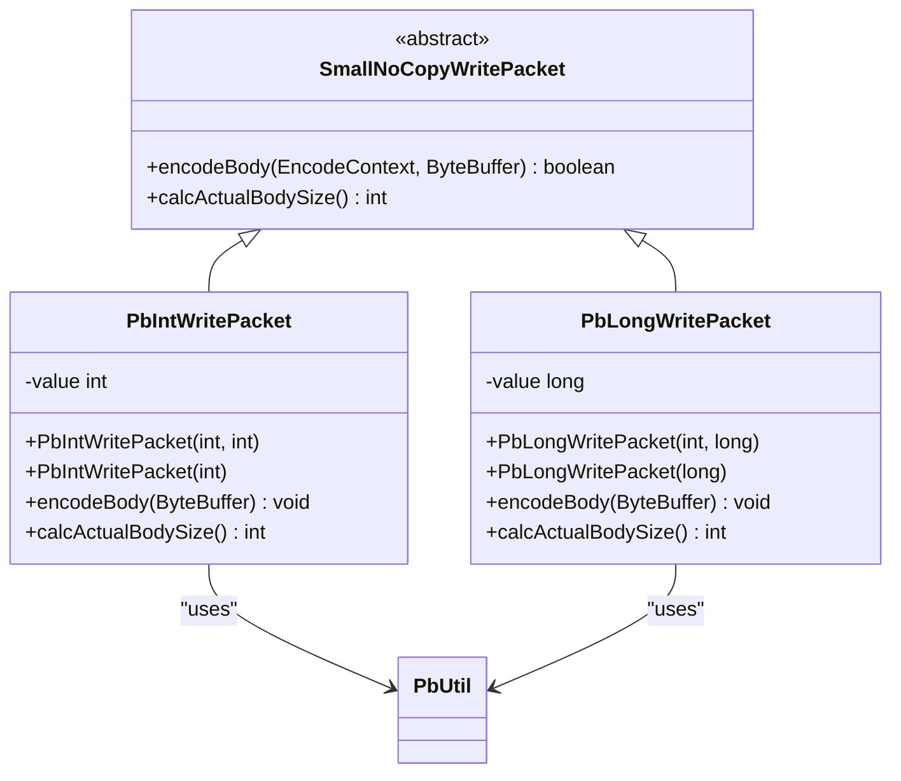
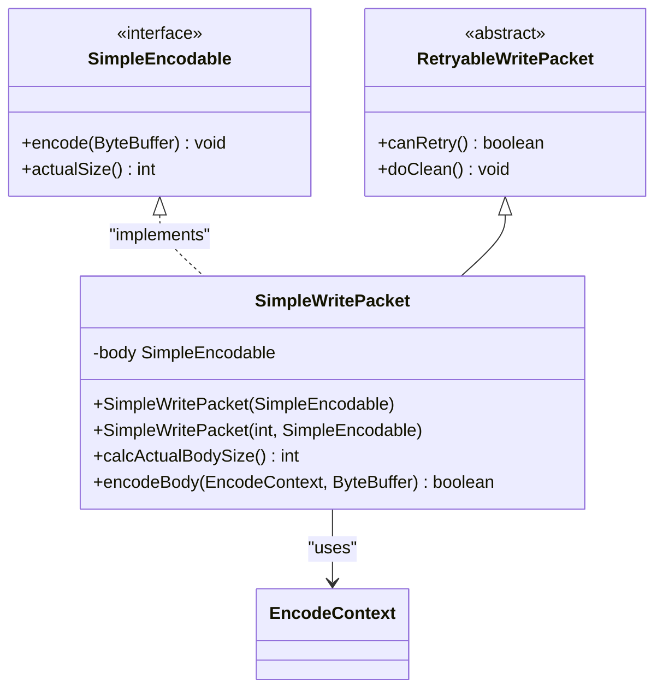
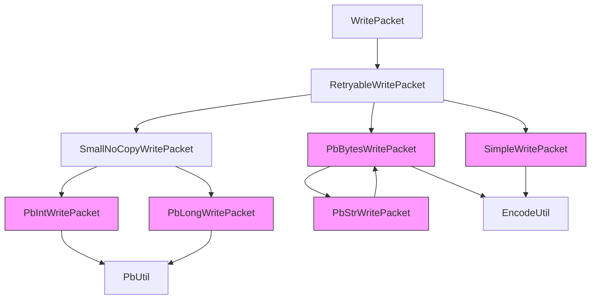

# Protobuf Primitive Write Packets

<cite>
**Referenced Files in This Document**   
- [PbBytesWritePacket.java](file://client/src/main/java/com/github/dtprj/dongting/net/PbBytesWritePacket.java)
- [PbIntWritePacket.java](file://client/src/main/java/com/github/dtprj/dongting/net/PbIntWritePacket.java)
- [PbLongWritePacket.java](file://client/src/main/java/com/github/dtprj/dongting/net/PbLongWritePacket.java)
- [PbStrWritePacket.java](file://client/src/main/java/com/github/dtprj/dongting/net/PbStrWritePacket.java)
- [SimpleWritePacket.java](file://client/src/main/java/com/github/dtprj/dongting/net/SimpleWritePacket.java)
- [SmallNoCopyWritePacket.java](file://client/src/main/java/com/github/dtprj/dongting/net/SmallNoCopyWritePacket.java)
- [RetryableWritePacket.java](file://client/src/main/java/com/github/dtprj/dongting/net/RetryableWritePacket.java)
- [EncodeUtil.java](file://client/src/main/java/com/github/dtprj/dongting/codec/EncodeUtil.java)
- [PbUtil.java](file://client/src/main/java/com/github/dtprj/dongting/codec/PbUtil.java)
- [SimpleEncodable.java](file://client/src/main/java/com/github/dtprj/dongting/codec/SimpleEncodable.java)
- [Commands.java](file://client/src/main/java/com/github/dtprj/dongting/net/Commands.java)
</cite>

## Table of Contents
1. [Introduction](#introduction)
2. [PbBytesWritePacket: Byte Array Encoding](#pbbyteswritepacket-byte-array-encoding)
3. [PbIntWritePacket and PbLongWritePacket: Integer Encoding](#pbintwritepacket-and-pblongwritepacket-integer-encoding)
4. [PbStrWritePacket: String Encoding](#pbstrwritepacket-string-encoding)
5. [SimpleWritePacket: Simple Object Encoding](#simplewritepacket-simple-object-encoding)
6. [Performance Optimizations](#performance-optimizations)
7. [Usage Examples](#usage-examples)
8. [Architecture Overview](#architecture-overview)
9. [Conclusion](#conclusion)

## Introduction
The Dongting framework provides a family of optimized protobuf write packets designed for efficient encoding of primitive data types. These classes leverage protobuf's length-prefixing and efficient integer encoding to minimize overhead in network communication. The packet hierarchy is built around performance-critical operations, with specialized implementations for different data types that avoid unnecessary object allocation and copying. This document details the design and implementation of these primitive write packets, focusing on their role in encoding basic data types with minimal overhead.

## PbBytesWritePacket: Byte Array Encoding

The `PbBytesWritePacket` class is designed for efficient encoding of byte arrays using protobuf's length-prefixing mechanism. It extends `RetryableWritePacket` and implements the core functionality for encoding byte arrays in protobuf format.

The packet calculates its actual body size using `EncodeUtil.sizeOf()` which determines the required space for the protobuf length-delimited field encoding. This calculation includes the tag byte(s), the length prefix, and the actual byte array data. During encoding, `encodeBody()` delegates to `EncodeUtil.encode()` which handles the actual serialization process, including writing the field tag, length prefix, and the byte array content.

This implementation is optimized for performance by avoiding intermediate object creation and directly writing to the destination buffer. The use of protobuf's length-delimited encoding ensures that byte arrays of any size can be efficiently transmitted while maintaining the self-describing nature of protobuf messages.

**Section sources**
- [PbBytesWritePacket.java](file://client/src/main/java/com/github/dtprj/dongting/net/PbBytesWritePacket.java#L26-L44)
- [EncodeUtil.java](file://client/src/main/java/com/github/dtprj/dongting/codec/EncodeUtil.java#L187-L198)

## PbIntWritePacket and PbLongWritePacket: Integer Encoding

The `PbIntWritePacket` and `PbLongWritePacket` classes are specialized implementations that extend `SmallNoCopyWritePacket` for encoding 32-bit and 64-bit integers respectively. These classes leverage protobuf's fixed32 and fixed64 encoding types to provide minimal overhead for integer transmission.

Both classes implement a key performance optimization by returning a body size of 0 when the value is zero, effectively omitting zero-valued fields from the encoded message. For non-zero values, `PbIntWritePacket` requires exactly 5 bytes (1 byte for the tag and 4 bytes for the fixed32 value) while `PbLongWritePacket` requires 9 bytes (1 byte for the tag and 8 bytes for the fixed64 value).

The encoding process uses direct ByteBuffer operations with byte order reversal to ensure network byte order compatibility. `PbIntWritePacket` calls `PbUtil.writeFix32Field()` while `PbLongWritePacket` calls `PbUtil.writeFix64Field()`, both of which write the protobuf tag followed by the fixed-width integer value in big-endian format.

This design provides optimal performance for integer encoding by avoiding varint encoding overhead when the exact size is known and fixed, making it particularly suitable for protocol headers, sequence numbers, and other fields where predictable sizing is beneficial.

**Diagram sources **
- [PbIntWritePacket.java](file://client/src/main/java/com/github/dtprj/dongting/net/PbIntWritePacket.java#L25-L47)
- [PbLongWritePacket.java](file://client/src/main/java/com/github/dtprj/dongting/net/PbLongWritePacket.java#L25-L47)
- [SmallNoCopyWritePacket.java](file://client/src/main/java/com/github/dtprj/dongting/net/SmallNoCopyWritePacket.java#L25-L36)
- [PbUtil.java](file://client/src/main/java/com/github/dtprj/dongting/codec/PbUtil.java#L109-L134)

**Section sources**
- [PbIntWritePacket.java](file://client/src/main/java/com/github/dtprj/dongting/net/PbIntWritePacket.java#L25-L47)
- [PbLongWritePacket.java](file://client/src/main/java/com/github/dtprj/dongting/net/PbLongWritePacket.java#L25-L47)

## PbStrWritePacket: String Encoding

The `PbStrWritePacket` class serves as a convenience wrapper around `PbBytesWritePacket` for encoding string data. It automatically converts strings to UTF-8 byte arrays before transmission, simplifying the encoding process for string-based payloads.

This implementation inherits all the performance characteristics of `PbBytesWritePacket` while adding string-specific functionality. When constructed, it immediately converts the input string to a UTF-8 byte array using `StandardCharsets.UTF_8`, which is then passed to the parent class constructor. This conversion happens once during packet creation, avoiding repeated encoding operations during transmission attempts.

The class is particularly useful for transmitting text-based data such as command parameters, error messages, and configuration values. By handling the UTF-8 conversion internally, it ensures consistent encoding across the system and relieves callers from managing character encoding concerns.

**Section sources**
- [PbStrWritePacket.java](file://client/src/main/java/com/github/dtprj/dongting/net/PbStrWritePacket.java#L23-L28)
- [PbBytesWritePacket.java](file://client/src/main/java/com/github/dtprj/dongting/net/PbBytesWritePacket.java#L26-L44)

## SimpleWritePacket: Simple Object Encoding

The `SimpleWritePacket` class provides a flexible mechanism for encoding objects that implement the `SimpleEncodable` interface. It extends `RetryableWritePacket` and is designed for efficient encoding of simple objects that only require a ByteBuffer parameter for serialization.

This packet type uses the `SimpleEncodable` interface which defines two methods: `encode(ByteBuffer buf)` for writing data to a buffer, and `actualSize()` for determining the required space. The `SimpleWritePacket` delegates to these methods, first calculating the body size through `actualSize()` and then performing the encoding through the `encode()` method.

The implementation includes optimization for partial writes by tracking encoding progress through the `EncodeContext` object. If insufficient buffer space is available, the encoding can be resumed later without重新计算 or重新编码 already processed data. This makes it suitable for scenarios where buffer space may be limited or fragmented.

**Diagram sources **
- [SimpleWritePacket.java](file://client/src/main/java/com/github/dtprj/dongting/net/SimpleWritePacket.java#L26-L52)
- [SimpleEncodable.java](file://client/src/main/java/com/github/dtprj/dongting/codec/SimpleEncodable.java#L23-L27)
- [RetryableWritePacket.java](file://client/src/main/java/com/github/dtprj/dongting/net/RetryableWritePacket.java#L21-L35)

**Section sources**
- [SimpleWritePacket.java](file://client/src/main/java/com/github/dtprj/dongting/net/SimpleWritePacket.java#L26-L52)
- [SimpleEncodable.java](file://client/src/main/java/com/github/dtprj/dongting/codec/SimpleEncodable.java#L23-L27)

## Performance Optimizations

The protobuf primitive write packets incorporate several key performance optimizations that make them suitable for high-throughput network applications:

1. **Zero-value optimization**: Both `PbIntWritePacket` and `PbLongWritePacket` return a body size of 0 for zero values, effectively omitting these fields from the encoded message. This reduces bandwidth usage and processing overhead for commonly zero-valued fields.

2. **Fixed-width encoding**: By using protobuf's fixed32 and fixed64 types instead of varint encoding, these packets provide predictable sizing and faster encoding/decoding, as there is no need to calculate variable-length encodings.

3. **Minimal object allocation**: The design avoids creating intermediate objects during encoding. Byte arrays are written directly to the destination buffer, and string-to-byte conversion happens only once during packet construction.

4. **Efficient length calculation**: The `calcActualBodySize()` method precisely calculates the required space before encoding begins, preventing buffer resizing operations and ensuring optimal memory usage.

5. **Retryable design**: Inheriting from `RetryableWritePacket` allows these packets to be retransmitted without recreation, preserving their state across transmission attempts.

These optimizations collectively reduce CPU overhead, memory allocation, and network bandwidth, making these packets ideal for performance-critical applications.

**Section sources**
- [PbIntWritePacket.java](file://client/src/main/java/com/github/dtprj/dongting/net/PbIntWritePacket.java#L44-L46)
- [PbLongWritePacket.java](file://client/src/main/java/com/github/dtprj/dongting/net/PbLongWritePacket.java#L43-L46)
- [PbUtil.java](file://client/src/main/java/com/github/dtprj/dongting/codec/PbUtil.java#L349-L379)
- [EncodeUtil.java](file://client/src/main/java/com/github/dtprj/dongting/codec/EncodeUtil.java#L187-L236)

## Usage Examples

The protobuf primitive write packets are commonly used in various scenarios throughout the Dongting framework:

1. **Protocol headers**: `PbIntWritePacket` and `PbLongWritePacket` are used for encoding sequence numbers, command identifiers, and status codes in protocol headers. For example, the `Commands.java` file defines constants like `CMD_PING = 1` and `CMD_HANDSHAKE = 2` that are transmitted using these packets.

2. **Simple command parameters**: These packets are ideal for transmitting simple command parameters such as group IDs, node IDs, and configuration values. For instance, `PbIntWritePacket` is used to send group IDs in raft consensus operations.

3. **Status queries**: The framework uses `PbIntWritePacket` with `Commands.RAFT_QUERY_STATUS` to query the status of raft nodes, demonstrating how integer packets can represent both the command type and its parameters.

4. **String-based commands**: `PbStrWritePacket` is used for commands that require string parameters, such as configuration keys or error messages, automatically handling UTF-8 encoding.

5. **Complex object wrappers**: `SimpleWritePacket` is used to wrap complex objects that implement `SimpleEncodable`, allowing efficient transmission of structured data without the overhead of full protobuf message creation.

These usage patterns demonstrate how the primitive write packets provide a lightweight alternative to full protobuf message serialization for simple data types, reducing both code complexity and runtime overhead.

**Section sources**
- [Commands.java](file://client/src/main/java/com/github/dtprj/dongting/net/Commands.java#L21-L69)
- [PbIntWritePacket.java](file://client/src/main/java/com/github/dtprj/dongting/net/PbIntWritePacket.java#L29-L36)
- [PbStrWritePacket.java](file://client/src/main/java/com/github/dtprj/dongting/net/PbStrWritePacket.java#L25-L27)

## Architecture Overview

The protobuf primitive write packet family follows a hierarchical design pattern that maximizes code reuse while optimizing for performance. At the base of the hierarchy is `WritePacket`, extended by `RetryableWritePacket` which provides retry capabilities. The `SmallNoCopyWritePacket` class serves as an intermediate base for integer encoding packets, providing a template for fixed-width encoding.

The architecture separates concerns between different encoding strategies: length-delimited encoding for variable-length data (byte arrays, strings) and fixed-width encoding for integers. This separation allows each implementation to optimize for its specific use case without compromising the others.

The dependency on utility classes like `PbUtil` and `EncodeUtil` centralizes protobuf encoding logic, ensuring consistency across different packet types. These utility classes handle low-level details like tag writing, length prefixing, and varint encoding, allowing the packet classes to focus on their specific responsibilities.

**Diagram sources **
- [PbBytesWritePacket.java](file://client/src/main/java/com/github/dtprj/dongting/net/PbBytesWritePacket.java#L26-L44)
- [PbIntWritePacket.java](file://client/src/main/java/com/github/dtprj/dongting/net/PbIntWritePacket.java#L25-L47)
- [PbLongWritePacket.java](file://client/src/main/java/com/github/dtprj/dongting/net/PbLongWritePacket.java#L25-L47)
- [PbStrWritePacket.java](file://client/src/main/java/com/github/dtprj/dongting/net/PbStrWritePacket.java#L23-L28)
- [SimpleWritePacket.java](file://client/src/main/java/com/github/dtprj/dongting/net/SimpleWritePacket.java#L26-L52)
- [SmallNoCopyWritePacket.java](file://client/src/main/java/com/github/dtprj/dongting/net/SmallNoCopyWritePacket.java#L25-L36)
- [RetryableWritePacket.java](file://client/src/main/java/com/github/dtprj/dongting/net/RetryableWritePacket.java#L21-L35)

## Conclusion

The Dongting family of protobuf primitive write packets provides an optimized solution for encoding basic data types in network protocols. By leveraging protobuf's efficient encoding mechanisms and incorporating performance-focused design patterns, these classes offer a lightweight alternative to full message serialization for simple data transmission.

The hierarchy of packet classes—`PbBytesWritePacket`, `PbIntWritePacket`, `PbLongWritePacket`, `PbStrWritePacket`, and `SimpleWritePacket`—addresses different data type requirements while maintaining a consistent interface and performance characteristics. Key optimizations such as zero-value omission, fixed-width encoding, and minimal object allocation make these packets suitable for high-performance applications.

These primitive write packets are particularly valuable for encoding protocol headers, sequence numbers, command parameters, and other simple data types where the overhead of full protobuf message creation would be disproportionate to the data being transmitted. Their design reflects a careful balance between performance, simplicity, and compatibility with the protobuf ecosystem.