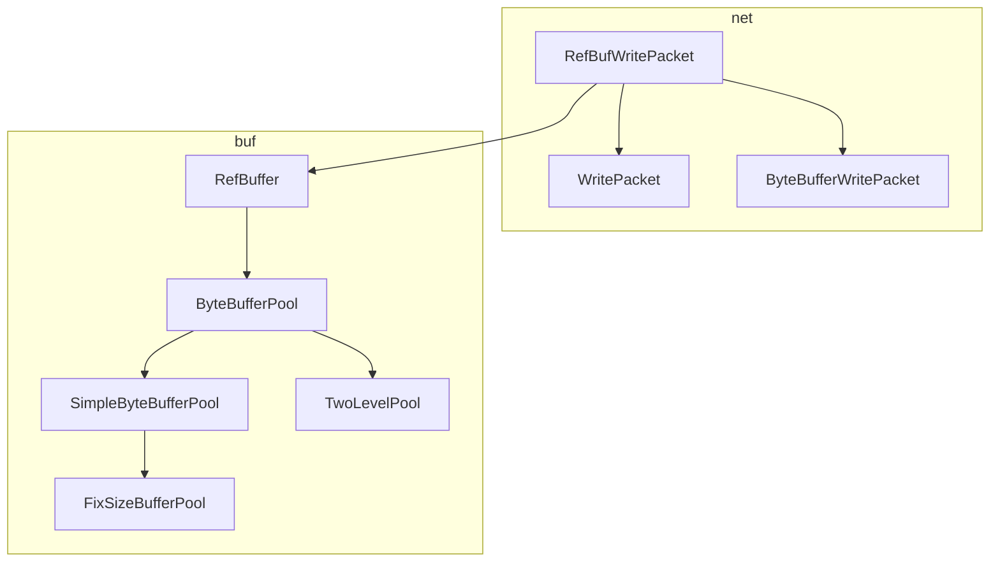
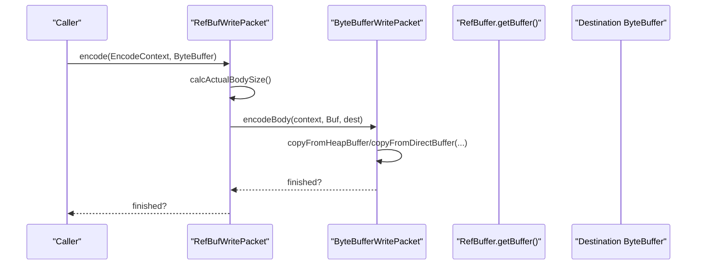
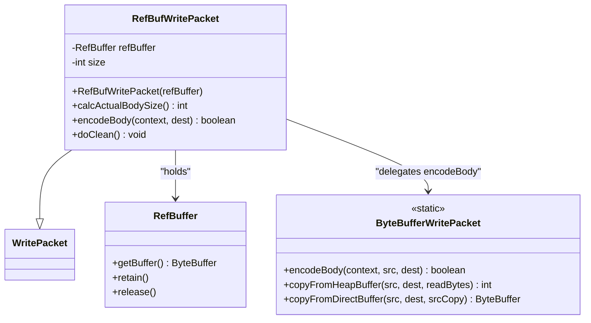
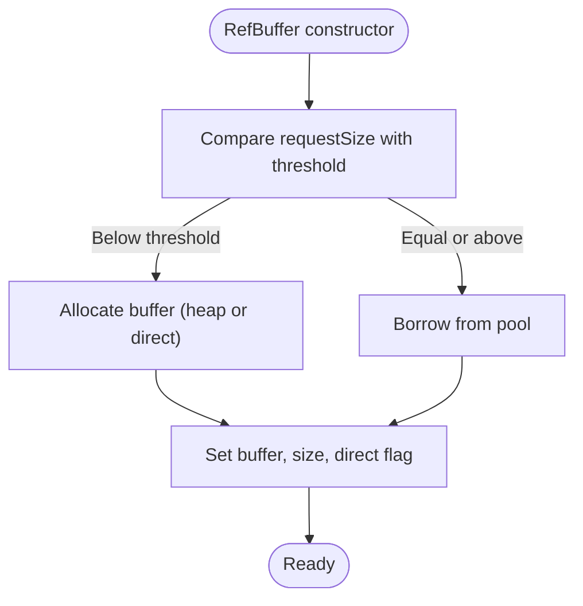
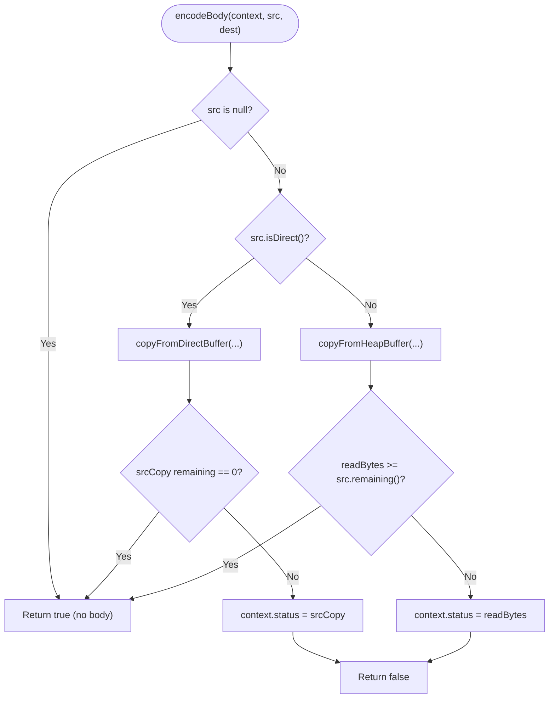
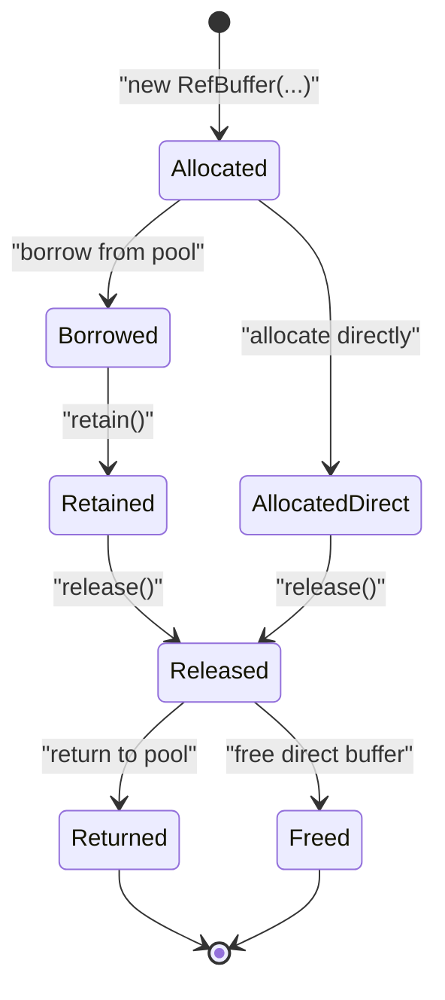
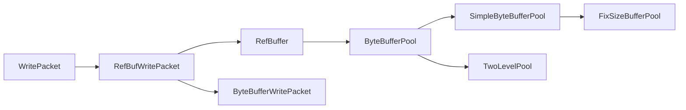

# RefBufWritePacket for Reference-Counted Buffers

<cite>
**Referenced Files in This Document**
- [RefBufWritePacket.java](file://client/src/main/java/com/github/dtprj/dongting/net/RefBufWritePacket.java)
- [RefBuffer.java](file://client/src/main/java/com/github/dtprj/dongting/buf/RefBuffer.java)
- [ByteBufferWritePacket.java](file://client/src/main/java/com/github/dtprj/dongting/net/ByteBufferWritePacket.java)
- [WritePacket.java](file://client/src/main/java/com/github/dtprj/dongting/net/WritePacket.java)
- [ByteBufferPool.java](file://client/src/main/java/com/github/dtprj/dongting/buf/ByteBufferPool.java)
- [SimpleByteBufferPool.java](file://client/src/main/java/com/github/dtprj/dongting/buf/SimpleByteBufferPool.java)
- [FixSizeBufferPool.java](file://client/src/main/java/com/github/dtprj/dongting/buf/FixSizeBufferPool.java)
- [TwoLevelPool.java](file://client/src/main/java/com/github/dtprj/dongting/buf/TwoLevelPool.java)
- [RefBufferTest.java](file://client/src/test/java/com/github/dtprj/dongting/buf/RefBufferTest.java)
</cite>

## Table of Contents
1. [Introduction](#introduction)
2. [Project Structure](#project-structure)
3. [Core Components](#core-components)
4. [Architecture Overview](#architecture-overview)
5. [Detailed Component Analysis](#detailed-component-analysis)
6. [Dependency Analysis](#dependency-analysis)
7. [Performance Considerations](#performance-considerations)
8. [Troubleshooting Guide](#troubleshooting-guide)
9. [Conclusion](#conclusion)
10. [Appendices](#appendices)

## Introduction
This document explains the RefBufWritePacket class, which enables efficient transmission of reference-counted buffers. It focuses on how RefBufWritePacket composes a RefBuffer instance, how reference counting manages memory, how the packet calculates body size and encodes efficiently, and how it integrates with Dongting’s buffer pooling system to support zero-copy-like transfers from pool-managed buffers. It also outlines the lifecycle of a RefBuffer from allocation through encoding to automatic cleanup, and provides scenarios where pooled buffers are used for high-performance message construction.

## Project Structure
The relevant components are organized across the net and buf packages:
- net package: packet abstractions and concrete write packets
- buf package: buffer pooling and reference-counted buffer types

**Diagram sources**
- [RefBufWritePacket.java](file://client/src/main/java/com/github/dtprj/dongting/net/RefBufWritePacket.java#L1-L53)
- [RefBuffer.java](file://client/src/main/java/com/github/dtprj/dongting/buf/RefBuffer.java#L1-L183)
- [ByteBufferWritePacket.java](file://client/src/main/java/com/github/dtprj/dongting/net/ByteBufferWritePacket.java#L1-L90)
- [WritePacket.java](file://client/src/main/java/com/github/dtprj/dongting/net/WritePacket.java#L1-L182)
- [ByteBufferPool.java](file://client/src/main/java/com/github/dtprj/dongting/buf/ByteBufferPool.java#L1-L46)
- [SimpleByteBufferPool.java](file://client/src/main/java/com/github/dtprj/dongting/buf/SimpleByteBufferPool.java#L1-L347)
- [FixSizeBufferPool.java](file://client/src/main/java/com/github/dtprj/dongting/buf/FixSizeBufferPool.java#L1-L77)
- [TwoLevelPool.java](file://client/src/main/java/com/github/dtprj/dongting/buf/TwoLevelPool.java#L1-L37)

**Section sources**
- [RefBufWritePacket.java](file://client/src/main/java/com/github/dtprj/dongting/net/RefBufWritePacket.java#L1-L53)
- [RefBuffer.java](file://client/src/main/java/com/github/dtprj/dongting/buf/RefBuffer.java#L1-L183)
- [ByteBufferWritePacket.java](file://client/src/main/java/com/github/dtprj/dongting/net/ByteBufferWritePacket.java#L1-L90)
- [WritePacket.java](file://client/src/main/java/com/github/dtprj/dongting/net/WritePacket.java#L1-L182)
- [ByteBufferPool.java](file://client/src/main/java/com/github/dtprj/dongting/buf/ByteBufferPool.java#L1-L46)
- [SimpleByteBufferPool.java](file://client/src/main/java/com/github/dtprj/dongting/buf/SimpleByteBufferPool.java#L1-L347)
- [FixSizeBufferPool.java](file://client/src/main/java/com/github/dtprj/dongting/buf/FixSizeBufferPool.java#L1-L77)
- [TwoLevelPool.java](file://client/src/main/java/com/github/dtprj/dongting/buf/TwoLevelPool.java#L1-L37)

## Core Components
- RefBufWritePacket: A write packet that carries a RefBuffer and delegates body encoding to ByteBufferWritePacket. It ensures proper cleanup by releasing the RefBuffer reference upon completion.
- RefBuffer: A reference-counted wrapper around ByteBuffer that integrates with buffer pools. It supports borrowing from pools and returning buffers back to pools.
- ByteBufferWritePacket: Provides static helpers to efficiently copy heap or direct buffers into a destination ByteBuffer, supporting incremental encoding.
- WritePacket: The base packet abstraction that orchestrates header encoding and delegates body encoding to subclasses.

Key responsibilities:
- RefBufWritePacket: holds a RefBuffer, computes body size, encodes body via ByteBufferWritePacket, and releases the RefBuffer in doClean().
- RefBuffer: manages buffer lifecycle, retains/releases references, and cleans up by returning to pool or releasing direct buffers.
- ByteBufferWritePacket: performs efficient copy operations for both heap and direct buffers.
- WritePacket: manages packet header encoding and coordinates body encoding.

**Section sources**
- [RefBufWritePacket.java](file://client/src/main/java/com/github/dtprj/dongting/net/RefBufWritePacket.java#L1-L53)
- [RefBuffer.java](file://client/src/main/java/com/github/dtprj/dongting/buf/RefBuffer.java#L1-L183)
- [ByteBufferWritePacket.java](file://client/src/main/java/com/github/dtprj/dongting/net/ByteBufferWritePacket.java#L1-L90)
- [WritePacket.java](file://client/src/main/java/com/github/dtprj/dongting/net/WritePacket.java#L1-L182)

## Architecture Overview
RefBufWritePacket sits between the packet encoding pipeline and the buffer abstraction. It encapsulates a RefBuffer and reuses ByteBufferWritePacket’s efficient copy routines to move data into the output ByteBuffer. Buffer pooling is transparently integrated through RefBuffer, which either borrows from a pool or allocates directly depending on size thresholds.

**Diagram sources**
- [RefBufWritePacket.java](file://client/src/main/java/com/github/dtprj/dongting/net/RefBufWritePacket.java#L31-L52)
- [ByteBufferWritePacket.java](file://client/src/main/java/com/github/dtprj/dongting/net/ByteBufferWritePacket.java#L39-L88)
- [RefBuffer.java](file://client/src/main/java/com/github/dtprj/dongting/buf/RefBuffer.java#L144-L183)

## Detailed Component Analysis

### RefBufWritePacket
- Composition: Holds a RefBuffer and caches the remaining bytes of the underlying ByteBuffer as the body size.
- calcActualBodySize(): Returns the cached size computed during construction, avoiding repeated buffer inspection.
- encodeBody(): Delegates to ByteBufferWritePacket.encodeBody, passing the RefBuffer’s ByteBuffer and the destination ByteBuffer. This leverages optimized copy routines for both heap and direct buffers.
- doClean(): Releases the RefBuffer reference, clearing the internal reference so it cannot be reused.

**Diagram sources**
- [RefBufWritePacket.java](file://client/src/main/java/com/github/dtprj/dongting/net/RefBufWritePacket.java#L1-L53)
- [ByteBufferWritePacket.java](file://client/src/main/java/com/github/dtprj/dongting/net/ByteBufferWritePacket.java#L1-L90)
- [RefBuffer.java](file://client/src/main/java/com/github/dtprj/dongting/buf/RefBuffer.java#L1-L183)

**Section sources**
- [RefBufWritePacket.java](file://client/src/main/java/com/github/dtprj/dongting/net/RefBufWritePacket.java#L27-L53)

### RefBuffer and Buffer Pooling Integration
- Allocation vs Borrowing: RefBuffer decides whether to allocate directly or borrow from a pool based on a configured threshold. If the request size is below the threshold, it allocates; otherwise it borrows from a pool.
- Slicing: RefBuffer supports slicing to create views over a subset of the underlying buffer while preserving reference counting semantics.
- Cleanup: RefBuffer returns buffers to the pool when appropriate; otherwise it releases direct buffers through the platform’s direct buffer release mechanism.

**Diagram sources**
- [RefBuffer.java](file://client/src/main/java/com/github/dtprj/dongting/buf/RefBuffer.java#L37-L49)
- [SimpleByteBufferPool.java](file://client/src/main/java/com/github/dtprj/dongting/buf/SimpleByteBufferPool.java#L126-L182)

**Section sources**
- [RefBuffer.java](file://client/src/main/java/com/github/dtprj/dongting/buf/RefBuffer.java#L28-L183)
- [ByteBufferPool.java](file://client/src/main/java/com/github/dtprj/dongting/buf/ByteBufferPool.java#L1-L46)
- [SimpleByteBufferPool.java](file://client/src/main/java/com/github/dtprj/dongting/buf/SimpleByteBufferPool.java#L126-L200)
- [FixSizeBufferPool.java](file://client/src/main/java/com/github/dtprj/dongting/buf/FixSizeBufferPool.java#L57-L77)
- [TwoLevelPool.java](file://client/src/main/java/com/github/dtprj/dongting/buf/TwoLevelPool.java#L1-L37)

### ByteBufferWritePacket Encoding Logic
- Heap buffers: Uses array-based put operations with a read offset to minimize copies.
- Direct buffers: Uses slice-based copying to avoid extra allocations.
- Incremental encoding: Maintains state in EncodeContext to resume partial writes across multiple calls.

**Diagram sources**
- [ByteBufferWritePacket.java](file://client/src/main/java/com/github/dtprj/dongting/net/ByteBufferWritePacket.java#L39-L88)

**Section sources**
- [ByteBufferWritePacket.java](file://client/src/main/java/com/github/dtprj/dongting/net/ByteBufferWritePacket.java#L1-L90)

### Lifecycle of a RefBuffer: From Allocation to Automatic Cleanup
- Allocation: Constructed with a pool and threshold; may allocate or borrow depending on size.
- Retain/Release: Used to manage shared ownership across threads or frames; release returns the buffer to the pool or frees direct buffers.
- Encoding: Passed into RefBufWritePacket, which encodes body bytes into the destination ByteBuffer via ByteBufferWritePacket.
- Automatic Cleanup: RefBufWritePacket.doClean() releases the RefBuffer reference, ensuring the buffer is returned to the pool or freed.

**Diagram sources**
- [RefBuffer.java](file://client/src/main/java/com/github/dtprj/dongting/buf/RefBuffer.java#L37-L142)
- [SimpleByteBufferPool.java](file://client/src/main/java/com/github/dtprj/dongting/buf/SimpleByteBufferPool.java#L184-L200)

**Section sources**
- [RefBuffer.java](file://client/src/main/java/com/github/dtprj/dongting/buf/RefBuffer.java#L28-L183)
- [RefBufWritePacket.java](file://client/src/main/java/com/github/dtprj/dongting/net/RefBufWritePacket.java#L36-L42)
- [SimpleByteBufferPool.java](file://client/src/main/java/com/github/dtprj/dongting/buf/SimpleByteBufferPool.java#L184-L200)

## Dependency Analysis
- RefBufWritePacket depends on RefBuffer and ByteBufferWritePacket.
- RefBuffer depends on ByteBufferPool and integrates with SimpleByteBufferPool and FixSizeBufferPool.
- WritePacket orchestrates header encoding and delegates body encoding to subclasses.

**Diagram sources**
- [RefBufWritePacket.java](file://client/src/main/java/com/github/dtprj/dongting/net/RefBufWritePacket.java#L1-L53)
- [RefBuffer.java](file://client/src/main/java/com/github/dtprj/dongting/buf/RefBuffer.java#L1-L183)
- [ByteBufferWritePacket.java](file://client/src/main/java/com/github/dtprj/dongting/net/ByteBufferWritePacket.java#L1-L90)
- [WritePacket.java](file://client/src/main/java/com/github/dtprj/dongting/net/WritePacket.java#L1-L182)
- [ByteBufferPool.java](file://client/src/main/java/com/github/dtprj/dongting/buf/ByteBufferPool.java#L1-L46)
- [SimpleByteBufferPool.java](file://client/src/main/java/com/github/dtprj/dongting/buf/SimpleByteBufferPool.java#L1-L347)
- [FixSizeBufferPool.java](file://client/src/main/java/com/github/dtprj/dongting/buf/FixSizeBufferPool.java#L1-L77)
- [TwoLevelPool.java](file://client/src/main/java/com/github/dtprj/dongting/buf/TwoLevelPool.java#L1-L37)

**Section sources**
- [RefBufWritePacket.java](file://client/src/main/java/com/github/dtprj/dongting/net/RefBufWritePacket.java#L1-L53)
- [RefBuffer.java](file://client/src/main/java/com/github/dtprj/dongting/buf/RefBuffer.java#L1-L183)
- [ByteBufferWritePacket.java](file://client/src/main/java/com/github/dtprj/dongting/net/ByteBufferWritePacket.java#L1-L90)
- [WritePacket.java](file://client/src/main/java/com/github/dtprj/dongting/net/WritePacket.java#L1-L182)
- [ByteBufferPool.java](file://client/src/main/java/com/github/dtprj/dongting/buf/ByteBufferPool.java#L1-L46)
- [SimpleByteBufferPool.java](file://client/src/main/java/com/github/dtprj/dongting/buf/SimpleByteBufferPool.java#L1-L347)
- [FixSizeBufferPool.java](file://client/src/main/java/com/github/dtprj/dongting/buf/FixSizeBufferPool.java#L1-L77)
- [TwoLevelPool.java](file://client/src/main/java/com/github/dtprj/dongting/buf/TwoLevelPool.java#L1-L37)

## Performance Considerations
- Zero-copy-like behavior: When using pooled buffers, RefBufWritePacket avoids extra copies by delegating to ByteBufferWritePacket’s optimized copy routines. Direct buffers are copied efficiently without intermediate allocations.
- Reference counting overhead: RefBuffer uses a lightweight reference counting mechanism. For single-threaded usage, plain mode reduces CAS overhead.
- Pool sizing and thresholds: Choosing appropriate thresholds and pool sizes minimizes allocation churn and improves hit rates for borrowed buffers.
- Incremental encoding: ByteBufferWritePacket maintains state to resume partial writes, reducing the number of passes needed to encode large bodies.

[No sources needed since this section provides general guidance]

## Troubleshooting Guide
Common issues and resolutions:
- Incorrect reference counts: Ensure retain/release pairs are balanced. Tests demonstrate expected behavior for retain and release sequences.
- Releasing already-released buffers: Repeated releases beyond the reference count can cause exceptions. Validate reference count logic before releasing.
- Buffer not belonging to pool: Releasing a buffer that was not allocated by the pool can trigger validation errors. Verify buffer origin and pool compatibility.
- Direct buffer handling: Direct buffers must be released through the pool or platform mechanisms; otherwise, memory leaks can occur.

**Section sources**
- [RefBufferTest.java](file://client/src/test/java/com/github/dtprj/dongting/buf/RefBufferTest.java#L1-L70)
- [SimpleByteBufferPool.java](file://client/src/main/java/com/github/dtprj/dongting/buf/SimpleByteBufferPool.java#L184-L200)
- [RefBuffer.java](file://client/src/main/java/com/github/dtprj/dongting/buf/RefBuffer.java#L132-L142)

## Conclusion
RefBufWritePacket provides a streamlined way to transmit reference-counted buffers efficiently. By composing a RefBuffer and delegating body encoding to ByteBufferWritePacket, it achieves high-performance, low-allocation transfers. Integration with buffer pooling allows zero-copy-like behavior for pooled buffers, while reference counting guarantees safe cleanup. Proper use of retain/release and careful pool configuration yields significant performance benefits in high-throughput messaging scenarios.

[No sources needed since this section summarizes without analyzing specific files]

## Appendices

### Practical Scenarios for Pooled Buffers
- Large message construction: Build messages using pooled buffers to reduce allocation overhead and improve throughput.
- Streaming logs or snapshots: Use RefBufWritePacket to stream large payloads without copying into intermediate buffers.
- Network-intensive services: Encode and send large payloads efficiently by leveraging ByteBufferWritePacket’s optimized copy routines and RefBuffer’s reference counting.

[No sources needed since this section provides general guidance]