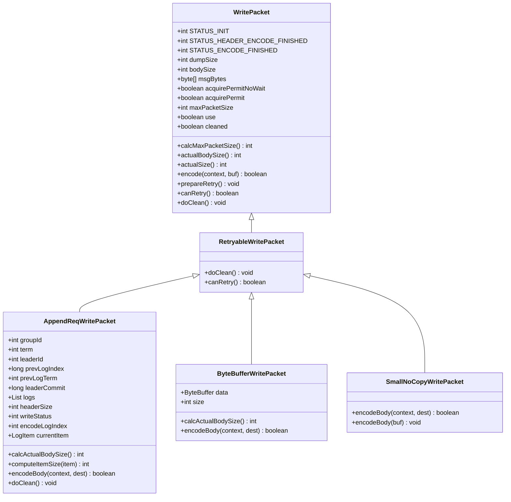
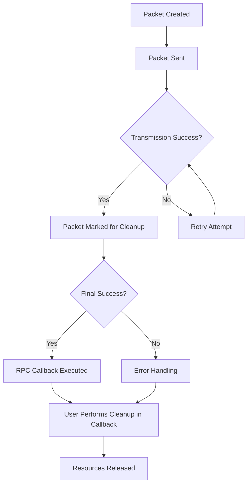
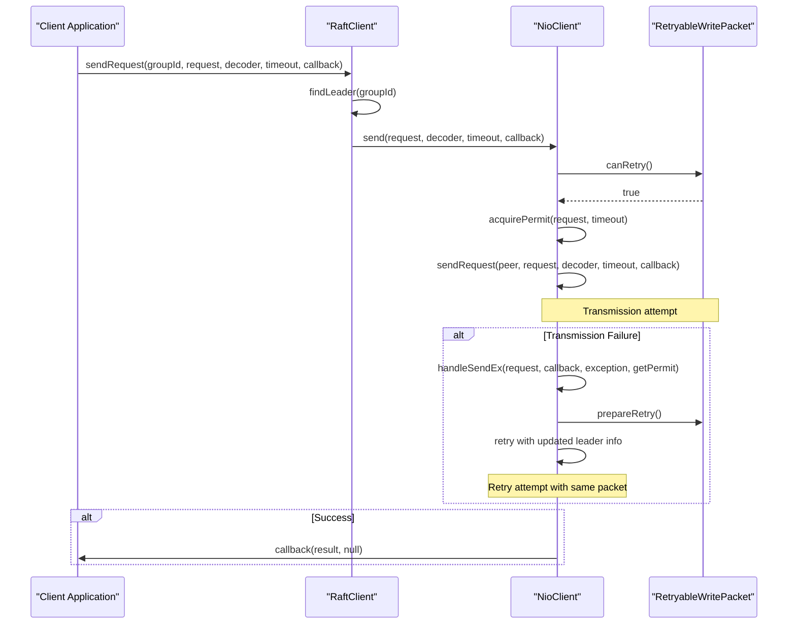
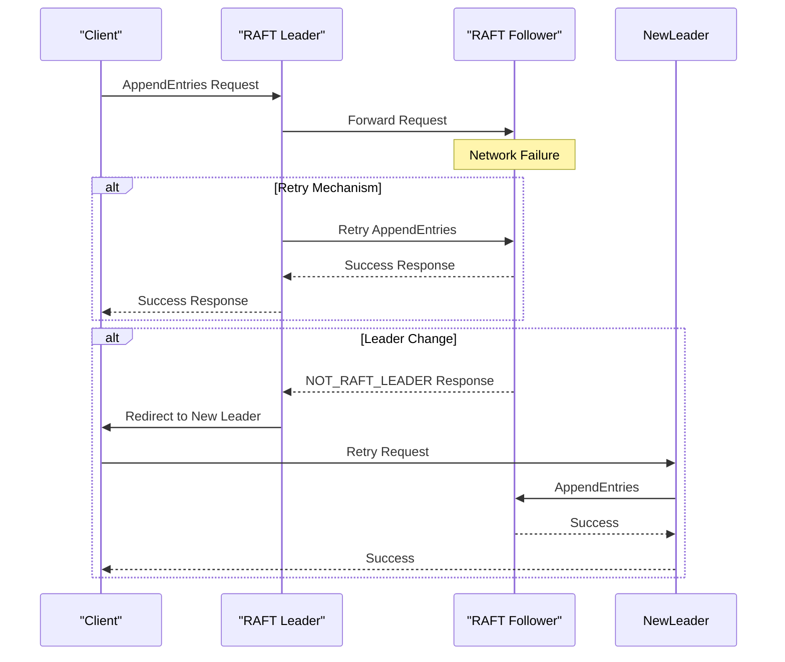
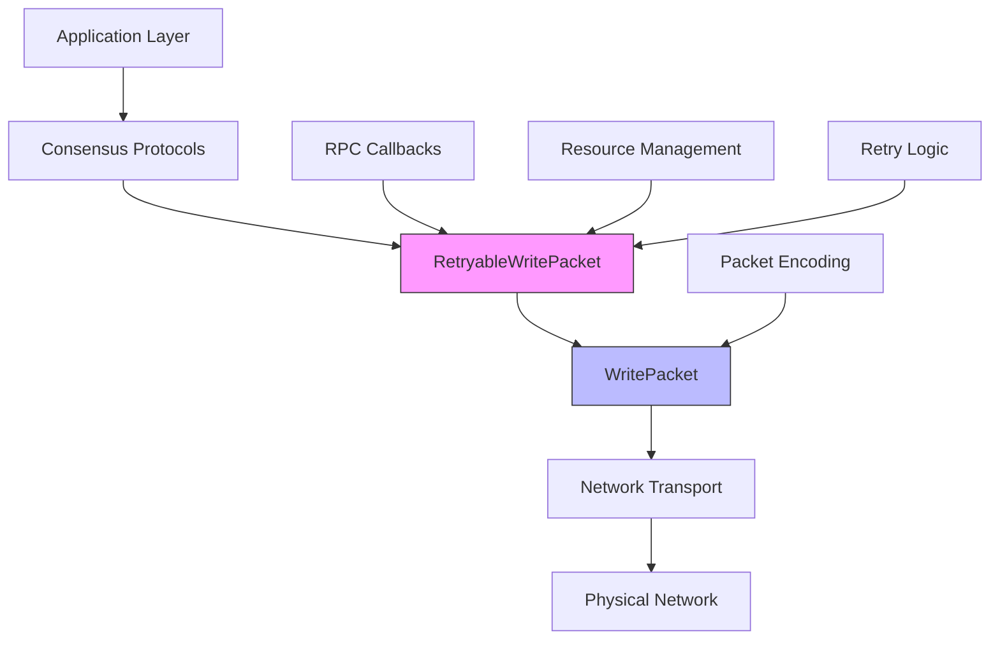

# RetryableWritePacket for Idempotent Operations

<cite>
**Referenced Files in This Document**   
- [RetryableWritePacket.java](file://client/src/main/java/com/github/dtprj/dongting/net/RetryableWritePacket.java)
- [WritePacket.java](file://client/src/main/java/com/github/dtprj/dongting/net/WritePacket.java)
- [AppendReqWritePacket.java](file://server/src/main/java/com/github/dtprj/dongting/raft/rpc/AppendReqWritePacket.java)
- [RaftClient.java](file://client/src/main/java/com/github/dtprj/dongting/raft/RaftClient.java)
- [RpcCallback.java](file://client/src/main/java/com/github/dtprj/dongting/net/RpcCallback.java)
</cite>

## Table of Contents
1. [Introduction](#introduction)
2. [Core Design Principles](#core-design-principles)
3. [Resource Management and Cleanup](#resource-management-and-cleanup)
4. [Retry Mechanism Implementation](#retry-mechanism-implementation)
5. [RAFT Consensus Integration](#raft-consensus-integration)
6. [Usage Patterns and Best Practices](#usage-patterns-and-best-practices)
7. [Architecture Overview](#architecture-overview)
8. [Conclusion](#conclusion)

## Introduction

The `RetryableWritePacket` abstract class serves as a foundational component in distributed systems requiring reliable message delivery through network retransmission. Designed specifically for scenarios where network failures or timeouts may occur, this class enables safe message retry by implementing a specialized resource management strategy that prevents non-idempotent operations during retry attempts. The class acts as a base for various packet types that may need to be retransmitted, particularly in consensus algorithms like RAFT where message reliability is critical for system consistency.

This documentation provides comprehensive analysis of the `RetryableWritePacket` design, focusing on its role in enabling idempotent operations through careful resource management. The class addresses the fundamental challenge of balancing message delivery reliability with proper resource cleanup, implementing a design pattern where automatic cleanup is disabled to prevent potential issues during retry operations, shifting responsibility to RPC callbacks instead.

**Section sources**
- [RetryableWritePacket.java](file://client/src/main/java/com/github/dtprj/dongting/net/RetryableWritePacket.java#L1-L36)

## Core Design Principles

The `RetryableWritePacket` class implements a critical design pattern for distributed systems by extending the base `WritePacket` functionality with retry-specific capabilities. The primary design principle centers on ensuring message reliability in unreliable network conditions while maintaining system stability through proper resource management.

The class hierarchy demonstrates a clear separation of concerns, with `RetryableWritePacket` serving as an abstract base class that inherits from `WritePacket` and provides specialized behavior for retryable operations. This design enables various packet implementations such as `ByteBufferWritePacket`, `SmallNoCopyWritePacket`, and `AppendReqWritePacket` to inherit retry capabilities while implementing their specific encoding and resource management logic.

The core design addresses the fundamental tension between reliability and resource safety in distributed systems. By disabling automatic resource cleanup in the `doClean()` method, the class prevents potential issues that could arise from non-idempotent cleanup operations being executed multiple times during retry attempts. This design decision reflects an understanding that certain resource cleanup operations may have side effects or state changes that should not be repeated, particularly in distributed consensus scenarios.



**Diagram sources **
- [RetryableWritePacket.java](file://client/src/main/java/com/github/dtprj/dongting/net/RetryableWritePacket.java#L21-L34)
- [WritePacket.java](file://client/src/main/java/com/github/dtprj/dongting/net/WritePacket.java#L30-L181)
- [AppendReqWritePacket.java](file://server/src/main/java/com/github/dtprj/dongting/raft/rpc/AppendReqWritePacket.java#L52-L178)
- [ByteBufferWritePacket.java](file://client/src/main/java/com/github/dtprj/dongting/net/ByteBufferWritePacket.java#L25-L89)
- [SmallNoCopyWritePacket.java](file://client/src/main/java/com/github/dtprj/dongting/net/SmallNoCopyWritePacket.java#L25-L36)

**Section sources**
- [RetryableWritePacket.java](file://client/src/main/java/com/github/dtprj/dongting/net/RetryableWritePacket.java#L17-L34)
- [WritePacket.java](file://client/src/main/java/com/github/dtprj/dongting/net/WritePacket.java#L30-L181)

## Resource Management and Cleanup

The `RetryableWritePacket` class implements a sophisticated resource management strategy that addresses the challenges of automatic cleanup in retry scenarios. The key innovation lies in the override of the `doClean()` method, which is intentionally implemented as a no-op to prevent non-idempotent cleanup operations from being executed multiple times during retry attempts.

In standard packet implementations, the `doClean()` method is responsible for releasing resources such as memory buffers, file handles, or other system resources after a packet has been successfully written to the channel. However, in retryable scenarios, this automatic cleanup could lead to serious issues if the cleanup operation is not idempotent. For example, releasing a memory buffer multiple times could result in use-after-free errors or memory corruption.

The class documentation explicitly states this design rationale: "Since doClean() implementation may not be idempotent, we disable it here, user should perform any cleanup in the callback of RPC." This shifts the responsibility for resource cleanup from the packet encoding/writing layer to the RPC callback layer, where the application logic can make informed decisions about when and how to release resources based on the final outcome of the operation.

This design pattern ensures that resource cleanup only occurs after a definitive success or failure determination, preventing premature resource release that could compromise system stability. The trade-off is increased complexity for users, who must now explicitly manage resource cleanup in their RPC callbacks, but this is considered an acceptable cost for the enhanced reliability and safety it provides in distributed systems.



**Diagram sources **
- [RetryableWritePacket.java](file://client/src/main/java/com/github/dtprj/dongting/net/RetryableWritePacket.java#L23-L29)

**Section sources**
- [RetryableWritePacket.java](file://client/src/main/java/com/github/dtprj/dongting/net/RetryableWritePacket.java#L23-L29)
- [WritePacket.java](file://client/src/main/java/com/github/dtprj/dongting/net/WritePacket.java#L169-L171)

## Retry Mechanism Implementation

The retry mechanism in `RetryableWritePacket` is implemented through the `canRetry()` method, which returns `true` to indicate that the packet supports retry operations. This simple yet effective design enables higher-level retry mechanisms in the networking stack to identify and handle retryable packets appropriately.

The `canRetry()` method overrides the default implementation in `WritePacket`, which returns `false` by default, establishing a clear distinction between regular packets and retryable packets. This boolean flag serves as a contract between the packet implementation and the networking infrastructure, allowing the system to make intelligent decisions about retry behavior based on the packet type.

When a network operation fails due to timeout or other transient issues, the networking stack can check the `canRetry()` method to determine whether the operation should be retried. For packets that return `true`, the system can safely attempt retransmission, knowing that the packet implementation has been designed to handle multiple transmission attempts safely.

The retry mechanism is further supported by the `prepareRetry()` method inherited from `WritePacket`, which resets packet state to allow for retransmission. This method clears flags such as `use` and `cleaned`, effectively returning the packet to a state where it can be processed again by the networking stack.

This design enables a flexible retry strategy where the decision to retry is separated from the implementation of retryable behavior. Higher-level components can implement sophisticated retry policies (exponential backoff, circuit breaking, etc.) while relying on the packet's `canRetry()` method to determine eligibility for retry, creating a clean separation of concerns.



**Diagram sources **
- [RetryableWritePacket.java](file://client/src/main/java/com/github/dtprj/dongting/net/RetryableWritePacket.java#L31-L33)
- [WritePacket.java](file://client/src/main/java/com/github/dtprj/dongting/net/WritePacket.java#L177-L179)
- [RaftClient.java](file://client/src/main/java/com/github/dtprj/dongting/raft/RaftClient.java#L345-L351)

**Section sources**
- [RetryableWritePacket.java](file://client/src/main/java/com/github/dtprj/dongting/net/RetryableWritePacket.java#L31-L33)
- [WritePacket.java](file://client/src/main/java/com/github/dtprj/dongting/net/WritePacket.java#L177-L179)

## RAFT Consensus Integration

The `RetryableWritePacket` class plays a critical role in the RAFT consensus algorithm implementation, particularly in the transmission of `AppendEntries` requests. In RAFT, leader election and log replication depend on reliable message delivery, making retry capability essential for maintaining cluster consistency.

The `AppendReqWritePacket` class, which extends `RetryableWritePacket`, demonstrates a concrete application of this design in the RAFT consensus protocol. This packet type is used to transmit `AppendEntries` requests from the leader to followers, carrying log entries that must be replicated across the cluster. These requests are inherently retryable, as network failures or timeouts should not prevent log replication from eventually succeeding.

The RAFT client implementation leverages the retry capabilities through its request handling logic. When a `NOT_RAFT_LEADER` error is received (indicating the target node is no longer the leader), the client can automatically retry the request with the updated leader information, but only if the packet supports retry operations. This is explicitly checked in the `RaftClient.send` method:

```java
if (ncEx.getCode() == CmdCodes.NOT_RAFT_LEADER && request.canRetry() && retry == 0) {
    // Update leader info and retry
    request.prepareRetry();
    send(newGroupInfo, request, decoder, timeout, c, 1, getPermit);
}
```

This integration ensures that client requests can be automatically redirected to the current leader without requiring application-level intervention, enhancing the system's fault tolerance and transparency. The combination of retry capability and leader redirection creates a robust communication layer that can handle the dynamic nature of distributed consensus systems.



**Diagram sources **
- [AppendReqWritePacket.java](file://server/src/main/java/com/github/dtprj/dongting/raft/rpc/AppendReqWritePacket.java#L52-L178)
- [RaftClient.java](file://client/src/main/java/com/github/dtprj/dongting/raft/RaftClient.java#L345-L351)

**Section sources**
- [AppendReqWritePacket.java](file://server/src/main/java/com/github/dtprj/dongting/raft/rpc/AppendReqWritePacket.java#L52-L178)
- [RaftClient.java](file://client/src/main/java/com/github/dtprj/dongting/raft/RaftClient.java#L345-L351)

## Usage Patterns and Best Practices

Proper usage of `RetryableWritePacket` requires careful attention to resource management patterns to avoid memory leaks while ensuring message delivery reliability. The key principle is that resource cleanup must be performed in RPC callbacks rather than relying on automatic cleanup mechanisms.

When implementing subclasses of `RetryableWritePacket`, developers should follow these best practices:

1. **Implement proper `doClean()` in subclasses**: While the base `RetryableWritePacket.doClean()` is a no-op, subclasses should override this method to release any resources they hold, but understand that this method may not be called automatically.

2. **Perform cleanup in RPC callbacks**: Users must explicitly release resources in their RPC callbacks when the operation completes (successfully or with error). This ensures that resources are only released after the final outcome is known.

3. **Handle reference counting properly**: For packets that use reference-counted resources like `RefBuffer`, ensure that `release()` is called exactly once in the callback to prevent memory leaks.

4. **Use `prepareRetry()` for retry attempts**: When a packet needs to be retried, call `prepareRetry()` to reset its state before resubmitting it to the networking stack.

5. **Consider thread safety**: Since retry operations may involve multiple threads, ensure that any shared state is properly synchronized.

The following example demonstrates proper usage:

```java
// In a real implementation, cleanup would occur in the callback
RpcCallback<ResponseType> callback = (result, ex) -> {
    try {
        // Process result
        if (ex == null) {
            // Success case
            handleSuccess(result);
        } else {
            // Error case
            handleError(ex);
        }
    } finally {
        // Always release resources in callback
        if (packet instanceof RefBufferHolder) {
            ((RefBufferHolder) packet).releaseResources();
        }
    }
};
```

Failure to follow these patterns can result in memory leaks, as resources will not be automatically cleaned up by the system. The design intentionally shifts this responsibility to the user to ensure that cleanup occurs at the appropriate time in the operation lifecycle.

**Section sources**
- [RetryableWritePacket.java](file://client/src/main/java/com/github/dtprj/dongting/net/RetryableWritePacket.java#L23-L29)
- [RpcCallback.java](file://client/src/main/java/com/github/dtprj/dongting/net/RpcCallback.java#L26-L46)
- [WritePacket.java](file://client/src/main/java/com/github/dtprj/dongting/net/WritePacket.java#L173-L175)

## Architecture Overview

The `RetryableWritePacket` class is a key component in the distributed networking architecture, serving as the foundation for reliable message delivery in the system. It integrates with multiple layers of the architecture, from the low-level packet encoding and transmission to high-level consensus protocols.

The architecture follows a layered approach where `RetryableWritePacket` sits between the application-level message types and the networking infrastructure. At the bottom layer, the `WritePacket` base class provides fundamental packet encoding and transmission capabilities. The `RetryableWritePacket` extends this with retry-specific behavior, and concrete implementations like `AppendReqWritePacket` provide protocol-specific functionality.

Higher-level components like `RaftClient` leverage this retry capability to implement fault-tolerant communication patterns, automatically handling leader changes and network failures. The RPC callback mechanism provides a clean interface for applications to handle the asynchronous nature of distributed operations while managing resources appropriately.

This architectural design enables a flexible and robust communication system where reliability features are built into the packet abstraction, allowing higher-level protocols to focus on their specific logic without reinventing retry mechanisms.



**Diagram sources **
- [RetryableWritePacket.java](file://client/src/main/java/com/github/dtprj/dongting/net/RetryableWritePacket.java#L21-L34)
- [WritePacket.java](file://client/src/main/java/com/github/dtprj/dongting/net/WritePacket.java#L30-L181)
- [RaftClient.java](file://client/src/main/java/com/github/dtprj/dongting/raft/RaftClient.java#L345-L351)

## Conclusion

The `RetryableWritePacket` abstract class represents a sophisticated solution to the challenge of reliable message delivery in distributed systems. By disabling automatic resource cleanup and requiring users to handle cleanup in RPC callbacks, it provides a safe mechanism for implementing retryable operations without risking non-idempotent side effects.

The design effectively balances the competing requirements of reliability and resource safety, enabling robust communication patterns in consensus algorithms like RAFT. The `canRetry()` method provides a simple yet powerful contract that allows higher-level components to implement intelligent retry strategies based on packet capabilities.

This approach demonstrates a deep understanding of distributed systems challenges, recognizing that automatic resource management must be adapted to handle the complexities of network failures and retries. By shifting cleanup responsibility to RPC callbacks, the design ensures that resources are only released after definitive success or failure determination, preventing premature cleanup that could compromise system stability.

The implementation serves as an excellent example of how careful design decisions at the abstraction level can enable robust, fault-tolerant distributed systems while providing clear guidance for proper usage patterns to avoid common pitfalls like memory leaks.