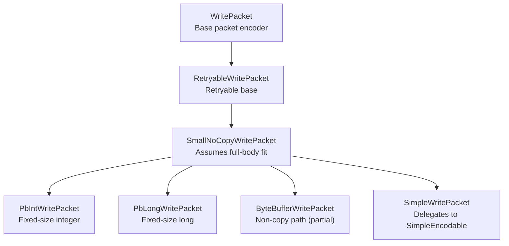
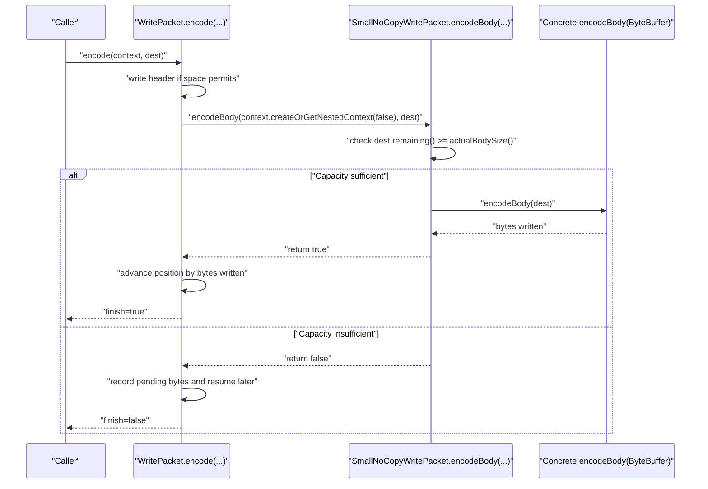
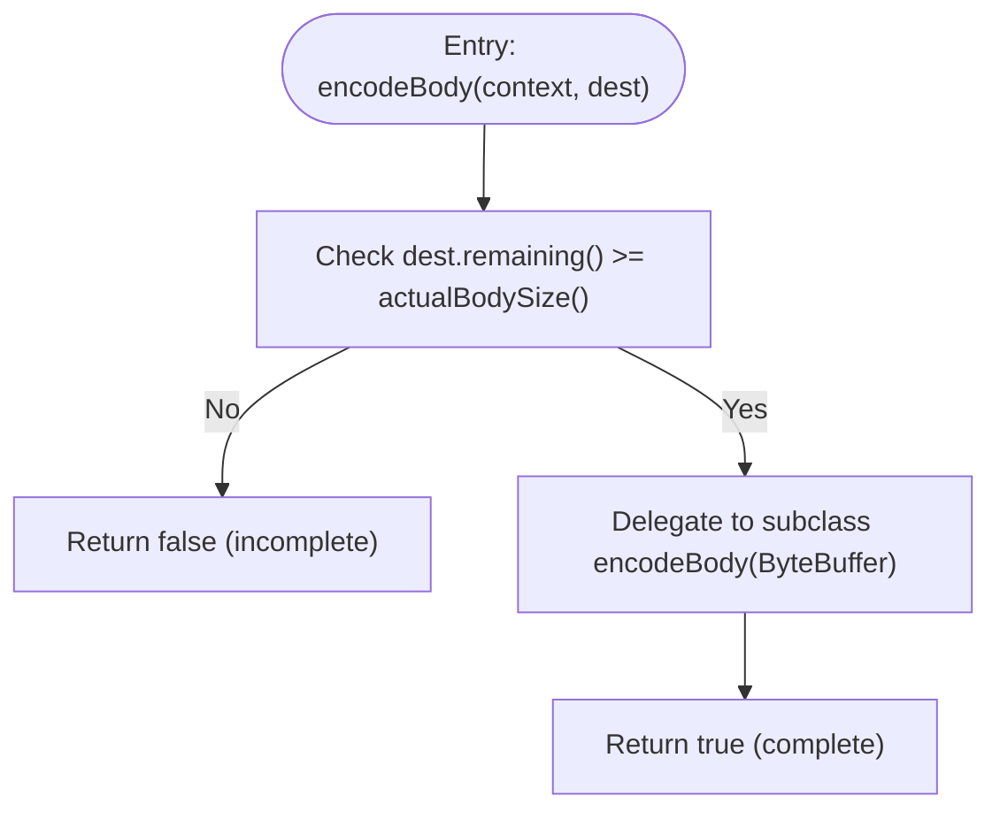
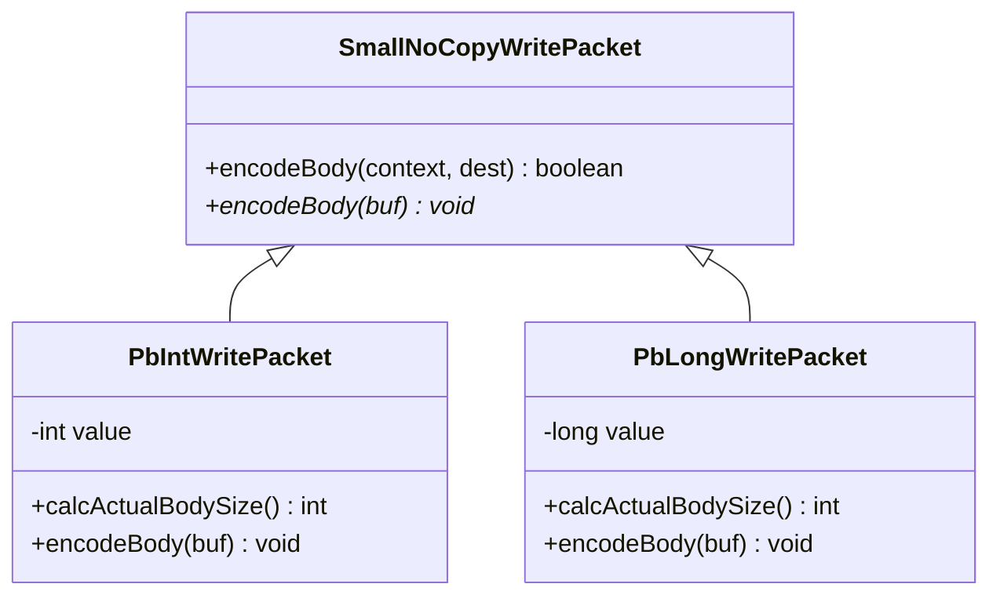
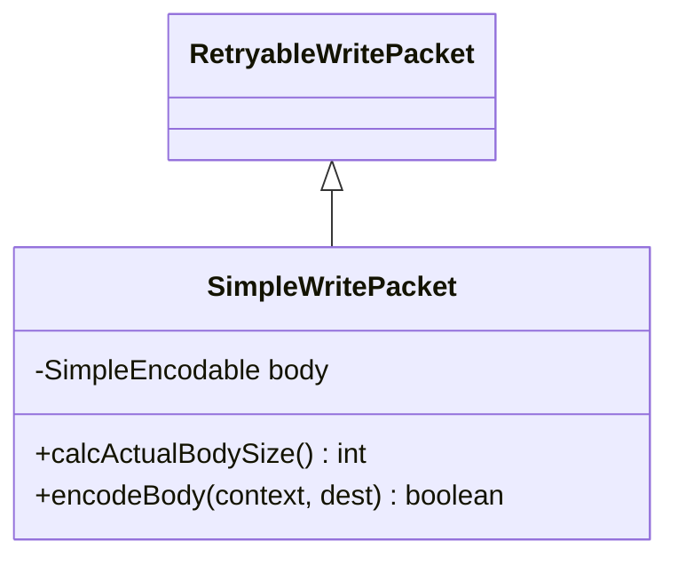
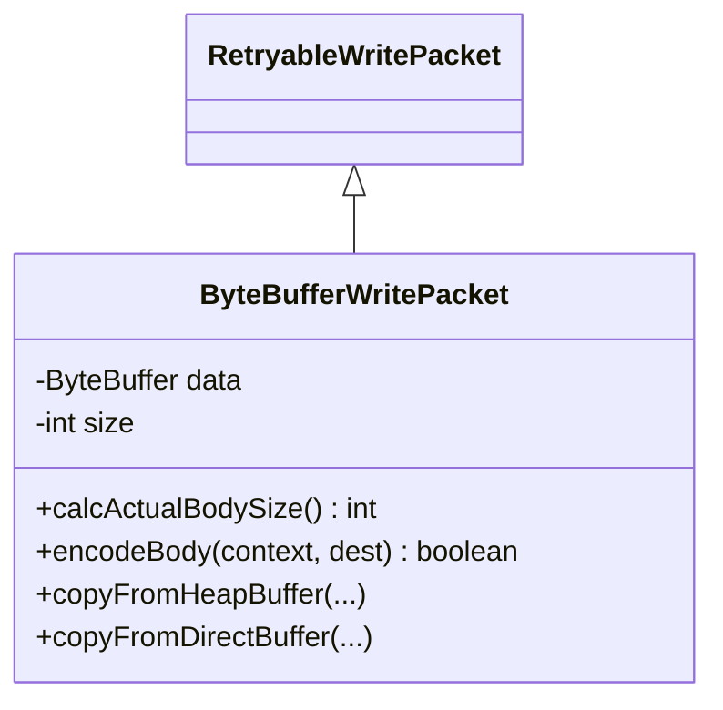
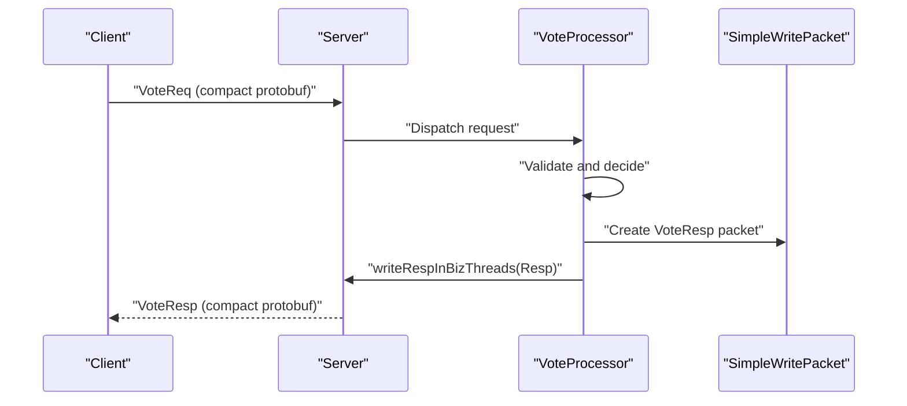
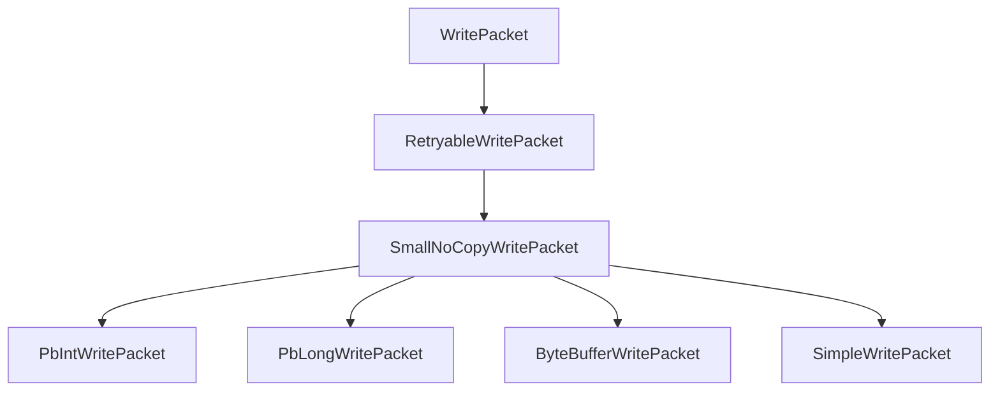

# SmallNoCopyWritePacket for Compact Messages

<cite>
**Referenced Files in This Document**
- [SmallNoCopyWritePacket.java](file://client/src/main/java/com/github/dtprj/dongting/net/SmallNoCopyWritePacket.java)
- [WritePacket.java](file://client/src/main/java/com/github/dtprj/dongting/net/WritePacket.java)
- [RetryableWritePacket.java](file://client/src/main/java/com/github/dtprj/dongting/net/RetryableWritePacket.java)
- [PbIntWritePacket.java](file://client/src/main/java/com/github/dtprj/dongting/net/PbIntWritePacket.java)
- [PbLongWritePacket.java](file://client/src/main/java/com/github/dtprj/dongting/net/PbLongWritePacket.java)
- [SimpleWritePacket.java](file://client/src/main/java/com/github/dtprj/dongting/net/SimpleWritePacket.java)
- [ByteBufferWritePacket.java](file://client/src/main/java/com/github/dtprj/dongting/net/ByteBufferWritePacket.java)
- [VoteReq.java](file://server/src/main/java/com/github/dtprj/dongting/raft/rpc/VoteReq.java)
- [VoteResp.java](file://server/src/main/java/com/github/dtprj/dongting/raft/rpc/VoteResp.java)
- [VoteProcessor.java](file://server/src/main/java/com/github/dtprj/dongting/raft/rpc/VoteProcessor.java)
</cite>

## Table of Contents
1. [Introduction](#introduction)
2. [Project Structure](#project-structure)
3. [Core Components](#core-components)
4. [Architecture Overview](#architecture-overview)
5. [Detailed Component Analysis](#detailed-component-analysis)
6. [Dependency Analysis](#dependency-analysis)
7. [Performance Considerations](#performance-considerations)
8. [Troubleshooting Guide](#troubleshooting-guide)
9. [Conclusion](#conclusion)

## Introduction
This document explains the SmallNoCopyWritePacket abstract class designed for small, fixed-size messages that can be written in a single operation. It optimizes the encoding pipeline by assuming the entire message body fits into the available buffer space, eliminating the need for partial encoding state management. The final encodeBody(EncodeContext, ByteBuffer) method checks buffer capacity and delegates to the abstract encodeBody(ByteBuffer) method for actual writing, returning true unconditionally to indicate complete encoding. This optimization reduces complexity for small control messages such as heartbeats or simple commands, delivering performance benefits by avoiding partial encoding overhead.

## Project Structure
The SmallNoCopyWritePacket resides in the client networking layer and is intended for lightweight, compact messages. It builds upon the existing packet encoding framework and integrates with various specialized write packet implementations.

**Diagram sources**
- [WritePacket.java](file://client/src/main/java/com/github/dtprj/dongting/net/WritePacket.java#L1-L182)
- [RetryableWritePacket.java](file://client/src/main/java/com/github/dtprj/dongting/net/RetryableWritePacket.java#L1-L36)
- [SmallNoCopyWritePacket.java](file://client/src/main/java/com/github/dtprj/dongting/net/SmallNoCopyWritePacket.java#L1-L37)
- [PbIntWritePacket.java](file://client/src/main/java/com/github/dtprj/dongting/net/PbIntWritePacket.java#L1-L47)
- [PbLongWritePacket.java](file://client/src/main/java/com/github/dtprj/dongting/net/PbLongWritePacket.java#L1-L47)
- [ByteBufferWritePacket.java](file://client/src/main/java/com/github/dtprj/dongting/net/ByteBufferWritePacket.java#L1-L90)
- [SimpleWritePacket.java](file://client/src/main/java/com/github/dtprj/dongting/net/SimpleWritePacket.java#L1-L52)

**Section sources**
- [SmallNoCopyWritePacket.java](file://client/src/main/java/com/github/dtprj/dongting/net/SmallNoCopyWritePacket.java#L1-L37)
- [WritePacket.java](file://client/src/main/java/com/github/dtprj/dongting/net/WritePacket.java#L1-L182)
- [RetryableWritePacket.java](file://client/src/main/java/com/github/dtprj/dongting/net/RetryableWritePacket.java#L1-L36)

## Core Components
- SmallNoCopyWritePacket: An abstract class extending RetryableWritePacket. It enforces a contract that the entire body can be encoded in one pass by checking destination capacity and delegating to an abstract method for writing.
- PbIntWritePacket and PbLongWritePacket: Concrete implementations that write fixed-size protobuf fields, with known sizes computed via calcActualBodySize().
- SimpleWritePacket: A general-purpose packet that writes a SimpleEncodable body directly, also leveraging a single-pass assumption for small bodies.
- ByteBufferWritePacket: A specialized packet that copies ByteBuffer content; it uses partial encoding state for large buffers but still benefits from the single-pass assumption for small buffers.

Key behaviors:
- Buffer capacity check: The final encodeBody(EncodeContext, ByteBuffer) verifies dest.remaining() against actualBodySize() before encoding.
- Delegation: After capacity validation, it calls the abstract encodeBody(ByteBuffer) to perform the actual writing.
- Completion guarantee: Returns true immediately after successful writing, indicating completion without partial-state tracking.

**Section sources**
- [SmallNoCopyWritePacket.java](file://client/src/main/java/com/github/dtprj/dongting/net/SmallNoCopyWritePacket.java#L22-L37)
- [PbIntWritePacket.java](file://client/src/main/java/com/github/dtprj/dongting/net/PbIntWritePacket.java#L25-L47)
- [PbLongWritePacket.java](file://client/src/main/java/com/github/dtprj/dongting/net/PbLongWritePacket.java#L25-L47)
- [SimpleWritePacket.java](file://client/src/main/java/com/github/dtprj/dongting/net/SimpleWritePacket.java#L26-L52)
- [ByteBufferWritePacket.java](file://client/src/main/java/com/github/dtprj/dongting/net/ByteBufferWritePacket.java#L25-L90)

## Architecture Overview
The encoding lifecycle for SmallNoCopyWritePacket follows the WritePacket framework while optimizing for small, fixed-size bodies.

**Diagram sources**
- [WritePacket.java](file://client/src/main/java/com/github/dtprj/dongting/net/WritePacket.java#L112-L164)
- [SmallNoCopyWritePacket.java](file://client/src/main/java/com/github/dtprj/dongting/net/SmallNoCopyWritePacket.java#L26-L33)

## Detailed Component Analysis

### SmallNoCopyWritePacket Implementation
- Purpose: Optimize small, fixed-size messages by avoiding partial encoding state management.
- Contract: Subclasses must implement encodeBody(ByteBuffer) to write the entire body in one pass.
- Capacity check: The final encodeBody(EncodeContext, ByteBuffer) ensures dest.remaining() >= actualBodySize() before delegating to the subclass.
- Completion: Always returns true after successful writing, signaling completion to the framework.

**Diagram sources**
- [SmallNoCopyWritePacket.java](file://client/src/main/java/com/github/dtprj/dongting/net/SmallNoCopyWritePacket.java#L26-L33)

**Section sources**
- [SmallNoCopyWritePacket.java](file://client/src/main/java/com/github/dtprj/dongting/net/SmallNoCopyWritePacket.java#L22-L37)

### PbIntWritePacket and PbLongWritePacket
- Fixed-size bodies: Both compute a constant body size via calcActualBodySize(), enabling the single-pass assumption.
- Encoding: encodeBody(ByteBuffer) writes a fixed-size protobuf field using the appropriate writer.

**Diagram sources**
- [SmallNoCopyWritePacket.java](file://client/src/main/java/com/github/dtprj/dongting/net/SmallNoCopyWritePacket.java#L22-L37)
- [PbIntWritePacket.java](file://client/src/main/java/com/github/dtprj/dongting/net/PbIntWritePacket.java#L25-L47)
- [PbLongWritePacket.java](file://client/src/main/java/com/github/dtprj/dongting/net/PbLongWritePacket.java#L25-L47)

**Section sources**
- [PbIntWritePacket.java](file://client/src/main/java/com/github/dtprj/dongting/net/PbIntWritePacket.java#L25-L47)
- [PbLongWritePacket.java](file://client/src/main/java/com/github/dtprj/dongting/net/PbLongWritePacket.java#L25-L47)

### SimpleWritePacket
- Delegates to a SimpleEncodable body for encoding.
- Single-pass assumption holds when the body is small and known-sized.

**Diagram sources**
- [RetryableWritePacket.java](file://client/src/main/java/com/github/dtprj/dongting/net/RetryableWritePacket.java#L21-L36)
- [SimpleWritePacket.java](file://client/src/main/java/com/github/dtprj/dongting/net/SimpleWritePacket.java#L26-L52)

**Section sources**
- [SimpleWritePacket.java](file://client/src/main/java/com/github/dtprj/dongting/net/SimpleWritePacket.java#L26-L52)

### ByteBufferWritePacket
- Supports copying ByteBuffer content with minimal overhead.
- Uses partial encoding state for large buffers; for small buffers, the single-pass assumption applies.

**Diagram sources**
- [RetryableWritePacket.java](file://client/src/main/java/com/github/dtprj/dongting/net/RetryableWritePacket.java#L21-L36)
- [ByteBufferWritePacket.java](file://client/src/main/java/com/github/dtprj/dongting/net/ByteBufferWritePacket.java#L25-L90)

**Section sources**
- [ByteBufferWritePacket.java](file://client/src/main/java/com/github/dtprj/dongting/net/ByteBufferWritePacket.java#L25-L90)

### RAFT Vote Requests and Responses
SmallNoCopyWritePacket is ideal for small control messages such as RAFT Vote requests/responses. The VoteReq and VoteResp classes define compact protobuf-encoded bodies, and VoteProcessor constructs SimpleWritePacket responses that leverage the single-pass encoding model.

**Diagram sources**
- [VoteReq.java](file://server/src/main/java/com/github/dtprj/dongting/raft/rpc/VoteReq.java#L1-L101)
- [VoteResp.java](file://server/src/main/java/com/github/dtprj/dongting/raft/rpc/VoteResp.java#L1-L67)
- [VoteProcessor.java](file://server/src/main/java/com/github/dtprj/dongting/raft/rpc/VoteProcessor.java#L148-L165)

**Section sources**
- [VoteReq.java](file://server/src/main/java/com/github/dtprj/dongting/raft/rpc/VoteReq.java#L1-L101)
- [VoteResp.java](file://server/src/main/java/com/github/dtprj/dongting/raft/rpc/VoteResp.java#L1-L67)
- [VoteProcessor.java](file://server/src/main/java/com/github/dtprj/dongting/raft/rpc/VoteProcessor.java#L148-L165)

## Dependency Analysis
SmallNoCopyWritePacket participates in a layered encoding architecture. Its subclasses depend on the WritePacket framework for header encoding and lifecycle management.

**Diagram sources**
- [WritePacket.java](file://client/src/main/java/com/github/dtprj/dongting/net/WritePacket.java#L1-L182)
- [RetryableWritePacket.java](file://client/src/main/java/com/github/dtprj/dongting/net/RetryableWritePacket.java#L1-L36)
- [SmallNoCopyWritePacket.java](file://client/src/main/java/com/github/dtprj/dongting/net/SmallNoCopyWritePacket.java#L1-L37)
- [PbIntWritePacket.java](file://client/src/main/java/com/github/dtprj/dongting/net/PbIntWritePacket.java#L1-L47)
- [PbLongWritePacket.java](file://client/src/main/java/com/github/dtprj/dongting/net/PbLongWritePacket.java#L1-L47)
- [ByteBufferWritePacket.java](file://client/src/main/java/com/github/dtprj/dongting/net/ByteBufferWritePacket.java#L1-L90)
- [SimpleWritePacket.java](file://client/src/main/java/com/github/dtprj/dongting/net/SimpleWritePacket.java#L1-L52)

**Section sources**
- [WritePacket.java](file://client/src/main/java/com/github/dtprj/dongting/net/WritePacket.java#L1-L182)
- [RetryableWritePacket.java](file://client/src/main/java/com/github/dtprj/dongting/net/RetryableWritePacket.java#L1-L36)
- [SmallNoCopyWritePacket.java](file://client/src/main/java/com/github/dtprj/dongting/net/SmallNoCopyWritePacket.java#L1-L37)

## Performance Considerations
- Reduced state management: By avoiding partial encoding state tracking, SmallNoCopyWritePacket eliminates context.pending accumulation and stage transitions for small bodies.
- Predictable sizing: Known body sizes (via calcActualBodySize) enable immediate capacity checks and single-pass writes.
- Minimal branching: The encodeBody(EncodeContext, ByteBuffer) path performs a single capacity check and a single delegate call, reducing CPU overhead.
- Practical impact: This optimization is especially beneficial for high-frequency small control messages such as heartbeats, acknowledgments, and compact RAFT votes, where each micro-optimization contributes to lower latency and higher throughput.

[No sources needed since this section provides general guidance]

## Troubleshooting Guide
Common issues and resolutions:
- Buffer too small: If dest.remaining() is less than actualBodySize(), the method returns false. Ensure the destination buffer has sufficient capacity or increase the buffer size.
- Incorrect body size calculation: Verify calcActualBodySize() returns the exact body size. Mismatches cause CodecException during header encoding.
- Non-fixed-size bodies: For variable-length bodies, prefer SimpleWritePacket or ByteBufferWritePacket with partial encoding support.

**Section sources**
- [SmallNoCopyWritePacket.java](file://client/src/main/java/com/github/dtprj/dongting/net/SmallNoCopyWritePacket.java#L26-L33)
- [WritePacket.java](file://client/src/main/java/com/github/dtprj/dongting/net/WritePacket.java#L136-L150)

## Conclusion
SmallNoCopyWritePacket streamlines the encoding of small, fixed-size messages by enforcing a single-pass contract and eliminating partial encoding overhead. Combined with known body sizes in subclasses like PbIntWritePacket and PbLongWritePacket, it delivers predictable performance for compact control messages such as RAFT Vote requests and simple acknowledgments. This approach reduces complexity and improves throughput for high-frequency, low-latency scenarios.