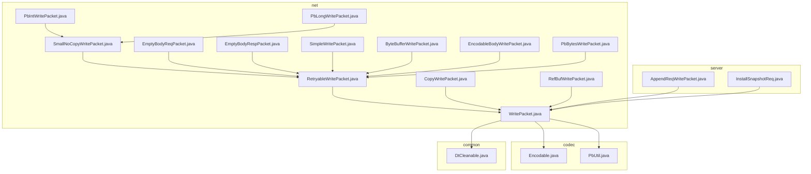
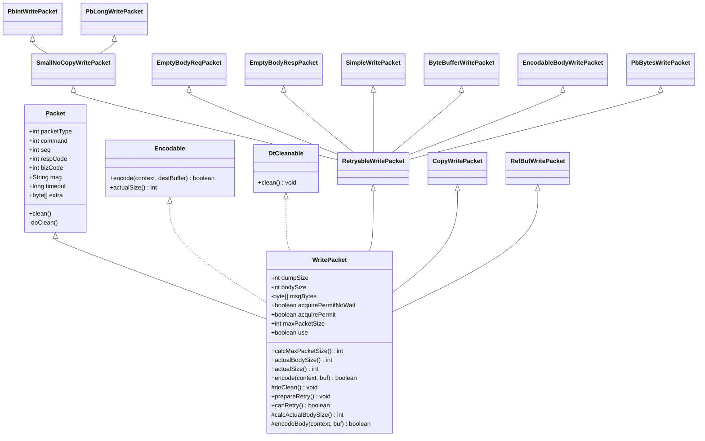
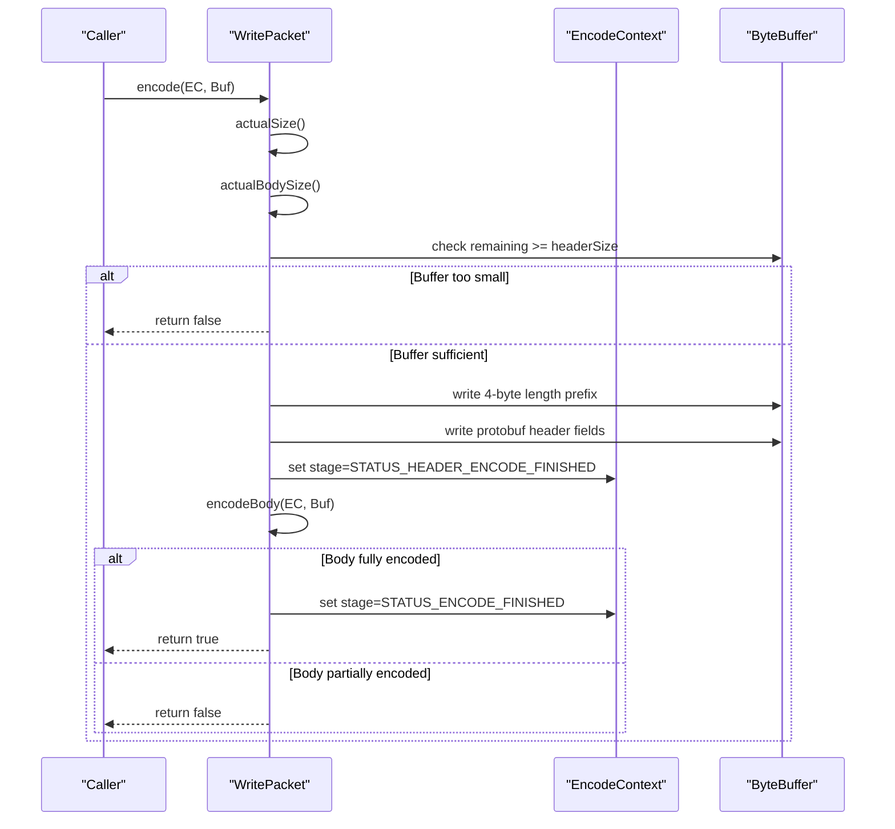
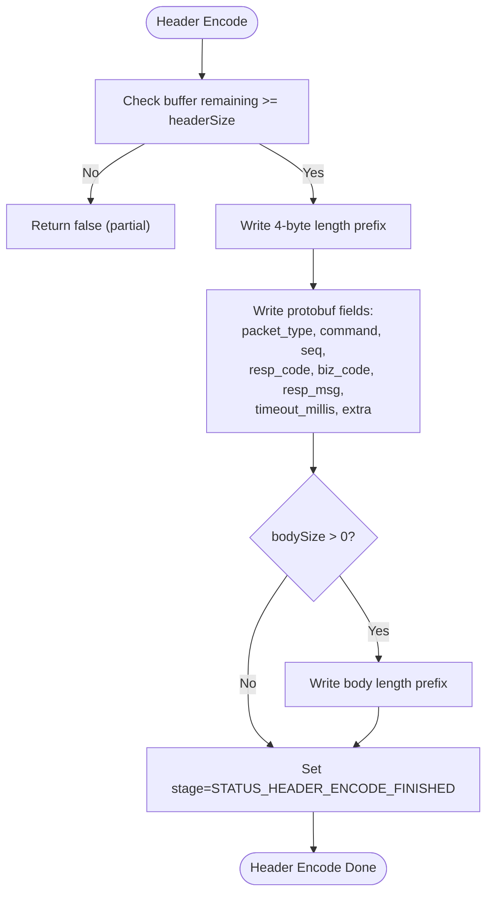
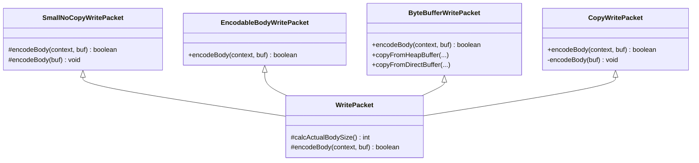
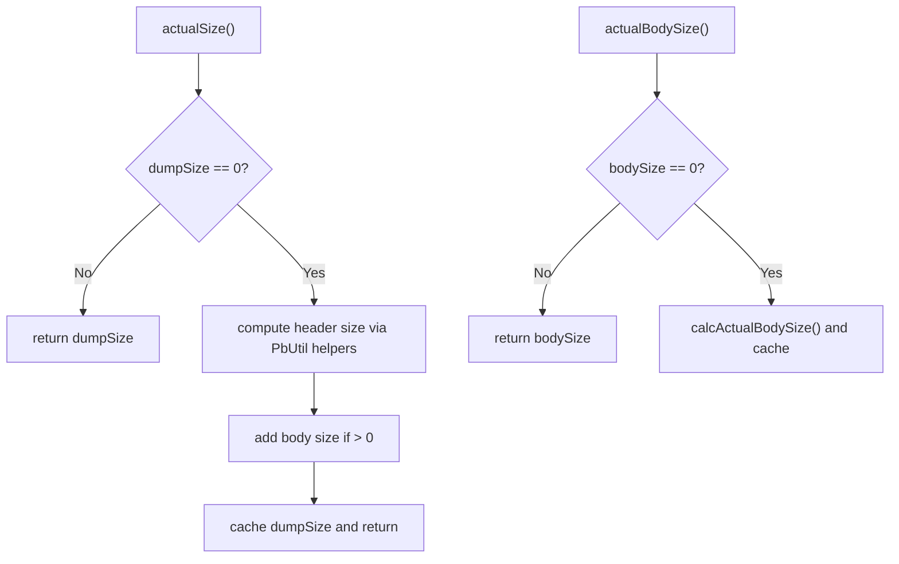
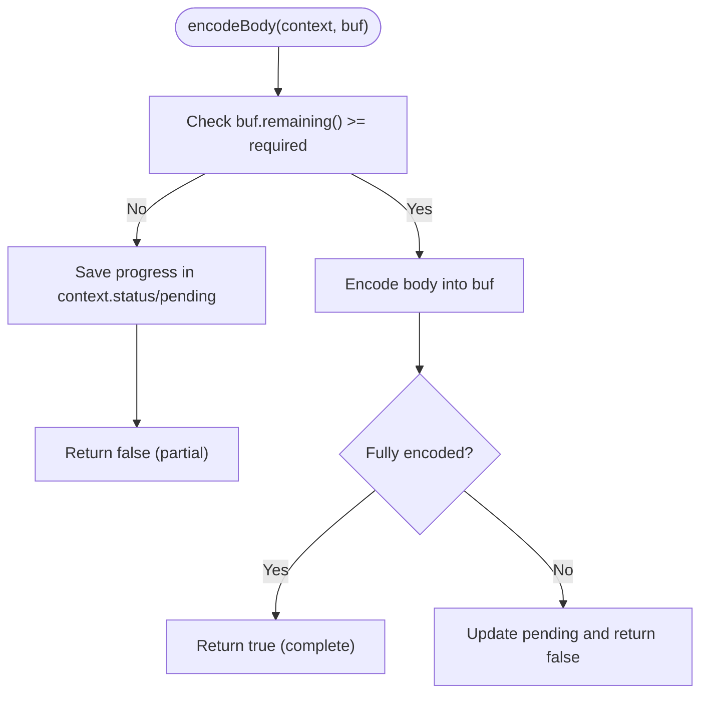
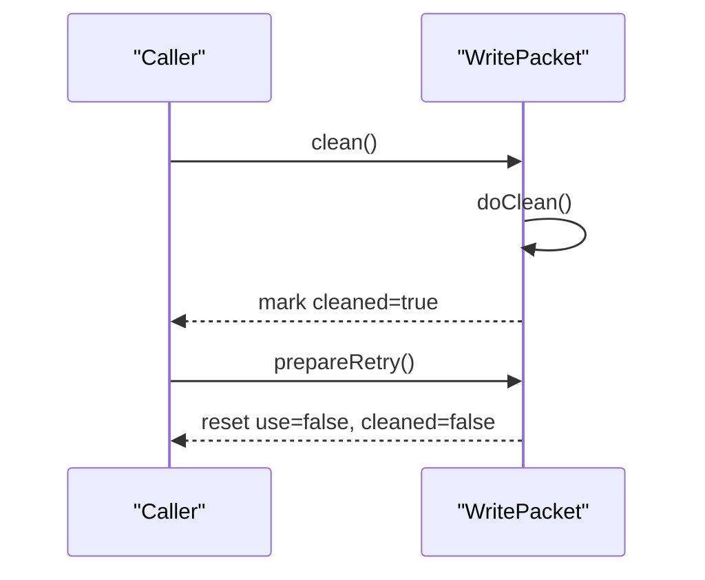
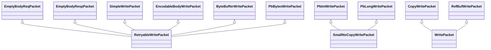
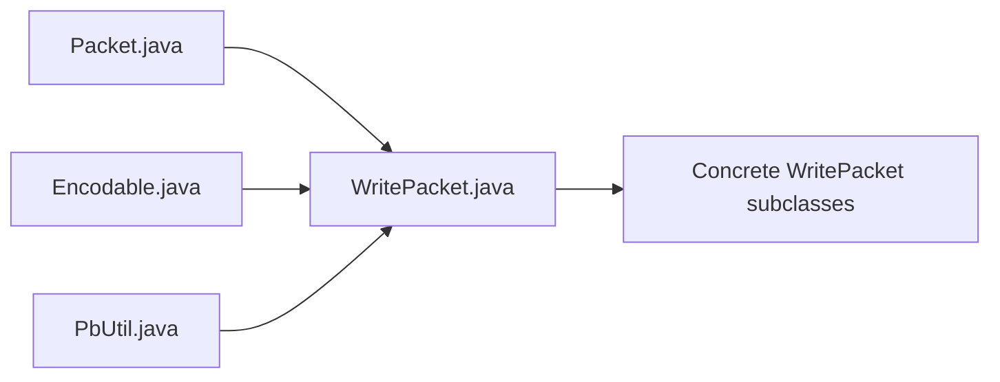

# WritePacket Base Class

<cite>
**Referenced Files in This Document**
- [WritePacket.java](file://client/src/main/java/com/github/dtprj/dongting/net/WritePacket.java)
- [Packet.java](file://client/src/main/java/com/github/dtprj/dongting/net/Packet.java)
- [Encodable.java](file://client/src/main/java/com/github/dtprj/dongting/codec/Encodable.java)
- [DtCleanable.java](file://client/src/main/java/com/github/dtprj/dongting/common/DtCleanable.java)
- [PbUtil.java](file://client/src/main/java/com/github/dtprj/dongting/codec/PbUtil.java)
- [EmptyBodyReqPacket.java](file://client/src/main/java/com/github/dtprj/dongting/net/EmptyBodyReqPacket.java)
- [EmptyBodyRespPacket.java](file://client/src/main/java/com/github/dtprj/dongting/net/EmptyBodyRespPacket.java)
- [SimpleWritePacket.java](file://client/src/main/java/com/github/dtprj/dongting/net/SimpleWritePacket.java)
- [ByteBufferWritePacket.java](file://client/src/main/java/com/github/dtprj/dongting/net/ByteBufferWritePacket.java)
- [EncodableBodyWritePacket.java](file://client/src/main/java/com/github/dtprj/dongting/net/EncodableBodyWritePacket.java)
- [PbBytesWritePacket.java](file://client/src/main/java/com/github/dtprj/dongting/net/PbBytesWritePacket.java)
- [PbIntWritePacket.java](file://client/src/main/java/com/github/dtprj/dongting/net/PbIntWritePacket.java)
- [PbLongWritePacket.java](file://client/src/main/java/com/github/dtprj/dongting/net/PbLongWritePacket.java)
- [SmallNoCopyWritePacket.java](file://client/src/main/java/com/github/dtprj/dongting/net/SmallNoCopyWritePacket.java)
- [CopyWritePacket.java](file://client/src/main/java/com/github/dtprj/dongting/net/CopyWritePacket.java)
- [RetryableWritePacket.java](file://client/src/main/java/com/github/dtprj/dongting/net/RetryableWritePacket.java)
- [RefBufWritePacket.java](file://client/src/main/java/com/github/dtprj/dongting/net/RefBufWritePacket.java)
- [AppendReqWritePacket.java](file://server/src/main/java/com/github/dtprj/dongting/raft/rpc/AppendReqWritePacket.java)
- [InstallSnapshotReq.java](file://server/src/main/java/com/github/dtprj/dongting/raft/rpc/InstallSnapshotReq.java)
</cite>

## Table of Contents
1. [Introduction](#introduction)
2. [Project Structure](#project-structure)
3. [Core Components](#core-components)
4. [Architecture Overview](#architecture-overview)
5. [Detailed Component Analysis](#detailed-component-analysis)
6. [Dependency Analysis](#dependency-analysis)
7. [Performance Considerations](#performance-considerations)
8. [Troubleshooting Guide](#troubleshooting-guide)
9. [Conclusion](#conclusion)

## Introduction
This document explains the WritePacket abstract base class that forms the foundation for all outbound network packet encoding in Dongting. It documents how WritePacket implements both Encodable and DtCleanable to support serialization and resource lifecycle management. The document covers the three-stage encoding lifecycle, the header encoding process, the abstract methods that subclasses must implement, lazy size calculation and caching, and how the encode() method orchestrates header and body encoding under buffer capacity constraints. It also describes resource cleanup via doClean() and retry preparation via prepareRetry().

## Project Structure
WritePacket resides in the client networking package and is extended by numerous concrete packet types across the client and server modules. The class integrates with the codec layer for protobuf field encoding and with the common lifecycle interface for cleanup.

**Diagram sources**
- [WritePacket.java](file://client/src/main/java/com/github/dtprj/dongting/net/WritePacket.java#L26-L180)
- [Encodable.java](file://client/src/main/java/com/github/dtprj/dongting/codec/Encodable.java#L1-L31)
- [DtCleanable.java](file://client/src/main/java/com/github/dtprj/dongting/common/DtCleanable.java#L1-L24)
- [PbUtil.java](file://client/src/main/java/com/github/dtprj/dongting/codec/PbUtil.java#L100-L201)
- [EmptyBodyReqPacket.java](file://client/src/main/java/com/github/dtprj/dongting/net/EmptyBodyReqPacket.java#L1-L41)
- [EmptyBodyRespPacket.java](file://client/src/main/java/com/github/dtprj/dongting/net/EmptyBodyRespPacket.java#L1-L41)
- [SimpleWritePacket.java](file://client/src/main/java/com/github/dtprj/dongting/net/SimpleWritePacket.java#L1-L51)
- [ByteBufferWritePacket.java](file://client/src/main/java/com/github/dtprj/dongting/net/ByteBufferWritePacket.java#L1-L88)
- [EncodableBodyWritePacket.java](file://client/src/main/java/com/github/dtprj/dongting/net/EncodableBodyWritePacket.java#L1-L55)
- [PbBytesWritePacket.java](file://client/src/main/java/com/github/dtprj/dongting/net/PbBytesWritePacket.java#L1-L43)
- [PbIntWritePacket.java](file://client/src/main/java/com/github/dtprj/dongting/net/PbIntWritePacket.java#L1-L47)
- [PbLongWritePacket.java](file://client/src/main/java/com/github/dtprj/dongting/net/PbLongWritePacket.java#L1-L46)
- [SmallNoCopyWritePacket.java](file://client/src/main/java/com/github/dtprj/dongting/net/SmallNoCopyWritePacket.java#L1-L36)
- [CopyWritePacket.java](file://client/src/main/java/com/github/dtprj/dongting/net/CopyWritePacket.java#L1-L69)
- [RetryableWritePacket.java](file://client/src/main/java/com/github/dtprj/dongting/net/RetryableWritePacket.java#L1-L34)
- [RefBufWritePacket.java](file://client/src/main/java/com/github/dtprj/dongting/net/RefBufWritePacket.java#L1-L52)
- [AppendReqWritePacket.java](file://server/src/main/java/com/github/dtprj/dongting/raft/rpc/AppendReqWritePacket.java#L27-L177)
- [InstallSnapshotReq.java](file://server/src/main/java/com/github/dtprj/dongting/raft/rpc/InstallSnapshotReq.java#L176-L250)

**Section sources**
- [WritePacket.java](file://client/src/main/java/com/github/dtprj/dongting/net/WritePacket.java#L26-L180)

## Core Components
- Role and Interfaces
  - WritePacket extends Packet and implements Encodable and DtCleanable. This establishes a unified contract for outbound packets: serializable via encode(), sized via actualSize(), and cleaned via clean().
  - It defines the three-stage encoding lifecycle: STATUS_INIT, STATUS_HEADER_ENCODE_FINISHED, STATUS_ENCODE_FINISHED.

- Header Fields
  - The header encodes a 4-byte length prefix followed by protobuf-encoded metadata fields: packet_type, command, seq, resp_code, biz_code, resp_msg, timeout_millis, extra. These constants and indices are defined in Packet.

- Abstract Methods
  - calcActualBodySize(): subclasses must return the exact body size in bytes.
  - encodeBody(EncodeContext, ByteBuffer): subclasses encode the body portion; returns true when fully encoded, false when partially encoded and pending.

- Lazy Size Calculation and Caching
  - actualSize(): lazily computes and caches the total packet size using PbUtil helpers for protobuf fields and body length prefix.
  - actualBodySize(): lazily computes and caches the body size via calcActualBodySize().
  - calcMaxPacketSize(): caches the maximum possible packet size for flow control and sizing.

- Buffer Capacity Handling
  - encode(): performs header encoding only if the destination buffer has sufficient remaining capacity for the header. Otherwise, it returns false to indicate partial encoding is not possible yet.
  - Body encoding uses EncodeContext to track progress and pending bytes; it updates context.pending and validates body size upon completion.

- Resource Management
  - clean(): delegates to doClean() and marks cleaned to prevent double-cleaning.
  - doClean(): empty base implementation; subclasses override to release buffers, pools, or external resources.
  - prepareRetry(): resets internal flags to allow retry attempts.

**Section sources**
- [WritePacket.java](file://client/src/main/java/com/github/dtprj/dongting/net/WritePacket.java#L26-L180)
- [Packet.java](file://client/src/main/java/com/github/dtprj/dongting/net/Packet.java#L26-L76)
- [Encodable.java](file://client/src/main/java/com/github/dtprj/dongting/codec/Encodable.java#L1-L31)
- [DtCleanable.java](file://client/src/main/java/com/github/dtprj/dongting/common/DtCleanable.java#L1-L24)
- [PbUtil.java](file://client/src/main/java/com/github/dtprj/dongting/codec/PbUtil.java#L100-L201)

## Architecture Overview
The WritePacket architecture separates concerns between header and body encoding, enabling efficient partial encoding for large messages. Subclasses implement payload-specific logic while leveraging shared header encoding and lifecycle management.

**Diagram sources**
- [WritePacket.java](file://client/src/main/java/com/github/dtprj/dongting/net/WritePacket.java#L26-L180)
- [Packet.java](file://client/src/main/java/com/github/dtprj/dongting/net/Packet.java#L26-L76)
- [Encodable.java](file://client/src/main/java/com/github/dtprj/dongting/codec/Encodable.java#L1-L31)
- [DtCleanable.java](file://client/src/main/java/com/github/dtprj/dongting/common/DtCleanable.java#L1-L24)
- [RetryableWritePacket.java](file://client/src/main/java/com/github/dtprj/dongting/net/RetryableWritePacket.java#L1-L34)
- [SmallNoCopyWritePacket.java](file://client/src/main/java/com/github/dtprj/dongting/net/SmallNoCopyWritePacket.java#L1-L36)
- [CopyWritePacket.java](file://client/src/main/java/com/github/dtprj/dongting/net/CopyWritePacket.java#L1-L69)
- [EmptyBodyReqPacket.java](file://client/src/main/java/com/github/dtprj/dongting/net/EmptyBodyReqPacket.java#L1-L41)
- [EmptyBodyRespPacket.java](file://client/src/main/java/com/github/dtprj/dongting/net/EmptyBodyRespPacket.java#L1-L41)
- [SimpleWritePacket.java](file://client/src/main/java/com/github/dtprj/dongting/net/SimpleWritePacket.java#L1-L51)
- [ByteBufferWritePacket.java](file://client/src/main/java/com/github/dtprj/dongting/net/ByteBufferWritePacket.java#L1-L88)
- [EncodableBodyWritePacket.java](file://client/src/main/java/com/github/dtprj/dongting/net/EncodableBodyWritePacket.java#L1-L55)
- [PbBytesWritePacket.java](file://client/src/main/java/com/github/dtprj/dongting/net/PbBytesWritePacket.java#L1-L43)
- [PbIntWritePacket.java](file://client/src/main/java/com/github/dtprj/dongting/net/PbIntWritePacket.java#L1-L47)
- [PbLongWritePacket.java](file://client/src/main/java/com/github/dtprj/dongting/net/PbLongWritePacket.java#L1-L46)
- [RefBufWritePacket.java](file://client/src/main/java/com/github/dtprj/dongting/net/RefBufWritePacket.java#L1-L52)

## Detailed Component Analysis

### Three-Stage Encoding Lifecycle
WritePacket defines a staged encoding process to support partial encoding for large messages:
- STATUS_INIT: Initialize stage; compute sizes and attempt header encoding.
- STATUS_HEADER_ENCODE_FINISHED: Header has been written; proceed to body encoding.
- STATUS_ENCODE_FINISHED: Entire packet has been encoded.

**Diagram sources**
- [WritePacket.java](file://client/src/main/java/com/github/dtprj/dongting/net/WritePacket.java#L112-L164)

**Section sources**
- [WritePacket.java](file://client/src/main/java/com/github/dtprj/dongting/net/WritePacket.java#L112-L164)

### Header Encoding Process
The header consists of:
- A 4-byte length prefix (excluding the length itself).
- Protobuf-encoded metadata fields: packet_type, command, seq, resp_code, biz_code, resp_msg, timeout_millis, extra.
- An optional body length-delimited field when bodySize > 0.

**Diagram sources**
- [WritePacket.java](file://client/src/main/java/com/github/dtprj/dongting/net/WritePacket.java#L112-L133)
- [PbUtil.java](file://client/src/main/java/com/github/dtprj/dongting/codec/PbUtil.java#L100-L201)
- [Packet.java](file://client/src/main/java/com/github/dtprj/dongting/net/Packet.java#L26-L76)

**Section sources**
- [WritePacket.java](file://client/src/main/java/com/github/dtprj/dongting/net/WritePacket.java#L112-L133)
- [PbUtil.java](file://client/src/main/java/com/github/dtprj/dongting/codec/PbUtil.java#L100-L201)
- [Packet.java](file://client/src/main/java/com/github/dtprj/dongting/net/Packet.java#L26-L76)

### Abstract Methods: calcActualBodySize() and encodeBody()
Subclasses implement:
- calcActualBodySize(): compute the exact body size in bytes.
- encodeBody(EncodeContext, ByteBuffer): encode the body; return true when fully encoded, false otherwise.

Common patterns:
- Fixed-size primitives: SmallNoCopyWritePacket variants compute constant sizes and write directly.
- Encodable bodies: EncodableBodyWritePacket delegates to the Encodable body’s encode().
- Byte buffers: ByteBufferWritePacket copies from heap or direct buffers, tracking progress in context.status.
- Copy-based: CopyWritePacket allocates a temporary heap buffer when needed and drains it to the destination.

**Diagram sources**
- [WritePacket.java](file://client/src/main/java/com/github/dtprj/dongting/net/WritePacket.java#L57-L60)
- [SmallNoCopyWritePacket.java](file://client/src/main/java/com/github/dtprj/dongting/net/SmallNoCopyWritePacket.java#L1-L36)
- [EncodableBodyWritePacket.java](file://client/src/main/java/com/github/dtprj/dongting/net/EncodableBodyWritePacket.java#L1-L55)
- [ByteBufferWritePacket.java](file://client/src/main/java/com/github/dtprj/dongting/net/ByteBufferWritePacket.java#L1-L88)
- [CopyWritePacket.java](file://client/src/main/java/com/github/dtprj/dongting/net/CopyWritePacket.java#L1-L69)

**Section sources**
- [WritePacket.java](file://client/src/main/java/com/github/dtprj/dongting/net/WritePacket.java#L57-L60)
- [SmallNoCopyWritePacket.java](file://client/src/main/java/com/github/dtprj/dongting/net/SmallNoCopyWritePacket.java#L1-L36)
- [EncodableBodyWritePacket.java](file://client/src/main/java/com/github/dtprj/dongting/net/EncodableBodyWritePacket.java#L1-L55)
- [ByteBufferWritePacket.java](file://client/src/main/java/com/github/dtprj/dongting/net/ByteBufferWritePacket.java#L1-L88)
- [CopyWritePacket.java](file://client/src/main/java/com/github/dtprj/dongting/net/CopyWritePacket.java#L1-L69)

### Lazy Size Calculation and Caching
- actualSize(): computes and caches the total packet size using PbUtil helpers for each field and body length prefix. It avoids recomputation by storing the result in dumpSize.
- actualBodySize(): computes and caches the body size via calcActualBodySize() to avoid repeated heavy computations.
- calcMaxPacketSize(): computes the maximum possible packet size once and caches it for flow control.

**Diagram sources**
- [WritePacket.java](file://client/src/main/java/com/github/dtprj/dongting/net/WritePacket.java#L88-L110)
- [PbUtil.java](file://client/src/main/java/com/github/dtprj/dongting/codec/PbUtil.java#L256-L407)

**Section sources**
- [WritePacket.java](file://client/src/main/java/com/github/dtprj/dongting/net/WritePacket.java#L88-L110)
- [PbUtil.java](file://client/src/main/java/com/github/dtprj/dongting/codec/PbUtil.java#L256-L407)

### Partial Encoding for Large Messages
Large messages are supported by returning false from encodeBody() when the destination buffer is too small. The EncodeContext tracks progress and pending bytes, enabling resumption on subsequent calls.

**Diagram sources**
- [WritePacket.java](file://client/src/main/java/com/github/dtprj/dongting/net/WritePacket.java#L136-L164)
- [ByteBufferWritePacket.java](file://client/src/main/java/com/github/dtprj/dongting/net/ByteBufferWritePacket.java#L59-L88)
- [CopyWritePacket.java](file://client/src/main/java/com/github/dtprj/dongting/net/CopyWritePacket.java#L32-L53)

**Section sources**
- [WritePacket.java](file://client/src/main/java/com/github/dtprj/dongting/net/WritePacket.java#L136-L164)
- [ByteBufferWritePacket.java](file://client/src/main/java/com/github/dtprj/dongting/net/ByteBufferWritePacket.java#L59-L88)
- [CopyWritePacket.java](file://client/src/main/java/com/github/dtprj/dongting/net/CopyWritePacket.java#L32-L53)

### Resource Cleanup and Retry Preparation
- clean(): calls doClean() and sets cleaned flag to prevent double-cleaning.
- doClean(): empty base implementation; subclasses override to release buffers, pools, or external resources.
- prepareRetry(): resets internal flags to allow retry attempts.

**Diagram sources**
- [Packet.java](file://client/src/main/java/com/github/dtprj/dongting/net/Packet.java#L59-L75)
- [WritePacket.java](file://client/src/main/java/com/github/dtprj/dongting/net/WritePacket.java#L166-L180)

**Section sources**
- [Packet.java](file://client/src/main/java/com/github/dtprj/dongting/net/Packet.java#L59-L75)
- [WritePacket.java](file://client/src/main/java/com/github/dtprj/dongting/net/WritePacket.java#L166-L180)

### Concrete Subclass Patterns
- EmptyBodyReqPacket/EmptyBodyRespPacket: zero-body packets; encodeBody returns immediately true.
- SimpleWritePacket: wraps a SimpleEncodable body; delegates to body.actualSize() and body.encode().
- EncodableBodyWritePacket: delegates to an Encodable body’s encode().
- ByteBufferWritePacket: copies from heap or direct buffers; tracks progress via context.status.
- PbBytesWritePacket/PbIntWritePacket/PbLongWritePacket: protobuf-encoded primitives with fixed sizes.
- SmallNoCopyWritePacket: small primitives that fit entirely into the destination buffer.
- CopyWritePacket: allocates a temporary heap buffer when needed and drains it to the destination.
- RefBufWritePacket: holds a RefBuffer and releases it in doClean().

**Diagram sources**
- [EmptyBodyReqPacket.java](file://client/src/main/java/com/github/dtprj/dongting/net/EmptyBodyReqPacket.java#L1-L41)
- [EmptyBodyRespPacket.java](file://client/src/main/java/com/github/dtprj/dongting/net/EmptyBodyRespPacket.java#L1-L41)
- [SimpleWritePacket.java](file://client/src/main/java/com/github/dtprj/dongting/net/SimpleWritePacket.java#L1-L51)
- [EncodableBodyWritePacket.java](file://client/src/main/java/com/github/dtprj/dongting/net/EncodableBodyWritePacket.java#L1-L55)
- [ByteBufferWritePacket.java](file://client/src/main/java/com/github/dtprj/dongting/net/ByteBufferWritePacket.java#L1-L88)
- [PbBytesWritePacket.java](file://client/src/main/java/com/github/dtprj/dongting/net/PbBytesWritePacket.java#L1-L43)
- [PbIntWritePacket.java](file://client/src/main/java/com/github/dtprj/dongting/net/PbIntWritePacket.java#L1-L47)
- [PbLongWritePacket.java](file://client/src/main/java/com/github/dtprj/dongting/net/PbLongWritePacket.java#L1-L46)
- [SmallNoCopyWritePacket.java](file://client/src/main/java/com/github/dtprj/dongting/net/SmallNoCopyWritePacket.java#L1-L36)
- [CopyWritePacket.java](file://client/src/main/java/com/github/dtprj/dongting/net/CopyWritePacket.java#L1-L69)
- [RefBufWritePacket.java](file://client/src/main/java/com/github/dtprj/dongting/net/RefBufWritePacket.java#L1-L52)

**Section sources**
- [EmptyBodyReqPacket.java](file://client/src/main/java/com/github/dtprj/dongting/net/EmptyBodyReqPacket.java#L1-L41)
- [EmptyBodyRespPacket.java](file://client/src/main/java/com/github/dtprj/dongting/net/EmptyBodyRespPacket.java#L1-L41)
- [SimpleWritePacket.java](file://client/src/main/java/com/github/dtprj/dongting/net/SimpleWritePacket.java#L1-L51)
- [EncodableBodyWritePacket.java](file://client/src/main/java/com/github/dtprj/dongting/net/EncodableBodyWritePacket.java#L1-L55)
- [ByteBufferWritePacket.java](file://client/src/main/java/com/github/dtprj/dongting/net/ByteBufferWritePacket.java#L1-L88)
- [PbBytesWritePacket.java](file://client/src/main/java/com/github/dtprj/dongting/net/PbBytesWritePacket.java#L1-L43)
- [PbIntWritePacket.java](file://client/src/main/java/com/github/dtprj/dongting/net/PbIntWritePacket.java#L1-L47)
- [PbLongWritePacket.java](file://client/src/main/java/com/github/dtprj/dongting/net/PbLongWritePacket.java#L1-L46)
- [SmallNoCopyWritePacket.java](file://client/src/main/java/com/github/dtprj/dongting/net/SmallNoCopyWritePacket.java#L1-L36)
- [CopyWritePacket.java](file://client/src/main/java/com/github/dtprj/dongting/net/CopyWritePacket.java#L1-L69)
- [RefBufWritePacket.java](file://client/src/main/java/com/github/dtprj/dongting/net/RefBufWritePacket.java#L1-L52)

## Dependency Analysis
WritePacket depends on:
- Packet: provides header field indices and shared lifecycle.
- Encodable: defines the encode() and actualSize() contracts.
- PbUtil: provides protobuf field encoding and size computation helpers.
- Subclasses: implement payload-specific logic and override lifecycle hooks.

**Diagram sources**
- [WritePacket.java](file://client/src/main/java/com/github/dtprj/dongting/net/WritePacket.java#L26-L180)
- [Packet.java](file://client/src/main/java/com/github/dtprj/dongting/net/Packet.java#L26-L76)
- [Encodable.java](file://client/src/main/java/com/github/dtprj/dongting/codec/Encodable.java#L1-L31)
- [PbUtil.java](file://client/src/main/java/com/github/dtprj/dongting/codec/PbUtil.java#L100-L201)

**Section sources**
- [WritePacket.java](file://client/src/main/java/com/github/dtprj/dongting/net/WritePacket.java#L26-L180)
- [Packet.java](file://client/src/main/java/com/github/dtprj/dongting/net/Packet.java#L26-L76)
- [Encodable.java](file://client/src/main/java/com/github/dtprj/dongting/codec/Encodable.java#L1-L31)
- [PbUtil.java](file://client/src/main/java/com/github/dtprj/dongting/codec/PbUtil.java#L100-L201)

## Performance Considerations
- Lazy size calculation reduces repeated computation of header and body sizes.
- Caching of maxPacketSize helps with flow control decisions.
- Partial encoding minimizes memory footprint for large bodies by encoding in chunks.
- Using direct buffers and avoiding unnecessary copies (as in ByteBufferWritePacket) improves throughput.
- Reusing buffers via RefBuffer and temporary heap buffers (CopyWritePacket) reduces allocation overhead.

[No sources needed since this section provides general guidance]

## Troubleshooting Guide
- Body size mismatch: During body encoding, if the encoded size plus pending bytes does not match the expected body size, a codec exception is thrown. Verify that calcActualBodySize() returns the correct size and that encodeBody() writes exactly that many bytes.
- Buffer too small during header encoding: If the destination buffer lacks sufficient capacity for the header, encode() returns false. Ensure the buffer has at least headerSize remaining before calling encode().
- Double cleaning: The Packet.clean() method prevents double-cleaning by setting a flag after doClean(). Ensure subclasses do not override this behavior unintentionally.
- Retry preparation: After a failed send attempt, call prepareRetry() to reset internal flags for retry. Some subclasses override canRetry() to enable retries.

**Section sources**
- [WritePacket.java](file://client/src/main/java/com/github/dtprj/dongting/net/WritePacket.java#L136-L164)
- [Packet.java](file://client/src/main/java/com/github/dtprj/dongting/net/Packet.java#L59-L75)

## Conclusion
WritePacket provides a robust, extensible foundation for network packet encoding in Dongting. By separating header and body encoding, implementing lazy size calculation, and offering partial encoding support, it enables efficient serialization of both small and large messages. Its integration with Encodable and DtCleanable ensures consistent lifecycle management and resource cleanup across diverse packet types.