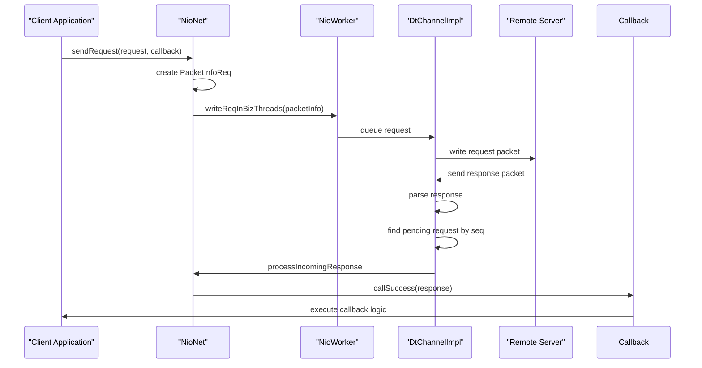
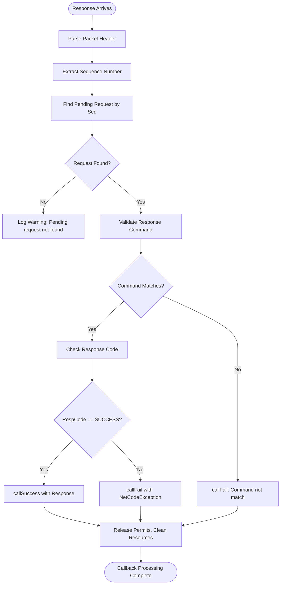
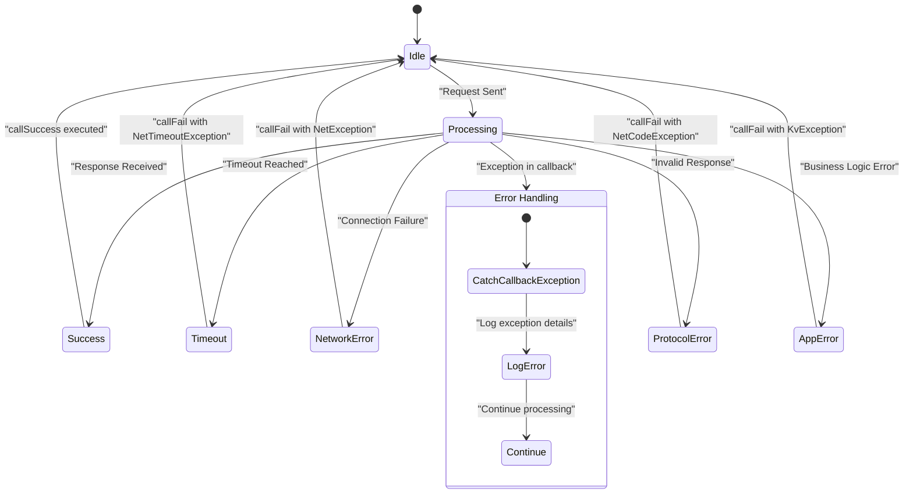

# RPC Callbacks and Asynchronous Processing

<cite>
**Referenced Files in This Document**   
- [RpcCallback.java](file://client/src/main/java/com/github/dtprj/dongting/net/RpcCallback.java)
- [FutureCallback.java](file://client/src/main/java/com/github/dtprj/dongting/common/FutureCallback.java)
- [ReadPacket.java](file://client/src/main/java/com/github/dtprj/dongting/net/ReadPacket.java)
- [NioNet.java](file://client/src/main/java/com/github/dtprj/dongting/net/NioNet.java)
- [NioClient.java](file://client/src/main/java/com/github/dtprj/dongting/net/NioClient.java)
- [DtChannelImpl.java](file://client/src/main/java/com/github/dtprj/dongting/net/DtChannelImpl.java)
- [PacketInfoReq.java](file://client/src/main/java/com/github/dtprj/dongting/net/PacketInfoReq.java)
- [KvClient.java](file://client/src/main/java/com/github/dtprj/dongting/dtkv/KvClient.java)
- [NetTimeoutException.java](file://client/src/main/java/com/github/dtprj/dongting/net/NetTimeoutException.java)
</cite>

## Table of Contents
1. [Introduction](#introduction)
2. [RpcCallback Interface Design](#rpcallback-interface-design)
3. [Factory Methods for CompletableFuture Integration](#factory-methods-for-completablefuture-integration)
4. [Integration with Network I/O System](#integration-with-network-io-system)
5. [Response Processing and Callback Invocation](#response-processing-and-callback-invocation)
6. [Timeout and Error Handling](#timeout-and-error-handling)
7. [Practical Usage Examples](#practical-usage-examples)
8. [Asynchronous Programming Model](#asynchronous-programming-model)
9. [Conclusion](#conclusion)

## Introduction
The Dongting RPC framework implements a sophisticated asynchronous programming model centered around the RpcCallback mechanism. This document provides a comprehensive analysis of the RpcCallback functional interface and its role in handling asynchronous responses in the Dongting distributed system. The RpcCallback interface extends the FutureCallback pattern to provide a clean, non-blocking approach for processing responses from remote procedure calls. This mechanism enables efficient handling of network operations while maintaining application responsiveness and scalability. The integration between RpcCallback and the underlying network I/O system allows for seamless bridging between traditional callback-based asynchronous programming and modern CompletableFuture-based patterns, providing developers with flexible options for handling asynchronous operations.

## RpcCallback Interface Design

The RpcCallback interface is a functional interface that extends FutureCallback<ReadPacket<T>> to handle asynchronous responses in the Dongting RPC framework. It serves as the primary mechanism for receiving and processing responses from remote calls without blocking the calling thread. The interface is designed to be simple and flexible, allowing developers to implement custom logic for handling both successful responses and exceptional conditions.

RpcCallback inherits the call method from FutureCallback, which accepts two parameters: the result of type ReadPacket<T> and a Throwable for error conditions. When a response arrives from a remote call, the callback's call method is invoked with the response packet and null for the exception parameter. If an error occurs during the RPC invocation, such as a network failure or timeout, the call method is invoked with null for the result and the appropriate exception.

The ReadPacket<T> class encapsulates the response data from an RPC call, containing the response body of type T along with metadata about the packet. This design allows for type-safe handling of response data while providing access to the complete packet information when needed. The RpcCallback interface enables non-blocking operations by decoupling the request initiation from response processing, allowing the calling thread to continue with other work while waiting for the remote response.

**Section sources**
- [RpcCallback.java](file://client/src/main/java/com/github/dtprj/dongting/net/RpcCallback.java#L26-L46)
- [FutureCallback.java](file://client/src/main/java/com/github/dtprj/dongting/common/FutureCallback.java#L27-L31)
- [ReadPacket.java](file://client/src/main/java/com/github/dtprj/dongting/net/ReadPacket.java#L23-L44)

## Factory Methods for CompletableFuture Integration

The RpcCallback interface provides two static factory methods, fromUnwrapFuture and fromFuture, that bridge the callback-based asynchronous model with the CompletableFuture-based programming pattern. These methods enable seamless integration between the traditional callback approach and modern Java asynchronous programming constructs, giving developers flexibility in how they handle asynchronous operations.

The fromFuture method creates an RpcCallback that completes a CompletableFuture<ReadPacket<T>> when the RPC response arrives. When a successful response is received, the CompletableFuture is completed with the entire ReadPacket object, preserving all response metadata. If an error occurs, the CompletableFuture is completed exceptionally with the appropriate exception. This method is useful when the application needs access to the complete response packet, including headers and metadata, in addition to the response body.

The fromUnwrapFuture method creates an RpcCallback that completes a CompletableFuture<T> with just the response body. When a successful response arrives, the callback extracts the body from the ReadPacket and completes the CompletableFuture with this value. This method provides a more streamlined approach for applications that only need the response data and don't require access to the packet metadata. It effectively "unwraps" the response body from the packet container, simplifying the API for common use cases.

These factory methods enable developers to choose the appropriate level of abstraction based on their specific needs. Applications that require detailed control over the response handling can use the callback interface directly, while those preferring a more functional programming style can leverage CompletableFuture with the provided factory methods.

```mermaid
classDiagram
class RpcCallback~T~ {
+call(ReadPacket~T~, Throwable)
}
class FutureCallback~T~ {
+call(T, Throwable)
}
class ReadPacket~T~ {
+T body
+int packetType
+int command
+int seq
+long timeout
+int respCode
+String msg
+byte[] extra
}
class CompletableFuture~T~ {
+complete(T)
+completeExceptionally(Throwable)
}
RpcCallback~T~ --|> FutureCallback~ReadPacket~T~~
FutureCallback~T~ <.. CompletableFuture~T~ : fromFuture
RpcCallback~T~ ..> CompletableFuture~T~ : fromFuture
RpcCallback~T~ ..> CompletableFuture~T~ : fromUnwrapFuture
ReadPacket~T~ --> T : contains
```

**Diagram sources**
- [RpcCallback.java](file://client/src/main/java/com/github/dtprj/dongting/net/RpcCallback.java#L27-L45)
- [FutureCallback.java](file://client/src/main/java/com/github/dtprj/dongting/common/FutureCallback.java#L53-L60)
- [ReadPacket.java](file://client/src/main/java/com/github/dtprj/dongting/net/ReadPacket.java#L23-L44)

## Integration with Network I/O System

The RpcCallback mechanism is tightly integrated with the Dongting network I/O system, which is built on a non-blocking NIO foundation. This integration enables efficient handling of asynchronous operations while maintaining high throughput and low latency. The NioNet class serves as the core networking component, managing the lifecycle of network operations and coordinating between the I/O threads and business logic.

When an RPC request is initiated, the NioNet system creates a PacketInfoReq object that encapsulates the request packet, timeout information, and the associated RpcCallback. This packet information is queued for processing by the appropriate NioWorker, which handles the actual I/O operations. The worker thread manages the connection to the remote peer and is responsible for writing the request to the network and reading the response when it arrives.

The DtChannelImpl class represents a logical connection between peers and maintains state information for pending requests. Each pending request is tracked in a linked list within the channel, with the PacketInfoReq objects containing references to their respective RpcCallback instances. This design allows the system to efficiently match incoming responses with their corresponding callbacks based on the sequence number in the response packet.

The integration between RpcCallback and the network I/O system follows a clean separation of concerns. The I/O threads handle the low-level network operations, while the callback execution is typically delegated to business executor threads. This separation prevents blocking operations in the I/O threads, ensuring that the system can handle a large number of concurrent connections without degradation in performance.



**Diagram sources**
- [NioNet.java](file://client/src/main/java/com/github/dtprj/dongting/net/NioNet.java#L92-L123)
- [DtChannelImpl.java](file://client/src/main/java/com/github/dtprj/dongting/net/DtChannelImpl.java#L148-L153)
- [PacketInfoReq.java](file://client/src/main/java/com/github/dtprj/dongting/net/PacketInfoReq.java#L39-L48)

## Response Processing and Callback Invocation

The response processing mechanism in Dongting follows a well-defined flow that ensures reliable delivery of responses to the appropriate callbacks. When a response packet arrives from the network, the DtChannelImpl processes it through the MultiParser, which decodes the packet header and body according to the protocol specification. The parser uses the Packet.IDX_SEQ field to identify the sequence number of the response, which is used to match it with the corresponding pending request.

Once the response is parsed, the system retrieves the associated PacketInfoReq from the pending requests queue using the sequence number as a key. This lookup is performed in the WorkerStatus component, which maintains a mapping of sequence numbers to pending request information for each channel. If a matching pending request is found, the system proceeds with response validation, checking that the response command matches the original request command.

The actual callback invocation is handled by the PacketInfoReq's callSuccess and callFail methods. The callSuccess method is responsible for completing the callback with the response data, while also releasing any acquired permits and cleaning up resources. This method first checks if the response code indicates success (CmdCodes.SUCCESS), and if so, invokes the RpcCallback with the response packet and null exception. If the response indicates an error condition, the callFail method is invoked with an appropriate NetCodeException.

The response processing system includes several safeguards to handle edge cases. If a response arrives for a request that has already been completed or timed out, the system logs the event but does not invoke the callback. This prevents potential issues from late-arriving responses. Additionally, the system handles cases where the response body cannot be properly decoded by invoking the callback with a decoding exception, allowing the application to handle such errors appropriately.



**Diagram sources**
- [DtChannelImpl.java](file://client/src/main/java/com/github/dtprj/dongting/net/DtChannelImpl.java#L308-L314)
- [PacketInfoReq.java](file://client/src/main/java/com/github/dtprj/dongting/net/PacketInfoReq.java#L51-L67)
- [NioNet.java](file://client/src/main/java/com/github/dtprj/dongting/net/NioNet.java#L174-L195)

## Timeout and Error Handling

The Dongting RPC framework implements a comprehensive timeout and error handling system that works in conjunction with the RpcCallback mechanism. Timeouts are managed at multiple levels, ensuring that operations do not hang indefinitely and that resources are properly cleaned up. The system uses the DtTime class to specify timeout durations, which are encoded in the request packet and used by both the client and server to enforce time limits.

When a request is sent, the timeout value is used to schedule the request for timeout processing if a response is not received within the specified period. The WorkerStatus component maintains a near-timeout queue that tracks pending requests approaching their timeout deadline. This allows the system to proactively handle timeouts before they occur, improving responsiveness and resource utilization. When a timeout is detected, the system invokes the RpcCallback with a NetTimeoutException, allowing the application to handle the timeout condition appropriately.

The error handling system distinguishes between different types of failures, including network errors, protocol errors, and application-level errors. Network errors such as connection failures or I/O exceptions are reported as NetException instances, while protocol-level errors like invalid commands or malformed packets are reported as NetCodeException with specific error codes. Application-level errors returned by the remote service are propagated through the bizCode field in the response packet and can be converted to appropriate exception types by the callback.

The framework also handles exceptional conditions that occur during callback execution. If a callback throws an exception during processing, the system catches the exception and logs it, preventing it from propagating to the network I/O threads. This isolation ensures that problems in application code do not affect the stability of the networking layer. The FutureCallback.callFail and callSuccess methods include try-catch blocks that handle exceptions during callback invocation, providing a robust error containment mechanism.



**Diagram sources**
- [NetTimeoutException.java](file://client/src/main/java/com/github/dtprj/dongting/net/NetTimeoutException.java#L21-L31)
- [FutureCallback.java](file://client/src/main/java/com/github/dtprj/dongting/common/FutureCallback.java#L33-L51)
- [DtChannelImpl.java](file://client/src/main/java/com/github/dtprj/dongting/net/DtChannelImpl.java#L243-L248)

## Practical Usage Examples

The RpcCallback mechanism is used extensively throughout the Dongting framework, with the KvClient class providing a clear example of its practical application. In the KvClient implementation, asynchronous operations are performed using the sendAsync method, which takes a FutureCallback parameter for handling the response. This method creates an EncodableBodyWritePacket with the request data and sends it using the RaftClient's sendRequest method with an RpcCallback that wraps the provided FutureCallback.

For synchronous operations, the KvClient uses CompletableFuture in combination with the RpcCallback.fromFuture factory method. The sendSync method creates a CompletableFuture and passes it to RpcCallback.fromFuture, which returns an RpcCallback that will complete the future when the response arrives. The method then blocks on the future using get with a timeout, providing a synchronous API while still using the underlying asynchronous infrastructure.

The benchmark module demonstrates another practical use case, showing how RpcCallback can be used for performance testing. In the RpcBenchmark class, asynchronous callbacks are used to measure request latency and throughput. The callback implementation records timing information when the response is received and updates performance counters, allowing for detailed analysis of system performance under load.

Custom callback implementations can be created for specific use cases, such as logging, monitoring, or complex error recovery strategies. For example, a callback could be implemented to automatically retry failed operations, or to aggregate multiple responses for batch processing. The functional interface design makes it easy to create lambda expressions for simple callbacks, while more complex logic can be implemented in dedicated classes.

**Section sources**
- [KvClient.java](file://client/src/main/java/com/github/dtprj/dongting/dtkv/KvClient.java#L132-L182)
- [RpcBenchmark.java](file://benchmark/src/main/java/com/github/dtprj/dongting/bench/rpc/RpcBenchmark.java#L140-L152)
- [NioClient.java](file://client/src/main/java/com/github/dtprj/dongting/net/NioClient.java#L162-L165)

## Asynchronous Programming Model

The RpcCallback mechanism is a key component of Dongting's overall asynchronous programming model, which emphasizes non-blocking operations and efficient resource utilization. This model is designed to handle high-concurrency scenarios typical in distributed systems, where thousands of simultaneous operations must be managed with minimal overhead.

The programming model follows a clear separation between I/O operations and business logic processing. I/O threads handle network operations and protocol processing, while business logic is executed on separate executor threads. This separation prevents blocking operations in the I/O path, ensuring that the system can maintain high throughput even under heavy load. The RpcCallback serves as the bridge between these two domains, allowing results from I/O operations to be delivered to the appropriate business logic context.

The model supports both callback-based and future-based programming styles, giving developers flexibility in how they structure their asynchronous code. The callback-based approach is more memory-efficient for high-volume operations, as it avoids the overhead of CompletableFuture objects. The future-based approach provides a more familiar programming model for developers accustomed to modern Java concurrency constructs and enables easy composition of asynchronous operations.

The integration with the fiber system in Dongting's server component demonstrates how the asynchronous model can be extended to provide even higher levels of concurrency. Fibers provide lightweight, cooperative multitasking that can handle millions of concurrent operations with minimal memory overhead. The RpcCallback mechanism works seamlessly with fibers, allowing fiber-based code to make asynchronous RPC calls without blocking the entire fiber scheduler.

**Section sources**
- [RpcCallback.java](file://client/src/main/java/com/github/dtprj/dongting/net/RpcCallback.java#L26-L46)
- [FutureCallback.java](file://client/src/main/java/com/github/dtprj/dongting/common/FutureCallback.java#L53-L60)
- [NioNet.java](file://client/src/main/java/com/github/dtprj/dongting/net/NioNet.java#L47-L200)

## Conclusion
The RpcCallback mechanism in Dongting provides a robust and flexible foundation for asynchronous remote procedure calls. By extending the FutureCallback pattern and integrating with CompletableFuture, it offers developers multiple approaches to handling asynchronous operations while maintaining high performance and reliability. The tight integration with the network I/O system ensures efficient resource utilization and low-latency response processing. The comprehensive timeout and error handling system provides resilience against network failures and other exceptional conditions. This design enables the development of scalable distributed applications that can handle high concurrency with minimal overhead, making it well-suited for modern cloud-native environments.