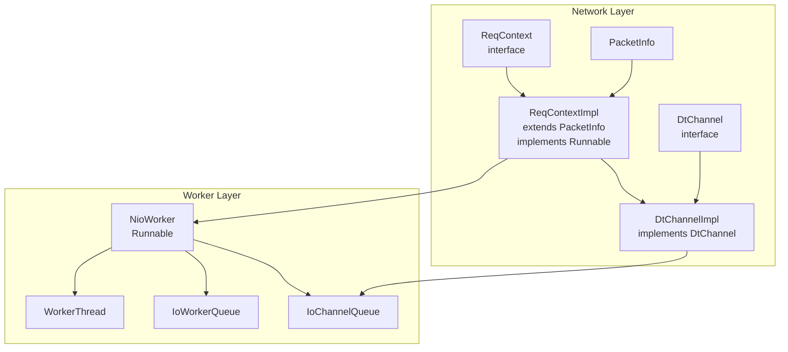
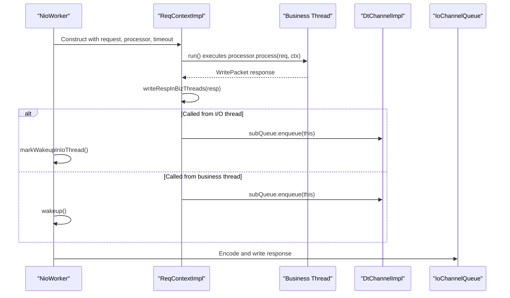
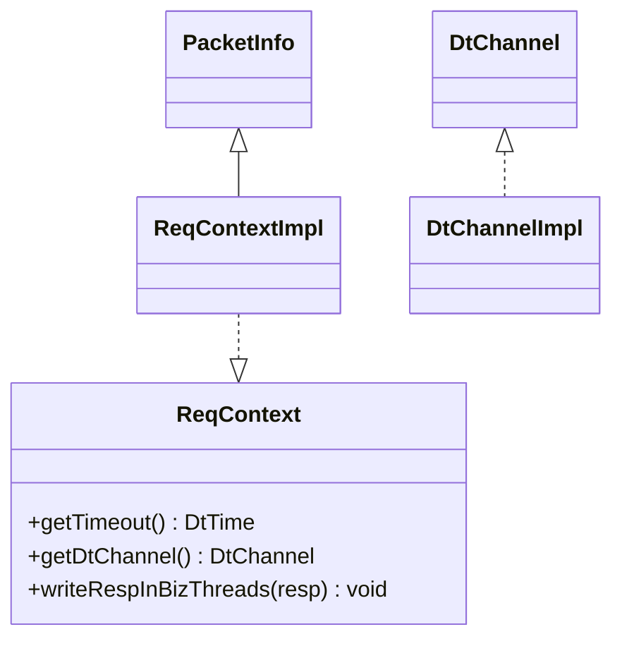
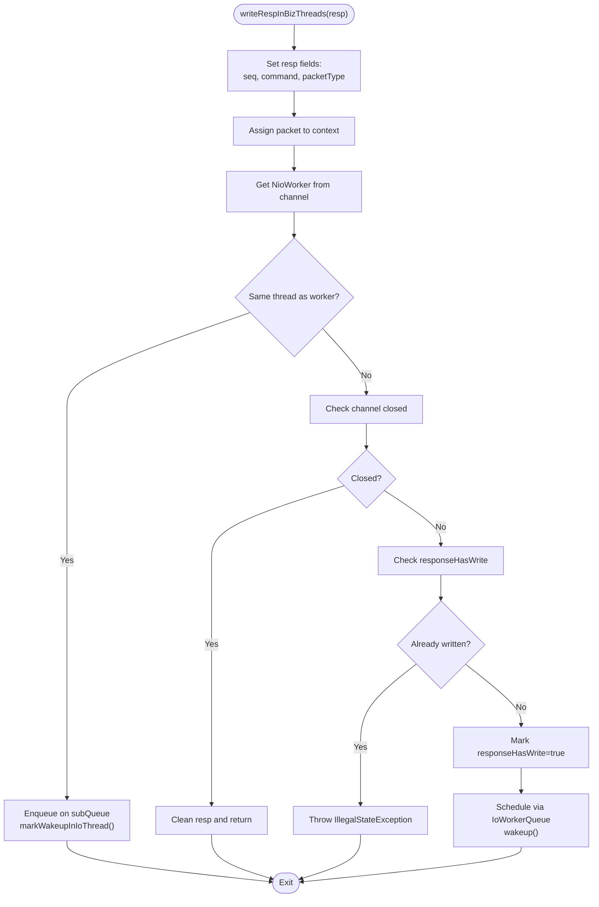
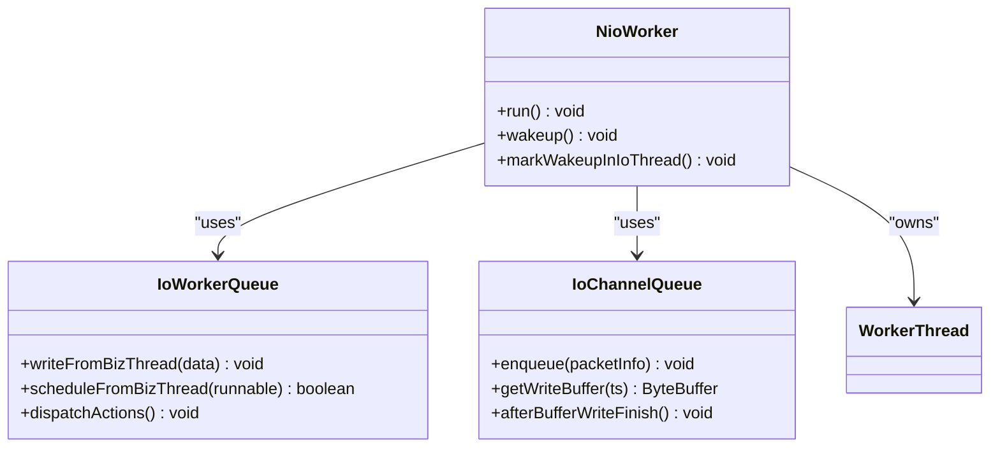
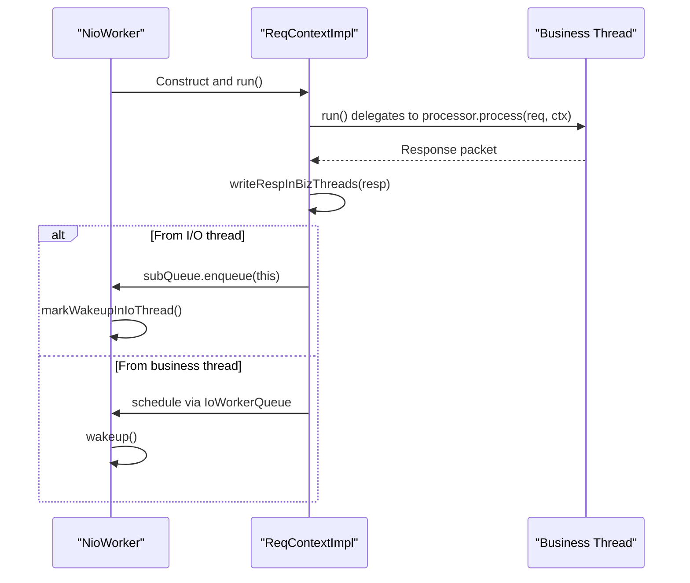
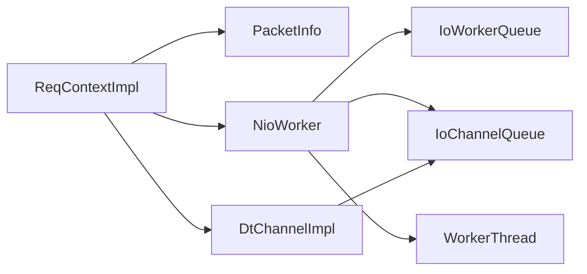

# Request Context

<cite>
**Referenced Files in This Document**
- [ReqContext.java](file://client/src/main/java/com/github/dtprj/dongting/net/ReqContext.java)
- [ReqContextImpl.java](file://client/src/main/java/com/github/dtprj/dongting/net/ReqContextImpl.java)
- [PacketInfo.java](file://client/src/main/java/com/github/dtprj/dongting/net/PacketInfo.java)
- [DtChannel.java](file://client/src/main/java/com/github/dtprj/dongting/net/DtChannel.java)
- [DtChannelImpl.java](file://client/src/main/java/com/github/dtprj/dongting/net/DtChannelImpl.java)
- [NioWorker.java](file://client/src/main/java/com/github/dtprj/dongting/net/NioWorker.java)
- [IoWorkerQueue.java](file://client/src/main/java/com/github/dtprj/dongting/net/IoWorkerQueue.java)
- [IoChannelQueue.java](file://client/src/main/java/com/github/dtprj/dongting/net/IoChannelQueue.java)
- [WorkerThread.java](file://client/src/main/java/com/github/dtprj/dongting/net/WorkerThread.java)
- [NioServerTest.java](file://client/src/test/java/com/github/dtprj/dongting/net/NioServerTest.java)
- [TimeoutTest.java](file://client/src/test/java/com/github/dtprj/dongting/net/TimeoutTest.java)
</cite>

## Table of Contents
1. [Introduction](#introduction)
2. [Project Structure](#project-structure)
3. [Core Components](#core-components)
4. [Architecture Overview](#architecture-overview)
5. [Detailed Component Analysis](#detailed-component-analysis)
6. [Dependency Analysis](#dependency-analysis)
7. [Performance Considerations](#performance-considerations)
8. [Troubleshooting Guide](#troubleshooting-guide)
9. [Conclusion](#conclusion)

## Introduction
This document explains Dongting’s request context mechanism that enables safe, efficient request/response lifecycle management across I/O worker threads and business threads. It focuses on:
- The ReqContext interface and its role in exposing request timeout and the associated DtChannel
- The writeRespInBizThreads method for thread-safe response writing from business threads to the I/O system
- The ReqContextImpl concrete implementation that extends PacketInfo and implements Runnable for execution within the processing pipeline
- How ReqContext maintains state between request reception and response generation, including sequence number propagation and flow control management
- The thread transition pattern from I/O worker threads to business threads and back, and how the context facilitates this handoff
- Practical examples of accessing channel information and writing responses from different execution contexts

## Project Structure
The request context spans several core classes:
- Interface and implementation: ReqContext and ReqContextImpl
- Packet metadata: PacketInfo
- Channel abstraction and implementation: DtChannel and DtChannelImpl
- Worker orchestration: NioWorker, IoWorkerQueue, IoChannelQueue
- Threading model: WorkerThread

**Diagram sources**
- [ReqContext.java](file://client/src/main/java/com/github/dtprj/dongting/net/ReqContext.java#L23-L31)
- [ReqContextImpl.java](file://client/src/main/java/com/github/dtprj/dongting/net/ReqContextImpl.java#L25-L116)
- [PacketInfo.java](file://client/src/main/java/com/github/dtprj/dongting/net/PacketInfo.java#L23-L36)
- [DtChannel.java](file://client/src/main/java/com/github/dtprj/dongting/net/DtChannel.java#L25-L49)
- [DtChannelImpl.java](file://client/src/main/java/com/github/dtprj/dongting/net/DtChannelImpl.java#L40-L104)
- [NioWorker.java](file://client/src/main/java/com/github/dtprj/dongting/net/NioWorker.java#L55-L126)
- [IoWorkerQueue.java](file://client/src/main/java/com/github/dtprj/dongting/net/IoWorkerQueue.java#L32-L146)
- [IoChannelQueue.java](file://client/src/main/java/com/github/dtprj/dongting/net/IoChannelQueue.java#L37-L111)
- [WorkerThread.java](file://client/src/main/java/com/github/dtprj/dongting/net/WorkerThread.java#L23-L31)

**Section sources**
- [ReqContext.java](file://client/src/main/java/com/github/dtprj/dongting/net/ReqContext.java#L23-L31)
- [ReqContextImpl.java](file://client/src/main/java/com/github/dtprj/dongting/net/ReqContextImpl.java#L25-L116)
- [PacketInfo.java](file://client/src/main/java/com/github/dtprj/dongting/net/PacketInfo.java#L23-L36)
- [DtChannel.java](file://client/src/main/java/com/github/dtprj/dongting/net/DtChannel.java#L25-L49)
- [DtChannelImpl.java](file://client/src/main/java/com/github/dtprj/dongting/net/DtChannelImpl.java#L40-L104)
- [NioWorker.java](file://client/src/main/java/com/github/dtprj/dongting/net/NioWorker.java#L55-L126)
- [IoWorkerQueue.java](file://client/src/main/java/com/github/dtprj/dongting/net/IoWorkerQueue.java#L32-L146)
- [IoChannelQueue.java](file://client/src/main/java/com/github/dtprj/dongting/net/IoChannelQueue.java#L37-L111)
- [WorkerThread.java](file://client/src/main/java/com/github/dtprj/dongting/net/WorkerThread.java#L23-L31)

## Core Components
- ReqContext: Defines accessors for request timeout and the associated DtChannel, plus a method to write responses from business threads safely.
- ReqContextImpl: Concrete implementation that carries the request packet, processor, and flow-control flags; implements Runnable to execute business processing and response writing.
- PacketInfo: Holds the channel, pending write packet, and timeout for queued operations.
- DtChannel/DtChannelImpl: Abstraction and implementation of network channels, including sequence number management and sub-queues for I/O encoding and writing.
- NioWorker/IoWorkerQueue/IoChannelQueue: Worker orchestration and queues that serialize cross-thread operations and ensure thread-safe writes.
- WorkerThread: Thin wrapper around the worker thread for timing and lifecycle.

**Section sources**
- [ReqContext.java](file://client/src/main/java/com/github/dtprj/dongting/net/ReqContext.java#L23-L31)
- [ReqContextImpl.java](file://client/src/main/java/com/github/dtprj/dongting/net/ReqContextImpl.java#L25-L116)
- [PacketInfo.java](file://client/src/main/java/com/github/dtprj/dongting/net/PacketInfo.java#L23-L36)
- [DtChannel.java](file://client/src/main/java/com/github/dtprj/dongting/net/DtChannel.java#L25-L49)
- [DtChannelImpl.java](file://client/src/main/java/com/github/dtprj/dongting/net/DtChannelImpl.java#L40-L104)
- [NioWorker.java](file://client/src/main/java/com/github/dtprj/dongting/net/NioWorker.java#L55-L126)
- [IoWorkerQueue.java](file://client/src/main/java/com/github/dtprj/dongting/net/IoWorkerQueue.java#L32-L146)
- [IoChannelQueue.java](file://client/src/main/java/com/github/dtprj/dongting/net/IoChannelQueue.java#L37-L111)
- [WorkerThread.java](file://client/src/main/java/com/github/dtprj/dongting/net/WorkerThread.java#L23-L31)

## Architecture Overview
The request context orchestrates a strict handoff between I/O and business threads:
- I/O worker thread receives a request and constructs a ReqContextImpl
- The context runs in the business thread (via the processing pipeline) to produce a response
- The response is written back to the I/O system using writeRespInBizThreads, which enqueues the operation on the appropriate queue and wakes up the I/O thread if needed

**Diagram sources**
- [ReqContextImpl.java](file://client/src/main/java/com/github/dtprj/dongting/net/ReqContextImpl.java#L82-L116)
- [ReqContextImpl.java](file://client/src/main/java/com/github/dtprj/dongting/net/ReqContextImpl.java#L52-L80)
- [NioWorker.java](file://client/src/main/java/com/github/dtprj/dongting/net/NioWorker.java#L359-L402)
- [IoChannelQueue.java](file://client/src/main/java/com/github/dtprj/dongting/net/IoChannelQueue.java#L84-L111)

## Detailed Component Analysis

### ReqContext Interface
- Purpose: Expose request timeout and the associated DtChannel to business code and provide a thread-safe method to write responses from business threads.
- Methods:
  - getTimeout(): Access the request timeout for scheduling and cancellation decisions
  - getDtChannel(): Access the underlying channel for response writing and diagnostics
  - writeRespInBizThreads(resp): Enforce single-response semantics and enqueue the response for I/O writing

**Diagram sources**
- [ReqContext.java](file://client/src/main/java/com/github/dtprj/dongting/net/ReqContext.java#L23-L31)
- [ReqContextImpl.java](file://client/src/main/java/com/github/dtprj/dongting/net/ReqContextImpl.java#L25-L116)
- [PacketInfo.java](file://client/src/main/java/com/github/dtprj/dongting/net/PacketInfo.java#L23-L36)
- [DtChannel.java](file://client/src/main/java/com/github/dtprj/dongting/net/DtChannel.java#L25-L49)
- [DtChannelImpl.java](file://client/src/main/java/com/github/dtprj/dongting/net/DtChannelImpl.java#L40-L104)

**Section sources**
- [ReqContext.java](file://client/src/main/java/com/github/dtprj/dongting/net/ReqContext.java#L23-L31)

### ReqContextImpl: Execution Pipeline and Response Writing
- Extends PacketInfo to carry the channel, pending packet, and timeout
- Implements Runnable to execute business processing and response writing
- writeRespInBizThreads:
  - Propagates sequence number and command from the original request to the response
  - Sets packet type to response
  - Enqueues the operation on the channel’s sub-queue
  - If called from the I/O thread, marks the I/O thread to wake up; otherwise schedules via IoWorkerQueue and wakes the I/O thread

**Diagram sources**
- [ReqContextImpl.java](file://client/src/main/java/com/github/dtprj/dongting/net/ReqContextImpl.java#L52-L80)

**Section sources**
- [ReqContextImpl.java](file://client/src/main/java/com/github/dtprj/dongting/net/ReqContextImpl.java#L25-L116)

### PacketInfo: Shared State Container
- Holds the channel, pending write packet, and timeout for queued operations
- Used by ReqContextImpl to pass the response packet to the I/O system

**Section sources**
- [PacketInfo.java](file://client/src/main/java/com/github/dtprj/dongting/net/PacketInfo.java#L23-L36)

### DtChannel and DtChannelImpl: Channel Abstraction and Sequence Management
- DtChannel: Public interface exposing channel metadata and ownership
- DtChannelImpl:
  - Implements the channel and manages sequence numbers
  - Maintains a sub-queue for pending writes
  - Processes incoming requests and responses, invoking the processing pipeline

**Section sources**
- [DtChannel.java](file://client/src/main/java/com/github/dtprj/dongting/net/DtChannel.java#L25-L49)
- [DtChannelImpl.java](file://client/src/main/java/com/github/dtprj/dongting/net/DtChannelImpl.java#L40-L104)

### NioWorker, IoWorkerQueue, and IoChannelQueue: Cross-Thread Coordination
- NioWorker: Runs the I/O loop, processes reads/writes, and coordinates wakeups
- IoWorkerQueue: MPSC queue for cross-thread scheduling from business threads to I/O
- IoChannelQueue: Per-channel queue that encodes and writes packets, tracks pending requests, and registers interest for write events

**Diagram sources**
- [NioWorker.java](file://client/src/main/java/com/github/dtprj/dongting/net/NioWorker.java#L55-L126)
- [IoWorkerQueue.java](file://client/src/main/java/com/github/dtprj/dongting/net/IoWorkerQueue.java#L32-L146)
- [IoChannelQueue.java](file://client/src/main/java/com/github/dtprj/dongting/net/IoChannelQueue.java#L37-L111)
- [WorkerThread.java](file://client/src/main/java/com/github/dtprj/dongting/net/WorkerThread.java#L23-L31)

**Section sources**
- [NioWorker.java](file://client/src/main/java/com/github/dtprj/dongting/net/NioWorker.java#L359-L402)
- [IoWorkerQueue.java](file://client/src/main/java/com/github/dtprj/dongting/net/IoWorkerQueue.java#L39-L71)
- [IoChannelQueue.java](file://client/src/main/java/com/github/dtprj/dongting/net/IoChannelQueue.java#L84-L111)

### Thread Transition Pattern and Handoff
- I/O thread constructs ReqContextImpl and hands off to business thread for processing
- Business thread produces response and calls writeRespInBizThreads
- If called from I/O thread, the context enqueues directly and marks the I/O thread to wake up
- If called from business thread, the context schedules via IoWorkerQueue and wakes the I/O thread

**Diagram sources**
- [ReqContextImpl.java](file://client/src/main/java/com/github/dtprj/dongting/net/ReqContextImpl.java#L82-L116)
- [ReqContextImpl.java](file://client/src/main/java/com/github/dtprj/dongting/net/ReqContextImpl.java#L52-L80)
- [NioWorker.java](file://client/src/main/java/com/github/dtprj/dongting/net/NioWorker.java#L359-L402)

**Section sources**
- [ReqContextImpl.java](file://client/src/main/java/com/github/dtprj/dongting/net/ReqContextImpl.java#L82-L116)
- [NioWorker.java](file://client/src/main/java/com/github/dtprj/dongting/net/NioWorker.java#L359-L402)

### Sequence Number Propagation and Flow Control
- Sequence number propagation:
  - writeRespInBizThreads sets the response’s sequence number equal to the request’s sequence number
  - The channel maintains its own sequence counter and handles overflow scenarios
- Flow control:
  - ReqContextImpl constructor accepts a flag indicating whether to apply flow control
  - After processing, the context releases pending bytes if flow control was enabled

**Section sources**
- [ReqContextImpl.java](file://client/src/main/java/com/github/dtprj/dongting/net/ReqContextImpl.java#L33-L40)
- [ReqContextImpl.java](file://client/src/main/java/com/github/dtprj/dongting/net/ReqContextImpl.java#L108-L111)
- [NioServerTest.java](file://client/src/test/java/com/github/dtprj/dongting/net/NioServerTest.java#L405-L431)

### Accessing Channel Information and Writing Responses from Different Execution Contexts
- Accessing channel information:
  - From ReqContext: getDtChannel() returns the channel abstraction
  - From channel implementation: methods expose remote/local addresses, ports, and ownership
- Writing responses:
  - From I/O thread: enqueue directly on the channel’s sub-queue and mark the I/O thread to wake up
  - From business thread: schedule via IoWorkerQueue and wake the I/O thread

**Section sources**
- [ReqContext.java](file://client/src/main/java/com/github/dtprj/dongting/net/ReqContext.java#L23-L31)
- [DtChannel.java](file://client/src/main/java/com/github/dtprj/dongting/net/DtChannel.java#L25-L49)
- [ReqContextImpl.java](file://client/src/main/java/com/github/dtprj/dongting/net/ReqContextImpl.java#L52-L80)
- [IoWorkerQueue.java](file://client/src/main/java/com/github/dtprj/dongting/net/IoWorkerQueue.java#L44-L52)
- [IoChannelQueue.java](file://client/src/main/java/com/github/dtprj/dongting/net/IoChannelQueue.java#L84-L111)

## Dependency Analysis
The request context mechanism exhibits low coupling and clear separation of concerns:
- ReqContextImpl depends on PacketInfo for shared state and on NioWorker/IoWorkerQueue/IoChannelQueue for thread-safe writes
- NioWorker encapsulates the I/O loop and wake-up mechanisms
- IoWorkerQueue decouples business threads from I/O thread scheduling
- IoChannelQueue ensures per-channel ordering and encoding

**Diagram sources**
- [ReqContextImpl.java](file://client/src/main/java/com/github/dtprj/dongting/net/ReqContextImpl.java#L25-L116)
- [PacketInfo.java](file://client/src/main/java/com/github/dtprj/dongting/net/PacketInfo.java#L23-L36)
- [NioWorker.java](file://client/src/main/java/com/github/dtprj/dongting/net/NioWorker.java#L55-L126)
- [IoWorkerQueue.java](file://client/src/main/java/com/github/dtprj/dongting/net/IoWorkerQueue.java#L32-L146)
- [IoChannelQueue.java](file://client/src/main/java/com/github/dtprj/dongting/net/IoChannelQueue.java#L37-L111)
- [DtChannelImpl.java](file://client/src/main/java/com/github/dtprj/dongting/net/DtChannelImpl.java#L40-L104)
- [WorkerThread.java](file://client/src/main/java/com/github/dtprj/dongting/net/WorkerThread.java#L23-L31)

**Section sources**
- [ReqContextImpl.java](file://client/src/main/java/com/github/dtprj/dongting/net/ReqContextImpl.java#L25-L116)
- [NioWorker.java](file://client/src/main/java/com/github/dtprj/dongting/net/NioWorker.java#L55-L126)
- [IoWorkerQueue.java](file://client/src/main/java/com/github/dtprj/dongting/net/IoWorkerQueue.java#L32-L146)
- [IoChannelQueue.java](file://client/src/main/java/com/github/dtprj/dongting/net/IoChannelQueue.java#L37-L111)
- [DtChannelImpl.java](file://client/src/main/java/com/github/dtprj/dongting/net/DtChannelImpl.java#L40-L104)
- [WorkerThread.java](file://client/src/main/java/com/github/dtprj/dongting/net/WorkerThread.java#L23-L31)

## Performance Considerations
- Minimizing cross-thread overhead:
  - writeRespInBizThreads avoids unnecessary allocations by reusing the response packet and setting required fields
  - IoWorkerQueue uses an MPSC queue to batch actions and reduce contention
- Encoding efficiency:
  - IoChannelQueue batches multiple packets into a single buffer up to a configured maximum size
  - Pending request accounting prevents excessive memory usage and supports flow control
- Wake-up signaling:
  - NioWorker marks wake-ups when invoked from the I/O thread to avoid selector wakeups
  - Business-to-I/O scheduling uses a single wakeup to drain the queue

[No sources needed since this section provides general guidance]

## Troubleshooting Guide
- Duplicate response write:
  - writeRespInBizThreads throws an illegal state exception if the response has already been written, preventing race conditions
- Channel closed during write:
  - writeRespInBizThreads cleans the response and returns early if the channel is closed
- Timeout handling:
  - Tests demonstrate timeout scenarios for both near-timeout thresholds and pending request limits
  - Flow control tests show how max in-flight requests impact throughput and error propagation

**Section sources**
- [ReqContextImpl.java](file://client/src/main/java/com/github/dtprj/dongting/net/ReqContextImpl.java#L66-L80)
- [TimeoutTest.java](file://client/src/test/java/com/github/dtprj/dongting/net/TimeoutTest.java#L113-L260)
- [NioServerTest.java](file://client/src/test/java/com/github/dtprj/dongting/net/NioServerTest.java#L405-L431)

## Conclusion
Dongting’s request context mechanism cleanly separates I/O and business threads while ensuring thread-safe, deterministic response writing. The ReqContext interface exposes essential request metadata, and ReqContextImpl coordinates execution and response delivery across threads. Sequence number propagation and flow control are integral to correctness and performance. The architecture leverages queues and wake-up signaling to minimize contention and maximize throughput.