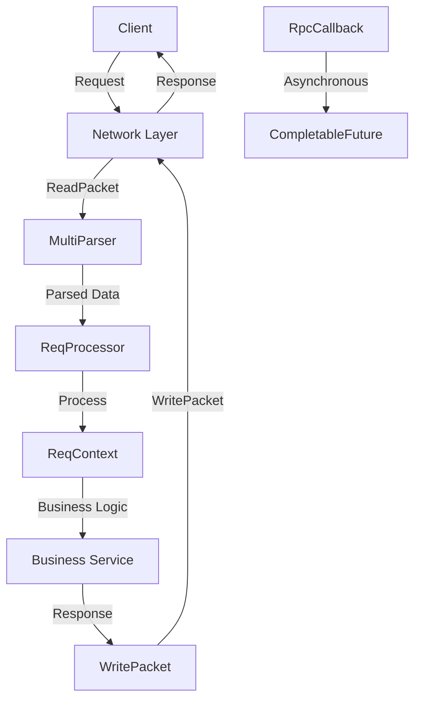
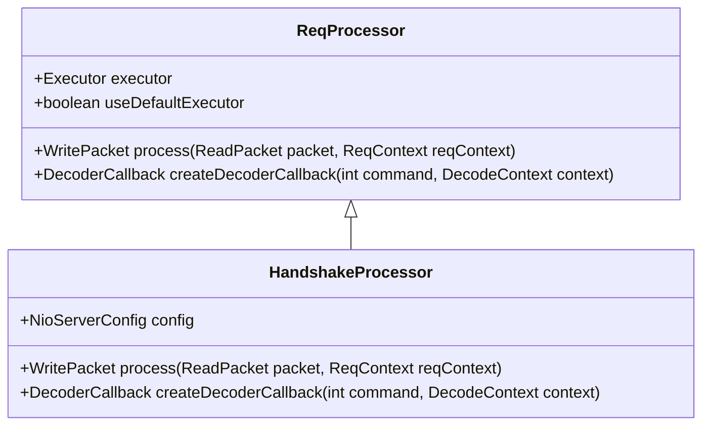
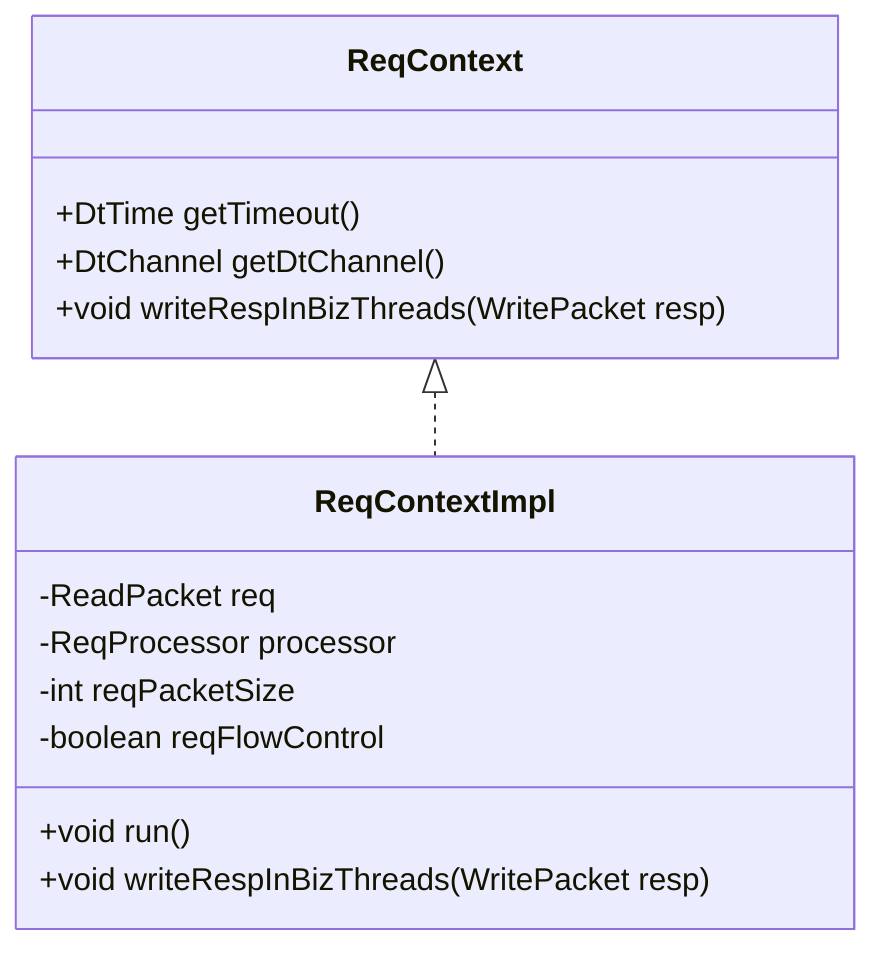
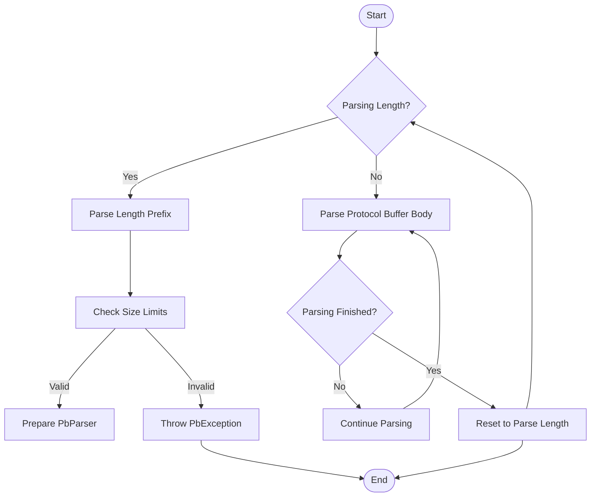
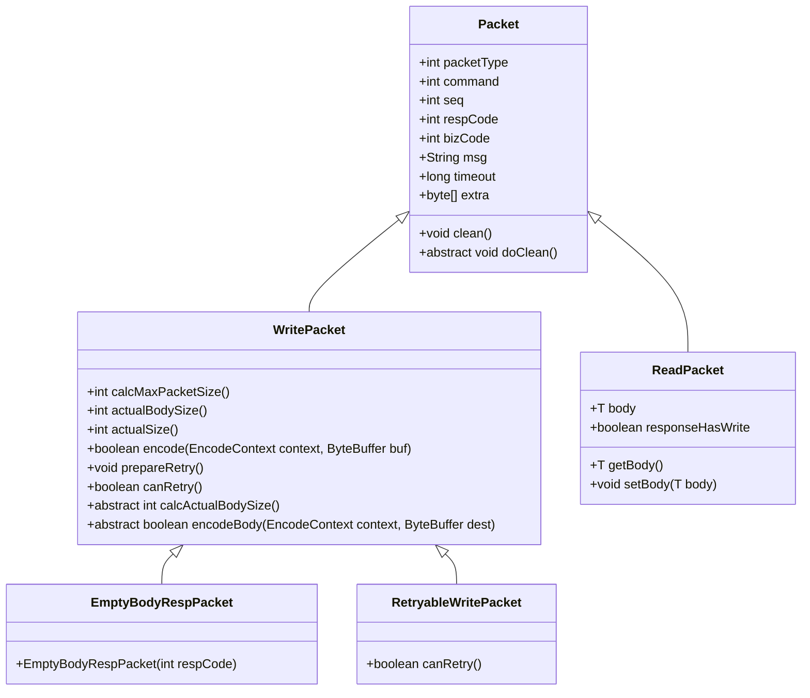
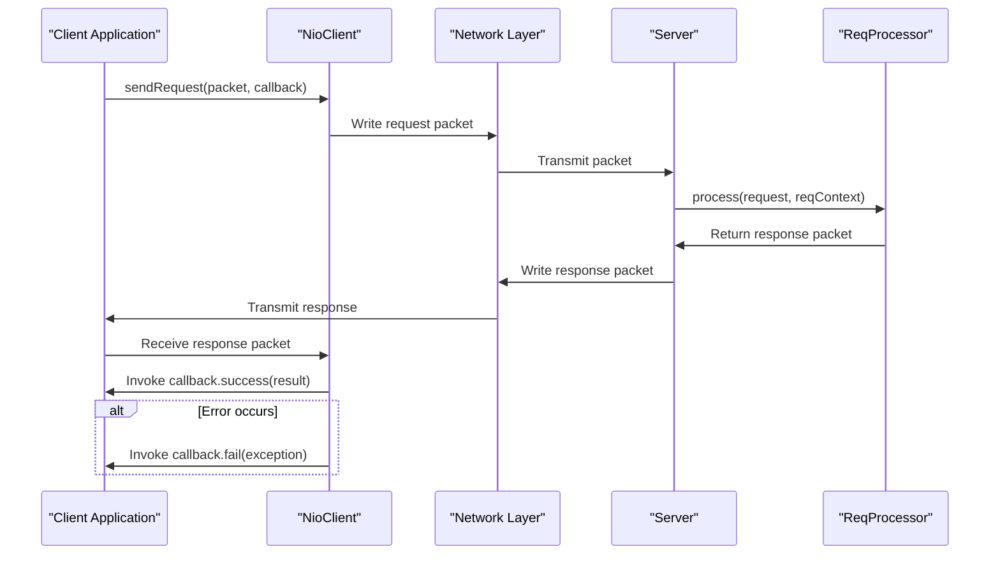
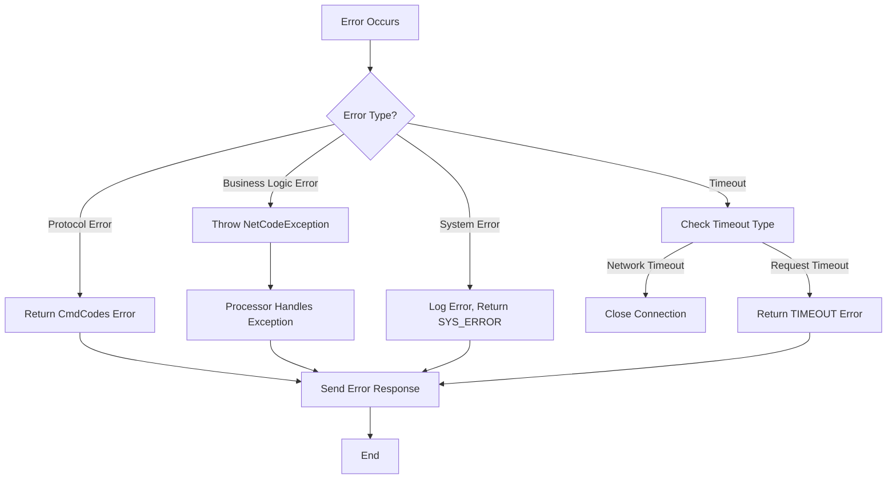

# Request Processing Pipeline

<cite>
**Referenced Files in This Document**   
- [ReqProcessor.java](file://client/src/main/java/com/github/dtprj/dongting/net/ReqProcessor.java)
- [ReqContext.java](file://client/src/main/java/com/github/dtprj/dongting/net/ReqContext.java)
- [ReqContextImpl.java](file://client/src/main/java/com/github/dtprj/dongting/net/ReqContextImpl.java)
- [MultiParser.java](file://client/src/main/java/com/github/dtprj/dongting/net/MultiParser.java)
- [WritePacket.java](file://client/src/main/java/com/github/dtprj/dongting/net/WritePacket.java)
- [ReadPacket.java](file://client/src/main/java/com/github/dtprj/dongting/net/ReadPacket.java)
- [RpcCallback.java](file://client/src/main/java/com/github/dtprj/dongting/net/RpcCallback.java)
- [DtChannelImpl.java](file://client/src/main/java/com/github/dtprj/dongting/net/DtChannelImpl.java)
- [Packet.java](file://client/src/main/java/com/github/dtprj/dongting/net/Packet.java)
- [HandshakeProcessor.java](file://client/src/main/java/com/github/dtprj/dongting/net/HandshakeProcessor.java)
- [EmptyBodyRespPacket.java](file://client/src/main/java/com/github/dtprj/dongting/net/EmptyBodyRespPacket.java)
- [CmdCodes.java](file://client/src/main/java/com/github/dtprj/dongting/net/CmdCodes.java)
- [RetryableWritePacket.java](file://client/src/main/java/com/github/dtprj/dongting/net/RetryableWritePacket.java)
</cite>

## Table of Contents
1. [Introduction](#introduction)
2. [Request Processing Core Components](#request-processing-core-components)
3. [ReqProcessor Interface](#reqprocessor-interface)
4. [ReqContext Abstraction](#reqcontext-abstraction)
5. [MultiParser Implementation](#multiparser-implementation)
6. [Packet Classes](#packet-classes)
7. [RpcCallback Mechanism](#rpccallback-mechanism)
8. [Request Processing Flow](#request-processing-flow)
9. [Custom Request Processor Implementation](#custom-request-processor-implementation)
10. [Error Handling Strategies](#error-handling-strategies)
11. [Conclusion](#conclusion)

## Introduction

The Dongting request processing pipeline provides a robust framework for handling incoming network commands and managing request execution context. This document details the core components of the pipeline, including the ReqProcessor interface for handling incoming commands, the ReqContext abstraction for request execution context, and the MultiParser implementation for efficient dispatch of multiple message types on a single connection. The documentation also covers the WritePacket and ReadPacket classes for request/response payloads, the RpcCallback mechanism for asynchronous response handling, and the complete flow from packet reception through parsing, processing, and response generation.

**Section sources**
- [ReqProcessor.java](file://client/src/main/java/com/github/dtprj/dongting/net/ReqProcessor.java#L1-L36)
- [ReqContext.java](file://client/src/main/java/com/github/dtprj/dongting/net/ReqContext.java#L1-L32)

## Request Processing Core Components

The request processing pipeline in Dongting consists of several key components that work together to handle incoming network requests efficiently. The core components include the ReqProcessor interface for handling commands, the ReqContext abstraction for managing request execution context, the MultiParser for parsing multiple message types, and the Packet classes for representing request and response payloads. These components are designed to work together seamlessly to provide a high-performance, scalable request processing system.



**Diagram sources**
- [ReqProcessor.java](file://client/src/main/java/com/github/dtprj/dongting/net/ReqProcessor.java#L1-L36)
- [ReqContext.java](file://client/src/main/java/com/github/dtprj/dongting/net/ReqContext.java#L1-L32)
- [MultiParser.java](file://client/src/main/java/com/github/dtprj/dongting/net/MultiParser.java#L1-L97)
- [WritePacket.java](file://client/src/main/java/com/github/dtprj/dongting/net/WritePacket.java#L1-L182)
- [ReadPacket.java](file://client/src/main/java/com/github/dtprj/dongting/net/ReadPacket.java#L1-L45)

## ReqProcessor Interface

The ReqProcessor interface is the core component for handling incoming commands in the Dongting request processing pipeline. It is an abstract class that defines two key methods: `process` for handling the request and `createDecoderCallback` for creating the appropriate decoder for the request body. The ReqProcessor is responsible for processing incoming requests and generating appropriate responses.

The interface provides flexibility in execution by allowing processors to specify their own executor or use the default executor. This enables both synchronous and asynchronous processing of requests. The processor is registered with the NioNet instance using the `register` method, which associates a command code with a specific ReqProcessor implementation.



**Diagram sources**
- [ReqProcessor.java](file://client/src/main/java/com/github/dtprj/dongting/net/ReqProcessor.java#L1-L36)
- [HandshakeProcessor.java](file://client/src/main/java/com/github/dtprj/dongting/net/HandshakeProcessor.java#L1-L88)

**Section sources**
- [ReqProcessor.java](file://client/src/main/java/com/github/dtprj/dongting/net/ReqProcessor.java#L1-L36)
- [HandshakeProcessor.java](file://client/src/main/java/com/github/dtprj/dongting/net/HandshakeProcessor.java#L1-L88)

## ReqContext Abstraction

The ReqContext interface provides an abstraction for the request execution context in the Dongting request processing pipeline. It serves as a container for request-specific information and provides methods for interacting with the request lifecycle. The interface defines three key methods: `getTimeout` for retrieving the request timeout, `getDtChannel` for accessing the underlying channel, and `writeRespInBizThreads` for writing responses from business threads.

The ReqContextImpl class provides the concrete implementation of the ReqContext interface. It extends PacketInfo and implements both ReqContext and Runnable interfaces, allowing it to be executed as a task in an executor. The implementation handles the complete request processing lifecycle, including timeout checking, error handling, and response writing. It also manages flow control by tracking request sizes and releasing pending bytes when processing is complete.



**Diagram sources**
- [ReqContext.java](file://client/src/main/java/com/github/dtprj/dongting/net/ReqContext.java#L1-L32)
- [ReqContextImpl.java](file://client/src/main/java/com/github/dtprj/dongting/net/ReqContextImpl.java#L1-L117)

**Section sources**
- [ReqContext.java](file://client/src/main/java/com/github/dtprj/dongting/net/ReqContext.java#L1-L32)
- [ReqContextImpl.java](file://client/src/main/java/com/github/dtprj/dongting/net/ReqContextImpl.java#L1-L117)

## MultiParser Implementation

The MultiParser class provides efficient parsing of multiple message types on a single connection. It is designed to handle the Dongting protocol's packet structure, which consists of a length prefix followed by Protocol Buffer encoded data. The parser operates in two phases: first parsing the length prefix, and then parsing the Protocol Buffer data.

The MultiParser uses a stateful approach to handle partial reads and fragmented packets. It maintains state information including the current parsing state (parsing length or body), the size of the current packet, and any pending length bytes. This allows it to handle cases where a single packet spans multiple network reads or where multiple packets are received in a single read operation.

The parser integrates with the Dongting codec framework through the PbParser and DecodeContext classes, allowing it to handle various Protocol Buffer message types. It also enforces size limits to prevent denial-of-service attacks by rejecting packets that exceed the configured maximum size.



**Diagram sources**
- [MultiParser.java](file://client/src/main/java/com/github/dtprj/dongting/net/MultiParser.java#L1-L97)

**Section sources**
- [MultiParser.java](file://client/src/main/java/com/github/dtprj/dongting/net/MultiParser.java#L1-L97)

## Packet Classes

The packet classes in Dongting form the foundation of the request/response payload system. The base Packet class defines the common structure for all packets, including fields for packet type, command, sequence number, response code, business code, message, timeout, and extra data. The WritePacket and ReadPacket classes extend this base class to provide specialized functionality for outgoing and incoming packets respectively.

The WritePacket class is an abstract class that implements the Encodable interface, allowing packets to be serialized to ByteBuffer. It provides methods for calculating packet size, encoding packet data, and cleaning up resources. The class handles the complete encoding process in stages, first encoding the header and then the body, with support for partial encoding when buffer space is limited.

The ReadPacket class represents incoming packets and contains the parsed request data. It includes a generic body field that holds the deserialized request payload and a responseHasWrite flag to prevent multiple responses to the same request. The class also implements resource cleanup through the DtCleanable interface, ensuring that any resources associated with the packet body are properly released.



**Diagram sources**
- [Packet.java](file://client/src/main/java/com/github/dtprj/dongting/net/Packet.java#L1-L76)
- [WritePacket.java](file://client/src/main/java/com/github/dtprj/dongting/net/WritePacket.java#L1-L182)
- [ReadPacket.java](file://client/src/main/java/com/github/dtprj/dongting/net/ReadPacket.java#L1-L45)
- [EmptyBodyRespPacket.java](file://client/src/main/java/com/github/dtprj/dongting/net/EmptyBodyRespPacket.java#L1-L41)
- [RetryableWritePacket.java](file://client/src/main/java/com/github/dtprj/dongting/net/RetryableWritePacket.java#L1-L36)

**Section sources**
- [Packet.java](file://client/src/main/java/com/github/dtprj/dongting/net/Packet.java#L1-L76)
- [WritePacket.java](file://client/src/main/java/com/github/dtprj/dongting/net/WritePacket.java#L1-L182)
- [ReadPacket.java](file://client/src/main/java/com/github/dtprj/dongting/net/ReadPacket.java#L1-L45)
- [EmptyBodyRespPacket.java](file://client/src/main/java/com/github/dtprj/dongting/net/EmptyBodyRespPacket.java#L1-L41)
- [RetryableWritePacket.java](file://client/src/main/java/com/github/dtprj/dongting/net/RetryableWritePacket.java#L1-L36)

## RpcCallback Mechanism

The RpcCallback interface provides a mechanism for asynchronous response handling in the Dongting request processing pipeline. It extends the FutureCallback interface and is designed to integrate with CompletableFuture for seamless asynchronous programming. The interface includes static factory methods that allow easy conversion between RpcCallback and CompletableFuture.

The RpcCallback mechanism enables non-blocking request processing by allowing clients to register callbacks that will be invoked when a response is received or an error occurs. This approach avoids the complexity of nested callbacks and provides a clean, intuitive API for handling asynchronous operations. The integration with CompletableFuture allows developers to use familiar methods like thenApply, thenCompose, and exceptionally to chain operations and handle errors.

The callback system is designed to be thread-safe and can be invoked from any thread, making it suitable for use in high-concurrency environments. It also provides proper exception handling to prevent uncaught exceptions from crashing the application.



**Diagram sources**
- [RpcCallback.java](file://client/src/main/java/com/github/dtprj/dongting/net/RpcCallback.java#L1-L47)
- [NioClient.java](file://client/src/main/java/com/github/dtprj/dongting/net/NioClient.java#L1-L1000)

**Section sources**
- [RpcCallback.java](file://client/src/main/java/com/github/dtprj/dongting/net/RpcCallback.java#L1-L47)

## Request Processing Flow

The request processing flow in Dongting follows a well-defined sequence from packet reception through parsing, processing, and response generation. The flow begins when a packet is received on a network connection and ends when the response is sent back to the client.

The process starts with the MultiParser receiving data from the network and parsing it into complete packets. Each packet is then processed by the DtChannelImpl, which determines whether it is a request or response. For incoming requests, the system retrieves the appropriate ReqProcessor based on the command code and creates a ReqContext for the request.

The request is then processed either synchronously on the I/O thread or asynchronously on a business executor thread, depending on the processor configuration. During processing, the ReqProcessor's `process` method is called with the ReadPacket and ReqContext. The processor performs the business logic and returns a WritePacket containing the response.

If the processor throws an exception, the system automatically generates an appropriate error response with the corresponding error code. The response packet is then written back to the client through the writeRespInBizThreads method, which handles the complexities of thread synchronization and flow control.

```mermaid
flowchart TD
A[Packet Received] --> B{Request or Response?}
B --> |Request| C[Parse Command]
B --> |Response| D[Find Pending Request]
D --> E[Invoke RpcCallback]
E --> F[End]
C --> G[Get ReqProcessor]
G --> H{Executor Configured?}
H --> |No| I[Process on IO Thread]
H --> |Yes| J[Submit to Executor]
I --> K[Call process method]
J --> L[ReqContext.run()]
L --> K
K --> M{Success?}
M --> |Yes| N[Get Response Packet]
M --> |No| O[Create Error Response]
O --> P[Set Error Code]
P --> N
N --> Q[Write Response]
Q --> R[End]
```

**Diagram sources**
- [DtChannelImpl.java](file://client/src/main/java/com/github/dtprj/dongting/net/DtChannelImpl.java#L1-L506)
- [ReqContextImpl.java](file://client/src/main/java/com/github/dtprj/dongting/net/ReqContextImpl.java#L1-L117)
- [ReqProcessor.java](file://client/src/main/java/com/github/dtprj/dongting/net/ReqProcessor.java#L1-L36)

**Section sources**
- [DtChannelImpl.java](file://client/src/main/java/com/github/dtprj/dongting/net/DtChannelImpl.java#L1-L506)
- [ReqContextImpl.java](file://client/src/main/java/com/github/dtprj/dongting/net/ReqContextImpl.java#L1-L117)

## Custom Request Processor Implementation

Implementing a custom request processor in Dongting involves extending the ReqProcessor abstract class and providing implementations for the required methods. A custom processor must implement the `createDecoderCallback` method to specify how the request body should be decoded, and the `process` method to handle the business logic for the request.

The implementation should consider several key aspects: proper error handling, resource management, and performance optimization. The processor should validate input data and handle exceptions appropriately, returning meaningful error codes defined in the CmdCodes interface. It should also ensure that any resources allocated during processing are properly cleaned up, either through the DtCleanable interface or by implementing proper cleanup logic.

For performance-critical applications, processors can be configured to use a dedicated executor to avoid blocking the I/O threads. This allows for better scalability and responsiveness, especially when handling requests that involve blocking operations or intensive computation.

```java
// Example of a custom request processor implementation
public class CustomProcessor extends ReqProcessor<CustomRequest> {
    private final BusinessService service;
    
    public CustomProcessor(BusinessService service) {
        this.service = service;
        // Configure to use business executor
        this.useDefaultExecutor = true;
    }
    
    @Override
    public DecoderCallback<CustomRequest> createDecoderCallback(int command, DecodeContext context) {
        return context.toDecoderCallback(new CustomRequest());
    }
    
    @Override
    public WritePacket process(ReadPacket<CustomRequest> packet, ReqContext reqContext) throws Exception {
        CustomRequest request = packet.getBody();
        
        // Validate request
        if (request == null || !request.isValid()) {
            return new EmptyBodyRespPacket(CmdCodes.CLIENT_ERROR);
        }
        
        // Process business logic
        CustomResult result = service.process(request);
        
        // Create response
        SimpleWritePacket response = new SimpleWritePacket(result);
        response.respCode = CmdCodes.SUCCESS;
        response.seq = packet.seq;
        response.command = packet.command;
        
        return response;
    }
}
```

**Section sources**
- [ReqProcessor.java](file://client/src/main/java/com/github/dtprj/dongting/net/ReqProcessor.java#L1-L36)
- [HandshakeProcessor.java](file://client/src/main/java/com/github/dtprj/dongting/net/HandshakeProcessor.java#L1-L88)
- [CmdCodes.java](file://client/src/main/java/com/github/dtprj/dongting/net/CmdCodes.java#L1-L34)

## Error Handling Strategies

The Dongting request processing pipeline includes comprehensive error handling mechanisms to ensure robust operation in the face of various failure scenarios. The system distinguishes between different types of errors and handles them appropriately based on their nature and origin.

For protocol-level errors, such as invalid packet structure or unsupported commands, the system returns appropriate error codes defined in the CmdCodes interface. These include CLIENT_ERROR for malformed requests, COMMAND_NOT_SUPPORT for unknown commands, and FLOW_CONTROL for rate limiting situations. The error handling is integrated into the request processing flow, with automatic generation of error responses when exceptions are thrown during processing.

For business logic errors, processors can throw NetCodeException with a specific error code, which will be automatically translated into the corresponding response. This allows for fine-grained error reporting while maintaining a consistent error handling pattern across the system. The system also includes mechanisms for handling timeout conditions, both at the network level and for individual requests.

The error handling system is designed to be extensible, allowing custom error types to be defined and handled appropriately. It also includes logging mechanisms to aid in debugging and monitoring, with appropriate log levels used to distinguish between expected errors and unexpected exceptions.



**Diagram sources**
- [ReqContextImpl.java](file://client/src/main/java/com/github/dtprj/dongting/net/ReqContextImpl.java#L1-L117)
- [CmdCodes.java](file://client/src/main/java/com/github/dtprj/dongting/net/CmdCodes.java#L1-L34)

**Section sources**
- [ReqContextImpl.java](file://client/src/main/java/com/github/dtprj/dongting/net/ReqContextImpl.java#L1-L117)
- [CmdCodes.java](file://client/src/main/java/com/github/dtprj/dongting/net/CmdCodes.java#L1-L34)

## Conclusion

The Dongting request processing pipeline provides a comprehensive and efficient framework for handling network requests. The system's modular design, with clear separation of concerns between parsing, processing, and response generation, enables high performance and scalability. The ReqProcessor interface and ReqContext abstraction provide a flexible foundation for implementing custom request handlers, while the MultiParser implementation ensures efficient handling of multiple message types on a single connection.

The packet classes and RpcCallback mechanism work together to provide a robust system for request/response payloads and asynchronous response handling. The integration with CompletableFuture makes it easy to write non-blocking code while maintaining a clean and intuitive API. The comprehensive error handling strategies ensure that the system can gracefully handle various failure scenarios while providing meaningful feedback to clients.

Overall, the Dongting request processing pipeline demonstrates a well-thought-out design that balances performance, flexibility, and reliability. Its architecture supports both simple use cases and complex distributed systems, making it suitable for a wide range of applications.