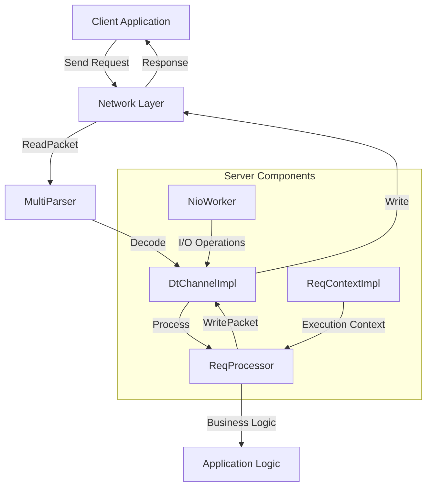
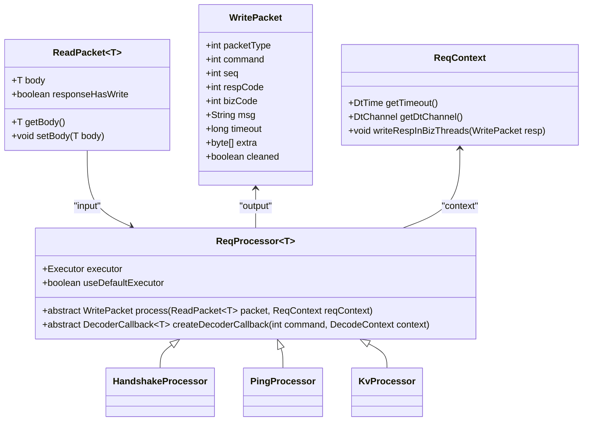
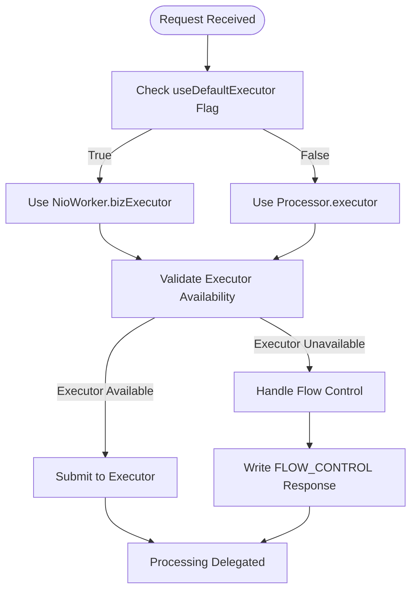
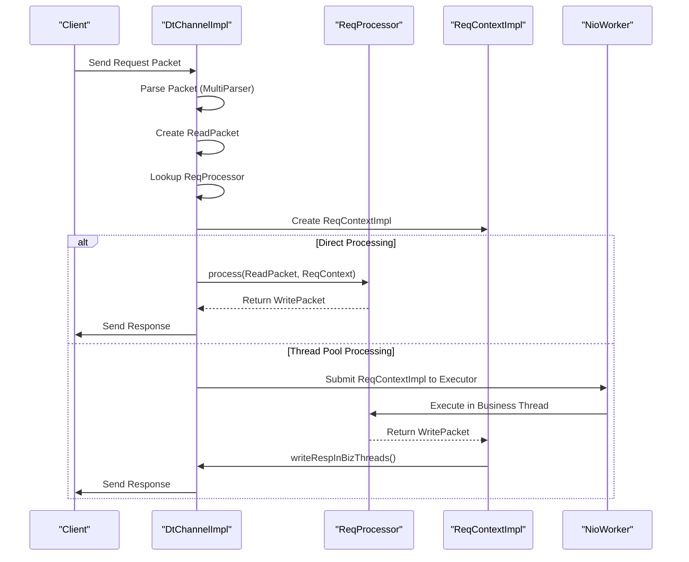
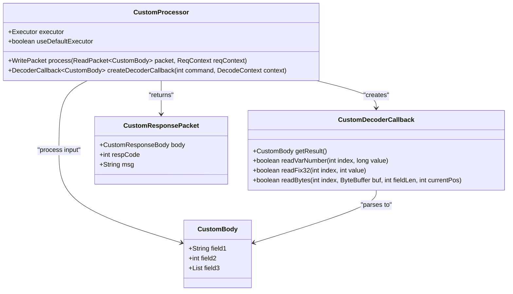
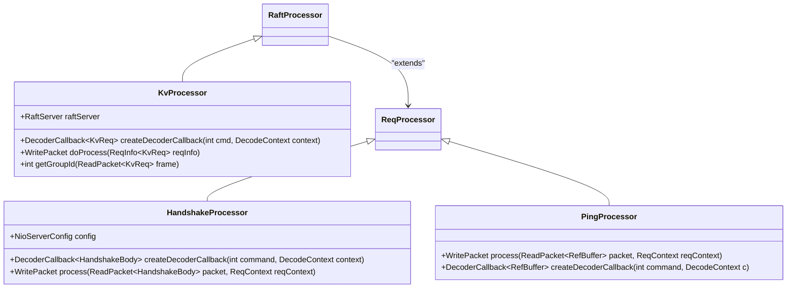
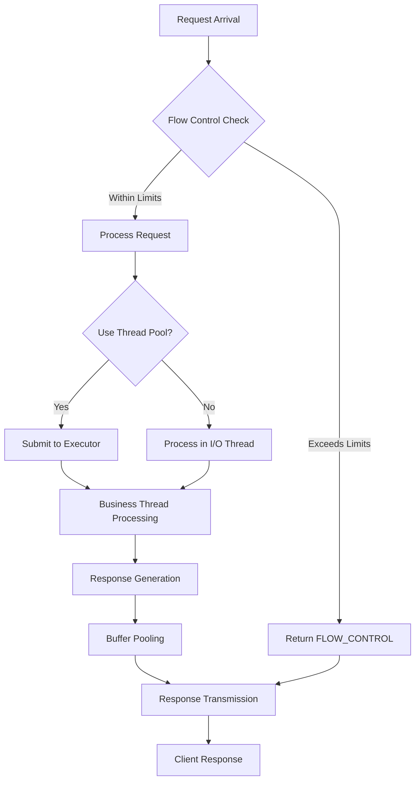

# Request Processor

<cite>
**Referenced Files in This Document**   
- [ReqProcessor.java](file://client/src/main/java/com/github/dtprj/dongting/net/ReqProcessor.java)
- [ReqContext.java](file://client/src/main/java/com/github/dtprj/dongting/net/ReqContext.java)
- [ReqContextImpl.java](file://client/src/main/java/com/github/dtprj/dongting/net/ReqContextImpl.java)
- [ReadPacket.java](file://client/src/main/java/com/github/dtprj/dongting/net/ReadPacket.java)
- [WritePacket.java](file://client/src/main/java/com/github/dtprj/dongting/net/WritePacket.java)
- [DtChannelImpl.java](file://client/src/main/java/com/github/dtprj/dongting/net/DtChannelImpl.java)
- [NioWorker.java](file://client/src/main/java/com/github/dtprj/dongting/net/NioWorker.java)
- [NioServer.java](file://client/src/main/java/com/github/dtprj/dongting/net/NioServer.java)
- [HandshakeProcessor.java](file://client/src/main/java/com/github/dtprj/dongting/net/HandshakeProcessor.java)
- [KvProcessor.java](file://server/src/main/java/com/github/dtprj/dongting/dtkv/server/KvProcessor.java)
</cite>

## Table of Contents
1. [Introduction](#introduction)
2. [Core Architecture](#core-architecture)
3. [ReqProcessor Base Class](#reqprocessor-base-class)
4. [Execution Context Management](#execution-context-management)
5. [Request Processing Lifecycle](#request-processing-lifecycle)
6. [Network I/O Integration](#network-io-integration)
7. [Custom Processor Implementation](#custom-processor-implementation)
8. [Error Handling Patterns](#error-handling-patterns)
9. [Concrete Implementation Examples](#concrete-implementation-examples)
10. [Performance Considerations](#performance-considerations)

## Introduction

The ReqProcessor abstraction serves as the foundation for handling incoming commands in the Dongting networking framework. As a base class, it provides a standardized interface for processing requests through the abstract `process` method that takes a ReadPacket and ReqContext to produce a WritePacket response. This documentation details the architecture, implementation patterns, and integration points of the ReqProcessor system, focusing on its role in the network communication stack.

The ReqProcessor enables extensibility by allowing custom processors to extend this class and implement specific command handling logic. It incorporates execution context management through the executor field and provides control over execution strategy via the useDefaultExecutor flag. The system integrates tightly with the network I/O subsystem, ensuring processed responses are properly routed back through the channel to the requesting client.

**Section sources**
- [ReqProcessor.java](file://client/src/main/java/com/github/dtprj/dongting/net/ReqProcessor.java#L26-L35)

## Core Architecture

The ReqProcessor operates within a comprehensive network processing architecture that handles incoming commands through a well-defined pipeline. The architecture consists of several key components that work together to process requests efficiently and reliably.



**Diagram sources**
- [ReqProcessor.java](file://client/src/main/java/com/github/dtprj/dongting/net/ReqProcessor.java#L26-L35)
- [DtChannelImpl.java](file://client/src/main/java/com/github/dtprj/dongting/net/DtChannelImpl.java#L41-L55)
- [NioWorker.java](file://client/src/main/java/com/github/dtprj/dongting/net/NioWorker.java#L55-L65)

## ReqProcessor Base Class

The ReqProcessor class serves as the abstract base for all request processors in the Dongting framework. It defines the fundamental contract for handling incoming commands through two abstract methods that must be implemented by concrete subclasses.

The primary method, `process`, takes a ReadPacket containing the incoming request data and a ReqContext providing execution context, returning a WritePacket as the response. This method is where the core business logic for handling specific command types is implemented. The second abstract method, `createDecoderCallback`, is responsible for creating appropriate DecoderCallback instances for parsing message bodies based on the command type and decode context.



**Diagram sources**
- [ReqProcessor.java](file://client/src/main/java/com/github/dtprj/dongting/net/ReqProcessor.java#L26-L35)
- [ReadPacket.java](file://client/src/main/java/com/github/dtprj/dongting/net/ReadPacket.java#L23-L44)
- [WritePacket.java](file://client/src/main/java/com/github/dtprj/dongting/net/WritePacket.java#L30-L181)
- [ReqContext.java](file://client/src/main/java/com/github/dtprj/dongting/net/ReqContext.java#L23-L31)

**Section sources**
- [ReqProcessor.java](file://client/src/main/java/com/github/dtprj/dongting/net/ReqProcessor.java#L26-L35)

## Execution Context Management

The ReqProcessor class provides sophisticated execution context management through its executor field and useDefaultExecutor flag. These components work together to control the execution strategy for request processing, allowing for flexible deployment patterns and performance optimization.

The executor field holds a reference to the Executor instance that will be used to process requests when useDefaultExecutor is set to false. This allows custom processors to specify their own execution context, such as a dedicated thread pool for specific types of operations. When useDefaultExecutor is true, the processor uses the default business executor from the NioWorker, enabling centralized control over execution resources.



**Diagram sources**
- [ReqProcessor.java](file://client/src/main/java/com/github/dtprj/dongting/net/ReqProcessor.java#L28-L29)
- [DtChannelImpl.java](file://client/src/main/java/com/github/dtprj/dongting/net/DtChannelImpl.java#L321-L326)

**Section sources**
- [ReqProcessor.java](file://client/src/main/java/com/github/dtprj/dongting/net/ReqProcessor.java#L28-L29)
- [DtChannelImpl.java](file://client/src/main/java/com/github/dtprj/dongting/net/DtChannelImpl.java#L321-L357)

## Request Processing Lifecycle

The request processing lifecycle in the Dongting framework follows a well-defined sequence of operations from the moment a packet is received until the response is sent back to the client. This lifecycle ensures consistent handling of requests while providing hooks for custom processing logic.

When a request is received, the network I/O system parses the incoming data into a ReadPacket and determines the appropriate ReqProcessor based on the command type. The system then creates a ReqContextImpl that encapsulates the execution context, including timeout information and channel references. The processor's `process` method is invoked, either directly in the I/O thread or submitted to an executor based on the execution strategy.



**Diagram sources**
- [DtChannelImpl.java](file://client/src/main/java/com/github/dtprj/dongting/net/DtChannelImpl.java#L317-L396)
- [ReqContextImpl.java](file://client/src/main/java/com/github/dtprj/dongting/net/ReqContextImpl.java#L83-L114)

**Section sources**
- [DtChannelImpl.java](file://client/src/main/java/com/github/dtprj/dongting/net/DtChannelImpl.java#L317-L396)
- [ReqContextImpl.java](file://client/src/main/java/com/github/dtprj/dongting/net/ReqContextImpl.java#L25-L116)

## Network I/O Integration

The ReqProcessor integrates seamlessly with the Dongting network I/O system, ensuring that processed responses are properly routed back through the channel to the requesting client. This integration is facilitated by the ReqContext interface, which provides the `writeRespInBizThreads` method for sending responses from business threads.

The integration handles the complexities of thread management, ensuring that responses generated in business threads are properly queued for I/O operations in the appropriate worker thread. When a response is ready, the `writeRespInBizThreads` method sets up the response packet with the correct sequence number, command, and packet type before enqueuing it for transmission.

```mermaid
flowchart TD
A[Processor.process()] --> B[Create WritePacket]
B --> C[Set Response Properties]
C --> D[Call writeRespInBizThreads()]
D --> E{Current Thread == Worker Thread?}
E --> |Yes| F[Enqueue in subQueue]
E --> |No| G{Channel Closed?}
G --> |Yes| H[Clean Response]
G --> |No| I{Response Already Written?}
I --> |Yes| J[Throw IllegalStateException]
I --> |No| K[Mark Response Written]
K --> L[Enqueue in ioWorkerQueue]
L --> M[Wake Up Worker Thread]
F --> N[Worker Thread Processes Queue]
M --> N
N --> O[Write Response to Channel]
O --> P[Client Receives Response]
```

**Diagram sources**
- [ReqContextImpl.java](file://client/src/main/java/com/github/dtprj/dongting/net/ReqContextImpl.java#L54-L79)
- [DtChannelImpl.java](file://client/src/main/java/com/github/dtprj/dongting/net/DtChannelImpl.java#L71-L78)

**Section sources**
- [ReqContextImpl.java](file://client/src/main/java/com/github/dtprj/dongting/net/ReqContextImpl.java#L54-L80)
- [DtChannelImpl.java](file://client/src/main/java/com/github/dtprj/dongting/net/DtChannelImpl.java#L71-L78)

## Custom Processor Implementation

Custom processors extend the ReqProcessor class to implement specific command handling logic for different types of operations. The implementation requires overriding both the abstract `process` and `createDecoderCallback` methods to provide command-specific behavior.

When implementing a custom processor, developers must consider the type parameter T that represents the expected body type in the ReadPacket. The `createDecoderCallback` method should return an appropriate DecoderCallback implementation that can parse the incoming message body according to the command's requirements. The `process` method contains the business logic for handling the request and generating a response.



**Diagram sources**
- [ReqProcessor.java](file://client/src/main/java/com/github/dtprj/dongting/net/ReqProcessor.java#L26-L35)
- [HandshakeProcessor.java](file://client/src/main/java/com/github/dtprj/dongting/net/HandshakeProcessor.java#L29-L87)

**Section sources**
- [ReqProcessor.java](file://client/src/main/java/com/github/dtprj/dongting/net/ReqProcessor.java#L26-L35)
- [HandshakeProcessor.java](file://client/src/main/java/com/github/dtprj/dongting/net/HandshakeProcessor.java#L29-L87)

## Error Handling Patterns

The ReqProcessor framework incorporates comprehensive error handling patterns to ensure robust operation in the face of various failure scenarios. These patterns are implemented through a combination of exception handling in the ReqContextImpl and standardized error response generation.

When exceptions occur during request processing, the framework distinguishes between NetCodeException (which contains specific error codes) and general Throwable types. For NetCodeException instances, the system generates error responses with the appropriate code and message. For other exceptions, a generic system error response is created with a SYS_ERROR code.

```mermaid
flowchart TD
A[Processor.process() Execution] --> B{Exception Thrown?}
B --> |No| C[Return Response]
B --> |Yes| D{Exception Type}
D --> |NetCodeException| E[Create Error Response with Code]
D --> |Other Throwable| F[Create SYS_ERROR Response]
E --> G[Set Response Message]
F --> G
G --> H[Call writeRespInBizThreads()]
H --> I[Send Error Response]
C --> I
I --> J[Client Receives Response]
```

**Diagram sources**
- [ReqContextImpl.java](file://client/src/main/java/com/github/dtprj/dongting/net/ReqContextImpl.java#L95-L107)
- [WritePacket.java](file://client/src/main/java/com/github/dtprj/dongting/net/WritePacket.java#L30-L181)

**Section sources**
- [ReqContextImpl.java](file://client/src/main/java/com/github/dtprj/dongting/net/ReqContextImpl.java#L95-L107)

## Concrete Implementation Examples

The Dongting framework includes several concrete implementations of the ReqProcessor that demonstrate different patterns and use cases. These implementations provide practical examples of how to extend the base class for specific command handling requirements.

The HandshakeProcessor handles the initial connection handshake, validating client information and establishing session parameters. The PingProcessor provides a simple echo service for testing connectivity. The KvProcessor, used in the distributed key-value store component, handles various data manipulation commands with complex business logic.



**Diagram sources**
- [HandshakeProcessor.java](file://client/src/main/java/com/github/dtprj/dongting/net/HandshakeProcessor.java#L29-L87)
- [NioServer.java](file://client/src/main/java/com/github/dtprj/dongting/net/NioServer.java#L273-L291)
- [KvProcessor.java](file://server/src/main/java/com/github/dtprj/dongting/dtkv/server/KvProcessor.java#L51-L278)

**Section sources**
- [HandshakeProcessor.java](file://client/src/main/java/com/github/dtprj/dongting/net/HandshakeProcessor.java#L29-L87)
- [NioServer.java](file://client/src/main/java/com/github/dtprj/dongting/net/NioServer.java#L273-L291)
- [KvProcessor.java](file://server/src/main/java/com/github/dtprj/dongting/dtkv/server/KvProcessor.java#L51-L278)

## Performance Considerations

The ReqProcessor design incorporates several performance optimizations to ensure efficient handling of high-volume request traffic. These considerations include thread pool management, object pooling, and flow control mechanisms that prevent system overload.

The use of the useDefaultExecutor flag allows for strategic distribution of processing load across different thread pools, preventing blocking operations from affecting the responsiveness of critical paths. The integration with the object pooling system minimizes garbage collection overhead by reusing buffer objects.



**Diagram sources**
- [DtChannelImpl.java](file://client/src/main/java/com/github/dtprj/dongting/net/DtChannelImpl.java#L328-L353)
- [NioWorker.java](file://client/src/main/java/com/github/dtprj/dongting/net/NioWorker.java#L118-L125)

**Section sources**
- [DtChannelImpl.java](file://client/src/main/java/com/github/dtprj/dongting/net/DtChannelImpl.java#L328-L353)
- [NioWorker.java](file://client/src/main/java/com/github/dtprj/dongting/net/NioWorker.java#L118-L125)