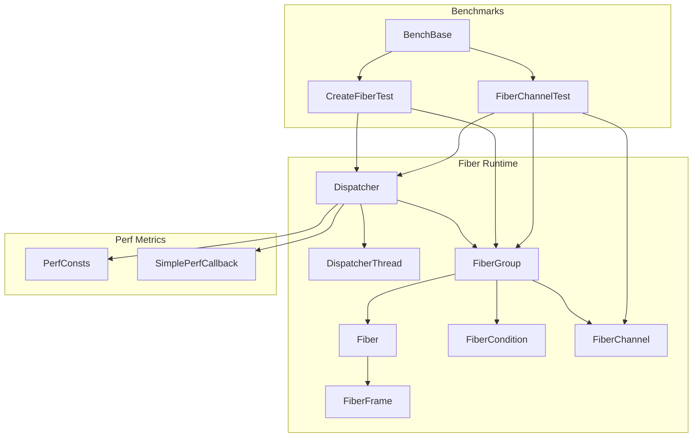
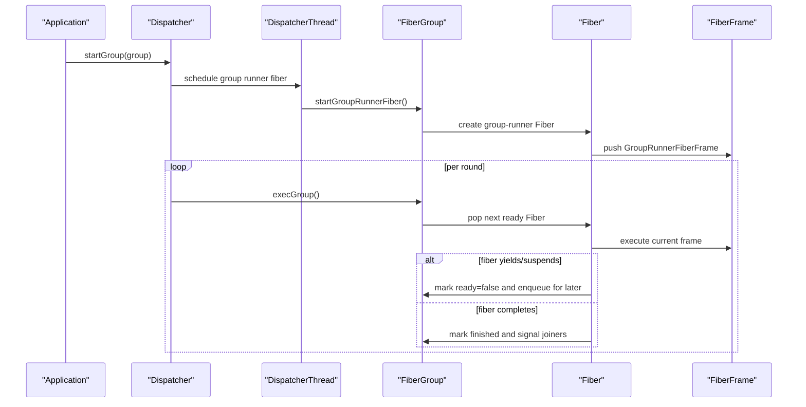
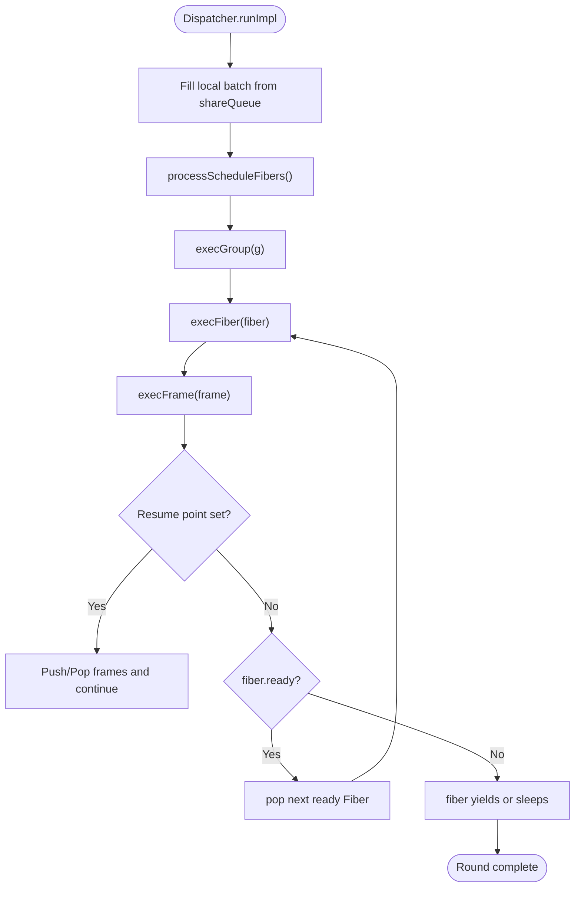
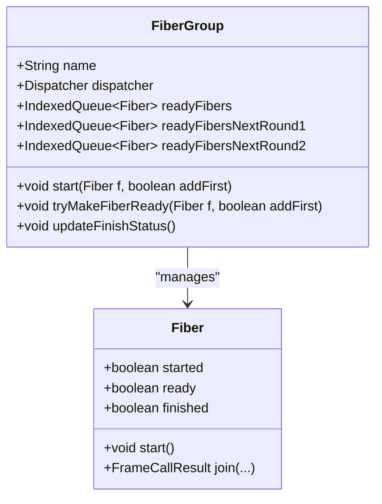
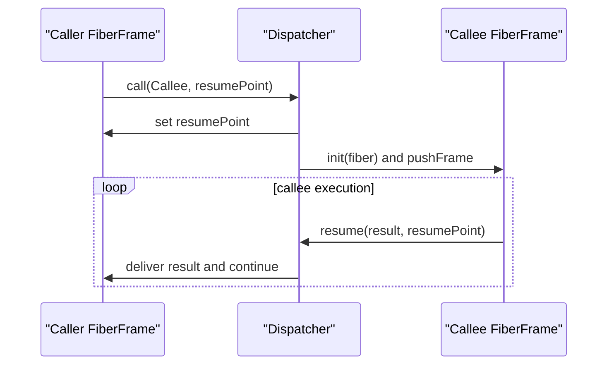
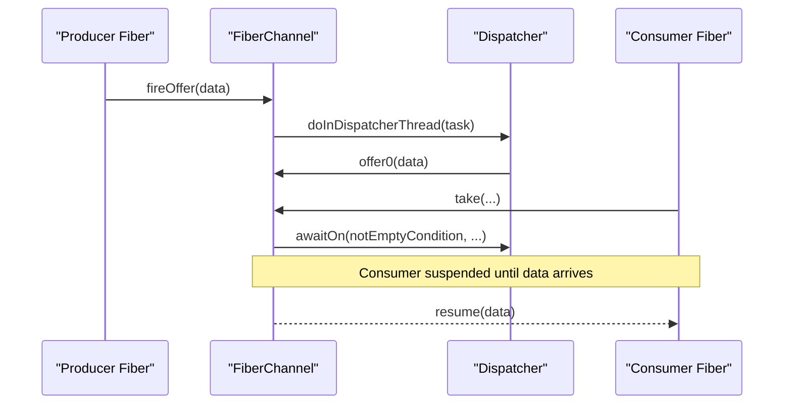
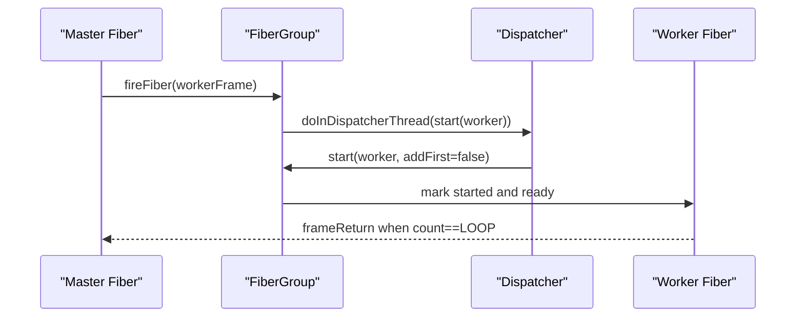
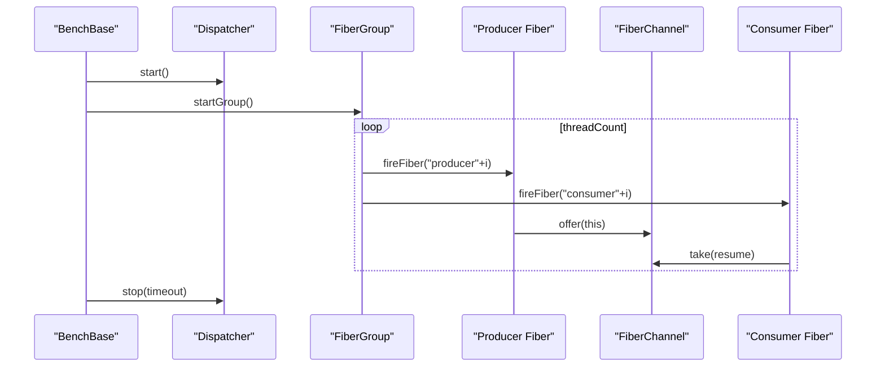
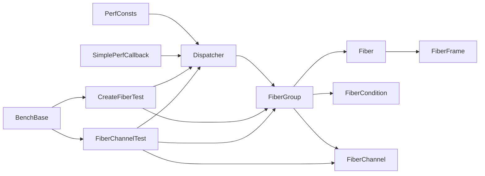

# Concurrency and Fiber Performance

<cite>
**Referenced Files in This Document**
- [README.md](file://README.md)
- [Dispatcher.java](file://server/src/main/java/com/github/dtprj/dongting/fiber/Dispatcher.java)
- [DispatcherThread.java](file://server/src/main/java/com/github/dtprj/dongting/fiber/DispatcherThread.java)
- [Fiber.java](file://server/src/main/java/com/github/dtprj/dongting/fiber/Fiber.java)
- [FiberFrame.java](file://server/src/main/java/com/github/dtprj/dongting/fiber/FiberFrame.java)
- [FiberGroup.java](file://server/src/main/java/com/github/dtprj/dongting/fiber/FiberGroup.java)
- [FiberCondition.java](file://server/src/main/java/com/github/dtprj/dongting/fiber/FiberCondition.java)
- [FiberChannel.java](file://server/src/main/java/com/github/dtprj/dongting/fiber/FiberChannel.java)
- [CreateFiberTest.java](file://benchmark/src/main/java/com/github/dtprj/dongting/bench/fiber/CreateFiberTest.java)
- [FiberChannelTest.java](file://benchmark/src/main/java/com/github/dtprj/dongting/bench/fiber/FiberChannelTest.java)
- [BenchBase.java](file://benchmark/src/main/java/com/github/dtprj/dongting/bench/common/BenchBase.java)
- [PerfConsts.java](file://client/src/main/java/com/github/dtprj/dongting/common/PerfConsts.java)
- [SimplePerfCallback.java](file://benchmark/src/main/java/com/github/dtprj/dongting/bench/common/SimplePerfCallback.java)
</cite>

## Table of Contents
1. [Introduction](#introduction)
2. [Project Structure](#project-structure)
3. [Core Components](#core-components)
4. [Architecture Overview](#architecture-overview)
5. [Detailed Component Analysis](#detailed-component-analysis)
6. [Dependency Analysis](#dependency-analysis)
7. [Performance Considerations](#performance-considerations)
8. [Troubleshooting Guide](#troubleshooting-guide)
9. [Conclusion](#conclusion)
10. [Appendices](#appendices)

## Introduction
This document focuses on Dongting’s fiber-based concurrency model and its performance characteristics. It explains how the Fiber framework enables high-concurrency workloads with minimal overhead compared to traditional thread-per-request models. It covers the Dispatcher and Fiber scheduling mechanisms, including cooperative multitasking and work-stealing-like scheduling via ready queues. It documents fiber creation and context-switch costs, inter-fiber communication via FiberChannel, and presents benchmark results from CreateFiberTest and FiberChannelTest. Guidance is provided on structuring applications to maximize fiber efficiency, avoiding blocking operations, tuning fiber pool sizes, and understanding the impact of fiber granularity on CPU cache locality and throughput.

## Project Structure
The fiber subsystem resides primarily under server/src/main/java/com/github/dtprj/dongting/fiber. Benchmarks are under benchmark/src/main/java/com/github/dtprj/dongting/bench/fiber. The benchmarks leverage shared benchmark infrastructure under benchmark/src/main/java/com/github/dtprj/dongting/bench/common.

**Diagram sources**
- [Dispatcher.java](file://server/src/main/java/com/github/dtprj/dongting/fiber/Dispatcher.java#L1-L120)
- [DispatcherThread.java](file://server/src/main/java/com/github/dtprj/dongting/fiber/DispatcherThread.java#L1-L50)
- [FiberGroup.java](file://server/src/main/java/com/github/dtprj/dongting/fiber/FiberGroup.java#L1-L120)
- [Fiber.java](file://server/src/main/java/com/github/dtprj/dongting/fiber/Fiber.java#L1-L120)
- [FiberFrame.java](file://server/src/main/java/com/github/dtprj/dongting/fiber/FiberFrame.java#L1-L115)
- [FiberCondition.java](file://server/src/main/java/com/github/dtprj/dongting/fiber/FiberCondition.java#L1-L99)
- [FiberChannel.java](file://server/src/main/java/com/github/dtprj/dongting/fiber/FiberChannel.java#L1-L120)
- [BenchBase.java](file://benchmark/src/main/java/com/github/dtprj/dongting/bench/common/BenchBase.java#L1-L153)
- [CreateFiberTest.java](file://benchmark/src/main/java/com/github/dtprj/dongting/bench/fiber/CreateFiberTest.java#L1-L112)
- [FiberChannelTest.java](file://benchmark/src/main/java/com/github/dtprj/dongting/bench/fiber/FiberChannelTest.java#L1-L100)
- [PerfConsts.java](file://client/src/main/java/com/github/dtprj/dongting/common/PerfConsts.java#L1-L53)
- [SimplePerfCallback.java](file://benchmark/src/main/java/com/github/dtprj/dongting/bench/common/SimplePerfCallback.java#L37-L115)

**Section sources**
- [README.md](file://README.md#L1-L141)
- [Dispatcher.java](file://server/src/main/java/com/github/dtprj/dongting/fiber/Dispatcher.java#L1-L120)
- [FiberGroup.java](file://server/src/main/java/com/github/dtprj/dongting/fiber/FiberGroup.java#L1-L120)
- [FiberChannel.java](file://server/src/main/java/com/github/dtprj/dongting/fiber/FiberChannel.java#L1-L120)
- [BenchBase.java](file://benchmark/src/main/java/com/github/dtprj/dongting/bench/common/BenchBase.java#L1-L153)

## Core Components
- Dispatcher: Single-threaded scheduler that drives fiber execution, manages ready queues, schedules fibers by deadline, and coordinates group lifecycle.
- FiberGroup: Logical grouping of fibers sharing a dispatcher and synchronization primitives (conditions, futures, channels).
- Fiber: Lightweight unit of execution with a stack of FiberFrame frames, cooperative yields/sleeps, and join semantics.
- FiberFrame: Stack frame abstraction enabling cooperative calls/resumes and exception propagation/cleanup.
- FiberCondition: Wait/notify primitive for fibers within a group.
- FiberChannel: Unbounded, consumer-blocking channel for inter-fiber communication with producer-side fireOffer and consumer-side take/takeAll.

Key performance enablers:
- Cooperative multitasking: fibers voluntarily yield or suspend, eliminating kernel-level thread switching overhead.
- Work-stealing-like scheduling: ready queues are prioritized across rounds; fibers scheduled for later execution are queued by deadline.
- Minimal allocation and fast-path scheduling: ready queues and condition signaling are optimized for throughput.

**Section sources**
- [Dispatcher.java](file://server/src/main/java/com/github/dtprj/dongting/fiber/Dispatcher.java#L120-L220)
- [FiberGroup.java](file://server/src/main/java/com/github/dtprj/dongting/fiber/FiberGroup.java#L120-L220)
- [Fiber.java](file://server/src/main/java/com/github/dtprj/dongting/fiber/Fiber.java#L1-L120)
- [FiberFrame.java](file://server/src/main/java/com/github/dtprj/dongting/fiber/FiberFrame.java#L1-L115)
- [FiberCondition.java](file://server/src/main/java/com/github/dtprj/dongting/fiber/FiberCondition.java#L1-L99)
- [FiberChannel.java](file://server/src/main/java/com/github/dtprj/dongting/fiber/FiberChannel.java#L1-L120)

## Architecture Overview
The runtime executes fibers on a single DispatcherThread. Fibers are organized into FiberGroup instances. The Dispatcher maintains:
- A shared queue for cross-thread tasks.
- A ready queue per group, split into immediate and deferred queues for fairness and round-based scheduling.
- A priority queue of fibers scheduled to wake up at specific deadlines.

**Diagram sources**
- [Dispatcher.java](file://server/src/main/java/com/github/dtprj/dongting/fiber/Dispatcher.java#L246-L329)
- [FiberGroup.java](file://server/src/main/java/com/github/dtprj/dongting/fiber/FiberGroup.java#L138-L204)
- [Fiber.java](file://server/src/main/java/com/github/dtprj/dongting/fiber/Fiber.java#L121-L200)

## Detailed Component Analysis

### Dispatcher and Scheduling
- Ready queues: Two per round (nextRound1 and nextRound2) plus an immediate ready queue, enabling fair rotation and minimizing starvation.
- Schedule queue: Priority queue ordered by wakeup time; the dispatcher periodically wakes fibers whose deadlines have passed.
- Polling and batching: The dispatcher drains shared tasks and polls with a bounded timeout to reduce overhead.
- Interrupt handling: Suspended fibers can be interrupted; their waiters are cleaned and resumed with an exception.

**Diagram sources**
- [Dispatcher.java](file://server/src/main/java/com/github/dtprj/dongting/fiber/Dispatcher.java#L176-L211)
- [Dispatcher.java](file://server/src/main/java/com/github/dtprj/dongting/fiber/Dispatcher.java#L213-L236)
- [Dispatcher.java](file://server/src/main/java/com/github/dtprj/dongting/fiber/Dispatcher.java#L246-L329)

**Section sources**
- [Dispatcher.java](file://server/src/main/java/com/github/dtprj/dongting/fiber/Dispatcher.java#L176-L329)
- [DispatcherThread.java](file://server/src/main/java/com/github/dtprj/dongting/fiber/DispatcherThread.java#L1-L50)

### FiberGroup and Work-Stealing-like Scheduling
- Group-level ready queues: Immediate and deferred queues rotate across rounds to balance fairness.
- tryMakeFiberReady: Marks a fiber ready and enqueues it based on round counters and addFirst semantics.
- updateFinishStatus: Determines when a group becomes finished by checking normal fibers, daemon fibers, and system channel.

**Diagram sources**
- [FiberGroup.java](file://server/src/main/java/com/github/dtprj/dongting/fiber/FiberGroup.java#L144-L204)
- [Fiber.java](file://server/src/main/java/com/github/dtprj/dongting/fiber/Fiber.java#L212-L236)

**Section sources**
- [FiberGroup.java](file://server/src/main/java/com/github/dtprj/dongting/fiber/FiberGroup.java#L144-L204)
- [FiberGroup.java](file://server/src/main/java/com/github/dtprj/dongting/fiber/FiberGroup.java#L214-L237)

### Fiber and Cooperative Multitasking
- FiberFrame stack: Cooperative calls and resumptions are implemented via a stack of frames with resume points.
- call/resume/sleep/yield: Public APIs delegate to Dispatcher to manage suspension and resumption.
- Exception handling: Frames support catch/finally and propagate exceptions through virtual stacks.

**Diagram sources**
- [Fiber.java](file://server/src/main/java/com/github/dtprj/dongting/fiber/Fiber.java#L71-L119)
- [Dispatcher.java](file://server/src/main/java/com/github/dtprj/dongting/fiber/Dispatcher.java#L404-L421)

**Section sources**
- [Fiber.java](file://server/src/main/java/com/github/dtprj/dongting/fiber/Fiber.java#L71-L119)
- [FiberFrame.java](file://server/src/main/java/com/github/dtprj/dongting/fiber/FiberFrame.java#L1-L115)
- [Dispatcher.java](file://server/src/main/java/com/github/dtprj/dongting/fiber/Dispatcher.java#L404-L421)

### Inter-Fiber Communication via FiberChannel
- Unbounded queue with producer fireOffer and consumer take/takeAll.
- Consumers block until data arrives or group shutdown occurs.
- Conditions: notEmptyCondition signals producers/consumers; awaitOn supports multiple conditions and group shutdown.

**Diagram sources**
- [FiberChannel.java](file://server/src/main/java/com/github/dtprj/dongting/fiber/FiberChannel.java#L52-L133)
- [FiberChannel.java](file://server/src/main/java/com/github/dtprj/dongting/fiber/FiberChannel.java#L139-L191)
- [FiberCondition.java](file://server/src/main/java/com/github/dtprj/dongting/fiber/FiberCondition.java#L63-L98)

**Section sources**
- [FiberChannel.java](file://server/src/main/java/com/github/dtprj/dongting/fiber/FiberChannel.java#L52-L133)
- [FiberChannel.java](file://server/src/main/java/com/github/dtprj/dongting/fiber/FiberChannel.java#L139-L191)
- [FiberCondition.java](file://server/src/main/java/com/github/dtprj/dongting/fiber/FiberCondition.java#L63-L98)

### Benchmark: CreateFiberTest
- Purpose: Measure fiber creation throughput by firing a large number of fibers from a master fiber or directly via group.fireFiber.
- Observables: Total time to create and start N fibers; throughput in creations per second.
- Notes: The benchmark uses a single Dispatcher and a single FiberGroup; timing is printed upon reaching the target count.

**Diagram sources**
- [CreateFiberTest.java](file://benchmark/src/main/java/com/github/dtprj/dongting/bench/fiber/CreateFiberTest.java#L50-L82)
- [FiberGroup.java](file://server/src/main/java/com/github/dtprj/dongting/fiber/FiberGroup.java#L72-L111)
- [Dispatcher.java](file://server/src/main/java/com/github/dtprj/dongting/fiber/Dispatcher.java#L115-L129)

**Section sources**
- [CreateFiberTest.java](file://benchmark/src/main/java/com/github/dtprj/dongting/bench/fiber/CreateFiberTest.java#L1-L112)
- [FiberGroup.java](file://server/src/main/java/com/github/dtprj/dongting/fiber/FiberGroup.java#L72-L111)
- [Dispatcher.java](file://server/src/main/java/com/github/dtprj/dongting/fiber/Dispatcher.java#L115-L129)

### Benchmark: FiberChannelTest
- Purpose: Measure producer-consumer throughput and latency across multiple producer/consumer pairs.
- Observables: Success counts, operations per second, and optionally latency metrics (max and average) when enabled.
- Mechanism: Each producer fires a fiber to offer items; each consumer fires a fiber to take items and resume the benchmark loop.

**Diagram sources**
- [FiberChannelTest.java](file://benchmark/src/main/java/com/github/dtprj/dongting/bench/fiber/FiberChannelTest.java#L38-L84)
- [BenchBase.java](file://benchmark/src/main/java/com/github/dtprj/dongting/bench/common/BenchBase.java#L65-L108)
- [FiberChannel.java](file://server/src/main/java/com/github/dtprj/dongting/fiber/FiberChannel.java#L92-L133)

**Section sources**
- [FiberChannelTest.java](file://benchmark/src/main/java/com/github/dtprj/dongting/bench/fiber/FiberChannelTest.java#L1-L100)
- [BenchBase.java](file://benchmark/src/main/java/com/github/dtprj/dongting/bench/common/BenchBase.java#L65-L108)
- [FiberChannel.java](file://server/src/main/java/com/github/dtprj/dongting/fiber/FiberChannel.java#L92-L133)

## Dependency Analysis
- Dispatcher depends on:
  - FiberGroup for ready queues and group lifecycle.
  - FiberCondition for wait/notify semantics.
  - FiberChannel for system channel tasks.
  - Perf metrics via PerfConsts and SimplePerfCallback.
- FiberGroup depends on:
  - IndexedQueue for ready queues.
  - FiberCondition for group-wide signaling.
  - GroupRunnerFiberFrame to drain system channel tasks.
- Benchmarks depend on:
  - BenchBase for timing and statistics.
  - PerfConsts and SimplePerfCallback for fiber-related metrics.

**Diagram sources**
- [PerfConsts.java](file://client/src/main/java/com/github/dtprj/dongting/common/PerfConsts.java#L1-L53)
- [SimplePerfCallback.java](file://benchmark/src/main/java/com/github/dtprj/dongting/bench/common/SimplePerfCallback.java#L37-L115)
- [Dispatcher.java](file://server/src/main/java/com/github/dtprj/dongting/fiber/Dispatcher.java#L1-L120)
- [FiberGroup.java](file://server/src/main/java/com/github/dtprj/dongting/fiber/FiberGroup.java#L1-L120)
- [Fiber.java](file://server/src/main/java/com/github/dtprj/dongting/fiber/Fiber.java#L1-L120)
- [FiberFrame.java](file://server/src/main/java/com/github/dtprj/dongting/fiber/FiberFrame.java#L1-L115)
- [FiberCondition.java](file://server/src/main/java/com/github/dtprj/dongting/fiber/FiberCondition.java#L1-L99)
- [FiberChannel.java](file://server/src/main/java/com/github/dtprj/dongting/fiber/FiberChannel.java#L1-L120)
- [BenchBase.java](file://benchmark/src/main/java/com/github/dtprj/dongting/bench/common/BenchBase.java#L1-L153)
- [CreateFiberTest.java](file://benchmark/src/main/java/com/github/dtprj/dongting/bench/fiber/CreateFiberTest.java#L1-L112)
- [FiberChannelTest.java](file://benchmark/src/main/java/com/github/dtprj/dongting/bench/fiber/FiberChannelTest.java#L1-L100)

**Section sources**
- [PerfConsts.java](file://client/src/main/java/com/github/dtprj/dongting/common/PerfConsts.java#L1-L53)
- [SimplePerfCallback.java](file://benchmark/src/main/java/com/github/dtprj/dongting/bench/common/SimplePerfCallback.java#L37-L115)
- [Dispatcher.java](file://server/src/main/java/com/github/dtprj/dongting/fiber/Dispatcher.java#L1-L120)
- [FiberGroup.java](file://server/src/main/java/com/github/dtprj/dongting/fiber/FiberGroup.java#L1-L120)
- [FiberChannel.java](file://server/src/main/java/com/github/dtprj/dongting/fiber/FiberChannel.java#L1-L120)
- [BenchBase.java](file://benchmark/src/main/java/com/github/dtprj/dongting/bench/common/BenchBase.java#L1-L153)

## Performance Considerations
- Fiber creation cost:
  - Minimal overhead: creation and initial scheduling are lightweight; the benchmark measures total time to start N fibers.
  - Allocation minimization: reuse frames and avoid unnecessary allocations inside hot loops.
- Context switching cost:
  - Cooperative yields/sleeps avoid kernel switches; switching is O(1) with stack manipulation and queue updates.
  - Scheduling overhead is bounded by ready queue rotations and priority queue maintenance.
- Inter-fiber communication:
  - FiberChannel offers O(1) producer enqueue and consumer dequeue; condition-based waits are efficient.
  - Unbounded queue prevents producer backpressure; tune producer rates to avoid memory pressure.
- Throughput and latency:
  - BenchBase records success counts and optionally latency stats (max and average); enable logging for RT when needed.
  - FiberChannelTest demonstrates producer-consumer throughput; adjust threadCount and workload to measure scaling.
- Tuning fiber pool sizes:
  - Use a single DispatcherThread per core for balanced load; increase FiberGroup concurrency by adding more groups rather than more threads.
  - Prefer many small fibers over fewer large ones to improve cache locality and reduce contention.
- Avoiding blocking:
  - Replace blocking I/O with asynchronous operations; use FiberChannel for coordination.
  - Use sleep/yield appropriately to cooperatively yield the processor when waiting.

[No sources needed since this section provides general guidance]

## Troubleshooting Guide
- Fatal errors:
  - Dispatcher sets a fatal error and shuts down the group when encountering usage violations (e.g., re-entering a frame or invoking sleep/call/awaitOn incorrectly).
- Interrupted fibers:
  - Interrupting a sleeping or waiting fiber removes it from waiters and resumes with an interruption exception.
- Stuck groups:
  - Use group runner fiber to drain system channel tasks; ensure group shutdown is requested and normal fibers finish.
- Performance monitoring:
  - Enable PerfConsts fiber metrics and SimplePerfCallback to observe dispatcher polling and work time.

**Section sources**
- [Dispatcher.java](file://server/src/main/java/com/github/dtprj/dongting/fiber/Dispatcher.java#L331-L403)
- [Dispatcher.java](file://server/src/main/java/com/github/dtprj/dongting/fiber/Dispatcher.java#L551-L586)
- [FiberGroup.java](file://server/src/main/java/com/github/dtprj/dongting/fiber/FiberGroup.java#L94-L111)
- [PerfConsts.java](file://client/src/main/java/com/github/dtprj/dongting/common/PerfConsts.java#L26-L40)
- [SimplePerfCallback.java](file://benchmark/src/main/java/com/github/dtprj/dongting/bench/common/SimplePerfCallback.java#L37-L115)

## Conclusion
Dongting’s fiber runtime achieves high concurrency with minimal overhead by leveraging cooperative multitasking, efficient scheduling queues, and condition-based synchronization. The Dispatcher orchestrates fiber execution on a single thread, while FiberGroup organizes fibers and synchronizers. Benchmarks demonstrate strong throughput for fiber creation and producer-consumer patterns. Proper application design—avoiding blocking, tuning fiber granularity, and using FiberChannel—maximizes throughput and reduces latency.

[No sources needed since this section summarizes without analyzing specific files]

## Appendices

### Benchmark Results and Metrics
- CreateFiberTest:
  - Measures total time to create and start N fibers; prints elapsed time upon reaching the target count.
  - Typical observations: throughput scales with CPU cores; overhead decreases with fiber reuse and reduced allocations.
- FiberChannelTest:
  - Measures success counts and operations per second; optionally logs max and average latency when enabled.
  - Typical observations: producer-consumer throughput increases with threadCount until contention or memory pressure; latency remains low with cooperative yields.

[No sources needed since this section provides general guidance]