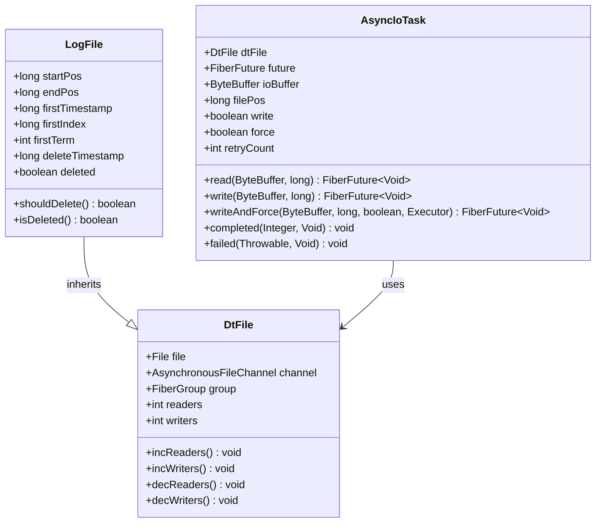
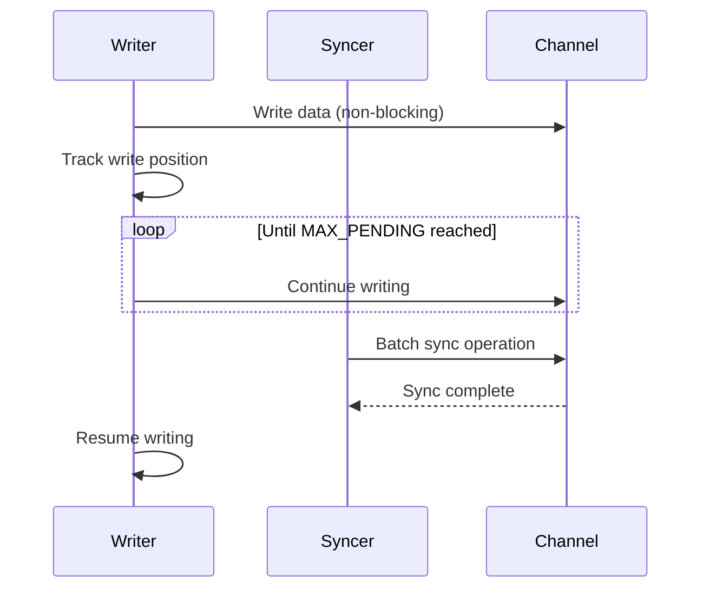
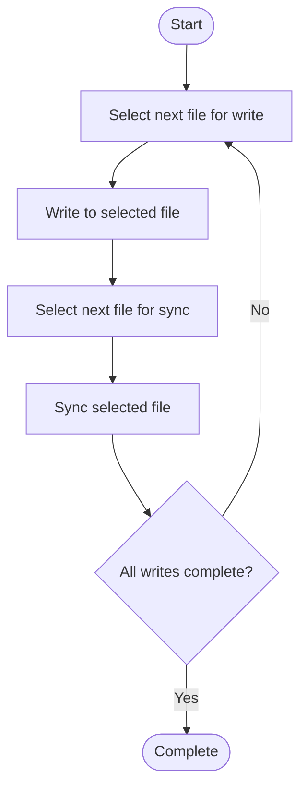
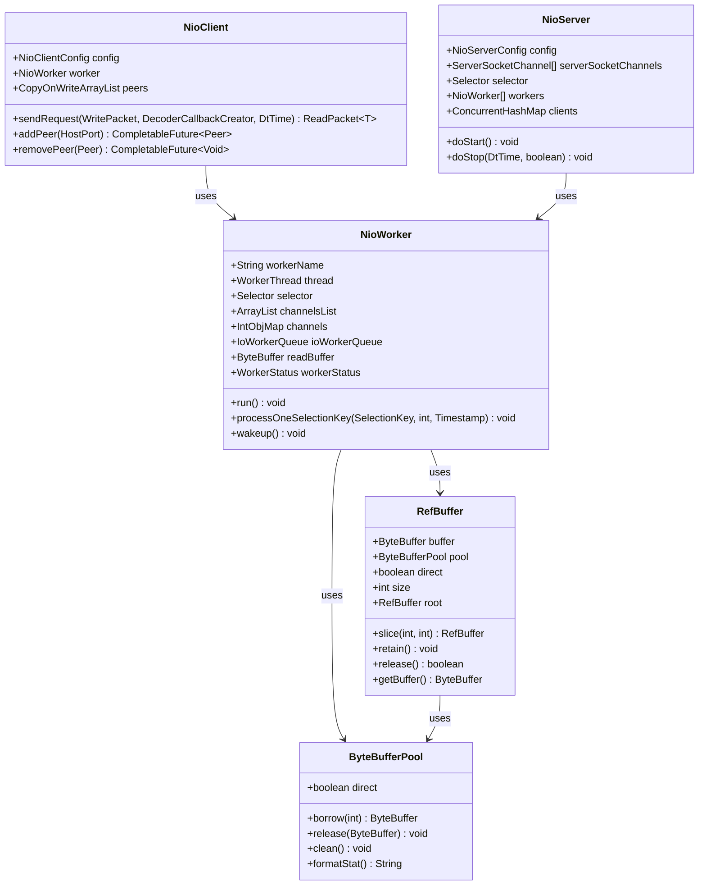
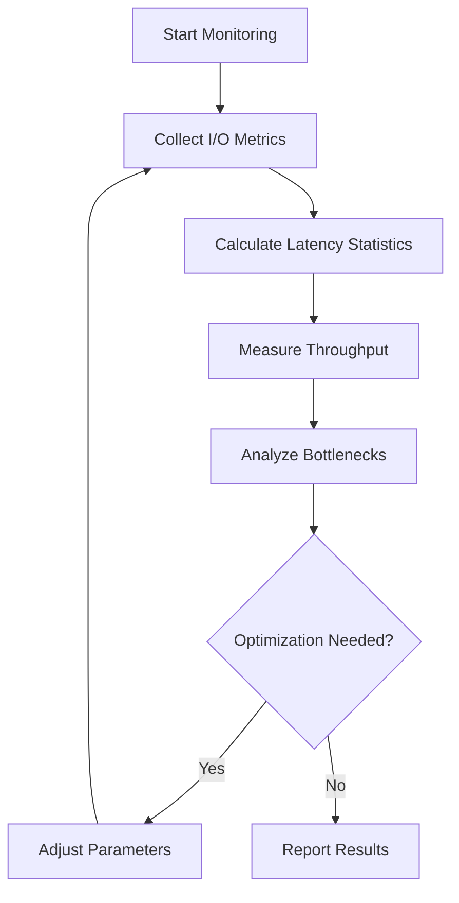

# I/O Performance Optimization

<cite>
**Referenced Files in This Document**   
- [IoMode1.java](file://benchmark/src/main/java/com/github/dtprj/dongting/bench/io/IoMode1.java)
- [IoMode2.java](file://benchmark/src/main/java/com/github/dtprj/dongting/bench/io/IoMode2.java)
- [IoMode3.java](file://benchmark/src/main/java/com/github/dtprj/dongting/bench/io/IoMode3.java)
- [IoMode4.java](file://benchmark/src/main/java/com/github/dtprj/dongting/bench/io/IoMode4.java)
- [IoModeBase.java](file://benchmark/src/main/java/com/github/dtprj/dongting/bench/io/IoModeBase.java)
- [WriteTask.java](file://benchmark/src/main/java/com/github/dtprj/dongting/bench/io/WriteTask.java)
- [SyncTest.java](file://benchmark/src/main/java/com/github/dtprj/dongting/bench/io/SyncTest.java)
- [IoTest.java](file://benchmark/src/main/java/com/github/dtprj/dongting/bench/io/IoTest.java)
- [NioClient.java](file://client/src/main/java/com/github/dtprj/dongting/net/NioClient.java)
- [NioServer.java](file://client/src/main/java/com/github/dtprj/dongting/net/NioServer.java)
- [NioWorker.java](file://client/src/main/java/com/github/dtprj/dongting/net/NioWorker.java)
- [ByteBufferPool.java](file://client/src/main/java/com/github/dtprj/dongting/buf/ByteBufferPool.java)
- [RefBuffer.java](file://client/src/main/java/com/github/dtprj/dongting/buf/RefBuffer.java)
- [AsyncIoTask.java](file://server/src/main/java/com/github/dtprj/dongting/raft/store/AsyncIoTask.java)
- [LogFile.java](file://server/src/main/java/com/github/dtprj/dongting/raft/store/LogFile.java)
- [DtUtil.java](file://client/src/main/java/com/github/dtprj/dongting/common/DtUtil.java)
</cite>

## Table of Contents
1. [Introduction](#introduction)
2. [RAFT Log Storage System Design](#raft-log-storage-system-design)
3. [I/O Mode Benchmarking](#i-o-mode-benchmarking)
4. [Network I/O Optimization](#network-i-o-optimization)
5. [I/O Parameter Tuning and Monitoring](#i-o-parameter-tuning-and-monitoring)
6. [System-Level I/O Optimization](#system-level-i-o-optimization)
7. [Conclusion](#conclusion)

## Introduction

Dongting's I/O performance optimization framework is designed to maximize throughput and minimize latency for both storage and network operations. The system leverages modern hardware capabilities, particularly SSDs, through carefully designed I/O patterns and asynchronous processing. This document details the architecture of Dongting's high-efficiency storage subsystem, focusing on the RAFT log storage implementation, and explores the network I/O optimizations based on NIO. The analysis covers four distinct I/O modes that have been benchmarked to determine optimal performance characteristics under various workloads.

**Section sources**
- [IoModeBase.java](file://benchmark/src/main/java/com/github/dtprj/dongting/bench/io/IoModeBase.java#L1-L77)

## RAFT Log Storage System Design

The RAFT log storage system in Dongting is built around the `AsyncIoTask` and `LogFile` components, which work together to provide high-performance, reliable log persistence. The design leverages asynchronous I/O operations to maximize disk utilization, particularly on modern SSDs with high IOPS capabilities.

The `AsyncIoTask` class implements a completion handler for asynchronous file operations, allowing non-blocking I/O that can be efficiently managed within Dongting's fiber-based concurrency model. Each `AsyncIoTask` is associated with a `DtFile` instance and can perform read, write, or force operations on the underlying file channel. The task supports retry mechanisms with configurable intervals, ensuring resilience against transient I/O failures.

**Diagram sources**
- [AsyncIoTask.java](file://server/src/main/java/com/github/dtprj/dongting/raft/store/AsyncIoTask.java#L1-L259)
- [LogFile.java](file://server/src/main/java/com/github/dtprj/dongting/raft/store/LogFile.java#L1-L52)

The `LogFile` class represents a segment of the RAFT log and contains metadata about the log entries it stores, including the first timestamp, index, and term. This metadata enables efficient log compaction and snapshot operations. The log file design supports deletion marking and tracking, allowing for safe cleanup of obsolete log segments.

The integration of `AsyncIoTask` with Dongting's fiber system ensures that I/O operations do not block the execution of other fibers, maintaining high concurrency and responsiveness. The task completion callbacks are executed within the appropriate fiber context, preserving the logical flow of execution while maximizing I/O parallelism.

**Section sources**
- [AsyncIoTask.java](file://server/src/main/java/com/github/dtprj/dongting/raft/store/AsyncIoTask.java#L1-L259)
- [LogFile.java](file://server/src/main/java/com/github/dtprj/dongting/raft/store/LogFile.java#L1-L52)

## I/O Mode Benchmarking

Dongting includes a comprehensive benchmarking suite that evaluates four distinct I/O modes, each representing a different synchronization strategy for write operations. These modes are implemented in the `IoMode1` through `IoMode4` classes, all extending the common `IoModeBase` foundation.

### I/O Mode 1: Write Instantly, Sync in Batch

This mode implements a producer-consumer pattern where writes are performed immediately, but synchronization (fsync) operations are batched. The writer thread can proceed without waiting for each individual sync operation to complete, improving throughput. The synchronization thread ensures that pending writes are periodically flushed to durable storage.

**Diagram sources**
- [IoMode1.java](file://benchmark/src/main/java/com/github/dtprj/dongting/bench/io/IoMode1.java#L1-L175)

### I/O Mode 2: Write Instantly, Sync After All Pending Writes

Similar to Mode 1, this approach performs writes immediately but ensures that all pending writes are completed before initiating a synchronization operation. This provides stronger durability guarantees by ensuring that no write operations are in flight during the sync operation.

### I/O Mode 3: Sequential Write and Sync

This mode prevents concurrent write and sync operations by using a mutual exclusion mechanism. When a sync operation is in progress, new writes are blocked until the sync completes. This approach reduces I/O contention but may impact overall throughput.

### I/O Mode 4: Multi-File Round-Robin

The most sophisticated mode uses multiple files in a round-robin fashion, allowing write and sync operations to proceed on different files simultaneously. This approach maximizes I/O parallelism by leveraging multiple storage devices or different regions of the same device.

**Diagram sources**
- [IoMode4.java](file://benchmark/src/main/java/com/github/dtprj/dongting/bench/io/IoMode4.java#L1-L218)

The benchmark results from these modes provide valuable insights into the performance characteristics of different I/O strategies. Key metrics include average sync latency, write latency, transactions per second (TPS), and total execution time. These benchmarks help identify the optimal I/O mode for specific workload patterns and storage configurations.

**Section sources**
- [IoMode1.java](file://benchmark/src/main/java/com/github/dtprj/dongting/bench/io/IoMode1.java#L1-L175)
- [IoMode2.java](file://benchmark/src/main/java/com/github/dtprj/dongting/bench/io/IoMode2.java#L1-L173)
- [IoMode3.java](file://benchmark/src/main/java/com/github/dtprj/dongting/bench/io/IoMode3.java#L1-L176)
- [IoMode4.java](file://benchmark/src/main/java/com/github/dtprj/dongting/bench/io/IoMode4.java#L1-L218)
- [IoModeBase.java](file://benchmark/src/main/java/com/github/dtprj/dongting/bench/io/IoModeBase.java#L1-L77)
- [WriteTask.java](file://benchmark/src/main/java/com/github/dtprj/dongting/bench/io/WriteTask.java#L1-L26)

## Network I/O Optimization

Dongting's network I/O subsystem is built on Java NIO, providing a scalable, high-performance foundation for network communication. The core components include `NioClient`, `NioServer`, and `NioWorker`, which work together to manage network connections and data transfer efficiently.

### NIO Architecture

The NIO architecture follows a reactor pattern, with dedicated worker threads handling I/O operations for multiple connections. Each `NioWorker` manages a selector that monitors multiple channels for readiness events, allowing a single thread to handle many concurrent connections.

**Diagram sources**
- [NioClient.java](file://client/src/main/java/com/github/dtprj/dongting/net/NioClient.java#L1-L363)
- [NioServer.java](file://client/src/main/java/com/github/dtprj/dongting/net/NioServer.java#L1-L293)
- [NioWorker.java](file://client/src/main/java/com/github/dtprj/dongting/net/NioWorker.java#L1-L800)
- [ByteBufferPool.java](file://client/src/main/java/com/github/dtprj/dongting/buf/ByteBufferPool.java#L1-L46)
- [RefBuffer.java](file://client/src/main/java/com/github/dtprj/dongting/buf/RefBuffer.java#L1-L184)

### Byte Buffer Management

Efficient byte buffer handling is critical for network performance. Dongting employs a two-level buffer pool system that reduces garbage collection pressure and improves memory reuse. The `ByteBufferPool` abstract class provides a foundation for different pool implementations, while `RefBuffer` adds reference counting to enable zero-copy data transfer between components.

The buffer management system supports both direct and heap buffers, allowing optimization based on the specific use case. Direct buffers are typically used for I/O operations to avoid data copying between Java heap and native memory, while heap buffers may be more efficient for certain in-memory processing tasks.

### Zero-Copy Techniques

Dongting implements zero-copy techniques through the `RefBuffer` class, which allows data to be shared between components without copying. When a buffer is passed between components, reference counting ensures that the underlying memory is only released when all references are released. This approach minimizes memory allocation and copying overhead, particularly important for high-throughput scenarios.

The system also supports kernel bypass considerations through careful buffer management and NIO operations that minimize system call overhead. By batching operations and using efficient data structures, Dongting reduces the number of context switches between user and kernel space.

**Section sources**
- [NioClient.java](file://client/src/main/java/com/github/dtprj/dongting/net/NioClient.java#L1-L363)
- [NioServer.java](file://client/src/main/java/com/github/dtprj/dongting/net/NioServer.java#L1-L293)
- [NioWorker.java](file://client/src/main/java/com/github/dtprj/dongting/net/NioWorker.java#L1-L800)
- [ByteBufferPool.java](file://client/src/main/java/com/github/dtprj/dongting/buf/ByteBufferPool.java#L1-L46)
- [RefBuffer.java](file://client/src/main/java/com/github/dtprj/dongting/buf/RefBuffer.java#L1-L184)

## I/O Parameter Tuning and Monitoring

Effective I/O performance optimization requires careful tuning of parameters and continuous monitoring of key metrics. Dongting provides mechanisms for both static configuration and dynamic adjustment of I/O parameters.

### Tuning for Different Storage Types

The optimal I/O configuration varies significantly between different storage types. For SSDs, larger I/O sizes and higher concurrency levels typically yield better performance due to the parallel nature of flash memory. For HDDs, sequential access patterns and appropriate queue depths are more important to minimize seek times.

Key tunable parameters include:
- Maximum pending operations (MAX_PENDING)
- Buffer sizes (BUFFER_SIZE)
- File sizes (FILE_SIZE)
- Synchronization intervals
- Thread pool sizes for I/O operations

### Monitoring I/O Performance

Dongting's benchmarking framework provides comprehensive monitoring capabilities, tracking metrics such as:
- Average sync latency
- Average write latency
- Transactions per second (TPS)
- Total execution time
- Synchronization batch size

These metrics help identify I/O bottlenecks and validate the effectiveness of optimization efforts. The system also provides detailed timing information for individual operations, enabling fine-grained analysis of performance characteristics.

**Diagram sources**
- [IoMode1.java](file://benchmark/src/main/java/com/github/dtprj/dongting/bench/io/IoMode1.java#L1-L175)
- [IoMode2.java](file://benchmark/src/main/java/com/github/dtprj/dongting/bench/io/IoMode2.java#L1-L173)
- [IoMode3.java](file://benchmark/src/main/java/com/github/dtprj/dongting/bench/io/IoMode3.java#L1-L176)
- [IoMode4.java](file://benchmark/src/main/java/com/github/dtprj/dongting/bench/io/IoMode4.java#L1-L218)

### Identifying I/O Bottlenecks

Common I/O bottlenecks in Dongting include:
- Excessive synchronization overhead
- Inadequate buffer pool sizing
- Suboptimal I/O concurrency levels
- Contention between write and sync operations
- Inefficient file system layout

The benchmarking results help identify these bottlenecks by comparing the performance characteristics of different I/O modes. For example, if Mode 1 and Mode 2 show similar performance, it may indicate that the synchronization overhead is not the primary bottleneck.

**Section sources**
- [IoMode1.java](file://benchmark/src/main/java/com/github/dtprj/dongting/bench/io/IoMode1.java#L1-L175)
- [IoMode2.java](file://benchmark/src/main/java/com/github/dtprj/dongting/bench/io/IoMode2.java#L1-L173)
- [IoMode3.java](file://benchmark/src/main/java/com/github/dtprj/dongting/bench/io/IoMode3.java#L1-L176)
- [IoMode4.java](file://benchmark/src/main/java/com/github/dtprj/dongting/bench/io/IoMode4.java#L1-L218)
- [IoTest.java](file://benchmark/src/main/java/com/github/dtprj/dongting/bench/io/IoTest.java#L1-L196)

## System-Level I/O Optimization

Beyond application-level optimizations, Dongting's performance is influenced by filesystem choices, disk scheduling, and OS-level settings. These system-level factors can have a significant impact on I/O performance, particularly for high-throughput workloads.

### Filesystem Considerations

The choice of filesystem affects Dongting's performance in several ways:
- Journaling overhead
- Block allocation strategies
- Metadata handling
- Support for advanced features like direct I/O

For RAFT log storage, filesystems with low metadata overhead and efficient append operations are preferred. XFS and ext4 with appropriate mount options often provide good performance for this use case.

### Disk Scheduling

The disk scheduler plays a crucial role in determining how I/O requests are ordered and processed. For SSDs, the deadline or none scheduler is typically recommended, as traditional elevator algorithms designed for HDDs provide little benefit and may add unnecessary overhead.

### OS-Level Settings

Several OS-level settings can optimize Dongting's I/O performance:
- VM dirty ratio and background ratio
- File descriptor limits
- TCP buffer sizes for network I/O
- Mount options for data disks

These settings should be tuned based on the specific workload characteristics and hardware configuration. For example, increasing the VM dirty ratio can improve write throughput by allowing more data to be buffered in memory before being flushed to disk.

**Section sources**
- [DtUtil.java](file://client/src/main/java/com/github/dtprj/dongting/common/DtUtil.java#L1-L167)

## Conclusion

Dongting's I/O performance optimization framework provides a comprehensive approach to maximizing storage and network efficiency. The RAFT log storage system, built on `AsyncIoTask` and `LogFile`, leverages asynchronous I/O to achieve high disk utilization on modern SSDs. The four benchmarked I/O modes offer different trade-offs between throughput, latency, and durability, allowing selection of the optimal strategy for specific workloads.

Network I/O optimizations, including efficient byte buffer handling and zero-copy techniques, ensure high-performance communication between nodes. The system's monitoring capabilities enable identification of I/O bottlenecks and validation of optimization efforts. Finally, consideration of filesystem choices, disk scheduling, and OS-level settings completes the optimization picture, ensuring that Dongting can achieve maximum performance across different deployment environments.

By combining these various optimization techniques, Dongting delivers high-performance, reliable distributed storage that can effectively leverage modern hardware capabilities.