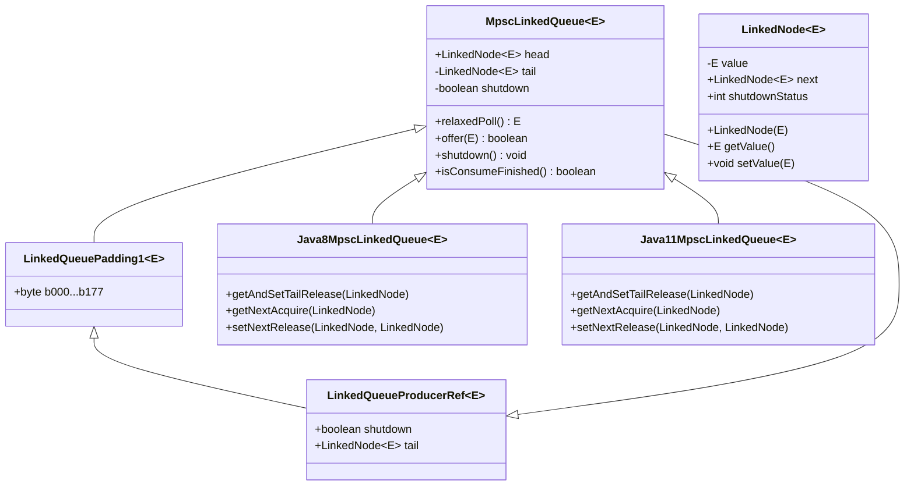
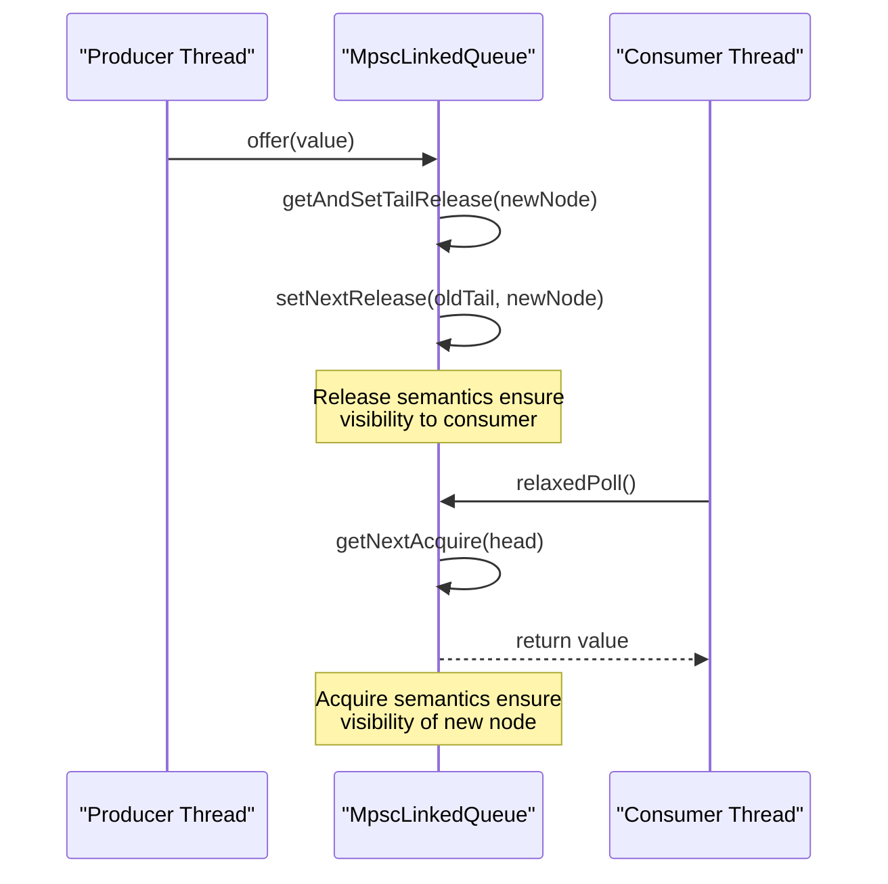
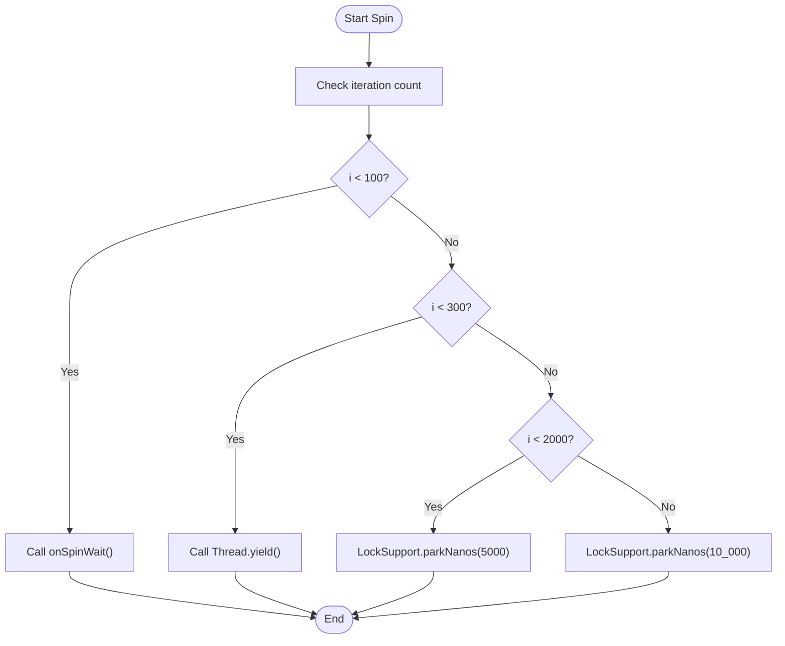
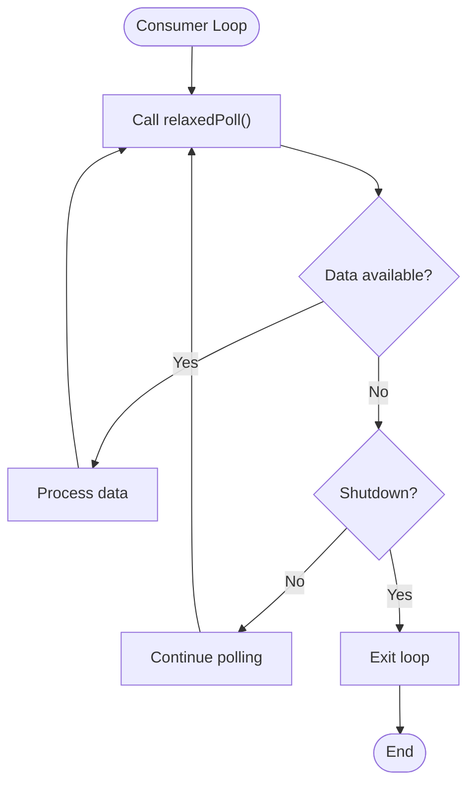
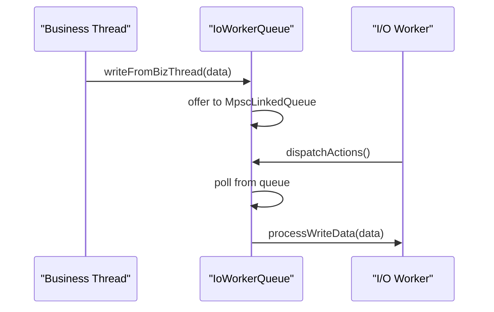

# High-Performance Memory Queues

<cite>
**Referenced Files in This Document**   
- [MpscLinkedQueue.java](file://client/src/main/java/com/github/dtprj/dongting/queue/MpscLinkedQueue.java)
- [LinkedNode.java](file://client/src/main/java/com/github/dtprj/dongting/queue/LinkedNode.java)
- [LinkedQueueProducerRef.java](file://client/src/main/java/com/github/dtprj/dongting/queue/LinkedQueueProducerRef.java)
- [LinkedQueuePadding1.java](file://client/src/main/java/com/github/dtprj/dongting/queue/LinkedQueuePadding1.java)
- [Java8MpscLinkedQueue.java](file://client/src/main/java/com/github/dtprj/dongting/java8/Java8MpscLinkedQueue.java)
- [Java11MpscLinkedQueue.java](file://client/src/main/java/com/github/dtprj/dongting/java11/Java11MpscLinkedQueue.java)
- [Padding0.java](file://client/src/main/java/com/github/dtprj/dongting/common/Padding0.java)
- [VersionFactory.java](file://client/src/main/java/com/github/dtprj/dongting/common/VersionFactory.java)
- [Java8Factory.java](file://client/src/main/java/com/github/dtprj/dongting/java8/Java8Factory.java)
- [Java11Factory.java](file://client/src/main/java/com/github/dtprj/dongting/java11/Java11Factory.java)
- [IoWorkerQueue.java](file://client/src/main/java/com/github/dtprj/dongting/net/IoWorkerQueue.java)
- [MpscQueueTest.java](file://benchmark/src/main/java/com/github/dtprj/dongting/bench/queue/MpscQueueTest.java)
- [MpscLinkedQueueTest.java](file://client/src/test/java/com/github/dtprj/dongting/java11/MpscLinkedQueueTest.java)
</cite>

## Table of Contents
1. [Introduction](#introduction)
2. [Architecture Overview](#architecture-overview)
3. [Core Components](#core-components)
4. [Memory Ordering and Thread Safety](#memory-ordering-and-thread-safety)
5. [Performance Characteristics](#performance-characteristics)
6. [Integration Points](#integration-points)
7. [Best Practices](#best-practices)
8. [Conclusion](#conclusion)

## Introduction
The Dongting framework implements a high-performance Multi-Producer Single-Consumer (MPSC) linked queue designed for efficient thread coordination in I/O and RAFT processing pipelines. This document details the architectural decisions, internal structure, and optimization techniques that enable the MpscLinkedQueue to achieve superior performance under high contention scenarios while maintaining thread safety with minimal synchronization overhead.

**Section sources**
- [MpscLinkedQueue.java](file://client/src/main/java/com/github/dtprj/dongting/queue/MpscLinkedQueue.java)

## Architecture Overview



**Diagram sources**
- [MpscLinkedQueue.java](file://client/src/main/java/com/github/dtprj/dongting/queue/MpscLinkedQueue.java)
- [LinkedNode.java](file://client/src/main/java/com/github/dtprj/dongting/queue/LinkedNode.java)
- [LinkedQueueProducerRef.java](file://client/src/main/java/com/github/dtprj/dongting/queue/LinkedQueueProducerRef.java)
- [LinkedQueuePadding1.java](file://client/src/main/java/com/github/dtprj/dongting/queue/LinkedQueuePadding1.java)
- [Java8MpscLinkedQueue.java](file://client/src/main/java/com/github/dtprj/dongting/java8/Java8MpscLinkedQueue.java)
- [Java11MpscLinkedQueue.java](file://client/src/main/java/com/github/dtprj/dongting/java11/Java11MpscLinkedQueue.java)

## Core Components

### MpscLinkedQueue Implementation
The MpscLinkedQueue is an abstract base class that implements the core MPSC queue logic with platform-specific optimizations. It uses a linked node structure with separate producer and consumer paths to minimize contention. The queue employs a sophisticated shutdown mechanism that ensures all elements offered before shutdown are consumed, while rejecting new elements after shutdown.

**Section sources**
- [MpscLinkedQueue.java](file://client/src/main/java/com/github/dtprj/dongting/queue/MpscLinkedQueue.java)

### LinkedNode Structure
The LinkedNode class represents the fundamental building block of the queue, containing the stored value and a volatile reference to the next node. It includes shutdown status tracking to coordinate graceful queue termination. The node's next pointer is declared volatile to ensure visibility across threads.

```mermaid
classDiagram
class LinkedNode~E~ {
-E value
+LinkedNode~E~ next
+int shutdownStatus
+LinkedNode(E)
+E getValue()
+void setValue(E)
}
note right of LinkedNode
The 'next' field is volatile to ensure
proper memory visibility between threads.
shutdownStatus tracks whether the node
was added before or after shutdown.
end note
```

**Diagram sources**
- [LinkedNode.java](file://client/src/main/java/com/github/dtprj/dongting/queue/LinkedNode.java)

### Producer Reference Management
The LinkedQueueProducerRef class extends Padding0 to manage producer-side state, including the tail pointer and shutdown flag. This separation of concerns between producer and consumer state reduces cache line contention.

```mermaid
classDiagram
class LinkedQueueProducerRef~E~ {
+boolean shutdown
+LinkedNode~E~ tail
}
class Padding0 {
+byte b000...b167
}
LinkedQueueProducerRef --> Padding0
note right of LinkedQueueProducerRef
Extends Padding0 to prevent false sharing
between producer and consumer state.
Contains tail pointer for producer access.
end note
```

**Diagram sources**
- [LinkedQueueProducerRef.java](file://client/src/main/java/com/github/dtprj/dongting/queue/LinkedQueueProducerRef.java)
- [Padding0.java](file://client/src/main/java/com/github/dtprj/dongting/common/Padding0.java)

### False Sharing Prevention
The implementation uses strategic padding to prevent false sharing between producer and consumer state. LinkedQueuePadding1 extends LinkedQueueProducerRef with 128 bytes of padding, ensuring that producer and consumer fields reside on separate cache lines.

```mermaid
classDiagram
class LinkedQueuePadding1~E~ {
+byte b000...b177
}
class LinkedQueueProducerRef~E~ {
+boolean shutdown
+LinkedNode~E~ tail
}
LinkedQueuePadding1 --> LinkedQueueProducerRef
note right of LinkedQueuePadding1
128 bytes of padding to ensure
producer and consumer state are on
separate cache lines, preventing
false sharing and improving performance.
end note
```

**Diagram sources**
- [LinkedQueuePadding1.java](file://client/src/main/java/com/github/dtprj/dongting/queue/LinkedQueuePadding1.java)
- [LinkedQueueProducerRef.java](file://client/src/main/java/com/github/dtprj/dongting/queue/LinkedQueueProducerRef.java)

## Memory Ordering and Thread Safety

### Platform-Specific Memory Operations
The queue leverages platform-specific memory ordering operations through the VersionFactory pattern. On Java 8, it uses AtomicReferenceFieldUpdater with lazySet for release semantics, while on Java 11+, it utilizes VarHandle with explicit release/acquire semantics.



**Diagram sources**
- [Java8MpscLinkedQueue.java](file://client/src/main/java/com/github/dtprj/dongting/java8/Java8MpscLinkedQueue.java)
- [Java11MpscLinkedQueue.java](file://client/src/main/java/com/github/dtprj/dongting/java11/Java11MpscLinkedQueue.java)
- [MpscLinkedQueue.java](file://client/src/main/java/com/github/dtprj/dongting/queue/MpscLinkedQueue.java)

### Spin-Wait Optimization
The implementation includes adaptive spin-wait strategies to handle contention during shutdown propagation. The spin method uses progressively more expensive waiting strategies based on the number of iterations, minimizing CPU usage while ensuring progress.



**Diagram sources**
- [MpscLinkedQueue.java](file://client/src/main/java/com/github/dtprj/dongting/queue/MpscLinkedQueue.java)
- [VersionFactory.java](file://client/src/main/java/com/github/dtprj/dongting/common/VersionFactory.java)

## Performance Characteristics

### Comparison with JDK's ConcurrentLinkedQueue
The MpscLinkedQueue outperforms JDK's ConcurrentLinkedQueue in MPSC scenarios due to its specialized design. Unlike ConcurrentLinkedQueue, which supports multiple consumers and requires more complex synchronization, MpscLinkedQueue optimizes for the single-consumer case with simpler, faster code paths.

**Section sources**
- [MpscQueueTest.java](file://benchmark/src/main/java/com/github/dtprj/dongting/bench/queue/MpscQueueTest.java)

### Batch Processing and Optimization
The queue supports batch processing patterns through its relaxedPoll method, allowing consumers to process multiple items in a tight loop without additional synchronization overhead. This enables efficient processing of bursts of data in I/O and RAFT processing pipelines.



**Diagram sources**
- [MpscLinkedQueue.java](file://client/src/main/java/com/github/dtprj/dongting/queue/MpscLinkedQueue.java)

## Integration Points

### Fiber Scheduler Integration
The MpscLinkedQueue is integrated into the fiber scheduler through the IoWorkerQueue class, which coordinates I/O operations between business threads and I/O worker threads. This enables efficient handoff of work items with minimal synchronization overhead.



**Diagram sources**
- [IoWorkerQueue.java](file://client/src/main/java/com/github/dtprj/dongting/net/IoWorkerQueue.java)
- [MpscLinkedQueue.java](file://client/src/main/java/com/github/dtprj/dongting/queue/MpscLinkedQueue.java)

### Network I/O Subsystem
In the network I/O subsystem, the queue serves as a critical coordination point between application threads and network I/O threads. The IoWorkerQueue uses the MpscLinkedQueue to safely transfer PacketInfo objects and Runnable tasks from business threads to I/O worker threads.

**Section sources**
- [IoWorkerQueue.java](file://client/src/main/java/com/github/dtprj/dongting/net/IoWorkerQueue.java)

## Best Practices

### When to Use MpscLinkedQueue
The MpscLinkedQueue should be used when:
- Multiple producers need to coordinate with a single consumer
- High throughput is required under contention
- Memory allocation should be minimized
- Graceful shutdown with guaranteed consumption is needed

Avoid using it when:
- Multiple consumers are required
- Bounded capacity is needed
- Complex blocking semantics are required

**Section sources**
- [MpscLinkedQueue.java](file://client/src/main/java/com/github/dtprj/dongting/queue/MpscLinkedQueue.java)
- [MpscLinkedQueueTest.java](file://client/src/test/java/com/github/dtprj/dongting/java11/MpscLinkedQueueTest.java)

### Monitoring and Backpressure
To monitor queue depth and avoid backpressure issues:
- Use the isConsumeFinished method to detect shutdown completion
- Implement external monitoring of queue size if needed
- Ensure consumers process items at a rate that matches production
- Use the shutdown method for graceful termination

**Section sources**
- [MpscLinkedQueue.java](file://client/src/main/java/com/github/dtprj/dongting/queue/MpscLinkedQueue.java)

## Conclusion
The MpscLinkedQueue implementation in Dongting represents a sophisticated high-performance memory queue optimized for MPSC scenarios in I/O and RAFT processing pipelines. Through careful attention to memory layout, false sharing prevention, and platform-specific memory ordering operations, it achieves superior performance compared to general-purpose concurrent queues. The design balances performance with safety, providing guaranteed consumption semantics during shutdown while minimizing synchronization overhead in the critical path.