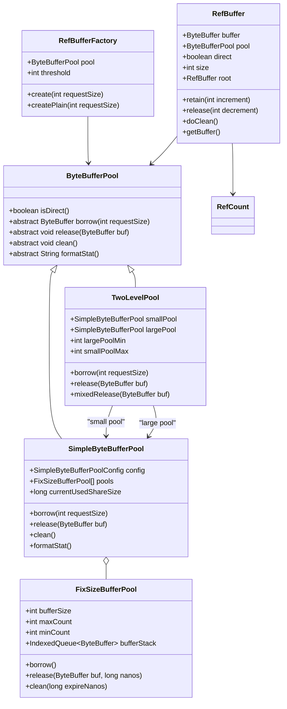
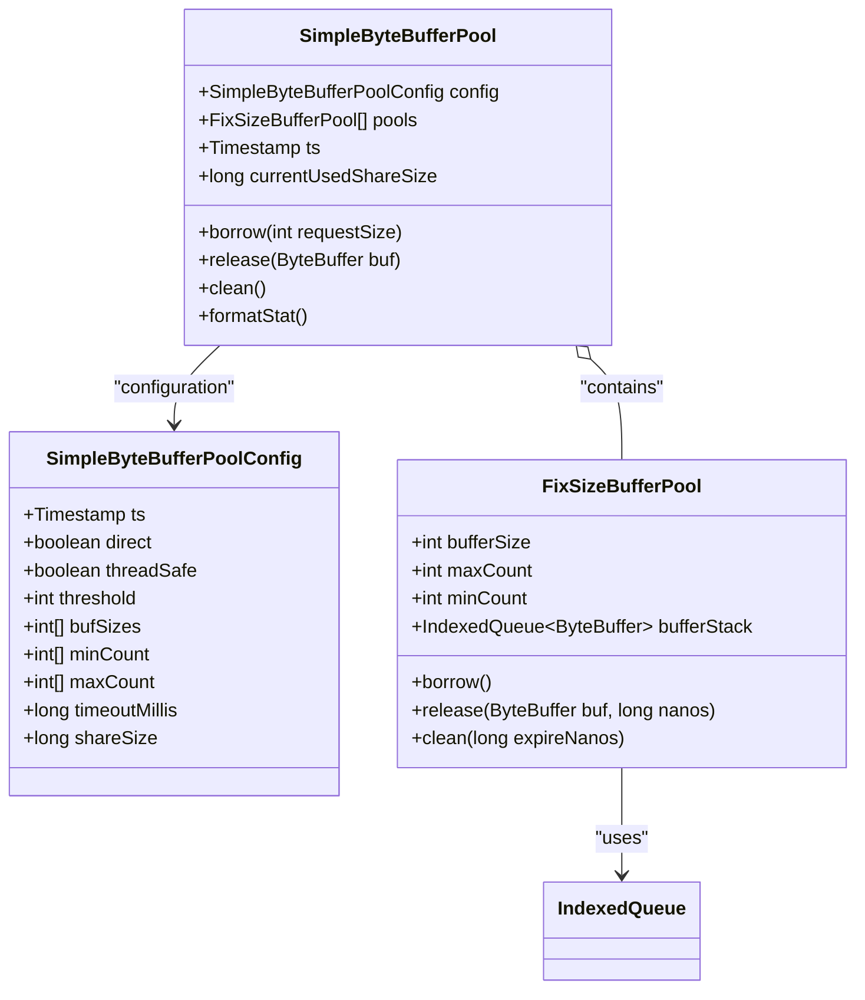
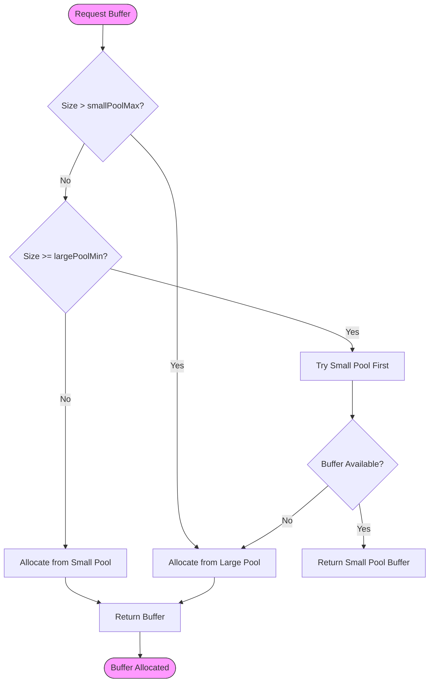
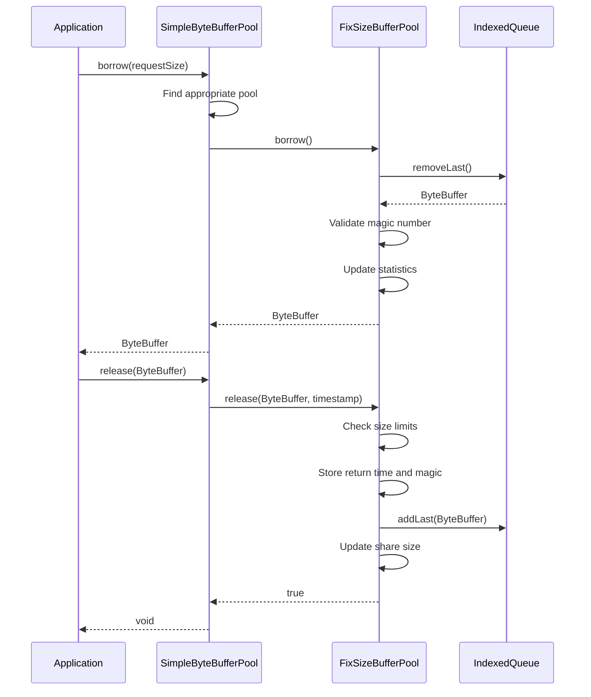

# Memory Optimization

<cite>
**Referenced Files in This Document**   
- [ByteBufferPool.java](file://client/src/main/java/com/github/dtprj/dongting/buf/ByteBufferPool.java)
- [TwoLevelPool.java](file://client/src/main/java/com/github/dtprj/dongting/buf/TwoLevelPool.java)
- [FixSizeBufferPool.java](file://client/src/main/java/com/github/dtprj/dongting/buf/FixSizeBufferPool.java)
- [SimpleByteBufferPool.java](file://client/src/main/java/com/github/dtprj/dongting/buf/SimpleByteBufferPool.java)
- [RefBuffer.java](file://client/src/main/java/com/github/dtprj/dongting/buf/RefBuffer.java)
- [DefaultPoolFactory.java](file://client/src/main/java/com/github/dtprj/dongting/buf/DefaultPoolFactory.java)
- [SimpleByteBufferPoolConfig.java](file://client/src/main/java/com/github/dtprj/dongting/buf/SimpleByteBufferPoolConfig.java)
- [RefBufferFactory.java](file://client/src/main/java/com/github/dtprj/dongting/buf/RefBufferFactory.java)
- [TwoLevelPoolTest.java](file://client/src/test/java/com/github/dtprj/dongting/buf/TwoLevelPoolTest.java)
- [SimpleByteBufferPoolTest.java](file://client/src/test/java/com/github/dtprj/dongting/buf/SimpleByteBufferPoolTest.java)
- [RefBufferTest.java](file://client/src/test/java/com/github/dtprj/dongting/buf/RefBufferTest.java)
</cite>

## Table of Contents
1. [Introduction](#introduction)
2. [Core Buffer Pool Architecture](#core-buffer-pool-architecture)
3. [Detailed Component Analysis](#detailed-component-analysis)
4. [Memory Management Strategies](#memory-management-strategies)
5. [Performance Characteristics](#performance-characteristics)
6. [Integration with Network I/O and RAFT](#integration-with-network-io-and-raft)
7. [Configuration and Monitoring](#configuration-and-monitoring)
8. [Best Practices and Troubleshooting](#best-practices-and-troubleshooting)
9. [Conclusion](#conclusion)

## Introduction

Dongting implements a sophisticated memory optimization framework centered around object pooling and efficient buffer management to reduce garbage collection pressure and improve performance in high-throughput network applications. The system employs a hierarchical buffer pool architecture with multiple specialized pool implementations designed for different use cases and performance requirements. This document details the design and implementation of Dongting's ByteBufferPool, TwoLevelPool, and FixSizeBufferPool, explaining their trade-offs, performance characteristics, and integration with network I/O operations and RAFT consensus messaging. The memory management system is designed to handle the demanding requirements of distributed systems while minimizing memory allocation overhead and preventing memory leaks through reference counting and proper lifecycle management.

## Core Buffer Pool Architecture

Dongting's memory management system is built around a hierarchical buffer pool architecture that optimizes memory allocation and reuse for network operations. The architecture consists of multiple specialized pool implementations that work together to provide efficient buffer management across different size ranges and usage patterns. At the core of this system is the ByteBufferPool abstract class, which defines the fundamental interface for buffer allocation and release operations. This base class is extended by specialized implementations including SimpleByteBufferPool, TwoLevelPool, and FixSizeBufferPool, each designed for specific performance characteristics and use cases.

The architecture employs a two-level pooling strategy where smaller buffers are managed by dedicated pools while larger buffers are handled by global shared pools. This approach balances memory efficiency with performance, allowing for fast allocation of commonly used buffer sizes while preventing excessive memory consumption from rarely used large buffers. The system also incorporates reference counting through the RefBuffer class, which enables safe buffer sharing across threads and components while ensuring proper cleanup and preventing memory leaks. This comprehensive architecture is designed to minimize garbage collection pressure in high-throughput network applications by reusing buffers extensively and only allocating new memory when absolutely necessary.



**Diagram sources**
- [ByteBufferPool.java](file://client/src/main/java/com/github/dtprj/dongting/buf/ByteBufferPool.java#L23-L45)
- [SimpleByteBufferPool.java](file://client/src/main/java/com/github/dtprj/dongting/buf/SimpleByteBufferPool.java#L32-L344)
- [TwoLevelPool.java](file://client/src/main/java/com/github/dtprj/dongting/buf/TwoLevelPool.java#L26-L145)
- [FixSizeBufferPool.java](file://client/src/main/java/com/github/dtprj/dongting/buf/FixSizeBufferPool.java#L26-L141)
- [RefBuffer.java](file://client/src/main/java/com/github/dtprj/dongting/buf/RefBuffer.java#L28-L183)
- [RefBufferFactory.java](file://client/src/main/java/com/github/dtprj/dongting/buf/RefBufferFactory.java#L21-L41)

**Section sources**
- [ByteBufferPool.java](file://client/src/main/java/com/github/dtprj/dongting/buf/ByteBufferPool.java#L1-L46)
- [SimpleByteBufferPool.java](file://client/src/main/java/com/github/dtprj/dongting/buf/SimpleByteBufferPool.java#L1-L347)
- [TwoLevelPool.java](file://client/src/main/java/com/github/dtprj/dongting/buf/TwoLevelPool.java#L1-L146)
- [FixSizeBufferPool.java](file://client/src/main/java/com/github/dtprj/dongting/buf/FixSizeBufferPool.java#L1-L142)

## Detailed Component Analysis

### ByteBufferPool and SimpleByteBufferPool Implementation

The ByteBufferPool serves as the abstract base class for all buffer pool implementations in Dongting, defining the core interface for buffer allocation and management. This abstract class provides the foundation for the entire memory management system, with key methods for borrowing and releasing buffers, as well as utility methods for checking if the pool manages direct or heap buffers. The SimpleByteBufferPool implementation extends this base class to provide a concrete buffer pooling mechanism that organizes buffers by size in fixed-size pools.

The SimpleByteBufferPool uses a configuration-driven approach with the SimpleByteBufferPoolConfig class, allowing for flexible setup of buffer sizes, minimum and maximum counts, timeout values, and sharing limits. It maintains an array of FixSizeBufferPool instances, each responsible for managing buffers of a specific size. When a buffer is requested, the pool finds the smallest available buffer size that can accommodate the request, minimizing memory waste. The pool also tracks statistics such as borrow and release hit rates, which are crucial for monitoring pool efficiency and identifying potential configuration issues.



**Diagram sources**
- [SimpleByteBufferPool.java](file://client/src/main/java/com/github/dtprj/dongting/buf/SimpleByteBufferPool.java#L32-L344)
- [SimpleByteBufferPoolConfig.java](file://client/src/main/java/com/github/dtprj/dongting/buf/SimpleByteBufferPoolConfig.java#L23-L61)
- [FixSizeBufferPool.java](file://client/src/main/java/com/github/dtprj/dongting/buf/FixSizeBufferPool.java#L26-L141)

**Section sources**
- [SimpleByteBufferPool.java](file://client/src/main/java/com/github/dtprj/dongting/buf/SimpleByteBufferPool.java#L1-L347)
- [SimpleByteBufferPoolConfig.java](file://client/src/main/java/com/github/dtprj/dongting/buf/SimpleByteBufferPoolConfig.java#L1-L62)

### TwoLevelPool Design and Operation

The TwoLevelPool implementation provides a sophisticated two-tiered buffer management strategy that combines the benefits of local and global buffer pools. This design addresses the limitations of single-level pools by separating buffer management into small and large buffer domains, each with different performance characteristics and memory usage patterns. The TwoLevelPool wraps two SimpleByteBufferPool instances: a small pool for frequently used buffer sizes and a large pool for less frequently used, larger buffers.

The operation of the TwoLevelPool is optimized for performance and memory efficiency. When a buffer is requested, the pool first checks if the requested size falls within the range of the small pool. If the size is smaller than the maximum small buffer size, it is allocated from the small pool. If the size exceeds the small pool's maximum, it is allocated from the large pool. For sizes that fall in the overlap region between the two pools, the algorithm first attempts to allocate from the small pool, falling back to the large pool if no suitable buffer is available. This design minimizes memory fragmentation and ensures that commonly used buffer sizes are efficiently reused.

The TwoLevelPool also includes specialized features for thread safety and cross-thread operations. It can be configured to allow buffer release in different threads through a callback mechanism, which is essential for asynchronous network operations where buffers may be released by different threads than those that allocated them. This feature enables efficient buffer management in multi-threaded environments without requiring complex synchronization mechanisms.



**Diagram sources**
- [TwoLevelPool.java](file://client/src/main/java/com/github/dtprj/dongting/buf/TwoLevelPool.java#L26-L145)

**Section sources**
- [TwoLevelPool.java](file://client/src/main/java/com/github/dtprj/dongting/buf/TwoLevelPool.java#L1-L146)

### FixSizeBufferPool and Buffer Reuse Mechanism

The FixSizeBufferPool is the fundamental building block of Dongting's buffer pooling system, responsible for managing buffers of a single, fixed size. This class implements a stack-based buffer reuse mechanism using the IndexedQueue data structure, which provides efficient LIFO (Last-In, First-Out) operations for buffer allocation and release. Each FixSizeBufferPool instance manages a specific buffer size, maintaining a stack of available buffers that can be quickly accessed when needed.

The buffer reuse mechanism incorporates several safety features to prevent common memory management errors. Each buffer contains a magic number at a predefined offset that is checked when the buffer is borrowed from the pool. This ensures that buffers have not been written to after release, which could indicate a use-after-free bug. The pool also tracks the return time of each buffer, enabling expiration-based cleanup of idle buffers to prevent memory bloat. When a buffer is released, it is only returned to the pool if the pool has not exceeded its maximum size and the shared memory limit, ensuring that memory usage remains within configured bounds.

The FixSizeBufferPool also implements a sophisticated sharing mechanism through the currentUsedShareSize field in the parent SimpleByteBufferPool. This allows multiple FixSizeBufferPool instances to coordinate their memory usage against a shared memory budget, preventing any single buffer size from consuming excessive memory at the expense of others. This sharing mechanism is crucial for maintaining overall memory efficiency across the entire buffer pool system.



**Diagram sources**
- [FixSizeBufferPool.java](file://client/src/main/java/com/github/dtprj/dongting/buf/FixSizeBufferPool.java#L26-L141)
- [SimpleByteBufferPool.java](file://client/src/main/java/com/github/dtprj/dongting/buf/SimpleByteBufferPool.java#L126-L199)

**Section sources**
- [FixSizeBufferPool.java](file://client/src/main/java/com/github/dtprj/dongting/buf/FixSizeBufferPool.java#L1-L142)

### RefBuffer and Reference Counting System

The RefBuffer class implements a reference counting mechanism that enables safe buffer sharing across multiple components and threads while ensuring proper memory management. This class extends the RefCount base class and implements the Encodable interface, making it suitable for use in network communication scenarios. The reference counting system is designed to prevent memory leaks by ensuring that buffers are only released when they are no longer referenced by any component.

RefBuffer supports two primary modes of operation: pooled and direct allocation. When a buffer request is below a specified threshold, the buffer is allocated directly without pooling, as the overhead of pooling small buffers may not be justified. For larger requests, the buffer is obtained from the configured ByteBufferPool, enabling reuse and reducing garbage collection pressure. The class also supports buffer slicing, where multiple RefBuffer instances can share the same underlying ByteBuffer, each with its own reference count. This allows for efficient sub-buffer operations without memory copying.

The reference counting implementation includes safeguards against common errors such as double release and use-after-free conditions. When a buffer is released, the reference count is decremented, and when it reaches zero, the doClean method is called to return the buffer to its pool or release direct memory. The implementation also handles hierarchical reference counting, where sliced buffers reference a root buffer, ensuring that the entire buffer hierarchy is properly managed and cleaned up.

```mermaid
classDiagram
class RefBuffer {
+ByteBuffer buffer
+ByteBufferPool pool
+boolean direct
+int size
+RefBuffer root
+retain(int increment)
+release(int decrement)
+doClean()
+getBuffer()
+slice(int absolutePos, int absoluteLimit)
}
class RefCount {
+int refCnt
+retain()
+release()
+isReleased()
+doClean()
}
class RefBufferFactory {
+ByteBufferPool pool
+int threshold
+create(int requestSize)
+createPlain(int requestSize)
}
RefBuffer --> RefCount : "extends"
RefBufferFactory --> RefBuffer : "creates"
RefBuffer --> ByteBufferPool : "returns to"
RefBuffer --> ByteBuffer : "wraps"
note right of RefBuffer
Supports buffer slicing with
hierarchical reference counting.
Root buffer manages the actual
memory lifecycle.
end note
```

**Diagram sources**
- [RefBuffer.java](file://client/src/main/java/com/github/dtprj/dongting/buf/RefBuffer.java#L28-L183)
- [RefBufferFactory.java](file://client/src/main/java/com/github/dtprj/dongting/buf/RefBufferFactory.java#L21-L41)

**Section sources**
- [RefBuffer.java](file://client/src/main/java/com/github/dtprj/dongting/buf/RefBuffer.java#L1-L184)
- [RefBufferFactory.java](file://client/src/main/java/com/github/dtprj/dongting/buf/RefBufferFactory.java#L1-L42)

## Memory Management Strategies

### Object Pooling Design Philosophy

Dongting's object pooling strategy is based on the recognition that while modern JVMs have highly optimized garbage collectors, strategic object pooling can still provide significant performance benefits for specific use cases, particularly for larger objects like ByteBuffers. The design philosophy acknowledges that small object pooling may introduce more overhead than benefit due to synchronization costs, but for larger buffers commonly used in I/O operations, pooling can dramatically reduce GC pressure and improve throughput.

The system employs a threshold-based approach where buffers below a certain size (typically 64 bytes) are allocated directly without pooling, while larger buffers are managed by the pooling system. This hybrid approach balances the benefits of pooling against its overhead, ensuring optimal performance across different buffer size ranges. The documentation notes that buffers larger than 1KB are particularly good candidates for pooling, as they represent significant memory allocations that can benefit from reuse.

The pooling system is designed with simplicity as a key principle, favoring straightforward algorithms with low time complexity over more sophisticated but complex allocation strategies. This design choice ensures predictable performance and makes the system easier to understand, debug, and maintain. The trade-off is potentially lower space utilization, as the system does not attempt to split larger buffers to satisfy smaller requests, but the performance benefits of fast allocation and release operations are prioritized.

### Memory Layout and Cache Efficiency

Dongting's memory management system incorporates several optimizations to improve cache efficiency and prevent false sharing. The buffer pool design groups buffers of the same size together, which improves spatial locality when multiple buffers of the same size are accessed in sequence. This layout pattern takes advantage of CPU cache line behavior, reducing cache misses and improving memory access performance.

The system also employs padding techniques to prevent false sharing between frequently accessed fields in multi-threaded scenarios. By ensuring that critical fields are aligned to cache line boundaries and separated from other frequently modified data, the system minimizes the performance impact of cache line invalidation across CPU cores. This is particularly important in high-throughput network applications where multiple threads may be accessing buffer pool metadata concurrently.

For direct ByteBuffers, the system leverages off-heap memory allocation, which reduces pressure on the JVM heap and can improve performance by avoiding GC pauses. However, this approach requires careful management of native memory resources and proper cleanup to prevent memory leaks. The reference counting system in RefBuffer ensures that direct buffers are properly released back to the pool or deallocated when no longer needed, maintaining memory safety while maximizing performance.

## Performance Characteristics

### Benchmark Results and Allocation Performance

According to the development documentation, Dongting's buffer pool implementation demonstrates excellent performance characteristics for buffer allocation and release operations. The system achieves sub-10 nanosecond allocation times for direct allocations of small buffers (≤64 bytes), with slightly higher latencies for pooled allocations. For example, allocating a 65-byte buffer takes approximately 27 nanoseconds, while a 256-byte buffer allocation takes about 35 nanoseconds. Larger allocations, such as 16KB buffers, require more time (around 1188 nanoseconds) due to the underlying memory allocation costs.

When buffers are available in the pool (cache hit scenario), the allocation performance is exceptionally fast, with operations completing in 6-11 nanoseconds. This represents a significant performance advantage over direct allocation, particularly for frequently used buffer sizes. The release operation performance is similarly optimized, with pooled releases being nearly as fast as the allocation hits.

The system's performance is further enhanced by the two-level pool architecture, which reduces contention and improves hit rates by separating frequently used small buffers from less frequently used large buffers. This design allows the small pool to maintain high hit rates for common buffer sizes while preventing large, infrequently used buffers from consuming pool resources needed for more common sizes.

### Trade-offs Between Pool Implementations

Each buffer pool implementation in Dongting offers different trade-offs between performance, memory efficiency, and complexity. The SimpleByteBufferPool provides the most straightforward implementation with excellent performance for single-threaded or thread-isolated use cases. However, its non-thread-safe nature requires external synchronization in multi-threaded environments, which can impact performance.

The TwoLevelPool introduces additional complexity but provides significant benefits in multi-threaded scenarios by separating buffer management into dedicated small and large pools. This separation reduces contention and improves cache locality, but at the cost of more complex configuration and potentially higher memory overhead due to maintaining multiple pool instances.

The FixSizeBufferPool represents the fundamental trade-off between space and time efficiency. By dedicating separate pools to specific buffer sizes, the system achieves extremely fast allocation and release times, but at the cost of potentially lower memory utilization, as buffers from one size category cannot be used to satisfy requests for different sizes. This design prioritizes time efficiency over space efficiency, which aligns with the performance goals of high-throughput network applications.

## Integration with Network I/O and RAFT

### Network I/O Operations Integration

Dongting's buffer pooling system is tightly integrated with network I/O operations to optimize data transfer performance. The system uses the buffer pools to manage read and write buffers for network channels, ensuring that buffer allocation overhead is minimized during high-volume data transfer. When data is received from a network channel, a buffer is borrowed from the appropriate pool to store the incoming data, and when data needs to be sent, buffers are similarly obtained for the outgoing data.

The integration includes specialized packet classes like ByteBufferWritePacket and RefBufWritePacket that work directly with the pooled buffers, enabling zero-copy data transfer when possible. The encoding system uses the RefBuffer's Encodable interface to efficiently serialize data into network buffers, with the EncodeContext tracking the encoding state across multiple write operations. This integration allows for efficient handling of large messages that may require multiple network packets, with buffers being properly managed throughout the entire transmission process.

The system also handles the complexities of asynchronous I/O operations, where buffers may be released by different threads than those that allocated them. The TwoLevelPool's release-in-other-thread capability is particularly important here, allowing network worker threads to release buffers back to pools managed by other components without requiring complex synchronization.

### RAFT Consensus Messaging

In the context of RAFT consensus messaging, Dongting's memory management system plays a crucial role in ensuring efficient and reliable message processing. RAFT operations generate various message types, including AppendEntries, RequestVote, and InstallSnapshot messages, each with different size characteristics and frequency patterns. The buffer pooling system is optimized to handle these varying message types efficiently.

For frequently exchanged small messages like heartbeat packets, the small buffer pool ensures rapid allocation and release with minimal overhead. For larger messages such as log entries and snapshots, the system can efficiently manage the larger buffer requirements without impacting the availability of smaller buffers for other operations. The reference counting system in RefBuffer is particularly valuable for RAFT operations, where messages may be referenced by multiple components (such as the network layer, consensus algorithm, and storage system) simultaneously.

The integration with RAFT also includes proper cleanup of buffers associated with completed or failed operations, preventing memory leaks in long-running distributed systems. The periodic cleanup mechanism in the buffer pools ensures that idle buffers are released over time, maintaining memory efficiency even under varying workloads.

## Configuration and Monitoring

### Pool Sizing and Configuration Guidelines

Dongting provides comprehensive configuration options for tuning the buffer pool system to specific application requirements. The DefaultPoolFactory class defines default configurations for both global and per-instance pools, with carefully selected buffer sizes and count limits based on typical usage patterns. The global pools use larger buffer sizes (32KB to 4MB) with more conservative count limits, while per-instance pools use smaller sizes (128B to 16KB) with higher maximum counts to accommodate more frequent allocation patterns.

Configuration guidelines suggest setting the threshold parameter based on the application's typical buffer usage patterns, with values around 64-128 bytes being common. The buffer sizes array should include the most frequently used buffer sizes in the application, while the minCount and maxCount arrays control the minimum guaranteed availability and maximum pool size for each buffer size. The timeoutMillis parameter determines how long idle buffers are retained before being cleaned up, balancing memory efficiency against allocation performance.

For applications with predictable buffer usage patterns, custom configurations can be created using the SimpleByteBufferPoolConfig class, allowing fine-tuned control over all pool parameters. The shareSize parameter is particularly important for controlling overall memory consumption, as it limits the total memory that can be consumed by the pool across all buffer sizes.

### Monitoring Pool Utilization

The buffer pool system includes comprehensive monitoring capabilities through the formatStat method, which provides detailed statistics on pool utilization and performance. This method returns a formatted string containing key metrics such as total borrow and release counts, hit rates, and counts of allocations that were too small or too large for the pool. These statistics are essential for diagnosing performance issues and tuning pool configurations.

The monitoring data includes separate statistics for each buffer size category, allowing administrators to identify which buffer sizes are most frequently used and whether the pool configuration is optimal. High miss rates for specific sizes may indicate the need to adjust the minCount or maxCount values, while excessive "borrow too large" counts may suggest the need to add larger buffer sizes to the configuration.

Applications can periodically log these statistics or integrate them with monitoring systems to track pool performance over time and detect potential memory management issues before they impact system stability.

## Best Practices and Troubleshooting

### Proper Buffer Lifecycle Management

Effective use of Dongting's buffer pooling system requires careful attention to buffer lifecycle management. The most important practice is ensuring that every borrowed buffer is eventually released exactly once. The system includes safeguards against double release and use-after-release conditions, but these should be considered last-resort protections rather than substitutes for proper coding practices.

When using RefBuffer, developers should ensure that retain() is called whenever a new reference to the buffer is created, and that a corresponding release() is called when the reference is no longer needed. For buffer slicing operations, the system automatically manages the reference counting hierarchy, but developers should still ensure that the original buffer reference is properly released when all slices are no longer needed.

In asynchronous code, special care must be taken to ensure that buffers are released even if exceptions occur. Using try-finally blocks or try-with-resources statements (where applicable) can help ensure proper cleanup. The RefBufferFactory should be used to create buffers whenever possible, as it encapsulates the correct creation logic and threshold handling.

### Diagnosing Memory-Related Performance Issues

Common memory-related performance issues in Dongting applications typically manifest as high GC activity, increased allocation latencies, orOutOfMemoryError exceptions. Diagnosing these issues begins with examining the pool statistics from the formatStat method to identify high miss rates or excessive direct allocations.

High "borrow too small" counts may indicate that the threshold is set too high, causing small buffers to bypass the pool unnecessarily. High "borrow too large" counts suggest that the application is frequently requesting buffer sizes larger than those configured in the pool, which may require adding larger buffer sizes to the configuration or investigating whether the application can use smaller buffers.

Memory leaks can often be identified by monitoring the pool statistics over time and looking for steadily increasing buffer counts without corresponding increases in application load. The magic number validation in FixSizeBufferPool can help detect use-after-free bugs, which may manifest as DtException with messages about buffer corruption after release.

For persistent issues, enabling detailed logging of buffer allocation and release operations can help trace the lifecycle of problematic buffers and identify code paths that may be failing to release buffers properly.

## Conclusion

Dongting's memory optimization framework provides a comprehensive solution for efficient buffer management in high-performance network applications. The hierarchical buffer pool architecture, combining SimpleByteBufferPool, TwoLevelPool, and FixSizeBufferPool implementations, offers an effective balance between performance, memory efficiency, and complexity. The system's design prioritizes fast allocation and release operations while minimizing garbage collection pressure through extensive buffer reuse.

The integration of reference counting through RefBuffer enables safe buffer sharing across components and threads, preventing memory leaks while supporting the complex data flow requirements of distributed systems. The tight integration with network I/O operations and RAFT consensus messaging demonstrates the system's effectiveness in real-world scenarios, where efficient memory management is critical for overall system performance.

By following the configuration guidelines and best practices outlined in this document, developers can effectively leverage Dongting's memory optimization features to build high-performance applications with minimal memory overhead. The comprehensive monitoring capabilities provide the insights needed to tune pool configurations and diagnose performance issues, ensuring that the system operates at peak efficiency under varying workloads.