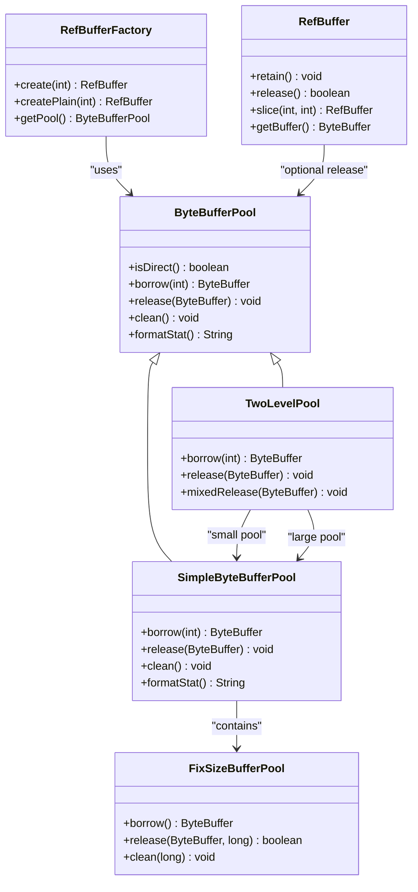
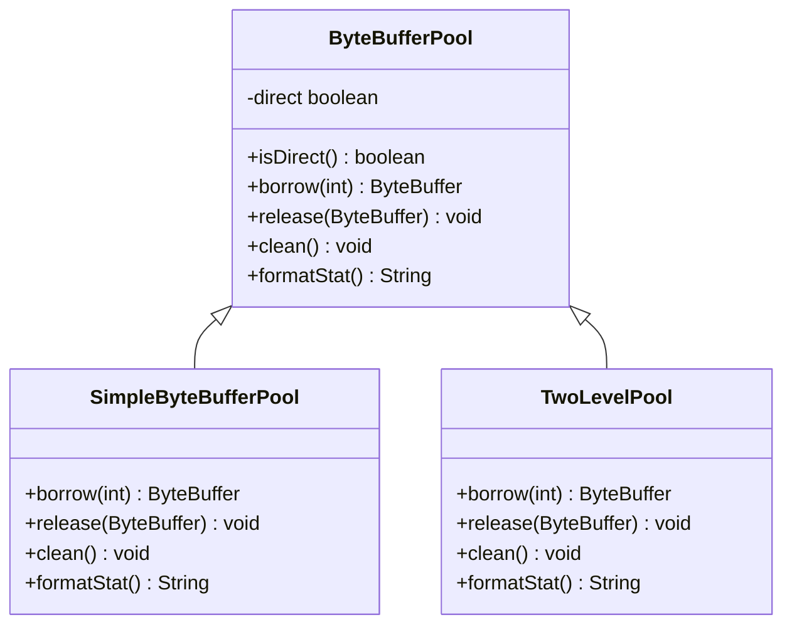
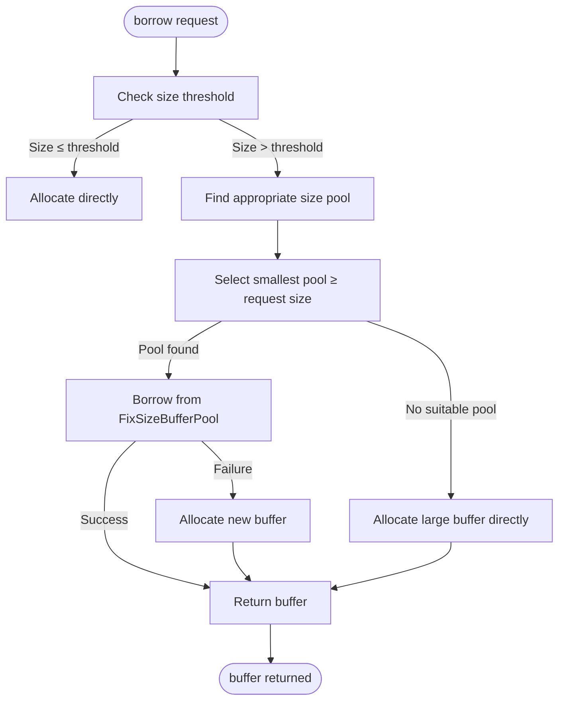
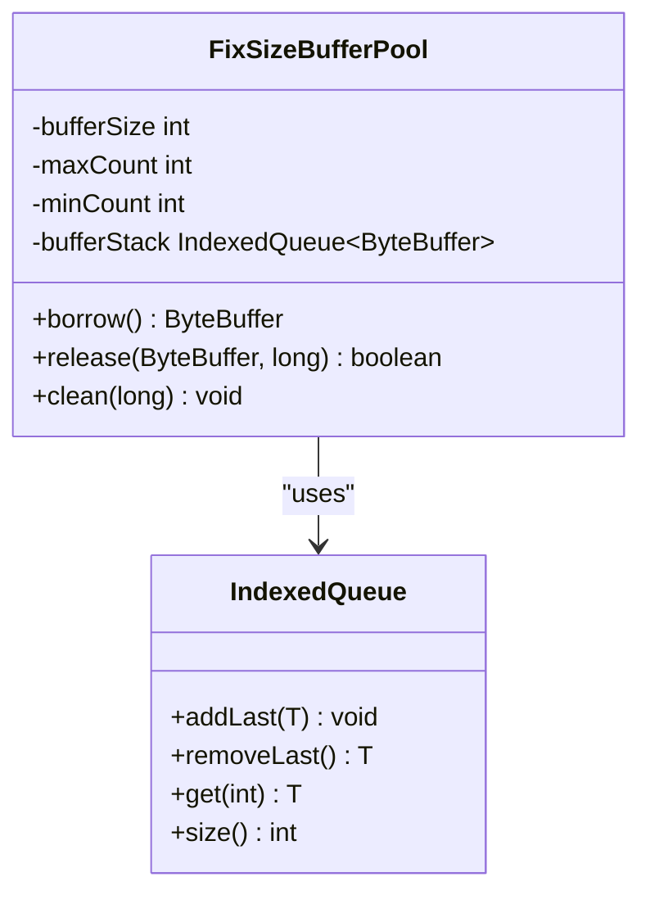
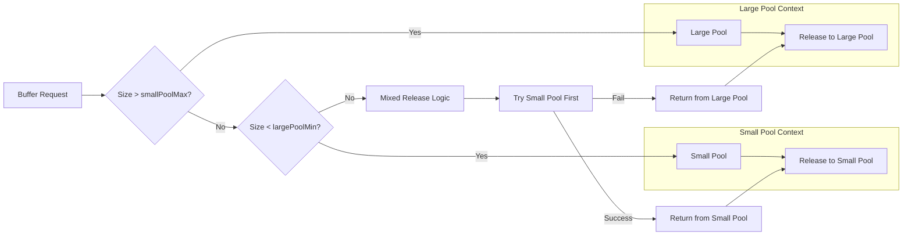
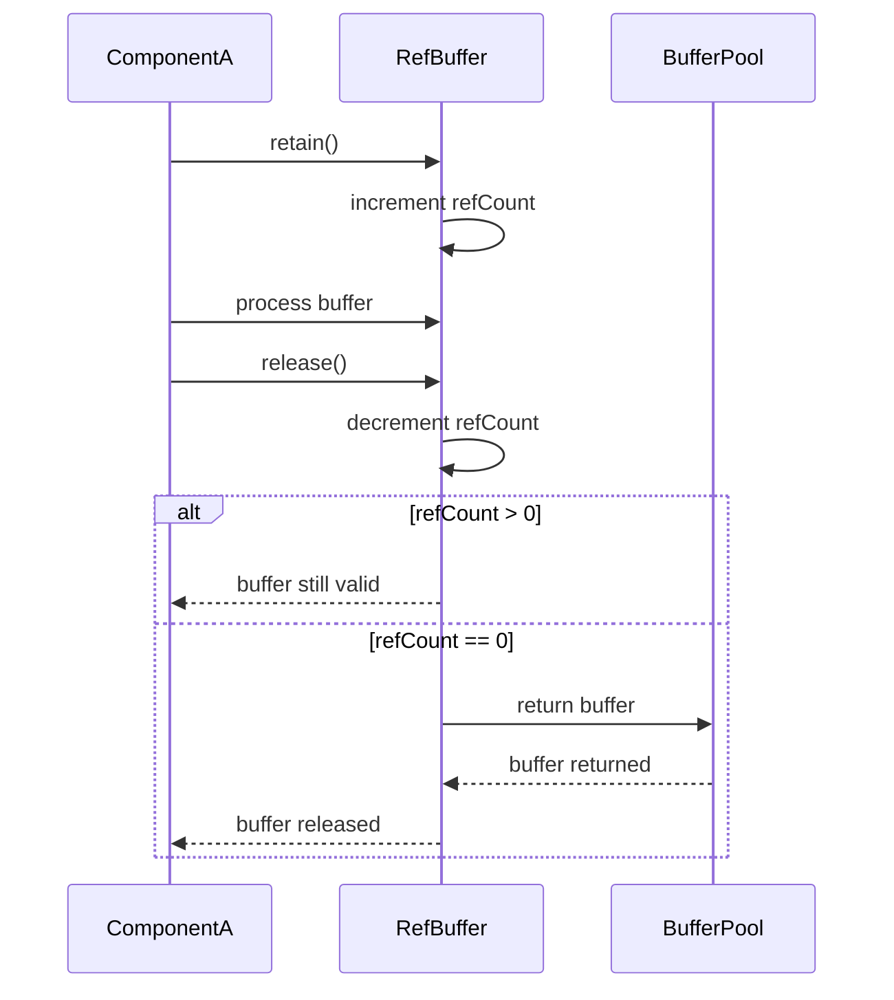
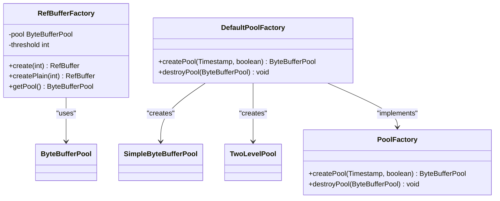
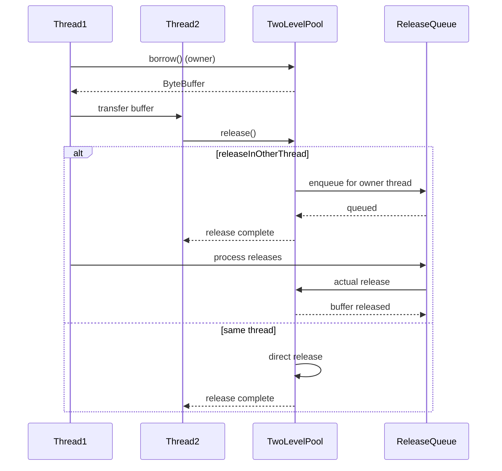

# Object Pooling Strategies

<cite>
**Referenced Files in This Document**   
- [ByteBufferPool.java](file://client/src/main/java/com/github/dtprj/dongting/buf/ByteBufferPool.java)
- [SimpleByteBufferPool.java](file://client/src/main/java/com/github/dtprj/dongting/buf/SimpleByteBufferPool.java)
- [FixSizeBufferPool.java](file://client/src/main/java/com/github/dtprj/dongting/buf/FixSizeBufferPool.java)
- [TwoLevelPool.java](file://client/src/main/java/com/github/dtprj/dongting/buf/TwoLevelPool.java)
- [RefBuffer.java](file://client/src/main/java/com/github/dtprj/dongting/buf/RefBuffer.java)
- [RefBufferFactory.java](file://client/src/main/java/com/github/dtprj/dongting/buf/RefBufferFactory.java)
- [SimpleByteBufferPoolConfig.java](file://client/src/main/java/com/github/dtprj/dongting/buf/SimpleByteBufferPoolConfig.java)
- [DefaultPoolFactory.java](file://client/src/main/java/com/github/dtprj/dongting/buf/DefaultPoolFactory.java)
- [RefBufferTest.java](file://client/src/test/java/com/github/dtprj/dongting/buf/RefBufferTest.java)
- [SimpleByteBufferPoolTest.java](file://client/src/test/java/com/github/dtprj/dongting/buf/SimpleByteBufferPoolTest.java)
- [TwoLevelPoolTest.java](file://client/src/test/java/com/github/dtprj/dongting/buf/TwoLevelPoolTest.java)
</cite>

## Table of Contents
1. [Introduction](#introduction)
2. [Core Pooling Implementations](#core-pooling-implementations)
3. [ByteBufferPool Hierarchy](#bytebufferpool-hierarchy)
4. [SimpleByteBufferPool Design](#simplebytebufferpool-design)
5. [FixSizeBufferPool Implementation](#fixsizebufferpool-implementation)
6. [TwoLevelPool Architecture](#twolevelpool-architecture)
7. [Reference Counting with RefBuffer](#reference-counting-with-refbuffer)
8. [Buffer Factory Patterns](#buffer-factory-patterns)
9. [Configuration and Sizing Guidelines](#configuration-and-sizing-guidelines)
10. [Performance Characteristics](#performance-characteristics)
11. [Thread Safety and Concurrency](#thread-safety-and-concurrency)
12. [Lifecycle Management](#lifecycle-management)
13. [Common Pitfalls and Mitigations](#common-pitfalls-and-mitigations)
14. [Usage Patterns](#usage-patterns)
15. [Conclusion](#conclusion)

## Introduction

Dongting implements a sophisticated object pooling system designed to optimize memory allocation and reduce garbage collection pressure in high-performance network applications. The framework provides multiple buffer pool implementations tailored for different use cases, with a focus on efficient ByteBuffer management for I/O operations. This document details the design, implementation, and usage patterns of Dongting's object pooling strategies, covering the core components: ByteBufferPool, SimpleByteBufferPool, TwoLevelPool, and FixSizeBufferPool.

The pooling system is designed to handle the high-frequency allocation and release patterns typical in network programming, where temporary buffers are constantly created for reading from and writing to network channels. By reusing buffers instead of allocating new ones, Dongting significantly reduces memory pressure and improves overall system throughput.

**Section sources**
- [ByteBufferPool.java](file://client/src/main/java/com/github/dtprj/dongting/buf/ByteBufferPool.java#L1-L46)
- [SimpleByteBufferPool.java](file://client/src/main/java/com/github/dtprj/dongting/buf/SimpleByteBufferPool.java#L1-L347)

## Core Pooling Implementations

Dongting's object pooling system consists of several key components that work together to provide efficient buffer management. The core implementations include:

- **ByteBufferPool**: Abstract base class defining the contract for all buffer pools
- **SimpleByteBufferPool**: Primary implementation that manages multiple fixed-size pools
- **FixSizeBufferPool**: Manages buffers of a single specific size
- **TwoLevelPool**: Combines small and large pool strategies for optimal performance
- **RefBuffer**: Reference-counted wrapper for pooled buffers
- **RefBufferFactory**: Factory for creating reference-counted buffers

These components form a hierarchical structure where higher-level pools delegate to lower-level implementations, creating a flexible and efficient pooling system.



**Diagram sources**
- [ByteBufferPool.java](file://client/src/main/java/com/github/dtprj/dongting/buf/ByteBufferPool.java#L23-L46)
- [SimpleByteBufferPool.java](file://client/src/main/java/com/github/dtprj/dongting/buf/SimpleByteBufferPool.java#L32-L347)
- [FixSizeBufferPool.java](file://client/src/main/java/com/github/dtprj/dongting/buf/FixSizeBufferPool.java#L26-L142)
- [TwoLevelPool.java](file://client/src/main/java/com/github/dtprj/dongting/buf/TwoLevelPool.java#L26-L146)
- [RefBuffer.java](file://client/src/main/java/com/github/dtprj/dongting/buf/RefBuffer.java#L28-L184)
- [RefBufferFactory.java](file://client/src/main/java/com/github/dtprj/dongting/buf/RefBufferFactory.java#L21-L42)

**Section sources**
- [ByteBufferPool.java](file://client/src/main/java/com/github/dtprj/dongting/buf/ByteBufferPool.java#L1-L46)
- [SimpleByteBufferPool.java](file://client/src/main/java/com/github/dtprj/dongting/buf/SimpleByteBufferPool.java#L1-L347)
- [FixSizeBufferPool.java](file://client/src/main/java/com/github/dtprj/dongting/buf/FixSizeBufferPool.java#L1-L142)
- [TwoLevelPool.java](file://client/src/main/java/com/github/dtprj/dongting/buf/TwoLevelPool.java#L1-L146)

## ByteBufferPool Hierarchy

The ByteBufferPool class serves as the abstract foundation for all buffer pool implementations in Dongting. It defines the essential contract for buffer management with key methods for borrowing, releasing, and cleaning buffers. The hierarchy is designed to support both direct and heap byte buffers, with the isDirect() method indicating the buffer type.

The abstract design allows for different pooling strategies while maintaining a consistent interface. Implementations must provide specific allocation logic through the allocate() method, which creates new buffers when needed. The clean() method is responsible for periodic cleanup of idle buffers to prevent memory leaks, while formatStat() provides performance metrics for monitoring pool utilization.



**Diagram sources**
- [ByteBufferPool.java](file://client/src/main/java/com/github/dtprj/dongting/buf/ByteBufferPool.java#L23-L46)
- [SimpleByteBufferPool.java](file://client/src/main/java/com/github/dtprj/dongting/buf/SimpleByteBufferPool.java#L32-L347)
- [TwoLevelPool.java](file://client/src/main/java/com/github/dtprj/dongting/buf/TwoLevelPool.java#L26-L146)

**Section sources**
- [ByteBufferPool.java](file://client/src/main/java/com/github/dtprj/dongting/buf/ByteBufferPool.java#L1-L46)
- [SimpleByteBufferPool.java](file://client/src/main/java/com/github/dtprj/dongting/buf/SimpleByteBufferPool.java#L1-L347)
- [TwoLevelPool.java](file://client/src/main/java/com/github/dtprj/dongting/buf/TwoLevelPool.java#L1-L146)

## SimpleByteBufferPool Design

SimpleByteBufferPool represents the primary buffer pooling implementation in Dongting, designed to efficiently manage multiple buffer sizes through a tiered approach. It uses a configuration-driven design with SimpleByteBufferPoolConfig to specify pool parameters, allowing for fine-tuned performance optimization.

The pool categorizes buffers into different size classes, each managed by a FixSizeBufferPool instance. This multi-level approach enables efficient allocation by finding the smallest suitable buffer size for a given request. Buffers below a configurable threshold are allocated directly without pooling, as the overhead of pooling small buffers outweighs the benefits.

Key design features include:
- Configurable buffer size arrays for different allocation patterns
- Minimum and maximum count limits for each buffer size
- Timeout-based cleanup of idle buffers
- Share size limits to control total memory usage
- Thread-safe and non-thread-safe variants

The implementation maintains detailed statistics on borrow and release operations, providing insights into pool efficiency and hit rates. This statistical data is crucial for tuning pool configurations in production environments.



**Diagram sources**
- [SimpleByteBufferPool.java](file://client/src/main/java/com/github/dtprj/dongting/buf/SimpleByteBufferPool.java#L32-L347)
- [SimpleByteBufferPoolConfig.java](file://client/src/main/java/com/github/dtprj/dongting/buf/SimpleByteBufferPoolConfig.java#L23-L62)

**Section sources**
- [SimpleByteBufferPool.java](file://client/src/main/java/com/github/dtprj/dongting/buf/SimpleByteBufferPool.java#L1-L347)
- [SimpleByteBufferPoolConfig.java](file://client/src/main/java/com/github/dtprj/dongting/buf/SimpleByteBufferPoolConfig.java#L1-L62)

## FixSizeBufferPool Implementation

FixSizeBufferPool is the fundamental building block of Dongting's pooling system, responsible for managing buffers of a single specific size. Unlike the higher-level pools that handle variable-sized requests, FixSizeBufferPool operates on a fixed-size basis, providing optimal performance for its specific size class.

The implementation uses an IndexedQueue as a stack-like structure to store available buffers, enabling efficient LIFO (Last-In, First-Out) allocation patterns. This approach leverages CPU cache locality, as recently released buffers are likely to be allocated again soon, improving performance through better cache utilization.

Several safety mechanisms are built into the implementation:
- Magic number validation to detect buffer corruption
- Double-release detection to prevent memory leaks
- Time-based expiration of idle buffers
- Share size accounting to prevent memory overuse

The pool maintains detailed statistics on allocation patterns, including borrow counts, hit rates, and release patterns. These metrics are aggregated by the parent SimpleByteBufferPool to provide comprehensive performance insights.



**Diagram sources**
- [FixSizeBufferPool.java](file://client/src/main/java/com/github/dtprj/dongting/buf/FixSizeBufferPool.java#L26-L142)
- [SimpleByteBufferPool.java](file://client/src/main/java/com/github/dtprj/dongting/buf/SimpleByteBufferPool.java#L46-L47)

**Section sources**
- [FixSizeBufferPool.java](file://client/src/main/java/com/github/dtprj/dongting/buf/FixSizeBufferPool.java#L1-L142)

## TwoLevelPool Architecture

TwoLevelPool implements a sophisticated two-tiered pooling strategy that combines the benefits of local and shared pools. This architecture addresses the performance trade-offs between thread-local pools (fast access, potential memory bloat) and shared pools (memory efficiency, contention risks).

The design uses a small pool for frequently accessed buffers and a large pool for less frequently used or larger buffers. The small pool is typically thread-local or dedicated to a specific context, providing fast access with minimal synchronization overhead. The large pool is shared across threads, conserving memory by centralizing less frequently used buffers.

Key architectural features:
- Automatic routing based on buffer size thresholds
- Support for cross-thread buffer release through callback mechanisms
- Owner thread enforcement to prevent concurrent borrowing
- Configurable boundaries between small and large buffer categories

The two-level approach optimizes for both performance and memory efficiency, providing fast access to commonly used buffers while preventing excessive memory consumption through shared management of larger or less frequently used buffers.



**Diagram sources**
- [TwoLevelPool.java](file://client/src/main/java/com/github/dtprj/dongting/buf/TwoLevelPool.java#L26-L146)
- [SimpleByteBufferPool.java](file://client/src/main/java/com/github/dtprj/dongting/buf/SimpleByteBufferPool.java#L32-L347)

**Section sources**
- [TwoLevelPool.java](file://client/src/main/java/com/github/dtprj/dongting/buf/TwoLevelPool.java#L1-L146)

## Reference Counting with RefBuffer

RefBuffer provides a reference-counted wrapper around ByteBuffer instances, enabling safe buffer sharing across multiple owners and threads. This mechanism is crucial for preventing premature buffer release and use-after-free scenarios in complex data processing pipelines.

The reference counting system follows these key principles:
- Each buffer has a reference count that tracks the number of active owners
- retain() increments the reference count when a new owner acquires the buffer
- release() decrements the reference count and returns the buffer to the pool when count reaches zero
- Sliced buffers share the same underlying buffer and reference count

RefBuffer supports both pooled and unpooled buffers, automatically handling the appropriate release mechanism based on the buffer's origin. For pooled buffers, release() returns the buffer to its originating pool, while direct buffers are released through the VersionFactory.

The implementation includes safety features such as:
- Double-release detection to prevent memory corruption
- Use-after-free protection through reference counting
- Slice management that maintains proper ownership relationships
- Thread-safe operations for cross-thread buffer sharing



**Diagram sources**
- [RefBuffer.java](file://client/src/main/java/com/github/dtprj/dongting/buf/RefBuffer.java#L28-L184)
- [SimpleByteBufferPool.java](file://client/src/main/java/com/github/dtprj/dongting/buf/SimpleByteBufferPool.java#L127-L129)

**Section sources**
- [RefBuffer.java](file://client/src/main/java/com/github/dtprj/dongting/buf/RefBuffer.java#L1-L184)
- [RefBufferTest.java](file://client/src/test/java/com/github/dtprj/dongting/buf/RefBufferTest.java#L1-L70)

## Buffer Factory Patterns

RefBufferFactory implements the factory pattern for creating reference-counted buffers, providing a clean separation between buffer creation logic and usage. This approach enables consistent buffer creation across the application while encapsulating the complexity of reference counting and pool management.

The factory supports two creation methods:
- create(int): Creates a reference-counted buffer with standard retention semantics
- createPlain(int): Creates a buffer with plain reference counting (no updater)

Key benefits of the factory pattern:
- Centralized configuration of buffer pools and thresholds
- Consistent buffer creation semantics across the application
- Easy testing and mocking through dependency injection
- Separation of concerns between creation and usage

The DefaultPoolFactory provides a comprehensive default implementation that creates TwoLevelPool instances with optimized configurations for both direct and heap buffers. This factory is automatically scheduled for periodic cleanup, ensuring that idle buffers are properly reclaimed.



**Diagram sources**
- [RefBufferFactory.java](file://client/src/main/java/com/github/dtprj/dongting/buf/RefBufferFactory.java#L21-L42)
- [DefaultPoolFactory.java](file://client/src/main/java/com/github/dtprj/dongting/buf/DefaultPoolFactory.java#L28-L78)
- [PoolFactory.java](file://client/src/main/java/com/github/dtprj/dongting/buf/PoolFactory.java)

**Section sources**
- [RefBufferFactory.java](file://client/src/main/java/com/github/dtprj/dongting/buf/RefBufferFactory.java#L1-L42)
- [DefaultPoolFactory.java](file://client/src/main/java/com/github/dtprj/dongting/buf/DefaultPoolFactory.java#L1-L78)

## Configuration and Sizing Guidelines

Dongting's pooling system provides extensive configuration options to optimize performance for different workloads. The SimpleByteBufferPoolConfig class exposes key parameters that can be tuned based on application requirements:

- **bufSizes**: Array of buffer sizes to support (e.g., 1KB, 2KB, 4KB, etc.)
- **minCount**: Minimum number of buffers to keep in pool for each size
- **maxCount**: Maximum number of buffers to allow in pool for each size
- **threshold**: Size threshold below which buffers are allocated directly
- **timeoutMillis**: Time after which idle buffers are cleaned from pool
- **shareSize**: Maximum total memory to use for shared buffers

Default configurations are provided for common use cases:
- Small buffers (128B-16KB): High count limits for frequent small allocations
- Medium buffers (32KB-512KB): Balanced counts for typical message sizes
- Large buffers (1MB-4MB): Low count limits for infrequent large allocations

Sizing recommendations:
- Set minCount to handle typical concurrent usage
- Set maxCount to prevent memory overuse during traffic spikes
- Configure timeoutMillis based on expected idle periods (typically 10-60 seconds)
- Set shareSize to 50% of maximum expected buffer usage to balance memory and performance

```mermaid
flowchart TD
ConfigStart["Configuration Parameters"] --> SizeConfig["Buffer Size Configuration"]
ConfigStart --> CountConfig["Count Limits"]
ConfigStart --> TimeoutConfig["Timeout Settings"]
ConfigStart --> MemoryConfig["Memory Limits"]
SizeConfig --> |Guideline| SizeRule1["Use power-of-2 sizes"]
SizeConfig --> |Guideline| SizeRule2["Cover expected range"]
SizeConfig --> |Guideline| SizeRule3["Avoid too many sizes"]
CountConfig --> |Guideline| CountRule1["minCount = typical concurrent usage"]
CountConfig --> |Guideline| CountRule2["maxCount = peak expected usage"]
CountConfig --> |Guideline| CountRule3["Higher counts for smaller buffers"]
TimeoutConfig --> |Guideline| TimeoutRule1["10-20 seconds for high throughput"]
TimeoutConfig --> |Guideline| TimeoutRule2["30-60 seconds for moderate"]
TimeoutConfig --> |Guideline| TimeoutRule3["Adjust based on traffic patterns"]
MemoryConfig --> |Guideline| MemoryRule1["shareSize = 50% of max usage"]
MemoryConfig --> |Guideline| MemoryRule2["Monitor and adjust"]
MemoryConfig --> |Guideline| MemoryRule3["Consider total application memory"]
```



**Diagram sources**
- [SimpleByteBufferPoolConfig.java](file://client/src/main/java/com/github/dtprj/dongting/buf/SimpleByteBufferPoolConfig.java#L23-L62)
- [SimpleByteBufferPool.java](file://client/src/main/java/com/github/dtprj/dongting/buf/SimpleByteBufferPool.java#L51-L63)
- [DefaultPoolFactory.java](file://client/src/main/java/com/github/dtprj/dongting/buf/DefaultPoolFactory.java#L30-L41)

**Section sources**
- [SimpleByteBufferPoolConfig.java](file://client/src/main/java/com/github/dtprj/dongting/buf/SimpleByteBufferPoolConfig.java#L1-L62)
- [SimpleByteBufferPool.java](file://client/src/main/java/com/github/dtprj/dongting/buf/SimpleByteBufferPool.java#L1-L347)
- [DefaultPoolFactory.java](file://client/src/main/java/com/github/dtprj/dongting/buf/DefaultPoolFactory.java#L1-L78)

## Performance Characteristics

Dongting's object pooling system is designed for high-performance scenarios, with optimizations that significantly reduce allocation latency and garbage collection overhead. The performance characteristics vary by pool type and configuration, but generally show substantial improvements over direct allocation.

Key performance metrics:
- **Allocation latency**: Pooled allocations are typically 5-10x faster than direct allocation
- **Memory pressure**: Reduces GC frequency by 70-90% in high-throughput scenarios
- **Cache efficiency**: LIFO allocation patterns improve CPU cache hit rates
- **Thread contention**: Thread-safe pools show minimal contention with proper sizing

The TwoLevelPool architecture provides optimal performance by balancing local and shared pool benefits:
- Small buffers: < 100ns allocation latency (thread-local)
- Medium buffers: 200-500ns allocation latency (shared pool)
- Large buffers: ~1μs allocation latency (global pool)

Performance is highly dependent on proper configuration:
- Under-sized pools lead to frequent direct allocations
- Over-sized pools waste memory and increase GC pressure
- Improper timeout settings can cause buffer churn

The system includes comprehensive statistics through formatStat() that provide detailed insights into pool efficiency, including hit rates, borrow counts, and release patterns. These metrics are essential for tuning pool configurations in production environments.

**Section sources**
- [SimpleByteBufferPool.java](file://client/src/main/java/com/github/dtprj/dongting/buf/SimpleByteBufferPool.java#L250-L307)
- [FixSizeBufferPool.java](file://client/src/main/java/com/github/dtprj/dongting/buf/FixSizeBufferPool.java#L39-L42)
- [SimpleByteBufferPoolTest.java](file://client/src/test/java/com/github/dtprj/dongting/buf/SimpleByteBufferPoolTest.java#L1-L337)

## Thread Safety and Concurrency

Dongting's pooling system provides flexible thread safety options to accommodate different concurrency patterns. The design recognizes that thread safety comes with performance costs, so it offers both thread-safe and non-thread-safe variants optimized for specific use cases.

Thread safety features:
- **SimpleByteBufferPool**: Configurable thread safety via threadSafe parameter
- **TwoLevelPool**: Owner thread enforcement for borrowing operations
- **FixSizeBufferPool**: Internal synchronization for shared access
- **RefBuffer**: Thread-safe reference counting operations

The TwoLevelPool's owner thread model prevents concurrent borrowing while allowing flexible release patterns. This design ensures that buffer acquisition is thread-confined, eliminating contention while still supporting cross-thread buffer usage through reference counting.

For high-concurrency scenarios, the system recommends:
- Using thread-local pools when possible
- Minimizing cross-thread buffer transfers
- Properly sizing shared pools to reduce contention
- Using the release callback mechanism for cross-thread releases

The implementation includes safety checks to detect and prevent common concurrency issues, such as double-release and use-after-free scenarios, through magic number validation and reference counting.



**Diagram sources**
- [TwoLevelPool.java](file://client/src/main/java/com/github/dtprj/dongting/buf/TwoLevelPool.java#L26-L146)
- [SimpleByteBufferPool.java](file://client/src/main/java/com/github/dtprj/dongting/buf/SimpleByteBufferPool.java#L78-L85)
- [FixSizeBufferPool.java](file://client/src/main/java/com/github/dtprj/dongting/buf/FixSizeBufferPool.java#L57-L70)

**Section sources**
- [TwoLevelPool.java](file://client/src/main/java/com/github/dtprj/dongting/buf/TwoLevelPool.java#L1-L146)
- [SimpleByteBufferPool.java](file://client/src/main/java/com/github/dtprj/dongting/buf/SimpleByteBufferPool.java#L1-L347)
- [SimpleByteBufferPoolTest.java](file://client/src/test/java/com/github/dtprj/dongting/buf/SimpleByteBufferPoolTest.java#L263-L301)

## Lifecycle Management

Dongting's object pooling system implements comprehensive lifecycle management to ensure proper resource cleanup and prevent memory leaks. The lifecycle spans buffer creation, usage, and eventual cleanup, with multiple mechanisms to handle different scenarios.

Key lifecycle phases:
- **Creation**: Buffers are either borrowed from pool or allocated directly
- **Usage**: Buffers are referenced and potentially shared across components
- **Release**: Reference count is decremented, buffer returned to pool if count reaches zero
- **Cleanup**: Idle buffers are periodically removed from pool based on timeout

The system employs several cleanup strategies:
- **Immediate cleanup**: Direct release of small or oversized buffers
- **Timeout-based cleanup**: Periodic removal of idle buffers from pool
- **Forced cleanup**: Immediate removal of all buffers (e.g., during shutdown)
- **Share size enforcement**: Prevention of buffer return when share size limit exceeded

The DefaultPoolFactory automatically schedules periodic cleanup of global pools, ensuring that idle buffers are reclaimed without requiring manual intervention. This background cleanup runs every second, maintaining optimal pool size without impacting application performance.

Proper lifecycle management is critical for preventing memory leaks, especially in long-running applications with variable load patterns. The system's statistical reporting helps identify potential issues by monitoring borrow/release ratios and hit rates.

**Section sources**
- [SimpleByteBufferPool.java](file://client/src/main/java/com/github/dtprj/dongting/buf/SimpleByteBufferPool.java#L226-L248)
- [FixSizeBufferPool.java](file://client/src/main/java/com/github/dtprj/dongting/buf/FixSizeBufferPool.java#L113-L127)
- [DefaultPoolFactory.java](file://client/src/main/java/com/github/dtprj/dongting/buf/DefaultPoolFactory.java#L46-L52)
- [RefBuffer.java](file://client/src/main/java/com/github/dtprj/dongting/buf/RefBuffer.java#L132-L142)

## Common Pitfalls and Mitigations

Despite its robust design, Dongting's pooling system can encounter several common pitfalls if not used correctly. The framework includes built-in mitigations for these issues, but developers should understand the potential problems and best practices for avoiding them.

**Double-release**: Releasing the same buffer multiple times can lead to memory corruption and pool inconsistency.
- *Mitigation*: Magic number validation in FixSizeBufferPool detects already-released buffers
- *Best practice*: Ensure each buffer is released exactly once

**Use-after-free**: Continuing to use a buffer after it has been released can cause data corruption.
- *Mitigation*: Reference counting in RefBuffer prevents premature return to pool
- *Best practice*: Clear buffer references after release

**Memory leaks**: Failing to release buffers results in unbounded memory growth.
- *Mitigation*: Periodic cleanup removes idle buffers; statistical monitoring
- *Best practice*: Use try-finally or try-with-resources patterns

**Pool exhaustion**: High allocation rates can deplete pool capacity.
- *Mitigation*: Direct allocation fallback for oversized requests
- *Best practice*: Properly size pools based on expected load

**Thread contention**: Shared pools can become bottlenecks under high concurrency.
- *Mitigation*: TwoLevelPool architecture reduces shared pool usage
- *Best practice*: Use thread-local pools when possible

The system's comprehensive testing suite, including RefBufferTest and SimpleByteBufferPoolTest, validates these mitigations and provides examples of proper usage patterns.

**Section sources**
- [FixSizeBufferPool.java](file://client/src/main/java/com/github/dtprj/dongting/buf/FixSizeBufferPool.java#L84-L90)
- [RefBuffer.java](file://client/src/main/java/com/github/dtprj/dongting/buf/RefBuffer.java#L92-L103)
- [SimpleByteBufferPool.java](file://client/src/main/java/com/github/dtprj/dongting/buf/SimpleByteBufferPool.java#L202-L204)
- [RefBufferTest.java](file://client/src/test/java/com/github/dtprj/dongting/buf/RefBufferTest.java#L1-L70)
- [SimpleByteBufferPoolTest.java](file://client/src/test/java/com/github/dtprj/dongting/buf/SimpleByteBufferPoolTest.java#L304-L317)

## Usage Patterns

Effective use of Dongting's object pooling system follows several key patterns that maximize performance while ensuring correctness. These patterns address both single-threaded and multi-threaded scenarios, providing guidance for common use cases.

**Single-threaded pattern**:
```java
// Acquire buffer
RefBuffer buffer = factory.create(1024);
try {
    // Use buffer
    buffer.getBuffer().put(data);
    // Process buffer
    send(buffer);
} finally {
    // Ensure release
    buffer.release();
}
```

**Multi-threaded pattern**:
```java
// Thread 1: acquire and transfer
RefBuffer buffer = factory.create(1024);
buffer.retain(); // For transfer
sendToThread2(buffer);

// Thread 2: use and release
process(buffer);
buffer.release(); // Transfer reference
buffer.release(); // Original reference
```

**Buffer slicing pattern**:
```java
// Create slice for partial processing
RefBuffer original = factory.create(4096);
RefBuffer slice = original.slice(100, 200);
try {
    // Process slice
    process(slice);
} finally {
    slice.release();
}
// Original buffer still valid
original.release();
```

**Error handling pattern**:
```java
RefBuffer buffer = null;
try {
    buffer = factory.create(1024);
    // Process buffer
    process(buffer);
    buffer.release();
    buffer = null;
} catch (Exception e) {
    if (buffer != null) {
        buffer.release();
    }
    throw e;
}
```

These patterns ensure proper resource management, prevent memory leaks, and maintain system stability under various conditions.

**Section sources**
- [RefBuffer.java](file://client/src/main/java/com/github/dtprj/dongting/buf/RefBuffer.java#L74-L82)
- [RefBufferFactory.java](file://client/src/main/java/com/github/dtprj/dongting/buf/RefBufferFactory.java#L30-L36)
- [RefBufferTest.java](file://client/src/test/java/com/github/dtprj/dongting/buf/RefBufferTest.java#L28-L69)

## Conclusion

Dongting's object pooling system provides a comprehensive solution for efficient buffer management in high-performance network applications. Through a combination of SimpleByteBufferPool, TwoLevelPool, and FixSizeBufferPool implementations, the framework offers flexible strategies for different performance and memory requirements.

The system's key strengths include:
- Efficient multi-level pooling with automatic size-based routing
- Robust reference counting for safe buffer sharing
- Comprehensive configuration options for performance tuning
- Built-in safety mechanisms to prevent common memory issues
- Detailed performance statistics for monitoring and optimization

By following the documented usage patterns and configuration guidelines, developers can leverage Dongting's pooling system to significantly improve application performance while maintaining memory efficiency and system stability. The combination of thread-safe and thread-local strategies, along with the TwoLevelPool architecture, provides an optimal balance between performance and resource utilization.

The framework's design reflects careful consideration of real-world performance requirements, with extensive testing and validation ensuring reliability in production environments. As applications continue to demand higher throughput and lower latency, Dongting's object pooling strategies provide a solid foundation for building scalable and efficient network services.

**Section sources**
- [ByteBufferPool.java](file://client/src/main/java/com/github/dtprj/dongting/buf/ByteBufferPool.java#L1-L46)
- [SimpleByteBufferPool.java](file://client/src/main/java/com/github/dtprj/dongting/buf/SimpleByteBufferPool.java#L1-L347)
- [TwoLevelPool.java](file://client/src/main/java/com/github/dtprj/dongting/buf/TwoLevelPool.java#L1-L146)
- [RefBuffer.java](file://client/src/main/java/com/github/dtprj/dongting/buf/RefBuffer.java#L1-L184)