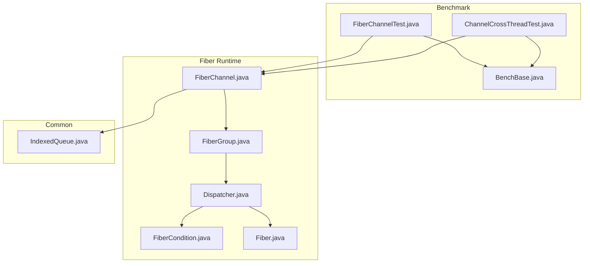
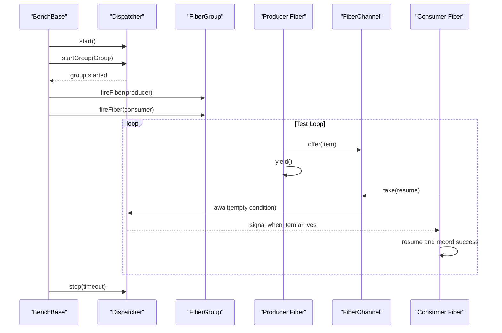
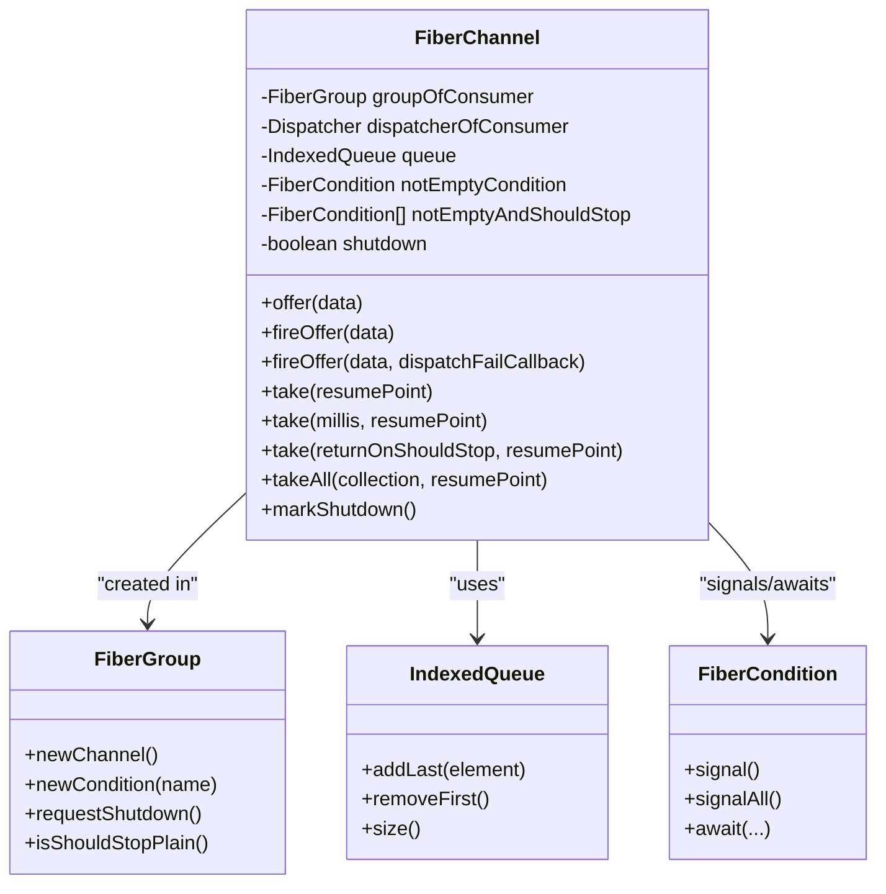
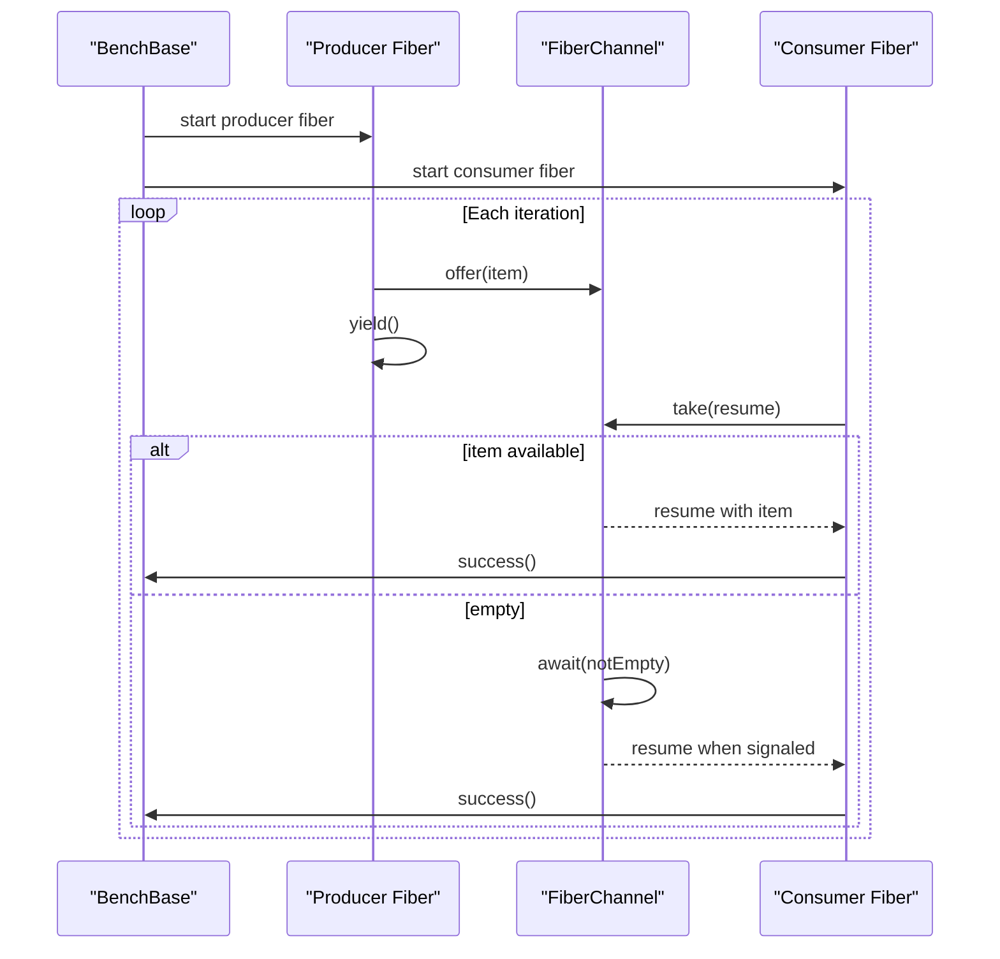
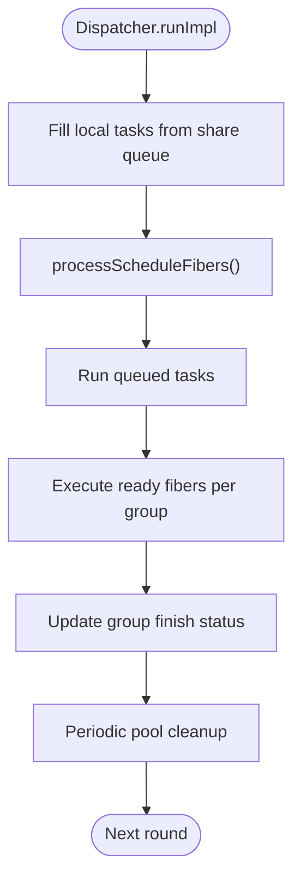
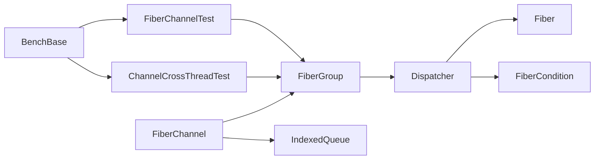

# Fiber Channel Communication

<cite>
**Referenced Files in This Document**
- [FiberChannelTest.java](file://benchmark/src/main/java/com/github/dtprj/dongting/bench/fiber/FiberChannelTest.java)
- [ChannelCrossThreadTest.java](file://benchmark/src/main/java/com/github/dtprj/dongting/bench/fiber/ChannelCrossThreadTest.java)
- [BenchBase.java](file://benchmark/src/main/java/com/github/dtprj/dongting/bench/common/BenchBase.java)
- [FiberChannel.java](file://server/src/main/java/com/github/dtprj/dongting/fiber/FiberChannel.java)
- [FiberGroup.java](file://server/src/main/java/com/github/dtprj/dongting/fiber/FiberGroup.java)
- [Dispatcher.java](file://server/src/main/java/com/github/dtprj/dongting/fiber/Dispatcher.java)
- [FiberCondition.java](file://server/src/main/java/com/github/dtprj/dongting/fiber/FiberCondition.java)
- [Fiber.java](file://server/src/main/java/com/github/dtprj/dongting/fiber/Fiber.java)
- [IndexedQueue.java](file://client/src/main/java/com/github/dtprj/dongting/common/IndexedQueue.java)
</cite>

## Table of Contents
1. [Introduction](#introduction)
2. [Project Structure](#project-structure)
3. [Core Components](#core-components)
4. [Architecture Overview](#architecture-overview)
5. [Detailed Component Analysis](#detailed-component-analysis)
6. [Dependency Analysis](#dependency-analysis)
7. [Performance Considerations](#performance-considerations)
8. [Troubleshooting Guide](#troubleshooting-guide)
9. [Conclusion](#conclusion)
10. [Appendices](#appendices)

## Introduction
This document explains the fiber channel communication benchmarking focused on FiberChannelTest and FiberChannel implementation. It details the producer-consumer pattern used in the benchmark, including channel capacity, blocking behavior, and message passing efficiency. It also documents the methodology for measuring throughput, latency, and contention under high concurrency, and provides guidance on interpreting results related to fiber synchronization, dispatcher efficiency, and backpressure handling. Practical examples show how to modify channel configuration and analyze performance under varying loads.

## Project Structure
The benchmarking code resides under the benchmark module, while the core fiber runtime and channel implementation live under the server module. The benchmark harness uses a shared base class to coordinate warmup, test runs, and shutdown, and reports aggregated statistics.

**Diagram sources**
- [FiberChannelTest.java](file://benchmark/src/main/java/com/github/dtprj/dongting/bench/fiber/FiberChannelTest.java#L1-L100)
- [ChannelCrossThreadTest.java](file://benchmark/src/main/java/com/github/dtprj/dongting/bench/fiber/ChannelCrossThreadTest.java#L1-L79)
- [BenchBase.java](file://benchmark/src/main/java/com/github/dtprj/dongting/bench/common/BenchBase.java#L1-L153)
- [FiberChannel.java](file://server/src/main/java/com/github/dtprj/dongting/fiber/FiberChannel.java#L1-L197)
- [FiberGroup.java](file://server/src/main/java/com/github/dtprj/dongting/fiber/FiberGroup.java#L1-L353)
- [Dispatcher.java](file://server/src/main/java/com/github/dtprj/dongting/fiber/Dispatcher.java#L1-L655)
- [FiberCondition.java](file://server/src/main/java/com/github/dtprj/dongting/fiber/FiberCondition.java#L1-L99)
- [Fiber.java](file://server/src/main/java/com/github/dtprj/dongting/fiber/Fiber.java#L1-L200)
- [IndexedQueue.java](file://client/src/main/java/com/github/dtprj/dongting/common/IndexedQueue.java#L1-L120)

**Section sources**
- [FiberChannelTest.java](file://benchmark/src/main/java/com/github/dtprj/dongting/bench/fiber/FiberChannelTest.java#L1-L100)
- [ChannelCrossThreadTest.java](file://benchmark/src/main/java/com/github/dtprj/dongting/bench/fiber/ChannelCrossThreadTest.java#L1-L79)
- [BenchBase.java](file://benchmark/src/main/java/com/github/dtprj/dongting/bench/common/BenchBase.java#L1-L153)

## Core Components
- FiberChannel: An unbounded, single-producer-many-consumer channel that blocks only consumers when empty. It uses an internal queue and condition signaling to coordinate producers and consumers.
- FiberGroup: A container for fibers and channels, managing scheduling, readiness queues, and shutdown coordination.
- Dispatcher: The central scheduler that executes fibers, manages ready queues, schedules sleep/waits, and coordinates group lifecycle.
- BenchBase: A benchmark harness that orchestrates warmup, test phase, and shutdown, aggregating success/failure counts and optionally timing metrics.

Key implementation highlights:
- Channel capacity: Unbounded queue; producers never block on offer, but consumers block on take when empty.
- Blocking behavior: Consumers await on a condition; producers can enqueue and yield to cooperatively schedule.
- Synchronization: Uses fiber conditions and dispatcher await/signal mechanisms for cooperative blocking.

**Section sources**
- [FiberChannel.java](file://server/src/main/java/com/github/dtprj/dongting/fiber/FiberChannel.java#L1-L197)
- [FiberGroup.java](file://server/src/main/java/com/github/dtprj/dongting/fiber/FiberGroup.java#L1-L353)
- [Dispatcher.java](file://server/src/main/java/com/github/dtprj/dongting/fiber/Dispatcher.java#L1-L655)
- [BenchBase.java](file://benchmark/src/main/java/com/github/dtprj/dongting/bench/common/BenchBase.java#L1-L153)

## Architecture Overview
The benchmark sets up a dispatcher and a fiber group, then spawns equal numbers of producer and consumer fibers. Producers offer items into a shared channel and yield; consumers take items and resume the benchmark loop. The dispatcher schedules fibers cooperatively, and the channel’s condition signals wake blocked consumers.

**Diagram sources**
- [FiberChannelTest.java](file://benchmark/src/main/java/com/github/dtprj/dongting/bench/fiber/FiberChannelTest.java#L38-L84)
- [FiberChannel.java](file://server/src/main/java/com/github/dtprj/dongting/fiber/FiberChannel.java#L92-L133)
- [FiberGroup.java](file://server/src/main/java/com/github/dtprj/dongting/fiber/FiberGroup.java#L124-L142)
- [Dispatcher.java](file://server/src/main/java/com/github/dtprj/dongting/fiber/Dispatcher.java#L422-L463)

## Detailed Component Analysis

### FiberChannel Implementation
FiberChannel provides:
- Offer methods: synchronous offer and asynchronous fireOffer that enqueues work on the dispatcher thread.
- Take methods: single-element and batch takeAll with optional timeout and early-return-on-stop semantics.
- Internal queue: an indexed queue with power-of-two capacity sizing.
- Conditions: notEmpty condition to block consumers; optional combined condition with group should-stop.

Behavioral notes:
- Unbounded queue: producers never block; backpressure is handled by consumer scheduling and batching.
- Single-consumer blocking: consumers block on empty; signaling occurs when the first element is added.
- Shutdown handling: offers can be rejected if the group is shutting down, with optional callback.

**Diagram sources**
- [FiberChannel.java](file://server/src/main/java/com/github/dtprj/dongting/fiber/FiberChannel.java#L1-L197)
- [FiberGroup.java](file://server/src/main/java/com/github/dtprj/dongting/fiber/FiberGroup.java#L124-L142)
- [IndexedQueue.java](file://client/src/main/java/com/github/dtprj/dongting/common/IndexedQueue.java#L1-L120)
- [FiberCondition.java](file://server/src/main/java/com/github/dtprj/dongting/fiber/FiberCondition.java#L1-L99)

**Section sources**
- [FiberChannel.java](file://server/src/main/java/com/github/dtprj/dongting/fiber/FiberChannel.java#L1-L197)
- [IndexedQueue.java](file://client/src/main/java/com/github/dtprj/dongting/common/IndexedQueue.java#L1-L120)

### Producer-Consumer Benchmark Pattern
The benchmarks demonstrate:
- Warmup and test phases managed by BenchBase.
- Producer fibers offering items and yielding to cooperatively schedule.
- Consumer fibers taking items and resuming the benchmark loop to record success.
- Cross-thread producer scenario using fireOffer to enqueue work on the dispatcher thread.

**Diagram sources**
- [FiberChannelTest.java](file://benchmark/src/main/java/com/github/dtprj/dongting/bench/fiber/FiberChannelTest.java#L46-L84)
- [FiberChannel.java](file://server/src/main/java/com/github/dtprj/dongting/fiber/FiberChannel.java#L92-L133)
- [BenchBase.java](file://benchmark/src/main/java/com/github/dtprj/dongting/bench/common/BenchBase.java#L65-L126)

**Section sources**
- [FiberChannelTest.java](file://benchmark/src/main/java/com/github/dtprj/dongting/bench/fiber/FiberChannelTest.java#L38-L84)
- [ChannelCrossThreadTest.java](file://benchmark/src/main/java/com/github/dtprj/dongting/bench/fiber/ChannelCrossThreadTest.java#L38-L78)
- [BenchBase.java](file://benchmark/src/main/java/com/github/dtprj/dongting/bench/common/BenchBase.java#L65-L126)

### Dispatcher and Fiber Scheduling
The dispatcher:
- Manages a shared queue of tasks and ready groups.
- Drains tasks, processes scheduled fibers, and executes ready fibers in a round-robin manner.
- Implements awaitOn to suspend fibers on conditions or timeouts, and resumes them upon signals.
- Supports sleep, yield, and interruption semantics.

**Diagram sources**
- [Dispatcher.java](file://server/src/main/java/com/github/dtprj/dongting/fiber/Dispatcher.java#L176-L211)
- [Dispatcher.java](file://server/src/main/java/com/github/dtprj/dongting/fiber/Dispatcher.java#L246-L281)
- [Dispatcher.java](file://server/src/main/java/com/github/dtprj/dongting/fiber/Dispatcher.java#L213-L236)

**Section sources**
- [Dispatcher.java](file://server/src/main/java/com/github/dtprj/dongting/fiber/Dispatcher.java#L148-L211)
- [Dispatcher.java](file://server/src/main/java/com/github/dtprj/dongting/fiber/Dispatcher.java#L246-L329)

### Channel Capacity, Backpressure, and Fairness
- Capacity: The channel uses an unbounded IndexedQueue. Producers never block on offer; consumers block on take when empty.
- Backpressure: Excessive producers increase queue length; consumers must keep pace to avoid memory growth. Batch takeAll can improve throughput under load.
- Fairness: Consumers are woken by the notEmpty condition; fairness depends on the dispatcher’s scheduling order and whether producers yield cooperatively.

Practical tuning tips:
- Increase consumer concurrency to match producer rate.
- Use takeAll to reduce per-item overhead under high throughput.
- Monitor queue size and adjust producer rates to prevent unbounded growth.

**Section sources**
- [FiberChannel.java](file://server/src/main/java/com/github/dtprj/dongting/fiber/FiberChannel.java#L27-L31)
- [FiberChannel.java](file://server/src/main/java/com/github/dtprj/dongting/fiber/FiberChannel.java#L82-L87)
- [FiberChannel.java](file://server/src/main/java/com/github/dtprj/dongting/fiber/FiberChannel.java#L139-L191)
- [IndexedQueue.java](file://client/src/main/java/com/github/dtprj/dongting/common/IndexedQueue.java#L1-L120)

### Throughput, Latency, and Contention Measurement
Methodology:
- Throughput: BenchBase aggregates success counts and prints operations per millisecond during test phase.
- Latency: BenchBase optionally logs per-iteration runtime and maintains max/avg latencies when enabled.
- Contention: Observe queue growth and dispatcher work/poll timing via performance callbacks.

Interpretation:
- High success rate with low latency indicates efficient dispatcher scheduling and balanced producer/consumer rates.
- Growing queue length suggests producers outpace consumers; consider adding consumers or batching takes.
- Elevated dispatcher work time may indicate heavy task processing or frequent context switches.

**Section sources**
- [BenchBase.java](file://benchmark/src/main/java/com/github/dtprj/dongting/bench/common/BenchBase.java#L65-L126)
- [BenchBase.java](file://benchmark/src/main/java/com/github/dtprj/dongting/bench/common/BenchBase.java#L90-L104)
- [Dispatcher.java](file://server/src/main/java/com/github/dtprj/dongting/fiber/Dispatcher.java#L176-L211)

### Test Setup and Scalability
- Thread count controls the number of producer/consumer pairs.
- Test time and warmup time define the measurement window.
- Cross-thread producer variant demonstrates fireOffer usage to enqueue work from external threads.

Scalability guidance:
- Increase threadCount to scale producers/consumers proportionally.
- Monitor queue size and dispatcher performance; adjust threadCount until queue remains bounded and latency remains acceptable.
- Use takeAll to improve throughput under high load.

**Section sources**
- [FiberChannelTest.java](file://benchmark/src/main/java/com/github/dtprj/dongting/bench/fiber/FiberChannelTest.java#L38-L44)
- [ChannelCrossThreadTest.java](file://benchmark/src/main/java/com/github/dtprj/dongting/bench/fiber/ChannelCrossThreadTest.java#L38-L44)
- [BenchBase.java](file://benchmark/src/main/java/com/github/dtprj/dongting/bench/common/BenchBase.java#L48-L54)

### Modifying Channel Configuration and Analyzing Performance
- Channel initialization: The channel constructor accepts an initial capacity; the default is set inside the channel. Adjusting this affects initial allocation behavior.
- Shutdown handling: markShutdown can be used to signal that offers should be rejected; a dispatch failure callback can be provided to handle rejections.
- Performance tuning:
  - Prefer takeAll for bulk consumption under load.
  - Use return-on-stop semantics to accelerate shutdown.
  - Tune producer yields and consumer batch sizes to balance CPU and memory.

**Section sources**
- [FiberChannel.java](file://server/src/main/java/com/github/dtprj/dongting/fiber/FiberChannel.java#L41-L51)
- [FiberChannel.java](file://server/src/main/java/com/github/dtprj/dongting/fiber/FiberChannel.java#L193-L196)

## Dependency Analysis
The following diagram shows key dependencies among components used in the benchmark and channel operation.

**Diagram sources**
- [FiberChannelTest.java](file://benchmark/src/main/java/com/github/dtprj/dongting/bench/fiber/FiberChannelTest.java#L1-L100)
- [ChannelCrossThreadTest.java](file://benchmark/src/main/java/com/github/dtprj/dongting/bench/fiber/ChannelCrossThreadTest.java#L1-L79)
- [FiberChannel.java](file://server/src/main/java/com/github/dtprj/dongting/fiber/FiberChannel.java#L1-L197)
- [FiberGroup.java](file://server/src/main/java/com/github/dtprj/dongting/fiber/FiberGroup.java#L1-L353)
- [Dispatcher.java](file://server/src/main/java/com/github/dtprj/dongting/fiber/Dispatcher.java#L1-L655)
- [Fiber.java](file://server/src/main/java/com/github/dtprj/dongting/fiber/Fiber.java#L1-L200)
- [FiberCondition.java](file://server/src/main/java/com/github/dtprj/dongting/fiber/FiberCondition.java#L1-L99)
- [IndexedQueue.java](file://client/src/main/java/com/github/dtprj/dongting/common/IndexedQueue.java#L1-L120)

**Section sources**
- [FiberChannelTest.java](file://benchmark/src/main/java/com/github/dtprj/dongting/bench/fiber/FiberChannelTest.java#L1-L100)
- [ChannelCrossThreadTest.java](file://benchmark/src/main/java/com/github/dtprj/dongting/bench/fiber/ChannelCrossThreadTest.java#L1-L79)
- [FiberChannel.java](file://server/src/main/java/com/github/dtprj/dongting/fiber/FiberChannel.java#L1-L197)
- [FiberGroup.java](file://server/src/main/java/com/github/dtprj/dongting/fiber/FiberGroup.java#L1-L353)
- [Dispatcher.java](file://server/src/main/java/com/github/dtprj/dongting/fiber/Dispatcher.java#L1-L655)

## Performance Considerations
- Producer-consumer balance: Ensure consumer throughput matches producer rate to avoid queue growth.
- Batching: Use takeAll to reduce per-item overhead under high load.
- Yielding: Producers should yield to allow consumers to run; otherwise, producers dominate the scheduler.
- Shutdown: Use return-on-stop semantics to speed up graceful termination.
- Memory footprint: Unbounded queue can grow; monitor and tune producer rates accordingly.

[No sources needed since this section provides general guidance]

## Troubleshooting Guide
Common issues and remedies:
- Consumers starved: Increase consumer thread count or use takeAll to consume in batches.
- Queue growth: Reduce producer rate or add more consumers; consider adjusting initial capacity.
- Slow shutdown: Enable return-on-stop semantics and ensure consumers check should-stop conditions.
- Dispatcher stalls: Verify that producers yield and that tasks are not blocking the dispatcher thread.

**Section sources**
- [FiberChannel.java](file://server/src/main/java/com/github/dtprj/dongting/fiber/FiberChannel.java#L118-L133)
- [FiberChannel.java](file://server/src/main/java/com/github/dtprj/dongting/fiber/FiberChannel.java#L168-L183)
- [FiberGroup.java](file://server/src/main/java/com/github/dtprj/dongting/fiber/FiberGroup.java#L94-L110)
- [Dispatcher.java](file://server/src/main/java/com/github/dtprj/dongting/fiber/Dispatcher.java#L477-L491)

## Conclusion
The fiber channel benchmark demonstrates a scalable producer-consumer model with cooperative scheduling. FiberChannel’s unbounded queue and consumer-only blocking provide efficient throughput under moderate loads, with clear mechanisms for batching, shutdown, and backpressure awareness. BenchBase provides robust measurement of throughput and latency, enabling informed tuning of producer/consumer ratios and batching strategies.

[No sources needed since this section summarizes without analyzing specific files]

## Appendices

### Benchmark Execution and Metrics
- Execution: Run the main methods in FiberChannelTest or ChannelCrossThreadTest with desired thread count, test time, and warmup time.
- Metrics: Success counts and operations per millisecond are printed automatically; optional latency logging can be enabled via BenchBase.

**Section sources**
- [FiberChannelTest.java](file://benchmark/src/main/java/com/github/dtprj/dongting/bench/fiber/FiberChannelTest.java#L38-L44)
- [ChannelCrossThreadTest.java](file://benchmark/src/main/java/com/github/dtprj/dongting/bench/fiber/ChannelCrossThreadTest.java#L38-L44)
- [BenchBase.java](file://benchmark/src/main/java/com/github/dtprj/dongting/bench/common/BenchBase.java#L90-L104)