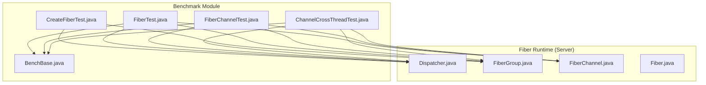
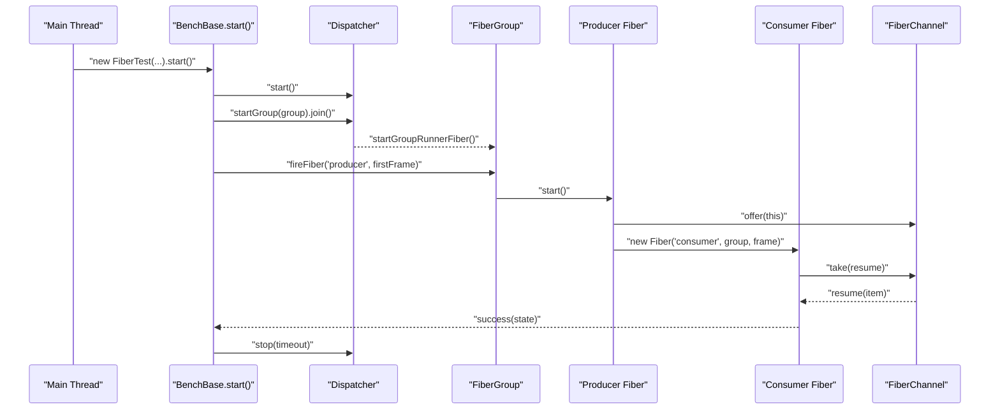
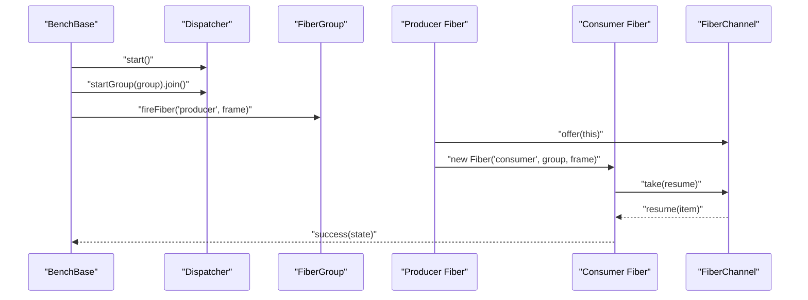
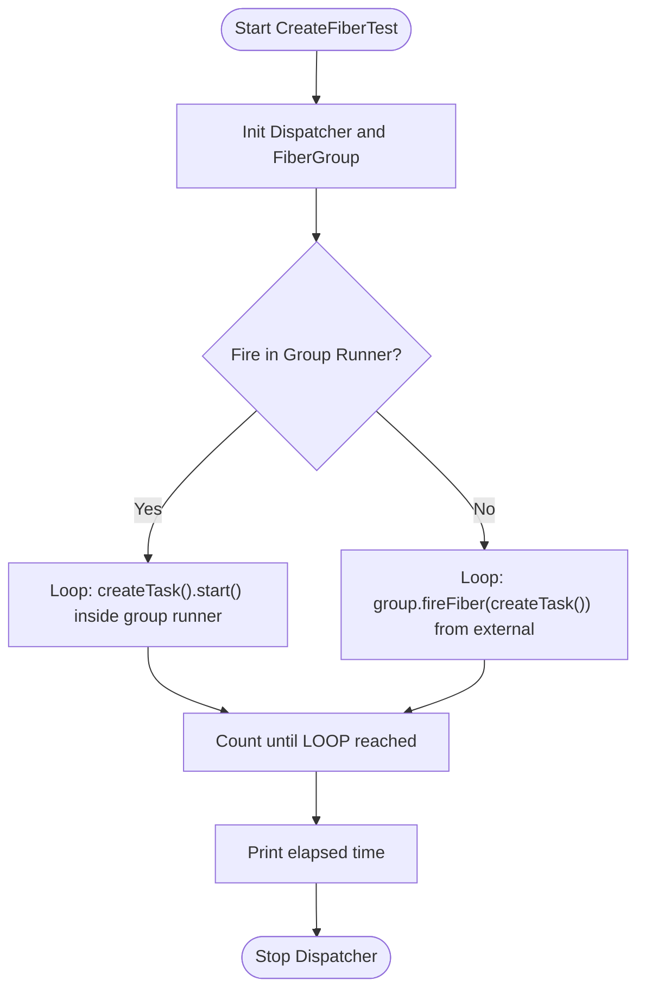
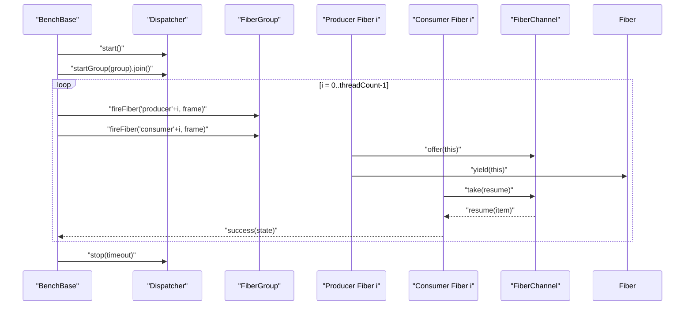
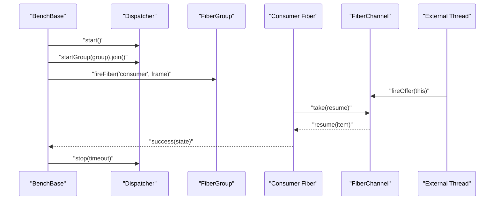
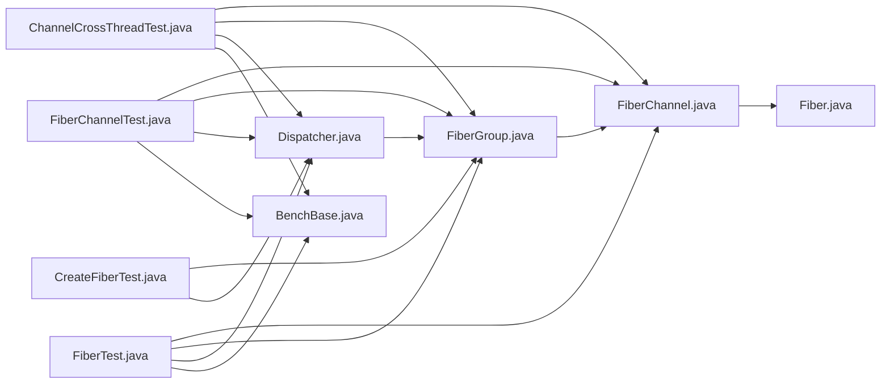

# Fiber Concurrency Benchmarking

<cite>
**Referenced Files in This Document**
- [FiberTest.java](file://benchmark/src/main/java/com/github/dtprj/dongting/bench/fiber/FiberTest.java)
- [CreateFiberTest.java](file://benchmark/src/main/java/com/github/dtprj/dongting/bench/fiber/CreateFiberTest.java)
- [FiberChannelTest.java](file://benchmark/src/main/java/com/github/dtprj/dongting/bench/fiber/FiberChannelTest.java)
- [ChannelCrossThreadTest.java](file://benchmark/src/main/java/com/github/dtprj/dongting/bench/fiber/ChannelCrossThreadTest.java)
- [BenchBase.java](file://benchmark/src/main/java/com/github/dtprj/dongting/bench/common/BenchBase.java)
- [Dispatcher.java](file://server/src/main/java/com/github/dtprj/dongting/fiber/Dispatcher.java)
- [FiberGroup.java](file://server/src/main/java/com/github/dtprj/dongting/fiber/FiberGroup.java)
- [FiberChannel.java](file://server/src/main/java/com/github/dtprj/dongting/fiber/FiberChannel.java)
- [Fiber.java](file://server/src/main/java/com/github/dtprj/dongting/fiber/Fiber.java)
- [TestProps.java](file://benchmark/src/main/java/com/github/dtprj/dongting/bench/common/TestProps.java)
</cite>

## Table of Contents
1. [Introduction](#introduction)
2. [Project Structure](#project-structure)
3. [Core Components](#core-components)
4. [Architecture Overview](#architecture-overview)
5. [Detailed Component Analysis](#detailed-component-analysis)
6. [Dependency Analysis](#dependency-analysis)
7. [Performance Considerations](#performance-considerations)
8. [Troubleshooting Guide](#troubleshooting-guide)
9. [Conclusion](#conclusion)
10. [Appendices](#appendices)

## Introduction
This document explains the fiber concurrency benchmarking suite focusing on three key test classes: FiberTest, CreateFiberTest, and FiberChannelTest. It describes how the benchmarks initialize the fiber runtime (Dispatcher and FiberGroup), build producer-consumer patterns using FiberChannel, and measure fiber creation overhead, context switching performance, and channel communication latency. It also provides guidance on interpreting results related to fiber lifecycle management, dispatcher thread efficiency, and channel throughput, along with practical tips for adjusting benchmark parameters and comparing fiber-based concurrency to traditional threading.

## Project Structure
The fiber benchmarking code resides under the benchmark module, with shared benchmark infrastructure in BenchBase. The fiber runtime (Dispatcher, FiberGroup, FiberChannel, Fiber) lives in the server module. The tests demonstrate:
- FiberTest: a minimal producer-consumer loop with dynamic consumer creation
- CreateFiberTest: measuring fiber creation cost over a large loop
- FiberChannelTest: multi-producer, multi-consumer channel throughput
- ChannelCrossThreadTest: cross-thread channel operations

**Diagram sources**
- [FiberTest.java](file://benchmark/src/main/java/com/github/dtprj/dongting/bench/fiber/FiberTest.java#L1-L89)
- [CreateFiberTest.java](file://benchmark/src/main/java/com/github/dtprj/dongting/bench/fiber/CreateFiberTest.java#L1-L112)
- [FiberChannelTest.java](file://benchmark/src/main/java/com/github/dtprj/dongting/bench/fiber/FiberChannelTest.java#L1-L100)
- [ChannelCrossThreadTest.java](file://benchmark/src/main/java/com/github/dtprj/dongting/bench/fiber/ChannelCrossThreadTest.java#L1-L79)
- [BenchBase.java](file://benchmark/src/main/java/com/github/dtprj/dongting/bench/common/BenchBase.java#L1-L153)
- [Dispatcher.java](file://server/src/main/java/com/github/dtprj/dongting/fiber/Dispatcher.java#L1-L200)
- [FiberGroup.java](file://server/src/main/java/com/github/dtprj/dongting/fiber/FiberGroup.java#L1-L200)
- [FiberChannel.java](file://server/src/main/java/com/github/dtprj/dongting/fiber/FiberChannel.java#L1-L197)
- [Fiber.java](file://server/src/main/java/com/github/dtprj/dongting/fiber/Fiber.java#L1-L200)

**Section sources**
- [FiberTest.java](file://benchmark/src/main/java/com/github/dtprj/dongting/bench/fiber/FiberTest.java#L1-L89)
- [CreateFiberTest.java](file://benchmark/src/main/java/com/github/dtprj/dongting/bench/fiber/CreateFiberTest.java#L1-L112)
- [FiberChannelTest.java](file://benchmark/src/main/java/com/github/dtprj/dongting/bench/fiber/FiberChannelTest.java#L1-L100)
- [ChannelCrossThreadTest.java](file://benchmark/src/main/java/com/github/dtprj/dongting/bench/fiber/ChannelCrossThreadTest.java#L1-L79)
- [BenchBase.java](file://benchmark/src/main/java/com/github/dtprj/dongting/bench/common/BenchBase.java#L1-L153)

## Core Components
- BenchBase: Provides the benchmark harness with warmup, test, and shutdown phases, plus counters and timing hooks for reporting throughput and latency.
- FiberTest: Demonstrates a producer-consumer pattern where a producer creates a consumer dynamically and measures completion latency.
- CreateFiberTest: Measures fiber creation overhead by starting many fibers in a tight loop, optionally firing them from within a group runner.
- FiberChannelTest: Multi-producer, multi-consumer channel throughput benchmark with explicit producer/consumer fiber pairs.
- ChannelCrossThreadTest: Cross-thread channel operations where a non-group thread offers items into a channel owned by a FiberGroup.
- Dispatcher: The central scheduler thread that runs the event loop, manages groups, and schedules fibers.
- FiberGroup: A container for fibers and synchronization primitives; creates channels, locks, futures, conditions, and starts a group runner fiber.
- FiberChannel: An unbounded, consumer-blocking channel with await/resume semantics and support for cross-thread offer operations.
- Fiber: The fiber abstraction with frame-based execution, yield/sleep, join, and interruption.

**Section sources**
- [BenchBase.java](file://benchmark/src/main/java/com/github/dtprj/dongting/bench/common/BenchBase.java#L1-L153)
- [FiberTest.java](file://benchmark/src/main/java/com/github/dtprj/dongting/bench/fiber/FiberTest.java#L1-L89)
- [CreateFiberTest.java](file://benchmark/src/main/java/com/github/dtprj/dongting/bench/fiber/CreateFiberTest.java#L1-L112)
- [FiberChannelTest.java](file://benchmark/src/main/java/com/github/dtprj/dongting/bench/fiber/FiberChannelTest.java#L1-L100)
- [ChannelCrossThreadTest.java](file://benchmark/src/main/java/com/github/dtprj/dongting/bench/fiber/ChannelCrossThreadTest.java#L1-L79)
- [Dispatcher.java](file://server/src/main/java/com/github/dtprj/dongting/fiber/Dispatcher.java#L1-L200)
- [FiberGroup.java](file://server/src/main/java/com/github/dtprj/dongting/fiber/FiberGroup.java#L1-L200)
- [FiberChannel.java](file://server/src/main/java/com/github/dtprj/dongting/fiber/FiberChannel.java#L1-L197)
- [Fiber.java](file://server/src/main/java/com/github/dtprj/dongting/fiber/Fiber.java#L1-L200)

## Architecture Overview
The benchmarks rely on a single Dispatcher thread that drives scheduling and execution across one or more FiberGroup instances. Each FiberGroup maintains queues of ready fibers and synchronization primitives (conditions, futures, channels). Tests initialize the Dispatcher, start a group, and then spawn producer/consumer fibers or create many fibers to measure overhead.

**Diagram sources**
- [FiberTest.java](file://benchmark/src/main/java/com/github/dtprj/dongting/bench/fiber/FiberTest.java#L1-L89)
- [BenchBase.java](file://benchmark/src/main/java/com/github/dtprj/dongting/bench/common/BenchBase.java#L1-L153)
- [Dispatcher.java](file://server/src/main/java/com/github/dtprj/dongting/fiber/Dispatcher.java#L1-L200)
- [FiberGroup.java](file://server/src/main/java/com/github/dtprj/dongting/fiber/FiberGroup.java#L1-L200)
- [FiberChannel.java](file://server/src/main/java/com/github/dtprj/dongting/fiber/FiberChannel.java#L1-L197)

## Detailed Component Analysis

### FiberTest: Producer-Consumer with Dynamic Consumer Creation
- Initializes a Dispatcher and a FiberGroup, then creates a channel bound to the group.
- Starts a producer fiber that offers itself to the channel and spawns a consumer fiber on demand.
- The consumer fiber waits on the channel and resumes upon receiving an item, then reports success.
- Warmup and test phases are managed by BenchBase; shutdown stops the Dispatcher.

Key measurement focus:
- Context switching and scheduling overhead between producer and consumer.
- Latency from offer to consumer resume.
- Throughput of the producer-consumer loop.

**Diagram sources**
- [FiberTest.java](file://benchmark/src/main/java/com/github/dtprj/dongting/bench/fiber/FiberTest.java#L1-L89)
- [BenchBase.java](file://benchmark/src/main/java/com/github/dtprj/dongting/bench/common/BenchBase.java#L1-L153)
- [FiberChannel.java](file://server/src/main/java/com/github/dtprj/dongting/fiber/FiberChannel.java#L1-L197)

**Section sources**
- [FiberTest.java](file://benchmark/src/main/java/com/github/dtprj/dongting/bench/fiber/FiberTest.java#L1-L89)
- [BenchBase.java](file://benchmark/src/main/java/com/github/dtprj/dongting/bench/common/BenchBase.java#L1-L153)

### CreateFiberTest: Measuring Fiber Creation Overhead
- Initializes a Dispatcher and a FiberGroup, then measures the time to create and start N fibers.
- Supports two modes:
  - Fire fibers from within a group runner fiber (FIRE_FIBER_IN_GROUP = true)
  - Fire fibers from external threads (FIRE_FIBER_IN_GROUP = false)
- Reports total elapsed time for creating and starting all fibers.

Methodology:
- Warmup is implicit via the benchmark harness.
- The test focuses on fiber allocation, frame setup, and scheduling overhead.
- Comparing the two modes helps assess the impact of group runner context on fiber creation.

**Diagram sources**
- [CreateFiberTest.java](file://benchmark/src/main/java/com/github/dtprj/dongting/bench/fiber/CreateFiberTest.java#L1-L112)
- [Dispatcher.java](file://server/src/main/java/com/github/dtprj/dongting/fiber/Dispatcher.java#L1-L200)
- [FiberGroup.java](file://server/src/main/java/com/github/dtprj/dongting/fiber/FiberGroup.java#L1-L200)

**Section sources**
- [CreateFiberTest.java](file://benchmark/src/main/java/com/github/dtprj/dongting/bench/fiber/CreateFiberTest.java#L1-L112)

### FiberChannelTest: Multi-Producer, Multi-Consumer Throughput
- Initializes a Dispatcher and a FiberGroup, then creates a channel bound to the group.
- Spawns multiple producers and consumers, each pair operating independently.
- Producers offer items and yield; consumers take items and resume, reporting success during the test phase.

Methodology:
- Measures channel throughput under load with multiple concurrent producers/consumers.
- Uses BenchBase counters to compute operations per second during the test window.
- Shutdown gracefully stops the Dispatcher.

**Diagram sources**
- [FiberChannelTest.java](file://benchmark/src/main/java/com/github/dtprj/dongting/bench/fiber/FiberChannelTest.java#L1-L100)
- [BenchBase.java](file://benchmark/src/main/java/com/github/dtprj/dongting/bench/common/BenchBase.java#L1-L153)
- [FiberChannel.java](file://server/src/main/java/com/github/dtprj/dongting/fiber/FiberChannel.java#L1-L197)

**Section sources**
- [FiberChannelTest.java](file://benchmark/src/main/java/com/github/dtprj/dongting/bench/fiber/FiberChannelTest.java#L1-L100)
- [BenchBase.java](file://benchmark/src/main/java/com/github/dtprj/dongting/bench/common/BenchBase.java#L1-L153)

### ChannelCrossThreadTest: Cross-Thread Channel Operations
- Demonstrates offering items from a non-group thread into a channel owned by a FiberGroup.
- The consumer fiber awaits on the channel and resumes upon receiving an item, reporting success.

Methodology:
- Validates cross-thread channel operations and measures latency from offer to resume.
- Useful for scenarios where producers operate outside the fiber runtime context.

**Diagram sources**
- [ChannelCrossThreadTest.java](file://benchmark/src/main/java/com/github/dtprj/dongting/bench/fiber/ChannelCrossThreadTest.java#L1-L79)
- [FiberChannel.java](file://server/src/main/java/com/github/dtprj/dongting/fiber/FiberChannel.java#L1-L197)

**Section sources**
- [ChannelCrossThreadTest.java](file://benchmark/src/main/java/com/github/dtprj/dongting/bench/fiber/ChannelCrossThreadTest.java#L1-L79)

## Dependency Analysis
The benchmarks depend on the fiber runtime components. The following diagram shows the primary dependencies among the benchmark classes and the fiber runtime.

**Diagram sources**
- [FiberTest.java](file://benchmark/src/main/java/com/github/dtprj/dongting/bench/fiber/FiberTest.java#L1-L89)
- [CreateFiberTest.java](file://benchmark/src/main/java/com/github/dtprj/dongting/bench/fiber/CreateFiberTest.java#L1-L112)
- [FiberChannelTest.java](file://benchmark/src/main/java/com/github/dtprj/dongting/bench/fiber/FiberChannelTest.java#L1-L100)
- [ChannelCrossThreadTest.java](file://benchmark/src/main/java/com/github/dtprj/dongting/bench/fiber/ChannelCrossThreadTest.java#L1-L79)
- [BenchBase.java](file://benchmark/src/main/java/com/github/dtprj/dongting/bench/common/BenchBase.java#L1-L153)
- [Dispatcher.java](file://server/src/main/java/com/github/dtprj/dongting/fiber/Dispatcher.java#L1-L200)
- [FiberGroup.java](file://server/src/main/java/com/github/dtprj/dongting/fiber/FiberGroup.java#L1-L200)
- [FiberChannel.java](file://server/src/main/java/com/github/dtprj/dongting/fiber/FiberChannel.java#L1-L197)
- [Fiber.java](file://server/src/main/java/com/github/dtprj/dongting/fiber/Fiber.java#L1-L200)

**Section sources**
- [FiberTest.java](file://benchmark/src/main/java/com/github/dtprj/dongting/bench/fiber/FiberTest.java#L1-L89)
- [CreateFiberTest.java](file://benchmark/src/main/java/com/github/dtprj/dongting/bench/fiber/CreateFiberTest.java#L1-L112)
- [FiberChannelTest.java](file://benchmark/src/main/java/com/github/dtprj/dongting/bench/fiber/FiberChannelTest.java#L1-L100)
- [ChannelCrossThreadTest.java](file://benchmark/src/main/java/com/github/dtprj/dongting/bench/fiber/ChannelCrossThreadTest.java#L1-L79)
- [BenchBase.java](file://benchmark/src/main/java/com/github/dtprj/dongting/bench/common/BenchBase.java#L1-L153)
- [Dispatcher.java](file://server/src/main/java/com/github/dtprj/dongting/fiber/Dispatcher.java#L1-L200)
- [FiberGroup.java](file://server/src/main/java/com/github/dtprj/dongting/fiber/FiberGroup.java#L1-L200)
- [FiberChannel.java](file://server/src/main/java/com/github/dtprj/dongting/fiber/FiberChannel.java#L1-L197)
- [Fiber.java](file://server/src/main/java/com/github/dtprj/dongting/fiber/Fiber.java#L1-L200)

## Performance Considerations
- Fiber creation overhead:
  - Measure total time to create and start N fibers; compare internal vs external fire modes.
  - Consider frame setup costs and scheduling overhead.
- Context switching performance:
  - Track latency from offer to consumer resume; use BenchBase timing hooks if enabled.
  - Evaluate the impact of yielding and resuming on throughput.
- Channel communication latency:
  - Unbounded channel with consumer blocking; measure offer/take round-trip latency.
  - Assess fairness and throughput under multiple producers/consumers.
- Dispatcher thread efficiency:
  - Monitor Dispatcher’s event loop and group readiness queues.
  - Ensure sufficient threadCount to keep the dispatcher busy without oversubscription.
- Synchronization primitives:
  - Conditions and futures add coordination overhead; evaluate contention under load.
- Warmup and steady-state:
  - Use BenchBase warmup to stabilize JVM and runtime state before measuring.
  - Extend testTime to capture steady-state behavior and reduce noise.

[No sources needed since this section provides general guidance]

## Troubleshooting Guide
Common issues and remedies:
- Dispatcher not started or group not initialized:
  - Ensure BenchBase.init() is invoked and Dispatcher.start() is called before starting fibers.
- Deadlocks or stalls:
  - Verify that consumers are started and that channel take operations are paired with offers.
  - Check that shutdown is called to stop the Dispatcher and drain tasks.
- Excessive GC or memory pressure:
  - Reduce test scale (threadCount, testTime) or adjust JVM settings.
- Misconfigured parameters:
  - Confirm threadCount, testTime, and warmupTime are reasonable for the target hardware.
- Cross-thread operations:
  - Use fireOffer for cross-thread channel operations; ensure the channel belongs to the intended FiberGroup.

**Section sources**
- [FiberTest.java](file://benchmark/src/main/java/com/github/dtprj/dongting/bench/fiber/FiberTest.java#L1-L89)
- [FiberChannelTest.java](file://benchmark/src/main/java/com/github/dtprj/dongting/bench/fiber/FiberChannelTest.java#L1-L100)
- [ChannelCrossThreadTest.java](file://benchmark/src/main/java/com/github/dtprj/dongting/bench/fiber/ChannelCrossThreadTest.java#L1-L79)
- [BenchBase.java](file://benchmark/src/main/java/com/github/dtprj/dongting/bench/common/BenchBase.java#L1-L153)

## Conclusion
The fiber benchmarking suite demonstrates how to measure fiber creation overhead, context switching, and channel throughput using a minimal yet representative workload. By initializing a Dispatcher and FiberGroup, building producer-consumer patterns with FiberChannel, and leveraging BenchBase for warmup and reporting, developers can quantify fiber scheduling efficiency and synchronization costs. Adjusting threadCount, testTime, and warmupTime allows apples-to-apples comparisons with traditional threading models and helps tune the runtime for production workloads.

[No sources needed since this section summarizes without analyzing specific files]

## Appendices

### Benchmark Parameter Tuning
- threadCount:
  - Increase to saturate the Dispatcher thread; observe throughput saturation and latency growth.
  - Decrease to isolate scheduling overhead from contention.
- testTime:
  - Longer durations improve statistical stability; shorter durations reduce noise but may miss transient effects.
- warmupTime:
  - Allow JIT and runtime to stabilize; ensure warmupTime is sufficient for JVM and fiber runtime warming up.
- Additional tuning hints:
  - For CreateFiberTest, compare internal vs external fire modes to assess group runner overhead.
  - For FiberChannelTest, vary threadCount to measure scalability and fairness.

**Section sources**
- [BenchBase.java](file://benchmark/src/main/java/com/github/dtprj/dongting/bench/common/BenchBase.java#L1-L153)
- [CreateFiberTest.java](file://benchmark/src/main/java/com/github/dtprj/dongting/bench/fiber/CreateFiberTest.java#L1-L112)
- [FiberChannelTest.java](file://benchmark/src/main/java/com/github/dtprj/dongting/bench/fiber/FiberChannelTest.java#L1-L100)

### Interpreting Results
- Fiber creation overhead:
  - Lower total time indicates efficient fiber allocation and scheduling.
  - Compare internal vs external fire modes to understand group runner benefits.
- Context switching and latency:
  - Shorter offer-to-resume latency implies efficient scheduling and minimal contention.
  - Use BenchBase success counters to compute ops/sec during the test window.
- Channel throughput:
  - Higher ops/sec indicates efficient channel implementation and low blocking.
  - Monitor Dispatcher logs for warnings or timeouts during shutdown.
- Dispatcher thread efficiency:
  - Ensure the Dispatcher thread remains busy; investigate idle periods or excessive wakeups.
- Channel fairness and scalability:
  - Under high contention, fairness may degrade; monitor per-producer/consumer ratios.

**Section sources**
- [BenchBase.java](file://benchmark/src/main/java/com/github/dtprj/dongting/bench/common/BenchBase.java#L1-L153)
- [FiberChannel.java](file://server/src/main/java/com/github/dtprj/dongting/fiber/FiberChannel.java#L1-L197)
- [Dispatcher.java](file://server/src/main/java/com/github/dtprj/dongting/fiber/Dispatcher.java#L1-L200)

### Configuration Options
- TestProps:
  - Centralized property loading from a user home configuration file for benchmark tuning.
  - Use for environment-specific overrides (e.g., logging, timeouts).

**Section sources**
- [TestProps.java](file://benchmark/src/main/java/com/github/dtprj/dongting/bench/common/TestProps.java#L1-L47)