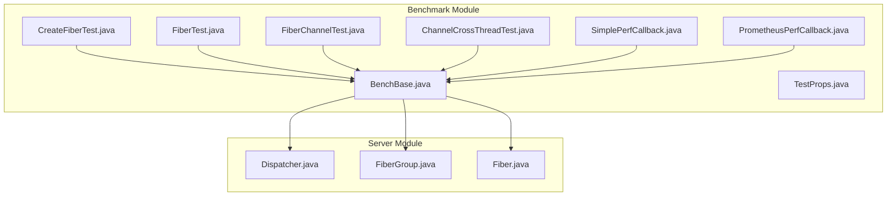
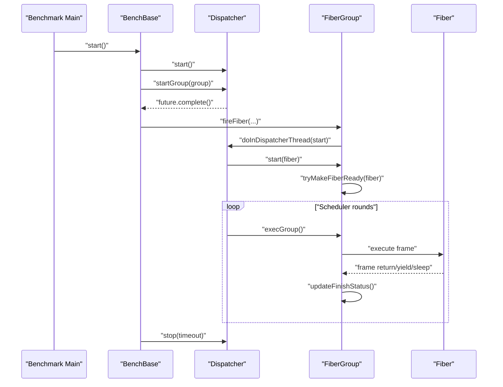
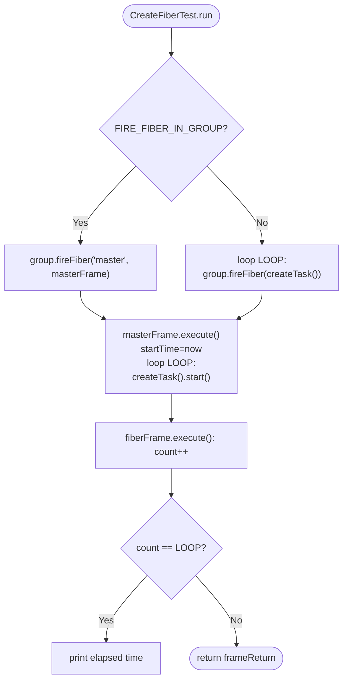
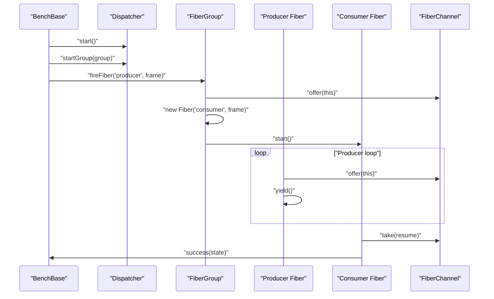
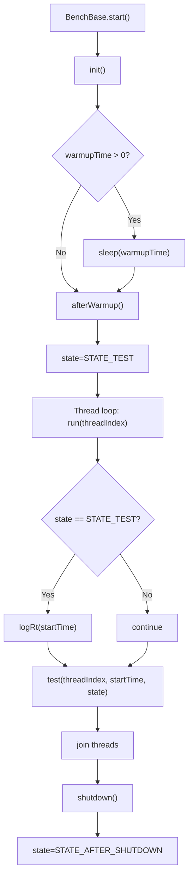
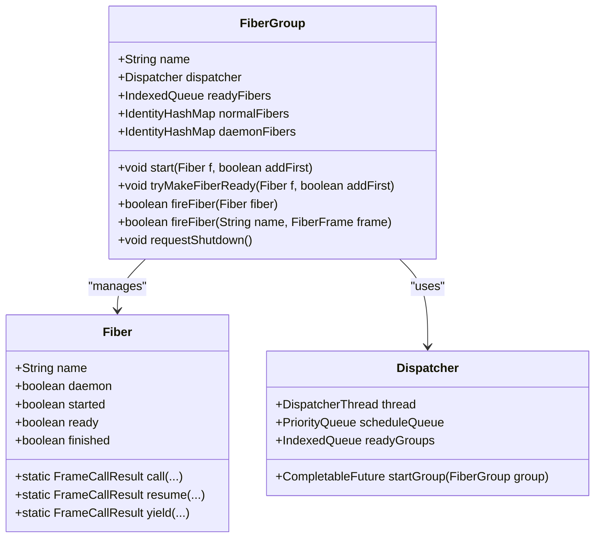
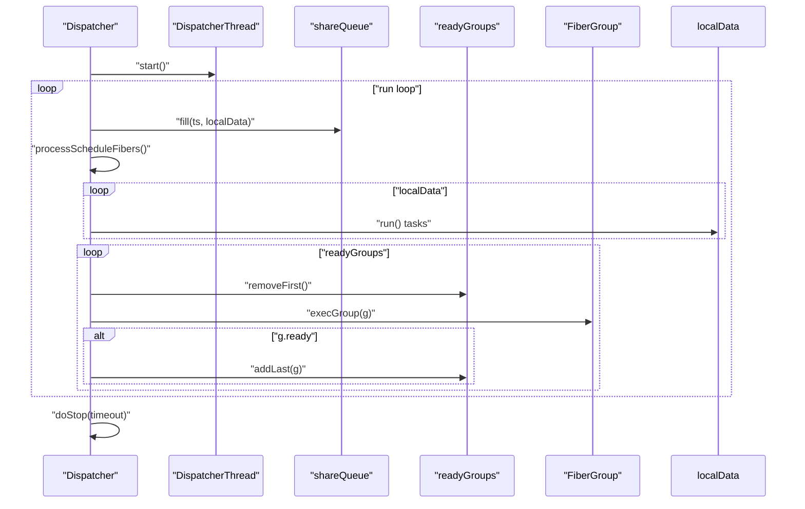
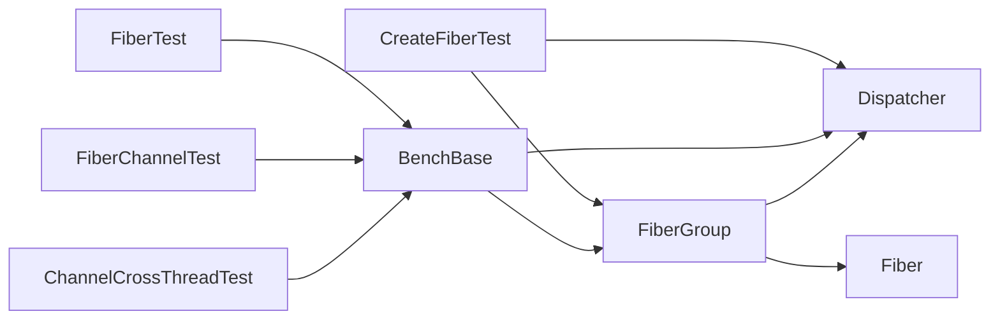

# Fiber Lifecycle Performance

<cite>
**Referenced Files in This Document**
- [CreateFiberTest.java](file://benchmark/src/main/java/com/github/dtprj/dongting/bench/fiber/CreateFiberTest.java)
- [FiberTest.java](file://benchmark/src/main/java/com/github/dtprj/dongting/bench/fiber/FiberTest.java)
- [FiberChannelTest.java](file://benchmark/src/main/java/com/github/dtprj/dongting/bench/fiber/FiberChannelTest.java)
- [ChannelCrossThreadTest.java](file://benchmark/src/main/java/com/github/dtprj/dongting/bench/fiber/ChannelCrossThreadTest.java)
- [BenchBase.java](file://benchmark/src/main/java/com/github/dtprj/dongting/bench/common/BenchBase.java)
- [TestProps.java](file://benchmark/src/main/java/com/github/dtprj/dongting/bench/common/TestProps.java)
- [SimplePerfCallback.java](file://benchmark/src/main/java/com/github/dtprj/dongting/bench/common/SimplePerfCallback.java)
- [PrometheusPerfCallback.java](file://benchmark/src/main/java/com/github/dtprj/dongting/bench/common/PrometheusPerfCallback.java)
- [FiberGroup.java](file://server/src/main/java/com/github/dtprj/dongting/fiber/FiberGroup.java)
- [Fiber.java](file://server/src/main/java/com/github/dtprj/dongting/fiber/Fiber.java)
- [Dispatcher.java](file://server/src/main/java/com/github/dtprj/dongting/fiber/Dispatcher.java)
- [benchmark/pom.xml](file://benchmark/pom.xml)
</cite>

## Table of Contents
1. [Introduction](#introduction)
2. [Project Structure](#project-structure)
3. [Core Components](#core-components)
4. [Architecture Overview](#architecture-overview)
5. [Detailed Component Analysis](#detailed-component-analysis)
6. [Dependency Analysis](#dependency-analysis)
7. [Performance Considerations](#performance-considerations)
8. [Troubleshooting Guide](#troubleshooting-guide)
9. [Conclusion](#conclusion)
10. [Appendices](#appendices)

## Introduction
This document focuses on fiber lifecycle benchmarking with an emphasis on CreateFiberTest and FiberGroup initialization. It explains how to measure fiber creation overhead, startup latency, and termination costs, and documents the test setup that evaluates fiber group management, dispatcher thread allocation, and scheduling overhead. It also analyzes results considering warmup effects, garbage collection impact, and memory footprint, and provides practical guidance for configuring test parameters such as fiber count, dispatcher thread pool size, and warmup duration. Finally, it outlines common performance bottlenecks and optimization strategies for high-throughput fiber lifecycle management.

## Project Structure
The benchmarking code resides under the benchmark module and exercises the fiber subsystem in the server module. The key files are:
- Benchmark entry points for fiber lifecycle and channel throughput
- Base benchmark harness for timing and warmup/shutdown phases
- Fiber runtime primitives: Dispatcher, FiberGroup, and Fiber
- Performance logging callbacks for metrics aggregation

**Diagram sources**
- [CreateFiberTest.java](file://benchmark/src/main/java/com/github/dtprj/dongting/bench/fiber/CreateFiberTest.java#L1-L112)
- [FiberTest.java](file://benchmark/src/main/java/com/github/dtprj/dongting/bench/fiber/FiberTest.java#L1-L89)
- [FiberChannelTest.java](file://benchmark/src/main/java/com/github/dtprj/dongting/bench/fiber/FiberChannelTest.java#L1-L100)
- [ChannelCrossThreadTest.java](file://benchmark/src/main/java/com/github/dtprj/dongting/bench/fiber/ChannelCrossThreadTest.java#L1-L79)
- [BenchBase.java](file://benchmark/src/main/java/com/github/dtprj/dongting/bench/common/BenchBase.java#L1-L153)
- [Dispatcher.java](file://server/src/main/java/com/github/dtprj/dongting/fiber/Dispatcher.java#L1-L200)
- [FiberGroup.java](file://server/src/main/java/com/github/dtprj/dongting/fiber/FiberGroup.java#L1-L353)
- [Fiber.java](file://server/src/main/java/com/github/dtprj/dongting/fiber/Fiber.java#L1-L200)

**Section sources**
- [benchmark/pom.xml](file://benchmark/pom.xml#L1-L58)

## Core Components
- CreateFiberTest: Measures fiber creation and startup latency by firing a large number of fibers and recording elapsed time. It demonstrates both direct group.fireFiber and group.fireFiber with a master fiber that spawns workers.
- FiberTest: A general-purpose benchmark harness using BenchBase to configure thread count, test time, and warmup time, and to exercise producer/consumer fiber interactions.
- FiberChannelTest: Multi-threaded producer-consumer benchmark using FiberChannel to measure cross-fiber messaging throughput.
- ChannelCrossThreadTest: Cross-thread offer/take benchmark using FiberChannel to evaluate channel throughput under contention.
- BenchBase: Provides standardized warmup, test, and shutdown phases, plus counters and timing hooks for performance measurement.
- FiberGroup: Manages fiber lifecycle within a group, tracks ready queues, and coordinates scheduling via the Dispatcher.
- Fiber: Represents individual cooperative fibers, with lifecycle methods and scheduling helpers.
- Dispatcher: Single-threaded scheduler that runs the event loop, processes scheduled tasks, and executes ready fibers.

**Section sources**
- [CreateFiberTest.java](file://benchmark/src/main/java/com/github/dtprj/dongting/bench/fiber/CreateFiberTest.java#L1-L112)
- [FiberTest.java](file://benchmark/src/main/java/com/github/dtprj/dongting/bench/fiber/FiberTest.java#L1-L89)
- [FiberChannelTest.java](file://benchmark/src/main/java/com/github/dtprj/dongting/bench/fiber/FiberChannelTest.java#L1-L100)
- [ChannelCrossThreadTest.java](file://benchmark/src/main/java/com/github/dtprj/dongting/bench/fiber/ChannelCrossThreadTest.java#L1-L79)
- [BenchBase.java](file://benchmark/src/main/java/com/github/dtprj/dongting/bench/common/BenchBase.java#L1-L153)
- [FiberGroup.java](file://server/src/main/java/com/github/dtprj/dongting/fiber/FiberGroup.java#L1-L353)
- [Fiber.java](file://server/src/main/java/com/github/dtprj/dongting/fiber/Fiber.java#L1-L200)
- [Dispatcher.java](file://server/src/main/java/com/github/dtprj/dongting/fiber/Dispatcher.java#L1-L200)

## Architecture Overview
The benchmark architecture centers around a single-threaded Dispatcher that schedules fibers within FiberGroup instances. Benchmarks initialize a Dispatcher and a FiberGroup, then spawn fibers according to the test scenario. Timing is captured either by the benchmark harness or by the test itself.

**Diagram sources**
- [BenchBase.java](file://benchmark/src/main/java/com/github/dtprj/dongting/bench/common/BenchBase.java#L65-L108)
- [Dispatcher.java](file://server/src/main/java/com/github/dtprj/dongting/fiber/Dispatcher.java#L115-L147)
- [FiberGroup.java](file://server/src/main/java/com/github/dtprj/dongting/fiber/FiberGroup.java#L138-L204)
- [Fiber.java](file://server/src/main/java/com/github/dtprj/dongting/fiber/Fiber.java#L71-L104)

## Detailed Component Analysis

### CreateFiberTest Analysis
- Purpose: Measure fiber creation overhead and startup latency by firing a configurable number of fibers and timing completion.
- Key configuration:
  - LOOP constant controls fiber count.
  - FIRE_FIBER_IN_GROUP toggles whether a master fiber spawns workers or fibers are fired directly.
- Measurement methodology:
  - Captures start time before firing fibers.
  - Increments a counter inside each fiber’s frame; when the counter reaches LOOP, prints elapsed time.
  - Demonstrates two modes: direct group.fireFiber and master fiber spawning workers.
- Dispatcher and group lifecycle:
  - Creates a Dispatcher and starts it.
  - Starts a FiberGroup and waits for completion.
  - Stops the Dispatcher after the run completes.

**Diagram sources**
- [CreateFiberTest.java](file://benchmark/src/main/java/com/github/dtprj/dongting/bench/fiber/CreateFiberTest.java#L45-L81)

**Section sources**
- [CreateFiberTest.java](file://benchmark/src/main/java/com/github/dtprj/dongting/bench/fiber/CreateFiberTest.java#L1-L112)

### FiberTest Analysis
- Purpose: General benchmark harness using BenchBase to configure thread count, test time, and warmup time.
- Initialization:
  - Starts Dispatcher and FiberGroup.
  - Spawns a producer fiber that offers items to a channel and creates a consumer fiber per producer.
  - Consumers take from the channel and call success(state) to record throughput.
- Shutdown:
  - Stops the Dispatcher after the test phase.

**Diagram sources**
- [FiberTest.java](file://benchmark/src/main/java/com/github/dtprj/dongting/bench/fiber/FiberTest.java#L32-L88)
- [BenchBase.java](file://benchmark/src/main/java/com/github/dtprj/dongting/bench/common/BenchBase.java#L65-L108)

**Section sources**
- [FiberTest.java](file://benchmark/src/main/java/com/github/dtprj/dongting/bench/fiber/FiberTest.java#L1-L89)
- [BenchBase.java](file://benchmark/src/main/java/com/github/dtprj/dongting/bench/common/BenchBase.java#L1-L153)

### FiberChannelTest Analysis
- Purpose: Multi-producer, multi-consumer channel throughput benchmark.
- Setup:
  - Initializes Dispatcher and FiberGroup.
  - Creates a channel and spawns threadCount producers and consumers.
  - Producers offer items and yield; consumers take and call success(state).
- Shutdown:
  - Stops the Dispatcher after the test.

**Section sources**
- [FiberChannelTest.java](file://benchmark/src/main/java/com/github/dtprj/dongting/bench/fiber/FiberChannelTest.java#L1-L100)

### ChannelCrossThreadTest Analysis
- Purpose: Cross-thread channel offer/take benchmark.
- Setup:
  - Initializes Dispatcher and FiberGroup.
  - Spawns a consumer fiber that takes from the channel.
  - In test phase, threads call channel.fireOffer(this) to drive throughput.
- Shutdown:
  - Stops the Dispatcher after the test.

**Section sources**
- [ChannelCrossThreadTest.java](file://benchmark/src/main/java/com/github/dtprj/dongting/bench/fiber/ChannelCrossThreadTest.java#L1-L79)

### BenchBase Analysis
- Warmup and test phases:
  - start() initializes, sleeps for warmupTime, switches to STATE_TEST, sleeps for testTime, then shuts down.
  - run() executes test(threadIndex, startTime, state) in a loop until shutdown.
- Metrics:
  - success() and fail() increment counters during STATE_TEST.
  - logRt flag enables per-operation timing aggregation (maxNanos, totalNanos).
- Configuration:
  - threadCount, testTime, warmupTime passed to constructor.

**Diagram sources**
- [BenchBase.java](file://benchmark/src/main/java/com/github/dtprj/dongting/bench/common/BenchBase.java#L65-L108)

**Section sources**
- [BenchBase.java](file://benchmark/src/main/java/com/github/dtprj/dongting/bench/common/BenchBase.java#L1-L153)

### FiberGroup Analysis
- Responsibilities:
  - Maintains ready queues for fibers and tracks normal vs daemon fibers.
  - Starts fibers via start(fiber, addFirst) and transitions them to ready via tryMakeFiberReady.
  - Coordinates group runner fiber and shutdown signaling.
- Scheduling:
  - Uses dispatcher.round to manage round-based scheduling and signal counts per fiber.
  - makeGroupReady adds the group to the dispatcher’s readyGroups queue.

**Diagram sources**
- [FiberGroup.java](file://server/src/main/java/com/github/dtprj/dongting/fiber/FiberGroup.java#L138-L204)
- [Fiber.java](file://server/src/main/java/com/github/dtprj/dongting/fiber/Fiber.java#L71-L104)
- [Dispatcher.java](file://server/src/main/java/com/github/dtprj/dongting/fiber/Dispatcher.java#L115-L147)

**Section sources**
- [FiberGroup.java](file://server/src/main/java/com/github/dtprj/dongting/fiber/FiberGroup.java#L1-L353)

### Dispatcher Analysis
- Responsibilities:
  - Single-threaded event loop that polls tasks from shareQueue and processes scheduled fibers.
  - Manages groups, readyGroups, and scheduleQueue.
  - Supports graceful stop with timeout and group logging on timeout.
- Lifecycle:
  - doStart starts the DispatcherThread.
  - doStop schedules shutdown and requests shutdown on all groups.

**Diagram sources**
- [Dispatcher.java](file://server/src/main/java/com/github/dtprj/dongting/fiber/Dispatcher.java#L148-L200)

**Section sources**
- [Dispatcher.java](file://server/src/main/java/com/github/dtprj/dongting/fiber/Dispatcher.java#L1-L200)

## Dependency Analysis
- CreateFiberTest depends on:
  - FiberGroup for fiber creation and scheduling.
  - Dispatcher for single-threaded scheduling and lifecycle.
  - BenchBase indirectly via main entry points and timing.
- FiberTest, FiberChannelTest, ChannelCrossThreadTest depend on:
  - BenchBase for warmup/test/shutdown orchestration.
  - FiberGroup and FiberChannel for synchronization and throughput measurement.
- FiberGroup depends on:
  - Dispatcher for task dispatching and scheduling.
  - Fiber for lifecycle and scheduling primitives.
- Dispatcher depends on:
  - FiberQueue, PriorityQueue, IndexedQueue for scheduling and ready-group management.
  - FiberGroup for group lifecycle and shutdown coordination.

**Diagram sources**
- [CreateFiberTest.java](file://benchmark/src/main/java/com/github/dtprj/dongting/bench/fiber/CreateFiberTest.java#L1-L112)
- [FiberTest.java](file://benchmark/src/main/java/com/github/dtprj/dongting/bench/fiber/FiberTest.java#L1-L89)
- [FiberChannelTest.java](file://benchmark/src/main/java/com/github/dtprj/dongting/bench/fiber/FiberChannelTest.java#L1-L100)
- [ChannelCrossThreadTest.java](file://benchmark/src/main/java/com/github/dtprj/dongting/bench/fiber/ChannelCrossThreadTest.java#L1-L79)
- [BenchBase.java](file://benchmark/src/main/java/com/github/dtprj/dongting/bench/common/BenchBase.java#L1-L153)
- [FiberGroup.java](file://server/src/main/java/com/github/dtprj/dongting/fiber/FiberGroup.java#L1-L353)
- [Dispatcher.java](file://server/src/main/java/com/github/dtprj/dongting/fiber/Dispatcher.java#L1-L200)
- [Fiber.java](file://server/src/main/java/com/github/dtprj/dongting/fiber/Fiber.java#L1-L200)

**Section sources**
- [CreateFiberTest.java](file://benchmark/src/main/java/com/github/dtprj/dongting/bench/fiber/CreateFiberTest.java#L1-L112)
- [FiberTest.java](file://benchmark/src/main/java/com/github/dtprj/dongting/bench/fiber/FiberTest.java#L1-L89)
- [FiberChannelTest.java](file://benchmark/src/main/java/com/github/dtprj/dongting/bench/fiber/FiberChannelTest.java#L1-L100)
- [ChannelCrossThreadTest.java](file://benchmark/src/main/java/com/github/dtprj/dongting/bench/fiber/ChannelCrossThreadTest.java#L1-L79)
- [BenchBase.java](file://benchmark/src/main/java/com/github/dtprj/dongting/bench/common/BenchBase.java#L1-L153)
- [FiberGroup.java](file://server/src/main/java/com/github/dtprj/dongting/fiber/FiberGroup.java#L1-L353)
- [Dispatcher.java](file://server/src/main/java/com/github/dtprj/dongting/fiber/Dispatcher.java#L1-L200)
- [Fiber.java](file://server/src/main/java/com/github/dtprj/dongting/fiber/Fiber.java#L1-L200)

## Performance Considerations
- Measuring fiber creation overhead:
  - Use CreateFiberTest with a large LOOP value to amortize JVM overhead.
  - Compare direct group.fireFiber vs master-fiber spawning to isolate overhead differences.
  - Record elapsed time when the last fiber completes to capture startup latency.
- Startup latency:
  - The dispatcher thread must process the start task queued by FiberGroup.fireFiber.
  - Round-based scheduling and ready queue insertion add minimal overhead; ensure warmup to reduce JIT and GC effects.
- Termination costs:
  - FiberGroup.updateFinishStatus checks for empty normal fibers and channels before marking the group finished.
  - Graceful shutdown requests should be issued via FiberGroup.requestShutdown to minimize pending work.
- Warmup effects:
  - BenchBase.start() performs a warmup sleep before switching to STATE_TEST. Use warmupTime to allow JIT compilation and GC stabilization.
- Garbage collection impact:
  - High-throughput fiber creation generates temporary objects. Use sufficient warmup and monitor GC pauses.
  - Consider tuning JVM GC settings when running benchmarks.
- Memory footprint:
  - Fiber objects and frame stacks consume memory. Monitor heap usage and adjust fiber count accordingly.
  - Channel buffers and ready queues grow with concurrent fibers; tune threadCount and fiber count to balance throughput and memory.
- Dispatcher thread pool size:
  - The Dispatcher is single-threaded by design. Increasing threadCount in BenchBase increases contention on the single dispatcher thread, potentially reducing throughput.
- Scheduling overhead:
  - Dispatcher.runImpl processes tasks and executes ready groups. Excessive task volume can increase scheduling overhead.
- Performance logging:
  - SimplePerfCallback and PrometheusPerfCallback can be used to collect detailed metrics for fiber dispatcher work and polling.

[No sources needed since this section provides general guidance]

## Troubleshooting Guide
- Dispatcher already stopped:
  - If a task is enqueued after shutdown, FiberGroup.fireFiber may complete exceptionally. Ensure group lifecycle is managed correctly and avoid firing fibers after stop.
- Group not finishing:
  - On stop timeout, FiberGroup.fireLogGroupInfo logs group readiness and waits for tasks to drain. Investigate remaining fibers and channels.
- Timing anomalies:
  - BenchBase.logRt requires state == STATE_TEST to record timings. Verify that warmup and test phases are configured correctly.
- Configuration issues:
  - TestProps loads user configuration from ~/.dt-test. Ensure the file exists and contains expected keys if tests rely on external configuration.

**Section sources**
- [FiberGroup.java](file://server/src/main/java/com/github/dtprj/dongting/fiber/FiberGroup.java#L239-L275)
- [BenchBase.java](file://benchmark/src/main/java/com/github/dtprj/dongting/bench/common/BenchBase.java#L127-L135)
- [TestProps.java](file://benchmark/src/main/java/com/github/dtprj/dongting/bench/common/TestProps.java#L1-L47)

## Conclusion
CreateFiberTest and FiberGroup initialization form the foundation for fiber lifecycle benchmarking. By leveraging BenchBase for structured warmup and timing, and by carefully controlling fiber count and group lifecycle, you can accurately measure creation overhead, startup latency, and termination costs. Dispatcher-driven scheduling ensures predictable overhead characteristics, while performance logging callbacks enable detailed analysis. Proper warmup, GC-aware sizing, and mindful configuration of thread count and fiber count are essential for reliable high-throughput measurements.

[No sources needed since this section summarizes without analyzing specific files]

## Appendices

### How to Configure Test Parameters
- Fiber count:
  - Adjust the LOOP constant in CreateFiberTest to control the number of fibers created.
- Dispatcher thread pool size:
  - The Dispatcher is single-threaded. Increase BenchBase.threadCount to spawn more worker threads that enqueue tasks to the dispatcher, but note that the dispatcher itself remains single-threaded.
- Warmup duration:
  - Set BenchBase constructor parameters threadCount, testTime, and warmupTime to define warmup and test phases.

**Section sources**
- [CreateFiberTest.java](file://benchmark/src/main/java/com/github/dtprj/dongting/bench/fiber/CreateFiberTest.java#L30-L48)
- [FiberTest.java](file://benchmark/src/main/java/com/github/dtprj/dongting/bench/fiber/FiberTest.java#L38-L44)
- [FiberChannelTest.java](file://benchmark/src/main/java/com/github/dtprj/dongting/bench/fiber/FiberChannelTest.java#L38-L44)
- [ChannelCrossThreadTest.java](file://benchmark/src/main/java/com/github/dtprj/dongting/bench/fiber/ChannelCrossThreadTest.java#L38-L44)
- [BenchBase.java](file://benchmark/src/main/java/com/github/dtprj/dongting/bench/common/BenchBase.java#L48-L54)

### Example Benchmarks and Their Focus Areas
- CreateFiberTest: fiber creation and startup latency.
- FiberTest: producer-consumer throughput with BenchBase timing.
- FiberChannelTest: multi-producer/consumer channel throughput.
- ChannelCrossThreadTest: cross-thread offer/take throughput.

**Section sources**
- [CreateFiberTest.java](file://benchmark/src/main/java/com/github/dtprj/dongting/bench/fiber/CreateFiberTest.java#L1-L112)
- [FiberTest.java](file://benchmark/src/main/java/com/github/dtprj/dongting/bench/fiber/FiberTest.java#L1-L89)
- [FiberChannelTest.java](file://benchmark/src/main/java/com/github/dtprj/dongting/bench/fiber/FiberChannelTest.java#L1-L100)
- [ChannelCrossThreadTest.java](file://benchmark/src/main/java/com/github/dtprj/dongting/bench/fiber/ChannelCrossThreadTest.java#L1-L79)

### Performance Logging Callbacks
- SimplePerfCallback: Aggregates performance events and prints statistics for fiber dispatcher work and polling.
- PrometheusPerfCallback: Provides Prometheus summaries for performance metrics.

**Section sources**
- [SimplePerfCallback.java](file://benchmark/src/main/java/com/github/dtprj/dongting/bench/common/SimplePerfCallback.java#L1-L152)
- [PrometheusPerfCallback.java](file://benchmark/src/main/java/com/github/dtprj/dongting/bench/common/PrometheusPerfCallback.java#L1-L103)