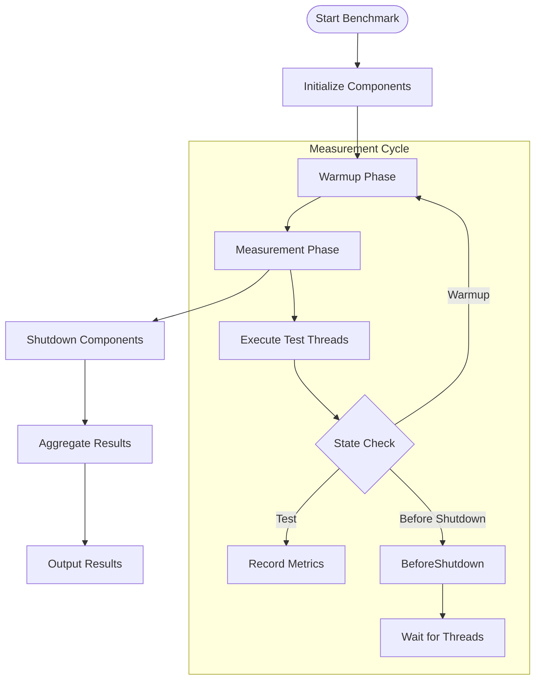
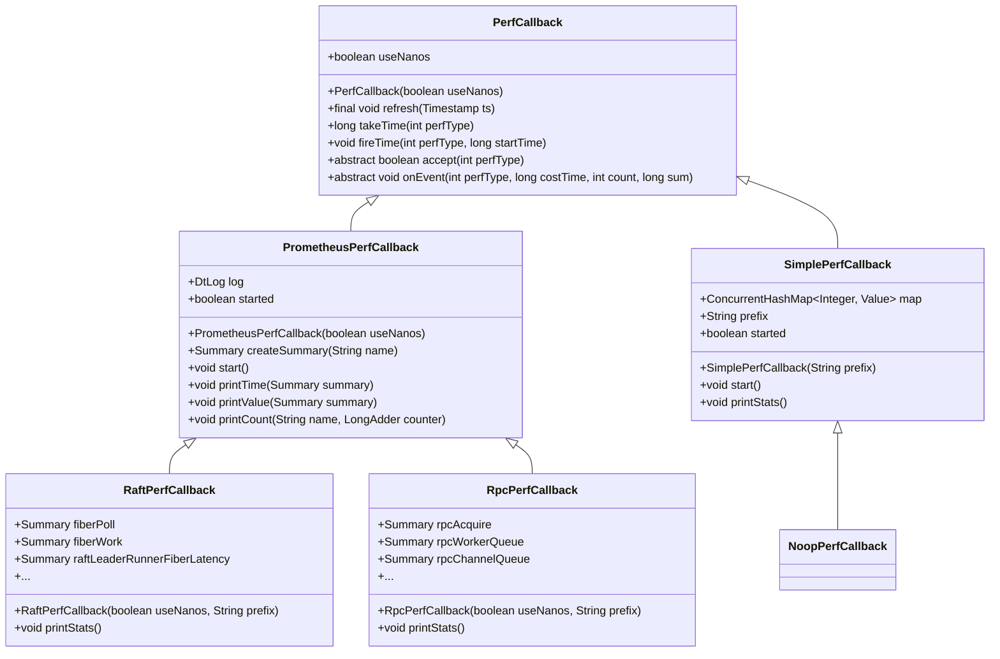
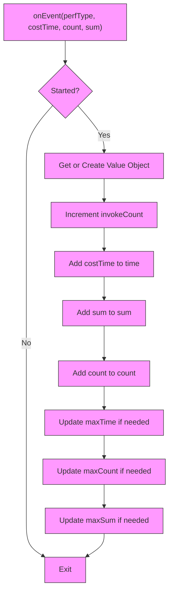
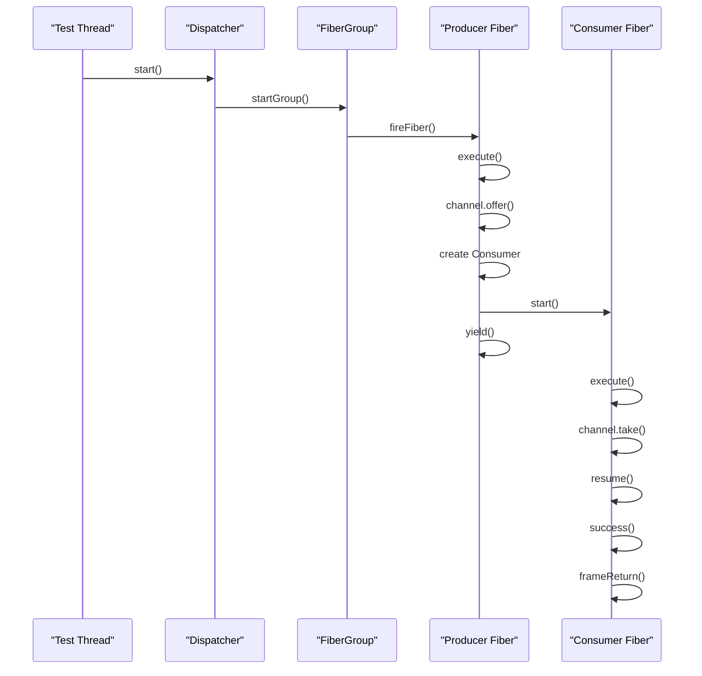
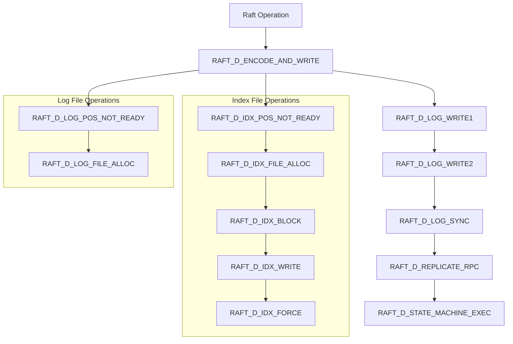
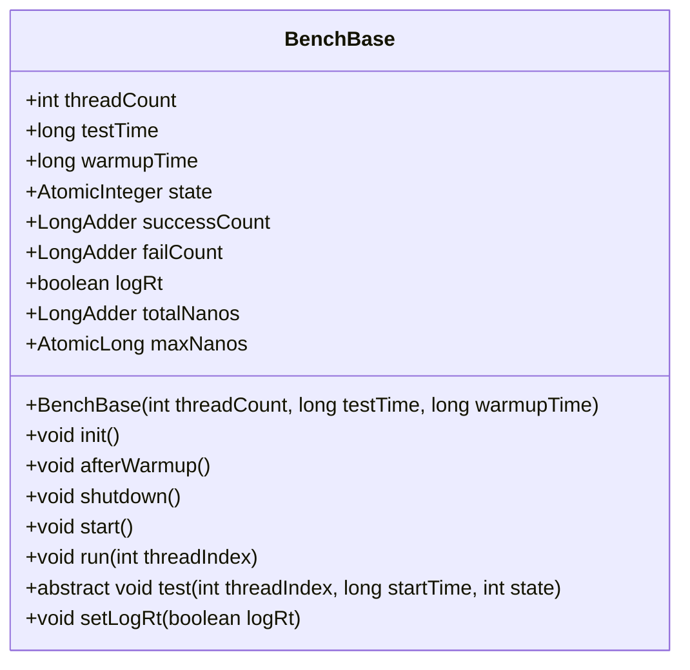
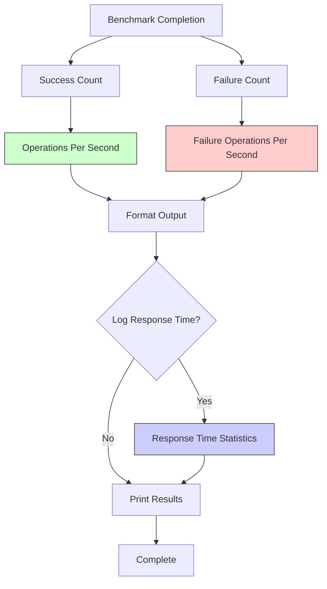

# Performance Measurement Methodology

<cite>
**Referenced Files in This Document**   
- [BenchBase.java](file://benchmark/src/main/java/com/github/dtprj/dongting/bench/common/BenchBase.java)
- [PrometheusPerfCallback.java](file://benchmark/src/main/java/com/github/dtprj/dongting/bench/common/PrometheusPerfCallback.java)
- [SimplePerfCallback.java](file://benchmark/src/main/java/com/github/dtprj/dongting/bench/common/SimplePerfCallback.java)
- [FiberTest.java](file://benchmark/src/main/java/com/github/dtprj/dongting/bench/fiber/FiberTest.java)
- [FiberChannelTest.java](file://benchmark/src/main/java/com/github/dtprj/dongting/bench/fiber/FiberChannelTest.java)
- [RaftBenchmark.java](file://benchmark/src/main/java/com/github/dtprj/dongting/bench/raft/RaftBenchmark.java)
- [RpcBenchmark.java](file://benchmark/src/main/java/com/github/dtprj/dongting/bench/rpc/RpcBenchmark.java)
- [PerfCallback.java](file://client/src/main/java/com/github/dtprj/dongting/common/PerfCallback.java)
- [PerfConsts.java](file://client/src/main/java/com/github/dtprj/dongting/common/PerfConsts.java)
- [RaftPerfCallback.java](file://benchmark/src/main/java/com/github/dtprj/dongting/bench/raft/RaftPerfCallback.java)
- [RpcPerfCallback.java](file://benchmark/src/main/java/com/github/dtprj/dongting/bench/rpc/RpcPerfCallback.java)
- [TestProps.java](file://benchmark/src/main/java/com/github/dtprj/dongting/bench/common/TestProps.java)
</cite>

## Table of Contents
1. [Introduction](#introduction)
2. [Benchmark Framework Architecture](#benchmark-framework-architecture)
3. [Performance Callbacks Implementation](#performance-callbacks-implementation)
4. [Metrics Collection and Tracking](#metrics-collection-and-tracking)
5. [Configuration and Extension](#configuration-and-extension)
6. [Result Interpretation and Analysis](#result-interpretation-and-analysis)
7. [Best Practices and Pitfalls](#best-practices-and-pitfalls)

## Introduction
The Dongting project provides a comprehensive benchmarking infrastructure for measuring the performance of fiber-based systems, particularly focusing on FiberTest and BenchBase frameworks. This documentation details the performance measurement methodology used in the system, covering the benchmarking framework architecture, performance callback implementation, metrics collection, and analysis techniques. The framework is designed to provide accurate and reliable performance measurements for various components including fibers, RPC, and Raft consensus algorithm implementations.

## Benchmark Framework Architecture

The benchmarking framework is built around the `BenchBase` class which provides a standardized structure for performance testing. The framework follows a well-defined lifecycle consisting of initialization, warmup, measurement, and shutdown phases.



**Diagram sources**
- [BenchBase.java](file://benchmark/src/main/java/com/github/dtprj/dongting/bench/common/BenchBase.java#L30-L153)

The framework creates multiple threads to simulate concurrent operations, with each thread executing the test logic in a loop until the test duration is complete. The state machine manages the transition between different phases of the benchmark:

- **STATE_WARMUP (0)**: Initial warmup phase to stabilize the system
- **STATE_TEST (1)**: Main measurement phase where metrics are collected
- **STATE_BEFORE_SHUTDOWN (2)**: Transition phase before shutdown
- **STATE_AFTER_SHUTDOWN (3)**: Final state after completion

The `start()` method orchestrates the entire benchmark process, including thread creation, warmup period, test execution, and result aggregation. During the measurement phase, the framework collects success and failure counts, calculates operations per second, and optionally records response time statistics.

**Section sources**
- [BenchBase.java](file://benchmark/src/main/java/com/github/dtprj/dongting/bench/common/BenchBase.java#L30-L153)

## Performance Callbacks Implementation

The performance measurement system utilizes callback mechanisms to collect detailed metrics during benchmark execution. Two primary implementations are provided: `PrometheusPerfCallback` for integration with Prometheus monitoring and `SimplePerfCallback` for basic performance tracking.

### PrometheusPerfCallback

The `PrometheusPerfCallback` serves as a base class for performance callbacks that integrate with Prometheus metrics collection. It extends the core `PerfCallback` class and provides methods for creating and managing Prometheus Summary metrics.



**Diagram sources**
- [PrometheusPerfCallback.java](file://benchmark/src/main/java/com/github/dtprj/dongting/bench/common/PrometheusPerfCallback.java#L31-L103)
- [SimplePerfCallback.java](file://benchmark/src/main/java/com/github/dtprj/dongting/bench/common/SimplePerfCallback.java#L29-L152)
- [PerfCallback.java](file://client/src/main/java/com/github/dtprj/dongting/common/PerfCallback.java#L21-L110)

The `PrometheusPerfCallback` provides utility methods for creating Summary metrics with predefined quantiles (0.0, 0.5, 0.99, 1.0) and formatting output with detailed statistics including call count, average time, total time, and percentile values. The `printTime()` and `printValue()` methods format and log the collected metrics in a human-readable format.

### SimplePerfCallback

The `SimplePerfCallback` implementation provides a lightweight performance tracking mechanism without external dependencies. It maintains a ConcurrentHashMap of Value objects, each representing a specific performance metric type.



**Diagram sources**
- [SimplePerfCallback.java](file://benchmark/src/main/java/com/github/dtprj/dongting/bench/common/SimplePerfCallback.java#L29-L152)

The Value class within `SimplePerfCallback` stores various statistics for each performance metric, including:
- invokeCount: Number of times the metric was recorded
- count: Sum of count values passed to onEvent
- sum: Sum of sum values passed to onEvent
- time: Sum of costTime values
- maxTime: Maximum observed costTime
- maxCount: Maximum observed count
- maxSum: Maximum observed sum

The `printStats()` method iterates through all recorded metrics and outputs formatted statistics including average time, total time, average values, and maximum values.

**Section sources**
- [PrometheusPerfCallback.java](file://benchmark/src/main/java/com/github/dtprj/dongting/bench/common/PrometheusPerfCallback.java#L31-L103)
- [SimplePerfCallback.java](file://benchmark/src/main/java/com/github/dtprj/dongting/bench/common/SimplePerfCallback.java#L29-L152)

## Metrics Collection and Tracking

The performance measurement system tracks a comprehensive set of metrics across different components of the system. These metrics are defined in the `PerfConsts` interface and categorized by component type.

### Core Metrics Categories

The following table outlines the key performance metrics tracked by the system:

| Metric Category | Metric Type | Description | Units | Components |
|----------------|-----------|-------------|-------|------------|
| RPC | RPC_D_ACQUIRE | Time to acquire connection | nanoseconds/ms | RPC client/server |
| RPC | RPC_D_WORKER_QUEUE | Time spent in worker queue | nanoseconds/ms | RPC worker threads |
| RPC | RPC_D_CHANNEL_QUEUE | Time spent in channel queue | nanoseconds/ms | Network channels |
| RPC | RPC_D_WORKER_SEL | Time in worker selector | nanoseconds/ms | I/O workers |
| RPC | RPC_D_WORKER_WORK | Time in worker processing | nanoseconds/ms | Business logic |
| RPC | RPC_D_READ | Time for read operations | nanoseconds/ms | Network I/O |
| RPC | RPC_D_WRITE | Time for write operations | nanoseconds/ms | Network I/O |
| Fiber | FIBER_D_POLL | Time spent polling for work | nanoseconds/ms | Fiber dispatcher |
| Fiber | FIBER_D_WORK | Time spent processing work | nanoseconds/ms | Fiber execution |
| Raft | RAFT_D_LEADER_RUNNER_FIBER_LATENCY | Leader runner fiber latency | nanoseconds/ms | Raft leader |
| Raft | RAFT_D_ENCODE_AND_WRITE | Log encoding and writing time | nanoseconds/ms | Raft log |
| Raft | RAFT_D_LOG_WRITE1 | First phase of log write | nanoseconds/ms | Raft storage |
| Raft | RAFT_D_LOG_WRITE2 | Second phase of log write | nanoseconds/ms | Raft storage |
| Raft | RAFT_D_LOG_SYNC | Time to sync log to disk | nanoseconds/ms | Raft storage |
| Raft | RAFT_D_STATE_MACHINE_EXEC | State machine execution time | nanoseconds/ms | Raft state machine |

**Section sources**
- [PerfConsts.java](file://client/src/main/java/com/github/dtprj/dongting/common/PerfConsts.java#L21-L54)

### Fiber Performance Metrics

The fiber-based components utilize specific performance metrics to track the efficiency of the fiber execution model. The `FiberTest` and `FiberChannelTest` classes demonstrate the use of these metrics in benchmark scenarios.



**Diagram sources**
- [FiberTest.java](file://benchmark/src/main/java/com/github/dtprj/dongting/bench/fiber/FiberTest.java#L32-L89)
- [FiberChannelTest.java](file://benchmark/src/main/java/com/github/dtprj/dongting/bench/fiber/FiberChannelTest.java#L32-L100)

The fiber metrics focus on measuring the overhead of fiber creation, scheduling, and communication through channels. The `FIBER_D_POLL` metric tracks the time spent by the dispatcher polling for ready fibers, while `FIBER_D_WORK` measures the actual execution time of fiber frames.

### Raft Performance Metrics

The Raft consensus algorithm implementation includes specialized performance metrics to monitor the various stages of the consensus process. The `RaftPerfCallback` class defines a comprehensive set of metrics for tracking Raft-specific operations.



**Diagram sources**
- [RaftPerfCallback.java](file://benchmark/src/main/java/com/github/dtprj/dongting/bench/raft/RaftPerfCallback.java#L24-L184)
- [RaftBenchmark.java](file://benchmark/src/main/java/com/github/dtprj/dongting/bench/raft/RaftBenchmark.java#L54-L229)

These metrics provide detailed insights into the performance characteristics of the Raft implementation, including:
- Log encoding and writing performance
- Disk synchronization overhead
- Network replication latency
- State machine execution time
- Index and log file management operations

## Configuration and Extension

The benchmark framework provides flexible configuration options and extension points for custom performance measurement requirements.

### Framework Configuration

The `BenchBase` class provides configurable parameters for benchmark execution:



**Diagram sources**
- [BenchBase.java](file://benchmark/src/main/java/com/github/dtprj/dongting/bench/common/BenchBase.java#L30-L153)

Key configuration parameters include:
- threadCount: Number of concurrent threads to run
- testTime: Duration of the measurement phase in milliseconds
- warmupTime: Duration of the warmup phase in milliseconds
- logRt: Flag to enable response time logging

### Custom Performance Counters

To add custom performance counters, developers can extend the `PrometheusPerfCallback` or `SimplePerfCallback` classes. The following example demonstrates how to create a custom performance callback:

```java
public class CustomPerfCallback extends PrometheusPerfCallback {
    private final Summary customOperation;
    private final LongAdder customCounter;
    
    public CustomPerfCallback(boolean useNanos, String prefix) {
        super(useNanos);
        this.customOperation = createSummary(prefix + "custom_operation");
        this.customCounter = new LongAdder();
    }
    
    @Override
    public boolean accept(int perfType) {
        return perfType == CUSTOM_OPERATION || perfType == CUSTOM_COUNTER;
    }
    
    @Override
    public void onEvent(int perfType, long costTime, int count, long sum) {
        if (!started) return;
        
        switch (perfType) {
            case CUSTOM_OPERATION:
                customOperation.observe(costTime);
                break;
            case CUSTOM_COUNTER:
                customCounter.add(count);
                break;
        }
    }
    
    public void printStats() {
        printTime(customOperation);
        printCount("custom_counter", customCounter);
    }
}
```

The `TestProps` class provides a mechanism for loading configuration properties from a user-specific configuration file (~/.dt-test), allowing for environment-specific benchmark settings.

**Section sources**
- [BenchBase.java](file://benchmark/src/main/java/com/github/dtprj/dongting/bench/common/BenchBase.java#L30-L153)
- [TestProps.java](file://benchmark/src/main/java/com/github/dtprj/dongting/bench/common/TestProps.java#L24-L47)

## Result Interpretation and Analysis

The benchmark framework provides comprehensive result output to facilitate performance analysis and comparison.

### Result Aggregation

After the benchmark completes, the framework aggregates results and outputs key performance indicators:



**Diagram sources**
- [BenchBase.java](file://benchmark/src/main/java/com/github/dtprj/dongting/bench/common/BenchBase.java#L93-L103)

The primary metrics reported include:
- Success operations per second (OPS)
- Failure operations per second
- Maximum response time (when enabled)
- Average response time (when enabled)

### Performance Regression Detection

The detailed metrics collected by the performance callbacks enable effective detection of performance regressions. By comparing benchmark results across different versions or configurations, developers can identify performance changes in specific components.

For example, the `RaftPerfCallback` includes a calculation for fiber thread utilization rate:

```java
double total = fiberPoll.get().sum + fiberWork.get().sum;
double work = fiberWork.get().sum / total;
log.info(String.format("fiber thread utilization rate: %.2f%%", work * 100));
```

This metric helps identify whether the fiber dispatcher is spending excessive time polling for work versus actually processing work, which can indicate inefficiencies in the scheduling algorithm.

### Configuration Comparison

The framework supports comparing different fiber configurations by modifying parameters such as thread count, dispatcher configuration, and performance callback settings. For example, comparing synchronous vs. asynchronous operation modes:

```java
// Synchronous mode
clients[threadIndex].put(GROUP_ID, String.valueOf(k).getBytes(), DATA);
success(state);

// Asynchronous mode
clients[threadIndex].put(GROUP_ID, String.valueOf(k).getBytes(), DATA, (result, ex) -> {
    if (ex == null) {
        logRt(startTime, state);
        RaftBenchmark.this.success(state);
    } else {
        logRt(startTime, state);
        RaftBenchmark.this.fail(state);
    }
});
```

**Section sources**
- [RaftBenchmark.java](file://benchmark/src/main/java/com/github/dtprj/dongting/bench/raft/RaftBenchmark.java#L199-L225)
- [RpcBenchmark.java](file://benchmark/src/main/java/com/github/dtprj/dongting/bench/rpc/RpcBenchmark.java#L127-L161)

## Best Practices and Pitfalls

### Best Practices for Accurate Measurement

1. **Adequate Warmup Period**: Ensure sufficient warmup time to allow the JVM to optimize code paths and stabilize system performance.
2. **Multiple Runs**: Execute benchmarks multiple times and use median values to account for system noise.
3. **Consistent Environment**: Run benchmarks in a controlled environment with minimal external interference.
4. **Garbage Collection Monitoring**: Monitor GC activity during benchmark runs as it can significantly impact performance measurements.
5. **CPU Affinity**: Consider setting CPU affinity for benchmark processes to reduce context switching overhead.

### Common Benchmarking Pitfalls

1. **Insufficient Warmup**: Not allowing enough time for the JVM to optimize code can lead to misleadingly poor performance results.
2. **Measurement Overhead**: Ensure that the measurement instrumentation itself doesn't significantly impact the performance being measured.
3. **System Interference**: Background processes, OS scheduling, and other system activities can introduce noise into measurements.
4. **Memory Effects**: Failing to account for memory allocation patterns and garbage collection can distort performance results.
5. **Single Run Reliance**: Making conclusions based on a single benchmark run without considering variance.

The framework addresses many of these pitfalls through its structured approach to benchmarking, including explicit warmup phases, separate measurement and shutdown phases, and comprehensive metrics collection that can help identify measurement artifacts.

**Section sources**
- [BenchBase.java](file://benchmark/src/main/java/com/github/dtprj/dongting/bench/common/BenchBase.java#L30-L153)
- [RaftBenchmark.java](file://benchmark/src/main/java/com/github/dtprj/dongting/bench/raft/RaftBenchmark.java#L54-L229)
- [RpcBenchmark.java](file://benchmark/src/main/java/com/github/dtprj/dongting/bench/rpc/RpcBenchmark.java#L41-L162)