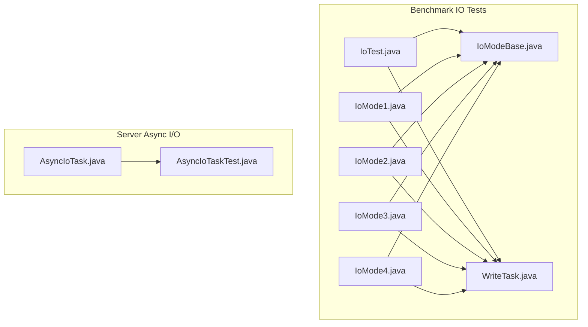
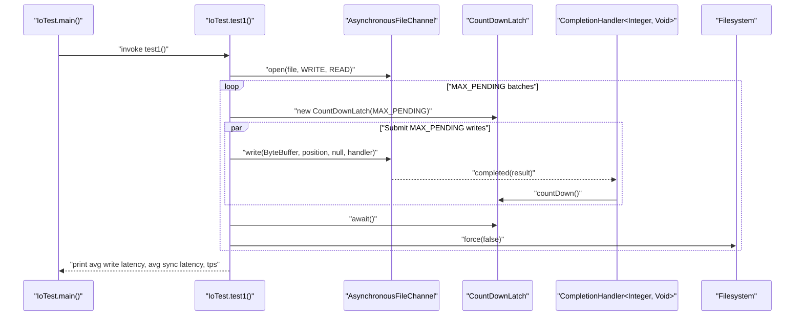
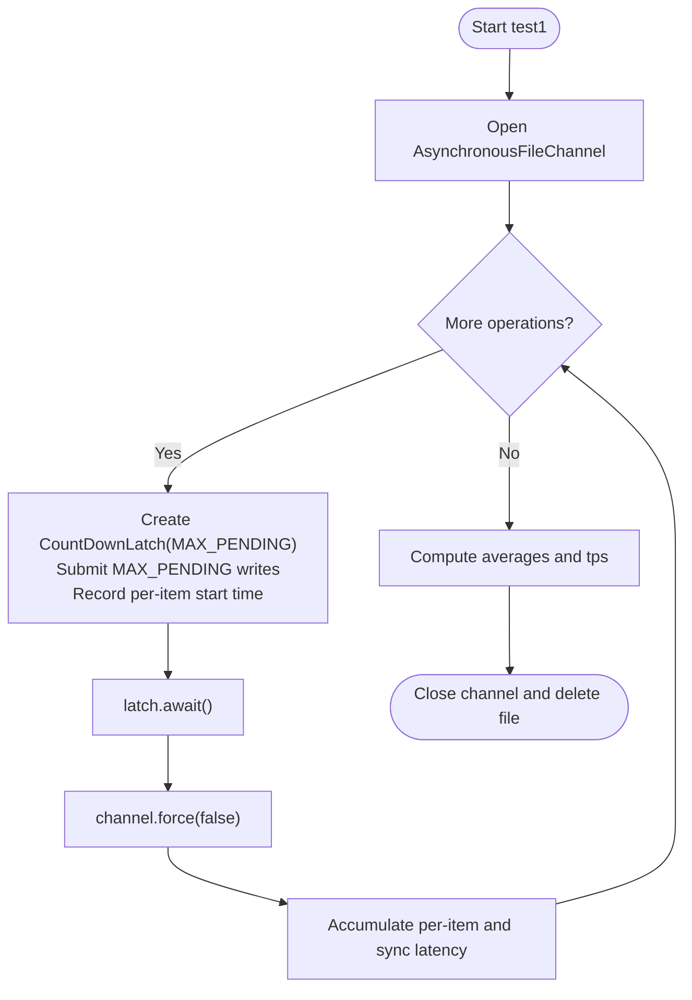
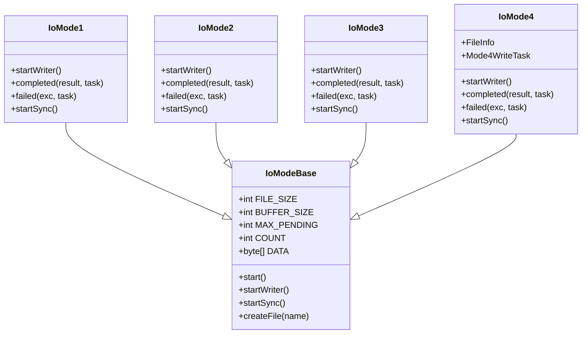
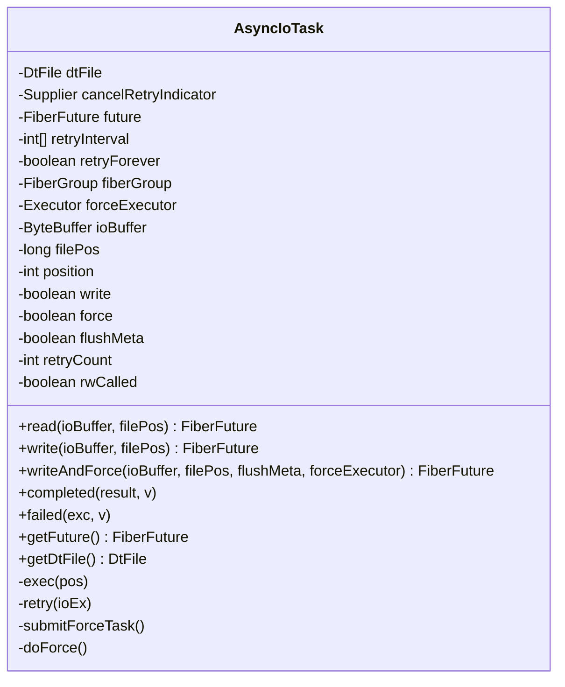
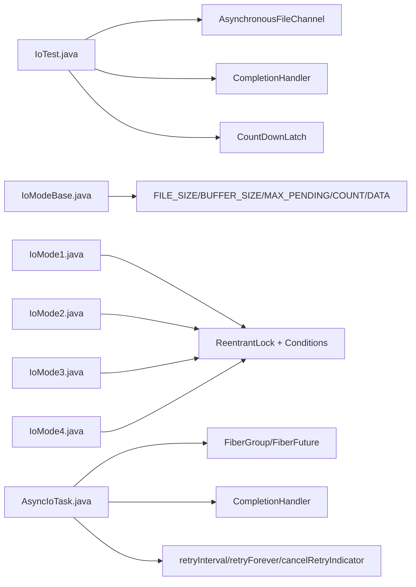

# Asynchronous I/O Performance

<cite>
**Referenced Files in This Document**
- [IoTest.java](file://benchmark/src/main/java/com/github/dtprj/dongting/bench/io/IoTest.java)
- [WriteTask.java](file://benchmark/src/main/java/com/github/dtprj/dongting/bench/io/WriteTask.java)
- [IoModeBase.java](file://benchmark/src/main/java/com/github/dtprj/dongting/bench/io/IoModeBase.java)
- [IoMode1.java](file://benchmark/src/main/java/com/github/dtprj/dongting/bench/io/IoMode1.java)
- [IoMode2.java](file://benchmark/src/main/java/com/github/dtprj/dongting/bench/io/IoMode2.java)
- [IoMode3.java](file://benchmark/src/main/java/com/github/dtprj/dongting/bench/io/IoMode3.java)
- [IoMode4.java](file://benchmark/src/main/java/com/github/dtprj/dongting/bench/io/IoMode4.java)
- [AsyncIoTask.java](file://server/src/main/java/com/github/dtprj/dongting/raft/store/AsyncIoTask.java)
- [AsyncIoTaskTest.java](file://server/src/test/java/com/github/dtprj/dongting/raft/store/AsyncIoTaskTest.java)
- [README.md](file://README.md)
</cite>

## Table of Contents
1. [Introduction](#introduction)
2. [Project Structure](#project-structure)
3. [Core Components](#core-components)
4. [Architecture Overview](#architecture-overview)
5. [Detailed Component Analysis](#detailed-component-analysis)
6. [Dependency Analysis](#dependency-analysis)
7. [Performance Considerations](#performance-considerations)
8. [Troubleshooting Guide](#troubleshooting-guide)
9. [Conclusion](#conclusion)
10. [Appendices](#appendices)

## Introduction
This document focuses on asynchronous I/O performance in the repository, with emphasis on:
- The IoTest class and its non-blocking write pipeline using AsynchronousFileChannel and CompletionHandler
- The AsyncIoTask implementation for asynchronous file operations in the server-side Raft store
- Coordination mechanisms for configurable MAX_PENDING pending operations using CountDownLatch and completion handlers
- Performance measurement methodology for write latency, sync latency, and throughput
- Guidance on tuning MAX_PENDING based on disk subsystem characteristics
- Interpretation of differences between single-file and multi-file asynchronous operations as demonstrated by test1 and test2

## Project Structure
The asynchronous I/O performance tests and implementations are organized across benchmark and server modules:
- Benchmark IO tests: IoTest, IoMode1–IoMode4, WriteTask, IoModeBase
- Server-side AsyncIoTask for Raft store I/O with retry and force semantics
- README provides background on performance goals and methodology

**Diagram sources**
- [IoTest.java](file://benchmark/src/main/java/com/github/dtprj/dongting/bench/io/IoTest.java#L1-L196)
- [IoModeBase.java](file://benchmark/src/main/java/com/github/dtprj/dongting/bench/io/IoModeBase.java#L1-L77)
- [IoMode1.java](file://benchmark/src/main/java/com/github/dtprj/dongting/bench/io/IoMode1.java#L1-L175)
- [IoMode2.java](file://benchmark/src/main/java/com/github/dtprj/dongting/bench/io/IoMode2.java#L1-L173)
- [IoMode3.java](file://benchmark/src/main/java/com/github/dtprj/dongting/bench/io/IoMode3.java#L1-L176)
- [IoMode4.java](file://benchmark/src/main/java/com/github/dtprj/dongting/bench/io/IoMode4.java#L1-L218)
- [WriteTask.java](file://benchmark/src/main/java/com/github/dtprj/dongting/bench/io/WriteTask.java#L1-L26)
- [AsyncIoTask.java](file://server/src/main/java/com/github/dtprj/dongting/raft/store/AsyncIoTask.java#L1-L259)
- [AsyncIoTaskTest.java](file://server/src/test/java/com/github/dtprj/dongting/raft/store/AsyncIoTaskTest.java#L1-L200)

**Section sources**
- [IoTest.java](file://benchmark/src/main/java/com/github/dtprj/dongting/bench/io/IoTest.java#L1-L196)
- [README.md](file://README.md#L1-L141)

## Core Components
- IoTest: Demonstrates non-blocking writes with configurable MAX_PENDING and measures write latency, sync latency, and throughput. It uses CountDownLatch to coordinate completion of MAX_PENDING operations before issuing a sync.
- IoModeBase: Shared constants and lifecycle for IO modes (FILE_SIZE, BUFFER_SIZE, MAX_PENDING, COUNT, DATA), plus a start() that spawns writer and sync threads.
- IoMode1/2/3/4: Variants of asynchronous write-and-sync coordination with different policies for batching and concurrency.
- WriteTask: Lightweight task holder for per-operation timing and indexing.
- AsyncIoTask: Server-side asynchronous I/O task with CompletionHandler pattern, retry logic, and optional force/sync metadata.

**Section sources**
- [IoTest.java](file://benchmark/src/main/java/com/github/dtprj/dongting/bench/io/IoTest.java#L35-L122)
- [IoModeBase.java](file://benchmark/src/main/java/com/github/dtprj/dongting/bench/io/IoModeBase.java#L25-L77)
- [IoMode1.java](file://benchmark/src/main/java/com/github/dtprj/dongting/bench/io/IoMode1.java#L33-L175)
- [IoMode2.java](file://benchmark/src/main/java/com/github/dtprj/dongting/bench/io/IoMode2.java#L33-L173)
- [IoMode3.java](file://benchmark/src/main/java/com/github/dtprj/dongting/bench/io/IoMode3.java#L33-L176)
- [IoMode4.java](file://benchmark/src/main/java/com/github/dtprj/dongting/bench/io/IoMode4.java#L33-L218)
- [WriteTask.java](file://benchmark/src/main/java/com/github/dtprj/dongting/bench/io/WriteTask.java#L18-L26)
- [AsyncIoTask.java](file://server/src/main/java/com/github/dtprj/dongting/raft/store/AsyncIoTask.java#L35-L259)

## Architecture Overview
The asynchronous I/O architecture centers around AsynchronousFileChannel and CompletionHandler callbacks. The benchmark tests illustrate two primary patterns:
- Single-file asynchronous writes with periodic sync and coordinated completion
- Multi-file asynchronous writes with per-file queues and controlled batching

**Diagram sources**
- [IoTest.java](file://benchmark/src/main/java/com/github/dtprj/dongting/bench/io/IoTest.java#L67-L122)

## Detailed Component Analysis

### IoTest: Non-blocking Writes with MAX_PENDING Coordination
- Configuration: FILE_SIZE, BUFFER_SIZE, MAX_PENDING, COUNT, DATA
- Single-file test (test1):
  - Opens a single AsynchronousFileChannel
  - Iterates COUNT operations, submitting MAX_PENDING writes per batch
  - Uses CountDownLatch to await completion of each batch
  - After each batch, forces the filesystem and accumulates sync latency and per-item latency
  - Computes average write latency, average sync latency, and throughput
- Multi-file test (test2):
  - Creates multiple files and channels
  - Distributes writes round-robin across files
  - Synchronizes per-file and aggregates metrics similarly

**Diagram sources**
- [IoTest.java](file://benchmark/src/main/java/com/github/dtprj/dongting/bench/io/IoTest.java#L67-L122)

**Section sources**
- [IoTest.java](file://benchmark/src/main/java/com/github/dtprj/dongting/bench/io/IoTest.java#L35-L122)
- [IoTest.java](file://benchmark/src/main/java/com/github/dtprj/dongting/bench/io/IoTest.java#L124-L194)

### IoMode1/2/3/4: Asynchronous Write-and-Sync Coordination
- IoModeBase defines shared constants and lifecycle:
  - FILE_SIZE, BUFFER_SIZE, MAX_PENDING, COUNT, DATA
  - start() spawns writer and sync threads
- IoMode1: Write instantly, sync in batch. Uses condition variables to coordinate write completion and sync batching.
- IoMode2: Write instantly, sync waits for all pending writes to finish before syncing.
- IoMode3: Serializes write and sync phases; prevents concurrent writes and syncs.
- IoMode4: Multi-file variant with per-file queues and controlled MAX_BATCH per file to balance load.

**Diagram sources**
- [IoModeBase.java](file://benchmark/src/main/java/com/github/dtprj/dongting/bench/io/IoModeBase.java#L25-L77)
- [IoMode1.java](file://benchmark/src/main/java/com/github/dtprj/dongting/bench/io/IoMode1.java#L33-L175)
- [IoMode2.java](file://benchmark/src/main/java/com/github/dtprj/dongting/bench/io/IoMode2.java#L33-L173)
- [IoMode3.java](file://benchmark/src/main/java/com/github/dtprj/dongting/bench/io/IoMode3.java#L33-L176)
- [IoMode4.java](file://benchmark/src/main/java/com/github/dtprj/dongting/bench/io/IoMode4.java#L33-L218)

**Section sources**
- [IoModeBase.java](file://benchmark/src/main/java/com/github/dtprj/dongting/bench/io/IoModeBase.java#L25-L77)
- [IoMode1.java](file://benchmark/src/main/java/com/github/dtprj/dongting/bench/io/IoMode1.java#L60-L175)
- [IoMode2.java](file://benchmark/src/main/java/com/github/dtprj/dongting/bench/io/IoMode2.java#L60-L173)
- [IoMode3.java](file://benchmark/src/main/java/com/github/dtprj/dongting/bench/io/IoMode3.java#L61-L176)
- [IoMode4.java](file://benchmark/src/main/java/com/github/dtprj/dongting/bench/io/IoMode4.java#L70-L218)

### AsyncIoTask: Asynchronous File Operations with Retry and Force
- Implements CompletionHandler<Integer, Void> and BiConsumer<Void, Throwable>
- Provides read(ByteBuffer, long) and write(ByteBuffer, long) with optional writeAndForce(forceExecutor, flushMeta)
- Manages retries with exponential/backoff intervals and cancellation checks
- Coordinates completion via FiberFuture and logs errors with contextual details
- Executes force on a supplied executor and resumes retry on failures

**Diagram sources**
- [AsyncIoTask.java](file://server/src/main/java/com/github/dtprj/dongting/raft/store/AsyncIoTask.java#L35-L259)

**Section sources**
- [AsyncIoTask.java](file://server/src/main/java/com/github/dtprj/dongting/raft/store/AsyncIoTask.java#L62-L116)
- [AsyncIoTask.java](file://server/src/main/java/com/github/dtprj/dongting/raft/store/AsyncIoTask.java#L194-L259)
- [AsyncIoTaskTest.java](file://server/src/test/java/com/github/dtprj/dongting/raft/store/AsyncIoTaskTest.java#L100-L183)

## Dependency Analysis
- IoTest depends on AsynchronousFileChannel and CompletionHandler for non-blocking writes and uses CountDownLatch to coordinate completion
- IoMode variants depend on IoModeBase constants and use condition variables and queues to coordinate write and sync phases
- AsyncIoTask depends on FiberGroup, FiberFuture, and DtFile to orchestrate asynchronous reads/writes with retries and forced synchronization

**Diagram sources**
- [IoTest.java](file://benchmark/src/main/java/com/github/dtprj/dongting/bench/io/IoTest.java#L67-L122)
- [IoModeBase.java](file://benchmark/src/main/java/com/github/dtprj/dongting/bench/io/IoModeBase.java#L25-L77)
- [IoMode1.java](file://benchmark/src/main/java/com/github/dtprj/dongting/bench/io/IoMode1.java#L33-L175)
- [IoMode2.java](file://benchmark/src/main/java/com/github/dtprj/dongting/bench/io/IoMode2.java#L33-L173)
- [IoMode3.java](file://benchmark/src/main/java/com/github/dtprj/dongting/bench/io/IoMode3.java#L33-L176)
- [IoMode4.java](file://benchmark/src/main/java/com/github/dtprj/dongting/bench/io/IoMode4.java#L33-L218)
- [AsyncIoTask.java](file://server/src/main/java/com/github/dtprj/dongting/raft/store/AsyncIoTask.java#L35-L259)

**Section sources**
- [IoTest.java](file://benchmark/src/main/java/com/github/dtprj/dongting/bench/io/IoTest.java#L67-L194)
- [IoModeBase.java](file://benchmark/src/main/java/com/github/dtprj/dongting/bench/io/IoModeBase.java#L25-L77)
- [AsyncIoTask.java](file://server/src/main/java/com/github/dtprj/dongting/raft/store/AsyncIoTask.java#L35-L259)

## Performance Considerations
- Measurement methodology:
  - Per-operation write latency: difference between per-item start time and completion callback
  - Sync latency: difference between sync start and completion for each batch
  - Throughput: COUNT divided by total elapsed time
- Tuning MAX_PENDING:
  - Increase to overlap more writes with OS-level I/O and reduce sync overhead
  - Decrease to reduce memory footprint and contention; improve predictability of per-item latency
  - Align with disk subsystem capabilities; modern SSDs often tolerate higher pending counts
- Single-file vs multi-file:
  - Single-file test isolates a single channel; syncs occur after each batch
  - Multi-file test spreads writes across channels; can increase throughput by leveraging multiple I/O streams
- Disk subsystem:
  - The README highlights a typical PC with an NVMe SSD as a likely bottleneck; tuning should reflect real hardware characteristics

**Section sources**
- [IoTest.java](file://benchmark/src/main/java/com/github/dtprj/dongting/bench/io/IoTest.java#L67-L122)
- [IoTest.java](file://benchmark/src/main/java/com/github/dtprj/dongting/bench/io/IoTest.java#L124-L194)
- [README.md](file://README.md#L16-L46)

## Troubleshooting Guide
- Completion result validation:
  - Handlers verify that the number of bytes written equals the buffer size; otherwise, the test exits with an error
- Error propagation:
  - CompletionHandler failed callbacks print stack traces and exit
  - AsyncIoTask wraps exceptions with contextual details and retries according to configured policy
- Retry control:
  - AsyncIoTask honors retryForever and cancelRetryIndicator to prevent runaway retries
  - Retries are scheduled on a fiber dispatcher thread with calculated intervals

**Section sources**
- [IoTest.java](file://benchmark/src/main/java/com/github/dtprj/dongting/bench/io/IoTest.java#L82-L100)
- [IoMode1.java](file://benchmark/src/main/java/com/github/dtprj/dongting/bench/io/IoMode1.java#L82-L118)
- [IoMode2.java](file://benchmark/src/main/java/com/github/dtprj/dongting/bench/io/IoMode2.java#L112-L116)
- [AsyncIoTask.java](file://server/src/main/java/com/github/dtprj/dongting/raft/store/AsyncIoTask.java#L138-L193)
- [AsyncIoTask.java](file://server/src/main/java/com/github/dtprj/dongting/raft/store/AsyncIoTask.java#L225-L259)

## Conclusion
The repository demonstrates robust asynchronous I/O patterns:
- IoTest showcases non-blocking writes with configurable MAX_PENDING and precise latency/throughput metrics
- IoMode variants illustrate different coordination strategies for write-and-sync phases
- AsyncIoTask provides a production-grade asynchronous I/O task with retry, force, and fiber-based scheduling
These components collectively enable performance tuning and interpretation of single-file versus multi-file asynchronous operations, guiding optimal MAX_PENDING selection aligned with disk subsystem capabilities.

## Appendices
- Example references for analysis:
  - Single-file asynchronous write pipeline: [IoTest.test1](file://benchmark/src/main/java/com/github/dtprj/dongting/bench/io/IoTest.java#L67-L122)
  - Multi-file asynchronous write pipeline: [IoTest.test2](file://benchmark/src/main/java/com/github/dtprj/dongting/bench/io/IoTest.java#L124-L194)
  - Server-side async I/O task: [AsyncIoTask](file://server/src/main/java/com/github/dtprj/dongting/raft/store/AsyncIoTask.java#L35-L259)