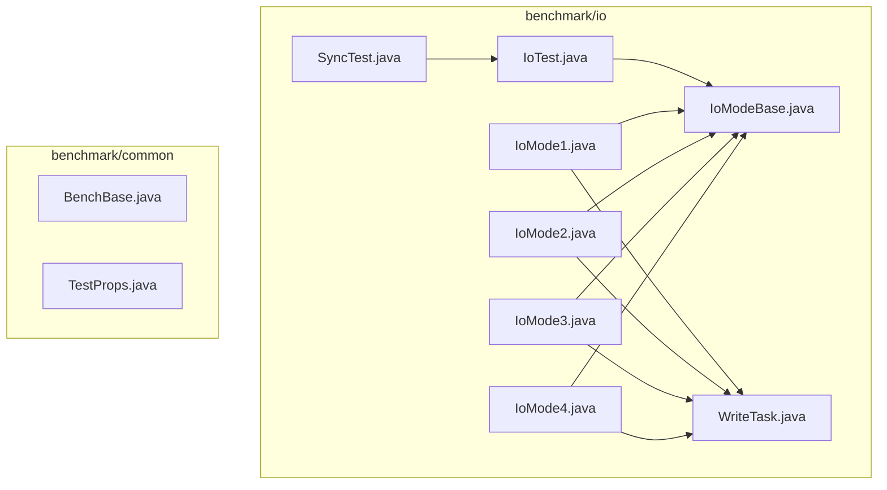
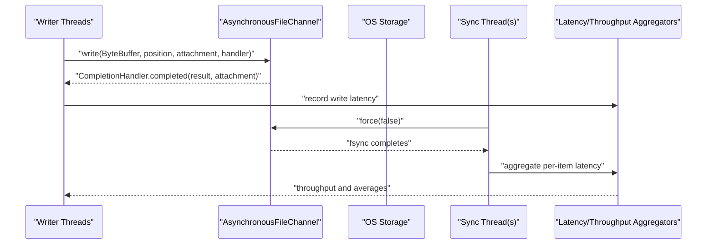
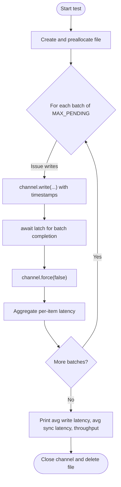
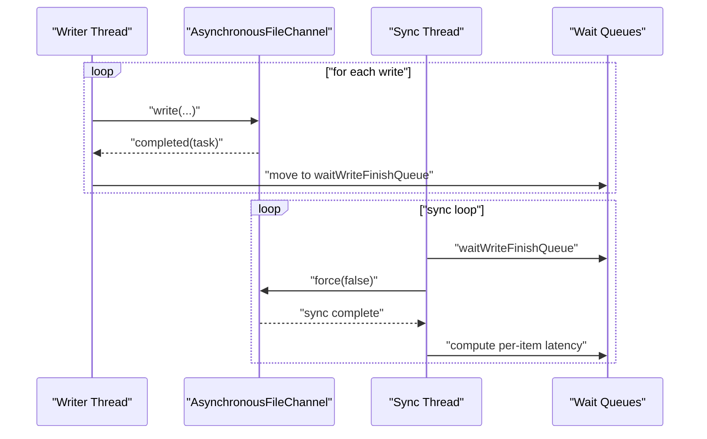
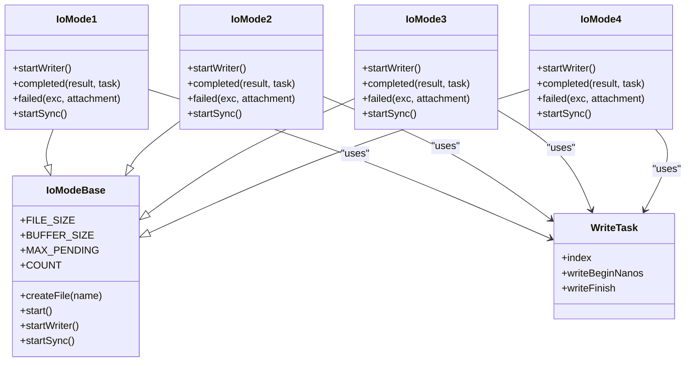

# I/O Performance Benchmarking

<cite>
**Referenced Files in This Document**
- [IoTest.java](file://benchmark/src/main/java/com/github/dtprj/dongting/bench/io/IoTest.java)
- [IoModeBase.java](file://benchmark/src/main/java/com/github/dtprj/dongting/bench/io/IoModeBase.java)
- [IoMode1.java](file://benchmark/src/main/java/com/github/dtprj/dongting/bench/io/IoMode1.java)
- [IoMode2.java](file://benchmark/src/main/java/com/github/dtprj/dongting/bench/io/IoMode2.java)
- [IoMode3.java](file://benchmark/src/main/java/com/github/dtprj/dongting/bench/io/IoMode3.java)
- [IoMode4.java](file://benchmark/src/main/java/com/github/dtprj/dongting/bench/io/IoMode4.java)
- [WriteTask.java](file://benchmark/src/main/java/com/github/dtprj/dongting/bench/io/WriteTask.java)
- [SyncTest.java](file://benchmark/src/main/java/com/github/dtprj/dongting/bench/io/SyncTest.java)
- [BenchBase.java](file://benchmark/src/main/java/com/github/dtprj/dongting/bench/common/BenchBase.java)
- [TestProps.java](file://benchmark/src/main/java/com/github/dtprj/dongting/bench/common/TestProps.java)
- [README.md](file://README.md)
</cite>

## Table of Contents
1. [Introduction](#introduction)
2. [Project Structure](#project-structure)
3. [Core Components](#core-components)
4. [Architecture Overview](#architecture-overview)
5. [Detailed Component Analysis](#detailed-component-analysis)
6. [Dependency Analysis](#dependency-analysis)
7. [Performance Considerations](#performance-considerations)
8. [Troubleshooting Guide](#troubleshooting-guide)
9. [Conclusion](#conclusion)
10. [Appendices](#appendices)

## Introduction
This document explains the I/O performance benchmarking suite focused on the IoTest class and related I/O modes. It covers the asynchronous I/O architecture using AsynchronousFileChannel, methodologies for measuring sequential and random read/write throughput, latency, and I/O completion times, and how configurable buffer sizes and pending operations influence performance. It also documents the impact of fsync operations and compares direct versus heap buffers. Guidance is provided for interpreting latency distributions, understanding the relationship between MAX_PENDING and system throughput, identifying disk subsystem bottlenecks, and adapting benchmarks for different file sizes, access patterns, and RAFT log storage optimization.

## Project Structure
The I/O benchmarking code resides under the benchmark module, organized by feature areas:
- io: Asynchronous I/O tests and modes
- common: Benchmark base utilities and configuration helpers

**Diagram sources**
- [IoTest.java](file://benchmark/src/main/java/com/github/dtprj/dongting/bench/io/IoTest.java#L1-L196)
- [IoModeBase.java](file://benchmark/src/main/java/com/github/dtprj/dongting/bench/io/IoModeBase.java#L1-L77)
- [IoMode1.java](file://benchmark/src/main/java/com/github/dtprj/dongting/bench/io/IoMode1.java#L1-L175)
- [IoMode2.java](file://benchmark/src/main/java/com/github/dtprj/dongting/bench/io/IoMode2.java#L1-L173)
- [IoMode3.java](file://benchmark/src/main/java/com/github/dtprj/dongting/bench/io/IoMode3.java#L1-L176)
- [IoMode4.java](file://benchmark/src/main/java/com/github/dtprj/dongting/bench/io/IoMode4.java#L1-L218)
- [WriteTask.java](file://benchmark/src/main/java/com/github/dtprj/dongting/bench/io/WriteTask.java#L1-L26)
- [SyncTest.java](file://benchmark/src/main/java/com/github/dtprj/dongting/bench/io/SyncTest.java#L1-L167)
- [BenchBase.java](file://benchmark/src/main/java/com/github/dtprj/dongting/bench/common/BenchBase.java#L1-L153)
- [TestProps.java](file://benchmark/src/main/java/com/github/dtprj/dongting/bench/common/TestProps.java#L1-L47)

**Section sources**
- [IoTest.java](file://benchmark/src/main/java/com/github/dtprj/dongting/bench/io/IoTest.java#L1-L196)
- [IoModeBase.java](file://benchmark/src/main/java/com/github/dtprj/dongting/bench/io/IoModeBase.java#L1-L77)
- [IoMode1.java](file://benchmark/src/main/java/com/github/dtprj/dongting/bench/io/IoMode1.java#L1-L175)
- [IoMode2.java](file://benchmark/src/main/java/com/github/dtprj/dongting/bench/io/IoMode2.java#L1-L173)
- [IoMode3.java](file://benchmark/src/main/java/com/github/dtprj/dongting/bench/io/IoMode3.java#L1-L176)
- [IoMode4.java](file://benchmark/src/main/java/com/github/dtprj/dongting/bench/io/IoMode4.java#L1-L218)
- [WriteTask.java](file://benchmark/src/main/java/com/github/dtprj/dongting/bench/io/WriteTask.java#L1-L26)
- [SyncTest.java](file://benchmark/src/main/java/com/github/dtprj/dongting/bench/io/SyncTest.java#L1-L167)
- [BenchBase.java](file://benchmark/src/main/java/com/github/dtprj/dongting/bench/common/BenchBase.java#L1-L153)
- [TestProps.java](file://benchmark/src/main/java/com/github/dtprj/dongting/bench/common/TestProps.java#L1-L47)

## Core Components
- IoTest: Demonstrates asynchronous sequential write benchmarking with periodic fsync and measures average write latency, average sync latency, and throughput. It also evaluates multi-file concurrent writes with interleaved fsync per file.
- IoModeBase: Shared constants and file creation utilities for I/O modes; provides a threaded model with writer and sync threads.
- IoMode1/2/3/4: Three distinct asynchronous write-and-sync patterns:
  - Mode 1: Writes immediately; batches sync operations and computes per-item latency across completed writes.
  - Mode 2: Writes immediately; sync thread waits until all pending writes finish before issuing fsync.
  - Mode 3: Writes immediately; sync thread waits until all pending writes finish, but disallows new writes during sync.
  - Mode 4: Multi-file concurrency with per-file batching and ordered sync across files.
- WriteTask: Lightweight task holder for per-operation timing and indexing.
- SyncTest: Comparative benchmark across synchronous IO, async IO, buffered IO, and memory-mapped IO, measuring fsync cost.
- BenchBase: Generic benchmark harness for timed runs with warmup, test, and shutdown phases.
- TestProps: Loads user-level test configuration from a home directory file.

Key configurable parameters:
- FILE_SIZE: Total size of the test file(s).
- BUFFER_SIZE: Per-I/O buffer size in bytes.
- MAX_PENDING: Upper bound on outstanding asynchronous operations.
- COUNT: Number of operations per test run.

**Section sources**
- [IoTest.java](file://benchmark/src/main/java/com/github/dtprj/dongting/bench/io/IoTest.java#L35-L42)
- [IoModeBase.java](file://benchmark/src/main/java/com/github/dtprj/dongting/bench/io/IoModeBase.java#L27-L34)
- [IoMode1.java](file://benchmark/src/main/java/com/github/dtprj/dongting/bench/io/IoMode1.java#L33-L40)
- [IoMode2.java](file://benchmark/src/main/java/com/github/dtprj/dongting/bench/io/IoMode2.java#L33-L40)
- [IoMode3.java](file://benchmark/src/main/java/com/github/dtprj/dongting/bench/io/IoMode3.java#L33-L45)
- [IoMode4.java](file://benchmark/src/main/java/com/github/dtprj/dongting/bench/io/IoMode4.java#L33-L48)
- [WriteTask.java](file://benchmark/src/main/java/com/github/dtprj/dongting/bench/io/WriteTask.java#L21-L26)
- [SyncTest.java](file://benchmark/src/main/java/com/github/dtprj/dongting/bench/io/SyncTest.java#L32-L46)
- [BenchBase.java](file://benchmark/src/main/java/com/github/dtprj/dongting/bench/common/BenchBase.java#L37-L54)
- [TestProps.java](file://benchmark/src/main/java/com/github/dtprj/dongting/bench/common/TestProps.java#L24-L46)

## Architecture Overview
The I/O benchmarking architecture centers around AsynchronousFileChannel for non-blocking file operations. Each mode orchestrates a producer-consumer pipeline:
- Producer: Issues asynchronous write operations with a fixed buffer size at sequential offsets.
- Consumer: Periodically invokes fsync (via channel.force) and computes latency metrics per completed operation.

**Diagram sources**
- [IoTest.java](file://benchmark/src/main/java/com/github/dtprj/dongting/bench/io/IoTest.java#L67-L122)
- [IoMode1.java](file://benchmark/src/main/java/com/github/dtprj/dongting/bench/io/IoMode1.java#L60-L174)
- [IoMode2.java](file://benchmark/src/main/java/com/github/dtprj/dongting/bench/io/IoMode2.java#L60-L172)
- [IoMode3.java](file://benchmark/src/main/java/com/github/dtprj/dongting/bench/io/IoMode3.java#L60-L175)
- [IoMode4.java](file://benchmark/src/main/java/com/github/dtprj/dongting/bench/io/IoMode4.java#L78-L217)

## Detailed Component Analysis

### IoTest: Asynchronous Sequential Write Benchmark
- Purpose: Measure end-to-end write and fsync performance for a single file and multi-file scenarios.
- Methodology:
  - Creates a target directory and preallocates a file of fixed size.
  - Issues asynchronous writes with a fixed buffer size at sequential positions.
  - Uses a bounded queue of per-operation timestamps to compute per-item latency after fsync.
  - Periodically calls channel.force(false) to flush dirty pages and measures sync latency.
  - Computes average write latency, average sync latency, and overall throughput.
- Key metrics:
  - Average write latency per operation.
  - Average sync latency per operation.
  - Throughput (operations per second).
  - Average sync duration and total runtime.

**Diagram sources**
- [IoTest.java](file://benchmark/src/main/java/com/github/dtprj/dongting/bench/io/IoTest.java#L67-L122)

**Section sources**
- [IoTest.java](file://benchmark/src/main/java/com/github/dtprj/dongting/bench/io/IoTest.java#L35-L42)
- [IoTest.java](file://benchmark/src/main/java/com/github/dtprj/dongting/bench/io/IoTest.java#L67-L122)
- [IoTest.java](file://benchmark/src/main/java/com/github/dtprj/dongting/bench/io/IoTest.java#L124-L194)

### IoModeBase: Shared Infrastructure
- Provides shared constants (FILE_SIZE, BUFFER_SIZE, MAX_PENDING, COUNT) and a helper to create and preallocate files.
- Starts two threads: one for writing and one for syncing, enabling coordinated benchmarking across modes.

**Section sources**
- [IoModeBase.java](file://benchmark/src/main/java/com/github/dtprj/dongting/bench/io/IoModeBase.java#L27-L34)
- [IoModeBase.java](file://benchmark/src/main/java/com/github/dtprj/dongting/bench/io/IoModeBase.java#L41-L52)
- [IoModeBase.java](file://benchmark/src/main/java/com/github/dtprj/dongting/bench/io/IoModeBase.java#L54-L76)

### IoMode1: Immediate Writes with Batched Sync
- Behavior:
  - Writer enqueues tasks and issues writes immediately.
  - On completion, tasks move to a sync queue; sync thread periodically calls force and updates per-item latency.
- Metrics:
  - Average write latency, average sync latency, throughput, average sync time, and average sync batch size.

**Diagram sources**
- [IoMode1.java](file://benchmark/src/main/java/com/github/dtprj/dongting/bench/io/IoMode1.java#L60-L174)

**Section sources**
- [IoMode1.java](file://benchmark/src/main/java/com/github/dtprj/dongting/bench/io/IoMode1.java#L33-L40)
- [IoMode1.java](file://benchmark/src/main/java/com/github/dtprj/dongting/bench/io/IoMode1.java#L60-L174)

### IoMode2: Immediate Writes with Full Pending Wait Before Sync
- Behavior:
  - Writer enqueues tasks and issues writes immediately.
  - Sync thread waits until all pending writes finish before invoking fsync.
- Metrics:
  - Same as Mode 1 with emphasis on batched sync behavior.

**Section sources**
- [IoMode2.java](file://benchmark/src/main/java/com/github/dtprj/dongting/bench/io/IoMode2.java#L33-L40)
- [IoMode2.java](file://benchmark/src/main/java/com/github/dtprj/dongting/bench/io/IoMode2.java#L60-L172)

### IoMode3: Immediate Writes with Exclusive Sync Window
- Behavior:
  - Writer enqueues tasks and issues writes immediately.
  - During sync, new writes are blocked until sync completes.
- Metrics:
  - Same as previous modes with exclusive sync window behavior.

**Section sources**
- [IoMode3.java](file://benchmark/src/main/java/com/github/dtprj/dongting/bench/io/IoMode3.java#L33-L45)
- [IoMode3.java](file://benchmark/src/main/java/com/github/dtprj/dongting/bench/io/IoMode3.java#L60-L175)

### IoMode4: Multi-File Concurrency with Per-File Batching
- Behavior:
  - Multiple files and channels; writer selects file based on indices and per-file MAX_BATCH limits.
  - Sync thread coordinates per-file sync with ordered progression across files.
- Metrics:
  - Same as previous modes with multi-file throughput and per-file batching.

**Section sources**
- [IoMode4.java](file://benchmark/src/main/java/com/github/dtprj/dongting/bench/io/IoMode4.java#L33-L48)
- [IoMode4.java](file://benchmark/src/main/java/com/github/dtprj/dongting/bench/io/IoMode4.java#L78-L217)

### WriteTask: Task Model
- Holds per-operation index, write start time, and completion flag.

**Section sources**
- [WriteTask.java](file://benchmark/src/main/java/com/github/dtprj/dongting/bench/io/WriteTask.java#L21-L26)

### SyncTest: Comparative I/O Methods
- Compares:
  - Buffered IO with explicit flush and fsync.
  - Synchronous FileChannel write with fsync.
  - Asynchronous FileChannel write with fsync.
  - Memory-mapped IO with force.
- Measures average fsync time for each method.

**Section sources**
- [SyncTest.java](file://benchmark/src/main/java/com/github/dtprj/dongting/bench/io/SyncTest.java#L32-L46)
- [SyncTest.java](file://benchmark/src/main/java/com/github/dtprj/dongting/bench/io/SyncTest.java#L56-L166)

### BenchBase and TestProps: Benchmark Harness and Configuration
- BenchBase: Manages timed runs with warmup, test, and shutdown phases; tracks success/failure counts and optional latency logging.
- TestProps: Loads user-level configuration from a home directory file for test customization.

**Section sources**
- [BenchBase.java](file://benchmark/src/main/java/com/github/dtprj/dongting/bench/common/BenchBase.java#L37-L54)
- [BenchBase.java](file://benchmark/src/main/java/com/github/dtprj/dongting/bench/common/BenchBase.java#L65-L108)
- [BenchBase.java](file://benchmark/src/main/java/com/github/dtprj/dongting/bench/common/BenchBase.java#L109-L153)
- [TestProps.java](file://benchmark/src/main/java/com/github/dtprj/dongting/bench/common/TestProps.java#L24-L46)

## Dependency Analysis
The I/O modes share a common base and depend on AsynchronousFileChannel for asynchronous operations. They coordinate via queues and conditions to manage pending operations and sync windows.

**Diagram sources**
- [IoModeBase.java](file://benchmark/src/main/java/com/github/dtprj/dongting/bench/io/IoModeBase.java#L27-L34)
- [IoMode1.java](file://benchmark/src/main/java/com/github/dtprj/dongting/bench/io/IoMode1.java#L33-L40)
- [IoMode2.java](file://benchmark/src/main/java/com/github/dtprj/dongting/bench/io/IoMode2.java#L33-L40)
- [IoMode3.java](file://benchmark/src/main/java/com/github/dtprj/dongting/bench/io/IoMode3.java#L33-L45)
- [IoMode4.java](file://benchmark/src/main/java/com/github/dtprj/dongting/bench/io/IoMode4.java#L33-L48)
- [WriteTask.java](file://benchmark/src/main/java/com/github/dtprj/dongting/bench/io/WriteTask.java#L21-L26)

**Section sources**
- [IoModeBase.java](file://benchmark/src/main/java/com/github/dtprj/dongting/bench/io/IoModeBase.java#L27-L34)
- [IoMode1.java](file://benchmark/src/main/java/com/github/dtprj/dongting/bench/io/IoMode1.java#L33-L40)
- [IoMode2.java](file://benchmark/src/main/java/com/github/dtprj/dongting/bench/io/IoMode2.java#L33-L40)
- [IoMode3.java](file://benchmark/src/main/java/com/github/dtprj/dongting/bench/io/IoMode3.java#L33-L45)
- [IoMode4.java](file://benchmark/src/main/java/com/github/dtprj/dongting/bench/io/IoMode4.java#L33-L48)
- [WriteTask.java](file://benchmark/src/main/java/com/github/dtprj/dongting/bench/io/WriteTask.java#L21-L26)

## Performance Considerations
- Buffer sizing:
  - Larger buffers reduce syscall overhead but increase memory footprint and potential latency spikes.
  - Smaller buffers improve responsiveness but increase syscall frequency.
- Pending operations (MAX_PENDING):
  - Higher values increase concurrency and throughput but raise memory usage and risk of OS queue saturation.
  - Lower values reduce memory pressure but may underutilize the storage subsystem.
- fsync impact:
  - Frequent fsync reduces throughput but improves durability guarantees.
  - Batched fsync (as in the modes) amortizes cost but increases per-item latency variability.
- Disk subsystem:
  - SSDs typically show lower fsync latency compared to HDDs.
  - Multi-file concurrency can improve throughput by leveraging parallelism across devices or queues.
- Direct vs. heap buffers:
  - The provided benchmarks use heap ByteBuffer wrappers. Direct buffers can reduce GC pressure and improve DMA efficiency on some systems, but require careful allocation and lifecycle management.
- Access patterns:
  - Sequential writes are generally faster than random writes due to reduced head movement and better caching.
  - Random access patterns benefit from larger caches and may require tuning OS page cache behavior.

[No sources needed since this section provides general guidance]

## Troubleshooting Guide
- Write result mismatch:
  - If the number of bytes written does not match the buffer size, the benchmark exits early. Verify buffer size alignment and file size.
- File creation failures:
  - Ensure the target directory exists and is writable. The benchmark attempts to create the directory and fails fast if it cannot.
- Excessive latency:
  - Check OS-level buffering and disk health. Consider reducing MAX_PENDING or increasing buffer size.
- Multi-file contention:
  - When using multiple files, ensure sufficient device parallelism and avoid oversubscription of the storage backend.

**Section sources**
- [IoTest.java](file://benchmark/src/main/java/com/github/dtprj/dongting/bench/io/IoTest.java#L82-L98)
- [IoModeBase.java](file://benchmark/src/main/java/com/github/dtprj/dongting/bench/io/IoModeBase.java#L41-L52)
- [IoMode1.java](file://benchmark/src/main/java/com/github/dtprj/dongting/bench/io/IoMode1.java#L82-L91)
- [IoMode2.java](file://benchmark/src/main/java/com/github/dtprj/dongting/bench/io/IoMode2.java#L82-L91)
- [IoMode3.java](file://benchmark/src/main/java/com/github/dtprj/dongting/bench/io/IoMode3.java#L83-L91)
- [IoMode4.java](file://benchmark/src/main/java/com/github/dtprj/dongting/bench/io/IoMode4.java#L122-L131)

## Conclusion
The I/O benchmarking suite demonstrates practical asynchronous file I/O patterns and provides actionable metrics for throughput, latency, and fsync costs. By adjusting buffer sizes, pending operation limits, and sync strategies, teams can optimize storage performance for RAFT log operations and other write-heavy workloads. The comparative SyncTest highlights the trade-offs among IO methods, while the multi-mode designs illustrate how coordination between writers and sync threads affects end-to-end performance.

[No sources needed since this section summarizes without analyzing specific files]

## Appendices

### Interpreting Latency Distributions
- Average write latency reflects per-op write completion time.
- Average sync latency reflects per-op time from write start to fsync completion.
- Throughput indicates sustained operations per second; higher values imply better utilization of the storage subsystem.
- Use histograms or percentiles to capture tail latencies, especially when fsync is frequent.

[No sources needed since this section provides general guidance]

### Relationship Between MAX_PENDING and System Throughput
- Increasing MAX_PENDING typically increases throughput up to a point, after which OS queues and disk bandwidth become saturated.
- Monitor per-item latency; rising latency with higher MAX_PENDING often signals queue depth saturation or disk bottleneck.

[No sources needed since this section provides general guidance]

### Identifying Disk Subsystem Bottlenecks
- Compare sequential vs. random access patterns; significant degradation in random access suggests limited parallelism or suboptimal scheduling.
- Evaluate fsync cost; high average sync time indicates slow disks or aggressive durability settings.
- Use multi-file concurrency to probe device parallelism; if throughput does not scale, the disk subsystem may be the limiting factor.

[No sources needed since this section provides general guidance]

### Adapting Benchmarks for Different Workloads
- File sizes:
  - Adjust FILE_SIZE proportionally to buffer size to maintain COUNT and test duration.
- Access patterns:
  - For random access, replace sequential positions with randomized offsets and consider preallocation strategies.
- RAFT log storage:
  - Emphasize batched fsync and tune MAX_PENDING to balance throughput and durability.
  - Consider multi-file logs to exploit device parallelism; ensure log compaction and rotation policies align with the chosen pattern.

[No sources needed since this section provides general guidance]

### Reference: Benchmark Execution Context
- The project README describes performance characteristics and emphasizes the role of fsync in RAFT write paths, providing context for interpreting benchmark results in the broader RAFT storage scenario.

**Section sources**
- [README.md](file://README.md#L19-L46)