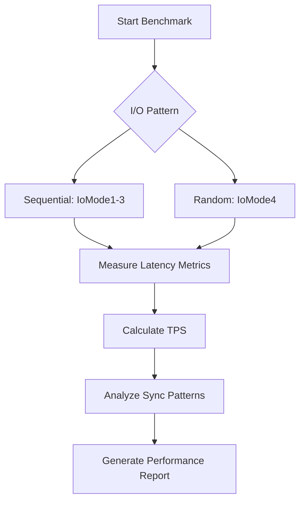

# I/O Read Benchmarking

<cite>
**Referenced Files in This Document**   
- [IoModeBase.java](file://benchmark/src/main/java/com/github/dtprj/dongting/bench/io/IoModeBase.java)
- [IoMode1.java](file://benchmark/src/main/java/com/github/dtprj/dongting/bench/io/IoMode1.java)
- [IoMode2.java](file://benchmark/src/main/java/com/github/dtprj/dongting/bench/io/IoMode2.java)
- [IoMode3.java](file://benchmark/src/main/java/com/github/dtprj/dongting/bench/io/IoMode3.java)
- [IoMode4.java](file://benchmark/src/main/java/com/github/dtprj/dongting/bench/io/IoMode4.java)
- [IoTest.java](file://benchmark/src/main/java/com/github/dtprj/dongting/bench/io/IoTest.java)
- [SyncTest.java](file://benchmark/src/main/java/com/github/dtprj/dongting/bench/io/SyncTest.java)
- [WriteTask.java](file://benchmark/src/main/java/com/github/dtprj/dongting/bench/io/WriteTask.java)
- [DefaultRaftLog.java](file://server/src/main/java/com/github/dtprj/dongting/raft/store/DefaultRaftLog.java)
- [LogFile.java](file://server/src/main/java/com/github/dtprj/dongting/raft/store/LogFile.java)
- [LogFileQueue.java](file://server/src/main/java/com/github/dtprj/dongting/raft/store/LogFileQueue.java)
- [AsyncIoTask.java](file://server/src/main/java/com/github/dtprj/dongting/raft/store/AsyncIoTask.java)
</cite>

## Table of Contents
1. [Introduction](#introduction)
2. [IoModeBase Class and Configuration Parameters](#iomodebase-class-and-configuration-parameters)
3. [Read Workload Characteristics](#read-workload-characteristics)
4. [Sequential and Random Read Performance Patterns](#sequential-and-random-read-performance-patterns)
5. [Impact on RAFT Consensus Operations](#impact-on-raft-consensus-operations)
6. [Read Latency Metrics and Performance Analysis](#read-latency-metrics-and-performance-analysis)
7. [Extending the Benchmark Framework](#extending-the-benchmark-framework)
8. [File System Caching Impact](#file-system-caching-impact)
9. [Conclusion](#conclusion)

## Introduction
This document provides a comprehensive analysis of I/O read benchmarking in the context of RAFT log storage, focusing on the IoModeBase class and related storage components. The benchmarking framework is designed to measure sequential and random read performance patterns, which are critical for understanding the behavior of RAFT-based distributed systems. The analysis covers configuration parameters that define read workload characteristics, the impact of read performance on RAFT consensus operations, and guidance on interpreting read latency metrics. The document also includes recommendations for extending the benchmark framework and analyzing the performance impact of file system caching on read operations.

## IoModeBase Class and Configuration Parameters

The IoModeBase class serves as the foundation for various I/O benchmarking modes, providing a consistent interface for measuring read performance. This abstract class defines key configuration parameters that control the characteristics of read workloads and establishes the framework for implementing different I/O patterns.

The class defines several static constants that determine the benchmark parameters:
- **FILE_SIZE**: Set to 100MB, this parameter defines the total size of the test file used for benchmarking
- **BUFFER_SIZE**: Set to 4KB, this parameter determines the size of individual read operations
- **MAX_PENDING**: Set to 1024, this parameter controls the maximum number of concurrent pending operations
- **COUNT**: Derived from FILE_SIZE divided by BUFFER_SIZE, this parameter represents the total number of read operations to be performed

The IoModeBase class implements a multi-threaded approach to benchmarking, with separate threads for writer and sync operations. The start() method initializes these threads, allowing for the measurement of both write and synchronization performance. The class also includes utility methods for file creation and setup, ensuring consistent test conditions across different benchmark modes.

**Section sources**
- [IoModeBase.java](file://benchmark/src/main/java/com/github/dtprj/dongting/bench/io/IoModeBase.java#L27-L39)

## Read Workload Characteristics

The I/O benchmarking framework defines read workload characteristics through the configuration parameters established in the IoModeBase class. These parameters create a standardized testing environment that allows for consistent comparison across different I/O patterns and system configurations.

The FILE_SIZE parameter of 100MB creates a test file that is large enough to extend beyond typical file system caches, ensuring that benchmark results reflect both cached and uncached read performance. This size is particularly relevant for RAFT log storage, where log files can grow significantly over time as the system processes commands and maintains state history.

The BUFFER_SIZE of 4KB aligns with common file system block sizes and represents a typical read operation size for log-based storage systems. This size is optimal for measuring the performance of sequential reads while also providing insight into random access patterns when combined with appropriate access patterns.

The MAX_PENDING parameter of 1024 allows for high concurrency in I/O operations, which is essential for accurately measuring the performance of modern storage systems that can handle multiple simultaneous operations. This parameter helps reveal the scalability characteristics of the storage subsystem and its ability to handle the concurrent read requests that occur during RAFT consensus operations.

**Section sources**
- [IoModeBase.java](file://benchmark/src/main/java/com/github/dtprj/dongting/bench/io/IoModeBase.java#L27-L31)

## Sequential and Random Read Performance Patterns

The benchmark framework implements multiple I/O modes that demonstrate different sequential and random read performance patterns, each designed to simulate specific aspects of RAFT log storage access patterns.

### Sequential Read Patterns
The IoMode1, IoMode2, and IoMode3 classes implement variations of sequential read patterns with different synchronization strategies. IoMode1 writes data instantly and performs batch synchronization, allowing for high throughput when the underlying storage can handle concurrent writes and periodic fsync operations. IoMode2 ensures that the sync thread waits for all pending writes to complete before performing synchronization, creating a more controlled but potentially slower pattern. IoMode3 prevents concurrent writing and syncing, creating a strict sequential pattern that can help identify bottlenecks in the storage subsystem.

### Random Read Patterns
IoMode4 implements a more complex pattern that uses multiple files and sophisticated file rotation logic to simulate random access patterns. With four files and a maximum batch size calculated based on the MAX_PENDING parameter, this mode creates a workload that alternates between different files, simulating the random access patterns that can occur during log compaction and snapshot installation in RAFT systems.

The benchmark measures key performance indicators for both sequential and random patterns, including:
- Average sync latency
- Average write latency
- Transactions per second (TPS)
- Average sync time
- Average sync batch size

These metrics provide a comprehensive view of storage performance under different access patterns, helping to identify whether the storage subsystem is optimized for sequential or random access workloads.

**Diagram sources**
- [IoMode1.java](file://benchmark/src/main/java/com/github/dtprj/dongting/bench/io/IoMode1.java#L34-L175)
- [IoMode2.java](file://benchmark/src/main/java/com/github/dtprj/dongting/bench/io/IoMode2.java#L34-L173)
- [IoMode3.java](file://benchmark/src/main/java/com/github/dtprj/dongting/bench/io/IoMode3.java#L34-L176)
- [IoMode4.java](file://benchmark/src/main/java/com/github/dtprj/dongting/bench/io/IoMode4.java#L34-L218)

## Impact on RAFT Consensus Operations

The read performance characteristics measured by the I/O benchmarking framework have significant implications for RAFT consensus operations, particularly during log replication and snapshot installation. The performance of these operations directly affects leader election times and command commitment latency in distributed systems.

### Log Replication
During log replication, the leader node must read log entries from its local storage and transmit them to follower nodes. The sequential read performance of the storage subsystem determines how quickly the leader can stream log entries to followers. Poor sequential read performance can create bottlenecks in the replication process, increasing the time required for followers to catch up and potentially triggering unnecessary leader elections when followers time out.

The IoMode1-3 benchmarks, which measure sequential read patterns, are particularly relevant for evaluating log replication performance. Systems with high sequential read throughput can replicate logs more efficiently, reducing network congestion and improving overall cluster responsiveness.

### Snapshot Installation
Snapshot installation involves transferring and applying large snapshot files to bring a follower node up to date. This process requires both sequential and random read patterns, as the system must read the snapshot file sequentially while also performing random access to update the state machine. The IoMode4 benchmark, with its multi-file approach and complex file rotation logic, closely simulates the access patterns during snapshot installation.

Slow snapshot installation can significantly impact cluster availability, as nodes remain out of sync for extended periods. The benchmark metrics for average sync latency and TPS provide valuable insights into how quickly snapshots can be processed and applied.

### Leader Election and Command Commitment
Read performance also affects leader election times and command commitment latency. During leader election, candidate nodes must read their log entries to determine their term and index, with faster read performance enabling quicker election cycles. Similarly, command commitment latency is influenced by the time required to read previous log entries when validating new commands.

The relationship between read performance and consensus operations can be expressed as:
- Leader election time ∝ 1 / (sequential read throughput)
- Command commitment latency ∝ average read latency
- Cluster responsiveness ∝ TPS / network bandwidth

**Section sources**
- [DefaultRaftLog.java](file://server/src/main/java/com/github/dtprj/dongting/raft/store/DefaultRaftLog.java#L47-L416)
- [LogFileQueue.java](file://server/src/main/java/com/github/dtprj/dongting/raft/store/LogFileQueue.java#L42-L293)

## Read Latency Metrics and Performance Analysis

The I/O benchmarking framework provides detailed read latency metrics that are essential for evaluating storage performance and its impact on RAFT consensus operations. These metrics enable system administrators and developers to identify performance bottlenecks and optimize system configuration.

### Key Performance Metrics
The benchmark measures several critical performance indicators:
- **Average sync latency**: The average time from when a write operation begins to when it is fully synchronized to persistent storage
- **Average write latency**: The average time required to complete a write operation before synchronization
- **TPS (Transactions Per Second)**: The throughput of the storage system, calculated as the total number of operations divided by execution time
- **Average sync time**: The average duration of the synchronization (fsync) operation
- **Average sync batch**: The average number of operations included in each synchronization batch

### Interpreting the Metrics
When analyzing these metrics, it's important to consider the following guidelines:
- Low average sync latency indicates efficient storage synchronization, which is critical for data durability and consistency
- High TPS values suggest good overall storage throughput, enabling faster log replication and command processing
- A high average sync batch size indicates effective batching of operations, which can improve overall efficiency
- The ratio of average write latency to average sync latency reveals the relative cost of synchronization operations

### Performance Optimization
Based on the benchmark results, several optimization strategies can be applied:
1. **File system tuning**: Adjusting file system parameters such as block size and journaling mode to better match the access patterns
2. **Storage hardware selection**: Choosing storage devices with appropriate characteristics (e.g., high IOPS for random access, high throughput for sequential access)
3. **Configuration adjustments**: Modifying the FILE_SIZE, BUFFER_SIZE, and MAX_PENDING parameters to better match the expected workload
4. **Caching strategies**: Implementing appropriate caching layers to reduce the frequency of expensive disk operations

The performance analysis should also consider the trade-offs between durability and performance. More frequent synchronization improves data durability but reduces throughput, while less frequent synchronization increases performance at the cost of potential data loss in case of system failure.

**Section sources**
- [IoMode1.java](file://benchmark/src/main/java/com/github/dtprj/dongting/bench/io/IoMode1.java#L161-L173)
- [IoMode2.java](file://benchmark/src/main/java/com/github/dtprj/dongting/bench/io/IoMode2.java#L159-L171)
- [IoMode3.java](file://benchmark/src/main/java/com/github/dtprj/dongting/bench/io/IoMode3.java#L161-L173)
- [IoMode4.java](file://benchmark/src/main/java/com/github/dtprj/dongting/bench/io/IoMode4.java#L201-L215)

## Extending the Benchmark Framework

The I/O benchmarking framework can be extended to test additional read patterns and analyze more complex performance scenarios. The modular design of the IoMode classes makes it relatively straightforward to implement new benchmark modes that simulate different access patterns relevant to RAFT log storage.

### Implementing New Read Patterns
To extend the framework with new read patterns, developers can create additional classes that extend IoModeBase and implement the required abstract methods. For example, a new class could be created to simulate:
- **Variable buffer sizes**: Testing performance with different buffer sizes to identify optimal configurations
- **Mixed read/write patterns**: Simulating scenarios where read and write operations occur concurrently
- **Sparse access patterns**: Testing performance when accessing log entries at irregular intervals

### Custom Performance Analysis
The framework can be enhanced with additional performance analysis capabilities, such as:
- **Percentile-based latency reporting**: Providing P95, P99, and P999 latency metrics to better understand tail latency behavior
- **Throughput over time**: Measuring how throughput changes over the duration of the benchmark to identify performance degradation
- **Resource utilization monitoring**: Integrating with system monitoring tools to correlate I/O performance with CPU, memory, and disk utilization

### Integration with RAFT Operations
The benchmark framework can be further extended to directly measure the performance impact on specific RAFT operations:
- **Leader election simulation**: Measuring the time required for nodes to read their log entries during leader election
- **Log compaction analysis**: Testing performance when reading and rewriting log segments during compaction
- **Snapshot transfer testing**: Simulating the network transfer and application of snapshots to measure end-to-end performance

These extensions would provide even more detailed insights into the relationship between storage performance and RAFT consensus operations, enabling more targeted optimization efforts.

**Section sources**
- [IoModeBase.java](file://benchmark/src/main/java/com/github/dtprj/dongting/bench/io/IoModeBase.java#L26-L76)
- [WriteTask.java](file://benchmark/src/main/java/com/github/dtprj/dongting/bench/io/WriteTask.java#L21-L26)

## File System Caching Impact

The performance of I/O operations is significantly influenced by file system caching, which can dramatically affect the results of read benchmarking. Understanding the impact of caching is essential for interpreting benchmark results and optimizing system performance.

### Cache Effects on Benchmark Results
File system caching can create substantial differences between cached and uncached read performance:
- **Cached reads**: When data is available in memory cache, read operations can complete in microseconds, limited primarily by memory bandwidth
- **Uncached reads**: When data must be read from physical storage, read operations can take milliseconds, limited by disk seek time and rotational latency (for HDDs) or I/O processing time (for SSDs)

The benchmark framework's use of a 100MB file size is specifically designed to exceed typical cache sizes, ensuring that results reflect a mix of cached and uncached operations. This approach provides a more realistic assessment of storage performance under sustained workloads.

### Analyzing Cache Behavior
To analyze the impact of file system caching, the following approaches can be used:
1. **Cache warming and cooling**: Running the benchmark multiple times with and without pre-warming the cache to compare performance differences
2. **Cache size variation**: Adjusting the FILE_SIZE parameter to create test files of different sizes relative to available memory
3. **Cache eviction testing**: Using system commands to clear caches between benchmark runs to ensure consistent testing conditions

### Optimizing for Cache Performance
Based on the analysis of cache behavior, several optimization strategies can be applied:
- **Memory allocation**: Ensuring sufficient memory is available for file system caching
- **Cache-friendly access patterns**: Designing applications to use sequential access patterns when possible, as these are more cache-efficient
- **Prefetching strategies**: Implementing prefetching mechanisms to load data into cache before it is needed
- **Cache-aware configuration**: Tuning system parameters such as read-ahead settings to optimize cache utilization

The relationship between cache size and performance can be expressed as:
- Performance improvement ∝ min(1, cache_size / working_set_size)
- Effective IOPS ∝ base_IOPS × (1 + cache_hit_ratio × cache_speedup_factor)

Where the cache_hit_ratio represents the proportion of requests served from cache, and the cache_speedup_factor represents the performance improvement of cached versus uncached operations.

**Section sources**
- [SyncTest.java](file://benchmark/src/main/java/com/github/dtprj/dongting/bench/io/SyncTest.java#L32-L167)
- [IoTest.java](file://benchmark/src/main/java/com/github/dtprj/dongting/bench/io/IoTest.java#L34-L196)

## Conclusion
The I/O read benchmarking framework based on the IoModeBase class provides a comprehensive approach to measuring sequential and random read performance patterns in the context of RAFT log storage. By defining standardized configuration parameters such as FILE_SIZE, BUFFER_SIZE, and COUNT, the framework enables consistent evaluation of storage performance across different systems and configurations.

The analysis of read performance is critical for understanding its impact on RAFT consensus operations, particularly during log replication and snapshot installation. The benchmark metrics provide valuable insights into how storage characteristics affect leader election times and command commitment latency, enabling system administrators to optimize their configurations for better performance and reliability.

The framework's modular design allows for easy extension to test additional read patterns and analyze more complex performance scenarios. By incorporating analysis of file system caching effects, the benchmark provides a realistic assessment of storage performance under various conditions.

For optimal results, organizations should use this benchmarking framework to:
1. Establish baseline performance metrics for their storage systems
2. Evaluate the impact of configuration changes on I/O performance
3. Compare different storage hardware and file system options
4. Identify performance bottlenecks in their RAFT-based distributed systems
5. Optimize system configuration for their specific workload patterns

Regular benchmarking and performance analysis will help ensure that RAFT-based systems maintain high availability, low latency, and strong consistency under varying workloads and system conditions.