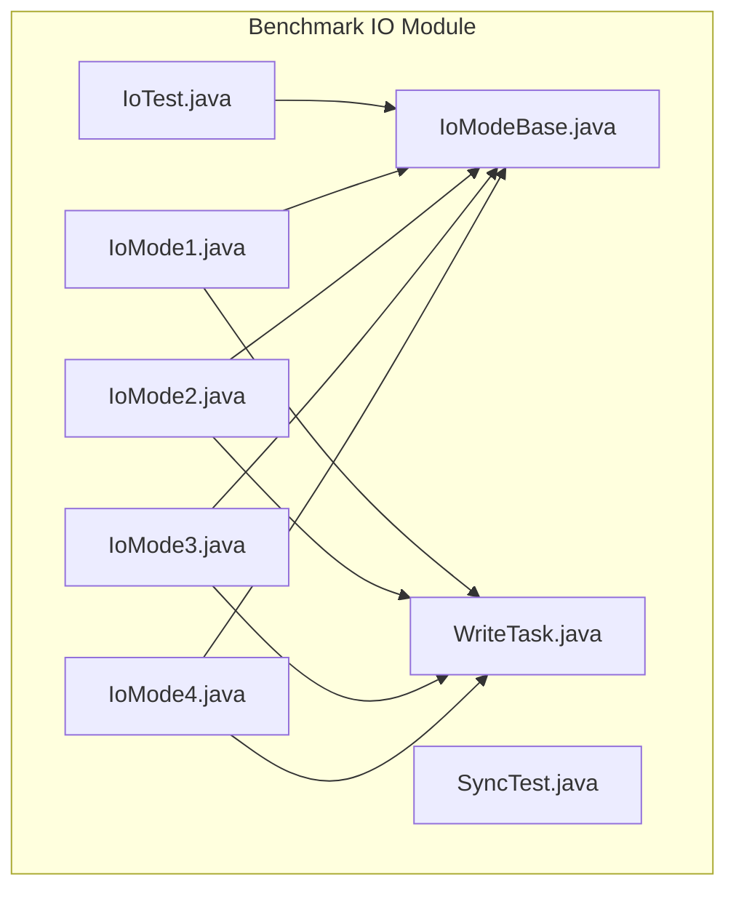
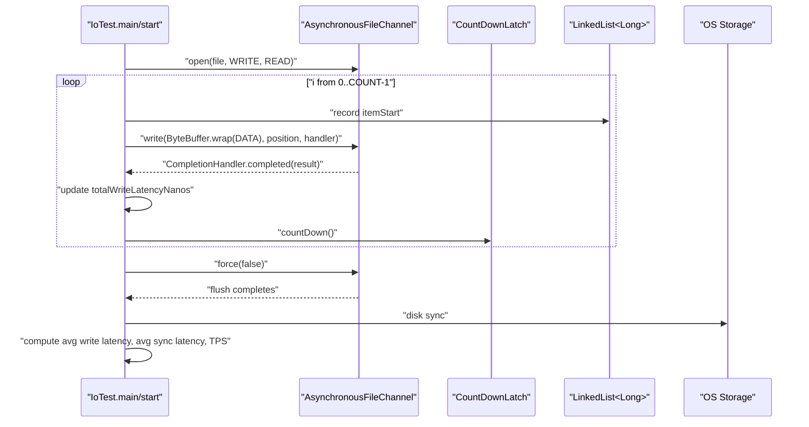
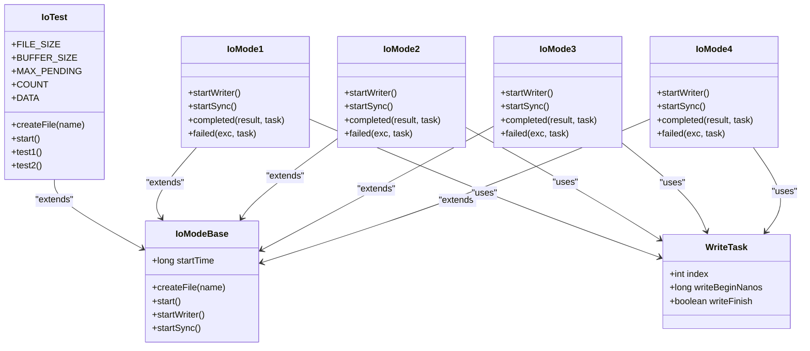

# I/O Write Benchmarking

<cite>
**Referenced Files in This Document**
- [IoTest.java](file://benchmark/src/main/java/com/github/dtprj/dongting/bench/io/IoTest.java)
- [IoModeBase.java](file://benchmark/src/main/java/com/github/dtprj/dongting/bench/io/IoModeBase.java)
- [IoMode1.java](file://benchmark/src/main/java/com/github/dtprj/dongting/bench/io/IoMode1.java)
- [IoMode2.java](file://benchmark/src/main/java/com/github/dtprj/dongting/bench/io/IoMode2.java)
- [IoMode3.java](file://benchmark/src/main/java/com/github/dtprj/dongting/bench/io/IoMode3.java)
- [IoMode4.java](file://benchmark/src/main/java/com/github/dtprj/dongting/bench/io/IoMode4.java)
- [WriteTask.java](file://benchmark/src/main/java/com/github/dtprj/dongting/bench/io/WriteTask.java)
- [SyncTest.java](file://benchmark/src/main/java/com/github/dtprj/dongting/bench/io/SyncTest.java)
- [README.md](file://README.md)
</cite>

## Table of Contents
1. [Introduction](#introduction)
2. [Project Structure](#project-structure)
3. [Core Components](#core-components)
4. [Architecture Overview](#architecture-overview)
5. [Detailed Component Analysis](#detailed-component-analysis)
6. [Dependency Analysis](#dependency-analysis)
7. [Performance Considerations](#performance-considerations)
8. [Troubleshooting Guide](#troubleshooting-guide)
9. [Conclusion](#conclusion)
10. [Appendices](#appendices)

## Introduction
This document explains the I/O write benchmarking methodology implemented in the IoTest class and related modes. It focuses on measuring sequential write performance using direct ByteBuffer operations with AsynchronousFileChannel. The benchmark defines three key configuration parameters: FILE_SIZE (128 MB), BUFFER_SIZE (4 KB), and MAX_PENDING (1024). It collects metrics for write latency, sync latency, and transactions per second (TPS). Guidance is provided for interpreting results, understanding the relationship between pending operations and throughput, and adapting the benchmark for different buffer sizes, file sizes, and storage write amplification analysis. Special attention is given to the role of force(false) and its impact on durability versus performance.

## Project Structure
The I/O benchmarking suite resides under the benchmark module and includes:
- Sequential write benchmarks using AsynchronousFileChannel
- Multiple write/sync coordination modes
- Synchronization cost comparison tests
- Shared base classes and tasks

**Diagram sources**
- [IoTest.java](file://benchmark/src/main/java/com/github/dtprj/dongting/bench/io/IoTest.java#L1-L196)
- [IoModeBase.java](file://benchmark/src/main/java/com/github/dtprj/dongting/bench/io/IoModeBase.java#L1-L77)
- [IoMode1.java](file://benchmark/src/main/java/com/github/dtprj/dongting/bench/io/IoMode1.java#L1-L175)
- [IoMode2.java](file://benchmark/src/main/java/com/github/dtprj/dongting/bench/io/IoMode2.java#L1-L173)
- [IoMode3.java](file://benchmark/src/main/java/com/github/dtprj/dongting/bench/io/IoMode3.java#L1-L176)
- [IoMode4.java](file://benchmark/src/main/java/com/github/dtprj/dongting/bench/io/IoMode4.java#L1-L218)
- [WriteTask.java](file://benchmark/src/main/java/com/github/dtprj/dongting/bench/io/WriteTask.java#L1-L26)
- [SyncTest.java](file://benchmark/src/main/java/com/github/dtprj/dongting/bench/io/SyncTest.java#L1-L167)

**Section sources**
- [IoTest.java](file://benchmark/src/main/java/com/github/dtprj/dongting/bench/io/IoTest.java#L1-L196)
- [IoModeBase.java](file://benchmark/src/main/java/com/github/dtprj/dongting/bench/io/IoModeBase.java#L1-L77)
- [IoMode1.java](file://benchmark/src/main/java/com/github/dtprj/dongting/bench/io/IoMode1.java#L1-L175)
- [IoMode2.java](file://benchmark/src/main/java/com/github/dtprj/dongting/bench/io/IoMode2.java#L1-L173)
- [IoMode3.java](file://benchmark/src/main/java/com/github/dtprj/dongting/bench/io/IoMode3.java#L1-L176)
- [IoMode4.java](file://benchmark/src/main/java/com/github/dtprj/dongting/bench/io/IoMode4.java#L1-L218)
- [WriteTask.java](file://benchmark/src/main/java/com/github/dtprj/dongting/bench/io/WriteTask.java#L1-L26)
- [SyncTest.java](file://benchmark/src/main/java/com/github/dtprj/dongting/bench/io/SyncTest.java#L1-L167)

## Core Components
- IoTest: Implements sequential write benchmarking with AsynchronousFileChannel. It measures average write latency, average sync latency, and TPS. It includes two tests: single-file and multi-file scenarios.
- IoModeBase: Provides shared constants and file creation utilities for other modes.
- IoMode1/2/3/4: Implement different write/sync coordination strategies using locks and queues to coordinate asynchronous writes and periodic fsync.
- WriteTask: Lightweight task holder for tracking write start time and completion.
- SyncTest: Compares sync cost across synchronous FileChannel, asynchronous AsynchronousFileChannel, buffered OutputStream, and memory-mapped files.

Key configuration parameters:
- FILE_SIZE = 128 MB
- BUFFER_SIZE = 4 KB
- MAX_PENDING = 1024

These parameters define the number of write operations (COUNT = FILE_SIZE / BUFFER_SIZE) and the concurrency window for outstanding asynchronous writes.

**Section sources**
- [IoTest.java](file://benchmark/src/main/java/com/github/dtprj/dongting/bench/io/IoTest.java#L35-L42)
- [IoModeBase.java](file://benchmark/src/main/java/com/github/dtprj/dongting/bench/io/IoModeBase.java#L27-L34)
- [IoMode1.java](file://benchmark/src/main/java/com/github/dtprj/dongting/bench/io/IoMode1.java#L33-L40)
- [IoMode2.java](file://benchmark/src/main/java/com/github/dtprj/dongting/bench/io/IoMode2.java#L33-L40)
- [IoMode3.java](file://benchmark/src/main/java/com/github/dtprj/dongting/bench/io/IoMode3.java#L33-L40)
- [IoMode4.java](file://benchmark/src/main/java/com/github/dtprj/dongting/bench/io/IoMode4.java#L33-L43)
- [WriteTask.java](file://benchmark/src/main/java/com/github/dtprj/dongting/bench/io/WriteTask.java#L21-L26)
- [SyncTest.java](file://benchmark/src/main/java/com/github/dtprj/dongting/bench/io/SyncTest.java#L33-L38)

## Architecture Overview
The benchmark executes sequential writes using AsynchronousFileChannel with a fixed buffer size and a bounded concurrency window controlled by MAX_PENDING. Each write operation is timed from submission to completion. Periodic fsync (force(false)) is invoked to flush dirty pages to disk, and the elapsed time is measured to compute sync latency. Metrics are aggregated per operation and reported as averages and TPS.

**Diagram sources**
- [IoTest.java](file://benchmark/src/main/java/com/github/dtprj/dongting/bench/io/IoTest.java#L67-L122)
- [IoTest.java](file://benchmark/src/main/java/com/github/dtprj/dongting/bench/io/IoTest.java#L124-L194)

## Detailed Component Analysis

### IoTest: Sequential Write Benchmark
- File preparation: Creates a target directory and preallocates a file sized to FILE_SIZE, then closes it to ensure capacity.
- Single-file test:
  - Opens AsynchronousFileChannel in read/write mode.
  - Iterates COUNT times, submitting up to MAX_PENDING concurrent writes.
  - Uses a CountDownLatch to await completion of each batch.
  - After each batch, calls force(false) to flush dirty pages and records sync duration.
  - Aggregates per-operation write latency and computes average sync latency across all items.
  - Computes TPS from total wall-clock time.
- Multi-file test:
  - Uses multiple files and channels to distribute writes.
  - Applies the same batching and sync pattern per file.
  - Aggregates metrics across all files.

Metrics collected:
- Average write latency per operation (nanoseconds converted to microseconds)
- Average sync latency per operation (computed from per-item durations)
- Average sync time per fsync invocation
- Transactions per second (TPS)

Interpretation tips:
- Higher MAX_PENDING increases concurrency and can improve throughput until system limits are reached.
- Excessive pending operations can increase tail latencies and may cause resource contention.
- Sync frequency (force(false)) directly impacts durability and throughput trade-offs.

**Section sources**
- [IoTest.java](file://benchmark/src/main/java/com/github/dtprj/dongting/bench/io/IoTest.java#L43-L54)
- [IoTest.java](file://benchmark/src/main/java/com/github/dtprj/dongting/bench/io/IoTest.java#L67-L122)
- [IoTest.java](file://benchmark/src/main/java/com/github/dtprj/dongting/bench/io/IoTest.java#L124-L194)

### IoModeBase: Shared Infrastructure
- Defines FILE_SIZE, BUFFER_SIZE, MAX_PENDING, COUNT, and a shared DATA buffer.
- Provides createFile helper to preallocate and sync a file before tests.

**Section sources**
- [IoModeBase.java](file://benchmark/src/main/java/com/github/dtprj/dongting/bench/io/IoModeBase.java#L27-L52)

### IoMode1/2/3/4: Coordination Strategies
- IoMode1: Writes immediately; batches are moved to a sync queue and fsync is performed periodically. Maintains separate queues for write completion and sync completion, coordinated by ReentrantLock and Conditions.
- IoMode2: Similar to IoMode1, but the sync thread waits for all pending writes to finish before syncing.
- IoMode3: Serializes writes and syncs; disallows concurrent writes and syncs.
- IoMode4: Distributes writes across multiple files and coordinates per-file syncs with per-file queues and conditions.

All modes compute:
- Average write latency per operation
- Average sync latency per operation
- Average sync time per fsync
- Average sync batch size
- Total time and TPS

**Section sources**
- [IoMode1.java](file://benchmark/src/main/java/com/github/dtprj/dongting/bench/io/IoMode1.java#L33-L174)
- [IoMode2.java](file://benchmark/src/main/java/com/github/dtprj/dongting/bench/io/IoMode2.java#L33-L172)
- [IoMode3.java](file://benchmark/src/main/java/com/github/dtprj/dongting/bench/io/IoMode3.java#L33-L175)
- [IoMode4.java](file://benchmark/src/main/java/com/github/dtprj/dongting/bench/io/IoMode4.java#L33-L217)
- [WriteTask.java](file://benchmark/src/main/java/com/github/dtprj/dongting/bench/io/WriteTask.java#L21-L26)

### SyncTest: Synchronization Cost Comparison
- Compares sync costs across:
  - Buffered OutputStream with flush/getFD().sync()
  - FileChannel.write(...).force(false)
  - AsynchronousFileChannel.write(...).force(false)
  - Memory-mapped MappedByteBuffer.put(...).force()
- Reports average sync time per operation for each method.

This helps contextualize the cost of force(false) in different I/O models.

**Section sources**
- [SyncTest.java](file://benchmark/src/main/java/com/github/dtprj/dongting/bench/io/SyncTest.java#L39-L166)

## Dependency Analysis
The IoTest and IoMode* classes share a common base and task model. IoMode1/2/3/4 extend IoModeBase and use WriteTask to track per-operation timing and state transitions.

**Diagram sources**
- [IoTest.java](file://benchmark/src/main/java/com/github/dtprj/dongting/bench/io/IoTest.java#L35-L42)
- [IoModeBase.java](file://benchmark/src/main/java/com/github/dtprj/dongting/bench/io/IoModeBase.java#L27-L77)
- [IoMode1.java](file://benchmark/src/main/java/com/github/dtprj/dongting/bench/io/IoMode1.java#L33-L174)
- [IoMode2.java](file://benchmark/src/main/java/com/github/dtprj/dongting/bench/io/IoMode2.java#L33-L172)
- [IoMode3.java](file://benchmark/src/main/java/com/github/dtprj/dongting/bench/io/IoMode3.java#L33-L175)
- [IoMode4.java](file://benchmark/src/main/java/com/github/dtprj/dongting/bench/io/IoMode4.java#L33-L217)
- [WriteTask.java](file://benchmark/src/main/java/com/github/dtprj/dongting/bench/io/WriteTask.java#L21-L26)

**Section sources**
- [IoTest.java](file://benchmark/src/main/java/com/github/dtprj/dongting/bench/io/IoTest.java#L35-L42)
- [IoModeBase.java](file://benchmark/src/main/java/com/github/dtprj/dongting/bench/io/IoModeBase.java#L27-L77)
- [IoMode1.java](file://benchmark/src/main/java/com/github/dtprj/dongting/bench/io/IoMode1.java#L33-L174)
- [IoMode2.java](file://benchmark/src/main/java/com/github/dtprj/dongting/bench/io/IoMode2.java#L33-L172)
- [IoMode3.java](file://benchmark/src/main/java/com/github/dtprj/dongting/bench/io/IoMode3.java#L33-L175)
- [IoMode4.java](file://benchmark/src/main/java/com/github/dtprj/dongting/bench/io/IoMode4.java#L33-L217)
- [WriteTask.java](file://benchmark/src/main/java/com/github/dtprj/dongting/bench/io/WriteTask.java#L21-L26)

## Performance Considerations
- Buffer size (BUFFER_SIZE):
  - Smaller buffers reduce per-write overhead but increase the number of syscalls and potential context switches.
  - Larger buffers can improve throughput but risk higher latency and increased memory footprint.
- File size (FILE_SIZE):
  - Larger files increase total I/O volume and may expose filesystem and storage behavior differences.
  - Preallocation reduces fragmentation and improves write performance.
- Pending operations (MAX_PENDING):
  - Controls concurrency window for outstanding writes. Increasing beyond OS and storage capabilities can degrade performance due to scheduling and caching effects.
  - Balancing pending operations with available CPU and I/O bandwidth maximizes throughput.
- Sync frequency:
  - Frequent force(false) improves durability but reduces throughput. Infrequent sync improves throughput at the cost of durability.
  - The benchmark measures both write latency and sync latency to quantify this trade-off.

[No sources needed since this section provides general guidance]

## Troubleshooting Guide
Common issues and remedies:
- Partial write results:
  - The benchmark checks that each write returns the expected buffer size. If not, it exits early. Verify buffer size alignment and file size to COUNT.
- File preallocation failures:
  - Ensure the target directory exists and the process has write permissions. The benchmark creates the directory if missing.
- High tail latencies:
  - Reduce MAX_PENDING or tune storage backend settings. Monitor OS page cache behavior and disk queue depth.
- Unexpected sync times:
  - Confirm that force(false) is invoked after each batch or per-file as intended by the chosen mode.

**Section sources**
- [IoTest.java](file://benchmark/src/main/java/com/github/dtprj/dongting/bench/io/IoTest.java#L82-L98)
- [IoModeBase.java](file://benchmark/src/main/java/com/github/dtprj/dongting/bench/io/IoModeBase.java#L41-L52)

## Conclusion
The IoTest and related modes provide a comprehensive framework for measuring sequential write performance with AsynchronousFileChannel. By tuning FILE_SIZE, BUFFER_SIZE, and MAX_PENDING, and by analyzing write latency, sync latency, and TPS, practitioners can understand the throughput-durability trade-offs and optimize storage behavior. The SyncTest offers comparative insights into synchronization costs across different I/O models.

[No sources needed since this section summarizes without analyzing specific files]

## Appendices

### Methodology for Measuring Sequential Write Performance
- Use AsynchronousFileChannel with direct ByteBuffer to minimize copies.
- Submit up to MAX_PENDING writes per iteration and await completion with CountDownLatch.
- Record per-operation write latency from submission to completion.
- Periodically call force(false) to measure sync latency and cost.
- Aggregate metrics and compute TPS from total elapsed time.

**Section sources**
- [IoTest.java](file://benchmark/src/main/java/com/github/dtprj/dongting/bench/io/IoTest.java#L67-L122)
- [IoTest.java](file://benchmark/src/main/java/com/github/dtprj/dongting/bench/io/IoTest.java#L124-L194)

### Interpreting Benchmark Results
- Average write latency reflects per-op write completion timing.
- Average sync latency reflects per-op time from write completion to fsync completion.
- TPS indicates sustained throughput over the entire run.
- Relationship between pending operations and throughput:
  - Increasing MAX_PENDING can raise throughput until system limits are hit.
  - Beyond optimal concurrency, latency and throughput may degrade due to contention and scheduling overhead.

**Section sources**
- [IoTest.java](file://benchmark/src/main/java/com/github/dtprj/dongting/bench/io/IoTest.java#L112-L119)
- [IoMode1.java](file://benchmark/src/main/java/com/github/dtprj/dongting/bench/io/IoMode1.java#L161-L170)
- [IoMode2.java](file://benchmark/src/main/java/com/github/dtprj/dongting/bench/io/IoMode2.java#L159-L168)
- [IoMode3.java](file://benchmark/src/main/java/com/github/dtprj/dongting/bench/io/IoMode3.java#L162-L171)
- [IoMode4.java](file://benchmark/src/main/java/com/github/dtprj/dongting/bench/io/IoMode4.java#L199-L210)

### Modifying the Benchmark for Different Scenarios
- Changing buffer size:
  - Adjust BUFFER_SIZE and recalculate COUNT accordingly. Ensure FILE_SIZE remains divisible by the new BUFFER_SIZE.
- Changing file size:
  - Adjust FILE_SIZE and recalculate COUNT. Ensure the target filesystem can accommodate the new size.
- Analyzing write amplification effects:
  - Use smaller buffers to increase the number of writes per unit data, observing increases in fsync frequency and potential write amplification on storage devices.
  - Compare single-file vs multi-file configurations to assess device-level parallelism benefits.

**Section sources**
- [IoTest.java](file://benchmark/src/main/java/com/github/dtprj/dongting/bench/io/IoTest.java#L35-L42)
- [IoModeBase.java](file://benchmark/src/main/java/com/github/dtprj/dongting/bench/io/IoModeBase.java#L27-L34)
- [IoMode4.java](file://benchmark/src/main/java/com/github/dtprj/dongting/bench/io/IoMode4.java#L41-L43)

### Significance of force(false)
- Purpose:
  - force(false) flushes dirty pages to the underlying storage without synchronizing metadata, reducing fsync overhead compared to force(true).
- Durability:
  - Improves durability compared to relying solely on OS page cache, but still leaves a small window before data reaches persistent media.
- Performance impact:
  - Frequent force(false) reduces throughput; infrequent sync improves throughput at the cost of durability.
- Context:
  - The benchmark measures sync latency and cost to quantify this trade-off across different I/O models and configurations.

**Section sources**
- [IoTest.java](file://benchmark/src/main/java/com/github/dtprj/dongting/bench/io/IoTest.java#L102-L109)
- [IoMode1.java](file://benchmark/src/main/java/com/github/dtprj/dongting/bench/io/IoMode1.java#L138-L140)
- [IoMode2.java](file://benchmark/src/main/java/com/github/dtprj/dongting/bench/io/IoMode2.java#L136-L138)
- [IoMode3.java](file://benchmark/src/main/java/com/github/dtprj/dongting/bench/io/IoMode3.java#L138-L140)
- [IoMode4.java](file://benchmark/src/main/java/com/github/dtprj/dongting/bench/io/IoMode4.java#L179-L181)
- [SyncTest.java](file://benchmark/src/main/java/com/github/dtprj/dongting/bench/io/SyncTest.java#L102-L104)
- [README.md](file://README.md#L33-L39)