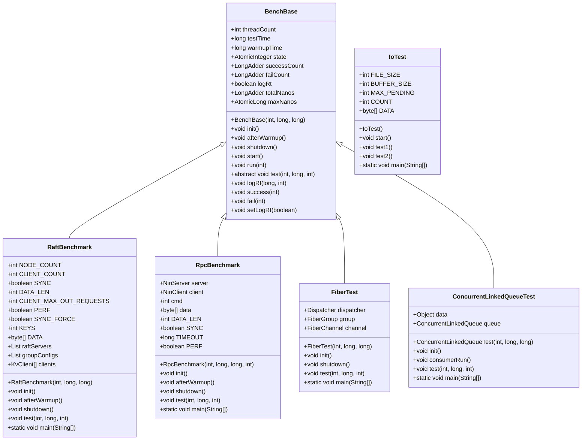
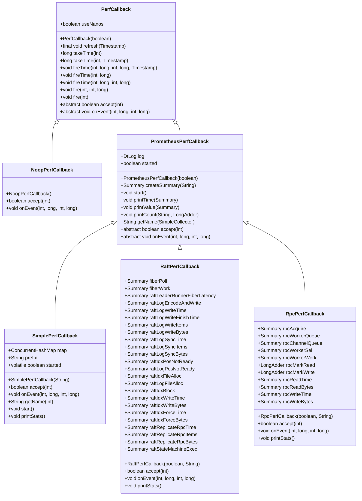

# Performance Benchmarking

<cite>
**Referenced Files in This Document**   
- [BenchBase.java](file://benchmark/src/main/java/com/github/dtprj/dongting/bench/common/BenchBase.java)
- [SimplePerfCallback.java](file://benchmark/src/main/java/com/github/dtprj/dongting/bench/common/SimplePerfCallback.java)
- [PrometheusPerfCallback.java](file://benchmark/src/main/java/com/github/dtprj/dongting/bench/common/PrometheusPerfCallback.java)
- [RaftBenchmark.java](file://benchmark/src/main/java/com/github/dtprj/dongting/bench/raft/RaftBenchmark.java)
- [RpcBenchmark.java](file://benchmark/src/main/java/com/github/dtprj/dongting/bench/rpc/RpcBenchmark.java)
- [IoTest.java](file://benchmark/src/main/java/com/github/dtprj/dongting/bench/io/IoTest.java)
- [FiberTest.java](file://benchmark/src/main/java/com/github/dtprj/dongting/bench/fiber/FiberTest.java)
- [ConcurrentLinkedQueueTest.java](file://benchmark/src/main/java/com/github/dtprj/dongting/bench/queue/ConcurrentLinkedQueueTest.java)
- [RaftPerfCallback.java](file://benchmark/src/main/java/com/github/dtprj/dongting/bench/raft/RaftPerfCallback.java)
- [RpcPerfCallback.java](file://benchmark/src/main/java/com/github/dtprj/dongting/bench/rpc/RpcPerfCallback.java)
- [TestProps.java](file://benchmark/src/main/java/com/github/dtprj/dongting/bench/common/TestProps.java)
- [PerfCallback.java](file://client/src/main/java/com/github/dtprj/dongting/common/PerfCallback.java)
</cite>

## Table of Contents
1. [Introduction](#introduction)
2. [Benchmark Framework Architecture](#benchmark-framework-architecture)
3. [Core Benchmark Classes](#core-benchmark-classes)
4. [Performance Callback System](#performance-callback-system)
5. [Running Benchmarks](#running-benchmarks)
6. [Creating Custom Benchmarks](#creating-custom-benchmarks)
7. [Benchmarking Best Practices](#benchmarking-best-practices)
8. [Conclusion](#conclusion)

## Introduction

The Dongting benchmarking framework provides a comprehensive suite of performance testing tools designed to evaluate various aspects of the system's performance. This document details the architecture and usage of the benchmark module, focusing on key components such as fiber operations, queue throughput, I/O performance, RAFT consensus latency, and RPC call efficiency. The framework enables developers and performance engineers to measure, analyze, and optimize system performance across different configurations and workloads.

**Section sources**
- [BenchBase.java](file://benchmark/src/main/java/com/github/dtprj/dongting/bench/common/BenchBase.java#L1-L153)

## Benchmark Framework Architecture

The benchmark framework is built around a modular architecture that allows for easy extension and customization. At its core is the `BenchBase` class, which provides the fundamental structure for all benchmarks. This base class handles the lifecycle management of benchmark execution, including warmup periods, test execution, and shutdown procedures.

The framework follows a consistent pattern across all benchmark types, with each benchmark extending `BenchBase` and implementing the `test` method to define the specific workload. The architecture supports multiple concurrent threads to simulate realistic load conditions, with configurable test duration and warmup periods to ensure accurate measurements.



**Diagram sources **
- [BenchBase.java](file://benchmark/src/main/java/com/github/dtprj/dongting/bench/common/BenchBase.java#L30-L152)
- [RaftBenchmark.java](file://benchmark/src/main/java/com/github/dtprj/dongting/bench/raft/RaftBenchmark.java#L54-L228)
- [RpcBenchmark.java](file://benchmark/src/main/java/com/github/dtprj/dongting/bench/rpc/RpcBenchmark.java#L41-L161)
- [IoTest.java](file://benchmark/src/main/java/com/github/dtprj/dongting/bench/io/IoTest.java#L34-L195)
- [FiberTest.java](file://benchmark/src/main/java/com/github/dtprj/dongting/bench/fiber/FiberTest.java#L32-L88)
- [ConcurrentLinkedQueueTest.java](file://benchmark/src/main/java/com/github/dtprj/dongting/bench/queue/ConcurrentLinkedQueueTest.java#L14-L52)

**Section sources**
- [BenchBase.java](file://benchmark/src/main/java/com/github/dtprj/dongting/bench/common/BenchBase.java#L30-L152)
- [RaftBenchmark.java](file://benchmark/src/main/java/com/github/dtprj/dongting/bench/raft/RaftBenchmark.java#L54-L228)
- [RpcBenchmark.java](file://benchmark/src/main/java/com/github/dtprj/dongting/bench/rpc/RpcBenchmark.java#L41-L161)
- [IoTest.java](file://benchmark/src/main/java/com/github/dtprj/dongting/bench/io/IoTest.java#L34-L195)
- [FiberTest.java](file://benchmark/src/main/java/com/github/dtprj/dongting/bench/fiber/FiberTest.java#L32-L88)
- [ConcurrentLinkedQueueTest.java](file://benchmark/src/main/java/com/github/dtprj/dongting/bench/queue/ConcurrentLinkedQueueTest.java#L14-L52)

## Core Benchmark Classes

### RaftBenchmark

The `RaftBenchmark` class evaluates the performance of the RAFT consensus algorithm implementation. It creates a cluster of RAFT nodes and measures the latency and throughput of write operations under various configurations. The benchmark supports both synchronous and asynchronous client operations, allowing for comparison of different consistency models.

Key configuration parameters include:
- `NODE_COUNT`: Number of RAFT nodes in the cluster
- `CLIENT_COUNT`: Number of client threads and TCP connections
- `SYNC`: Whether client requests are sent synchronously or asynchronously
- `DATA_LEN`: Size of the data payload in bytes
- `CLIENT_MAX_OUT_REQUESTS`: Maximum number of outstanding requests per client
- `PERF`: Whether to enable performance monitoring
- `SYNC_FORCE`: Whether to wait for FileChannel.force after writes
- `KEYS`: Total number of different keys for the benchmark

The benchmark initializes a RAFT cluster with the specified configuration, starts the nodes, and establishes client connections. During the test phase, it performs write operations using a key distribution based on the current time, measuring both success and failure rates along with response times.

**Section sources**
- [RaftBenchmark.java](file://benchmark/src/main/java/com/github/dtprj/dongting/bench/raft/RaftBenchmark.java#L54-L228)

### RpcBenchmark

The `RpcBenchmark` class measures the performance of RPC (Remote Procedure Call) operations within the Dongting system. It sets up a simple client-server architecture and evaluates the latency and throughput of RPC calls under different conditions.

Key configuration parameters include:
- `DATA_LEN`: Size of the data payload in bytes
- `SYNC`: Whether RPC calls are synchronous or asynchronous
- `TIMEOUT`: Timeout duration for RPC calls in milliseconds
- `PERF`: Whether to enable performance monitoring

The benchmark creates a server with configurable IO and business threads, starts a client connection, and then executes RPC operations during the test phase. It supports different command types through the `cmd` parameter, allowing for testing of various RPC endpoints.

**Section sources**
- [RpcBenchmark.java](file://benchmark/src/main/java/com/github/dtprj/dongting/bench/rpc/RpcBenchmark.java#L41-L161)

### IoTest

The `IoTest` class evaluates I/O performance, specifically focusing on file system operations and their impact on overall system performance. Unlike other benchmarks that extend `BenchBase`, this class implements its own testing framework tailored to I/O operations.

The benchmark includes two test methods:
- `test1()`: Measures I/O performance with a single file and periodic fsync operations
- `test2()`: Measures I/O performance with multiple files to simulate more complex storage scenarios

Key metrics collected include:
- Average sync latency
- Average write latency
- Transactions per second (TPS)
- Average sync time
- Total execution time

The test uses asynchronous file channels to simulate high-concurrency I/O operations, with configurable buffer sizes and maximum pending operations.

**Section sources**
- [IoTest.java](file://benchmark/src/main/java/com/github/dtprj/dongting/bench/io/IoTest.java#L34-L195)

### FiberTest

The `FiberTest` class evaluates the performance of the fiber-based concurrency model in Dongting. Fibers are lightweight threads that provide efficient concurrency without the overhead of traditional OS threads.

The benchmark creates a dispatcher and fiber group, then establishes a producer-consumer pattern using fiber channels. During initialization, it sets up a producer fiber that creates consumer fibers for each message. The test method itself simulates work by sleeping for a short duration.

This benchmark helps measure the overhead of fiber creation, scheduling, and communication through channels, providing insights into the efficiency of the fiber implementation.

**Section sources**
- [FiberTest.java](file://benchmark/src/main/java/com/github/dtprj/dongting/bench/fiber/FiberTest.java#L32-L88)

### Queue Performance Tests

The benchmark framework includes several tests for evaluating queue performance, including `ConcurrentLinkedQueueTest`, `MpscQueueTest`, and `LinkedBlockingQueueTest`. These tests measure the throughput and latency of different queue implementations under concurrent access patterns.

The `ConcurrentLinkedQueueTest` implements a simple producer-consumer pattern with one or more producer threads and a dedicated consumer thread. It measures the rate at which items can be added to and removed from the queue, providing insights into the queue's performance characteristics under different load conditions.

**Section sources**
- [ConcurrentLinkedQueueTest.java](file://benchmark/src/main/java/com/github/dtprj/dongting/bench/queue/ConcurrentLinkedQueueTest.java#L14-L52)

## Performance Callback System

### PerfCallback Architecture

The performance callback system in Dongting provides a flexible mechanism for collecting and reporting performance metrics during benchmark execution. The system is built around the `PerfCallback` abstract class, which defines the interface for performance event collection.



**Diagram sources **
- [PerfCallback.java](file://client/src/main/java/com/github/dtprj/dongting/common/PerfCallback.java#L21-L109)
- [NoopPerfCallback.java](file://client/src/main/java/com/github/dtprj/dongting/common/NoopPerfCallback.java)
- [PrometheusPerfCallback.java](file://benchmark/src/main/java/com/github/dtprj/dongting/bench/common/PrometheusPerfCallback.java#L31-L102)
- [SimplePerfCallback.java](file://benchmark/src/main/java/com/github/dtprj/dongting/bench/common/SimplePerfCallback.java#L29-L151)
- [RaftPerfCallback.java](file://benchmark/src/main/java/com/github/dtprj/dongting/bench/raft/RaftPerfCallback.java#L24-L183)
- [RpcPerfCallback.java](file://benchmark/src/main/java/com/github/dtprj/dongting/bench/rpc/RpcPerfCallback.java#L26-L117)

**Section sources**
- [PerfCallback.java](file://client/src/main/java/com/github/dtprj/dongting/common/PerfCallback.java#L21-L109)
- [PrometheusPerfCallback.java](file://benchmark/src/main/java/com/github/dtprj/dongting/bench/common/PrometheusPerfCallback.java#L31-L102)
- [SimplePerfCallback.java](file://benchmark/src/main/java/com/github/dtprj/dongting/bench/common/SimplePerfCallback.java#L29-L151)

### SimplePerfCallback

The `SimplePerfCallback` class provides a straightforward implementation of the performance callback system that collects and aggregates metrics in memory. It maintains a map of performance values keyed by performance type, with each value containing counters for invocation count, operation count, sum of values, time measurements, and maximum values.

The callback system uses a switch statement in the `getName` method to map performance type constants to descriptive names with a configurable prefix. This allows for easy identification of metrics from different components or instances.

During benchmark execution, the callback collects data points for various performance events, calculating averages, percentiles, and maximum values. The `printStats` method outputs formatted statistics to the log, including call counts, average times, total times, and maximum values.

**Section sources**
- [SimplePerfCallback.java](file://benchmark/src/main/java/com/github/dtprj/dongting/bench/common/SimplePerfCallback.java#L29-L151)

### PrometheusPerfCallback

The `PrometheusPerfCallback` serves as a base class for callbacks that integrate with Prometheus monitoring. It extends the basic performance callback functionality with support for Prometheus metrics collection and export.

Key features include:
- Creation of Prometheus Summary metrics for different performance dimensions
- Calculation of quantiles (0.0, 0.5, 0.99, 1.0) for latency measurements
- Formatted output of metrics with percentile information
- Support for both nanosecond and millisecond time units

The class provides utility methods for printing time-based and value-based metrics, automatically formatting the output with appropriate units and precision.

**Section sources**
- [PrometheusPerfCallback.java](file://benchmark/src/main/java/com/github/dtprj/dongting/bench/common/PrometheusPerfCallback.java#L31-L102)

### RaftPerfCallback

The `RaftPerfCallback` specializes in collecting performance metrics for RAFT consensus operations. It creates a comprehensive set of Prometheus Summary metrics for various aspects of RAFT performance, including:

- Fiber scheduling metrics (`fiber_poll`, `fiber_work`)
- Leader runner fiber latency (`raft_leader_runner_fiber_latency`)
- Log encoding and writing performance (`raft_log_encode_and_write`)
- Log write timing and throughput (`raft_log_write_time`, `raft_log_write_items`, `raft_log_write_bytes`)
- Log synchronization performance (`raft_log_sync_time`, `raft_log_sync_items`, `raft_log_sync_bytes`)
- Index file operations (`raft_idx_file_alloc`, `raft_idx_write_time`, `raft_idx_force_time`)
- Replication RPC performance (`raft_replicate_rpc_time`, `raft_replicate_rpc_items`, `raft_replicate_rpc_bytes`)
- State machine execution time (`raft_state_machine_exec`)

The `printStats` method outputs all collected metrics and calculates fiber thread utilization rates by comparing poll and work times.

**Section sources**
- [RaftPerfCallback.java](file://benchmark/src/main/java/com/github/dtprj/dongting/bench/raft/RaftPerfCallback.java#L24-L183)

### RpcPerfCallback

The `RpcPerfCallback` collects performance metrics specifically for RPC operations. It monitors various stages of the RPC lifecycle, including:

- Request acquisition time (`rpc_acquire`)
- Worker queue latency (`rpc_worker_queue`)
- Channel queue latency (`rpc_channel_queue`)
- Worker selection time (`rpc_worker_sel`)
- Worker processing time (`rpc_worker_work`)
- Network read and write performance (`rpc_read_time`, `rpc_write_time`, `rpc_read_bytes`, `rpc_write_bytes`)

Additionally, it uses `LongAdder` counters to track the number of read and write operations marked by the RPC system. The `printStats` method outputs all metrics and calculates worker thread utilization rates.

**Section sources**
- [RpcPerfCallback.java](file://benchmark/src/main/java/com/github/dtprj/dongting/bench/rpc/RpcPerfCallback.java#L26-L117)

## Running Benchmarks

### Example Execution

To run the RAFT benchmark, execute the main method of `RaftBenchmark` with appropriate parameters:

```java
RaftBenchmark benchmark = new RaftBenchmark(CLIENT_COUNT, 5000, 100);
benchmark.setLogRt(true);
benchmark.start();
```

This configuration runs the benchmark with the specified number of client threads, a test duration of 5 seconds, and a warmup period of 100 milliseconds. The `setLogRt(true)` call enables response time logging.

For the RPC benchmark:

```java
RpcBenchmark benchmark = new RpcBenchmark(1, 5000, 1000, Commands.CMD_PING);
benchmark.setLogRt(true);
benchmark.start();
```

This runs the RPC benchmark with one thread, 5 seconds of testing, 1 second of warmup, and uses the ping command for testing.

### Interpreting Results

The benchmark output includes several key metrics:

- **Success count and operations per second (OPS)**: Indicates the throughput of successful operations
- **Failure count and OPS**: Shows the rate of failed operations
- **Response time statistics**: When enabled, shows maximum and average response times
- **Performance callback statistics**: Detailed metrics from the PerfCallback system

For example, the RAFT benchmark output might include:
```
success sc:123456, ops:24,691
fail sc:0, ops:0
Max time: 1,234 us
Avg time: 456 us
```

The performance callback output provides more detailed insights:
```
node1_raft_leader_runner_fiber_latency: call 123,456, avgTime 45.678us, totalTime 5.620ms, avgSum 1.0, avgCount 1.0, maxTime 1,234.567us, maxSum 1, maxCount 1
```

### Configuration Options

Benchmarks can be configured through static fields in each benchmark class:

- `threadCount`: Number of concurrent threads
- `testTime`: Duration of the test phase in milliseconds
- `warmupTime`: Duration of the warmup phase in milliseconds
- `PERF`: Enables or disables performance monitoring
- `SYNC`: Controls synchronous vs asynchronous operation mode
- Various size and count parameters specific to each benchmark

**Section sources**
- [RaftBenchmark.java](file://benchmark/src/main/java/com/github/dtprj/dongting/bench/raft/RaftBenchmark.java#L54-L228)
- [RpcBenchmark.java](file://benchmark/src/main/java/com/github/dtprj/dongting/bench/rpc/RpcBenchmark.java#L41-L161)
- [IoTest.java](file://benchmark/src/main/java/com/github/dtprj/dongting/bench/io/IoTest.java#L34-L195)

## Creating Custom Benchmarks

### Extending BenchBase

To create a custom benchmark, extend the `BenchBase` class and implement the required methods:

```java
public class CustomBenchmark extends BenchBase {
    public CustomBenchmark(int threadCount, long testTime, long warmupTime) {
        super(threadCount, testTime, warmupTime);
    }
    
    @Override
    public void init() throws Exception {
        // Initialize resources and connections
    }
    
    @Override
    public void shutdown() throws Exception {
        // Clean up resources
    }
    
    @Override
    public void test(int threadIndex, long startTime, int state) {
        // Execute the benchmark workload
        try {
            // Perform the operation
            success(state);
        } catch (Exception e) {
            fail(state);
        } finally {
            if (logRt && state == STATE_TEST) {
                logRt(startTime, state);
            }
        }
    }
}
```

The `init` method should set up any required resources, connections, or data structures. The `shutdown` method should clean up these resources. The `test` method contains the core workload and should call `success(state)` on success and `fail(state)` on failure, with optional response time logging.

### Integrating with Monitoring

To integrate with the performance monitoring system, configure the appropriate `PerfCallback` in your component configurations:

```java
if (PERF) {
    groupConfig.perfCallback = new RaftPerfCallback(true, "custom_");
}
```

Ensure that performance events are properly fired using the `fireTime` and `fire` methods of the `PerfCallback` interface.

### Best Practices for Custom Benchmarks

When creating custom benchmarks, follow these best practices:

1. **Include adequate warmup time** to allow the JVM to optimize code paths
2. **Use realistic workloads** that reflect actual usage patterns
3. **Control variables carefully** when comparing different configurations
4. **Run multiple iterations** to ensure statistical significance
5. **Consider garbage collection effects** and potentially measure GC pauses
6. **Use consistent timing measurements** across different benchmark runs
7. **Document assumptions and limitations** of the benchmark

**Section sources**
- [BenchBase.java](file://benchmark/src/main/java/com/github/dtprj/dongting/bench/common/BenchBase.java#L30-L152)
- [RaftBenchmark.java](file://benchmark/src/main/java/com/github/dtprj/dongting/bench/raft/RaftBenchmark.java#L54-L228)

## Benchmarking Best Practices

### Warmup Requirements

Proper warmup is critical for accurate performance measurements. The JVM requires time to:
- Load and verify classes
- Compile bytecode to native code
- Optimize hot paths
- Stabilize garbage collection patterns

The benchmark framework includes a configurable warmup period (`warmupTime`) that should be set to at least 1-2 seconds for most benchmarks. During this period, the system runs the workload but does not collect performance metrics.

### Garbage Collection Considerations

Garbage collection can significantly impact performance measurements. To minimize GC interference:

1. **Use object pooling** where possible to reduce allocation rates
2. **Run benchmarks with consistent GC settings** across different runs
3. **Monitor GC activity** during benchmark execution
4. **Consider using GC logging** to analyze pause times and frequency
5. **Run benchmarks multiple times** to account for GC variability

### Configuration Comparison

When comparing performance across different configurations:

1. **Change one variable at a time** to isolate the impact of each configuration option
2. **Use identical hardware and OS settings** for all comparison runs
3. **Control external factors** like network conditions and system load
4. **Run each configuration multiple times** to establish confidence intervals
5. **Document all configuration parameters** used in each run

### Common Pitfalls

Avoid these common benchmarking pitfalls:

- **Insufficient warmup time**: Results in cold path measurements that don't reflect steady-state performance
- **Measurement overhead**: Ensure that measurement code doesn't significantly impact the measured performance
- **Insufficient test duration**: Short tests may not capture steady-state behavior
- **Ignoring outliers**: Extreme values can skew averages and should be analyzed separately
- **Overlooking system noise**: Background processes and system interrupts can affect results

**Section sources**
- [BenchBase.java](file://benchmark/src/main/java/com/github/dtprj/dongting/bench/common/BenchBase.java#L30-L152)
- [RaftBenchmark.java](file://benchmark/src/main/java/com/github/dtprj/dongting/bench/raft/RaftBenchmark.java#L54-L228)

## Conclusion

The Dongting benchmarking framework provides a comprehensive and extensible platform for performance evaluation of distributed systems components. By leveraging the `BenchBase` foundation and specialized benchmark classes like `RaftBenchmark` and `RpcBenchmark`, developers can accurately measure and analyze system performance across various dimensions.

The integrated performance callback system, with implementations like `SimplePerfCallback` and `PrometheusPerfCallback`, enables detailed metric collection and analysis. This allows for deep insights into system behavior, helping identify bottlenecks and optimization opportunities.

When using the framework, it's essential to follow benchmarking best practices, including proper warmup periods, careful configuration management, and awareness of garbage collection effects. By creating custom benchmarks that extend the existing framework, teams can evaluate new features and configurations with consistent methodology and reliable results.

The benchmarking framework is a critical tool for maintaining and improving the performance of the Dongting system, ensuring that it meets the demanding requirements of high-throughput, low-latency distributed applications.